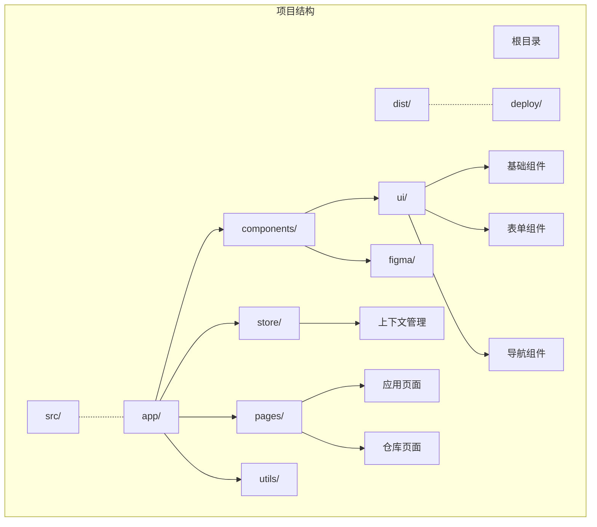
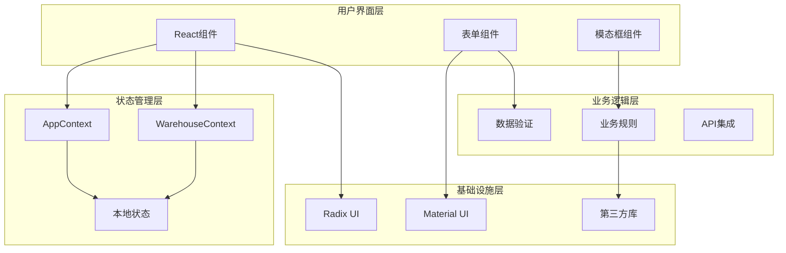
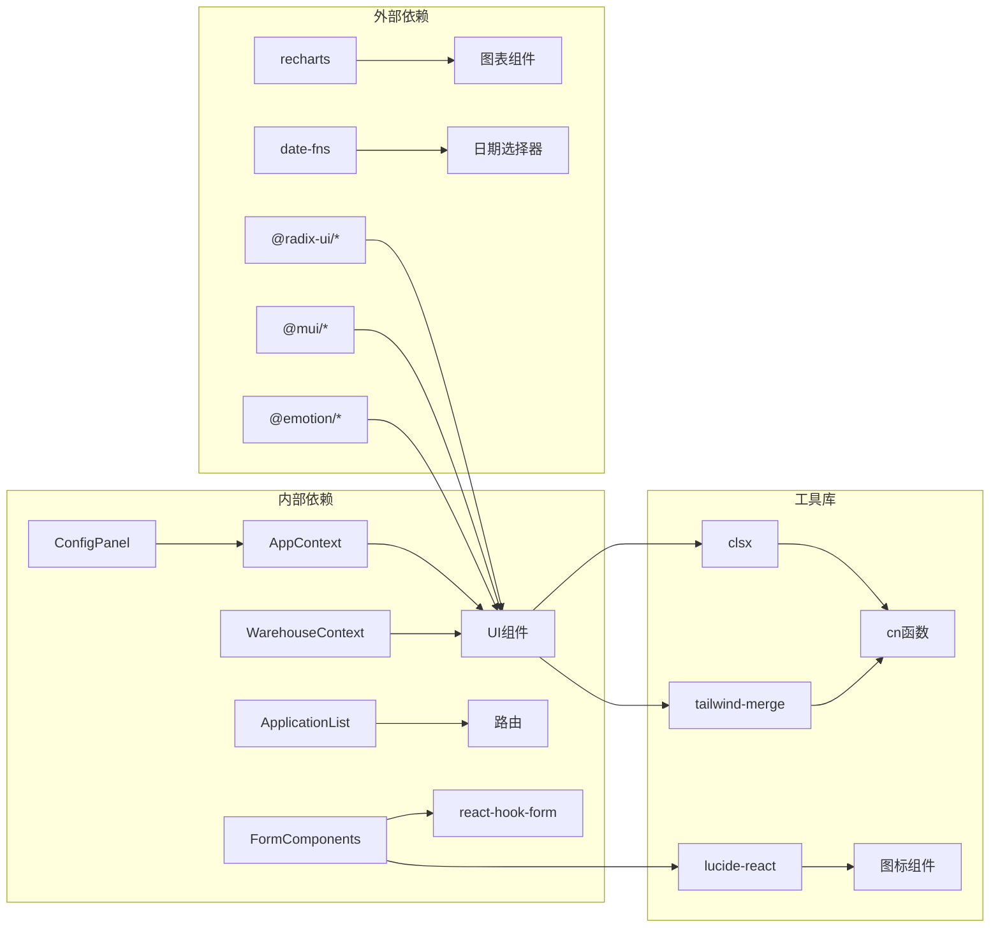

# API参考文档

<cite>
**本文档引用的文件**
- [AppContext.tsx](file://src/app/store/AppContext.tsx)
- [WarehouseContext.tsx](file://src/app/store/WarehouseContext.tsx)
- [button.tsx](file://src/app/components/ui/button.tsx)
- [dialog.tsx](file://src/app/components/ui/dialog.tsx)
- [form.tsx](file://src/app/components/ui/form.tsx)
- [ApplicationList.tsx](file://src/app/pages/ApplicationList.tsx)
- [ConfigPanel.tsx](file://src/app/components/ConfigPanel.tsx)
- [utils.ts](file://src/app/components/ui/utils.ts)
- [lib/utils.ts](file://src/lib/utils.ts)
- [use-mobile.ts](file://src/app/components/ui/use-mobile.ts)
- [package.json](file://package.json)
- [permission_AppContext.tsx](file://permission_apply/src/app/store/AppContext.tsx)
- [permission_ApplicationList.tsx](file://permission_apply/src/app/pages/ApplicationList.tsx)
- [permission_ConfigPanel.tsx](file://permission_apply/src/app/components/ConfigPanel.tsx)
</cite>

## 目录
1. [简介](#简介)
2. [项目结构](#项目结构)
3. [核心组件](#核心组件)
4. [架构概览](#架构概览)
5. [详细组件分析](#详细组件分析)
6. [依赖关系分析](#依赖关系分析)
7. [性能考虑](#性能考虑)
8. [故障排除指南](#故障排除指南)
9. [结论](#结论)

## 简介

本API参考文档详细说明了管理平台项目中的所有公共接口、组件API、Hooks接口和工具函数。该项目基于React构建，使用TypeScript进行类型安全编程，采用Radix UI作为基础组件库，并集成了多个第三方库来实现丰富的用户界面和交互功能。

项目主要分为两个模块：主应用模块和权限申请模块，两者共享相似的组件架构和状态管理模式。

## 项目结构

项目采用模块化的组织方式，主要包含以下核心目录：



**图表来源**
- [AppContext.tsx:1-64](file://src/app/store/AppContext.tsx#L1-L64)
- [WarehouseContext.tsx:1-185](file://src/app/store/WarehouseContext.tsx#L1-L185)

**章节来源**
- [package.json:1-91](file://package.json#L1-L91)

## 核心组件

### 应用状态管理

项目实现了两个主要的Context API来管理全局状态：

#### AppContext（应用上下文）
管理用户基本信息和投资相关状态：
- 账户信息：account
- 风险等级：riskLevel（C3/C4/C5）
- 资金规模：fundLevel（LT_500K/GE_500K_LT_1M/GE_1M）
- 交易经验：has50Days（boolean）
- 现有最高权限：existingMaxValue（number）
- 客户类型：customerType（'一般法人'）
- 投资者类型：investorType（'普通投资者' | '专业投资者'）
- 产品选择：selectedProducts（string[]）

#### WarehouseContext（仓库上下文）
管理仓储转移相关的业务状态：
- 交易所选择：selectedExchanges（WarehouseExchange[]）
- 交易方向：direction（OUT/IN/ACTUAL_CONTROL/''）
- 合约类型：contractType（FUTURES/OPTIONS）
- 交易日期：transferDate（string）
- 经纪商信息：out/in BrokerMemberId/Name
- 客户交易编码和姓名
- 权限管理：accountPermissions
- 仓位信息：positions（PositionRow[]）
- 附件管理：attachments
- 确认状态：confirmed（boolean）
- 备注：remark（string）

**章节来源**
- [AppContext.tsx:1-64](file://src/app/store/AppContext.tsx#L1-L64)
- [WarehouseContext.tsx:1-185](file://src/app/store/WarehouseContext.tsx#L1-L185)

## 架构概览

项目采用分层架构设计，结合React Hooks和Context API实现状态管理：



**图表来源**
- [AppContext.tsx:29-63](file://src/app/store/AppContext.tsx#L29-L63)
- [WarehouseContext.tsx:75-184](file://src/app/store/WarehouseContext.tsx#L75-L184)

## 详细组件分析

### UI组件系统

#### Button组件
Button组件提供了可变主题和尺寸的按钮，支持插槽模式渲染。

**Props/属性:**
- className: 字符串，自定义样式类
- variant: 枚举值，按钮样式变体（default/destructive/outline/secondary/ghost/link）
- size: 枚举值，按钮尺寸（default/sm/lg/icon）
- asChild: 布尔值，是否作为子元素渲染
- 其他原生button属性

**事件:**
- onClick: 点击事件处理器
- onMouseEnter: 鼠标悬停事件
- onMouseLeave: 鼠标离开事件

**使用示例:**
```typescript
// 基础按钮
<Button>点击我</Button>

// 带图标按钮
<Button variant="outline">
  <SearchIcon />
  搜索
</Button>

// 小尺寸按钮
<Button size="sm" onClick={handleClick}>
  确认
</Button>
```

**章节来源**
- [button.tsx:1-59](file://src/app/components/ui/button.tsx#L1-L59)

#### Dialog组件
Dialog组件实现了模态框的完整功能集合。

**组件导出:**
- Dialog: 根容器组件
- DialogTrigger: 触发器组件
- DialogPortal: 传送门组件
- DialogOverlay: 背景遮罩层
- DialogContent: 内容容器
- DialogHeader: 头部区域
- DialogFooter: 底部区域
- DialogTitle: 标题文本
- DialogDescription: 描述文本
- DialogClose: 关闭按钮

**Props规范:**
- 所有组件继承自对应Radix UI组件的属性
- 支持data-slot属性用于样式定制
- DialogContent支持className和children属性

**事件处理:**
- DialogTrigger: 触发模态框显示
- DialogClose: 处理模态框关闭
- Overlay: 背景点击关闭

**章节来源**
- [dialog.tsx:1-136](file://src/app/components/ui/dialog.tsx#L1-L136)

#### Form组件系统
基于react-hook-form的表单管理系统。

**核心组件:**
- Form: 表单提供者
- FormField: 字段包装器
- FormItem: 表单项容器
- FormLabel: 表单标签
- FormControl: 控制器容器
- FormDescription: 描述文本
- FormMessage: 错误消息

**Hook接口:**
- useFormField(): 获取字段状态和标识符
- useFormContext(): 访问表单上下文

**类型定义:**
```typescript
type FormFieldContextValue<
  TFieldValues extends FieldValues = FieldValues,
  TName extends FieldPath<TFieldValues> = FieldPath<TFieldValues>,
> = {
  name: TName;
};

type FormItemContextValue = {
  id: string;
};
```

**章节来源**
- [form.tsx:1-169](file://src/app/components/ui/form.tsx#L1-L169)

### 页面组件

#### ApplicationList页面
应用列表页面，展示用户发起的各类申请记录。

**状态管理:**
- 使用本地状态存储应用数据
- 支持搜索和筛选功能
- 状态指示器显示不同状态

**交互功能:**
- 行点击导航到详情页
- 状态颜色区分（蓝色进行中、橙色退回、红色失败）
- 动态内容加载

**路由集成:**
- 导航到应用详情页
- 导航到工作人员审批视图

**章节来源**
- [ApplicationList.tsx:1-178](file://src/app/pages/ApplicationList.tsx#L1-L178)

#### ConfigPanel配置面板
状态模拟面板，允许动态修改应用状态。

**功能特性:**
- 可折叠/展开的固定定位面板
- 投资者类型切换（普通/专业）
- 客户类型切换（一般法人/特种客户）
- 风险等级选择（C3/C4/C5）
- 资金规模选择
- 交易经验设置
- 现有权限赋值

**状态同步:**
- 与AppContext状态双向绑定
- 实时更新应用行为

**章节来源**
- [ConfigPanel.tsx:1-134](file://src/app/components/ConfigPanel.tsx#L1-L134)

### Hooks接口

#### useAppContext Hook
从AppContext中获取应用状态和方法。

**返回值:**
- account: 用户账户字符串
- riskLevel: 风险等级枚举
- setRiskLevel: 设置风险等级函数
- fundLevel: 资金规模枚举
- setFundLevel: 设置资金规模函数
- has50Days: 交易经验布尔值
- setHas50Days: 设置交易经验函数
- existingMaxValue: 现有最高权限数值
- setExistingMaxValue: 设置权限数值函数
- isSpecialCorp: 特种客户布尔值
- setIsSpecialCorp: 设置特种客户函数
- customerType: 客户类型字符串
- setCustomerType: 设置客户类型函数
- investorType: 投资者类型枚举
- setInvestorType: 设置投资者类型函数
- selectedProducts: 产品选择数组
- setSelectedProducts: 设置产品选择函数

**错误处理:**
- 在Context未提供时抛出错误

**章节来源**
- [AppContext.tsx:59-63](file://src/app/store/AppContext.tsx#L59-L63)

#### useWarehouseContext Hook
从WarehouseContext中获取仓储状态和方法。

**返回值:**
- 包含所有WarehouseState属性和方法
- 支持权限管理：toggleAccountPermission, hasPermissionForAccount
- 支持重置：reset()

**章节来源**
- [WarehouseContext.tsx:180-184](file://src/app/store/WarehouseContext.tsx#L180-L184)

#### useIsMobile Hook
检测设备是否为移动设备。

**参数:**
- 无参数

**返回值:**
- 布尔值：true表示移动设备，false表示桌面设备

**实现机制:**
- 使用媒体查询监听窗口宽度变化
- 默认断点为768像素

**章节来源**
- [use-mobile.ts:1-22](file://src/app/components/ui/use-mobile.ts#L1-L22)

### 工具函数

#### cn函数
类名合并工具函数，结合clsx和tailwind-merge。

**参数:**
- inputs: ClassValue类型的任意数量参数

**返回值:**
- 合并后的CSS类名字符串

**用途:**
- 条件样式类应用
- Tailwind CSS类名冲突解决

**章节来源**
- [utils.ts:1-7](file://src/app/components/ui/utils.ts#L1-L7)
- [lib/utils.ts:1-6](file://src/lib/utils.ts#L1-L6)

## 依赖关系分析

项目依赖关系展示了各模块间的耦合程度和外部依赖：



**图表来源**
- [package.json:11-66](file://package.json#L11-L66)

**章节来源**
- [package.json:1-91](file://package.json#L1-L91)

## 性能考虑

### 状态管理优化
- Context拆分：将应用状态和仓储状态分离，避免不必要的重渲染
- Hook封装：通过自定义Hook提供精确的状态访问
- 条件渲染：使用useIsMobile Hook实现响应式布局

### 组件性能
- 类名合并：使用cn函数减少DOM节点数量
- 条件渲染：根据状态动态显示/隐藏组件
- 事件委托：合理使用事件处理器避免重复绑定

### 数据流优化
- 单向数据流：确保状态变更的可预测性
- 批量更新：在可能的情况下合并状态更新
- 缓存策略：对静态数据使用缓存机制

## 故障排除指南

### 常见问题及解决方案

#### Context未提供错误
**症状:** 使用useAppContext或useWarehouseContext时报错
**原因:** 在Provider外部使用了Hook
**解决方案:** 确保在对应的Provider组件内使用Hook

#### 样式冲突问题
**症状:** 组件样式异常或覆盖
**原因:** Tailwind CSS类名冲突
**解决方案:** 使用cn函数合并类名，避免直接覆盖

#### 表单验证问题
**症状:** 表单验证不生效或错误信息不显示
**原因:** react-hook-form配置错误
**解决方案:** 检查FormField包装和useFormField调用

#### 移动端适配问题
**症状:** 移动端显示异常
**原因:** 断点设置不当
**解决方案:** 调整useIsMobile的断点值

**章节来源**
- [AppContext.tsx:60-62](file://src/app/store/AppContext.tsx#L60-L62)
- [WarehouseContext.tsx:181-183](file://src/app/store/WarehouseContext.tsx#L181-L183)

## 结论

本API参考文档全面介绍了管理平台项目的组件架构、状态管理和工具函数。项目采用现代化的React开发模式，结合TypeScript实现强类型安全，通过Context API实现状态共享，利用Radix UI提供可靠的UI基础。

主要特点包括：
- 清晰的模块化架构
- 完善的TypeScript类型定义
- 灵活的组件系统
- 优秀的移动端适配
- 可扩展的状态管理方案

开发者可以基于此文档快速理解和使用项目中的各种API接口，同时遵循最佳实践进行二次开发和功能扩展。