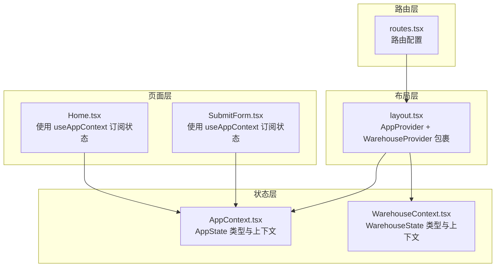
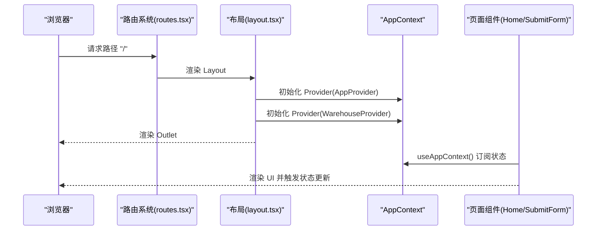
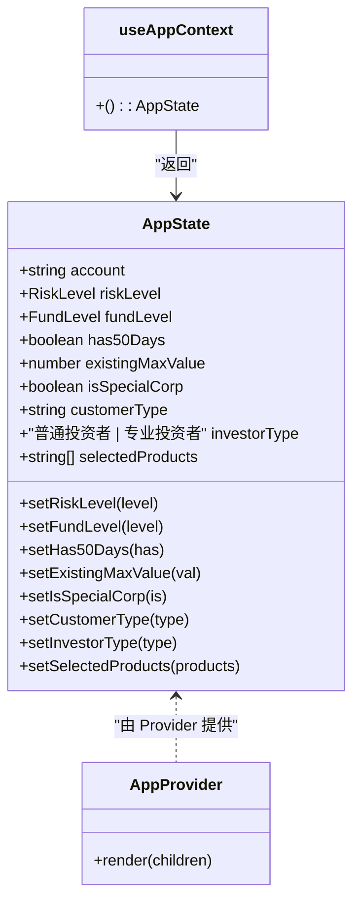
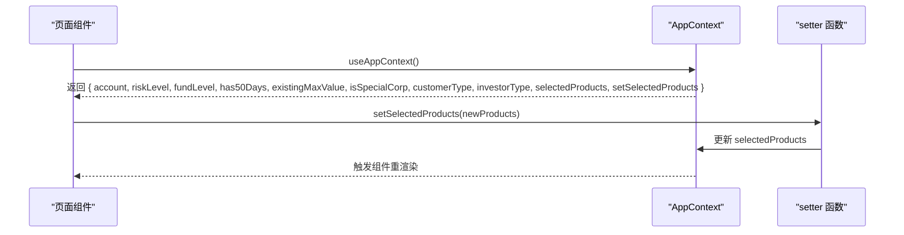
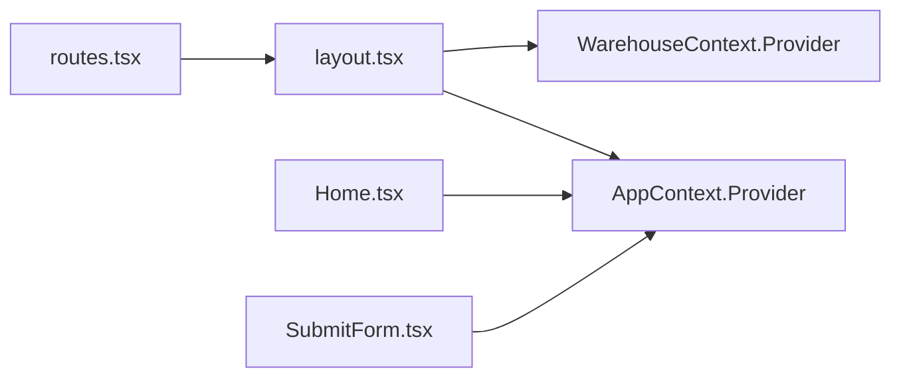
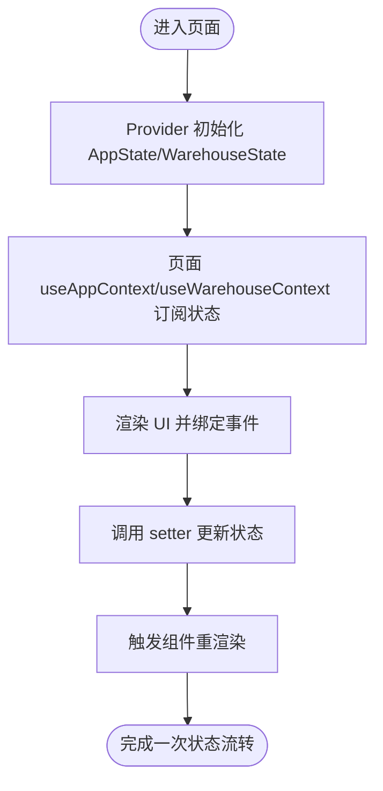

# Context API

<cite>
**本文档引用的文件**
- [AppContext.tsx](file://src/app/store/AppContext.tsx)
- [WarehouseContext.tsx](file://src/app/store/WarehouseContext.tsx)
- [layout.tsx](file://src/app/layout.tsx)
- [Home.tsx](file://src/app/pages/Home.tsx)
- [SubmitForm.tsx](file://src/app/pages/SubmitForm.tsx)
- [routes.tsx](file://src/app/routes.tsx)
</cite>

## 目录
1. [简介](#简介)
2. [项目结构](#项目结构)
3. [核心组件](#核心组件)
4. [架构总览](#架构总览)
5. [详细组件分析](#详细组件分析)
6. [依赖关系分析](#依赖关系分析)
7. [性能考量](#性能考量)
8. [故障排查指南](#故障排查指南)
9. [结论](#结论)
10. [附录](#附录)

## 简介
本文件系统化梳理项目中的 Context API，重点围绕应用状态管理的 Context 接口设计与使用模式，覆盖：
- AppState 接口字段与方法签名
- 状态结构与更新方法
- Context Provider 的使用方式与最佳实践
- useContext Hook 的调用规范
- 状态初始化、订阅与更新流程
- TypeScript 类型定义与状态管理模式示例

## 项目结构
项目采用按功能模块划分的目录组织，Context 层位于 store 目录，页面层位于 pages 目录，布局层负责 Provider 包裹，路由层统一管理页面跳转。



图表来源
- [layout.tsx:80-82](file://src/app/layout.tsx#L80-L82)
- [AppContext.tsx:29-56](file://src/app/store/AppContext.tsx#L29-L56)
- [WarehouseContext.tsx:75-177](file://src/app/store/WarehouseContext.tsx#L75-L177)
- [Home.tsx:61-64](file://src/app/pages/Home.tsx#L61-L64)
- [SubmitForm.tsx:57-60](file://src/app/pages/SubmitForm.tsx#L57-L60)
- [routes.tsx:18-38](file://src/app/routes.tsx#L18-L38)

章节来源
- [layout.tsx:80-82](file://src/app/layout.tsx#L80-L82)
- [routes.tsx:18-38](file://src/app/routes.tsx#L18-L38)

## 核心组件
本项目包含两个主要 Context：
- 应用级状态上下文：AppContext，提供交易权限申请相关的全局状态与更新方法
- 移仓业务上下文：WarehouseContext，提供移仓业务相关的全局状态与更新方法

章节来源
- [AppContext.tsx:6-27](file://src/app/store/AppContext.tsx#L6-L27)
- [WarehouseContext.tsx:19-73](file://src/app/store/WarehouseContext.tsx#L19-L73)

## 架构总览
整体架构采用“布局层包裹 + 页面层订阅”的模式：
- 布局层在根节点同时包裹 AppProvider 和 WarehouseProvider，确保所有页面均可访问两类状态
- 页面层通过对应的 useContext Hook 获取状态与更新函数
- 路由层统一管理页面跳转，页面间共享状态通过 Context 实现



图表来源
- [routes.tsx:18-38](file://src/app/routes.tsx#L18-L38)
- [layout.tsx:80-82](file://src/app/layout.tsx#L80-L82)
- [AppContext.tsx:31-56](file://src/app/store/AppContext.tsx#L31-L56)
- [WarehouseContext.tsx:77-177](file://src/app/store/WarehouseContext.tsx#L77-L177)
- [Home.tsx:61-64](file://src/app/pages/Home.tsx#L61-L64)
- [SubmitForm.tsx:57-60](file://src/app/pages/SubmitForm.tsx#L57-L60)

## 详细组件分析

### AppContext（应用状态）
- 类型定义与字段
  - 字段：账户号、风险等级、资金等级、是否满足50天、现有最大值、是否为特殊公司、客户类型、投资者类型、已选产品集合
  - 更新方法：对应字段的 setter 函数
- Provider 初始化
  - 使用 useState 初始化各字段，并将状态与 setter 组合后通过 Provider value 传递
- Hook 使用
  - useAppContext 返回 AppState，页面组件通过解构获取所需状态与 setter



图表来源
- [AppContext.tsx:6-27](file://src/app/store/AppContext.tsx#L6-L27)
- [AppContext.tsx:29-56](file://src/app/store/AppContext.tsx#L29-L56)
- [AppContext.tsx:59-63](file://src/app/store/AppContext.tsx#L59-L63)

章节来源
- [AppContext.tsx:6-27](file://src/app/store/AppContext.tsx#L6-L27)
- [AppContext.tsx:29-56](file://src/app/store/AppContext.tsx#L29-L56)
- [AppContext.tsx:59-63](file://src/app/store/AppContext.tsx#L59-L63)

### WarehouseContext（移仓业务状态）
- 类型定义与字段
  - 基础信息：账户、客户名、分支、客户类型
  - 过户参数：交易所集合、方向、合约类型、过户日期、出入场经纪商成员编号/名称、客户端交易编码/名称、实际控制账户/名称、权限映射、DCE 按数量过户选项、过户原因、持仓明细、附件列表、确认状态、备注
  - 方法：权限切换、权限查询、重置
- Provider 初始化
  - 使用 useState 初始化各字段，构建权限映射与工具方法，最后通过 Provider value 传递
- Hook 使用
  - useWarehouseContext 返回 WarehouseState，页面组件通过解构获取状态与方法

```mermaid
classDiagram
class WarehouseState {
+string account
+string customerName
+string branch
+string customerType
+WarehouseExchange[] selectedExchanges
+setSelectedExchanges(val)
+WarehouseDirection direction
+setDirection(val)
+ContractType contractType
+setContractType(val)
+string transferDate
+setTransferDate(val)
+string outBrokerMemberId
+setOutBrokerMemberId(val)
+string outBrokerName
+setOutBrokerName(val)
+string inBrokerMemberId
+setInBrokerMemberId(val)
+string inBrokerName
+setInBrokerName(val)
+Record~WarehouseExchange,string~ outClientTradingCodes
+setOutClientTradingCodes(val)
+Record~WarehouseExchange,string~ outClientNames
+setOutClientNames(val)
+Record~WarehouseExchange,string~ inClientTradingCodes
+setInClientTradingCodes(val)
+string inClientName
+setInClientName(val)
+string actualControlOutAccount
+setActualControlOutAccount(val)
+string actualControlOutName
+setActualControlOutName(val)
+string actualControlInAccount
+setActualControlInAccount(val)
+string actualControlInName
+setActualControlInName(val)
+Record~string,boolean~ accountPermissions
+toggleAccountPermission(account)
+hasPermissionForAccount(account) boolean
+"YES | NO | \"\"" dceTransferByQuantity
+setDceTransferByQuantity(val)
+string transferReason
+setTransferReason(val)
+PositionRow[] positions
+setPositions(positions)
+{name : string,size : string}[] attachments
+setAttachments(attachments)
+boolean confirmed
+setConfirmed(val)
+string remark
+setRemark(val)
+reset()
}
class WarehouseProvider {
+render(children)
}
class useWarehouseContext {
+() : WarehouseState
}
WarehouseState <.. WarehouseProvider : "由 Provider 提供"
useWarehouseContext --> WarehouseState : "返回"
```

图表来源
- [WarehouseContext.tsx:19-73](file://src/app/store/WarehouseContext.tsx#L19-L73)
- [WarehouseContext.tsx:75-177](file://src/app/store/WarehouseContext.tsx#L75-L177)
- [WarehouseContext.tsx:180-184](file://src/app/store/WarehouseContext.tsx#L180-L184)

章节来源
- [WarehouseContext.tsx:19-73](file://src/app/store/WarehouseContext.tsx#L19-L73)
- [WarehouseContext.tsx:75-177](file://src/app/store/WarehouseContext.tsx#L75-L177)
- [WarehouseContext.tsx:180-184](file://src/app/store/WarehouseContext.tsx#L180-L184)

### 页面使用模式（Home 与 SubmitForm）
- Home
  - 订阅 useAppContext，读取账户、风险等级、资金等级、是否满足50天、现有最大值、是否为特殊公司、客户类型、投资者类型、已选产品集合
  - 通过 setSelectedProducts 等 setter 更新状态
- SubmitForm
  - 订阅 useAppContext，读取账户、风险等级、客户类型、投资者类型、是否为特殊公司、已选产品集合
  - 根据业务逻辑判断提交条件并更新状态



图表来源
- [Home.tsx:61-64](file://src/app/pages/Home.tsx#L61-L64)
- [SubmitForm.tsx:57-60](file://src/app/pages/SubmitForm.tsx#L57-L60)
- [AppContext.tsx:31-56](file://src/app/store/AppContext.tsx#L31-L56)

章节来源
- [Home.tsx:61-64](file://src/app/pages/Home.tsx#L61-L64)
- [SubmitForm.tsx:57-60](file://src/app/pages/SubmitForm.tsx#L57-L60)

## 依赖关系分析
- Provider 包裹顺序
  - 布局层先包裹 AppProvider，再包裹 WarehouseProvider，保证两套上下文均对子树生效
- 页面依赖
  - Home 与 SubmitForm 仅依赖 AppContext，不依赖 WarehouseContext
  - Warehouse 相关页面依赖 WarehouseContext
- 路由与布局
  - 路由层将 Layout 作为根组件，确保所有页面均处于 Provider 包裹之下



图表来源
- [routes.tsx:18-38](file://src/app/routes.tsx#L18-L38)
- [layout.tsx:80-82](file://src/app/layout.tsx#L80-L82)
- [AppContext.tsx:29-56](file://src/app/store/AppContext.tsx#L29-L56)
- [WarehouseContext.tsx:75-177](file://src/app/store/WarehouseContext.tsx#L75-L177)
- [Home.tsx:61-64](file://src/app/pages/Home.tsx#L61-L64)
- [SubmitForm.tsx:57-60](file://src/app/pages/SubmitForm.tsx#L57-L60)

章节来源
- [layout.tsx:80-82](file://src/app/layout.tsx#L80-L82)
- [routes.tsx:18-38](file://src/app/routes.tsx#L18-L38)

## 性能考量
- Provider 层级
  - 同时包裹两套 Provider，建议避免深层嵌套导致的重渲染放大；可通过拆分更细粒度的 Provider 或按需加载策略优化
- 状态粒度
  - AppContext 与 WarehouseContext 分离，有助于减少无关状态更新带来的重渲染
- 订阅范围
  - 页面仅订阅自身所需的字段，避免过度解构导致不必要的重渲染

## 故障排查指南
- 错误：在 Provider 外部使用 Hook
  - 现象：useAppContext 抛出错误
  - 原因：未在 AppProvider 包裹下使用
  - 解决：确保页面根部存在 AppProvider 包裹
- 状态未更新
  - 现象：UI 未反映最新状态
  - 原因：未正确调用 setter 或未在正确的上下文中使用
  - 解决：检查页面是否在 AppProvider/WarehouseProvider 下方，确认调用的是对应 Context 的 setter
- 状态冲突
  - 现象：多个页面同时更新同一状态导致不可预期行为
  - 原因：共享状态未做边界控制
  - 解决：为不同业务域划分独立 Context，或在页面内部聚合状态

章节来源
- [AppContext.tsx:59-63](file://src/app/store/AppContext.tsx#L59-L63)
- [WarehouseContext.tsx:180-184](file://src/app/store/WarehouseContext.tsx#L180-L184)

## 结论
本项目通过 AppContext 与 WarehouseContext 实现了清晰的应用状态管理：
- 明确的类型定义与 Provider 初始化
- 页面层通过 useContext Hook 订阅状态与更新
- 布局层统一包裹，确保全局可用
遵循上述最佳实践，可在复杂业务场景中保持状态一致性与可维护性。

## 附录

### AppState 接口字段与方法签名
- 字段
  - account: string
  - riskLevel: RiskLevel
  - fundLevel: FundLevel
  - has50Days: boolean
  - existingMaxValue: number
  - isSpecialCorp: boolean
  - customerType: '一般法人'
  - investorType: '普通投资者' | '专业投资者'
  - selectedProducts: string[]
- 方法
  - setRiskLevel(level: RiskLevel): void
  - setFundLevel(level: FundLevel): void
  - setHas50Days(has: boolean): void
  - setExistingMaxValue(val: number): void
  - setIsSpecialCorp(is: boolean): void
  - setCustomerType(type: '一般法人'): void
  - setInvestorType(type: '普通投资者' | '专业投资者'): void
  - setSelectedProducts(products: string[]): void

章节来源
- [AppContext.tsx:6-27](file://src/app/store/AppContext.tsx#L6-L27)

### WarehouseState 接口字段与方法签名
- 字段
  - account: string
  - customerName: string
  - branch: string
  - customerType: string
  - selectedExchanges: WarehouseExchange[]
  - direction: WarehouseDirection | ''
  - contractType: ContractType
  - transferDate: string
  - outBrokerMemberId: string
  - outBrokerName: string
  - inBrokerMemberId: string
  - inBrokerName: string
  - outClientTradingCodes: Record<WarehouseExchange, string>
  - outClientNames: Record<WarehouseExchange, string>
  - inClientTradingCodes: Record<WarehouseExchange, string>
  - inClientName: string
  - actualControlOutAccount: string
  - actualControlOutName: string
  - actualControlInAccount: string
  - actualControlInName: string
  - accountPermissions: Record<string, boolean>
  - dceTransferByQuantity: 'YES' | 'NO' | ''
  - transferReason: string
  - positions: PositionRow[]
  - attachments: { name: string; size: string }[]
  - confirmed: boolean
  - remark: string
- 方法
  - setSelectedExchanges(val: WarehouseExchange[]): void
  - setDirection(val: WarehouseDirection | ''): void
  - setContractType(val: ContractType): void
  - setTransferDate(val: string): void
  - setOutBrokerMemberId(val: string): void
  - setOutBrokerName(val: string): void
  - setInBrokerMemberId(val: string): void
  - setInBrokerName(val: string): void
  - setOutClientTradingCodes(val: Record<WarehouseExchange, string>): void
  - setOutClientNames(val: Record<WarehouseExchange, string>): void
  - setInClientTradingCodes(val: Record<WarehouseExchange, string>): void
  - setInClientName(val: string): void
  - setActualControlOutAccount(val: string): void
  - setActualControlOutName(val: string): void
  - setActualControlInAccount(val: string): void
  - setActualControlInName(val: string): void
  - setDceTransferByQuantity(val: 'YES' | 'NO' | ''): void
  - setTransferReason(val: string): void
  - setPositions(positions: PositionRow[]): void
  - setAttachments(attachments: { name: string; size: string }[]): void
  - setConfirmed(val: boolean): void
  - setRemark(val: string): void
  - toggleAccountPermission(account: string): void
  - hasPermissionForAccount(account: string): boolean
  - reset(): void

章节来源
- [WarehouseContext.tsx:19-73](file://src/app/store/WarehouseContext.tsx#L19-L73)

### Context Provider 使用方式与最佳实践
- Provider 包裹
  - 在布局层统一包裹 AppProvider 与 WarehouseProvider，确保全局可用
- 初始化
  - 在 Provider 中使用 useState 初始化状态，避免在组件外部直接修改
- 订阅
  - 页面通过 useContext 获取状态与 setter，仅订阅所需字段
- 更新
  - 通过 setter 更新状态，避免直接修改上下文对象
- 错误处理
  - 若 Hook 返回 undefined，抛出明确错误提示

章节来源
- [layout.tsx:80-82](file://src/app/layout.tsx#L80-L82)
- [AppContext.tsx:31-56](file://src/app/store/AppContext.tsx#L31-L56)
- [WarehouseContext.tsx:77-177](file://src/app/store/WarehouseContext.tsx#L77-L177)
- [AppContext.tsx:59-63](file://src/app/store/AppContext.tsx#L59-L63)
- [WarehouseContext.tsx:180-184](file://src/app/store/WarehouseContext.tsx#L180-L184)

### 状态初始化、订阅与更新流程


图表来源
- [AppContext.tsx:31-56](file://src/app/store/AppContext.tsx#L31-L56)
- [WarehouseContext.tsx:77-177](file://src/app/store/WarehouseContext.tsx#L77-L177)
- [Home.tsx:61-64](file://src/app/pages/Home.tsx#L61-L64)
- [SubmitForm.tsx:57-60](file://src/app/pages/SubmitForm.tsx#L57-L60)