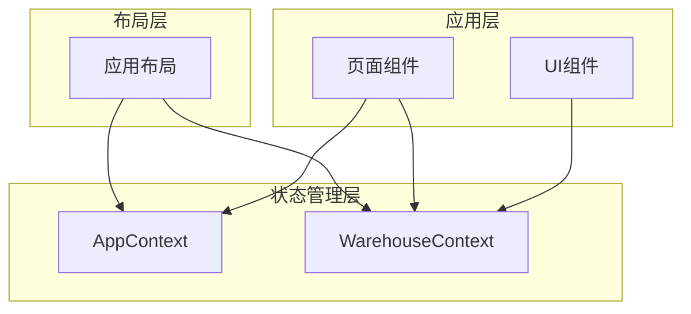
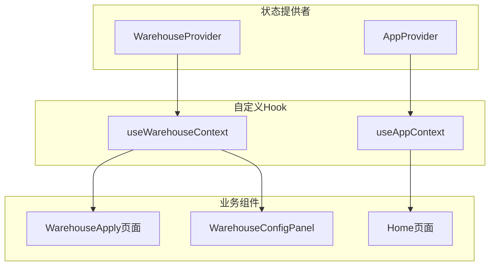
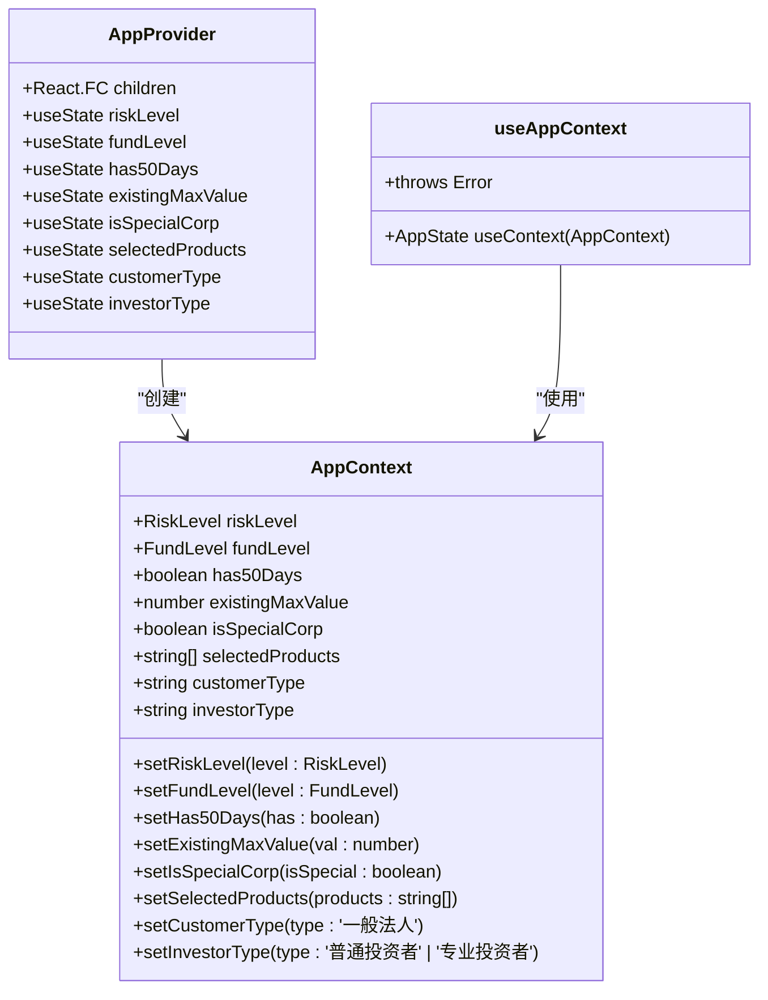
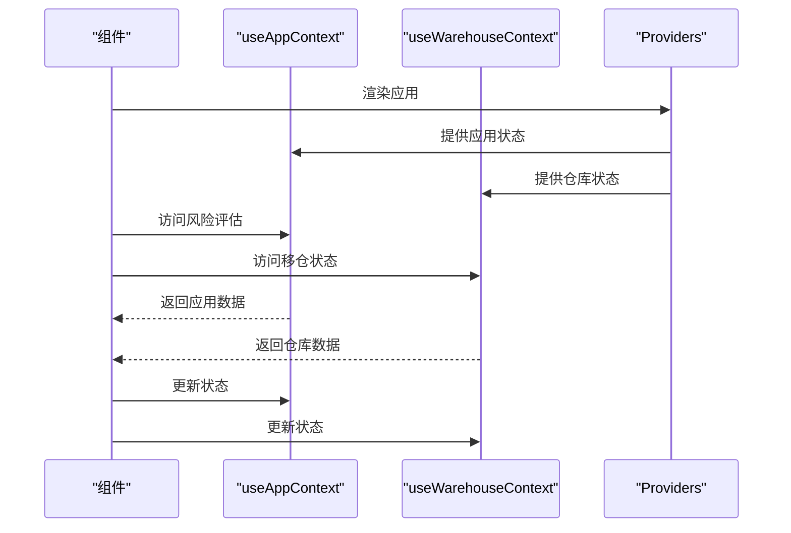
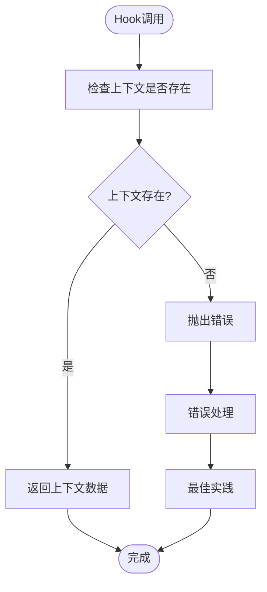
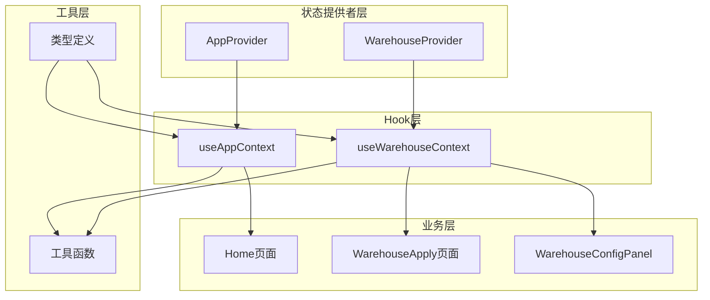

# Hooks接口

<cite>
**本文档引用的文件**
- [AppContext.tsx](file://src/app/store/AppContext.tsx)
- [WarehouseContext.tsx](file://src/app/store/WarehouseContext.tsx)
- [layout.tsx](file://src/app/layout.tsx)
- [WarehouseApply.tsx](file://src/app/pages/WarehouseApply.tsx)
- [WarehouseConfigPanel.tsx](file://src/app/components/WarehouseConfigPanel.tsx)
- [Home.tsx](file://src/app/pages/Home.tsx)
- [permission_AppContext.tsx](file://permission_apply/src/app/store/AppContext.tsx)
</cite>

## 目录
1. [简介](#简介)
2. [项目结构](#项目结构)
3. [核心组件](#核心组件)
4. [架构概览](#架构概览)
5. [详细组件分析](#详细组件分析)
6. [依赖分析](#依赖分析)
7. [性能考虑](#性能考虑)
8. [故障排除指南](#故障排除指南)
9. [结论](#结论)
10. [附录](#附录)

## 简介
本文档详细说明了项目中的自定义Hook接口，特别是useAppContext和useWarehouseContext两个核心Hook。这些Hook提供了应用状态管理和业务逻辑封装，支持权限申请和仓库转移等业务场景。

## 项目结构
项目采用模块化的架构设计，主要包含以下关键目录：
- `src/app/store/` - 存放状态管理相关的Context和Hook
- `src/app/pages/` - 页面组件，展示Hook的实际使用场景
- `src/app/components/` - 可复用的UI组件
- `permission_apply/` - 权限申请子系统的独立实现



**图表来源**
- [layout.tsx:80-175](file://src/app/layout.tsx#L80-L175)
- [AppContext.tsx:1-64](file://src/app/store/AppContext.tsx#L1-L64)
- [WarehouseContext.tsx:1-185](file://src/app/store/WarehouseContext.tsx#L1-L185)

**章节来源**
- [layout.tsx:80-175](file://src/app/layout.tsx#L80-L175)

## 核心组件

### useAppContext Hook
useAppContext是一个用于访问应用全局状态的自定义Hook，提供风险评估、资金状况和产品选择等相关状态管理功能。

**返回值类型**：
- `account`: string - 客户账号
- `riskLevel`: RiskLevel - 风险评估等级（'C3' | 'C4' | 'C5'）
- `setRiskLevel(level: RiskLevel)`: Function - 设置风险等级
- `fundLevel`: FundLevel - 资金规模等级
- `setFundLevel(level: FundLevel)`: Function - 设置资金规模
- `has50Days`: boolean - 是否满足50天条件
- `setHas50Days(has: boolean)`: Function - 设置50天条件状态
- `existingMaxValue`: number - 现有最大值
- `setExistingMaxValue(val: number)`: Function - 设置现有最大值
- `isSpecialCorp`: boolean - 是否为特殊公司
- `setIsSpecialCorp(isSpecial: boolean)`: Function - 设置特殊公司状态
- `selectedProducts`: string[] - 已选择的产品列表
- `setSelectedProducts(products: string[])`: Function - 设置选择的产品
- `customerType`: '一般法人' - 客户类型
- `setCustomerType(type: '一般法人')`: Function - 设置客户类型
- `investorType`: '普通投资者' | '专业投资者' - 投资者类型
- `setInvestorType(type: '普通投资者' | '专业投资者')`: Function - 设置投资者类型

**使用场景**：
- 用户风险评估和适当性管理
- 产品权限申请流程
- 客户信息维护

**章节来源**
- [AppContext.tsx:6-27](file://src/app/store/AppContext.tsx#L6-L27)
- [AppContext.tsx:59-63](file://src/app/store/AppContext.tsx#L59-L63)

### useWarehouseContext Hook
useWarehouseContext是专门用于仓库转移业务的状态管理Hook，提供完整的移仓申请表单状态管理。

**返回值类型**：
- `account`: string - 客户账号
- `customerName`: string - 客户名称
- `branch`: string - 所属分支
- `customerType`: string - 客户类型
- `selectedExchanges`: WarehouseExchange[] - 选择的交易所列表
- `setSelectedExchanges(val: WarehouseExchange[])`: Function - 设置交易所
- `direction`: WarehouseDirection | '' - 移仓方向
- `setDirection(val: WarehouseDirection | '')`: Function - 设置移仓方向
- `contractType`: ContractType - 合约类型
- `setContractType(val: ContractType)`: Function - 设置合约类型
- `transferDate`: string - 移仓日期
- `setTransferDate(val: string)`: Function - 设置移仓日期
- `outBrokerMemberId`: string - 移出方会员号
- `setOutBrokerMemberId(val: string)`: Function - 设置移出方会员号
- `outBrokerName`: string - 移出方名称
- `setOutBrokerName(val: string)`: Function - 设置移出方名称
- `inBrokerMemberId`: string - 移入方会员号
- `setInBrokerMemberId(val: string)`: Function - 设置移入方会员号
- `inBrokerName`: string - 移入方名称
- `setInBrokerName(val: string)`: Function - 设置移入方名称
- `outClientTradingCodes`: Record<WarehouseExchange, string> - 移出方交易编码
- `setOutClientTradingCodes(val: Record<WarehouseExchange, string>)`: Function - 设置移出方交易编码
- `outClientNames`: Record<WarehouseExchange, string> - 移出方客户名称
- `setOutClientNames(val: Record<WarehouseExchange, string>)`: Function - 设置移出方客户名称
- `inClientTradingCodes`: Record<WarehouseExchange, string> - 移入方交易编码
- `setInClientTradingCodes(val: Record<WarehouseExchange, string>)`: Function - 设置移入方交易编码
- `inClientName`: string - 移入方客户名称
- `setInClientName(val: string)`: Function - 设置移入方客户名称
- `actualControlOutAccount`: string - 实控组移出账号
- `setActualControlOutAccount(val: string)`: Function - 设置实控组移出账号
- `actualControlOutName`: string - 实控组移出客户名称
- `setActualControlOutName(val: string)`: Function - 设置实控组移出客户名称
- `actualControlInAccount`: string - 实控组移入账号
- `setActualControlInAccount(val: string)`: Function - 设置实控组移入账号
- `actualControlInName`: string - 实控组移入客户名称
- `setActualControlInName(val: string)`: Function - 设置实控组移入客户名称
- `accountPermissions`: Record<string, boolean> - 账号权限映射
- `toggleAccountPermission(account: string)`: Function - 切换账号权限
- `hasPermissionForAccount(account: string)`: Function - 检查账号权限
- `dceTransferByQuantity`: 'YES' | 'NO' | '' - 大商所按量移仓
- `setDceTransferByQuantity(val: 'YES' | 'NO' | '')`: Function - 设置大商所按量移仓
- `transferReason`: string - 移仓申请理由
- `setTransferReason(val: string)`: Function - 设置移仓申请理由
- `positions`: PositionRow[] - 合约明细列表
- `setPositions(positions: PositionRow[])`: Function - 设置合约明细
- `attachments`: { name: string; size: string }[] - 附件列表
- `setAttachments(attachments: { name: string; size: string }[])`: Function - 设置附件
- `confirmed`: boolean - 确认状态
- `setConfirmed(val: boolean)`: Function - 设置确认状态
- `remark`: string - 备注信息
- `setRemark(val: string)`: Function - 设置备注
- `reset()`: Function - 重置所有状态

**PositionRow 接口**：
- `id`: string - 唯一标识符
- `exchange`: string - 交易所代码
- `varietyName`: string - 品种名称
- `contractCode`: string - 合约代码
- `positionDirection`: 'BUY' | 'SELL' | 'ALL' - 持仓方向
- `hedgeType`: 'SPEC' | 'HEDGE' | '' - 套保类型
- `lots`: number - 手数
- `transferFunds`: number - 转移资金
- `remark`: string - 备注

**使用场景**：
- 期货公司间的移仓业务申请
- 实控组账户间移仓
- 合约明细管理
- 附件上传和状态跟踪

**章节来源**
- [WarehouseContext.tsx:7-73](file://src/app/store/WarehouseContext.tsx#L7-L73)
- [WarehouseContext.tsx:180-184](file://src/app/store/WarehouseContext.tsx#L180-L184)

## 架构概览



**图表来源**
- [AppContext.tsx:31-57](file://src/app/store/AppContext.tsx#L31-L57)
- [WarehouseContext.tsx:77-178](file://src/app/store/WarehouseContext.tsx#L77-L178)
- [layout.tsx:81-172](file://src/app/layout.tsx#L81-L172)

## 详细组件分析

### AppProvider 和 useAppContext 的实现



**图表来源**
- [AppContext.tsx:6-27](file://src/app/store/AppContext.tsx#L6-L27)
- [AppContext.tsx:29-63](file://src/app/store/AppContext.tsx#L29-L63)

### WarehouseProvider 和 useWarehouseContext 的实现

```mermaid
classDiagram
class WarehouseState {
+string account
+string customerName
+string branch
+string customerType
+WarehouseExchange[] selectedExchanges
+WarehouseDirection direction
+ContractType contractType
+string transferDate
+string outBrokerMemberId
+string outBrokerName
+string inBrokerMemberId
+string inBrokerName
+Record<WarehouseExchange, string> outClientTradingCodes
+Record<WarehouseExchange, string> outClientNames
+Record<WarehouseExchange, string> inClientTradingCodes
+string inClientName
+string actualControlOutAccount
+string actualControlOutName
+string actualControlInAccount
+string actualControlInName
+Record<string, boolean> accountPermissions
+string transferReason
+PositionRow[] positions
+{name : string; size : string}[] attachments
+boolean confirmed
+string remark
+toggleAccountPermission(account : string)
+hasPermissionForAccount(account : string)
+reset()
}
class WarehouseProvider {
+React.FC children
+useState selectedExchanges
+useState direction
+useState contractType
+useState transferDate
+useState outBrokerMemberId
+useState outBrokerName
+useState inBrokerMemberId
+useState inBrokerName
+useState outClientTradingCodes
+useState outClientNames
+useState inClientTradingCodes
+useState inClientName
+useState actualControlOutAccount
+useState actualControlOutName
+useState actualControlInAccount
+useState actualControlInName
+useState accountPermissions
+useState dceTransferByQuantity
+useState transferReason
+useState positions
+useState attachments
+useState confirmed
+useState remark
+reset()
}
class useWarehouseContext {
+WarehouseState useContext(WarehouseContext)
+throws Error
}
WarehouseProvider --> WarehouseState : "创建"
useWarehouseContext --> WarehouseState : "使用"
```

**图表来源**
- [WarehouseContext.tsx:19-73](file://src/app/store/WarehouseContext.tsx#L19-L73)
- [WarehouseContext.tsx:75-184](file://src/app/store/WarehouseContext.tsx#L75-L184)

### Hook 使用模式

#### 组合使用模式



**图表来源**
- [layout.tsx:81-172](file://src/app/layout.tsx#L81-L172)
- [Home.tsx:64-64](file://src/app/pages/Home.tsx#L64-L64)
- [WarehouseApply.tsx:187-187](file://src/app/pages/WarehouseApply.tsx#L187-L187)

#### 错误处理模式



**图表来源**
- [AppContext.tsx:59-63](file://src/app/store/AppContext.tsx#L59-L63)
- [WarehouseContext.tsx:180-184](file://src/app/store/WarehouseContext.tsx#L180-L184)

**章节来源**
- [WarehouseApply.tsx:169-183](file://src/app/pages/WarehouseApply.tsx#L169-L183)
- [WarehouseConfigPanel.tsx:14-14](file://src/app/components/WarehouseConfigPanel.tsx#L14-L14)

## 依赖分析

### 组件耦合关系



**图表来源**
- [layout.tsx:81-172](file://src/app/layout.tsx#L81-L172)
- [Home.tsx:64-64](file://src/app/pages/Home.tsx#L64-L64)
- [WarehouseApply.tsx:27-27](file://src/app/pages/WarehouseApply.tsx#L27-L27)

### 依赖关系特点

1. **低耦合高内聚**：每个Hook只关注特定领域的状态管理
2. **单一职责原则**：AppContext负责应用级状态，WarehouseContext负责业务级状态
3. **可复用性**：Hook设计支持跨组件复用
4. **类型安全**：完整的TypeScript类型定义确保编译时类型检查

**章节来源**
- [AppContext.tsx:1-64](file://src/app/store/AppContext.tsx#L1-L64)
- [WarehouseContext.tsx:1-185](file://src/app/store/WarehouseContext.tsx#L1-L185)

## 性能考虑

### 状态更新优化

1. **批量状态更新**：使用对象展开运算符避免不必要的重渲染
2. **状态分离**：将高频更新和低频更新的状态分离到不同的Context中
3. **记忆化**：对于复杂的计算结果使用useMemo进行缓存

### 渲染优化策略

1. **细粒度更新**：只在必要时触发状态更新
2. **防抖处理**：对频繁的状态更新添加防抖机制
3. **虚拟化**：对于大量数据的列表使用虚拟化技术

### 内存管理

1. **清理机制**：确保在组件卸载时清理相关的状态监听器
2. **引用稳定**：使用useCallback确保回调函数引用的稳定性

## 故障排除指南

### 常见错误及解决方案

#### 1. Hook使用错误
**问题**：在没有Provider的情况下使用Hook
**解决方案**：确保在应用根部正确嵌套Provider

**章节来源**
- [AppContext.tsx:61-62](file://src/app/store/AppContext.tsx#L61-L62)
- [WarehouseContext.tsx:182-183](file://src/app/store/WarehouseContext.tsx#L182-L183)

#### 2. 类型不匹配错误
**问题**：传递给Hook的状态类型不正确
**解决方案**：严格遵循TypeScript类型定义，使用正确的枚举值

#### 3. 状态同步问题
**问题**：多个Hook之间的状态不同步
**解决方案**：确保所有相关组件都在同一个Provider树下

### 调试技巧

1. **开发者工具**：使用React DevTools检查组件树和状态
2. **日志记录**：在关键状态更新点添加日志
3. **单元测试**：为Hook编写单元测试确保行为正确

**章节来源**
- [WarehouseApply.tsx:319-380](file://src/app/pages/WarehouseApply.tsx#L319-L380)

## 结论
本项目的自定义Hook设计体现了良好的软件工程实践：

1. **清晰的职责分离**：AppContext和WarehouseContext分别处理应用级和业务级状态
2. **强类型支持**：完整的TypeScript类型定义确保类型安全
3. **可扩展性**：Hook设计支持未来功能扩展
4. **易用性**：简洁的API设计降低使用复杂度

这些Hook为整个应用提供了稳定可靠的状态管理基础，支持复杂的业务场景同时保持代码的可维护性。

## 附录

### TypeScript类型定义摘要

**RiskLevel枚举**：'C3' | 'C4' | 'C5'
**FundLevel枚举**：'LT_500K' | 'GE_500K_LT_1M' | 'GE_1M'
**WarehouseExchange枚举**：'DCE' | 'CZCE' | 'SHFE'
**WarehouseDirection枚举**：'OUT' | 'IN' | 'ACTUAL_CONTROL'
**ContractType枚举**：'FUTURES' | 'OPTIONS'

### 最佳实践清单

1. **Provider嵌套**：确保Provider正确嵌套，避免Hook使用错误
2. **类型安全**：始终使用TypeScript类型定义
3. **错误处理**：为Hook调用添加适当的错误处理
4. **性能优化**：合理使用useMemo和useCallback
5. **文档维护**：保持Hook文档与实现同步更新