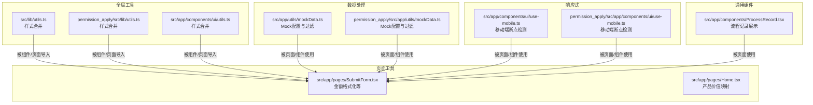
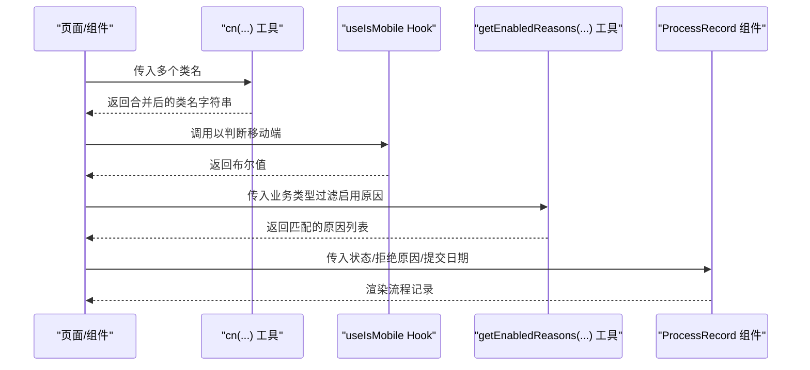
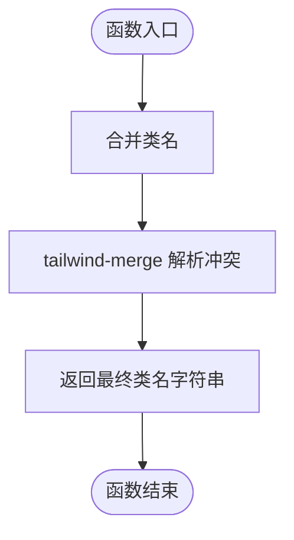
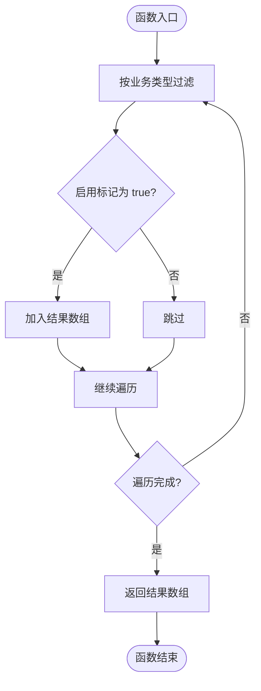
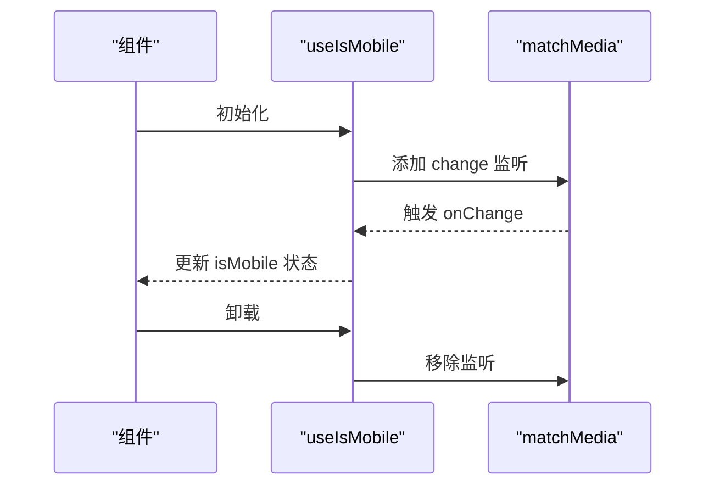
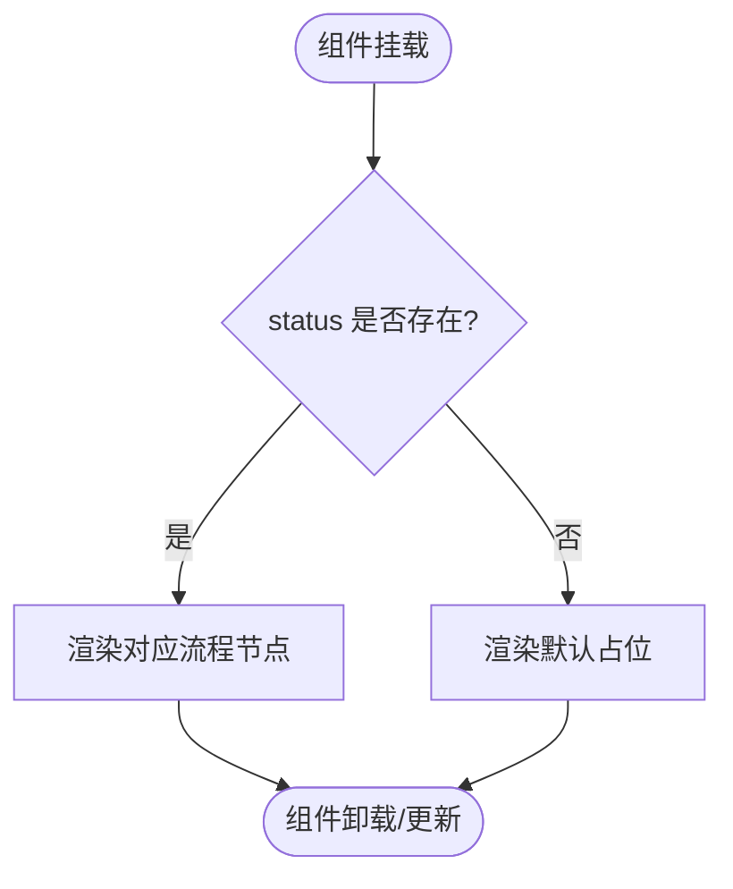
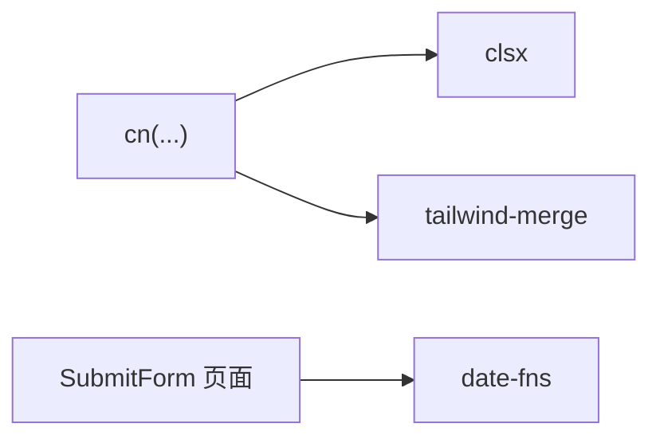

# 工具函数

<cite>
**本文引用的文件**
- [src/lib/utils.ts](file://src/lib/utils.ts)
- [permission_apply/src/lib/utils.ts](file://permission_apply/src/lib/utils.ts)
- [src/app/components/ui/utils.ts](file://src/app/components/ui/utils.ts)
- [src/app/utils/mockData.ts](file://src/app/utils/mockData.ts)
- [permission_apply/src/app/utils/mockData.ts](file://permission_apply/src/app/utils/mockData.ts)
- [src/app/components/ui/use-mobile.ts](file://src/app/components/ui/use-mobile.ts)
- [permission_apply/src/app/components/ui/use-mobile.ts](file://permission_apply/src/app/components/ui/use-mobile.ts)
- [src/app/components/ProcessRecord.tsx](file://src/app/components/ProcessRecord.tsx)
- [src/app/pages/SubmitForm.tsx](file://src/app/pages/SubmitForm.tsx)
- [src/app/pages/Home.tsx](file://src/app/pages/Home.tsx)
- [package.json](file://package.json)
</cite>

## 目录
1. [简介](#简介)
2. [项目结构](#项目结构)
3. [核心组件](#核心组件)
4. [架构总览](#架构总览)
5. [详细组件分析](#详细组件分析)
6. [依赖分析](#依赖分析)
7. [性能考虑](#性能考虑)
8. [故障排查指南](#故障排查指南)
9. [结论](#结论)
10. [附录](#附录)

## 简介
本文件系统化梳理项目中的工具函数与辅助方法，覆盖以下类别：
- 样式合并工具：统一的类名合并函数
- 数据处理工具：基于本地配置的筛选与聚合
- 响应式工具：移动端断点检测 Hook
- 通用工具：流程记录展示组件
- 类型与使用建议：参数、返回值、异常处理、性能特征、使用限制与最佳实践

目标是帮助开发者快速理解并正确使用这些工具函数，同时在扩展时遵循一致的接口规范与性能约束。

## 项目结构
工具函数主要分布在如下位置：
- 全局样式工具：src/lib/utils.ts、permission_apply/src/lib/utils.ts、src/app/components/ui/utils.ts
- 数据处理工具：src/app/utils/mockData.ts、permission_apply/src/app/utils/mockData.ts
- 响应式工具：src/app/components/ui/use-mobile.ts、permission_apply/src/app/components/ui/use-mobile.ts
- 通用组件：src/app/components/ProcessRecord.tsx
- 页面级工具：src/app/pages/SubmitForm.tsx、src/app/pages/Home.tsx

图表来源
- [src/lib/utils.ts:1-6](file://src/lib/utils.ts#L1-L6)
- [permission_apply/src/lib/utils.ts:1-6](file://permission_apply/src/lib/utils.ts#L1-L6)
- [src/app/components/ui/utils.ts:1-7](file://src/app/components/ui/utils.ts#L1-L7)
- [src/app/utils/mockData.ts:1-13](file://src/app/utils/mockData.ts#L1-L13)
- [permission_apply/src/app/utils/mockData.ts:1-13](file://permission_apply/src/app/utils/mockData.ts#L1-L13)
- [src/app/components/ui/use-mobile.ts:1-21](file://src/app/components/ui/use-mobile.ts#L1-L21)
- [permission_apply/src/app/components/ui/use-mobile.ts:1-21](file://permission_apply/src/app/components/ui/use-mobile.ts#L1-L21)
- [src/app/components/ProcessRecord.tsx:1-32](file://src/app/components/ProcessRecord.tsx#L1-L32)
- [src/app/pages/SubmitForm.tsx:125-157](file://src/app/pages/SubmitForm.tsx#L125-L157)
- [src/app/pages/Home.tsx:96-106](file://src/app/pages/Home.tsx#L96-L106)

章节来源
- [src/lib/utils.ts:1-6](file://src/lib/utils.ts#L1-L6)
- [permission_apply/src/lib/utils.ts:1-6](file://permission_apply/src/lib/utils.ts#L1-L6)
- [src/app/components/ui/utils.ts:1-7](file://src/app/components/ui/utils.ts#L1-L7)
- [src/app/utils/mockData.ts:1-13](file://src/app/utils/mockData.ts#L1-L13)
- [permission_apply/src/app/utils/mockData.ts:1-13](file://permission_apply/src/app/utils/mockData.ts#L1-L13)
- [src/app/components/ui/use-mobile.ts:1-21](file://src/app/components/ui/use-mobile.ts#L1-L21)
- [permission_apply/src/app/components/ui/use-mobile.ts:1-21](file://permission_apply/src/app/components/ui/use-mobile.ts#L1-L21)
- [src/app/components/ProcessRecord.tsx:1-32](file://src/app/components/ProcessRecord.tsx#L1-L32)
- [src/app/pages/SubmitForm.tsx:125-157](file://src/app/pages/SubmitForm.tsx#L125-L157)
- [src/app/pages/Home.tsx:96-106](file://src/app/pages/Home.tsx#L96-L106)

## 核心组件
本节对每个工具函数进行接口规范、参数类型、返回值、异常处理、使用示例、性能特征、使用限制与最佳实践的系统化说明。

### 样式合并工具：cn(...)
- 文件路径
  - [src/lib/utils.ts:1-6](file://src/lib/utils.ts#L1-L6)
  - [permission_apply/src/lib/utils.ts:1-6](file://permission_apply/src/lib/utils.ts#L1-L6)
  - [src/app/components/ui/utils.ts:1-7](file://src/app/components/ui/utils.ts#L1-L7)
- 函数签名
  - 参数
    - inputs: 可变参数，元素类型为 ClassValue（由 clsx/tailwind-merge 定义）
  - 返回值
    - 合并后的字符串类名
- 功能描述
  - 将多个类名输入合并，并通过 tailwind-merge 解决冲突，避免重复与覆盖问题
- 使用示例
  - 在组件中根据条件拼接类名，例如：className={cn("text-sm", isActive && "font-bold")}
- 性能特征
  - 时间复杂度近似 O(n)，空间复杂度 O(n)，其中 n 为传入类名数量
  - 由于 tailwind-merge 的去重与冲突解决，整体开销可忽略
- 使用限制
  - 仅支持字符串与可选值；布尔值会按 Truthy/Falsey 处理
  - 若传入空数组，返回空字符串
- 最佳实践
  - 优先使用该函数替代手动字符串拼接
  - 对于动态类名，尽量减少不必要的条件分支以降低调用频率
- 异常处理
  - 无显式 try/catch；若传入非期望类型，可能产生不可预测结果，建议严格传入字符串或可选值

章节来源
- [src/lib/utils.ts:4-6](file://src/lib/utils.ts#L4-L6)
- [permission_apply/src/lib/utils.ts:4-6](file://permission_apply/src/lib/utils.ts#L4-L6)
- [src/app/components/ui/utils.ts:4-6](file://src/app/components/ui/utils.ts#L4-L6)

### 数据处理工具：getEnabledReasons(businessType?)
- 文件路径
  - [src/app/utils/mockData.ts:1-13](file://src/app/utils/mockData.ts#L1-L13)
  - [permission_apply/src/app/utils/mockData.ts:1-13](file://permission_apply/src/app/utils/mockData.ts#L1-L13)
- 函数签名
  - 参数
    - businessType: string（默认值："trade_permission"）
  - 返回值
    - 数组：过滤出指定业务类型的启用项
- 功能描述
  - 基于本地 MOCK_REASONS 过滤出符合条件的启用原因集合
- 使用示例
  - const reasons = getEnabledReasons("trade_permission")
- 性能特征
  - 时间复杂度 O(n)，空间复杂度 O(k)，k 为匹配条目数
- 使用限制
  - 仅适用于本地 Mock 场景；生产环境需替换为真实后端接口
  - 业务类型需与 MOCK_REASONS 中枚举保持一致
- 最佳实践
  - 在组件初始化阶段一次性调用，避免频繁重复过滤
  - 如需跨模块共享，建议封装为独立 Store 或 Context
- 异常处理
  - 无显式 try/catch；若传入非法 businessType，返回空数组

章节来源
- [src/app/utils/mockData.ts:10-12](file://src/app/utils/mockData.ts#L10-L12)
- [permission_apply/src/app/utils/mockData.ts:10-12](file://permission_apply/src/app/utils/mockData.ts#L10-L12)

### 响应式工具：useIsMobile()
- 文件路径
  - [src/app/components/ui/use-mobile.ts:1-21](file://src/app/components/ui/use-mobile.ts#L1-L21)
  - [permission_apply/src/app/components/ui/use-mobile.ts:1-21](file://permission_apply/src/app/components/ui/use-mobile.ts#L1-L21)
- 函数签名
  - 参数
    - 无
  - 返回值
    - boolean：是否为移动端宽度
- 功能描述
  - 基于媒体查询监听窗口宽度变化，返回布尔值用于条件渲染
- 使用示例
  - const isMobile = useIsMobile(); if (isMobile) { ... }
- 性能特征
  - 初次渲染时注册事件监听；卸载时清理监听器，避免内存泄漏
  - 事件回调在窗口尺寸变化时触发，建议配合防抖使用
- 使用限制
  - 断点固定为 768px；如需自定义断点，建议复制该 Hook 并修改常量
- 最佳实践
  - 在布局组件中复用该 Hook，避免在多个子组件重复监听
  - 对频繁触发的回调可结合防抖策略
- 异常处理
  - 无显式 try/catch；在 SSR 环境下需注意 window 不存在的情况

章节来源
- [src/app/components/ui/use-mobile.ts:5-21](file://src/app/components/ui/use-mobile.ts#L5-L21)
- [permission_apply/src/app/components/ui/use-mobile.ts:5-21](file://permission_apply/src/app/components/ui/use-mobile.ts#L5-L21)

### 通用组件：ProcessRecord({ status, rejectReason, submitDate? })
- 文件路径
  - [src/app/components/ProcessRecord.tsx:1-32](file://src/app/components/ProcessRecord.tsx#L1-L32)
- 组件签名
  - Props
    - status?: string
    - rejectReason?: string
    - submitDate?: string
  - 返回值
    - React 节点
- 功能描述
  - 展示流程记录，依据状态渲染不同节点与提示信息
- 使用示例
  - <ProcessRecord status={status} rejectReason={rejectReason} submitDate={submitDate} />
- 性能特征
  - 纯展示组件，渲染成本低；建议在父组件中缓存 props
- 使用限制
  - 仅支持已知状态分支；新增状态需扩展组件逻辑
- 最佳实践
  - 将状态与日期作为稳定 props 传递，避免在渲染期间计算
- 异常处理
  - 无显式 try/catch；若传入非法状态，组件按默认分支处理

章节来源
- [src/app/components/ProcessRecord.tsx:4-12](file://src/app/components/ProcessRecord.tsx#L4-L12)

### 页面级工具：金额格式化与产品价值映射
- 文件路径
  - [src/app/pages/SubmitForm.tsx:125-157](file://src/app/pages/SubmitForm.tsx#L125-L157)
  - [src/app/pages/Home.tsx:96-106](file://src/app/pages/Home.tsx#L96-L106)
- 接口说明
  - 金额格式化
    - 输入：数值 base
    - 输出：格式化后的字符串（保留两位小数）
    - 用途：生成演示数据或临时展示
  - 产品价值映射
    - 输入：exchangeId: string
    - 输出：number（默认值 5）
    - 用途：根据交易所标识符返回产品价值系数
- 使用示例
  - const formatted = formatAmount(base); const value = getProductValue(exchangeId)
- 性能特征
  - 格式化与映射均为 O(1) 操作
- 使用限制
  - 金额格式化依赖浏览器本地化 API；在不支持的环境中需兜底
  - 映射表需与业务规则保持一致，扩展时同步维护
- 最佳实践
  - 在数据层统一处理格式化，避免在多处重复实现
  - 映射表集中管理，便于测试与维护
- 异常处理
  - 无显式 try/catch；若输入为空或非法，需在外层做校验

章节来源
- [src/app/pages/SubmitForm.tsx:125-130](file://src/app/pages/SubmitForm.tsx#L125-L130)
- [src/app/pages/Home.tsx:96-106](file://src/app/pages/Home.tsx#L96-L106)

## 架构总览
工具函数在整个应用中的交互关系如下：

图表来源
- [src/lib/utils.ts:4-6](file://src/lib/utils.ts#L4-L6)
- [src/app/components/ui/use-mobile.ts:5-21](file://src/app/components/ui/use-mobile.ts#L5-L21)
- [src/app/utils/mockData.ts:10-12](file://src/app/utils/mockData.ts#L10-L12)
- [src/app/components/ProcessRecord.tsx:4-12](file://src/app/components/ProcessRecord.tsx#L4-L12)

## 详细组件分析

### cn(...) 工具函数
- 设计模式
  - 工具函数模式：无状态、纯函数，便于复用
- 数据结构
  - 输入：ClassValue[]（由 clsx/tailwind-merge 定义）
  - 输出：string
- 复杂度
  - 时间复杂度：O(n)
  - 空间复杂度：O(n)
- 优化机会
  - 对于高频调用场景，可考虑缓存相同输入的结果
- 错误处理
  - 无显式错误处理；建议在上层保证输入类型安全

图表来源
- [src/lib/utils.ts:4-6](file://src/lib/utils.ts#L4-L6)

章节来源
- [src/lib/utils.ts:4-6](file://src/lib/utils.ts#L4-L6)
- [permission_apply/src/lib/utils.ts:4-6](file://permission_apply/src/lib/utils.ts#L4-L6)
- [src/app/components/ui/utils.ts:4-6](file://src/app/components/ui/utils.ts#L4-L6)

### getEnabledReasons(...) 工具函数
- 设计模式
  - 纯函数 + 本地数据源：适合 Mock 与单元测试
- 数据结构
  - 输入：businessType: string
  - 输出：数组过滤结果
- 复杂度
  - 时间复杂度：O(n)
  - 空间复杂度：O(k)
- 优化机会
  - 可引入 memoization 缓存结果
  - 支持懒加载与按需过滤
- 错误处理
  - 无显式错误处理；建议在上层校验业务类型

图表来源
- [src/app/utils/mockData.ts:10-12](file://src/app/utils/mockData.ts#L10-L12)

章节来源
- [src/app/utils/mockData.ts:10-12](file://src/app/utils/mockData.ts#L10-L12)
- [permission_apply/src/app/utils/mockData.ts:10-12](file://permission_apply/src/app/utils/mockData.ts#L10-L12)

### useIsMobile Hook
- 设计模式
  - 自定义 Hook：封装副作用与状态
- 数据结构
  - 状态：boolean | undefined
  - 事件：window.matchMedia 监听
- 复杂度
  - 初始化 O(1)；事件回调 O(1)
- 优化机会
  - 结合防抖/节流；SSR 下增加容错
- 错误处理
  - 无显式错误处理；SSR 环境需外部保护

图表来源
- [src/app/components/ui/use-mobile.ts:10-18](file://src/app/components/ui/use-mobile.ts#L10-L18)

章节来源
- [src/app/components/ui/use-mobile.ts:5-21](file://src/app/components/ui/use-mobile.ts#L5-L21)
- [permission_apply/src/app/components/ui/use-mobile.ts:5-21](file://permission_apply/src/app/components/ui/use-mobile.ts#L5-L21)

### ProcessRecord 组件
- 设计模式
  - 展示型组件：接收状态并渲染对应流程节点
- 数据结构
  - Props：status, rejectReason, submitDate?
- 复杂度
  - 渲染 O(1)；无副作用
- 优化机会
  - 可拆分节点为子组件以提升可读性
- 错误处理
  - 无显式错误处理；建议在父组件传入合法状态

图表来源
- [src/app/components/ProcessRecord.tsx:4-12](file://src/app/components/ProcessRecord.tsx#L4-L12)

章节来源
- [src/app/components/ProcessRecord.tsx:4-12](file://src/app/components/ProcessRecord.tsx#L4-L12)

## 依赖分析
- 工具函数依赖的第三方库
  - clsx：类名拼接
  - tailwind-merge：类名冲突合并
  - date-fns：日期与时间处理（在页面中使用）
- 版本与兼容性
  - package.json 中声明了相关依赖版本，确保工具函数与框架版本兼容

图表来源
- [package.json:44-66](file://package.json#L44-L66)
- [src/app/pages/SubmitForm.tsx:125-130](file://src/app/pages/SubmitForm.tsx#L125-L130)

章节来源
- [package.json:11-66](file://package.json#L11-L66)

## 性能考虑
- cn(...)
  - 高频调用时建议减少传入类名数量，避免过多条件分支
- getEnabledReasons(...)
  - 对于大列表可考虑缓存或分页过滤
- useIsMobile Hook
  - 配合防抖/节流，避免频繁重排
- ProcessRecord 组件
  - 保持 props 稳定，避免不必要的重渲染

## 故障排查指南
- cn(...) 返回空字符串
  - 检查传入参数是否为空或类型不正确
- getEnabledReasons(...) 返回空数组
  - 检查 businessType 是否与 MOCK_REASONS 中一致
- useIsMobile Hook 在 SSR 报错
  - 确保在客户端执行或添加 window 存在性检查
- ProcessRecord 组件渲染异常
  - 检查传入的 status 是否在组件支持范围内

章节来源
- [src/lib/utils.ts:4-6](file://src/lib/utils.ts#L4-L6)
- [src/app/utils/mockData.ts:10-12](file://src/app/utils/mockData.ts#L10-L12)
- [src/app/components/ui/use-mobile.ts:5-21](file://src/app/components/ui/use-mobile.ts#L5-L21)
- [src/app/components/ProcessRecord.tsx:4-12](file://src/app/components/ProcessRecord.tsx#L4-L12)

## 结论
本文件系统化梳理了项目中的工具函数与辅助方法，明确了接口规范、性能特征与最佳实践。建议在后续开发中：
- 统一使用 cn(...) 进行类名合并
- 将 getEnabledReasons(...) 作为 Mock 工具，生产环境替换为真实接口
- 在 SSR 环境谨慎使用 useIsMobile Hook
- 将流程记录组件化，提升可维护性

## 附录
- TypeScript 类型定义参考
  - cn(...inputs: ClassValue[]): string
  - getEnabledReasons(businessType?: string): typeof MOCK_REASONS
  - useIsMobile(): boolean
  - ProcessRecord(props: { status?: string; rejectReason?: string; submitDate?: string }): ReactNode
- 实际应用场景
  - 样式合并：按钮、卡片、表单等组件的条件类名拼接
  - 数据处理：审批页面的拒绝原因筛选
  - 响应式：移动端适配与布局切换
  - 通用展示：流程记录的可视化呈现