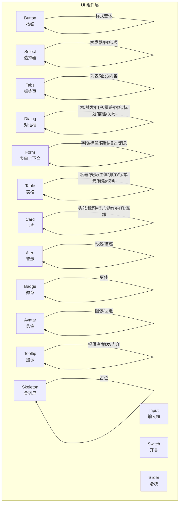
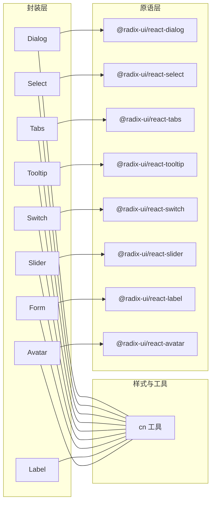
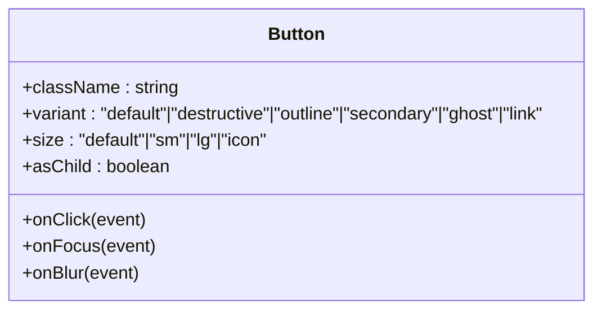
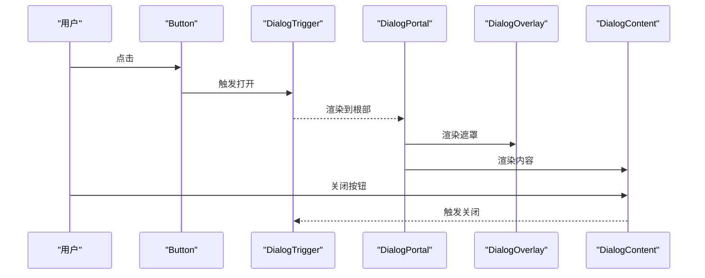
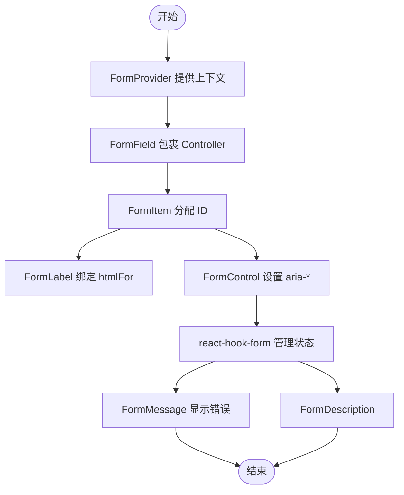
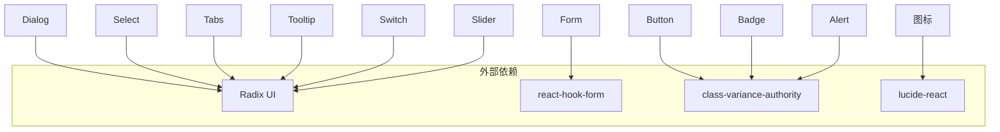

# 组件API

<cite>
**本文引用的文件**
- [button.tsx](file://src/app/components/ui/button.tsx)
- [dialog.tsx](file://src/app/components/ui/dialog.tsx)
- [form.tsx](file://src/app/components/ui/form.tsx)
- [input.tsx](file://src/app/components/ui/input.tsx)
- [select.tsx](file://src/app/components/ui/select.tsx)
- [table.tsx](file://src/app/components/ui/table.tsx)
- [card.tsx](file://src/app/components/ui/card.tsx)
- [tabs.tsx](file://src/app/components/ui/tabs.tsx)
- [badge.tsx](file://src/app/components/ui/badge.tsx)
- [avatar.tsx](file://src/app/components/ui/avatar.tsx)
- [alert.tsx](file://src/app/components/ui/alert.tsx)
- [skeleton.tsx](file://src/app/components/ui/skeleton.tsx)
- [tooltip.tsx](file://src/app/components/ui/tooltip.tsx)
- [switch.tsx](file://src/app/components/ui/switch.tsx)
- [slider.tsx](file://src/app/components/ui/slider.tsx)
</cite>

## 目录
1. [简介](#简介)
2. [项目结构](#项目结构)
3. [核心组件](#核心组件)
4. [架构总览](#架构总览)
5. [详细组件分析](#详细组件分析)
6. [依赖关系分析](#依赖关系分析)
7. [性能考量](#性能考量)
8. [故障排查指南](#故障排查指南)
9. [结论](#结论)
10. [附录](#附录)

## 简介
本文件为该React组件库的组件API文档，覆盖UI基础组件与表单相关组件。文档聚焦于每个组件的公共接口（props/属性）、事件处理器、插槽（slots）与自定义选项；同时给出使用示例、默认值、可选参数与类型说明，并解释组件的生命周期、状态管理与与其他组件的交互模式。所有内容均基于仓库中的实际源码进行整理与归纳。

## 项目结构
组件集中位于 src/app/components/ui 下，采用按功能分层的组织方式：基础输入控件（如 input、select、slider、switch）、布局容器（如 card、table）、反馈与提示（如 alert、badge、tooltip、skeleton）、导航与交互（如 tabs、dialog、form），以及通用工具函数（如 cn、use-mobile 等）。组件普遍以“透传原语 + 样式增强”的模式封装 Radix UI 原生组件，确保可访问性与一致性。

图表来源
- [button.tsx:37-56](file://src/app/components/ui/button.tsx#L37-L56)
- [input.tsx:5-19](file://src/app/components/ui/input.tsx#L5-L19)
- [select.tsx:13-189](file://src/app/components/ui/select.tsx#L13-L189)
- [tabs.tsx:8-66](file://src/app/components/ui/tabs.tsx#L8-L66)
- [dialog.tsx:9-135](file://src/app/components/ui/dialog.tsx#L9-L135)
- [form.tsx:19-168](file://src/app/components/ui/form.tsx#L19-L168)
- [table.tsx:7-116](file://src/app/components/ui/table.tsx#L7-L116)
- [card.tsx:5-92](file://src/app/components/ui/card.tsx#L5-L92)
- [alert.tsx:22-66](file://src/app/components/ui/alert.tsx#L22-L66)
- [badge.tsx:28-44](file://src/app/components/ui/badge.tsx#L28-L44)
- [avatar.tsx:8-51](file://src/app/components/ui/avatar.tsx#L8-L51)
- [tooltip.tsx:8-61](file://src/app/components/ui/tooltip.tsx#L8-L61)
- [skeleton.tsx:3-11](file://src/app/components/ui/skeleton.tsx#L3-L11)
- [switch.tsx:8-29](file://src/app/components/ui/switch.tsx#L8-L29)
- [slider.tsx:8-61](file://src/app/components/ui/slider.tsx#L8-L61)

章节来源
- [button.tsx:1-59](file://src/app/components/ui/button.tsx#L1-L59)
- [dialog.tsx:1-136](file://src/app/components/ui/dialog.tsx#L1-L136)
- [form.tsx:1-169](file://src/app/components/ui/form.tsx#L1-L169)
- [input.tsx:1-22](file://src/app/components/ui/input.tsx#L1-L22)
- [select.tsx:1-190](file://src/app/components/ui/select.tsx#L1-L190)
- [table.tsx:1-117](file://src/app/components/ui/table.tsx#L1-L117)
- [card.tsx:1-93](file://src/app/components/ui/card.tsx#L1-L93)
- [tabs.tsx:1-67](file://src/app/components/ui/tabs.tsx#L1-L67)
- [badge.tsx:1-47](file://src/app/components/ui/badge.tsx#L1-L47)
- [avatar.tsx:1-54](file://src/app/components/ui/avatar.tsx#L1-L54)
- [alert.tsx:1-67](file://src/app/components/ui/alert.tsx#L1-L67)
- [skeleton.tsx:1-14](file://src/app/components/ui/skeleton.tsx#L1-L14)
- [tooltip.tsx:1-62](file://src/app/components/ui/tooltip.tsx#L1-L62)
- [switch.tsx:1-32](file://src/app/components/ui/switch.tsx#L1-L32)
- [slider.tsx:1-64](file://src/app/components/ui/slider.tsx#L1-L64)

## 核心组件
本节对关键组件进行接口与行为说明，涵盖 props、事件、slots、默认值与类型要点。

- Button（按钮）
  - 属性
    - className: 字符串，用于追加样式类
    - variant: 变体枚举，默认 default
    - size: 尺寸枚举，默认 default
    - asChild: 是否将渲染委托给子元素（Slot）
    - 其余透传至原生 button
  - 事件
    - onClick、onFocus、onBlur 等原生事件
  - 插槽
    - asChild 模式下通过 Slot 接受子节点
  - 默认值
    - variant: default；size: default
  - 类型
    - 使用 Variants 与 VariantProps 进行类型约束
  - 生命周期与状态
    - 无内部状态，纯展示/事件透传
  - 交互
    - 作为触发器配合 Dialog、Select 等使用

- Input（输入框）
  - 属性
    - className、type、以及原生 input 支持的所有属性
  - 事件
    - onChange、onFocus、onBlur 等
  - 插槽
    - 无
  - 默认值
    - 无固定默认值，遵循浏览器 input 行为
  - 类型
    - React.ComponentProps<"input">
  - 交互
    - 通常与 FormLabel、FormControl、FormMessage 配合

- Select（选择器）
  - 属性
    - Root/Group/Value/Trigger/Content/Item/Label/Separator/ScrollUpButton/ScrollDownButton
    - Trigger: size 可选 "sm"|"default"
    - Content: position 可选 "popper"
  - 事件
    - onValueChange 等由原生 SelectPrimitive 提供
  - 插槽
    - 通过 Portal 渲染内容
  - 默认值
    - Trigger size: default；Content position: popper
  - 类型
    - 透传原生 SelectPrimitive 的 Props
  - 交互
    - 与 FormField、FormControl 协同实现受控校验

- Tabs（标签页）
  - 属性
    - Tabs: className 等
    - TabsList: 列表容器
    - TabsTrigger: 触发器，支持禁用
    - TabsContent: 内容区
  - 事件
    - 由 TabsPrimitive 提供
  - 插槽
    - 无
  - 默认值
    - 无
  - 类型
    - 透传原生 TabsPrimitive Props
  - 交互
    - 与 Card、Table 等组合使用

- Dialog（对话框）
  - 属性
    - Root、Trigger、Portal、Overlay、Content、Header、Footer、Title、Description、Close
    - Overlay/Content/Title/Description/Close 支持 className 透传
  - 事件
    - 由 DialogPrimitive 提供
  - 插槽
    - 通过 Portal 渲染
  - 默认值
    - 无
  - 类型
    - 透传原生 DialogPrimitive Props
  - 交互
    - 与 Button、Tabs、Form 等组合使用

- Form（表单）
  - 属性
    - Form: FormProvider
    - FormField: ControllerProps 泛型
    - FormItem: 容器 div
    - FormLabel: LabelPrimitive.Root
    - FormControl: Slot
    - FormDescription/FormMessage: 文本描述与错误信息
  - 事件
    - 由 react-hook-form 提供
  - 插槽
    - FormControl 使用 Slot 接收子控件
  - 默认值
    - 无
  - 类型
    - 泛型 FieldValues、FieldPath；useFormContext/useFormState
  - 交互
    - 与 Input、Select、Checkbox 等控件配合，提供可访问性与错误提示

- Table（表格）
  - 属性
    - Table 容器 + TableHeader/TableBody/TableFooter + TableRow/TableCell + TableCaption/Head
  - 事件
    - 无内置事件，透传原生 table 行为
  - 插槽
    - 无
  - 默认值
    - 无
  - 类型
    - 透传原生 table/thead/tbody/tr/th/td/caption Props
  - 交互
    - 与 Badge、Button 等组合用于操作列

- Card（卡片）
  - 属性
    - Card/CardHeader/CardTitle/CardDescription/CardAction/CardContent/CardFooter
  - 事件
    - 无内置事件
  - 插槽
    - 无
  - 默认值
    - 无
  - 类型
    - 透传原生 div Props
  - 交互
    - 与 Tabs、Table、Form 等组合使用

- Alert（警示）
  - 属性
    - Alert: variant 枚举
    - AlertTitle/AlertDescription
  - 事件
    - 无
  - 插槽
    - 无
  - 默认值
    - variant: default
  - 类型
    - Variants 与 VariantProps
  - 交互
    - 用于全局或局部提示

- Badge（徽章）
  - 属性
    - variant 枚举；asChild
  - 事件
    - 无
  - 插槽
    - asChild 使用 Slot
  - 默认值
    - variant: default
  - 类型
    - Variants 与 VariantProps
  - 交互
    - 用于状态标识

- Avatar（头像）
  - 属性
    - Avatar/AvatarImage/AvatarFallback
  - 事件
    - 无
  - 插槽
    - 无
  - 默认值
    - 无
  - 类型
    - 透传原生 AvatarPrimitive Props
  - 交互
    - 与 Card、Table 等组合使用

- Tooltip（提示）
  - 属性
    - TooltipProvider(delayDuration)
    - Tooltip/TooltipTrigger/TooltipContent(sideOffset)
  - 事件
    - 无
  - 插槽
    - 无
  - 默认值
    - Provider delayDuration: 0；Content sideOffset: 0
  - 类型
    - 透传原生 TooltipPrimitive Props
  - 交互
    - 与 Button、Switch 等组合使用

- Switch（开关）
  - 属性
    - className 与原生 SwitchPrimitive.Root 支持的属性
  - 事件
    - onChange、onCheckedChange 等由原生提供
  - 插槽
    - 无
  - 默认值
    - 无
  - 类型
    - 透传原生 SwitchPrimitive Props
  - 交互
    - 与 Form、Card 组合使用

- Slider（滑块）
  - 属性
    - defaultValue/value 支持单值或多值数组；min/max 默认 0/100
  - 事件
    - onChange、onValueCommit 等由原生提供
  - 插槽
    - 无
  - 默认值
    - defaultValue: [min,max]（当非数组时）
  - 类型
    - 透传原生 SliderPrimitive Props
  - 交互
    - 与 Form、Card 组合使用

章节来源
- [button.tsx:37-56](file://src/app/components/ui/button.tsx#L37-L56)
- [input.tsx:5-19](file://src/app/components/ui/input.tsx#L5-L19)
- [select.tsx:13-189](file://src/app/components/ui/select.tsx#L13-L189)
- [tabs.tsx:8-66](file://src/app/components/ui/tabs.tsx#L8-L66)
- [dialog.tsx:9-135](file://src/app/components/ui/dialog.tsx#L9-L135)
- [form.tsx:19-168](file://src/app/components/ui/form.tsx#L19-L168)
- [table.tsx:7-116](file://src/app/components/ui/table.tsx#L7-L116)
- [card.tsx:5-92](file://src/app/components/ui/card.tsx#L5-L92)
- [alert.tsx:22-66](file://src/app/components/ui/alert.tsx#L22-L66)
- [badge.tsx:28-44](file://src/app/components/ui/badge.tsx#L28-L44)
- [avatar.tsx:8-51](file://src/app/components/ui/avatar.tsx#L8-L51)
- [tooltip.tsx:8-61](file://src/app/components/ui/tooltip.tsx#L8-L61)
- [switch.tsx:8-29](file://src/app/components/ui/switch.tsx#L8-L29)
- [slider.tsx:8-61](file://src/app/components/ui/slider.tsx#L8-L61)

## 架构总览
组件整体采用“原语封装 + 样式变体 + 可访问性”设计，统一通过 cn 工具合并类名，Radix UI 提供无障碍行为，部分组件（Dialog、Select、Tabs、Tooltip、Switch、Slider）在客户端运行，以支持动态交互。

图表来源
- [dialog.tsx:3-13](file://src/app/components/ui/dialog.tsx#L3-L13)
- [select.tsx:3-9](file://src/app/components/ui/select.tsx#L3-L9)
- [tabs.tsx:3-4](file://src/app/components/ui/tabs.tsx#L3-L4)
- [tooltip.tsx:3-4](file://src/app/components/ui/tooltip.tsx#L3-L4)
- [switch.tsx:3-4](file://src/app/components/ui/switch.tsx#L3-L4)
- [slider.tsx:3-4](file://src/app/components/ui/slider.tsx#L3-L4)
- [form.tsx:4-14](file://src/app/components/ui/form.tsx#L4-L14)
- [avatar.tsx:3-4](file://src/app/components/ui/avatar.tsx#L3-L4)
- [button.tsx:1-5](file://src/app/components/ui/button.tsx#L1-L5)

## 详细组件分析

### Button（按钮）
- 设计要点
  - 使用 class-variance-authority 定义变体与尺寸，支持 asChild 将渲染委托给子元素
  - 透传原生 button 属性，保持语义与可访问性
- 接口定义
  - 属性：className、variant、size、asChild、...buttonProps
  - 事件：onClick、onFocus、onBlur 等
  - 插槽：asChild 使用 Slot
  - 默认值：variant="default"，size="default"
- 使用示例路径
  - [Button 示例用法:37-56](file://src/app/components/ui/button.tsx#L37-L56)
- 复杂度与性能
  - O(1) 渲染，样式计算通过变体对象映射
- 错误处理
  - 无内部状态，不涉及错误处理

图表来源
- [button.tsx:37-56](file://src/app/components/ui/button.tsx#L37-L56)

章节来源
- [button.tsx:1-59](file://src/app/components/ui/button.tsx#L1-L59)

### Dialog（对话框）
- 设计要点
  - 通过 Portal 渲染到文档根部，Overlay 提供遮罩动画
  - Header/Footer 用于结构化布局，Title/Description 提升可访问性
- 接口定义
  - 组件：Dialog、DialogTrigger、DialogPortal、DialogOverlay、DialogContent、DialogHeader、DialogFooter、DialogTitle、DialogDescription、DialogClose
  - 属性：各组件透传对应原生 Root/Trigger/Content 等属性
  - 事件：由 DialogPrimitive 提供
  - 插槽：通过 Portal 渲染
  - 默认值：无
- 使用示例路径
  - [Dialog 组合用法:9-135](file://src/app/components/ui/dialog.tsx#L9-L135)
- 生命周期与状态
  - 由 Radix Dialog 控制 open/closed 状态，组件仅负责渲染与样式
- 交互模式
  - 与 Button、Tabs、Form 等组合使用

图表来源
- [dialog.tsx:15-73](file://src/app/components/ui/dialog.tsx#L15-L73)

章节来源
- [dialog.tsx:1-136](file://src/app/components/ui/dialog.tsx#L1-L136)

### Form（表单）
- 设计要点
  - FormProvider 提供上下文，FormField 包裹 Controller 实现字段级控制
  - useFormField 汇聚字段状态、ID 与可访问性属性
- 接口定义
  - 组件：Form、FormField、FormItem、FormLabel、FormControl、FormDescription、FormMessage
  - 属性：FormItem 自动分配唯一 ID；FormControl 设置 aria-* 属性
  - 事件：由 react-hook-form 提供
  - 插槽：FormControl 使用 Slot 接收子控件
  - 默认值：无
- 使用示例路径
  - [Form 组合用法:19-168](file://src/app/components/ui/form.tsx#L19-L168)
- 生命周期与状态
  - 由 react-hook-form 管理字段状态与验证
- 交互模式
  - 与 Input、Select、Switch、Slider 等控件协同

图表来源
- [form.tsx:19-168](file://src/app/components/ui/form.tsx#L19-L168)

章节来源
- [form.tsx:1-169](file://src/app/components/ui/form.tsx#L1-L169)

### Input（输入框）
- 设计要点
  - 透传原生 input 属性，统一焦点与无效态样式
- 接口定义
  - 属性：className、type、...inputProps
  - 事件：onChange、onFocus、onBlur 等
  - 插槽：无
  - 默认值：无
- 使用示例路径
  - [Input 示例用法:5-19](file://src/app/components/ui/input.tsx#L5-L19)
- 性能
  - O(1) 渲染，样式计算轻量

章节来源
- [input.tsx:1-22](file://src/app/components/ui/input.tsx#L1-L22)

### Select（选择器）
- 设计要点
  - Trigger 支持 size；Content 支持 position；Viewport 动态适配尺寸
- 接口定义
  - 组件：Select、SelectTrigger、SelectContent、SelectItem、SelectLabel、SelectSeparator、SelectScrollUpButton、SelectScrollDownButton、SelectGroup、SelectValue
  - 属性：Trigger.size、Content.position
  - 事件：onValueChange 等
  - 插槽：Portal 渲染
  - 默认值：Trigger.size="default"；Content.position="popper"
- 使用示例路径
  - [Select 组合用法:13-189](file://src/app/components/ui/select.tsx#L13-L189)
- 交互模式
  - 与 FormField、FormControl 协同

章节来源
- [select.tsx:1-190](file://src/app/components/ui/select.tsx#L1-L190)

### Tabs（标签页）
- 设计要点
  - 列表与触发器采用圆角胶囊样式，内容区可扩展
- 接口定义
  - 组件：Tabs、TabsList、TabsTrigger、TabsContent
  - 事件：由 TabsPrimitive 提供
  - 插槽：无
  - 默认值：无
- 使用示例路径
  - [Tabs 组合用法:8-66](file://src/app/components/ui/tabs.tsx#L8-L66)

章节来源
- [tabs.tsx:1-67](file://src/app/components/ui/tabs.tsx#L1-L67)

### Table（表格）
- 设计要点
  - 容器提供横向滚动，行/单元格支持复选框与悬停态
- 接口定义
  - 组件：Table、TableHeader、TableBody、TableFooter、TableRow、TableHead、TableCell、TableCaption
  - 事件：无
  - 插槽：无
  - 默认值：无
- 使用示例路径
  - [Table 组合用法:7-116](file://src/app/components/ui/table.tsx#L7-L116)

章节来源
- [table.tsx:1-117](file://src/app/components/ui/table.tsx#L1-L117)

### Card（卡片）
- 设计要点
  - 支持 Action 区域与响应式网格布局
- 接口定义
  - 组件：Card、CardHeader、CardTitle、CardDescription、CardAction、CardContent、CardFooter
  - 事件：无
  - 插槽：无
  - 默认值：无
- 使用示例路径
  - [Card 组合用法:5-92](file://src/app/components/ui/card.tsx#L5-L92)

章节来源
- [card.tsx:1-93](file://src/app/components/ui/card.tsx#L1-L93)

### Alert（警示）
- 设计要点
  - 可选 destructive 变体，支持标题与描述
- 接口定义
  - 组件：Alert、AlertTitle、AlertDescription
  - 属性：variant 枚举
  - 事件：无
  - 插槽：无
  - 默认值：variant="default"
- 使用示例路径
  - [Alert 组合用法:22-66](file://src/app/components/ui/alert.tsx#L22-L66)

章节来源
- [alert.tsx:1-67](file://src/app/components/ui/alert.tsx#L1-L67)

### Badge（徽章）
- 设计要点
  - 支持 asChild，多种变体
- 接口定义
  - 组件：Badge
  - 属性：variant、asChild
  - 事件：无
  - 插槽：asChild 使用 Slot
  - 默认值：variant="default"
- 使用示例路径
  - [Badge 组合用法:28-44](file://src/app/components/ui/badge.tsx#L28-L44)

章节来源
- [badge.tsx:1-47](file://src/app/components/ui/badge.tsx#L1-L47)

### Avatar（头像）
- 设计要点
  - 提供图像与回退显示
- 接口定义
  - 组件：Avatar、AvatarImage、AvatarFallback
  - 事件：无
  - 插槽：无
  - 默认值：无
- 使用示例路径
  - [Avatar 组合用法:8-51](file://src/app/components/ui/avatar.tsx#L8-L51)

章节来源
- [avatar.tsx:1-54](file://src/app/components/ui/avatar.tsx#L1-L54)

### Tooltip（提示）
- 设计要点
  - Provider 支持延迟；Content 支持方向偏移与箭头
- 接口定义
  - 组件：TooltipProvider、Tooltip、TooltipTrigger、TooltipContent
  - 属性：Provider.delayDuration、Content.sideOffset
  - 事件：无
  - 插槽：无
  - 默认值：Provider.delayDuration=0；Content.sideOffset=0
- 使用示例路径
  - [Tooltip 组合用法:8-61](file://src/app/components/ui/tooltip.tsx#L8-L61)

章节来源
- [tooltip.tsx:1-62](file://src/app/components/ui/tooltip.tsx#L1-L62)

### Switch（开关）
- 设计要点
  - 基于原生 SwitchPrimitive，提供可访问性与样式
- 接口定义
  - 组件：Switch
  - 事件：onChange、onCheckedChange 等
  - 插槽：无
  - 默认值：无
- 使用示例路径
  - [Switch 组合用法:8-29](file://src/app/components/ui/switch.tsx#L8-L29)

章节来源
- [switch.tsx:1-32](file://src/app/components/ui/switch.tsx#L1-L32)

### Slider（滑块）
- 设计要点
  - 支持单值/多值，自动推导默认范围
- 接口定义
  - 组件：Slider
  - 属性：defaultValue/value/min/max
  - 事件：onChange、onValueCommit 等
  - 插槽：无
  - 默认值：defaultValue 为 [min,max]（当非数组时）
- 使用示例路径
  - [Slider 组合用法:8-61](file://src/app/components/ui/slider.tsx#L8-L61)

章节来源
- [slider.tsx:1-64](file://src/app/components/ui/slider.tsx#L1-L64)

## 依赖关系分析
- 组件间耦合
  - Dialog、Select、Tabs、Tooltip、Switch、Slider 依赖 Radix UI 原语
  - Form 依赖 react-hook-form，提供字段级控制与可访问性
  - Button、Badge、Alert 等使用 class-variance-authority 定义变体
  - 所有组件统一通过 cn 合并类名，保证主题一致性
- 外部依赖
  - @radix-ui/react-*
  - lucide-react（图标）
  - class-variance-authority（变体）
  - react-hook-form（表单）

图表来源
- [dialog.tsx:3-5](file://src/app/components/ui/dialog.tsx#L3-L5)
- [select.tsx:3-9](file://src/app/components/ui/select.tsx#L3-L9)
- [tabs.tsx:3-4](file://src/app/components/ui/tabs.tsx#L3-L4)
- [tooltip.tsx:3-4](file://src/app/components/ui/tooltip.tsx#L3-L4)
- [switch.tsx:3-4](file://src/app/components/ui/switch.tsx#L3-L4)
- [slider.tsx:3-4](file://src/app/components/ui/slider.tsx#L3-L4)
- [form.tsx:4-14](file://src/app/components/ui/form.tsx#L4-L14)
- [button.tsx](file://src/app/components/ui/button.tsx#L3)
- [badge.tsx](file://src/app/components/ui/badge.tsx#L3)
- [alert.tsx](file://src/app/components/ui/alert.tsx#L2)

章节来源
- [dialog.tsx:1-136](file://src/app/components/ui/dialog.tsx#L1-L136)
- [select.tsx:1-190](file://src/app/components/ui/select.tsx#L1-L190)
- [tabs.tsx:1-67](file://src/app/components/ui/tabs.tsx#L1-L67)
- [tooltip.tsx:1-62](file://src/app/components/ui/tooltip.tsx#L1-L62)
- [switch.tsx:1-32](file://src/app/components/ui/switch.tsx#L1-L32)
- [slider.tsx:1-64](file://src/app/components/ui/slider.tsx#L1-L64)
- [form.tsx:1-169](file://src/app/components/ui/form.tsx#L1-L169)
- [button.tsx:1-59](file://src/app/components/ui/button.tsx#L1-L59)
- [badge.tsx:1-47](file://src/app/components/ui/badge.tsx#L1-L47)
- [alert.tsx:1-67](file://src/app/components/ui/alert.tsx#L1-L67)

## 性能考量
- 渲染复杂度
  - 大多数组件为 O(1) 渲染，Button、Badge、Alert 等通过变体映射快速计算样式
- 计算优化
  - Slider 使用 useMemo 推导默认值，避免重复计算
- 可访问性与动画
  - 通过 Radix UI 原生动画与可访问性属性，减少额外开销
- 主题与样式
  - 统一通过 cn 合并类名，避免重复样式计算

## 故障排查指南
- 表单相关
  - useFormField 必须在 FormField 上下文中使用，否则抛出错误
  - FormControl 会根据字段状态设置 aria-* 属性，若未正确包裹控件，可能出现可访问性问题
- 对话框与选择器
  - Dialog/Select 等需 Portal 渲染，确保根部存在 Portal 宿主
  - SelectContent 的 position 与尺寸需与 Trigger 一致，避免溢出或错位
- 输入与开关
  - Input/Slider/Select 等控件应与 Form 组合使用，确保状态同步与错误提示
- 可访问性
  - 使用 FormLabel 与 FormControl 绑定，避免 aria-* 缺失导致屏幕阅读器无法识别

章节来源
- [form.tsx:45-66](file://src/app/components/ui/form.tsx#L45-L66)
- [dialog.tsx:54-72](file://src/app/components/ui/dialog.tsx#L54-L72)
- [select.tsx:62-89](file://src/app/components/ui/select.tsx#L62-L89)
- [input.tsx:5-19](file://src/app/components/ui/input.tsx#L5-L19)
- [slider.tsx:8-61](file://src/app/components/ui/slider.tsx#L8-L61)

## 结论
该组件库以 Radix UI 为基础，结合 class-variance-authority 与 cn 工具，提供了高可访问性、可定制的UI组件集合。表单体系通过 react-hook-form 实现字段级控制与错误提示，对话框、选择器、标签页等交互组件具备良好的用户体验与一致性。建议在业务中优先使用 Form + Input/Select/Slider 等组合，确保可访问性与一致性。

## 附录
- TypeScript 类型建议
  - Button/Select/Alert/Badge 等组件可直接使用其导出的 Variants 与 VariantProps 类型
  - Form 组件使用 react-hook-form 的 FieldValues、FieldPath 泛型进行强类型约束
  - Dialog/Select/Tabs/Tooltip/Switch/Slider 等组件可直接透传原生 Props 类型
- 最佳实践
  - 优先使用 FormProvider + FormField + FormControl 组合
  - 使用 asChild 时确保子元素具备正确的角色与属性
  - 在需要动画与定位的组件中，确保 Portal 正确挂载