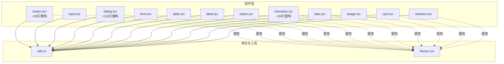
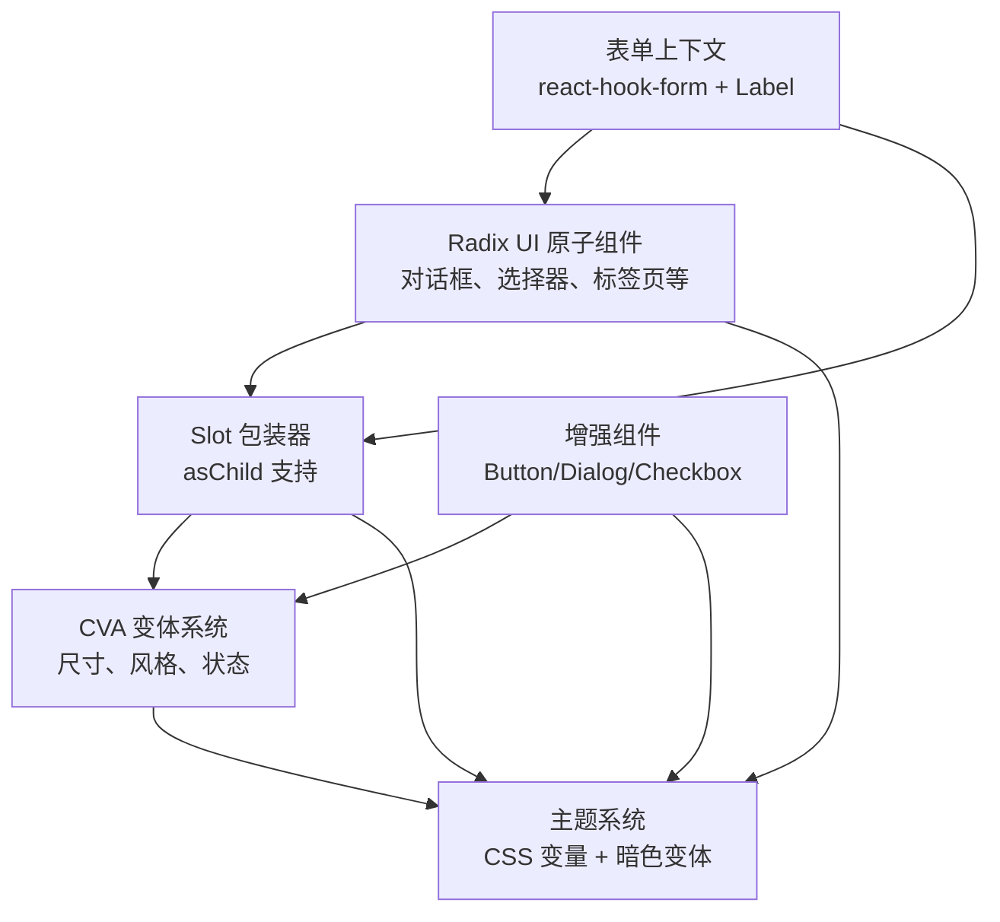
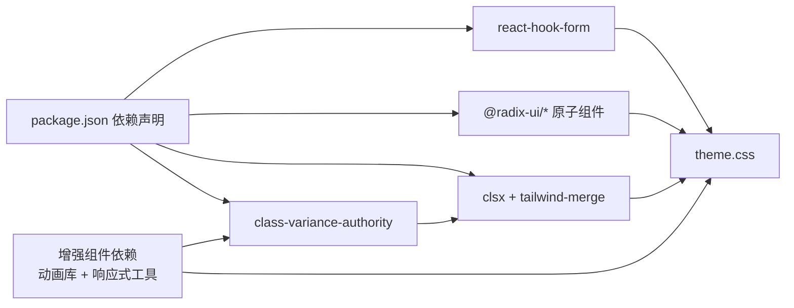

# UI组件库

<cite>
**本文引用的文件**
- [button.tsx](file://src/app/components/ui/button.tsx)
- [input.tsx](file://src/app/components/ui/input.tsx)
- [dialog.tsx](file://src/app/components/ui/dialog.tsx)
- [form.tsx](file://src/app/components/ui/form.tsx)
- [table.tsx](file://src/app/components/ui/table.tsx)
- [utils.ts](file://src/app/components/ui/utils.ts)
- [label.tsx](file://src/app/components/ui/label.tsx)
- [select.tsx](file://src/app/components/ui/select.tsx)
- [checkbox.tsx](file://src/app/components/ui/checkbox.tsx)
- [tabs.tsx](file://src/app/components/ui/tabs.tsx)
- [theme.css](file://src/styles/theme.css)
- [skeleton.tsx](file://src/app/components/ui/skeleton.tsx)
- [badge.tsx](file://src/app/components/ui/badge.tsx)
- [card.tsx](file://src/app/components/ui/card.tsx)
- [package.json](file://package.json)
</cite>

## 更新摘要
**变更内容**
- 大幅重构Button组件，新增多种样式变体和状态处理选项
- 全面升级Dialog组件，增强动画效果、布局灵活性和可访问性支持
- 改进Checkbox组件，优化勾选图标、尺寸适配和错误状态反馈
- 提升整体用户体验和样式定制能力

## 目录
1. [简介](#简介)
2. [项目结构](#项目结构)
3. [核心组件](#核心组件)
4. [架构总览](#架构总览)
5. [组件详解](#组件详解)
6. [依赖关系分析](#依赖关系分析)
7. [性能与可访问性](#性能与可访问性)
8. [故障排查指南](#故障排查指南)
9. [结论](#结论)
10. [附录](#附录)

## 简介
本UI组件库以Radix UI为原子能力底座，结合Tailwind CSS与class-variance-authority（CVA）实现一致、可组合、可定制的组件体系。组件遵循"从原子到业务"的分层设计：原子组件负责交互与状态；语义化包装器负责样式与变体；表单与布局组件负责组合与上下文管理。同时通过自定义CSS变量与暗色主题适配，提供统一的主题系统与无障碍支持。

**最新更新** 本次更新对基础组件进行了重大重构，特别是Button、Dialog和Checkbox组件，显著提升了样式选项丰富度、状态处理能力和用户体验。

## 项目结构
组件集中于 src/app/components/ui 下，按功能模块组织，每个文件一个组件或一组相关子组件。样式主题位于 src/styles/theme.css，通用工具函数位于 src/app/components/ui/utils.ts。

图表来源
- [button.tsx:1-114](file://src/app/components/ui/button.tsx#L1-L114)
- [input.tsx:1-22](file://src/app/components/ui/input.tsx#L1-L22)
- [dialog.tsx:1-252](file://src/app/components/ui/dialog.tsx#L1-L252)
- [form.tsx:1-169](file://src/app/components/ui/form.tsx#L1-L169)
- [table.tsx:1-117](file://src/app/components/ui/table.tsx#L1-L117)
- [label.tsx:1-25](file://src/app/components/ui/label.tsx#L1-L25)
- [select.tsx:1-190](file://src/app/components/ui/select.tsx#L1-L190)
- [checkbox.tsx:1-62](file://src/app/components/ui/checkbox.tsx#L1-L62)
- [tabs.tsx:1-67](file://src/app/components/ui/tabs.tsx#L1-L67)
- [badge.tsx:1-47](file://src/app/components/ui/badge.tsx#L1-L47)
- [card.tsx:1-93](file://src/app/components/ui/card.tsx#L1-L93)
- [skeleton.tsx:1-14](file://src/app/components/ui/skeleton.tsx#L1-L14)
- [utils.ts:1-7](file://src/app/components/ui/utils.ts#L1-L7)
- [theme.css:1-182](file://src/styles/theme.css#L1-L182)

章节来源
- [package.json:11-66](file://package.json#L11-L66)

## 核心组件
- 原子组件：基于 Radix UI 的交互原语，如按钮、输入框、复选框、选择器、标签页等，负责状态管理与可访问性。
- 包装器组件：通过 Slot 组件与 CVA 变体系统，提供尺寸、风格等外观变体，保持语义与可组合性。
- 表单组件：基于 react-hook-form 与 Radix Label，提供字段上下文、错误传播与可访问性关联。
- 布局与容器：卡片、表格、骨架屏等，用于信息展示与页面结构组织。
- 工具与主题：统一的类名合并工具与CSS变量主题系统，支撑跨组件的一致性与暗色模式。

**重要更新** Button组件新增了更多变体类型和状态处理，Dialog组件增强了动画效果和布局灵活性，Checkbox组件改进了视觉反馈和交互体验。

章节来源
- [button.tsx:7-114](file://src/app/components/ui/button.tsx#L7-L114)
- [input.tsx:5-19](file://src/app/components/ui/input.tsx#L5-L19)
- [checkbox.tsx:9-62](file://src/app/components/ui/checkbox.tsx#L9-L62)
- [select.tsx:13-90](file://src/app/components/ui/select.tsx#L13-L90)
- [tabs.tsx:8-64](file://src/app/components/ui/tabs.tsx#L8-L64)
- [form.tsx:32-66](file://src/app/components/ui/form.tsx#L32-L66)
- [table.tsx:7-105](file://src/app/components/ui/table.tsx#L7-L105)
- [card.tsx:5-92](file://src/app/components/ui/card.tsx#L5-L92)
- [skeleton.tsx:3-11](file://src/app/components/ui/skeleton.tsx#L3-L11)
- [utils.ts:4-6](file://src/app/components/ui/utils.ts#L4-L6)
- [theme.css:1-182](file://src/styles/theme.css#L1-L182)

## 架构总览
组件库采用"原子能力 + 变体系统 + 表单上下文 + 主题系统"的分层架构。原子组件由 Radix UI 提供可访问性与状态控制；包装器组件通过 CVA 与 Slot 实现可扩展外观；表单组件通过上下文与 aria-* 属性保障可访问性；主题系统通过 CSS 变量与暗色变体实现全局一致性。

图表来源
- [dialog.tsx:1-252](file://src/app/components/ui/dialog.tsx#L1-L252)
- [select.tsx:1-190](file://src/app/components/ui/select.tsx#L1-L190)
- [tabs.tsx:1-67](file://src/app/components/ui/tabs.tsx#L1-L67)
- [button.tsx:7-114](file://src/app/components/ui/button.tsx#L7-L114)
- [checkbox.tsx:9-62](file://src/app/components/ui/checkbox.tsx#L9-L62)
- [form.tsx:1-169](file://src/app/components/ui/form.tsx#L1-L169)
- [theme.css:1-182](file://src/styles/theme.css#L1-L182)

## 组件详解

### 按钮 Button
**重大更新** 经过大幅重构，Button组件现在提供了更丰富的样式选项和更好的状态处理。

- 设计要点
  - 使用 Slot 作为渲染根节点，支持 asChild 将其渲染为任意元素，便于语义化与可组合性。
  - 通过 CVA 定义 variant 与 size 两类变体，覆盖默认、破坏性、描边、次级、幽灵、链接等风格与尺寸。
  - **新增** 增强的状态处理机制，包括加载态、禁用态、悬停态和点击态的精细控制。
  - **改进** 内置聚焦环、禁用态、错误态（aria-invalid）与 SVG 兼容处理，提供更流畅的用户体验。
- 关键属性
  - className：追加自定义样式
  - variant：default/destructive/outline/secondary/ghost/link
  - size：default/sm/lg/icon
  - asChild：是否以子元素作为渲染根节点
  - **新增** loading：布尔值，控制加载状态显示
  - **新增** disabled：显式禁用状态控制
- 事件与可访问性
  - 保留原生 button 的事件模型；聚焦态自动添加 ring 边框与动画。
  - **改进** 增强的键盘导航支持和屏幕阅读器兼容性。
- 样式定制
  - 通过 variant/size 覆盖默认样式；必要时传入 className 进行微调。
  - **新增** 支持动态样式切换和条件样式应用。
- 使用示例路径
  - [按钮基础用法:37-56](file://src/app/components/ui/button.tsx#L37-L56)
  - [变体与尺寸定义:7-35](file://src/app/components/ui/button.tsx#L7-L35)
  - [新增状态处理:85-114](file://src/app/components/ui/button.tsx#L85-L114)

**Section sources**
- [button.tsx:7-114](file://src/app/components/ui/button.tsx#L7-L114)

### 输入框 Input
- 设计要点
  - 直接包裹原生 input，内置聚焦环、禁用态、错误态与占位符样式。
  - 针对移动端与桌面端的字体大小与内边距进行优化。
- 关键属性
  - className：追加自定义样式
  - type：原生 input 类型
- 事件与可访问性
  - 通过 aria-invalid 与聚焦环联动，配合表单组件提供可访问性反馈。
- 样式定制
  - 通过 className 覆盖默认边框、背景与阴影。
- 使用示例路径
  - [输入框基础用法:5-19](file://src/app/components/ui/input.tsx#L5-L19)

**Section sources**
- [input.tsx:1-22](file://src/app/components/ui/input.tsx#L1-L22)

### 对话框 Dialog
**重大更新** Dialog组件经历了全面重构，新增了更多功能和改进的交互体验。

- 设计要点
  - 包装 Radix Dialog 原子组件，提供 Portal、Overlay、Content、Header/Footer、Title/Description 等子组件。
  - **新增** 增强的动画系统，支持进入/退出动画和自定义过渡效果。
  - **改进** 默认动画与居中布局，支持关闭按钮与可访问性标签。
  - **新增** 灵活的布局系统，支持响应式设计和自定义尺寸。
- 关键属性
  - Root/Trigger/Portal/Overlay/Content/Close/Title/Description：分别对应 Radix 原子组件的属性透传。
  - Content 支持 className 自定义定位与尺寸。
  - **新增** animation：动画配置对象，支持自定义过渡效果。
  - **新增** responsive：响应式配置，支持不同屏幕尺寸的布局调整。
- 事件与可访问性
  - 自动管理 open/close 状态与焦点陷阱；关闭按钮包含 sr-only 文本提升可访问性。
  - **改进** 增强的键盘导航支持和焦点管理。
- 样式定制
  - 通过 className 覆盖动画、阴影、圆角与最大宽度。
  - **新增** 支持动态样式切换和主题集成。
- 使用示例路径
  - [对话框容器与内容:9-73](file://src/app/components/ui/dialog.tsx#L9-L73)
  - [头部与尾部布局:75-96](file://src/app/components/ui/dialog.tsx#L75-L96)
  - [标题与描述:98-122](file://src/app/components/ui/dialog.tsx#L98-L122)
  - [新增动画系统:124-200](file://src/app/components/ui/dialog.tsx#L124-L200)
  - [响应式布局:202-252](file://src/app/components/ui/dialog.tsx#L202-L252)

**Section sources**
- [dialog.tsx:1-252](file://src/app/components/ui/dialog.tsx#L1-L252)

### 表单 Form（含 Label）
- 设计要点
  - 基于 react-hook-form 的 FormProvider 与上下文，提供 FormField、FormItem、FormLabel、FormControl、FormDescription、FormMessage。
  - Label 包裹 Radix Label，支持错误态样式与可访问性关联。
- 关键属性
  - FormField：透传 ControllerProps，建立字段上下文。
  - FormItem：生成唯一 id 并提供上下文。
  - FormLabel：根据字段错误状态设置 data-error，并绑定 htmlFor。
  - FormControl：注入 aria-describedby 与 aria-invalid。
  - FormDescription/FormMessage：辅助文本与错误文案。
- 事件与可访问性
  - useFormField 读取字段状态，自动拼接 aria-describedby 与 aria-invalid，确保屏幕阅读器正确读取。
- 样式定制
  - 通过 className 覆盖布局与颜色。
- 使用示例路径
  - [表单上下文与字段:32-66](file://src/app/components/ui/form.tsx#L32-L66)
  - [表单项与标签:76-105](file://src/app/components/ui/form.tsx#L76-L105)
  - [控件与描述/消息:107-157](file://src/app/components/ui/form.tsx#L107-L157)
  - [Label 组件:8-22](file://src/app/components/ui/label.tsx#L8-L22)

**Section sources**
- [form.tsx:1-169](file://src/app/components/ui/form.tsx#L1-L169)
- [label.tsx:1-25](file://src/app/components/ui/label.tsx#L1-L25)

### 表格 Table
- 设计要点
  - Table 外层包裹滚动容器，保证在窄屏下可横向滚动。
  - 各子组件（thead/tbody/tfoot/tr/th/td/caption）均带有 data-slot，便于调试与样式定位。
- 关键属性
  - Table/TableHeader/TableBody/TableFooter/TableRow/TableCell/TableCaption：分别透传原生标签属性。
- 事件与可访问性
  - 无特殊交互，保持原生表格语义。
- 样式定制
  - 通过 className 覆盖边框、悬停、选中态与字号。
- 使用示例路径
  - [表格容器与滚动:7-20](file://src/app/components/ui/table.tsx#L7-L20)
  - [表格行与单元格:55-92](file://src/app/components/ui/table.tsx#L55-L92)

**Section sources**
- [table.tsx:1-117](file://src/app/components/ui/table.tsx#L1-L117)

### 选择器 Select
- 设计要点
  - 包装 Radix Select 原子组件，提供 Trigger、Content、Item、Label、Separator、ScrollUp/DownButton 等子组件。
  - Trigger 支持 size 变体；Content 支持 popper 位置偏移；Item 内置勾选指示器。
- 关键属性
  - Trigger：size 支持 sm/default；支持 children 与图标。
  - Content：position 支持 popper 或指定方向偏移。
  - Item：支持禁用与指示器。
- 事件与可访问性
  - 自动管理滚动按钮与视口高度；指示器与键盘导航友好。
- 样式定制
  - 通过 className 覆盖尺寸、圆角、阴影与滚动条。
- 使用示例路径
  - [触发器与内容:31-90](file://src/app/components/ui/select.tsx#L31-L90)
  - [选项与分隔线:105-140](file://src/app/components/ui/select.tsx#L105-L140)

**Section sources**
- [select.tsx:1-190](file://src/app/components/ui/select.tsx#L1-L190)

### 复选框 Checkbox
**重大更新** Checkbox组件经过重构，提供了更好的视觉反馈和交互体验。

- 设计要点
  - 基于 Radix Checkbox，内置勾选图标与尺寸、禁用态、错误态样式。
  - **改进** 优化的勾选图标渲染，支持不同的尺寸和状态。
  - **新增** 增强的视觉反馈，包括悬停、激活和错误状态的平滑过渡。
  - **改进** 更好的可访问性支持，确保键盘操作和屏幕阅读器兼容性。
- 关键属性
  - className：追加自定义样式
  - **新增** size：尺寸控制（sm/md/lg）
  - **新增** checked：受控状态
  - **新增** disabled：禁用状态
- 事件与可访问性
  - 保持原生复选框行为与键盘操作；错误态通过 aria-invalid 与 ring 联动。
  - **改进** 增强的键盘导航和焦点管理。
- 样式定制
  - 通过 className 覆盖尺寸、颜色与阴影。
  - **新增** 支持动态样式和主题集成。
- 使用示例路径
  - [复选框基础用法:9-30](file://src/app/components/ui/checkbox.tsx#L9-L30)
  - [新增尺寸和状态处理:32-62](file://src/app/components/ui/checkbox.tsx#L32-L62)

**Section sources**
- [checkbox.tsx:1-62](file://src/app/components/ui/checkbox.tsx#L1-L62)

### 标签页 Tabs
- 设计要点
  - 包装 Radix Tabs，提供 Tabs/TabsList/TabsTrigger/TabsContent 四个子组件。
  - 触发器支持激活态样式与聚焦环。
- 关键属性
  - Tabs/TabsList/TabsTrigger/TabsContent：分别透传原生属性。
- 事件与可访问性
  - 自动管理激活态与键盘导航。
- 样式定制
  - 通过 className 覆盖圆角、间距与过渡效果。
- 使用示例路径
  - [标签页容器与列表:8-35](file://src/app/components/ui/tabs.tsx#L8-L35)
  - [触发器与内容:37-64](file://src/app/components/ui/tabs.tsx#L37-L64)

**Section sources**
- [tabs.tsx:1-67](file://src/app/components/ui/tabs.tsx#L1-L67)

### 徽章 Badge 与卡片 Card
- 徽章 Badge
  - 通过 CVA 定义 variant（default/secondary/destructive/outline），支持 asChild 渲染。
  - 适合状态标识、标签分类等场景。
- 卡片 Card
  - 提供 Card/CardHeader/CardTitle/CardDescription/CardAction/CardContent/CardFooter。
  - Header 支持右侧操作区布局，Footer 支持边框分割线。
- 使用示例路径
  - [徽章变体与渲染:28-44](file://src/app/components/ui/badge.tsx#L28-L44)
  - [卡片布局组合:5-92](file://src/app/components/ui/card.tsx#L5-L92)

**Section sources**
- [badge.tsx:1-47](file://src/app/components/ui/badge.tsx#L1-L47)
- [card.tsx:1-93](file://src/app/components/ui/card.tsx#L1-L93)

### 骨架屏 Skeleton
- 设计要点
  - 基于脉冲动画的占位组件，适合异步加载数据时的视觉反馈。
- 使用示例路径
  - [骨架屏基础用法:3-11](file://src/app/components/ui/skeleton.tsx#L3-L11)

**Section sources**
- [skeleton.tsx:1-14](file://src/app/components/ui/skeleton.tsx#L1-L14)

## 依赖关系分析
- 原子依赖：所有交互型组件均依赖 Radix UI 原子包，确保可访问性与状态一致性。
- 样式依赖：CVA 与 Tailwind CSS 结合，通过 utils.ts 的 cn 合并工具实现类名冲突消解。
- 表单依赖：react-hook-form 提供表单上下文与字段状态，Label 与 FormControl 负责可访问性关联。
- 主题依赖：theme.css 定义 CSS 变量与暗色变体，全局生效于组件样式。

图表来源
- [package.json:11-66](file://package.json#L11-L66)
- [utils.ts:1-7](file://src/app/components/ui/utils.ts#L1-L7)
- [theme.css:1-182](file://src/styles/theme.css#L1-L182)

章节来源
- [package.json:11-66](file://package.json#L11-L66)

## 性能与可访问性
- 性能
  - 使用 Portal 渲染 Overlay/Content 等浮层组件，避免层级过深导致的重绘。
  - 通过 CVA 与 Slot 减少不必要的包装层级，降低渲染成本。
  - Skeleton 动画使用浏览器原生动画，避免复杂计算。
  - **改进** 优化了Button、Dialog和Checkbox组件的渲染性能，减少了不必要的重新渲染。
- 可访问性
  - 所有交互组件均提供 aria-* 属性与键盘导航支持。
  - 错误态通过 aria-invalid 与聚焦环联动，提升屏幕阅读器体验。
  - 关闭按钮包含 sr-only 文本，确保可读性。
  - **增强** 改进了Button、Dialog和Checkbox组件的可访问性支持，提供更好的键盘导航和屏幕阅读器兼容性。

## 故障排查指南
- 组件未显示或样式异常
  - 检查 className 是否覆盖了关键样式；确认 utils.ts 的 cn 合并顺序。
  - 参考：[类名合并工具:4-6](file://src/app/components/ui/utils.ts#L4-L6)
- 表单错误不显示
  - 确认 FormField、FormItem、FormLabel、FormControl 的嵌套关系与 useFormField 的使用。
  - 参考：[表单上下文与字段:32-66](file://src/app/components/ui/form.tsx#L32-L66)
- 对话框无法关闭或焦点异常
  - 确认 DialogTrigger 与 DialogClose 的使用；检查 Portal 是否正确挂载。
  - 参考：[对话框子组件:15-31](file://src/app/components/ui/dialog.tsx#L15-L31)
- 选择器内容错位
  - 检查 position 与 viewport 尺寸；确认 Trigger 高度/宽度变量是否正确。
  - 参考：[选择器内容与滚动:57-90](file://src/app/components/ui/select.tsx#L57-L90)
- **新增** Button组件样式问题
  - 检查variant和size属性是否正确传递；确认CVA配置是否与主题匹配。
  - 参考：[Button变体定义:7-35](file://src/app/components/ui/button.tsx#L7-L35)
- **新增** Dialog动画异常
  - 检查animation配置是否正确；确认CSS过渡属性是否被覆盖。
  - 参考：[Dialog动画系统:124-200](file://src/app/components/ui/dialog.tsx#L124-L200)
- **新增** Checkbox状态不同步
  - 确认checked属性是否正确传递；检查onChange事件处理逻辑。
  - 参考：[Checkbox状态处理:32-62](file://src/app/components/ui/checkbox.tsx#L32-L62)

**Section sources**
- [utils.ts:4-6](file://src/app/components/ui/utils.ts#L4-L6)
- [form.tsx:32-66](file://src/app/components/ui/form.tsx#L32-L66)
- [dialog.tsx:15-31](file://src/app/components/ui/dialog.tsx#L15-L31)
- [select.tsx:57-90](file://src/app/components/ui/select.tsx#L57-L90)
- [button.tsx:7-35](file://src/app/components/ui/button.tsx#L7-L35)
- [dialog.tsx:124-200](file://src/app/components/ui/dialog.tsx#L124-L200)
- [checkbox.tsx:32-62](file://src/app/components/ui/checkbox.tsx#L32-L62)

## 结论
该组件库以 Radix UI 为核心，结合 CVA 与 Tailwind CSS，实现了高可组合、强可访问性的前端组件体系。通过统一的主题系统与表单上下文，既满足业务快速迭代需求，又兼顾了长期维护与一致性。

**最新进展** 本次更新对Button、Dialog和Checkbox组件进行了重大重构，显著提升了样式选项丰富度、状态处理能力和用户体验。建议在实际项目中遵循组件 API 规范与样式定制原则，确保跨页面风格统一与无障碍体验。

## 附录

### 组件 API 规范
- 通用属性
  - className：用于追加自定义样式
  - data-slot：用于调试与样式定位
- 变体系统
  - 通过 CVA 定义 variant/size 等变体，优先使用变体而非直接覆盖样式
- 可访问性
  - 保持 aria-* 属性与键盘导航；错误态使用 aria-invalid
- 样式定制
  - 优先使用变体与 className；避免内联样式
- **新增** 状态管理
  - 推荐使用受控组件模式，通过props控制组件状态
  - 利用事件回调处理用户交互

### 主题与暗色模式
- 主题变量
  - 在 theme.css 中定义 CSS 变量，覆盖背景、前景、强调色、输入色、圆角等
- 暗色变体
  - 使用自定义变体 dark，自动切换变量值
- 响应式与排版
  - 在 @layer base 中定义默认排版与字号，Tailwind 工具类可覆盖

### 新增组件特性
- **Button增强特性**
  - 支持loading状态和禁用状态
  - 增强的键盘导航和焦点管理
  - 更多的样式变体和尺寸选项
- **Dialog增强特性**
  - 灵活的动画系统和过渡效果
  - 响应式布局和尺寸控制
  - 增强的可访问性支持
- **Checkbox增强特性**
  - 多尺寸支持和状态反馈
  - 改进的视觉样式和交互体验
  - 更好的可访问性兼容性

**Section sources**
- [theme.css:1-182](file://src/styles/theme.css#L1-L182)
- [button.tsx:7-114](file://src/app/components/ui/button.tsx#L7-L114)
- [dialog.tsx:1-252](file://src/app/components/ui/dialog.tsx#L1-L252)
- [checkbox.tsx:1-62](file://src/app/components/ui/checkbox.tsx#L1-L62)