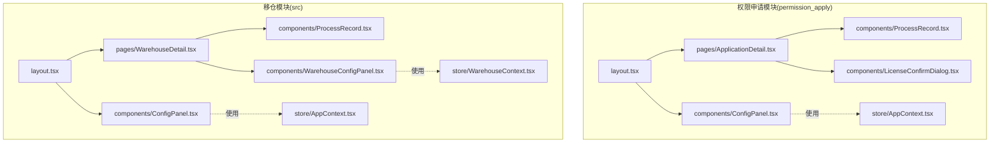
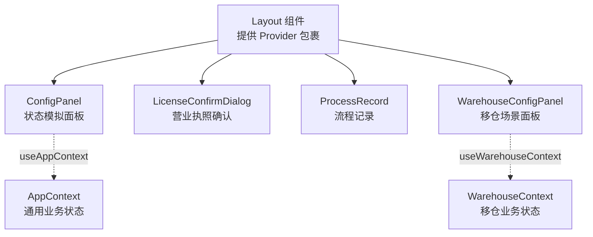
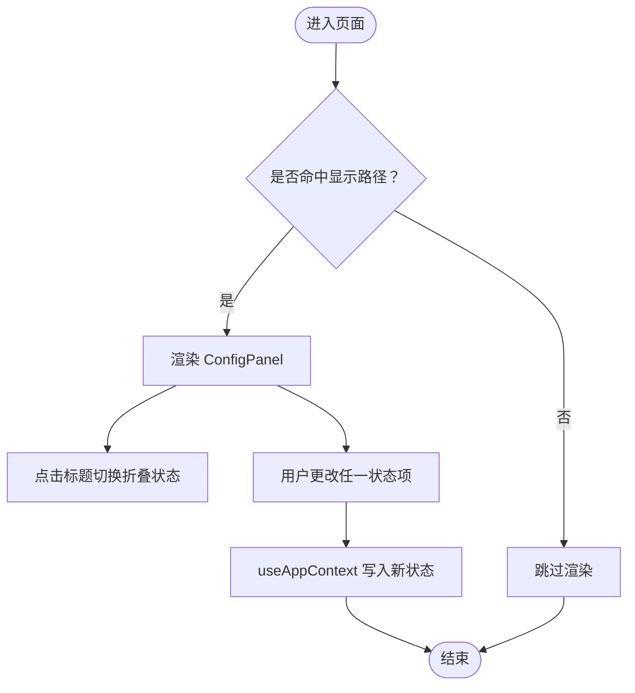
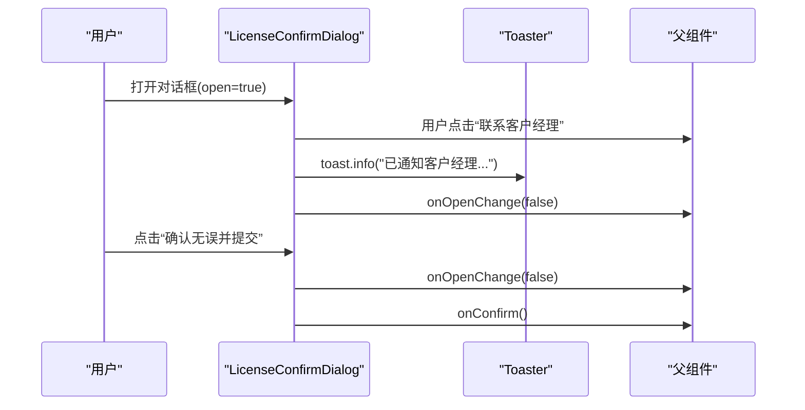
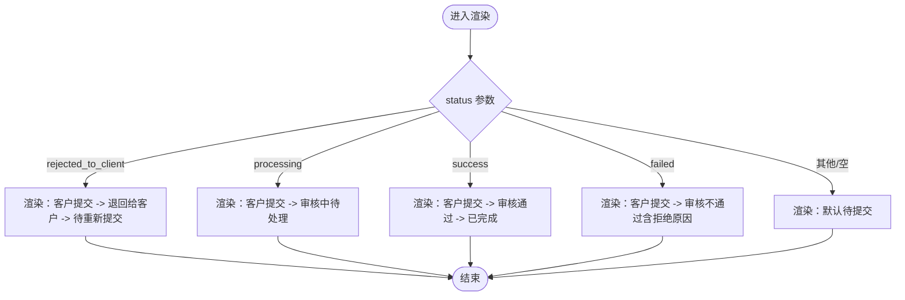
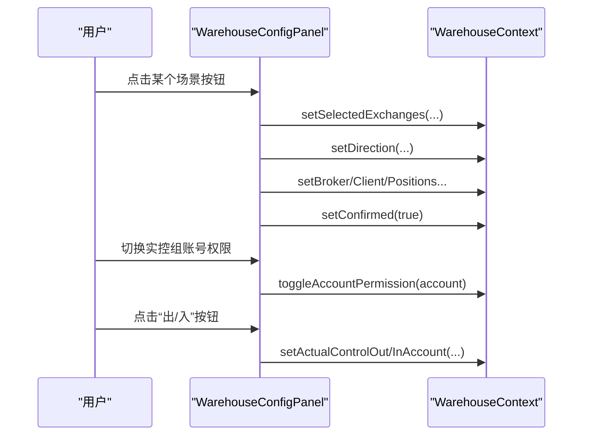
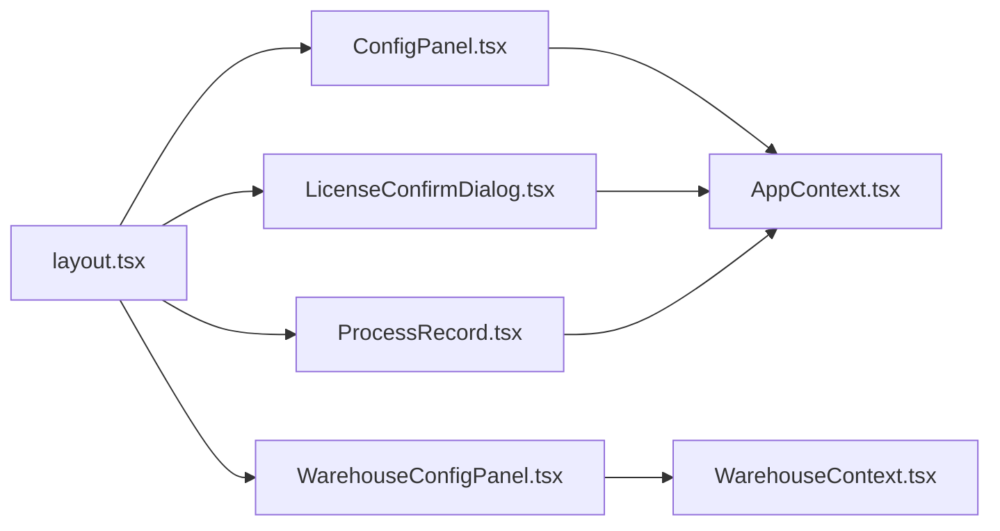

# 业务组件

<cite>
**本文引用的文件**
- [ConfigPanel.tsx](file://src/app/components/ConfigPanel.tsx)
- [LicenseConfirmDialog.tsx](file://src/app/components/LicenseConfirmDialog.tsx)
- [ProcessRecord.tsx](file://src/app/components/ProcessRecord.tsx)
- [WarehouseConfigPanel.tsx](file://src/app/components/WarehouseConfigPanel.tsx)
- [AppContext.tsx](file://src/app/store/AppContext.tsx)
- [WarehouseContext.tsx](file://src/app/store/WarehouseContext.tsx)
- [layout.tsx](file://src/app/layout.tsx)
- [ApplicationDetail.tsx](file://permission_apply/src/app/pages/ApplicationDetail.tsx)
- [WarehouseDetail.tsx](file://src/app/pages/WarehouseDetail.tsx)
</cite>

## 目录
1. [引言](#引言)
2. [项目结构](#项目结构)
3. [核心组件](#核心组件)
4. [架构总览](#架构总览)
5. [组件详解](#组件详解)
6. [依赖关系分析](#依赖关系分析)
7. [性能考量](#性能考量)
8. [故障排查指南](#故障排查指南)
9. [结论](#结论)
10. [附录](#附录)

## 引言
本文件聚焦于业务专用组件的设计理念、功能特性与使用场景，涵盖配置面板、对话框组件、流程记录组件等。文档以“可读性优先”的原则，结合实际源码路径与片段位置，帮助开发者快速理解组件职责、API 接口、配置项、事件处理与集成方式，并提供定制化、状态管理与错误处理的最佳实践建议。

## 项目结构
业务组件主要位于 src/app/components 与 permission_apply/src/app/components 下，配合各自模块的上下文（AppContext、WarehouseContext）进行状态共享；页面层通过路由与布局组件挂载这些业务组件。

图表来源
- [layout.tsx:74-174](file://src/app/layout.tsx#L74-L174)
- [ApplicationDetail.tsx:1-113](file://permission_apply/src/app/pages/ApplicationDetail.tsx#L1-L113)
- [WarehouseDetail.tsx:190-200](file://src/app/pages/WarehouseDetail.tsx#L190-L200)

章节来源
- [layout.tsx:74-174](file://src/app/layout.tsx#L74-L174)
- [layout.tsx:9-87](file://permission_apply/src/app/layout.tsx#L9-L87)

## 核心组件
- 配置面板（ConfigPanel）
  - 设计目标：提供可折叠的状态模拟面板，用于快速切换与演示业务变量，如风险等级、资金水平、客户类型、投资者类型等。
  - 关键能力：折叠/展开、批量设置状态、响应式 UI。
  - 适用场景：开发调试、演示模式、快速切换业务状态。
- 营业执照确认对话框（LicenseConfirmDialog）
  - 设计目标：在提交前对营业执照信息进行二次确认，支持“信息有误”引导联系客户经理。
  - 关键能力：信息卡片展示、确认/取消交互、消息提示。
  - 适用场景：合规校验前置、减少资料错误率。
- 流程记录（ProcessRecord）
  - 设计目标：以时间轴形式展示业务流程节点与状态变化，支持多种状态分支（退回、审核中、通过、不通过）。
  - 关键能力：多状态渲染、拒绝原因展示、日期/操作人信息。
  - 适用场景：申请/审批详情页、审计追踪可视化。
- 移仓场景面板（WarehouseConfigPanel）
  - 设计目标：一键填充移仓业务表单，支持实控组账号权限开关与“出/入”快捷填入。
  - 关键能力：场景模板填充、权限控制、交互式填单。
  - 适用场景：移仓业务表单录入、批量测试与演示。

章节来源
- [ConfigPanel.tsx:1-134](file://src/app/components/ConfigPanel.tsx#L1-L134)
- [LicenseConfirmDialog.tsx:1-109](file://src/app/components/LicenseConfirmDialog.tsx#L1-L109)
- [ProcessRecord.tsx:1-135](file://src/app/components/ProcessRecord.tsx#L1-L135)
- [WarehouseConfigPanel.tsx:1-204](file://src/app/components/WarehouseConfigPanel.tsx#L1-L204)

## 架构总览
组件通过各自的 Context 提供状态与行为，页面通过路由与布局挂载组件，形成“布局-页面-组件-上下文”的分层结构。

图表来源
- [layout.tsx:81-171](file://src/app/layout.tsx#L81-L171)
- [AppContext.tsx:31-63](file://src/app/store/AppContext.tsx#L31-L63)
- [WarehouseContext.tsx:77-177](file://src/app/store/WarehouseContext.tsx#L77-L177)

## 组件详解

### 配置面板（ConfigPanel）
- 功能定位
  - 在页面右下角固定悬浮，支持折叠/展开，便于在不同页面快速切换业务状态。
- 主要属性与行为
  - 展开/折叠：内部维护 collapsed 状态，点击标题栏切换。
  - 投资者类型：普通/专业，点击切换。
  - 客户类型：一般法人/特种客户，点击切换。
  - 风险等级：C3/C4/C5，点击选择。
  - 可用资金：下拉选择区间。
  - 交易经历：下拉选择是否满 50 个交易日。
  - 已有权限赋值：下拉选择现有最高权限值。
- 与上下文的关系
  - 通过 useAppContext 获取与写入状态，影响后续业务逻辑与 UI 表现。
- 使用示例
  - 在布局中按路径条件渲染，例如首页或提交表单页。
- 最佳实践
  - 将面板置于低干扰区域，避免遮挡关键内容。
  - 对高频切换项提供视觉反馈（选中态）。
  - 仅暴露必要字段，避免信息过载。

图表来源
- [layout.tsx:168-169](file://src/app/layout.tsx#L168-L169)
- [ConfigPanel.tsx:6-134](file://src/app/components/ConfigPanel.tsx#L6-L134)
- [AppContext.tsx:31-63](file://src/app/store/AppContext.tsx#L31-L63)

章节来源
- [ConfigPanel.tsx:1-134](file://src/app/components/ConfigPanel.tsx#L1-L134)
- [layout.tsx:168-169](file://src/app/layout.tsx#L168-L169)
- [AppContext.tsx:31-63](file://src/app/store/AppContext.tsx#L31-L63)

### 营业执照确认对话框（LicenseConfirmDialog）
- 功能定位
  - 在提交前对营业执照信息进行最终确认，支持“信息有误”时联系客户经理。
- 主要属性与行为
  - 打开/关闭：由外部传入 open/onOpenChange 控制。
  - 确认提交：onConfirm 回调触发业务提交。
  - 信息展示：企业名称、统一社会信用代码等关键信息卡片。
  - 提示交互：信息有误时的引导按钮，点击后通过 toast 提示。
- 使用示例
  - 在提交表单页或详情页，当需要最终确认时弹出。
- 最佳实践
  - 明确区分“确认无误并提交”与“联系客户经理”，避免误触。
  - 对 toast 的文案与样式进行一致性设计。

图表来源
- [LicenseConfirmDialog.tsx:14-109](file://src/app/components/LicenseConfirmDialog.tsx#L14-L109)

章节来源
- [LicenseConfirmDialog.tsx:1-109](file://src/app/components/LicenseConfirmDialog.tsx#L1-L109)

### 流程记录（ProcessRecord）
- 功能定位
  - 以时间轴形式展示业务流程的关键节点与状态变化，支持多种状态分支。
- 主要属性与行为
  - status：控制渲染分支（如 rejected_to_client、processing、success、failed、默认待提交）。
  - rejectReason：退回/不通过时的拒绝原因展示。
  - submitDate：提交时间等辅助信息。
  - 渲染差异：根据状态渲染不同的节点与样式（如橙色退回、绿色通过、红色不通过）。
- 使用示例
  - 在权限申请详情页与移仓详情页中作为子组件嵌入。
- 最佳实践
  - 为每个状态节点提供明确的时间戳与操作人信息。
  - 对拒绝原因进行富文本展示，提升可读性。

图表来源
- [ProcessRecord.tsx:4-135](file://src/app/components/ProcessRecord.tsx#L4-L135)

章节来源
- [ProcessRecord.tsx:1-135](file://src/app/components/ProcessRecord.tsx#L1-L135)
- [ApplicationDetail.tsx:24-102](file://permission_apply/src/app/pages/ApplicationDetail.tsx#L24-L102)
- [WarehouseDetail.tsx:190-200](file://src/app/pages/WarehouseDetail.tsx#L190-L200)

### 移仓场景面板（WarehouseConfigPanel）
- 功能定位
  - 一键填充移仓业务表单，支持多交易所、多方向（移入/移出/实控组）场景，以及实控组账号权限开关与快捷填入。
- 主要属性与行为
  - 场景填充：内置多个场景函数，一键设置交易所、方向、经纪商、客户信息、仓位等。
  - 权限控制：实控组账号权限开关，动态决定是否允许填入。
  - 快捷填入：“出/入”按钮直接将账号填入对应输入项。
- 使用示例
  - 在移仓申请页或详情页中挂载，配合 WarehouseContext 使用。
- 最佳实践
  - 场景函数应尽量覆盖常见业务场景，减少重复配置。
  - 对权限开关与填入按钮提供清晰的视觉反馈与提示。

图表来源
- [WarehouseConfigPanel.tsx:14-204](file://src/app/components/WarehouseConfigPanel.tsx#L14-L204)
- [WarehouseContext.tsx:77-177](file://src/app/store/WarehouseContext.tsx#L77-L177)

章节来源
- [WarehouseConfigPanel.tsx:1-204](file://src/app/components/WarehouseConfigPanel.tsx#L1-L204)
- [WarehouseContext.tsx:77-177](file://src/app/store/WarehouseContext.tsx#L77-L177)

## 依赖关系分析
- 组件与上下文
  - ConfigPanel 与 LicenseConfirmDialog 依赖 AppContext 提供的通用业务状态。
  - WarehouseConfigPanel 依赖 WarehouseContext 提供的移仓业务状态。
- 页面与组件
  - 布局组件在特定路径下渲染业务组件，形成“页面-组件-上下文”的依赖链。
- 外部依赖
  - 对 UI 组件库（Button、Dialog 等）与通知库（sonner）的使用，确保一致的交互体验。

图表来源
- [layout.tsx:81-171](file://src/app/layout.tsx#L81-L171)
- [AppContext.tsx:31-63](file://src/app/store/AppContext.tsx#L31-L63)
- [WarehouseContext.tsx:77-177](file://src/app/store/WarehouseContext.tsx#L77-L177)

章节来源
- [layout.tsx:81-171](file://src/app/layout.tsx#L81-L171)
- [AppContext.tsx:31-63](file://src/app/store/AppContext.tsx#L31-L63)
- [WarehouseContext.tsx:77-177](file://src/app/store/WarehouseContext.tsx#L77-L177)

## 性能考量
- 渲染优化
  - ConfigPanel 与 WarehouseConfigPanel 使用折叠状态减少 DOM 渲染量；建议在复杂场景下进一步采用懒加载或虚拟滚动。
- 状态更新
  - 通过 Context 批量更新状态，避免频繁重渲染；对高频变更项可考虑拆分更细的 Context 或局部状态。
- 图片与资源
  - 对图片使用占位图与懒加载策略，降低首屏压力。
- 交互反馈
  - Toast 与对话框的触发频率应受控，避免过多弹窗影响用户体验。

## 故障排查指南
- 对话框无法关闭
  - 检查 open/onOpenChange 是否正确传递到对话框组件；确认 onOpenChange 在回调中被调用。
- 状态未更新
  - 确认组件是否在正确的 Provider 包裹下；检查 useAppContext/useWarehouseContext 的调用位置。
- 场景填充无效
  - 检查场景函数是否被正确绑定到按钮 onClick；确认 WarehouseContext 的 setter 方法存在且未被覆盖。
- 流程记录显示异常
  - 检查传入的 status/rejectReason/submitDate 是否符合预期；确认分支逻辑覆盖所有可能状态。

章节来源
- [LicenseConfirmDialog.tsx:14-109](file://src/app/components/LicenseConfirmDialog.tsx#L14-L109)
- [ConfigPanel.tsx:6-134](file://src/app/components/ConfigPanel.tsx#L6-L134)
- [WarehouseConfigPanel.tsx:14-204](file://src/app/components/WarehouseConfigPanel.tsx#L14-L204)
- [ProcessRecord.tsx:4-135](file://src/app/components/ProcessRecord.tsx#L4-L135)

## 结论
本文档系统梳理了配置面板、对话框组件与流程记录组件的设计理念、实现细节与最佳实践。通过 Context 解耦状态与视图，组件在布局层按需渲染，形成清晰的业务组件体系。建议在后续迭代中持续优化交互反馈、性能与可维护性，确保组件在多业务场景下的稳定性与扩展性。

## 附录
- 组件 API 摘要
  - ConfigPanel
    - 属性：无（通过 Context 注入状态）
    - 事件：无（通过按钮与选择器触发 Context 更新）
  - LicenseConfirmDialog
    - 属性：open, onOpenChange, onConfirm
    - 事件：确认提交、联系客户经理
  - ProcessRecord
    - 属性：status, rejectReason, submitDate
    - 事件：无（纯展示）
  - WarehouseConfigPanel
    - 属性：无（通过 WarehouseContext 注入状态）
    - 事件：场景填充、权限切换、快捷填入

章节来源
- [ConfigPanel.tsx:1-134](file://src/app/components/ConfigPanel.tsx#L1-L134)
- [LicenseConfirmDialog.tsx:8-12](file://src/app/components/LicenseConfirmDialog.tsx#L8-L12)
- [ProcessRecord.tsx:4-12](file://src/app/components/ProcessRecord.tsx#L4-L12)
- [WarehouseConfigPanel.tsx:14-112](file://src/app/components/WarehouseConfigPanel.tsx#L14-L112)