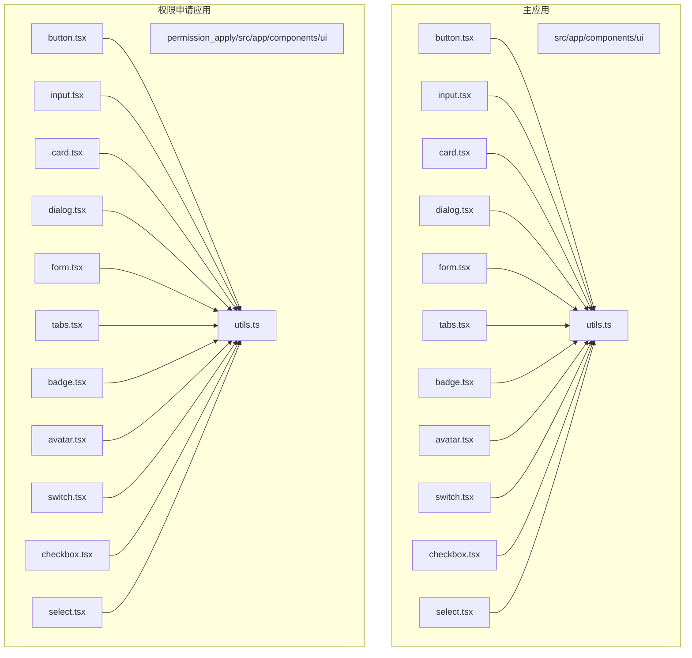
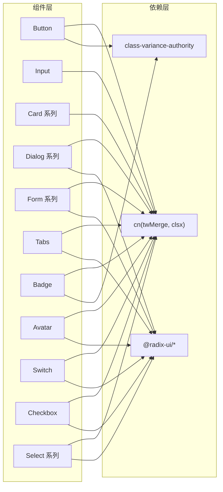
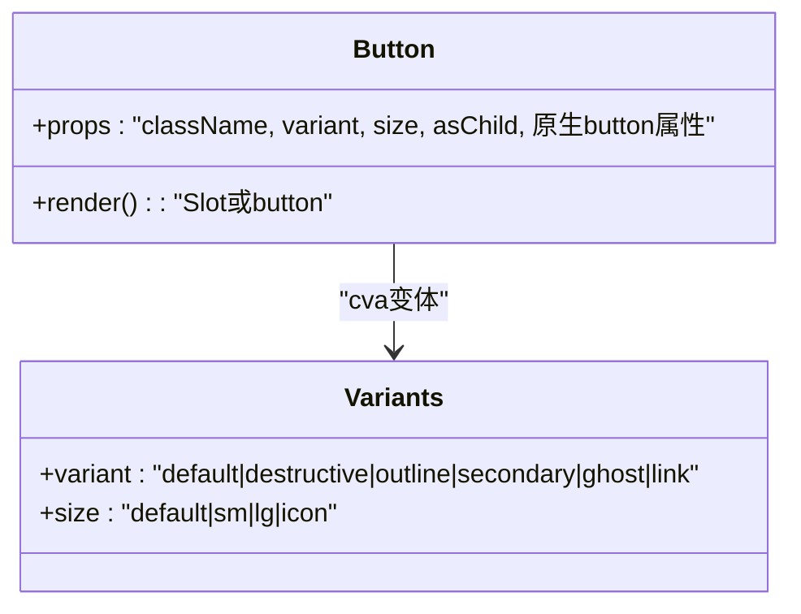
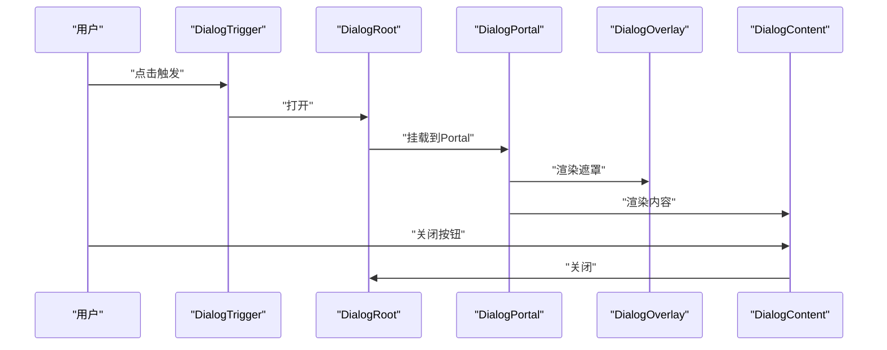
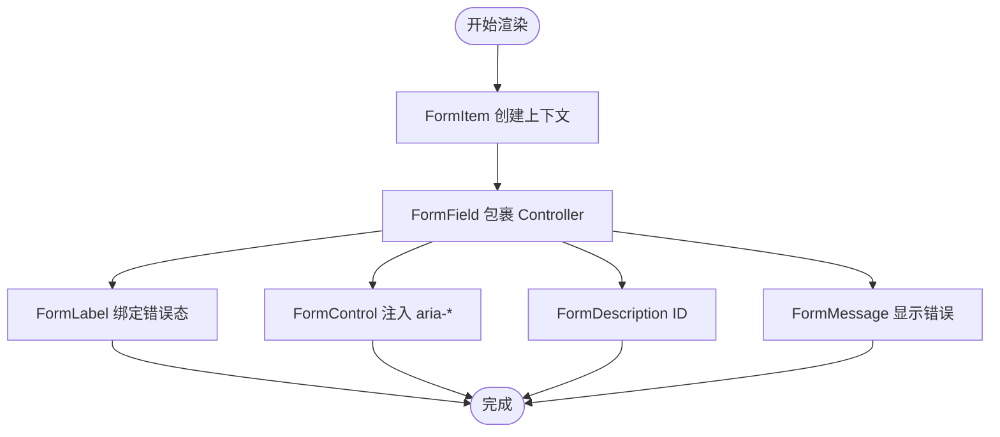
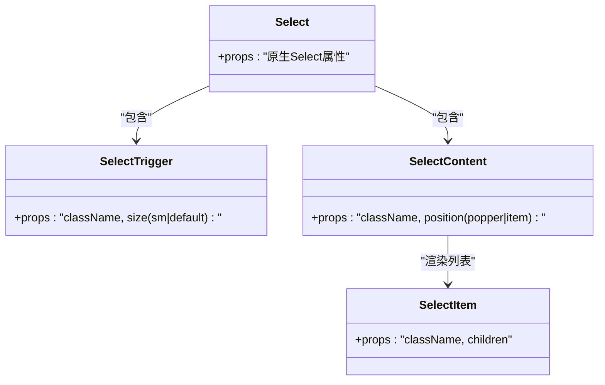
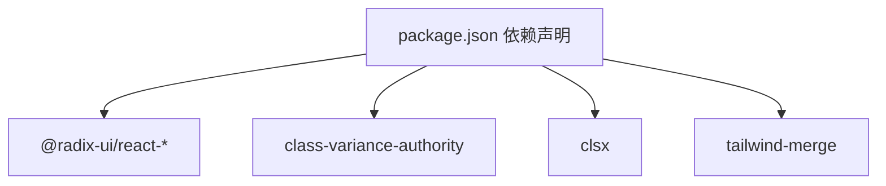

# 原子组件

<cite>
**本文引用的文件**
- [package.json](file://package.json)
- [utils.ts（主应用）](file://src/app/components/ui/utils.ts)
- [utils.ts（权限申请应用）](file://permission_apply/src/app/components/ui/utils.ts)
- [button.tsx（主应用）](file://src/app/components/ui/button.tsx)
- [button.tsx（权限申请应用）](file://permission_apply/src/app/components/ui/button.tsx)
- [input.tsx（主应用）](file://src/app/components/ui/input.tsx)
- [card.tsx（主应用）](file://src/app/components/ui/card.tsx)
- [dialog.tsx（主应用）](file://src/app/components/ui/dialog.tsx)
- [form.tsx（主应用）](file://src/app/components/ui/form.tsx)
- [tabs.tsx（主应用）](file://src/app/components/ui/tabs.tsx)
- [badge.tsx（主应用）](file://src/app/components/ui/badge.tsx)
- [avatar.tsx（主应用）](file://src/app/components/ui/avatar.tsx)
- [switch.tsx（主应用）](file://src/app/components/ui/switch.tsx)
- [checkbox.tsx（主应用）](file://src/app/components/ui/checkbox.tsx)
- [select.tsx（主应用）](file://src/app/components/ui/select.tsx)
</cite>

## 目录
1. [简介](#简介)
2. [项目结构](#项目结构)
3. [核心组件](#核心组件)
4. [架构总览](#架构总览)
5. [组件详解](#组件详解)
6. [依赖关系分析](#依赖关系分析)
7. [性能与可访问性](#性能与可访问性)
8. [故障排查指南](#故障排查指南)
9. [结论](#结论)
10. [附录：API 参考速查](#附录api-参考速查)

## 简介
本文件系统化梳理基于 Radix UI 的“原子组件”体系，围绕以下主题展开：
- 设计理念：以最小可用单元构建高内聚、低耦合的 UI 组件；通过语义化数据槽（data-slot）统一调试与测试入口；以 Tailwind 类合并工具实现样式叠加与覆盖。
- CVA 变体系统：使用 class-variance-authority 定义变体（variant/size），在运行时按传入参数生成最终类名，保证一致的外观与交互。
- 属性与样式：统一的 className 合并与变体映射，确保可扩展性与一致性。
- 使用场景：按钮、输入框、卡片、对话框、表单、标签页、徽章、头像、开关、复选框、选择器等。
- 组合模式：以基础原子组件为积木，组合出更复杂的业务组件；强调可访问性与无障碍属性。
- 性能与最佳实践：避免重复渲染、合理使用 Portal、最小化样式计算、利用 data-slot 提升可观测性。

## 项目结构
该仓库包含两套应用，均在同一套 UI 原子组件之上进行业务封装：
- 主应用：src/app/components/ui
- 权限申请应用：permission_apply/src/app/components/ui

两者共享同一套工具函数与组件实现，确保风格与行为一致。

图表来源
- [button.tsx（主应用）:1-59](file://src/app/components/ui/button.tsx#L1-L59)
- [input.tsx（主应用）:1-22](file://src/app/components/ui/input.tsx#L1-L22)
- [card.tsx（主应用）:1-93](file://src/app/components/ui/card.tsx#L1-L93)
- [dialog.tsx（主应用）:1-136](file://src/app/components/ui/dialog.tsx#L1-L136)
- [form.tsx（主应用）:1-169](file://src/app/components/ui/form.tsx#L1-L169)
- [tabs.tsx（主应用）:1-67](file://src/app/components/ui/tabs.tsx#L1-L67)
- [badge.tsx（主应用）:1-47](file://src/app/components/ui/badge.tsx#L1-L47)
- [avatar.tsx（主应用）:1-54](file://src/app/components/ui/avatar.tsx#L1-L54)
- [switch.tsx（主应用）:1-32](file://src/app/components/ui/switch.tsx#L1-L32)
- [checkbox.tsx（主应用）:1-33](file://src/app/components/ui/checkbox.tsx#L1-L33)
- [select.tsx（主应用）:1-190](file://src/app/components/ui/select.tsx#L1-L190)
- [utils.ts（主应用）:1-7](file://src/app/components/ui/utils.ts#L1-L7)

章节来源
- [package.json:11-66](file://package.json#L11-L66)

## 核心组件
本节聚焦原子组件的设计与实现要点，涵盖：
- 工具函数：cn（clsx + tailwind-merge）统一类名合并策略，避免冲突与重复。
- 变体系统：cva 定义 variant/size 等变体，结合 VariantProps 推导类型安全的属性。
- 数据槽：data-slot 为调试、测试与样式覆盖提供稳定锚点。
- 可访问性：大量组件直接基于 @radix-ui/react-* 实现，继承其无障碍能力；同时补充 aria-* 属性与焦点环样式。

章节来源
- [utils.ts（主应用）:1-7](file://src/app/components/ui/utils.ts#L1-L7)
- [utils.ts（权限申请应用）:1-7](file://permission_apply/src/app/components/ui/utils.ts#L1-L7)
- [button.tsx（主应用）:7-35](file://src/app/components/ui/button.tsx#L7-L35)
- [button.tsx（权限申请应用）:7-35](file://permission_apply/src/app/components/ui/button.tsx#L7-L35)
- [dialog.tsx（主应用）:33-47](file://src/app/components/ui/dialog.tsx#L33-L47)
- [form.tsx（主应用）:90-104](file://src/app/components/ui/form.tsx#L90-L104)

## 架构总览
下图展示原子组件与外部依赖的关系：组件依赖 Radix UI 原子能力，通过 CVA 生成变体，通过 cn 合并 Tailwind 类，形成统一的样式与行为。

图表来源
- [button.tsx（主应用）:1-59](file://src/app/components/ui/button.tsx#L1-L59)
- [input.tsx（主应用）:1-22](file://src/app/components/ui/input.tsx#L1-L22)
- [card.tsx（主应用）:1-93](file://src/app/components/ui/card.tsx#L1-L93)
- [dialog.tsx（主应用）:1-136](file://src/app/components/ui/dialog.tsx#L1-L136)
- [form.tsx（主应用）:1-169](file://src/app/components/ui/form.tsx#L1-L169)
- [tabs.tsx（主应用）:1-67](file://src/app/components/ui/tabs.tsx#L1-L67)
- [badge.tsx（主应用）:1-47](file://src/app/components/ui/badge.tsx#L1-L47)
- [avatar.tsx（主应用）:1-54](file://src/app/components/ui/avatar.tsx#L1-L54)
- [switch.tsx（主应用）:1-32](file://src/app/components/ui/switch.tsx#L1-L32)
- [checkbox.tsx（主应用）:1-33](file://src/app/components/ui/checkbox.tsx#L1-L33)
- [select.tsx（主应用）:1-190](file://src/app/components/ui/select.tsx#L1-L190)
- [utils.ts（主应用）:1-7](file://src/app/components/ui/utils.ts#L1-L7)

## 组件详解

### Button（按钮）
- 功能特性
  - 支持多种变体（默认、破坏性、描边、次级、幽灵、链接）与尺寸（默认、小、大、图标）。
  - 支持 asChild 将渲染节点替换为任意元素（如链接）。
  - 内置聚焦态与无效态的视觉反馈（边框、光晕）。
- API 接口
  - 属性：className、variant、size、asChild、原生 button 属性。
  - 变体：variant → default/destructive/outline/secondary/ghost/link
  - 尺寸：size → default/sm/lg/icon
- 使用场景
  - 表单提交、导航跳转、操作触发、危险操作警示。
- 可访问性
  - 保持原生 button 的可访问性语义；支持键盘激活与焦点可见性。
- 样式定制
  - 通过 className 覆盖；变体由 CVA 生成，优先级低于传入 className。
- 组合模式
  - 与 Icon 组合；作为 Tabs/Dialog 的触发器；在 Card 中作为操作区按钮。

图表来源
- [button.tsx（主应用）:37-56](file://src/app/components/ui/button.tsx#L37-L56)
- [button.tsx（主应用）:7-35](file://src/app/components/ui/button.tsx#L7-L35)

章节来源
- [button.tsx（主应用）:7-35](file://src/app/components/ui/button.tsx#L7-L35)
- [button.tsx（主应用）:37-56](file://src/app/components/ui/button.tsx#L37-L56)
- [button.tsx（权限申请应用）:7-35](file://permission_apply/src/app/components/ui/button.tsx#L7-L35)
- [button.tsx（权限申请应用）:37-56](file://permission_apply/src/app/components/ui/button.tsx#L37-L56)

### Input（输入框）
- 功能特性
  - 统一的边框、背景、聚焦态与无效态样式；支持占位符与选择态颜色。
  - 通过 data-slot 便于定位与测试。
- API 接口
  - 属性：className、type、原生 input 属性。
- 使用场景
  - 文本输入、搜索、密码、数字等。
- 可访问性
  - 保持原生 input 的可访问性；聚焦态具备可见轮廓。
- 样式定制
  - 通过 className 覆盖默认样式；与 FormLabel/FormMessage 协同实现错误状态反馈。

章节来源
- [input.tsx（主应用）:5-19](file://src/app/components/ui/input.tsx#L5-L19)

### Card（卡片）
- 功能特性
  - 卡片容器与分区块（头部、标题、描述、内容、底部、操作）。
  - 头部网格布局支持右侧操作区自适应排列。
- API 接口
  - Card/CardHeader/CardTitle/CardDescription/CardContent/CardFooter/CardAction。
- 使用场景
  - 列表项、信息面板、设置块、统计卡片。
- 可访问性
  - 语义化 div 结构；配合标题层级使用。
- 样式定制
  - 通过 className 覆盖各区块样式；注意 CardHeader 的网格行为。

章节来源
- [card.tsx（主应用）:5-92](file://src/app/components/ui/card.tsx#L5-L92)

### Dialog（对话框）
- 功能特性
  - Root/Trigger/Portal/Overlay/Content/Close/Header/Footer/Title/Description。
  - 内置动画入场/出场与居中布局；关闭按钮含无障碍文本。
- API 接口
  - 组件：Dialog、DialogTrigger、DialogPortal、DialogOverlay、DialogContent、DialogClose、DialogHeader、DialogFooter、DialogTitle、DialogDescription。
- 使用场景
  - 确认弹窗、详情查看、设置面板、模态表单。
- 可访问性
  - 基于 @radix-ui/react-dialog，自动管理焦点与隐藏页面内容。
- 样式定制
  - 通过 className 覆盖 Overlay/Content 等容器样式；注意 Portal 渲染位置。

图表来源
- [dialog.tsx（主应用）:9-73](file://src/app/components/ui/dialog.tsx#L9-L73)

章节来源
- [dialog.tsx（主应用）:9-135](file://src/app/components/ui/dialog.tsx#L9-L135)

### Form（表单）
- 功能特性
  - FormProvider、FormField、FormItem、FormLabel、FormControl、FormDescription、FormMessage。
  - 自动注入 aria-* 属性与错误状态；与 react-hook-form 深度集成。
- API 接口
  - 组件：Form、FormField、FormItem、FormLabel、FormControl、FormDescription、FormMessage。
  - Hook：useFormField。
- 使用场景
  - 登录、注册、设置、审批表单。
- 可访问性
  - 自动设置 aria-describedby/aria-invalid；标签与控件关联。
- 样式定制
  - 通过 className 覆盖各区块样式；错误态由 data-error 控制。

图表来源
- [form.tsx（主应用）:32-66](file://src/app/components/ui/form.tsx#L32-L66)
- [form.tsx（主应用）:76-124](file://src/app/components/ui/form.tsx#L76-L124)
- [form.tsx（主应用）:139-157](file://src/app/components/ui/form.tsx#L139-L157)

章节来源
- [form.tsx（主应用）:19-168](file://src/app/components/ui/form.tsx#L19-L168)

### Tabs（标签页）
- 功能特性
  - Root/List/Trigger/Content；支持禁用、禁用态透明度与聚焦环。
- API 接口
  - 组件：Tabs、TabsList、TabsTrigger、TabsContent。
- 使用场景
  - 设置分组、筛选面板、多步骤流程。
- 可访问性
  - 基于 @radix-ui/react-tabs，键盘导航与焦点管理。
- 样式定制
  - 通过 className 覆盖列表与触发器样式；注意激活态边框与背景。

章节来源
- [tabs.tsx（主应用）:8-66](file://src/app/components/ui/tabs.tsx#L8-L66)

### Badge（徽章）
- 功能特性
  - 支持多种变体（默认、次级、破坏、描边）；可作为 Slot 渲染任意元素。
- API 接口
  - 属性：className、variant、asChild。
- 使用场景
  - 状态标识、标签、计数。
- 可访问性
  - 语义化 span；可作为链接时具备 hover 效果。
- 样式定制
  - 通过 className 覆盖默认样式；变体由 CVA 生成。

章节来源
- [badge.tsx（主应用）:7-46](file://src/app/components/ui/badge.tsx#L7-L46)

### Avatar（头像）
- 功能特性
  - Root/Image/Fallback；支持占位与懒加载回退。
- API 接口
  - 组件：Avatar、AvatarImage、AvatarFallback。
- 使用场景
  - 用户头像、占位图。
- 可访问性
  - 语义化结构；fallback 提供可读文本占位。
- 样式定制
  - 通过 className 覆盖容器与图片样式。

章节来源
- [avatar.tsx（主应用）:8-53](file://src/app/components/ui/avatar.tsx#L8-L53)

### Switch（开关）
- 功能特性
  - 基于 @radix-ui/react-switch；内置聚焦环与状态切换动画。
- API 接口
  - 组件：Switch。
- 使用场景
  - 功能开关、夜间模式、启用/禁用。
- 可访问性
  - 原生可访问性；键盘切换。
- 样式定制
  - 通过 className 覆盖根容器样式；Thumb 由数据状态驱动。

章节来源
- [switch.tsx（主应用）:8-31](file://src/app/components/ui/switch.tsx#L8-L31)

### Checkbox（复选框）
- 功能特性
  - 基于 @radix-ui/react-checkbox；内置勾选图标与状态样式。
- API 接口
  - 组件：Checkbox。
- 使用场景
  - 多选、同意协议、批量操作。
- 可访问性
  - 原生可访问性；键盘切换。
- 样式定制
  - 通过 className 覆盖根容器样式；指示器内嵌图标。

章节来源
- [checkbox.tsx（主应用）:9-32](file://src/app/components/ui/checkbox.tsx#L9-L32)

### Select（选择器）
- 功能特性
  - Root/Group/Value/Trigger/Content/Viewport/Item/Label/Separator/ScrollUpButton/ScrollDownButton。
  - 支持滚动条、占位符、尺寸（sm/default）、弹出定位（popper）。
- API 接口
  - 组件：Select、SelectTrigger、SelectContent、SelectItem、SelectLabel、SelectSeparator、SelectScrollUpButton、SelectScrollDownButton、SelectValue、SelectGroup。
  - 属性：SelectTrigger.size（sm/default）。
- 使用场景
  - 下拉菜单、筛选器、排序器。
- 可访问性
  - 基于 @radix-ui/react-select，键盘导航与无障碍文本。
- 样式定制
  - 通过 className 覆盖 Trigger/Content/Item 等样式；Viewport 高度与宽度由数据槽控制。

图表来源
- [select.tsx（主应用）:13-189](file://src/app/components/ui/select.tsx#L13-L189)

章节来源
- [select.tsx（主应用）:13-189](file://src/app/components/ui/select.tsx#L13-L189)

## 依赖关系分析
- 外部依赖
  - @radix-ui/react-*：提供可访问性的交互基元（Dialog、Tabs、Select、Avatar、Switch、Checkbox 等）。
  - class-variance-authority：定义变体规则，生成类型安全的类名映射。
  - clsx + tailwind-merge：合并类名，避免冲突与重复。
- 内部依赖
  - 所有组件均依赖 utils.ts 中的 cn 函数进行类名合并。
  - Button 与 Badge 使用 CVA 定义变体；其余组件主要通过 cn 与原生属性实现样式。

图表来源
- [package.json:11-66](file://package.json#L11-L66)

章节来源
- [package.json:11-66](file://package.json#L11-L66)

## 性能与可访问性
- 性能
  - 使用 Portal（如 Dialog/Select）减少 DOM 深度对布局的影响。
  - 通过 data-slot 降低选择器复杂度，提升定位效率。
  - 避免在渲染路径中进行昂贵的样式计算，尽量使用预设变体。
- 可访问性
  - 所有交互组件基于 Radix UI，天然具备键盘导航、焦点管理与屏幕阅读器支持。
  - 错误态通过 aria-invalid 与 aria-describedby 正确传递给辅助技术。
  - 关注态与聚焦环统一，确保键盘用户的可见反馈。

## 故障排查指南
- 样式冲突
  - 症状：组件样式被意外覆盖或重复。
  - 处理：确认是否正确传入 className；检查是否混用第三方样式；优先使用 data-slot 选择器，避免全局污染。
- 变体不生效
  - 症状：指定 variant/size 未产生预期样式。
  - 处理：核对传参名称与取值；确认未被后续 className 覆盖。
- 对话框/选择器位置异常
  - 症状：弹层偏移或遮挡。
  - 处理：检查父级定位；必要时调整 Portal 容器层级；确认 Select 的 position 与 Trigger 尺寸。
- 表单错误显示不正确
  - 症状：错误信息未显示或未绑定到对应控件。
  - 处理：确认 FormControl 是否包裹了受控组件；检查 useFormField 返回的 ID 与 aria-* 属性。

章节来源
- [dialog.tsx（主应用）:54-72](file://src/app/components/ui/dialog.tsx#L54-L72)
- [select.tsx（主应用）:62-89](file://src/app/components/ui/select.tsx#L62-L89)
- [form.tsx（主应用）:107-124](file://src/app/components/ui/form.tsx#L107-L124)

## 结论
本原子组件体系以 Radix UI 为基础，结合 CVA 与 cn 工具，实现了高内聚、强一致、易组合的 UI 原子层。通过 data-slot 与类型安全的变体系统，既保证了开发体验，也提升了可维护性与可访问性。建议在业务组件中遵循“先原子后复合”的原则，充分利用现有变体与数据槽，减少重复造轮子的成本。

## 附录：API 参考速查
- Button
  - 变体：default/destructive/outline/secondary/ghost/link
  - 尺寸：default/sm/lg/icon
  - 属性：className、variant、size、asChild、原生 button 属性
- Input
  - 属性：className、type、原生 input 属性
- Card
  - 组件：Card/CardHeader/CardTitle/CardDescription/CardContent/CardFooter/CardAction
- Dialog
  - 组件：Dialog/DialogTrigger/DialogPortal/DialogOverlay/DialogContent/DialogClose/DialogHeader/DialogFooter/DialogTitle/DialogDescription
- Form
  - 组件：Form/FormField/FormItem/FormLabel/FormControl/FormDescription/FormMessage
  - Hook：useFormField
- Tabs
  - 组件：Tabs/TabsList/TabsTrigger/TabsContent
- Badge
  - 变体：default/secondary/destructive/outline
  - 属性：className、variant、asChild
- Avatar
  - 组件：Avatar/AvatarImage/AvatarFallback
- Switch
  - 组件：Switch
- Checkbox
  - 组件：Checkbox
- Select
  - 组件：Select/SelectTrigger/SelectContent/SelectItem/SelectLabel/SelectSeparator/SelectScrollUpButton/SelectScrollDownButton/SelectValue/SelectGroup
  - 属性：SelectTrigger.size（sm/default）