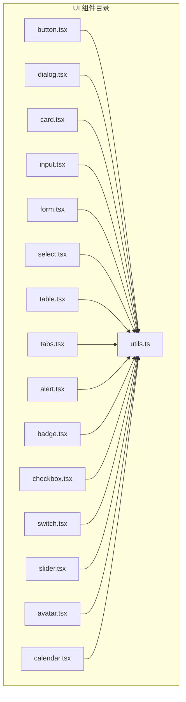
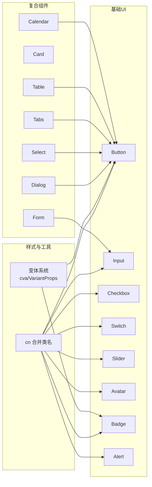
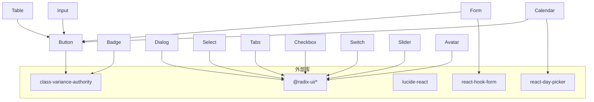

# 组件API参考

<cite>
**本文引用的文件**
- [button.tsx](file://src/app/components/ui/button.tsx)
- [dialog.tsx](file://src/app/components/ui/dialog.tsx)
- [card.tsx](file://src/app/components/ui/card.tsx)
- [input.tsx](file://src/app/components/ui/input.tsx)
- [form.tsx](file://src/app/components/ui/form.tsx)
- [select.tsx](file://src/app/components/ui/select.tsx)
- [table.tsx](file://src/app/components/ui/table.tsx)
- [tabs.tsx](file://src/app/components/ui/tabs.tsx)
- [alert.tsx](file://src/app/components/ui/alert.tsx)
- [badge.tsx](file://src/app/components/ui/badge.tsx)
- [checkbox.tsx](file://src/app/components/ui/checkbox.tsx)
- [switch.tsx](file://src/app/components/ui/switch.tsx)
- [slider.tsx](file://src/app/components/ui/slider.tsx)
- [avatar.tsx](file://src/app/components/ui/avatar.tsx)
- [calendar.tsx](file://src/app/components/ui/calendar.tsx)
- [utils.ts](file://src/app/components/ui/utils.ts)
</cite>

## 目录
1. [简介](#简介)
2. [项目结构](#项目结构)
3. [核心组件](#核心组件)
4. [架构总览](#架构总览)
5. [详细组件分析](#详细组件分析)
6. [依赖关系分析](#依赖关系分析)
7. [性能考量](#性能考量)
8. [故障排查指南](#故障排查指南)
9. [结论](#结论)
10. [附录](#附录)

## 简介
本文件为本项目UI组件库的组件API参考，覆盖按钮、对话框、卡片、输入框、表单、选择器、表格、标签页、警示、徽章、复选框、开关、滑块、头像、日历等组件。内容包括：
- 公共接口与属性定义
- 方法签名与返回值类型（如适用）
- TypeScript 类型定义要点、默认值、可选参数与约束条件
- 完整的API参数表格
- 使用示例与代码片段路径
- 生命周期、事件回调、状态管理与性能指标说明

## 项目结构
UI组件集中于 src/app/components/ui 目录，采用按功能分层组织，每个组件以独立文件暴露导出，统一通过工具函数进行样式合并。

图表来源
- [button.tsx:1-59](file://src/app/components/ui/button.tsx#L1-L59)
- [dialog.tsx:1-136](file://src/app/components/ui/dialog.tsx#L1-L136)
- [card.tsx:1-93](file://src/app/components/ui/card.tsx#L1-L93)
- [input.tsx:1-22](file://src/app/components/ui/input.tsx#L1-L22)
- [form.tsx:1-169](file://src/app/components/ui/form.tsx#L1-L169)
- [select.tsx:1-190](file://src/app/components/ui/select.tsx#L1-L190)
- [table.tsx:1-117](file://src/app/components/ui/table.tsx#L1-L117)
- [tabs.tsx:1-67](file://src/app/components/ui/tabs.tsx#L1-L67)
- [alert.tsx:1-67](file://src/app/components/ui/alert.tsx#L1-L67)
- [badge.tsx:1-47](file://src/app/components/ui/badge.tsx#L1-L47)
- [checkbox.tsx:1-33](file://src/app/components/ui/checkbox.tsx#L1-L33)
- [switch.tsx:1-32](file://src/app/components/ui/switch.tsx#L1-L32)
- [slider.tsx:1-64](file://src/app/components/ui/slider.tsx#L1-L64)
- [avatar.tsx:1-54](file://src/app/components/ui/avatar.tsx#L1-L54)
- [calendar.tsx:1-76](file://src/app/components/ui/calendar.tsx#L1-L76)
- [utils.ts](file://src/app/components/ui/utils.ts)

章节来源
- [button.tsx:1-59](file://src/app/components/ui/button.tsx#L1-L59)
- [dialog.tsx:1-136](file://src/app/components/ui/dialog.tsx#L1-L136)
- [card.tsx:1-93](file://src/app/components/ui/card.tsx#L1-L93)
- [input.tsx:1-22](file://src/app/components/ui/input.tsx#L1-L22)
- [form.tsx:1-169](file://src/app/components/ui/form.tsx#L1-L169)
- [select.tsx:1-190](file://src/app/components/ui/select.tsx#L1-L190)
- [table.tsx:1-117](file://src/app/components/ui/table.tsx#L1-L117)
- [tabs.tsx:1-67](file://src/app/components/ui/tabs.tsx#L1-L67)
- [alert.tsx:1-67](file://src/app/components/ui/alert.tsx#L1-L67)
- [badge.tsx:1-47](file://src/app/components/ui/badge.tsx#L1-L47)
- [checkbox.tsx:1-33](file://src/app/components/ui/checkbox.tsx#L1-L33)
- [switch.tsx:1-32](file://src/app/components/ui/switch.tsx#L1-L32)
- [slider.tsx:1-64](file://src/app/components/ui/slider.tsx#L1-L64)
- [avatar.tsx:1-54](file://src/app/components/ui/avatar.tsx#L1-L54)
- [calendar.tsx:1-76](file://src/app/components/ui/calendar.tsx#L1-L76)
- [utils.ts](file://src/app/components/ui/utils.ts)

## 核心组件
本节概述各组件的职责、对外接口与典型用法，便于快速查阅与集成。

- 按钮 Button：支持多种变体与尺寸，可透传原生button属性；支持asChild以渲染为任意元素。
- 对话框 Dialog：基于Radix UI，提供根容器、触发器、门户、关闭、覆盖层、内容、标题、描述、头部、底部等子组件。
- 卡片 Card：提供卡片主体、头部、标题、描述、操作区、内容、底部等子组件，便于布局组合。
- 输入框 Input：封装原生input，内置焦点与无效态样式。
- 表单 Form：基于 react-hook-form，提供 Form、FormField、FormItem、FormLabel、FormControl、FormDescription、FormMessage 及 useFormField 钩子。
- 选择器 Select：基于 Radix UI Select，提供 Root、Trigger、Content、Item、Label、Separator、ScrollUp/DownButton、Group、Value 等。
- 表格 Table：提供 Table、TableHeader、TableBody、TableFooter、TableRow、TableHead、TableCell、TableCaption 容器与单元组件。
- 标签页 Tabs：基于 Radix UI Tabs，提供 Tabs、TabsList、TabsTrigger、TabsContent。
- 警示 Alert：基于变体系统，支持默认与破坏性样式。
- 徽章 Badge：基于变体系统，支持默认、次级、破坏性、描边等变体，支持asChild。
- 复选框 Checkbox：基于 Radix UI Checkbox，内置指示图标。
- 开关 Switch：基于 Radix UI Switch，内置拇指。
- 滑块 Slider：基于 Radix UI Slider，支持单值与范围值，内置轨道与数值条。
- 头像 Avatar：基于 Radix UI Avatar，提供根、图像、占位。
- 日历 Calendar：基于 react-day-picker，内置主题类名与导航按钮。

章节来源
- [button.tsx:37-56](file://src/app/components/ui/button.tsx#L37-L56)
- [dialog.tsx:9-135](file://src/app/components/ui/dialog.tsx#L9-L135)
- [card.tsx:5-92](file://src/app/components/ui/card.tsx#L5-L92)
- [input.tsx:5-19](file://src/app/components/ui/input.tsx#L5-L19)
- [form.tsx:19-168](file://src/app/components/ui/form.tsx#L19-L168)
- [select.tsx:13-189](file://src/app/components/ui/select.tsx#L13-L189)
- [table.tsx:7-116](file://src/app/components/ui/table.tsx#L7-L116)
- [tabs.tsx:8-66](file://src/app/components/ui/tabs.tsx#L8-L66)
- [alert.tsx:22-66](file://src/app/components/ui/alert.tsx#L22-L66)
- [badge.tsx:28-44](file://src/app/components/ui/badge.tsx#L28-L44)
- [checkbox.tsx:9-30](file://src/app/components/ui/checkbox.tsx#L9-L30)
- [switch.tsx:8-29](file://src/app/components/ui/switch.tsx#L8-L29)
- [slider.tsx:8-61](file://src/app/components/ui/slider.tsx#L8-L61)
- [avatar.tsx:8-51](file://src/app/components/ui/avatar.tsx#L8-L51)
- [calendar.tsx:10-75](file://src/app/components/ui/calendar.tsx#L10-L75)

## 架构总览
组件遵循“轻封装 + 变体系统 + 工具函数”的设计模式：
- 使用 class-variance-authority 提供变体（variant/size）能力
- 使用 @radix-ui/* 提供无障碍与状态驱动的交互
- 使用 lucide-react 提供图标
- 使用 react-day-picker 提供日历
- 使用 react-hook-form 提供表单控制
- 使用 cn 合并类名，保持一致的样式策略

图表来源
- [button.tsx:7-35](file://src/app/components/ui/button.tsx#L7-L35)
- [badge.tsx:7-26](file://src/app/components/ui/badge.tsx#L7-L26)
- [dialog.tsx:1-136](file://src/app/components/ui/dialog.tsx#L1-L136)
- [select.tsx:1-190](file://src/app/components/ui/select.tsx#L1-L190)
- [table.tsx:1-117](file://src/app/components/ui/table.tsx#L1-L117)
- [tabs.tsx:1-67](file://src/app/components/ui/tabs.tsx#L1-L67)
- [form.tsx:1-169](file://src/app/components/ui/form.tsx#L1-L169)
- [calendar.tsx:1-76](file://src/app/components/ui/calendar.tsx#L1-L76)
- [utils.ts](file://src/app/components/ui/utils.ts)

## 详细组件分析

### 按钮 Button
- 类型与默认值
  - 参数：继承原生button属性；新增 variant（变体）、size（尺寸）、asChild（是否作为子节点渲染）；className可选
  - 默认值：variant="default"，size="default"，asChild=false
  - 返回：React 元素
- 变体与尺寸
  - 变体：default、destructive、outline、secondary、ghost、link
  - 尺寸：default、sm、lg、icon
- 关键行为
  - 支持 asChild 渲染为任意元素（如链接）
  - 内置禁用态、聚焦环、无效态样式
- 使用示例与片段路径
  - 基础按钮：[button.tsx:37-56](file://src/app/components/ui/button.tsx#L37-L56)
  - 自定义变体/尺寸：同上
  - 作为子节点渲染：同上
- 生命周期与事件
  - 无内部状态，直接透传事件处理
- 性能指标
  - 无额外计算，渲染开销极低

章节来源
- [button.tsx:7-35](file://src/app/components/ui/button.tsx#L7-L35)
- [button.tsx:37-56](file://src/app/components/ui/button.tsx#L37-L56)

### 对话框 Dialog
- 子组件与职责
  - Dialog、DialogTrigger、DialogPortal、DialogClose、DialogOverlay、DialogContent、DialogHeader、DialogFooter、DialogTitle、DialogDescription
- 参数与默认值
  - 所有子组件均透传对应 Radix UI 组件属性；无额外默认值
- 关键行为
  - Portal 将内容挂载到指定容器，Overlay 提供遮罩动画
  - Header/Footer 提供对齐与间距布局
- 使用示例与片段路径
  - 容器与内容：[dialog.tsx:9-73](file://src/app/components/ui/dialog.tsx#L9-L73)
  - 触发器与关闭：[dialog.tsx:15-31](file://src/app/components/ui/dialog.tsx#L15-L31)
  - 标题与描述：[dialog.tsx:98-122](file://src/app/components/ui/dialog.tsx#L98-L122)
- 生命周期与事件
  - 基于 Radix UI 的 open/closed 状态切换，支持键盘无障碍访问
- 性能指标
  - Portal 渲染，避免层级过深导致的重排

章节来源
- [dialog.tsx:9-135](file://src/app/components/ui/dialog.tsx#L9-L135)

### 卡片 Card
- 子组件与职责
  - Card、CardHeader、CardTitle、CardDescription、CardAction、CardContent、CardFooter
- 参数与默认值
  - 所有子组件均透传 div 属性；无额外默认值
- 关键行为
  - Header 支持动作区网格布局；Content/Footer 提供内边距与分隔线控制
- 使用示例与片段路径
  - 卡片主体与头部：[card.tsx:5-29](file://src/app/components/ui/card.tsx#L5-L29)
  - 标题与描述：[card.tsx:31-49](file://src/app/components/ui/card.tsx#L31-L49)
  - 动作区与内容：[card.tsx:51-82](file://src/app/components/ui/card.tsx#L51-L82)
- 生命周期与事件
  - 无内部状态，纯展示组件
- 性能指标
  - 无额外计算，渲染开销极低

章节来源
- [card.tsx:5-92](file://src/app/components/ui/card.tsx#L5-L92)

### 输入框 Input
- 参数与默认值
  - 继承原生 input 属性；type 可选；className 可选
- 关键行为
  - 内置聚焦环、无效态样式；支持禁用态
- 使用示例与片段路径
  - 基础输入：[input.tsx:5-19](file://src/app/components/ui/input.tsx#L5-L19)
- 生命周期与事件
  - 无内部状态，直接透传事件处理
- 性能指标
  - 无额外计算，渲染开销极低

章节来源
- [input.tsx:5-19](file://src/app/components/ui/input.tsx#L5-L19)

### 表单 Form（react-hook-form）
- 组件与钩子
  - Form（FormProvider）、FormField、FormItem、FormLabel、FormControl、FormDescription、FormMessage、useFormField
- 参数与默认值
  - FormField 接收 ControllerProps；FormItem 内部生成唯一 id
- 关键行为
  - useFormField 汇聚字段状态、错误信息与 aria-* 描述符
  - FormControl 自动注入 aria-describedby 与 aria-invalid
- 使用示例与片段路径
  - 表单容器与字段：[form.tsx:19-43](file://src/app/components/ui/form.tsx#L19-L43)
  - 字段项与标签：[form.tsx:76-105](file://src/app/components/ui/form.tsx#L76-L105)
  - 控件与描述/消息：[form.tsx:107-157](file://src/app/components/ui/form.tsx#L107-L157)
  - 字段上下文钩子：[form.tsx:45-66](file://src/app/components/ui/form.tsx#L45-L66)
- 生命周期与事件
  - 基于 react-hook-form 的表单状态管理，支持实时校验与错误提示
- 性能指标
  - 仅在字段状态变化时更新对应区域

章节来源
- [form.tsx:19-168](file://src/app/components/ui/form.tsx#L19-L168)

### 选择器 Select
- 子组件与职责
  - Select、SelectTrigger、SelectContent、SelectItem、SelectLabel、SelectSeparator、SelectScrollUpButton、SelectScrollDownButton、SelectGroup、SelectValue
- 参数与默认值
  - Trigger 支持 size="sm"|"default"；Content 支持 position="popper"
- 关键行为
  - Trigger 内置图标与尺寸；Content 支持滚动按钮与 popper 定位
- 使用示例与片段路径
  - 触发器与内容：[select.tsx:31-90](file://src/app/components/ui/select.tsx#L31-L90)
  - 选项与指示器：[select.tsx:105-127](file://src/app/components/ui/select.tsx#L105-L127)
  - 分隔与滚动按钮：[select.tsx:129-176](file://src/app/components/ui/select.tsx#L129-L176)
- 生命周期与事件
  - 基于 Radix UI 的选择状态与滚动控制
- 性能指标
  - 仅在展开时渲染内容，减少初始开销

章节来源
- [select.tsx:13-189](file://src/app/components/ui/select.tsx#L13-L189)

### 表格 Table
- 子组件与职责
  - Table、TableHeader、TableBody、TableFooter、TableRow、TableHead、TableCell、TableCaption
- 参数与默认值
  - 所有子组件均透传对应原生标签属性；Table 外层容器提供横向滚动
- 关键行为
  - 行悬停与选中态；表头/单元格对齐与复选框适配
- 使用示例与片段路径
  - 表格容器与表头：[table.tsx:7-30](file://src/app/components/ui/table.tsx#L7-L30)
  - 行与单元格：[table.tsx:55-92](file://src/app/components/ui/table.tsx#L55-L92)
  - 标题与描述：[table.tsx:94-105](file://src/app/components/ui/table.tsx#L94-L105)
- 生命周期与事件
  - 无内部状态，纯展示组件
- 性能指标
  - 无额外计算，渲染开销极低

章节来源
- [table.tsx:7-116](file://src/app/components/ui/table.tsx#L7-L116)

### 标签页 Tabs
- 子组件与职责
  - Tabs、TabsList、TabsTrigger、TabsContent
- 参数与默认值
  - 所有子组件均透传对应 Radix UI 组件属性；无额外默认值
- 关键行为
  - 列表容器提供圆角背景与间距；触发器支持激活态样式
- 使用示例与片段路径
  - 根容器与列表：[tabs.tsx:8-35](file://src/app/components/ui/tabs.tsx#L8-L35)
  - 触发器与内容：[tabs.tsx:37-64](file://src/app/components/ui/tabs.tsx#L37-L64)
- 生命周期与事件
  - 基于 Radix UI 的激活状态切换
- 性能指标
  - 仅在当前页签渲染内容，减少内存占用

章节来源
- [tabs.tsx:8-66](file://src/app/components/ui/tabs.tsx#L8-L66)

### 警示 Alert
- 参数与默认值
  - 继承 div 属性；新增 variant（变体）；默认 default
  - 变体：default、destructive
- 关键行为
  - 内置图标列布局与描述样式；破坏性变体强调颜色
- 使用示例与片段路径
  - 警示主体与标题：[alert.tsx:22-48](file://src/app/components/ui/alert.tsx#L22-L48)
  - 描述内容：[alert.tsx:50-64](file://src/app/components/ui/alert.tsx#L50-L64)
- 生命周期与事件
  - 无内部状态，纯展示组件
- 性能指标
  - 无额外计算，渲染开销极低

章节来源
- [alert.tsx:6-20](file://src/app/components/ui/alert.tsx#L6-L20)
- [alert.tsx:22-66](file://src/app/components/ui/alert.tsx#L22-L66)

### 徽章 Badge
- 类型与默认值
  - 参数：继承 span 属性；新增 variant（变体）、asChild；className 可选
  - 默认值：variant="default"，asChild=false
  - 返回：React 元素
- 变体
  - default、secondary、destructive、outline
- 关键行为
  - 支持 asChild 渲染为任意元素；内置无效态样式
- 使用示例与片段路径
  - 基础徽章：[badge.tsx:28-44](file://src/app/components/ui/badge.tsx#L28-L44)
- 生命周期与事件
  - 无内部状态，直接透传事件处理
- 性能指标
  - 无额外计算，渲染开销极低

章节来源
- [badge.tsx:7-26](file://src/app/components/ui/badge.tsx#L7-L26)
- [badge.tsx:28-44](file://src/app/components/ui/badge.tsx#L28-L44)

### 复选框 Checkbox
- 参数与默认值
  - 继承原生 CheckboxPrimitive.Root 属性；className 可选
- 关键行为
  - 内置指示图标与尺寸；支持禁用态与无效态
- 使用示例与片段路径
  - 基础复选框：[checkbox.tsx:9-30](file://src/app/components/ui/checkbox.tsx#L9-L30)
- 生命周期与事件
  - 基于 Radix UI 的 checked 状态
- 性能指标
  - 无额外计算，渲染开销极低

章节来源
- [checkbox.tsx:9-30](file://src/app/components/ui/checkbox.tsx#L9-L30)

### 开关 Switch
- 参数与默认值
  - 继承原生 SwitchPrimitive.Root 属性；className 可选
- 关键行为
  - 内置拇指动画与尺寸；支持禁用态
- 使用示例与片段路径
  - 基础开关：[switch.tsx:8-29](file://src/app/components/ui/switch.tsx#L8-L29)
- 生命周期与事件
  - 基于 Radix UI 的 checked 状态
- 性能指标
  - 无额外计算，渲染开销极低

章节来源
- [switch.tsx:8-29](file://src/app/components/ui/switch.tsx#L8-L29)

### 滑块 Slider
- 参数与默认值
  - 继承原生 SliderPrimitive.Root 属性；支持 defaultValue/value/min/max
  - 默认值：min=0，max=100
- 关键行为
  - 自动推导单值/双值数组；支持水平/垂直方向
- 使用示例与片段路径
  - 基础滑块：[slider.tsx:8-61](file://src/app/components/ui/slider.tsx#L8-L61)
- 生命周期与事件
  - 基于 Radix UI 的 value 状态
- 性能指标
  - useMemo 缓存值数组，避免重复分配

章节来源
- [slider.tsx:16-24](file://src/app/components/ui/slider.tsx#L16-L24)
- [slider.tsx:8-61](file://src/app/components/ui/slider.tsx#L8-L61)

### 头像 Avatar
- 子组件与职责
  - Avatar、AvatarImage、AvatarFallback
- 参数与默认值
  - 所有子组件均透传对应 Radix UI 组件属性；无额外默认值
- 关键行为
  - 图像填充容器，占位提供默认样式
- 使用示例与片段路径
  - 头像根与图像：[avatar.tsx:8-35](file://src/app/components/ui/avatar.tsx#L8-L35)
  - 占位文本：[avatar.tsx:37-51](file://src/app/components/ui/avatar.tsx#L37-L51)
- 生命周期与事件
  - 无内部状态，纯展示组件
- 性能指标
  - 无额外计算，渲染开销极低

章节来源
- [avatar.tsx:8-51](file://src/app/components/ui/avatar.tsx#L8-L51)

### 日历 Calendar
- 参数与默认值
  - 继承 DayPicker 属性；新增 showOutsideDays（默认 true）
- 关键行为
  - 内置主题类名映射与左右箭头图标；支持 range 模式
- 使用示例与片段路径
  - 日历容器与主题：[calendar.tsx:10-75](file://src/app/components/ui/calendar.tsx#L10-L75)
- 生命周期与事件
  - 基于 DayPicker 的日期选择状态
- 性能指标
  - 仅渲染可见月份，减少DOM数量

章节来源
- [calendar.tsx:10-75](file://src/app/components/ui/calendar.tsx#L10-L75)

## 依赖关系分析
- 组件间耦合
  - 复合组件（Dialog、Select、Tabs、Table、Form、Calendar）依赖基础组件（Button、Input）或第三方库（@radix-ui/*、lucide-react、react-day-picker、react-hook-form）
  - 所有组件统一通过 utils.ts 的 cn 合并类名，保证样式一致性
- 外部依赖
  - class-variance-authority：变体系统
  - @radix-ui/*：无障碍与状态驱动交互
  - lucide-react：图标
  - react-day-picker：日历
  - react-hook-form：表单控制

图表来源
- [button.tsx:1-5](file://src/app/components/ui/button.tsx#L1-L5)
- [badge.tsx:1-5](file://src/app/components/ui/badge.tsx#L1-L5)
- [dialog.tsx:1-7](file://src/app/components/ui/dialog.tsx#L1-L7)
- [select.tsx:1-11](file://src/app/components/ui/select.tsx#L1-L11)
- [tabs.tsx:1-6](file://src/app/components/ui/tabs.tsx#L1-L6)
- [checkbox.tsx:1-7](file://src/app/components/ui/checkbox.tsx#L1-L7)
- [switch.tsx:1-6](file://src/app/components/ui/switch.tsx#L1-L6)
- [slider.tsx:1-6](file://src/app/components/ui/slider.tsx#L1-L6)
- [avatar.tsx:1-6](file://src/app/components/ui/avatar.tsx#L1-L6)
- [calendar.tsx:1-8](file://src/app/components/ui/calendar.tsx#L1-L8)
- [form.tsx:1-17](file://src/app/components/ui/form.tsx#L1-L17)
- [input.tsx:1-3](file://src/app/components/ui/input.tsx#L1-L3)
- [table.tsx:1-5](file://src/app/components/ui/table.tsx#L1-L5)
- [utils.ts](file://src/app/components/ui/utils.ts)

章节来源
- [button.tsx:1-5](file://src/app/components/ui/button.tsx#L1-L5)
- [badge.tsx:1-5](file://src/app/components/ui/badge.tsx#L1-L5)
- [dialog.tsx:1-7](file://src/app/components/ui/dialog.tsx#L1-L7)
- [select.tsx:1-11](file://src/app/components/ui/select.tsx#L1-L11)
- [tabs.tsx:1-6](file://src/app/components/ui/tabs.tsx#L1-L6)
- [checkbox.tsx:1-7](file://src/app/components/ui/checkbox.tsx#L1-L7)
- [switch.tsx:1-6](file://src/app/components/ui/switch.tsx#L1-L6)
- [slider.tsx:1-6](file://src/app/components/ui/slider.tsx#L1-L6)
- [avatar.tsx:1-6](file://src/app/components/ui/avatar.tsx#L1-L6)
- [calendar.tsx:1-8](file://src/app/components/ui/calendar.tsx#L1-L8)
- [form.tsx:1-17](file://src/app/components/ui/form.tsx#L1-L17)
- [input.tsx:1-3](file://src/app/components/ui/input.tsx#L1-L3)
- [table.tsx:1-5](file://src/app/components/ui/table.tsx#L1-L5)
- [utils.ts](file://src/app/components/ui/utils.ts)

## 性能考量
- 渲染优化
  - 复合组件（Dialog、Select、Tabs、Calendar）仅在打开/展开时渲染内容，减少初始DOM
  - Slider 使用 useMemo 缓存值数组，避免重复分配
- 样式合并
  - 统一使用 cn 合并类名，避免冲突与多余样式
- 无障碍与交互
  - 基于 Radix UI 的状态驱动，确保键盘可达与屏幕阅读器友好
- 建议
  - 在高频更新场景下，优先使用受控组件（如 Slider、Select、Form）以减少不必要的重渲染
  - 合理拆分子组件，避免单个组件过大导致的重绘

## 故障排查指南
- 表单相关
  - useFormField 抛错：确认在 FormField 包裹下使用 useFormField
  - 错误未显示：检查 FormMessage 是否正确接收 error 与 formMessageId
- 对话框相关
  - 内容不出现：确认 DialogPortal 正确挂载且 Overlay 渲染
  - 焦点问题：确保 DialogContent 设置了合适的焦点环样式
- 选择器相关
  - 选项不可选：检查 Item 是否启用且未被禁用
  - 滚动异常：确认 ScrollUp/DownButton 正常渲染
- 表单与输入
  - 无效态样式未生效：检查 aria-invalid 与 invalid 样式绑定
- 日历相关
  - 导航按钮样式异常：确认按钮类名来自 buttonVariants 并正确合并

章节来源
- [form.tsx:52-54](file://src/app/components/ui/form.tsx#L52-L54)
- [dialog.tsx:55-72](file://src/app/components/ui/dialog.tsx#L55-L72)
- [select.tsx:105-127](file://src/app/components/ui/select.tsx#L105-L127)
- [input.tsx:10-19](file://src/app/components/ui/input.tsx#L10-L19)
- [calendar.tsx:26-29](file://src/app/components/ui/calendar.tsx#L26-L29)

## 结论
本组件库以简洁、可组合为核心设计理念，通过变体系统与工具函数实现一致的样式策略，并借助 Radix UI、Lucide、DayPicker、react-hook-form 等生态库提供强大的交互与无障碍能力。建议在实际项目中：
- 优先使用受控组件与受控表单
- 合理拆分复杂页面，提升可维护性
- 借助变体系统与 asChild 提升可定制性
- 注意无障碍与键盘可达性

## 附录
- API 参数表格（示例：Button）
  - 参数
    - className: string（可选）
    - variant: "default" | "destructive" | "outline" | "secondary" | "ghost" | "link"（可选，默认："default"）
    - size: "default" | "sm" | "lg" | "icon"（可选，默认："default"）
    - asChild: boolean（可选，默认：false）
    - 其他原生 button 属性
  - 返回
    - React 元素
  - 使用示例片段路径
    - [button.tsx:37-56](file://src/app/components/ui/button.tsx#L37-L56)

- API 参数表格（示例：Form）
  - 组件
    - Form：FormProvider
    - FormField：ControllerProps
    - FormItem：无额外参数
    - FormLabel：无额外参数
    - FormControl：无额外参数
    - FormDescription：无额外参数
    - FormMessage：无额外参数
    - useFormField：无参数
  - 返回
    - FormProvider（Form）、对象（useFormField）
  - 使用示例片段路径
    - [form.tsx:19-43](file://src/app/components/ui/form.tsx#L19-L43)
    - [form.tsx:45-66](file://src/app/components/ui/form.tsx#L45-L66)
    - [form.tsx:76-157](file://src/app/components/ui/form.tsx#L76-L157)

- API 参数表格（示例：Select）
  - 组件
    - Select：无额外参数
    - SelectTrigger：size="sm"|"default"
    - SelectContent：position="popper"
    - SelectItem：无额外参数
    - 其他子组件：无额外参数
  - 返回
    - React 元素
  - 使用示例片段路径
    - [select.tsx:31-90](file://src/app/components/ui/select.tsx#L31-L90)
    - [select.tsx:105-127](file://src/app/components/ui/select.tsx#L105-L127)

- API 参数表格（示例：Slider）
  - 参数
    - defaultValue: number | number[]（可选）
    - value: number | number[]（可选）
    - min: number（可选，默认：0）
    - max: number（可选，默认：100）
    - 其他原生 SliderPrimitive.Root 属性
  - 返回
    - React 元素
  - 使用示例片段路径
    - [slider.tsx:8-61](file://src/app/components/ui/slider.tsx#L8-L61)