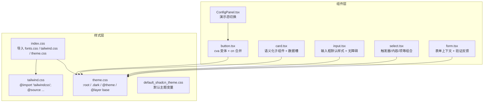
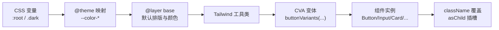
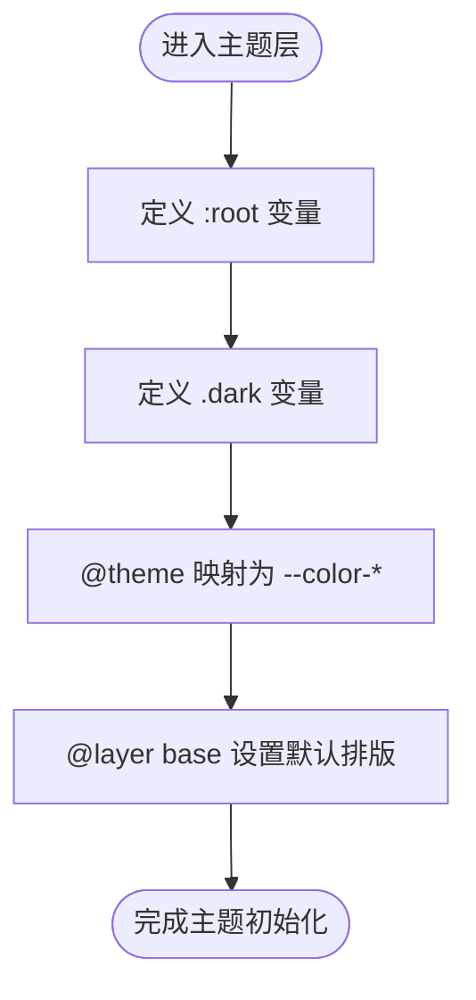
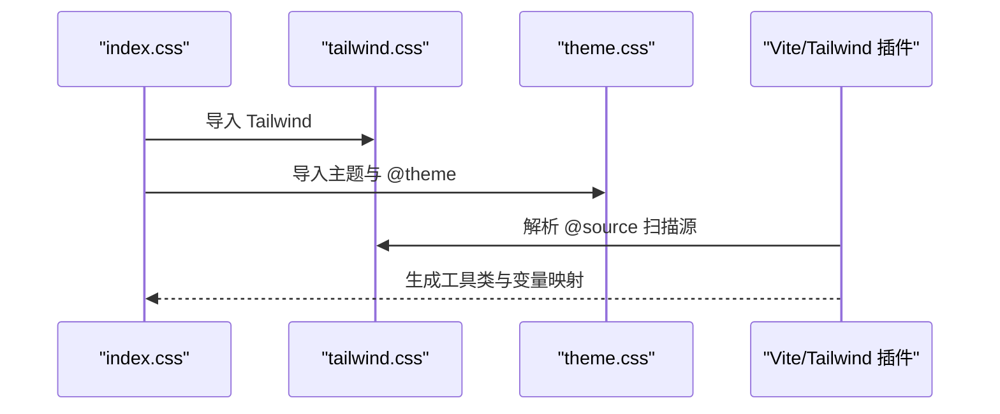
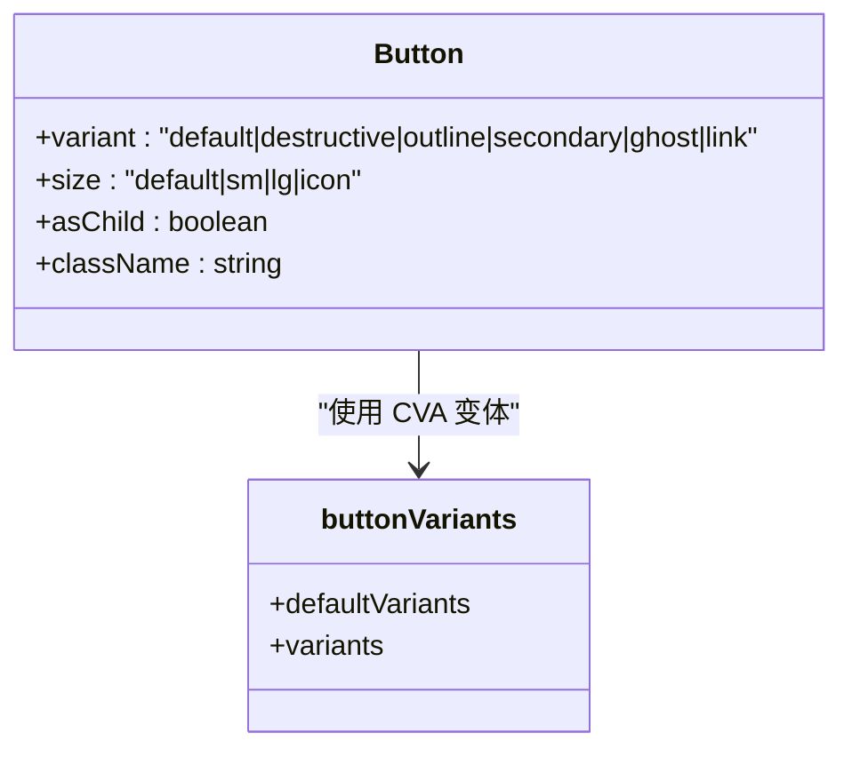
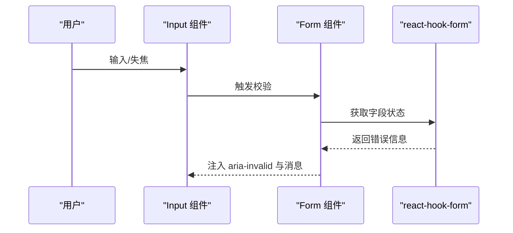
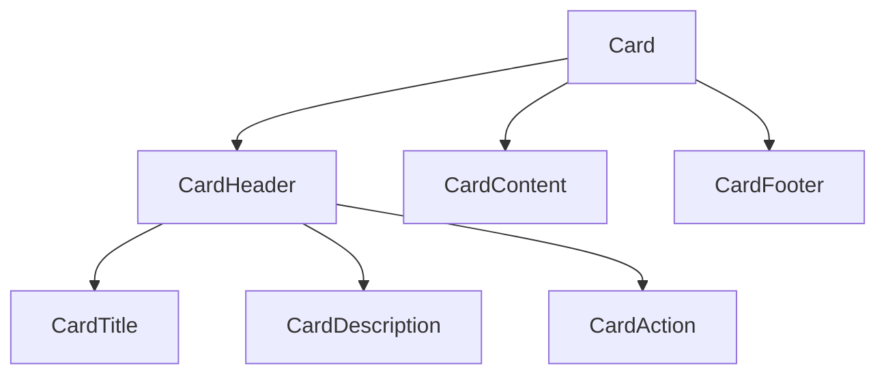
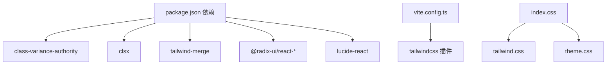

# 组件定制化

<cite>
**本文引用的文件**
- [theme.css](file://src/styles/theme.css)
- [tailwind.css](file://src/styles/tailwind.css)
- [index.css](file://src/styles/index.css)
- [default_shadcn_theme.css](file://default_shadcn_theme.css)
- [button.tsx](file://src/app/components/ui/button.tsx)
- [utils.ts](file://src/app/components/ui/utils.ts)
- [card.tsx](file://src/app/components/ui/card.tsx)
- [input.tsx](file://src/app/components/ui/input.tsx)
- [select.tsx](file://src/app/components/ui/select.tsx)
- [form.tsx](file://src/app/components/ui/form.tsx)
- [ConfigPanel.tsx](file://src/app/components/ConfigPanel.tsx)
- [package.json](file://package.json)
- [vite.config.ts](file://vite.config.ts)
- [theme.css（权限申请）](file://permission_apply/src/styles/theme.css)
- [tailwind.css（权限申请）](file://permission_apply/src/styles/tailwind.css)
</cite>

## 目录
1. [简介](#简介)
2. [项目结构](#项目结构)
3. [核心组件](#核心组件)
4. [架构总览](#架构总览)
5. [详细组件分析](#详细组件分析)
6. [依赖关系分析](#依赖关系分析)
7. [性能考量](#性能考量)
8. [故障排查指南](#故障排查指南)
9. [结论](#结论)
10. [附录](#附录)

## 简介
本文件聚焦于本项目的组件定制化体系，围绕主题系统、样式定制、变体配置与组件扩展方法展开，系统性说明 Tailwind CSS 类名系统、CVA 变体定义、CSS 变量与暗色模式、响应式设计实现，并提供主题定制指南、样式覆盖方法、组件扩展模式与品牌化方案，同时给出定制化最佳实践、性能优化建议与兼容性保障策略。

## 项目结构
本项目采用“样式层 + 组件层”的分层组织方式：
- 样式层：通过 CSS 变量与 Tailwind v4 的 @theme 声明统一管理主题色板与基础排版；在 @layer base 中为 HTML 元素提供默认样式，确保 Tailwind 工具类可按需覆盖。
- 组件层：基于 Radix UI 与 class-variance-authority（CVA）实现高内聚、低耦合的可变体组件，使用 cn 合并工具类，支持 asChild 插槽模式与无障碍属性。

图示来源
- [index.css:1-4](file://src/styles/index.css#L1-L4)
- [tailwind.css:1-5](file://src/styles/tailwind.css#L1-L5)
- [theme.css:1-182](file://src/styles/theme.css#L1-L182)
- [button.tsx:1-59](file://src/app/components/ui/button.tsx#L1-L59)
- [card.tsx:1-93](file://src/app/components/ui/card.tsx#L1-L93)
- [input.tsx:1-22](file://src/app/components/ui/input.tsx#L1-L22)
- [select.tsx:1-190](file://src/app/components/ui/select.tsx#L1-L190)
- [form.tsx:1-169](file://src/app/components/ui/form.tsx#L1-L169)
- [ConfigPanel.tsx:1-134](file://src/app/components/ConfigPanel.tsx#L1-L134)

章节来源
- [index.css:1-4](file://src/styles/index.css#L1-L4)
- [tailwind.css:1-5](file://src/styles/tailwind.css#L1-L5)
- [theme.css:1-182](file://src/styles/theme.css#L1-L182)
- [default_shadcn_theme.css:1-121](file://default_shadcn_theme.css#L1-L121)

## 核心组件
- 主题系统与 CSS 变量
  - 使用 CSS 自定义属性（如 --background、--primary、--radius 等）在 :root 与 .dark 中声明两套主题变量，并通过 @theme 将其映射为 --color-* 以供 Tailwind 使用。
  - 在 @layer base 中为 *、body、h1-h4、label、button、input 等元素设置默认字体大小、字重与行高，确保工具类优先级合理。
- CVA 变体与类名合并
  - 组件通过 CVA 定义 variant 与 size 两类变体，结合 cn 合并工具类，实现“默认样式 + 变体样式 + 外部传入 className”的叠加与冲突消除。
- 组件组合与数据槽
  - 卡片组件提供 Card/CardHeader/CardTitle/CardDescription/CardAction/CardContent/CardFooter 等子组件，配合 data-slot 属性便于调试与样式定位。
- 表单与无障碍
  - 表单组件提供 Form、FormField、FormControl、FormLabel、FormMessage 等上下文与钩子，自动注入 aria-* 属性与错误态样式。

章节来源
- [theme.css:3-120](file://src/styles/theme.css#L3-L120)
- [button.tsx:7-35](file://src/app/components/ui/button.tsx#L7-L35)
- [utils.ts:4-6](file://src/app/components/ui/utils.ts#L4-L6)
- [card.tsx:5-82](file://src/app/components/ui/card.tsx#L5-L82)
- [form.tsx:19-168](file://src/app/components/ui/form.tsx#L19-L168)

## 架构总览
下图展示从样式到组件的定制化路径：CSS 变量 → Tailwind @theme → 组件类名 → CVA 变体 → 用户覆盖。

图示来源
- [theme.css:81-120](file://src/styles/theme.css#L81-L120)
- [tailwind.css:1-5](file://src/styles/tailwind.css#L1-L5)
- [button.tsx:7-35](file://src/app/components/ui/button.tsx#L7-L35)
- [utils.ts:4-6](file://src/app/components/ui/utils.ts#L4-L6)
- [card.tsx:5-16](file://src/app/components/ui/card.tsx#L5-L16)

## 详细组件分析

### 主题系统与 CSS 变量
- 变量层次
  - 基础变量：背景、前景、卡片、弹出层、主色/次色、强调色、破坏色、边框、输入、环形光晕、图表色板、圆角半径、侧边栏系列等。
  - 暗色模式：.dark 选择器下对上述变量进行重映射，实现深色适配。
  - @theme：将 CSS 变量映射为 --color-*，使 Tailwind 可直接消费。
  - @layer base：为全局元素设置默认字体、字号、字重、行高与边框颜色，确保工具类优先级合理。
- 响应式与排版
  - 通过 CSS 变量控制 html 字号与各级标题、标签、按钮、输入的基础样式，便于在不同设备上保持一致的视觉节奏。

图示来源
- [theme.css:3-120](file://src/styles/theme.css#L3-L120)
- [theme.css:122-182](file://src/styles/theme.css#L122-L182)

章节来源
- [theme.css:1-182](file://src/styles/theme.css#L1-L182)
- [default_shadcn_theme.css:1-121](file://default_shadcn_theme.css#L1-L121)

### Tailwind v4 与类名系统
- 配置要点
  - 使用 @import 'tailwindcss' 与 @source 指定扫描源，确保工具类按需生成。
  - 通过 index.css 串联 fonts.css、tailwind.css、theme.css，形成样式加载顺序。
- 类名优先级
  - @layer base 中的默认样式由 CSS 变量驱动；Tailwind 工具类在构建后具备更高优先级，可覆盖默认样式。
- 动画与过渡
  - 引入 tw-animate-css，为组件提供轻量动画能力。

图示来源
- [index.css:1-4](file://src/styles/index.css#L1-L4)
- [tailwind.css:1-5](file://src/styles/tailwind.css#L1-L5)
- [theme.css:81-120](file://src/styles/theme.css#L81-L120)

章节来源
- [index.css:1-4](file://src/styles/index.css#L1-L4)
- [tailwind.css:1-5](file://src/styles/tailwind.css#L1-L5)
- [vite.config.ts:19-37](file://vite.config.ts#L19-L37)

### CVA 变体定义与 Button 组件
- 变体维度
  - variant：default、destructive、outline、secondary、ghost、link。
  - size：default、sm、lg、icon。
- 默认样式与覆盖
  - 默认类名包含过渡、禁用态、焦点环、无效态等通用行为；通过 CVA 将变体类名与外部 className 合并，实现可控覆盖。
- 渲染模式
  - 支持 asChild 使用 Slot 包裹任意元素，便于语义化与无障碍。

图示来源
- [button.tsx:7-35](file://src/app/components/ui/button.tsx#L7-L35)
- [button.tsx:37-56](file://src/app/components/ui/button.tsx#L37-L56)

章节来源
- [button.tsx:1-59](file://src/app/components/ui/button.tsx#L1-L59)
- [utils.ts:1-7](file://src/app/components/ui/utils.ts#L1-L7)

### 输入与表单组件
- Input
  - 默认继承卡片/弹出层/输入色板，聚焦时显示 ring 效果，支持 aria-invalid 错误态。
- Select
  - 触发器根据 size 切换高度；内容区使用 Portal 渲染，支持滚动按钮与 popper 位置偏移；项列表支持选中指示器与图标对齐。
- Form
  - 提供 Form、FormField、FormControl、FormLabel、FormMessage 上下文，自动注入 aria-* 属性与错误态样式，简化表单验证反馈。

图示来源
- [input.tsx:5-19](file://src/app/components/ui/input.tsx#L5-L19)
- [form.tsx:90-157](file://src/app/components/ui/form.tsx#L90-L157)

章节来源
- [input.tsx:1-22](file://src/app/components/ui/input.tsx#L1-L22)
- [select.tsx:31-90](file://src/app/components/ui/select.tsx#L31-L90)
- [form.tsx:1-169](file://src/app/components/ui/form.tsx#L1-L169)

### 卡片组件与数据槽
- 子组件职责清晰：头部、标题、描述、操作、内容、底部。
- 使用 data-slot 标记便于调试与样式定位；网格布局与间距通过工具类与条件类组合实现。

图示来源
- [card.tsx:5-82](file://src/app/components/ui/card.tsx#L5-L82)

章节来源
- [card.tsx:1-93](file://src/app/components/ui/card.tsx#L1-L93)

### 主题定制指南
- 修改主题变量
  - 在 :root 与 .dark 下调整 --background、--primary、--secondary、--muted、--destructive、--border、--radius 等变量，即可实现品牌色与对比度调整。
- 使用 @theme 与 @layer base
  - 通过 @theme 将变量映射为 --color-*，再由 Tailwind 工具类消费；在 @layer base 中为 h1-h4、label、button、input 设置默认排版，避免工具类被覆盖。
- 暗色模式
  - 在 .dark 选择器下重映射关键变量，确保文本、边框、输入区在深色模式下的可读性与一致性。
- 默认样式与工具类优先级
  - @layer base 的默认样式由 CSS 变量驱动；工具类在构建后具备更高优先级，可按需覆盖默认排版。

章节来源
- [theme.css:3-120](file://src/styles/theme.css#L3-L120)
- [theme.css:122-182](file://src/styles/theme.css#L122-L182)
- [default_shadcn_theme.css:1-121](file://default_shadcn_theme.css#L1-L121)

### 样式覆盖方法
- 组件级覆盖
  - 通过传入 className 覆盖默认样式；CVA 会与外部类名合并，优先级遵循 Tailwind 生成顺序。
- asChild 插槽
  - 使用 asChild 将 Button 等组件渲染为任意元素（如 a、th），并保留原生语义与事件。
- 数据槽与条件类
  - 子组件使用 data-slot 与条件类（如 has-[>svg]、data-[state=...]）实现细粒度控制。

章节来源
- [button.tsx:37-56](file://src/app/components/ui/button.tsx#L37-L56)
- [card.tsx:18-29](file://src/app/components/ui/card.tsx#L18-L29)

### 组件扩展模式
- 新增变体
  - 在 CVA 的 variants 中新增 variant 或 size 维度，结合 CSS 变量与工具类实现新样式。
- 组合子组件
  - 如 Card 提供多个子组件，扩展时保持 data-slot 与布局约定，确保样式与交互一致。
- 表单集成
  - 通过 Form、FormField、FormControl 等上下文，快速接入验证与无障碍属性。

章节来源
- [button.tsx:10-29](file://src/app/components/ui/button.tsx#L10-L29)
- [card.tsx:5-82](file://src/app/components/ui/card.tsx#L5-L82)
- [form.tsx:19-88](file://src/app/components/ui/form.tsx#L19-L88)

### 品牌化方案
- 色板与对比度
  - 通过调整 --primary、--primary-foreground、--muted、--destructive 等变量，匹配品牌主色与安全色。
- 圆角与层级
  - 通过 --radius 及 --radius-* 映射，统一控件圆角风格；在卡片与对话框等容器上保持一致的阴影与边框。
- 排版与可读性
  - 在 @layer base 中统一 h1-h4、label、button、input 的字号与字重，确保在不同字号基准下仍具可读性。

章节来源
- [theme.css:3-42](file://src/styles/theme.css#L3-L42)
- [theme.css:122-182](file://src/styles/theme.css#L122-L182)

## 依赖关系分析
- 样式依赖
  - index.css 串联 tailwind.css 与 theme.css，确保变量与工具类生效。
  - vite.config.ts 中启用 @tailwindcss/vite 插件，解析 @source 并扫描源码生成类名。
- 组件依赖
  - button.tsx、input.tsx、select.tsx、card.tsx、form.tsx 均依赖 utils.ts 的 cn 合并工具类。
  - 组件依赖 Radix UI 与 lucide-react 实现交互与图标。
- 第三方库
  - class-variance-authority、clsx、tailwind-merge、@radix-ui/react-*、lucide-react 等。

图示来源
- [package.json:11-66](file://package.json#L11-L66)
- [vite.config.ts:19-37](file://vite.config.ts#L19-L37)
- [index.css:1-4](file://src/styles/index.css#L1-L4)
- [utils.ts:1-7](file://src/app/components/ui/utils.ts#L1-L7)

章节来源
- [package.json:1-91](file://package.json#L1-L91)
- [vite.config.ts:1-37](file://vite.config.ts#L1-L37)

## 性能考量
- 按需生成与最小化
  - 通过 @source 指定扫描范围，减少未使用类名的生成；仅在需要时引入动画插件。
- 类名合并
  - 使用 twMerge 与 clsx 合并类名，避免重复与冲突，降低运行时样式抖动。
- 变量驱动
  - 通过 CSS 变量与 @theme 减少重复样式定义，提升维护效率与打包体积控制。

章节来源
- [tailwind.css:1-5](file://src/styles/tailwind.css#L1-L5)
- [utils.ts:4-6](file://src/app/components/ui/utils.ts#L4-L6)

## 故障排查指南
- 样式未生效
  - 检查 index.css 是否正确导入 tailwind.css 与 theme.css；确认 vite.config.ts 中已启用 tailwindcss 插件且 @source 路径正确。
- 变体样式冲突
  - 确认外部 className 未覆盖关键工具类；必要时使用更精确的选择器或在组件外层包裹容器类名。
- 暗色模式不生效
  - 检查 .dark 选择器是否正确应用；确认根元素或父级容器包含 dark 类。
- 表单错误态异常
  - 确保 FormControl 正确包裹受控组件，并注入 aria-* 属性；检查 FormMessage 是否正确渲染错误信息。

章节来源
- [index.css:1-4](file://src/styles/index.css#L1-L4)
- [vite.config.ts:19-37](file://vite.config.ts#L19-L37)
- [form.tsx:107-157](file://src/app/components/ui/form.tsx#L107-L157)

## 结论
本项目通过 CSS 变量与 Tailwind @theme 实现集中主题管理，借助 CVA 与 cn 合并工具类实现组件变体与样式覆盖，辅以 Radix UI 与表单上下文完善交互与无障碍体验。整体架构具备良好的扩展性与品牌化能力，适合在多页面、多主题场景下稳定演进。

## 附录
- 示例：在 ConfigPanel 中通过按钮变体切换演示态，体现组件变体与主题变量的协同工作。

章节来源
- [ConfigPanel.tsx:1-134](file://src/app/components/ConfigPanel.tsx#L1-L134)