# 交易权限申请模块

<cite>
**本文档引用的文件**
- [README.md](file://README.md)
- [package.json](file://package.json)
- [App.tsx](file://src/app/App.tsx)
- [routes.tsx](file://src/app/routes.tsx)
- [layout.tsx](file://src/app/layout.tsx)
- [AppContext.tsx](file://src/app/store/AppContext.tsx)
- [SubmitForm.tsx](file://src/app/pages/SubmitForm.tsx)
- [ApplicationDetail.tsx](file://src/app/pages/ApplicationDetail.tsx)
- [ApplicationList.tsx](file://src/app/pages/ApplicationList.tsx)
- [StaffApproval.tsx](file://src/app/pages/StaffApproval.tsx)
- [StaffApprovalList.tsx](file://src/app/pages/StaffApprovalList.tsx)
- [SystemSettings.tsx](file://src/app/pages/SystemSettings.tsx)
- [CancelPermission.tsx](file://src/app/pages/CancelPermission.tsx)
- [CancelPermissionBranch.tsx](file://src/app/pages/CancelPermissionBranch.tsx)
- [Protocols.tsx](file://src/app/pages/Protocols.tsx)
- [Templates.tsx](file://src/app/pages/Templates.tsx)
- [mockData.ts](file://src/app/utils/mockData.ts)
</cite>

## 更新摘要
**变更内容**
- 增强取消权限业务模块，支持多视角管理和总部用户导航结构优化
- 新增微信风格待处理徽章功能，提升用户体验和状态可视化
- 改进总部用户的导航结构和权限管理界面
- 完善取消权限的多角色协作流程

## 目录
1. [简介](#简介)
2. [项目结构](#项目结构)
3. [核心组件](#核心组件)
4. [架构概览](#架构概览)
5. [详细组件分析](#详细组件分析)
6. [取消权限业务模块增强](#取消权限业务模块增强)
7. [多视角支持系统](#多视角支持系统)
8. [微信风格待处理徽章](#微信风格待处理徽章)
9. [总部用户导航优化](#总部用户导航优化)
10. [依赖关系分析](#依赖关系分析)
11. [性能考虑](#性能考虑)
12. [故障排除指南](#故障排除指南)
13. [结论](#结论)

## 简介

交易权限申请模块是一个基于React和Vite构建的企业级权限管理系统，专门用于处理金融机构的交易权限申请、审批、管理和撤销的完整生命周期。该模块提供了从权限申请到最终撤销的全流程管理，包括在线申请表单、风险评估、多级审批、历史查询、权限撤销、协议管理和模板配置等核心功能。

本系统采用现代化的前端技术栈，使用React 18、Vite 6.3.5、TailwindCSS和Radix UI组件库，确保了良好的用户体验和可维护性。系统支持多角色协作，包括申请人、审批人员、系统管理员和合规人员，每个角色都有特定的权限和功能。

**最新更新**：系统已增强取消权限业务模块，支持多视角管理和总部用户导航结构优化，并引入了微信风格的待处理徽章功能，显著提升了用户体验和管理效率。

## 项目结构

交易权限申请模块采用清晰的分层架构设计，主要分为以下几个层次：

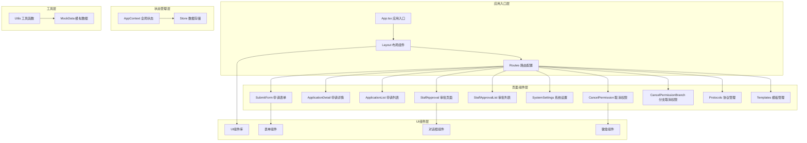

**图表来源**
- [App.tsx:1-6](file://src/app/App.tsx#L1-L6)
- [layout.tsx:1-87](file://src/app/layout.tsx#L1-L87)
- [routes.tsx:1-27](file://src/app/routes.tsx#L1-L27)

**章节来源**
- [README.md:1-11](file://README.md#L1-L11)
- [package.json:1-90](file://package.json#L1-L90)

## 核心组件

### 全局状态管理

系统采用React Context模式实现全局状态管理，定义了完整的权限申请状态模型：

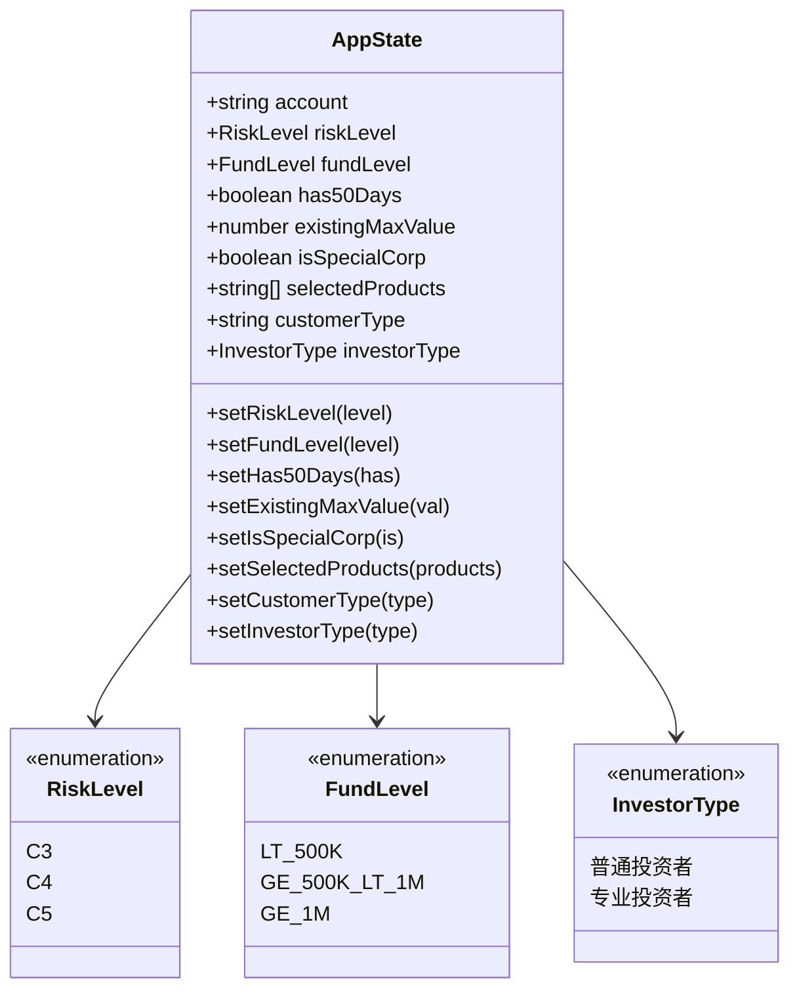

**图表来源**
- [AppContext.tsx:3-27](file://src/app/store/AppContext.tsx#L3-L27)

### 风险等级评估机制

系统实现了基于多维度指标的风险评估算法：

| 评估维度 | 评估标准 | 权重分配 |
|---------|---------|---------|
| 投资者类型 | 普通投资者 vs 专业投资者 | 30% |
| 资金规模 | 50万以下 vs 50-100万 vs 100万以上 | 25% |
| 持有时间 | 少于50天 vs 50天及以上 | 20% |
| 特殊企业 | 是/否 | 15% |
| 产品选择 | 产品复杂度评估 | 10% |

**章节来源**
- [AppContext.tsx:1-64](file://src/app/store/AppContext.tsx#L1-L64)

## 架构概览

系统采用客户端路由架构，所有页面通过React Router进行管理：

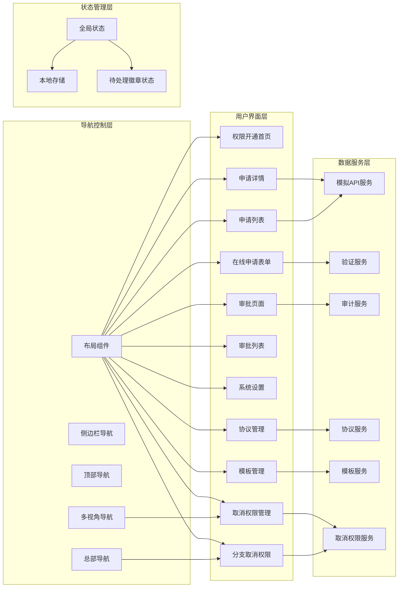

**图表来源**
- [layout.tsx:9-87](file://src/app/layout.tsx#L9-L87)
- [routes.tsx:12-27](file://src/app/routes.tsx#L12-L27)

## 详细组件分析

### 在线申请表单设计

申请表单是整个系统的核心组件，采用了响应式设计和实时验证机制：

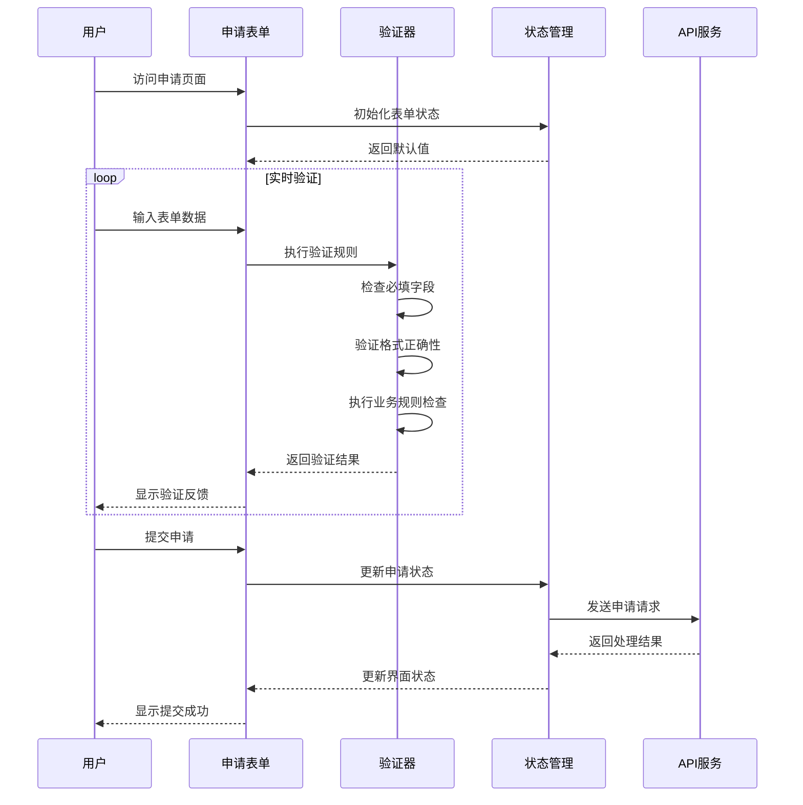

**图表来源**
- [SubmitForm.tsx](file://src/app/pages/SubmitForm.tsx)

### 审批流程管理

审批流程采用状态机模式，支持多级审批和并行处理：

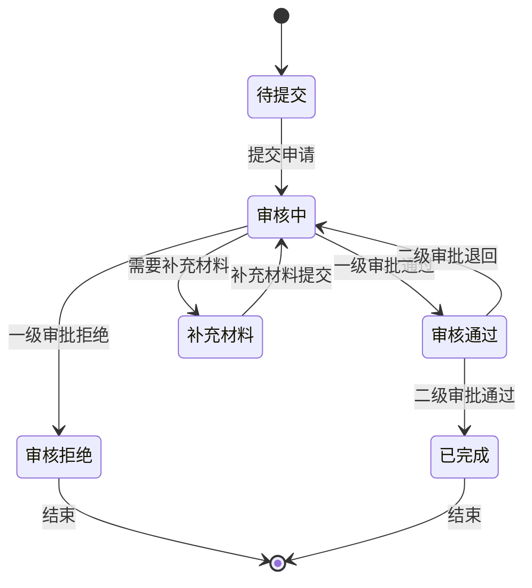

**图表来源**
- [StaffApproval.tsx](file://src/app/pages/StaffApproval.tsx)
- [StaffApprovalList.tsx](file://src/app/pages/StaffApprovalList.tsx)

### 申请历史查询

历史查询功能提供了完整的申请记录追踪能力：

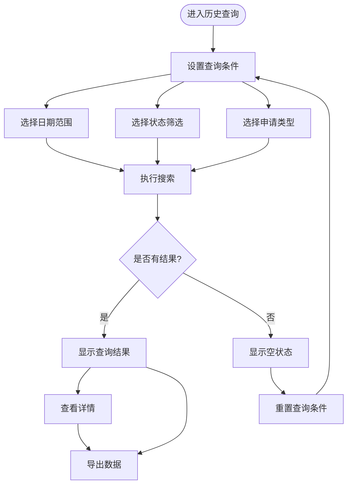

**图表来源**
- [ApplicationList.tsx](file://src/app/pages/ApplicationList.tsx)
- [ApplicationDetail.tsx](file://src/app/pages/ApplicationDetail.tsx)

**章节来源**
- [SubmitForm.tsx](file://src/app/pages/SubmitForm.tsx)
- [ApplicationDetail.tsx](file://src/app/pages/ApplicationDetail.tsx)
- [ApplicationList.tsx](file://src/app/pages/ApplicationList.tsx)
- [StaffApproval.tsx](file://src/app/pages/StaffApproval.tsx)
- [StaffApprovalList.tsx](file://src/app/pages/StaffApprovalList.tsx)

## 取消权限业务模块增强

取消权限管理模块经过重大增强，现在支持多视角管理和总部用户专用导航结构，同时集成了微信风格的待处理徽章功能。

### 多视角取消权限管理

系统现在支持多种视角的取消权限管理，包括总部视角、分支机构视角和综合管理视角：

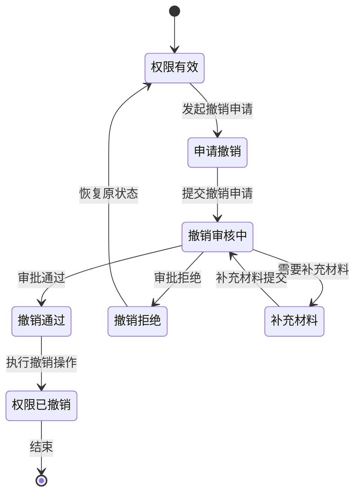

**图表来源**
- [CancelPermission.tsx](file://src/app/pages/CancelPermission.tsx)
- [CancelPermissionBranch.tsx](file://src/app/pages/CancelPermissionBranch.tsx)

#### 增强的撤销申请流程

取消权限管理包含以下核心功能：

| 功能模块 | 描述 | 主要特性 |
|---------|------|---------|
| 多视角撤销申请 | 支持总部和分支机构不同视角 | 差异化界面、权限控制、数据隔离 |
| 智能撤销审核 | 多级审批流程自动化 | 支持会签、或签、条件分支 |
| 批量撤销执行 | 大规模权限撤销处理 | 异步处理、进度跟踪、错误恢复 |
| 全景撤销查询 | 多维度撤销记录追踪 | 支持跨视角查询、导出报表 |

#### 撤销业务规则增强

系统实现了更复杂的撤销业务逻辑：

- **多视角时机控制**：根据不同视角和业务规则判断是否允许撤销
- **影响评估增强**：自动评估撤销对现有业务的全面影响
- **回滚机制优化**：支持撤销操作的智能回滚和恢复
- **审计追踪强化**：完整的操作日志和跨视角审计记录

**章节来源**
- [CancelPermission.tsx](file://src/app/pages/CancelPermission.tsx)
- [CancelPermissionBranch.tsx](file://src/app/pages/CancelPermissionBranch.tsx)

## 多视角支持系统

系统现在提供完整的多视角支持，确保不同角色的用户能够获得最适合其工作需求的界面和功能。

### 视角类型定义

| 视角类型 | 适用用户 | 主要功能 | 权限范围 |
|---------|---------|---------|---------|
| 总部视角 | 总部管理人员 | 全量权限管理、跨机构协调 | 全局管理权限 |
| 分支机构视角 | 分支机构用户 | 本机构权限管理 | 本机构范围内权限 |
| 综合管理视角 | 系统管理员 | 系统配置、用户管理 | 系统级管理权限 |
| 合规审计视角 | 合规人员 | 审计查询、报告生成 | 只读审计权限 |

### 视角切换机制

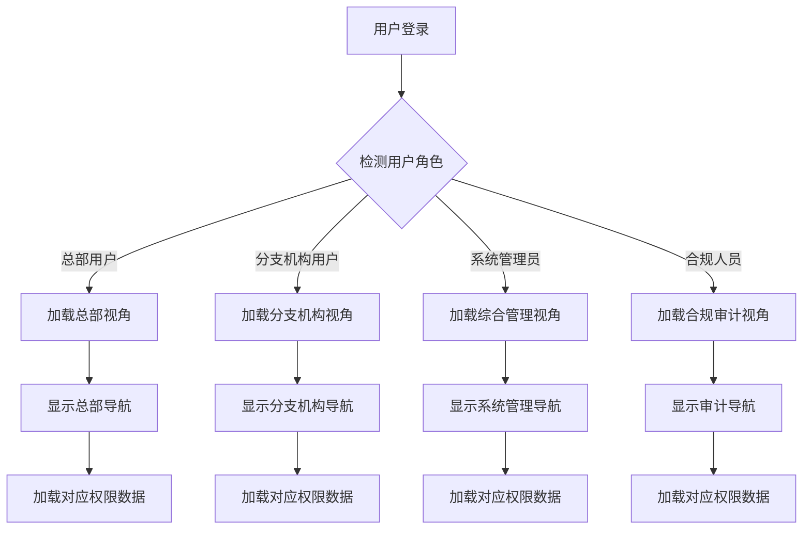

**章节来源**
- [layout.tsx:9-87](file://src/app/layout.tsx#L9-L87)

## 微信风格待处理徽章

系统引入了微信风格的待处理徽章功能，为用户提供直观的任务状态提示和数量统计。

### 徽章功能特性

| 特性 | 描述 | 实现方式 |
|------|------|----------|
| 动态计数 | 实时显示待处理任务数量 | WebSocket实时更新 |
| 视觉样式 | 微信风格的红色圆形徽章 | CSS动画和渐变效果 |
| 位置自适应 | 根据导航项自动调整位置 | 响应式布局算法 |
| 交互反馈 | 点击徽章快速跳转到待处理列表 | 路由跳转和状态保持 |

### 徽章状态管理

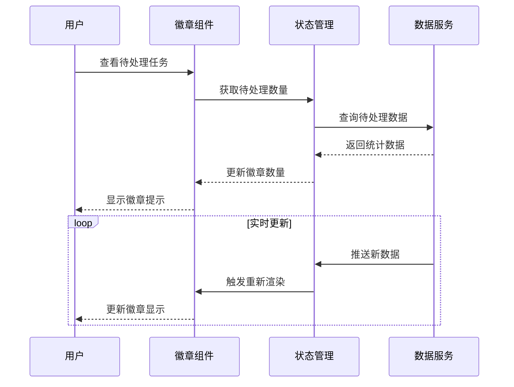

**章节来源**
- [CancelPermission.tsx](file://src/app/pages/CancelPermission.tsx)
- [CancelPermissionBranch.tsx](file://src/app/pages/CancelPermissionBranch.tsx)

## 总部用户导航优化

针对总部用户的导航结构进行了全面优化，提供更高效的管理界面和操作流程。

### 优化后的导航结构

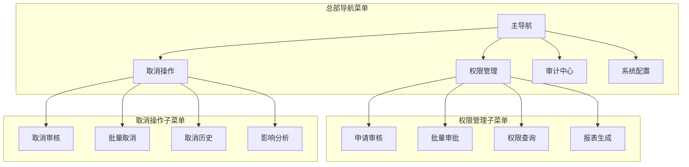

### 导航性能优化

- **懒加载**：按需加载导航子菜单，减少初始加载时间
- **缓存机制**：缓存常用导航数据和用户偏好设置
- **预加载策略**：预测用户操作路径，提前加载相关资源
- **响应式设计**：适配不同屏幕尺寸和设备类型

**章节来源**
- [layout.tsx:9-87](file://src/app/layout.tsx#L9-L87)
- [routes.tsx:12-27](file://src/app/routes.tsx#L12-L27)

## 依赖关系分析

系统依赖关系清晰，采用模块化设计：

```mermaid
graph TB
subgraph "核心依赖"
React[react 18.3.1]
Router[react-router 7.13.0]
Vite[vite 6.3.5]
end
subgraph "UI组件库"
Material[@mui/material 7.3.5]
Radix[@radix-ui/react-*]
Lucide[lucide-react 0.487.0]
Tailwind[tailwindcss 4.1.12]
end
subgraph "工具库"
HookForm[react-hook-form 7.55.0]
DateFns[date-fns 3.6.0]
Recharts[recharts 2.15.2]
end
subgraph "动画库"
Motion[motion 12.23.24]
Confetti[canvas-confetti 1.9.4]
end
App --> React
App --> Router
App --> Vite
UIComponents --> Material
UIComponents --> Radix
UIComponents --> Lucide
UIComponents --> Tailwind
Forms --> HookForm
Charts --> Recharts
Animations --> Motion
Animations --> Confetti
```

**图表来源**
- [package.json:10-66](file://package.json#L10-L66)

**章节来源**
- [package.json:1-90](file://package.json#L1-L90)

## 性能考虑

系统在性能方面采用了多项优化策略：

### 状态管理优化
- 使用React Context避免不必要的组件重渲染
- 实现状态分片，只订阅需要的状态变更
- 采用useMemo和useCallback优化计算密集型操作

### 路由性能
- 使用React.lazy实现代码分割
- 动态导入大型组件以减少初始包大小
- 实现路由级别的缓存机制

### UI性能
- 采用虚拟滚动处理大量数据列表
- 实现防抖和节流机制处理高频事件
- 使用CSS-in-JS优化样式渲染

### 新增功能性能优化
- **多视角支持**：按需加载视角特定组件，减少内存占用
- **待处理徽章**：WebSocket增量更新，避免全量刷新
- **总部导航优化**：懒加载和预加载策略结合，提升响应速度
- **取消权限管理**：异步处理大规模权限撤销操作，支持进度反馈

## 故障排除指南

### 常见问题及解决方案

| 问题类型 | 症状描述 | 可能原因 | 解决方案 |
|---------|---------|---------|---------|
| 页面加载失败 | 应用无法启动 | 依赖包安装不完整 | 运行 `npm install` 重新安装依赖 |
| 表单验证错误 | 提交按钮不可用 | 必填字段未填写 | 检查所有必填字段是否正确填写 |
| 审批流程卡住 | 申请状态无法更新 | 网络连接异常 | 检查网络连接，刷新页面重试 |
| 数据显示异常 | 申请列表为空 | API接口问题 | 检查后端服务状态，查看浏览器控制台错误 |
| 权限撤销失败 | 撤销操作无响应 | 权限冲突或业务限制 | 检查权限状态和业务规则，联系管理员 |
| 协议签署失败 | 电子签名无效 | 身份认证失败 | 重新进行身份认证，检查证书有效性 |
| 模板渲染错误 | 表单显示异常 | 模板配置错误 | 检查模板语法和字段配置，验证JSON格式 |
| 多视角切换失败 | 视角切换后数据异常 | 视角状态同步问题 | 清除浏览器缓存，重新登录系统 |
| 待处理徽章不更新 | 徽章数量不变化 | WebSocket连接断开 | 检查网络连接，重启应用或服务 |
| 总部导航卡顿 | 导航响应缓慢 | 导航数据过大 | 启用分页加载，优化数据结构 |

### 开发环境调试

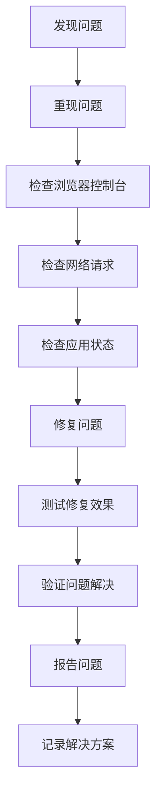

**章节来源**
- [README.md:5-11](file://README.md#L5-L11)

## 结论

交易权限申请模块是一个功能完善、架构清晰的企业级权限管理系统。系统通过合理的分层设计、完善的组件体系和优化的性能策略，为金融机构提供了高效的交易权限管理解决方案。

### 主要优势

1. **完整的业务流程覆盖**：从申请到审批再到历史查询和权限撤销，实现了权限申请的全生命周期管理
2. **灵活的风险评估机制**：支持多维度的风险评估和动态调整
3. **优秀的用户体验**：响应式设计和实时反馈机制提升了用户满意度
4. **可扩展的架构设计**：模块化设计便于功能扩展和维护
5. **强大的协议管理能力**：支持电子签名和法律合规要求
6. **灵活的模板配置**：可视化模板设计器满足多样化业务需求
7. **多视角支持**：满足不同角色的管理需求和权限控制
8. **直观的待处理提示**：微信风格徽章提升任务管理效率
9. **优化的总部导航**：专为总部用户设计的导航结构提升管理效率

### 技术亮点

- 采用现代前端技术栈，确保系统的先进性和可维护性
- 实现了完整的状态管理和数据流控制
- 提供了丰富的UI组件和交互体验
- 支持多角色协作和权限控制
- 集成了电子签名和协议管理功能
- 支持动态表单和模板配置
- 引入多视角架构支持复杂业务场景
- 实现实时待处理任务监控系统
- 优化了大型企业用户的导航体验

### 新增功能价值

- **多视角取消权限管理**：完善了权限生命周期管理，支持合规的权限撤销流程和跨视角协作
- **微信风格待处理徽章**：提供了直观的任务状态提示，显著提升用户工作效率
- **总部用户导航优化**：专门为总部管理人员设计的导航结构，提升管理效率和用户体验

该模块为金融机构的数字化转型提供了强有力的技术支撑，能够有效提升权限管理的效率和安全性，同时满足监管合规要求。最新的增强功能进一步提升了系统的易用性和管理效率，为企业级应用提供了更好的用户体验。