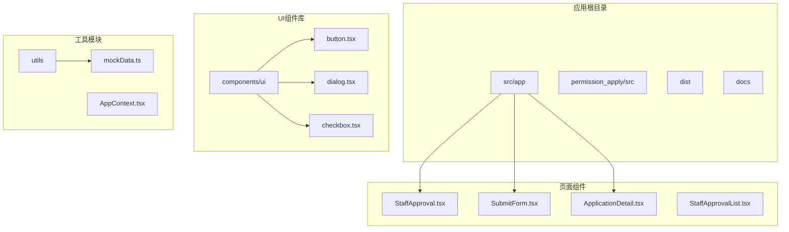
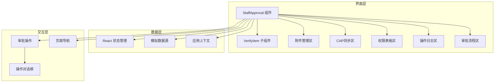
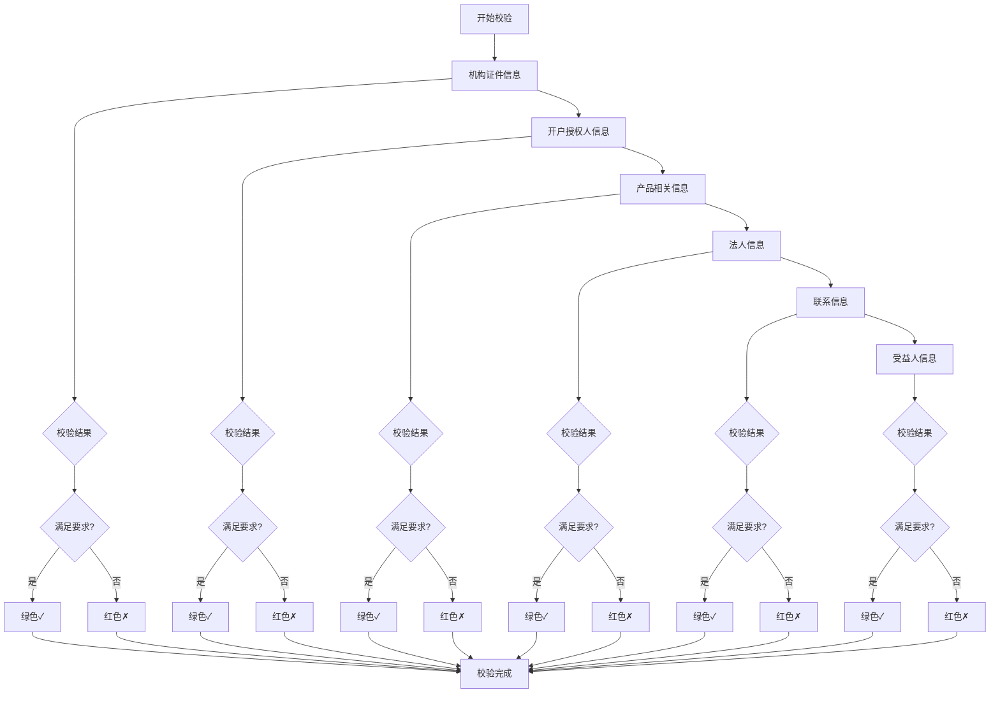
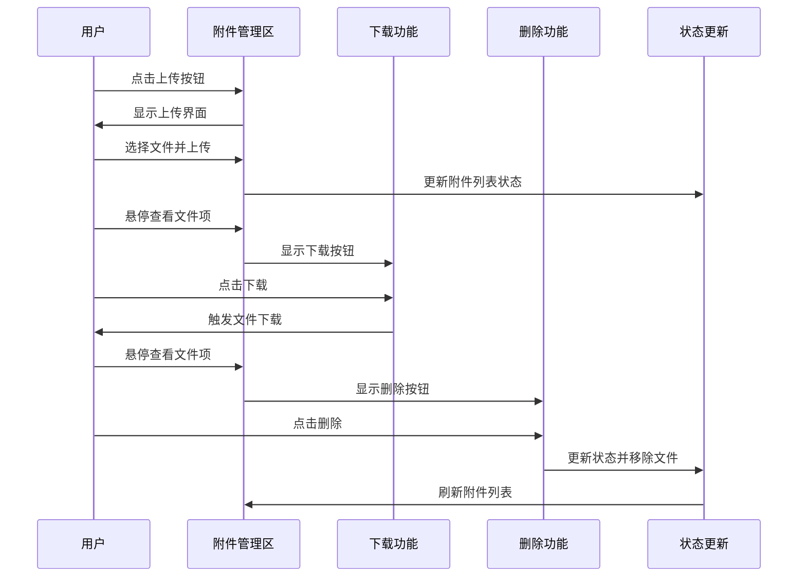
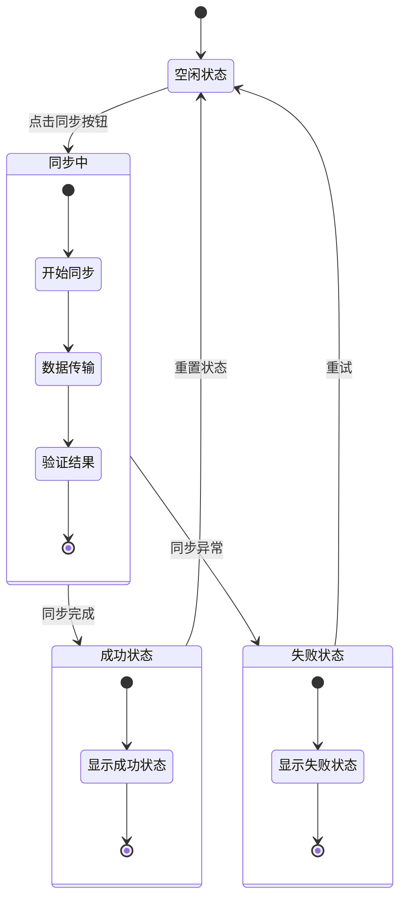
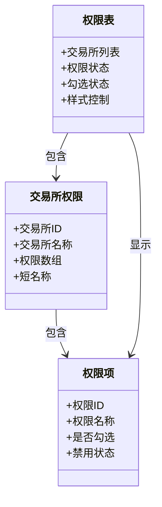
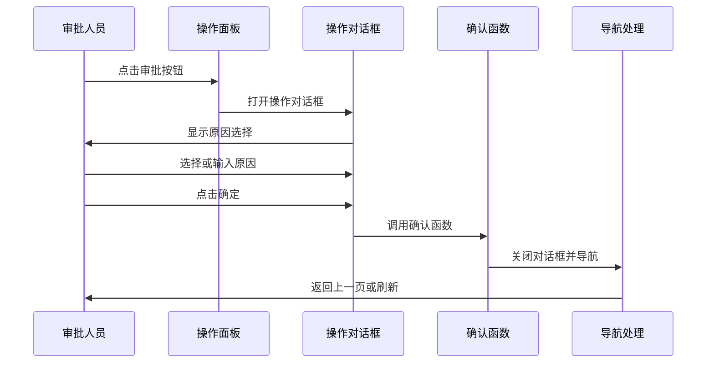
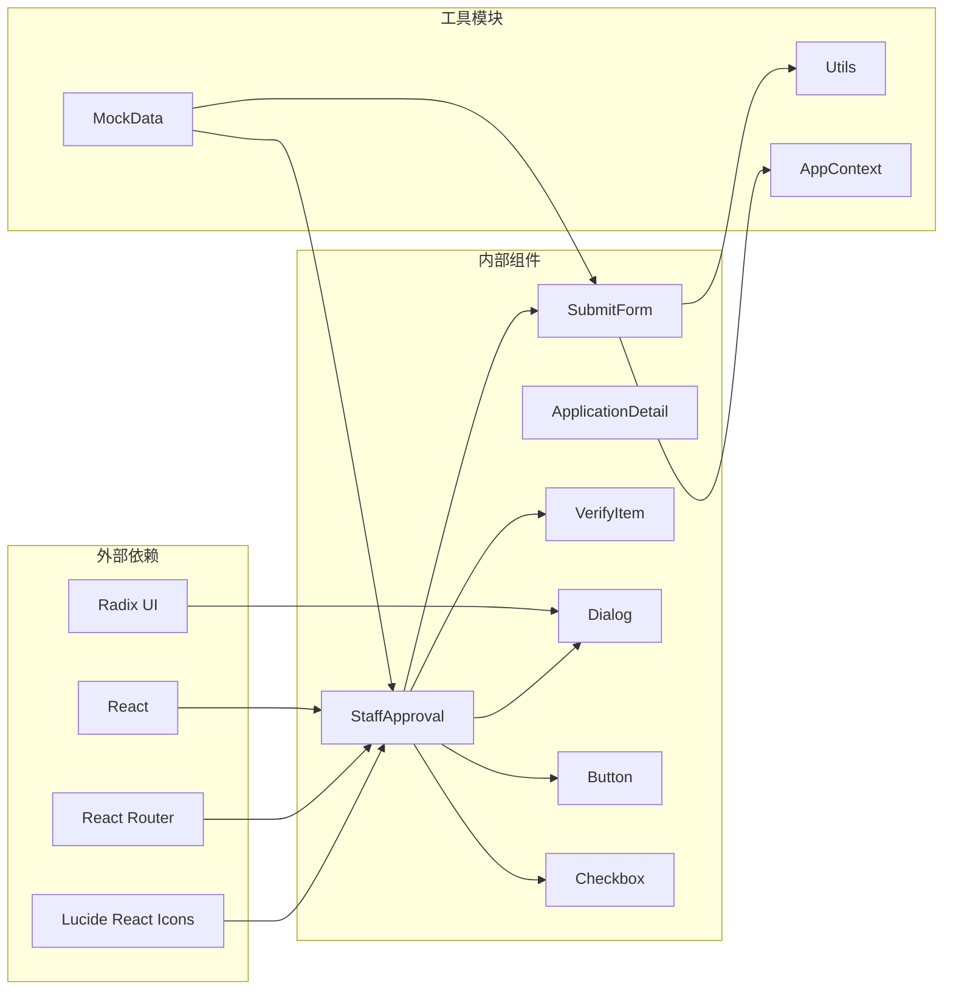

# 员工审批界面

<cite>
**本文档引用的文件**
- [StaffApproval.tsx](file://src/app/pages/StaffApproval.tsx)
- [SubmitForm.tsx](file://src/app/pages/SubmitForm.tsx)
- [ApplicationDetail.tsx](file://src/app/pages/ApplicationDetail.tsx)
- [mockData.ts](file://src/app/utils/mockData.ts)
- [button.tsx](file://src/app/components/ui/button.tsx)
- [dialog.tsx](file://src/app/components/ui/dialog.tsx)
- [checkbox.tsx](file://src/app/components/ui/checkbox.tsx)
</cite>

## 目录
1. [简介](#简介)
2. [项目结构](#项目结构)
3. [核心组件](#核心组件)
4. [架构概览](#架构概览)
5. [详细组件分析](#详细组件分析)
6. [依赖关系分析](#依赖关系分析)
7. [性能考虑](#性能考虑)
8. [故障排除指南](#故障排除指南)
9. [结论](#结论)

## 简介

员工审批界面是交易权限申请管理系统中的核心功能模块，专为内部审批人员设计。该界面提供了完整的客户信息审核、权限管理、附件处理和状态跟踪功能。系统采用现代化的React技术栈构建，结合了响应式设计和用户体验优化，确保审批流程的高效性和准确性。

## 项目结构

该项目采用模块化架构设计，主要包含以下核心目录结构：

**图表来源**
- [StaffApproval.tsx:1-708](file://src/app/pages/StaffApproval.tsx#L1-L708)
- [SubmitForm.tsx:1-747](file://src/app/pages/SubmitForm.tsx#L1-L747)

**章节来源**
- [StaffApproval.tsx:1-708](file://src/app/pages/StaffApproval.tsx#L1-L708)
- [SubmitForm.tsx:1-747](file://src/app/pages/SubmitForm.tsx#L1-L747)

## 核心组件

### 主要功能模块

员工审批界面包含以下核心功能模块：

1. **客户信息校验模块** - 实时验证客户基础信息完整性
2. **附件管理功能** - 支持文件上传、下载和删除操作
3. **CAP同步机制** - 与中央登记系统(CAP)的数据同步
4. **权限表格显示** - 展示全量交易所权限配置
5. **审批操作面板** - 提供驳回、失败、通过等审批操作

### 响应式设计特性

系统采用Tailwind CSS框架实现完全响应式设计：

- 移动端适配：在小屏幕设备上自动调整布局密度
- 平板优化：中等屏幕设备上的最佳显示效果
- 桌面端增强：大屏幕设备上的完整功能展示
- 触摸友好：针对触摸设备优化的交互元素尺寸

**章节来源**
- [StaffApproval.tsx:182-707](file://src/app/pages/StaffApproval.tsx#L182-L707)

## 架构概览

员工审批界面采用分层架构设计，确保各组件间的松耦合和高内聚：

**图表来源**
- [StaffApproval.tsx:78-90](file://src/app/pages/StaffApproval.tsx#L78-L90)
- [StaffApproval.tsx:105-140](file://src/app/pages/StaffApproval.tsx#L105-L140)

## 详细组件分析

### 客户信息校验模块

该模块负责实时验证客户信息的完整性和合规性：

**图表来源**
- [StaffApproval.tsx:167-180](file://src/app/pages/StaffApproval.tsx#L167-L180)

#### 校验规则实现

每个校验项都包含具体的验证逻辑和状态指示：

- **机构证件信息**：验证企业营业执照等核心证件的有效性
- **开户授权人信息**：检查授权委托书和授权人身份信息
- **产品相关信息**：确认申请的产品类型和风险等级匹配
- **法人信息**：验证法定代表人身份和授权文件
- **联系信息**：检查联系方式的准确性和有效性
- **受益人信息**：验证实际受益人的身份信息

**章节来源**
- [StaffApproval.tsx:221-228](file://src/app/pages/StaffApproval.tsx#L221-L228)

### 附件管理功能

附件管理系统提供了完整的文件生命周期管理：

**图表来源**
- [StaffApproval.tsx:348-391](file://src/app/pages/StaffApproval.tsx#L348-L391)

#### 文件管理特性

- **文件类型识别**：自动识别PDF和图片文件类型
- **批量操作**：支持多文件同时上传和管理
- **权限控制**：根据文件来源控制删除权限
- **状态追踪**：记录文件上传时间和上传者信息

**章节来源**
- [StaffApproval.tsx:95-103](file://src/app/pages/StaffApproval.tsx#L95-L103)

### CAP同步机制

CAP同步功能实现了与中央登记系统的实时数据同步：

**图表来源**
- [StaffApproval.tsx:142-147](file://src/app/pages/StaffApproval.tsx#L142-L147)

#### 同步流程实现

1. **触发同步**：用户点击"同步CAP"按钮
2. **状态切换**：界面显示加载动画和进度指示
3. **数据传输**：与CAP系统建立连接并传输数据
4. **结果验证**：验证同步结果的完整性和准确性
5. **状态更新**：根据结果更新界面显示状态

**章节来源**
- [StaffApproval.tsx:399-416](file://src/app/pages/StaffApproval.tsx#L399-L416)

### 权限表格显示

权限表格展示了全量交易所权限配置信息：

**图表来源**
- [StaffApproval.tsx:11-76](file://src/app/pages/StaffApproval.tsx#L11-L76)

#### 权限管理特性

- **多交易所支持**：涵盖所有主要期货交易所
- **权限状态可视化**：通过颜色和图标直观显示权限状态
- **批量权限管理**：支持整组权限的统一管理
- **状态持久化**：保持权限状态的一致性和可追溯性

**章节来源**
- [StaffApproval.tsx:471-510](file://src/app/pages/StaffApproval.tsx#L471-L510)

### 审批操作面板

审批操作面板提供了标准化的审批流程控制：

**图表来源**
- [StaffApproval.tsx:632-642](file://src/app/pages/StaffApproval.tsx#L632-L642)

#### 操作类型分类

1. **驳回操作**：将申请退回给申请人
2. **办理失败**：标记申请为失败状态
3. **审批通过**：批准申请并进入下一阶段

**章节来源**
- [StaffApproval.tsx:119-140](file://src/app/pages/StaffApproval.tsx#L119-L140)

## 依赖关系分析

### 组件间依赖关系

**图表来源**
- [StaffApproval.tsx:1-9](file://src/app/pages/StaffApproval.tsx#L1-L9)

### 数据流分析

系统采用单向数据流设计，确保数据的一致性和可预测性：

1. **状态初始化**：组件挂载时初始化各种状态变量
2. **用户交互**：用户操作触发状态更新
3. **状态传播**：状态变化驱动界面重新渲染
4. **副作用处理**：异步操作通过回调函数处理

**章节来源**
- [StaffApproval.tsx:93-155](file://src/app/pages/StaffApproval.tsx#L93-L155)

## 性能考虑

### 渲染优化策略

1. **虚拟滚动**：对于大量数据的表格使用虚拟滚动技术
2. **懒加载**：非关键资源采用懒加载方式
3. **状态缓存**：常用状态数据进行本地缓存
4. **防抖处理**：输入框和搜索功能采用防抖优化

### 内存管理

- **事件监听器清理**：组件卸载时清理所有事件监听器
- **定时器管理**：及时清除定时器和异步任务
- **引用优化**：使用React.memo优化子组件渲染

## 故障排除指南

### 常见问题诊断

1. **界面渲染异常**
   - 检查React版本兼容性
   - 验证CSS类名冲突
   - 确认组件依赖完整性

2. **数据同步失败**
   - 检查网络连接状态
   - 验证CAP系统接口可用性
   - 查看错误日志和状态码

3. **附件上传问题**
   - 确认文件格式和大小限制
   - 检查服务器存储空间
   - 验证用户权限设置

### 调试工具使用

- **React DevTools**：检查组件树和状态变化
- **浏览器开发者工具**：监控网络请求和JavaScript错误
- **日志系统**：启用详细的错误日志记录

**章节来源**
- [StaffApproval.tsx:644-704](file://src/app/pages/StaffApproval.tsx#L644-L704)

## 结论

员工审批界面作为交易权限申请管理系统的核心组件，展现了现代Web应用的设计理念和技术实践。通过模块化架构、响应式设计和完善的用户体验，该界面有效提升了审批工作的效率和准确性。

系统的主要优势包括：

- **功能完整性**：涵盖了从信息校验到最终审批的全流程
- **用户体验优化**：直观的界面设计和流畅的交互体验
- **技术架构先进**：基于React的现代化技术栈
- **可扩展性强**：模块化设计便于功能扩展和维护

未来可以考虑的改进方向包括：增加更多自动化校验规则、优化移动端体验、集成更多外部数据源等。