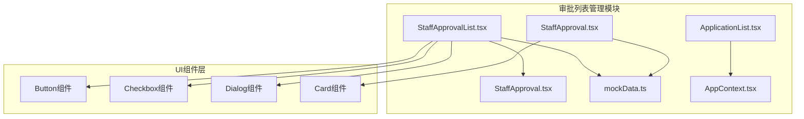
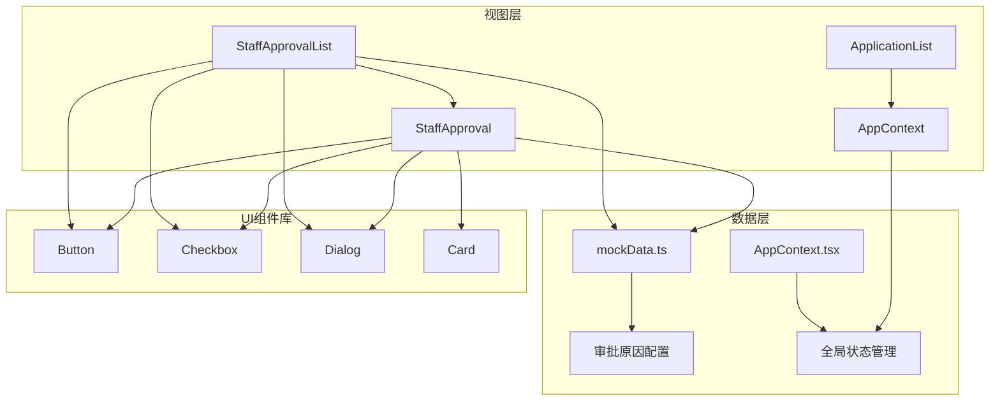
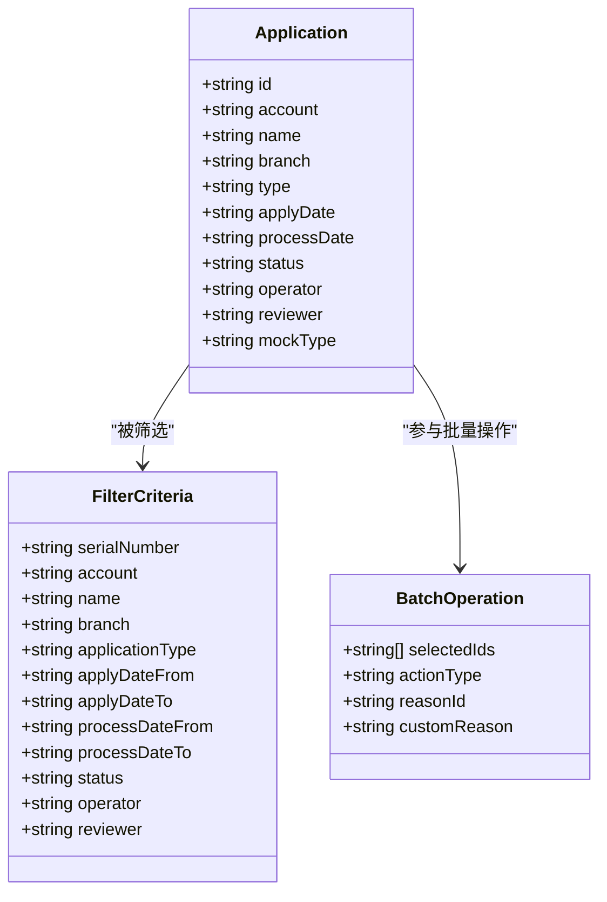
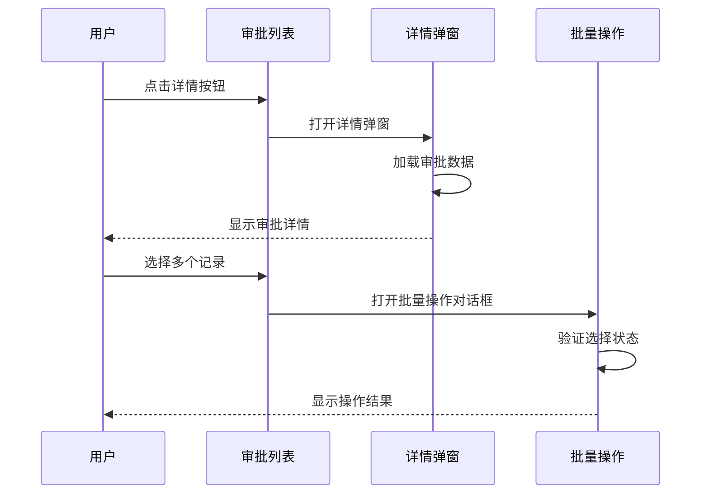
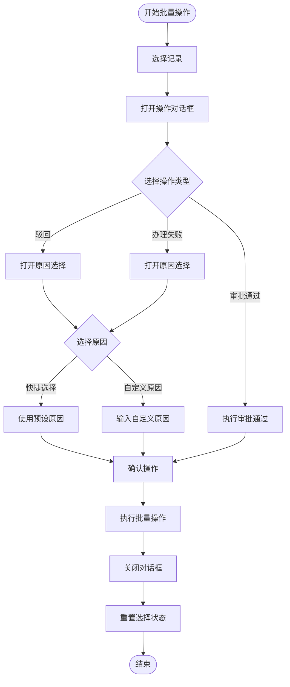
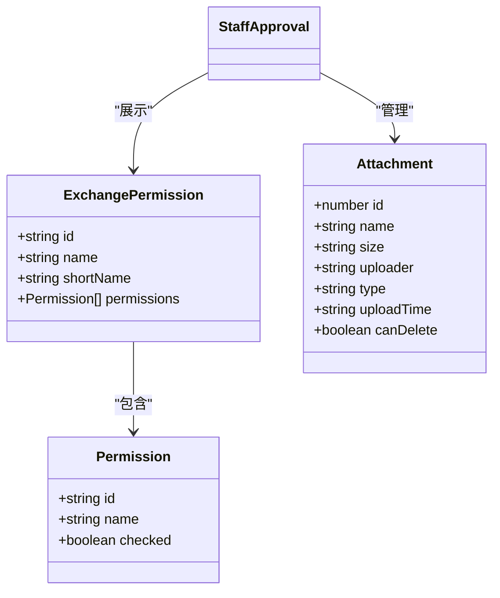
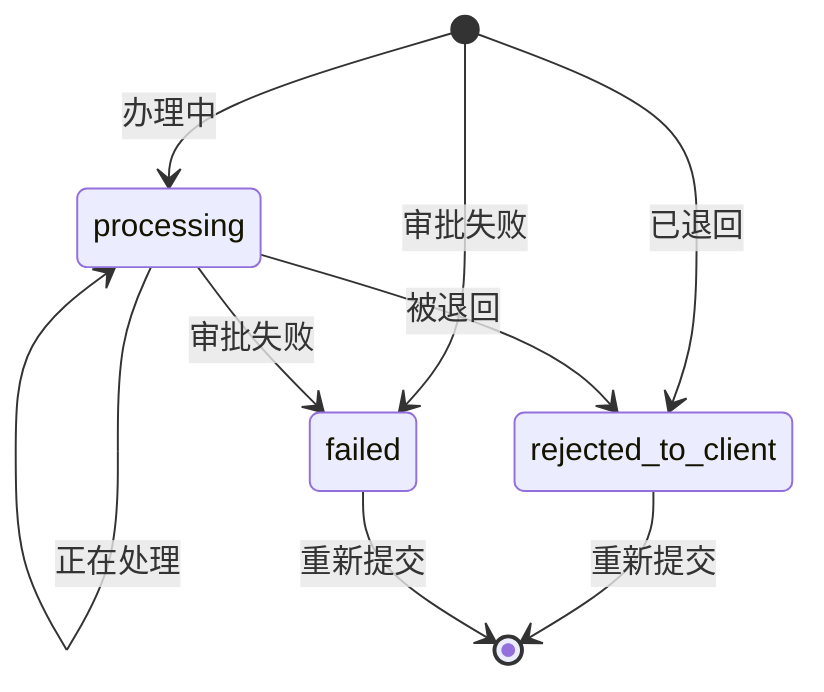
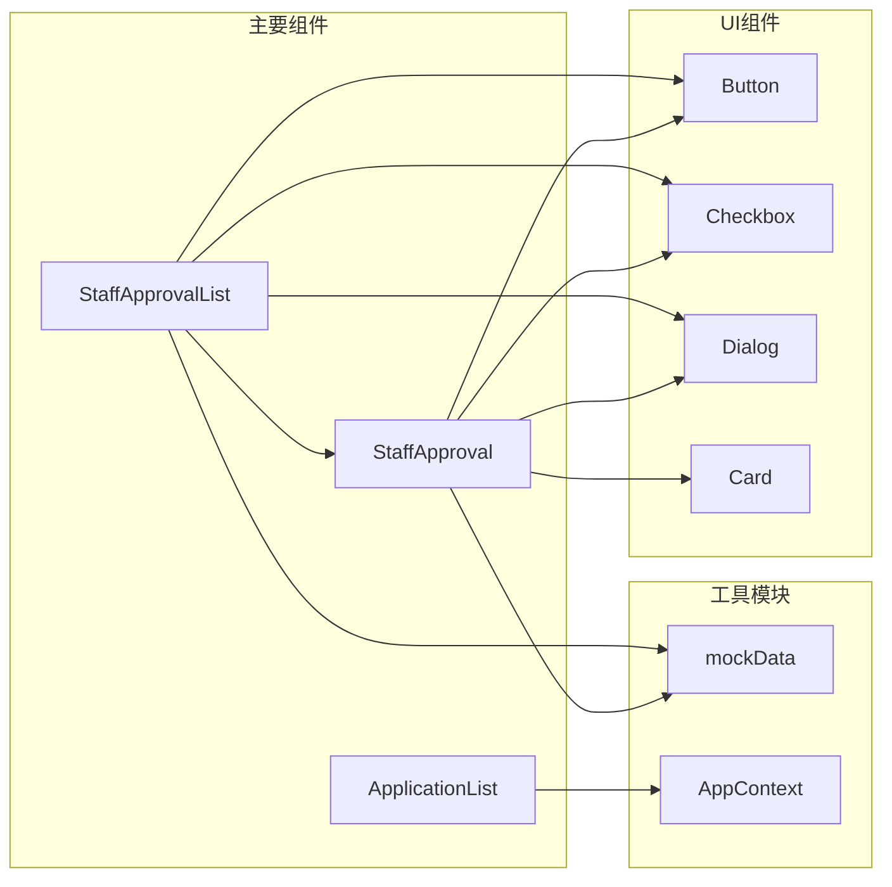

# 审批列表管理

<cite>
**本文档引用的文件**
- [StaffApprovalList.tsx](file://src/app/pages/StaffApprovalList.tsx)
- [StaffApproval.tsx](file://src/app/pages/StaffApproval.tsx)
- [ApplicationList.tsx](file://src/app/pages/ApplicationList.tsx)
- [mockData.ts](file://src/app/utils/mockData.ts)
- [AppContext.tsx](file://src/app/store/AppContext.tsx)
</cite>

## 目录
1. [简介](#简介)
2. [项目结构](#项目结构)
3. [核心组件](#核心组件)
4. [架构概览](#架构概览)
5. [详细组件分析](#详细组件分析)
6. [依赖关系分析](#依赖关系分析)
7. [性能考虑](#性能考虑)
8. [故障排除指南](#故障排除指南)
9. [结论](#结论)

## 简介

审批列表管理是交易权限开通申请管理系统的核心模块，负责展示、筛选和管理各类权限申请的审批流程。该系统提供了完整的审批工作流，包括待处理任务统计、已处理任务追踪、批量操作功能等核心能力。

系统采用React + TypeScript技术栈构建，使用Tailwind CSS进行样式设计，实现了响应式布局和现代化的用户界面。通过Mock数据模拟真实业务场景，为后续与后端API集成奠定了基础。

## 项目结构

审批列表管理模块位于项目的页面组件目录中，主要包含以下关键文件：



**图表来源**
- [StaffApprovalList.tsx:1-449](file://src/app/pages/StaffApprovalList.tsx#L1-L449)
- [StaffApproval.tsx:1-708](file://src/app/pages/StaffApproval.tsx#L1-L708)

**章节来源**
- [StaffApprovalList.tsx:1-449](file://src/app/pages/StaffApprovalList.tsx#L1-L449)
- [StaffApproval.tsx:1-708](file://src/app/pages/StaffApproval.tsx#L1-L708)

## 核心组件

### 审批列表组件 (StaffApprovalList)

审批列表组件是整个审批管理系统的入口点，提供了完整的审批任务管理界面。该组件包含了以下核心功能：

- **筛选条件管理**：支持按流水号、资金账号、姓名、营业部、申请类型、申请日期、处理日期、办理状态、经办人、复核人等多维度条件进行筛选
- **排序规则**：默认按申请日期降序排列，支持点击表头进行排序切换
- **分页机制**：提供基础的分页导航功能，支持上一页/下一页切换
- **批量操作**：支持批量处理、批量导出、附件批量下载等操作
- **实时统计**：显示总记录数和当前页码信息

### 审批详情组件 (StaffApproval)

审批详情组件提供了详细的审批流程视图，包含：

- **客户信息校验**：展示各项验证项的状态
- **附件管理**：支持附件的上传、下载、删除操作
- **权限管理**：展示全量权限表和待开通交易编码
- **审批流程**：可视化展示完整的审批流程历史
- **操作面板**：提供审批通过、驳回、办理失败等操作按钮

### 应用列表组件 (ApplicationList)

应用列表组件展示了用户发起的申请记录，提供了：

- **搜索功能**：支持按流水号和申请品种进行搜索
- **状态标识**：不同状态使用不同的颜色和图标进行标识
- **详情跳转**：点击记录可查看详细信息

**章节来源**
- [StaffApprovalList.tsx:9-449](file://src/app/pages/StaffApprovalList.tsx#L9-L449)
- [StaffApproval.tsx:78-708](file://src/app/pages/StaffApproval.tsx#L78-L708)
- [ApplicationList.tsx:7-178](file://src/app/pages/ApplicationList.tsx#L7-L178)

## 架构概览

系统采用分层架构设计，各组件职责明确，耦合度低：



**图表来源**
- [StaffApprovalList.tsx:1-449](file://src/app/pages/StaffApprovalList.tsx#L1-L449)
- [StaffApproval.tsx:1-708](file://src/app/pages/StaffApproval.tsx#L1-L708)
- [mockData.ts:1-13](file://src/app/utils/mockData.ts#L1-L13)
- [AppContext.tsx:1-64](file://src/app/store/AppContext.tsx#L1-L64)

## 详细组件分析

### 审批列表组件详细分析

#### 数据结构设计

审批列表组件使用了标准化的数据结构来表示每个申请记录：



**图表来源**
- [StaffApprovalList.tsx:22-75](file://src/app/pages/StaffApprovalList.tsx#L22-L75)

#### 状态管理机制

组件使用React Hooks进行状态管理，实现了高效的状态更新和响应：



**图表来源**
- [StaffApprovalList.tsx:87-90](file://src/app/pages/StaffApprovalList.tsx#L87-L90)
- [StaffApprovalList.tsx:332-446](file://src/app/pages/StaffApprovalList.tsx#L332-L446)

#### 批量操作流程

批量操作功能提供了统一的操作接口，支持多种审批结果：



**图表来源**
- [StaffApprovalList.tsx:14-18](file://src/app/pages/StaffApprovalList.tsx#L14-L18)
- [StaffApprovalList.tsx:382-444](file://src/app/pages/StaffApprovalList.tsx#L382-L444)

**章节来源**
- [StaffApprovalList.tsx:92-108](file://src/app/pages/StaffApprovalList.tsx#L92-L108)
- [StaffApprovalList.tsx:332-446](file://src/app/pages/StaffApprovalList.tsx#L332-L446)

### 审批详情组件详细分析

#### 权限管理功能

审批详情组件提供了完整的权限管理视图：



**图表来源**
- [StaffApproval.tsx:11-76](file://src/app/pages/StaffApproval.tsx#L11-L76)
- [StaffApproval.tsx:95-99](file://src/app/pages/StaffApproval.tsx#L95-L99)

#### 审批流程可视化

系统提供了直观的审批流程时间线展示：

```mermaid
timeline
title 审批流程时间线
2026-06-20 10:00:00 : 发起申请
2026-06-20 11:30:00 : 营业部经办
2026-06-20 14:15:00 : 营业部复核 (已驳回)
2026-06-21 09:10:00 : 重新提交申请
2026-06-21 10:00:00 : 当前节点 (处理中)
```

**图表来源**
- [StaffApproval.tsx:554-627](file://src/app/pages/StaffApproval.tsx#L554-L627)

**章节来源**
- [StaffApproval.tsx:11-76](file://src/app/pages/StaffApproval.tsx#L11-L76)
- [StaffApproval.tsx:554-627](file://src/app/pages/StaffApproval.tsx#L554-L627)

### 应用列表组件详细分析

#### 状态标识系统

应用列表组件实现了完整的状态标识系统：



**图表来源**
- [ApplicationList.tsx:16-62](file://src/app/pages/ApplicationList.tsx#L16-L62)

#### 搜索和筛选功能

应用列表提供了灵活的搜索和筛选机制：

**章节来源**
- [ApplicationList.tsx:16-62](file://src/app/pages/ApplicationList.tsx#L16-L62)

## 依赖关系分析

### 组件间依赖关系



**图表来源**
- [StaffApprovalList.tsx:1-8](file://src/app/pages/StaffApprovalList.tsx#L1-L8)
- [StaffApproval.tsx:1-9](file://src/app/pages/StaffApproval.tsx#L1-L9)
- [ApplicationList.tsx:1-6](file://src/app/pages/ApplicationList.tsx#L1-L6)

### 数据依赖分析

系统使用Mock数据作为数据源，提供了完整的审批原因配置：

| 字段名 | 类型 | 描述 | 默认值 |
|--------|------|------|--------|
| id | string | 原因ID | - |
| content | string | 原因内容 | - |
| businessType | string | 业务类型 | 'trade_permission' |
| isEnabled | boolean | 是否启用 | true/false |
| createTime | string | 创建时间 | 'YYYY-MM-DD HH:mm' |

**章节来源**
- [mockData.ts:1-13](file://src/app/utils/mockData.ts#L1-L13)

## 性能考虑

### 渲染优化策略

1. **虚拟滚动**：对于大量数据的场景，建议实现虚拟滚动以提升渲染性能
2. **懒加载**：详情弹窗采用懒加载方式，仅在需要时加载内容
3. **状态缓存**：批量操作状态在对话框关闭后自动清理，避免内存泄漏

### 数据处理优化

1. **本地筛选**：当前使用前端筛选，建议在数据量增大时考虑服务端筛选
2. **防抖处理**：搜索输入建议添加防抖机制，减少不必要的计算
3. **分页加载**：建议实现服务端分页，提升大数据量下的响应速度

## 故障排除指南

### 常见问题及解决方案

#### 审批状态显示异常

**问题描述**：审批状态标识颜色不正确或显示错误

**解决方案**：
1. 检查状态映射函数是否正确
2. 验证CSS类名拼接逻辑
3. 确认状态值与预期一致

#### 批量操作失败

**问题描述**：批量操作无法执行或提示参数错误

**解决方案**：
1. 检查选中记录ID数组是否为空
2. 验证操作类型和原因选择是否完整
3. 确认自定义原因文本是否符合长度要求

#### 详情弹窗加载缓慢

**问题描述**：点击详情按钮后页面响应迟缓

**解决方案**：
1. 检查异步数据加载逻辑
2. 优化图片和附件的加载方式
3. 实现加载状态指示器

**章节来源**
- [StaffApprovalList.tsx:77-85](file://src/app/pages/StaffApprovalList.tsx#L77-L85)
- [StaffApprovalList.tsx:424-440](file://src/app/pages/StaffApprovalList.tsx#L424-L440)

## 结论

审批列表管理模块是一个功能完整、结构清晰的审批管理系统。通过合理的组件划分和状态管理，实现了高效的审批流程管理。系统的主要优势包括：

1. **用户体验优秀**：直观的界面设计和流畅的操作体验
2. **功能完整性**：涵盖了审批管理的所有核心功能
3. **扩展性强**：模块化设计便于后续功能扩展
4. **维护友好**：清晰的代码结构和完善的注释说明

建议在后续开发中重点关注性能优化和服务端集成，以支持更大规模的业务需求。