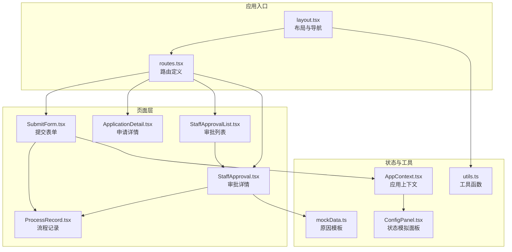
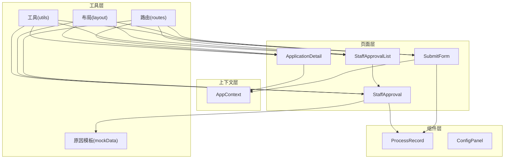
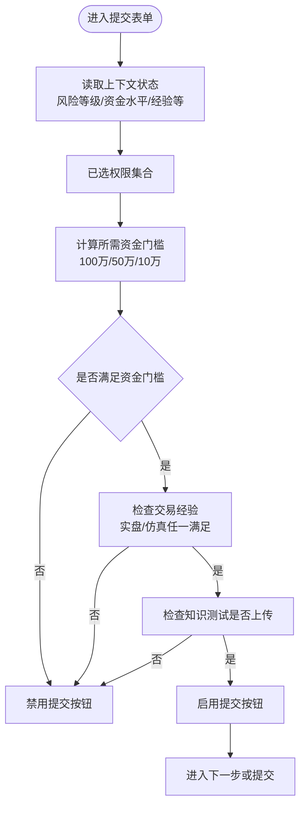
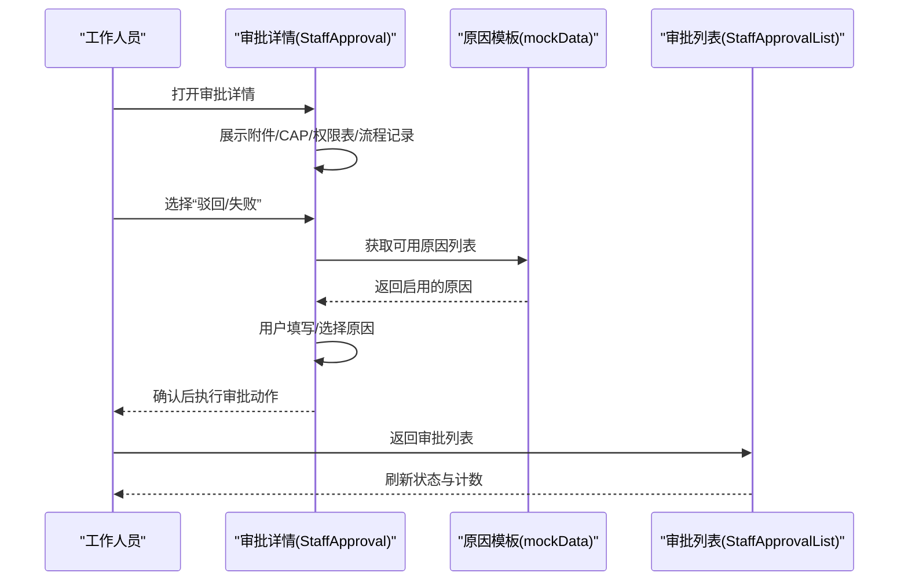
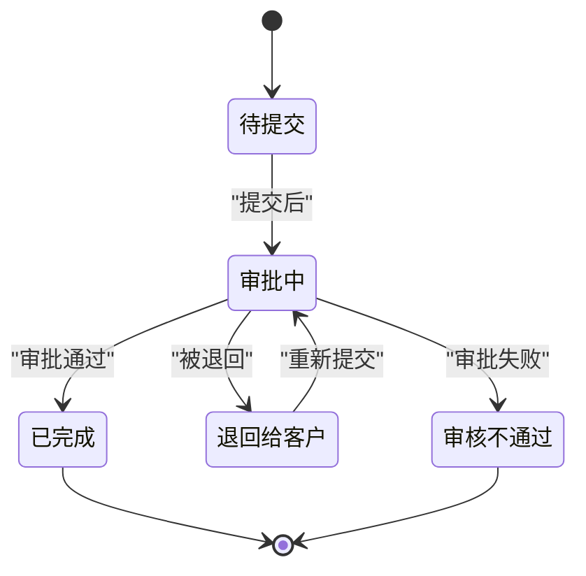
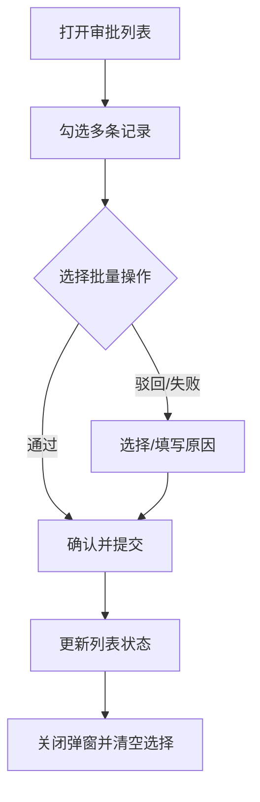
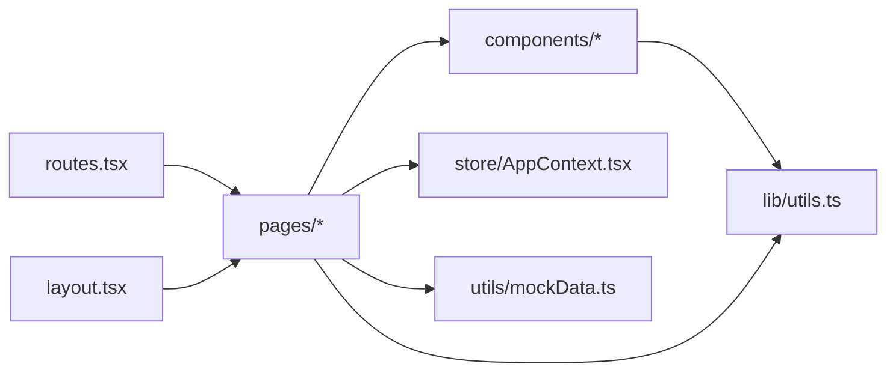

# 审批工作流引擎

<cite>
**本文档引用的文件**
- [README.md](file://README.md)
- [package.json](file://package.json)
- [src/app/layout.tsx](file://src/app/layout.tsx)
- [src/app/routes.tsx](file://src/app/routes.tsx)
- [src/app/store/AppContext.tsx](file://src/app/store/AppContext.tsx)
- [src/app/components/ConfigPanel.tsx](file://src/app/components/ConfigPanel.tsx)
- [src/lib/utils.ts](file://src/lib/utils.ts)
- [src/app/pages/SubmitForm.tsx](file://src/app/pages/SubmitForm.tsx)
- [src/app/pages/ApplicationDetail.tsx](file://src/app/pages/ApplicationDetail.tsx)
- [src/app/pages/StaffApproval.tsx](file://src/app/pages/StaffApproval.tsx)
- [src/app/pages/StaffApprovalList.tsx](file://src/app/pages/StaffApprovalList.tsx)
- [src/app/components/ProcessRecord.tsx](file://src/app/components/ProcessRecord.tsx)
- [src/app/utils/mockData.ts](file://src/app/utils/mockData.ts)
</cite>

## 目录
1. [简介](#简介)
2. [项目结构](#项目结构)
3. [核心组件](#核心组件)
4. [架构总览](#架构总览)
5. [详细组件分析](#详细组件分析)
6. [依赖关系分析](#依赖关系分析)
7. [性能考虑](#性能考虑)
8. [故障排除指南](#故障排除指南)
9. [结论](#结论)
10. [附录](#附录)

## 简介
本项目为“审批工作流引擎”的前端原型实现，围绕交易权限开通申请的审批流程展开，覆盖从客户提交、初审、复审到终审的全生命周期。系统采用React + Vite技术栈，结合React Router进行页面路由管理，并通过上下文（Context）在组件间共享全局状态。工作流以“状态机”为核心，通过状态流转驱动UI展示与交互；同时内置“原因模板”用于审批驳回与失败场景，确保审批决策的可追溯性。

## 项目结构
项目采用按页面与功能模块划分的组织方式，核心目录如下：
- src/app/pages：页面级组件，包括提交表单、审批列表、审批详情等
- src/app/components：通用UI组件与业务组件（如流程记录）
- src/app/store：全局状态管理（应用上下文）
- src/app/utils：工具与数据源（如审批原因模板）
- src/lib：通用工具函数（如类名合并）

图表来源
- [src/app/layout.tsx:74-175](file://src/app/layout.tsx#L74-L175)
- [src/app/routes.tsx:18-38](file://src/app/routes.tsx#L18-L38)
- [src/app/pages/SubmitForm.tsx:57-747](file://src/app/pages/SubmitForm.tsx#L57-L747)
- [src/app/pages/ApplicationDetail.tsx:7-113](file://src/app/pages/ApplicationDetail.tsx#L7-L113)
- [src/app/pages/StaffApproval.tsx:78-708](file://src/app/pages/StaffApproval.tsx#L78-L708)
- [src/app/pages/StaffApprovalList.tsx:9-449](file://src/app/pages/StaffApprovalList.tsx#L9-L449)
- [src/app/components/ProcessRecord.tsx:4-135](file://src/app/components/ProcessRecord.tsx#L4-L135)
- [src/app/store/AppContext.tsx:31-64](file://src/app/store/AppContext.tsx#L31-L64)
- [src/app/components/ConfigPanel.tsx:6-134](file://src/app/components/ConfigPanel.tsx#L6-L134)
- [src/app/utils/mockData.ts:1-13](file://src/app/utils/mockData.ts#L1-L13)
- [src/lib/utils.ts:1-6](file://src/lib/utils.ts#L1-L6)

章节来源
- [src/app/layout.tsx:74-175](file://src/app/layout.tsx#L74-L175)
- [src/app/routes.tsx:18-38](file://src/app/routes.tsx#L18-L38)
- [README.md:1-11](file://README.md#L1-L11)

## 核心组件
- 应用上下文（AppContext）：集中管理客户风险等级、资金水平、是否满足50个交易日、既有最高权限等影响审批的关键状态，供提交表单与详情页使用。
- 提交表单（SubmitForm）：负责收集客户信息、展示所需证明材料、根据状态与权限选择切换不同申请类型（首次申请、他司豁免、我司豁免），并控制提交按钮的可用性。
- 审批详情（StaffApproval）：面向工作人员的审批界面，包含附件管理、CAP同步、权限表展示、操作日志与审批流程时间轴。
- 审批列表（StaffApprovalList）：批量处理入口，支持批量通过、驳回、失败，并统一选择原因模板。
- 流程记录（ProcessRecord）：根据状态渲染不同阶段的流程节点，支持“退回给客户”、“审批中”、“审批通过”、“审核不通过”等场景。
- 原因模板（mockData）：集中维护可选的审批原因，按业务类型过滤启用项，支撑驳回与失败时的原因选择。

章节来源
- [src/app/store/AppContext.tsx:31-64](file://src/app/store/AppContext.tsx#L31-L64)
- [src/app/pages/SubmitForm.tsx:57-747](file://src/app/pages/SubmitForm.tsx#L57-L747)
- [src/app/pages/StaffApproval.tsx:78-708](file://src/app/pages/StaffApproval.tsx#L78-L708)
- [src/app/pages/StaffApprovalList.tsx:9-449](file://src/app/pages/StaffApprovalList.tsx#L9-L449)
- [src/app/components/ProcessRecord.tsx:4-135](file://src/app/components/ProcessRecord.tsx#L4-L135)
- [src/app/utils/mockData.ts:1-13](file://src/app/utils/mockData.ts#L1-L13)

## 架构总览
系统采用“页面-组件-上下文-工具”的分层架构：
- 页面层：负责业务编排与用户交互
- 组件层：封装可复用UI与业务组件
- 上下文层：提供全局状态共享
- 工具层：提供样式合并、路由与数据源

图表来源
- [src/app/routes.tsx:18-38](file://src/app/routes.tsx#L18-L38)
- [src/app/layout.tsx:74-175](file://src/app/layout.tsx#L74-L175)
- [src/app/pages/SubmitForm.tsx:57-747](file://src/app/pages/SubmitForm.tsx#L57-L747)
- [src/app/pages/ApplicationDetail.tsx:7-113](file://src/app/pages/ApplicationDetail.tsx#L7-L113)
- [src/app/pages/StaffApprovalList.tsx:9-449](file://src/app/pages/StaffApprovalList.tsx#L9-L449)
- [src/app/pages/StaffApproval.tsx:78-708](file://src/app/pages/StaffApproval.tsx#L78-L708)
- [src/app/components/ProcessRecord.tsx:4-135](file://src/app/components/ProcessRecord.tsx#L4-L135)
- [src/app/store/AppContext.tsx:31-64](file://src/app/store/AppContext.tsx#L31-L64)
- [src/app/utils/mockData.ts:1-13](file://src/app/utils/mockData.ts#L1-L13)
- [src/lib/utils.ts:1-6](file://src/lib/utils.ts#L1-L6)

## 详细组件分析

### 提交表单（SubmitForm）——工作流状态机与流程控制
SubmitForm是审批工作流的核心入口，承担以下职责：
- 依据上下文状态与已选权限，动态计算资金门槛（100万/50万/10万）与经验要求
- 控制“首次申请/他司豁免/我司豁免”三种申请类型的可见性与可用性
- 根据各阶段条件启用/禁用提交按钮，形成“状态机”式的流程控制
- 渲染流程记录（ProcessRecord），展示历史与当前状态

图表来源
- [src/app/pages/SubmitForm.tsx:57-747](file://src/app/pages/SubmitForm.tsx#L57-L747)
- [src/app/store/AppContext.tsx:31-64](file://src/app/store/AppContext.tsx#L31-L64)

章节来源
- [src/app/pages/SubmitForm.tsx:57-747](file://src/app/pages/SubmitForm.tsx#L57-L747)
- [src/app/store/AppContext.tsx:31-64](file://src/app/store/AppContext.tsx#L31-L64)

### 审批详情（StaffApproval）——节点权限与操作控制
审批详情页面向工作人员，提供以下能力：
- 附件管理：上传、下载、删除
- CAP同步：触发同步并展示状态
- 权限表：按交易所维度展示权限开关
- 操作日志：展示历史操作
- 审批流程：以时间轴形式展示当前节点与历史节点
- 审批动作：通过、驳回、办理失败（统一使用原因模板）

图表来源
- [src/app/pages/StaffApproval.tsx:78-708](file://src/app/pages/StaffApproval.tsx#L78-L708)
- [src/app/pages/StaffApprovalList.tsx:9-449](file://src/app/pages/StaffApprovalList.tsx#L9-L449)
- [src/app/utils/mockData.ts:1-13](file://src/app/utils/mockData.ts#L1-L13)

章节来源
- [src/app/pages/StaffApproval.tsx:78-708](file://src/app/pages/StaffApproval.tsx#L78-L708)
- [src/app/pages/StaffApprovalList.tsx:9-449](file://src/app/pages/StaffApprovalList.tsx#L9-L449)
- [src/app/utils/mockData.ts:1-13](file://src/app/utils/mockData.ts#L1-L13)

### 流程记录（ProcessRecord）——状态持久化与可视化
流程记录根据状态渲染不同阶段：
- 退回给客户：展示退回原因与重新提交节点
- 审批中：当前处理节点，带脉冲动画
- 审批通过：完成节点
- 审核不通过：失败节点与原因说明

图表来源
- [src/app/components/ProcessRecord.tsx:4-135](file://src/app/components/ProcessRecord.tsx#L4-L135)

章节来源
- [src/app/components/ProcessRecord.tsx:4-135](file://src/app/components/ProcessRecord.tsx#L4-L135)

### 审批列表（StaffApprovalList）——批量处理与并发控制
审批列表支持批量处理：
- 多选行：勾选多个申请
- 批量操作：通过、驳回、失败
- 批量原因：统一选择原因模板
- 并发控制：通过禁用按钮与条件判断，避免重复提交

图表来源
- [src/app/pages/StaffApprovalList.tsx:9-449](file://src/app/pages/StaffApprovalList.tsx#L9-L449)

章节来源
- [src/app/pages/StaffApprovalList.tsx:9-449](file://src/app/pages/StaffApprovalList.tsx#L9-L449)

### 原因模板（mockData）——异常处理机制
原因模板集中管理可选的审批原因，按业务类型过滤启用项，支撑：
- 驳回原因：快速选择常用原因，或自定义原因
- 办理失败原因：统一原因口径，便于审计与统计

章节来源
- [src/app/utils/mockData.ts:1-13](file://src/app/utils/mockData.ts#L1-L13)

## 依赖关系分析
- 路由与布局：通过React Router与自定义Layout组织页面导航与面包屑
- 组件复用：SubmitForm与StaffApproval均复用ProcessRecord展示流程
- 状态共享：AppContext贯穿页面与组件，减少props传递
- 工具函数：统一的类名合并工具提升样式一致性

图表来源
- [src/app/routes.tsx:18-38](file://src/app/routes.tsx#L18-L38)
- [src/app/layout.tsx:74-175](file://src/app/layout.tsx#L74-L175)
- [src/app/pages/SubmitForm.tsx:57-747](file://src/app/pages/SubmitForm.tsx#L57-L747)
- [src/app/pages/StaffApproval.tsx:78-708](file://src/app/pages/StaffApproval.tsx#L78-L708)
- [src/app/components/ProcessRecord.tsx:4-135](file://src/app/components/ProcessRecord.tsx#L4-L135)
- [src/app/store/AppContext.tsx:31-64](file://src/app/store/AppContext.tsx#L31-L64)
- [src/lib/utils.ts:1-6](file://src/lib/utils.ts#L1-L6)
- [src/app/utils/mockData.ts:1-13](file://src/app/utils/mockData.ts#L1-L13)

章节来源
- [src/app/routes.tsx:18-38](file://src/app/routes.tsx#L18-L38)
- [src/app/layout.tsx:74-175](file://src/app/layout.tsx#L74-L175)
- [src/lib/utils.ts:1-6](file://src/lib/utils.ts#L1-L6)

## 性能考虑
- 组件懒加载：可通过路由拆分进一步优化首屏加载
- 状态最小化：AppContext仅存放必要状态，避免过度订阅
- 渲染优化：使用memo与key稳定列表项，减少重绘
- 图标与样式：统一使用轻量图标库与Tailwind，避免冗余CSS

## 故障排除指南
- 提交按钮不可用
  - 检查资金门槛是否满足、交易经验是否达标、知识测试是否上传
  - 章节来源: [src/app/pages/SubmitForm.tsx:108-111](file://src/app/pages/SubmitForm.tsx#L108-L111)
- 审批原因为空
  - 确认原因模板已启用且业务类型匹配
  - 章节来源: [src/app/utils/mockData.ts:1-13](file://src/app/utils/mockData.ts#L1-L13)
- 流程记录不更新
  - 确认传入的状态参数正确，或检查默认状态分支
  - 章节来源: [src/app/components/ProcessRecord.tsx:4-135](file://src/app/components/ProcessRecord.tsx#L4-L135)
- 批量操作无效
  - 检查是否选择了记录、原因是否必填、按钮禁用条件是否满足
  - 章节来源: [src/app/pages/StaffApprovalList.tsx:418-444](file://src/app/pages/StaffApprovalList.tsx#L418-L444)

## 结论
该审批工作流引擎以“状态机+原因模板+上下文共享”为核心设计，实现了从客户提交到审批完成的闭环流程。通过清晰的页面分层与组件复用，系统具备良好的可扩展性与可维护性。建议后续在真实后端接入时，补充服务端状态持久化、并发锁与审计日志接口，以满足生产环境的可靠性与合规性要求。

## 附录

### 工作流状态转换矩阵
| 当前状态 | 触发事件 | 下一状态 | 说明 |
| --- | --- | --- | --- |
| 待提交 | 提交申请 | 审批中 | 进入审批流程 |
| 审批中 | 审批通过 | 已完成 | 完成权限开通 |
| 审批中 | 驳回 | 退回给客户 | 需要重新提交 |
| 审批中 | 审批失败 | 审核不通过 | 不予开通 |
| 退回给客户 | 重新提交 | 审批中 | 重新进入审批 |

章节来源
- [src/app/components/ProcessRecord.tsx:4-135](file://src/app/components/ProcessRecord.tsx#L4-L135)
- [src/app/pages/SubmitForm.tsx:108-111](file://src/app/pages/SubmitForm.tsx#L108-L111)