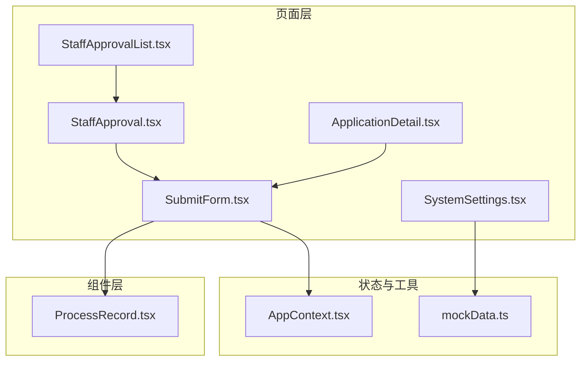
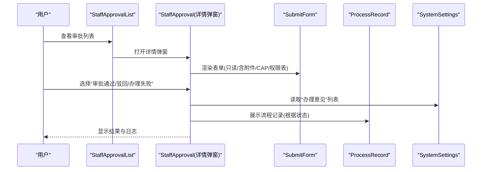
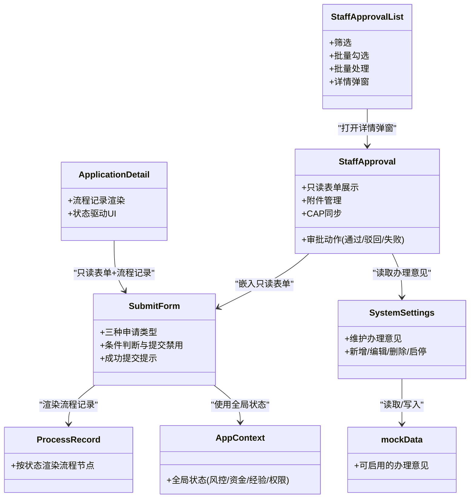
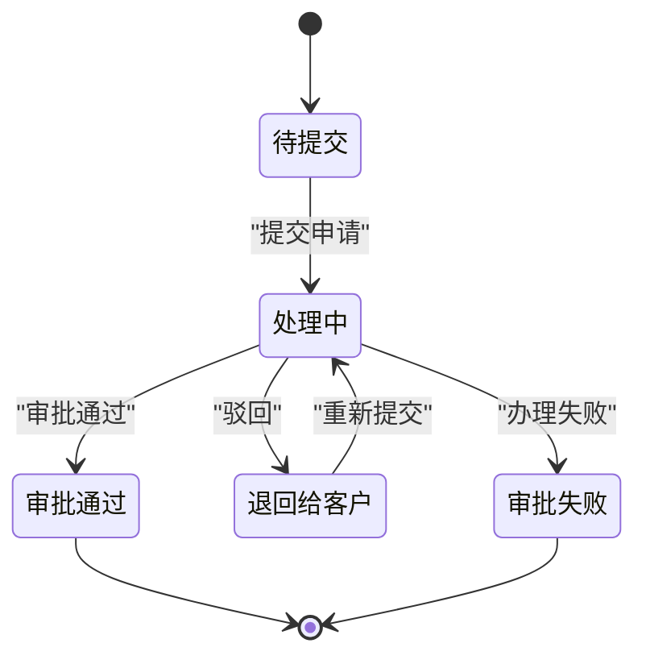

# 审批流程管理

<cite>
**本文引用的文件**
- [StaffApproval.tsx](file://src/app/pages/StaffApproval.tsx)
- [StaffApprovalList.tsx](file://src/app/pages/StaffApprovalList.tsx)
- [ApplicationDetail.tsx](file://src/app/pages/ApplicationDetail.tsx)
- [SubmitForm.tsx](file://src/app/pages/SubmitForm.tsx)
- [SystemSettings.tsx](file://src/app/pages/SystemSettings.tsx)
- [ProcessRecord.tsx](file://src/app/components/ProcessRecord.tsx)
- [AppContext.tsx](file://src/app/store/AppContext.tsx)
- [mockData.ts](file://src/app/utils/mockData.ts)
</cite>

## 目录
1. [简介](#简介)
2. [项目结构](#项目结构)
3. [核心组件](#核心组件)
4. [架构总览](#架构总览)
5. [详细组件分析](#详细组件分析)
6. [依赖关系分析](#依赖关系分析)
7. [性能考量](#性能考量)
8. [故障排查指南](#故障排查指南)
9. [结论](#结论)
10. [附录](#附录)

## 简介
本文件面向“审批流程管理”的业务需求，基于仓库中的前端实现，系统化梳理审批状态流转机制、权限分配策略、工作量分配思路、员工审批界面功能、批量处理能力、审批历史追踪、节点配置、超时处理机制、异常状态恢复与统计分析等主题。文档同时提供审批流程图与状态转换矩阵，帮助非技术读者快速理解系统运作。

## 项目结构
该模块主要位于 src/app/pages 与 src/app/components 下，采用按页面与组件分离的组织方式：
- 页面层：StaffApproval、StaffApprovalList、ApplicationDetail、SubmitForm、SystemSettings
- 组件层：ProcessRecord
- 状态与上下文：AppContext
- 工具与配置：mockData

图表来源
- [StaffApproval.tsx](file://src/app/pages/StaffApproval.tsx)
- [StaffApprovalList.tsx](file://src/app/pages/StaffApprovalList.tsx)
- [ApplicationDetail.tsx](file://src/app/pages/ApplicationDetail.tsx)
- [SubmitForm.tsx](file://src/app/pages/SubmitForm.tsx)
- [SystemSettings.tsx](file://src/app/pages/SystemSettings.tsx)
- [ProcessRecord.tsx](file://src/app/components/ProcessRecord.tsx)
- [AppContext.tsx](file://src/app/store/AppContext.tsx)
- [mockData.ts](file://src/app/utils/mockData.ts)

章节来源
- [StaffApproval.tsx:1-708](file://src/app/pages/StaffApproval.tsx#L1-L708)
- [StaffApprovalList.tsx:1-449](file://src/app/pages/StaffApprovalList.tsx#L1-L449)
- [ApplicationDetail.tsx:1-113](file://src/app/pages/ApplicationDetail.tsx#L1-L113)
- [SubmitForm.tsx:1-747](file://src/app/pages/SubmitForm.tsx#L1-L747)
- [SystemSettings.tsx:1-192](file://src/app/pages/SystemSettings.tsx#L1-L192)
- [ProcessRecord.tsx:1-135](file://src/app/components/ProcessRecord.tsx#L1-L135)
- [AppContext.tsx:1-64](file://src/app/store/AppContext.tsx#L1-L64)
- [mockData.ts:1-13](file://src/app/utils/mockData.ts#L1-L13)

## 核心组件
- 审批主界面 StaffApproval：展示客户信息校验、申请表单、附件、CAP同步、全量权限表、操作日志与审批流程，并提供“审批通过/驳回/办理失败”的操作入口。
- 审批列表 StaffApprovalList：提供筛选、批量勾选、批量处理、批量导出与附件批量下载；支持弹窗查看详情。
- 申请详情 ApplicationDetail：面向申请人侧的流程记录展示，支持不同状态（处理中、退回给客户、失败、成功）的可视化呈现。
- 表单 SubmitForm：统一的申请表单组件，支持首次申请、他司豁免、我司豁免三种类型，内置条件判断与提交按钮禁用逻辑。
- 流程记录 ProcessRecord：通用流程记录组件，按状态渲染不同节点。
- 系统设置 SystemSettings：维护“办理意见”列表，支持新增、编辑、删除、启用/停用。
- 上下文 AppContext：提供风控等级、资金等级、是否满足50天经验、既有最高权限等全局状态。
- 工具 mockData：集中管理“可选的办理意见”列表与过滤函数。

章节来源
- [StaffApproval.tsx:78-708](file://src/app/pages/StaffApproval.tsx#L78-L708)
- [StaffApprovalList.tsx:9-449](file://src/app/pages/StaffApprovalList.tsx#L9-L449)
- [ApplicationDetail.tsx:7-113](file://src/app/pages/ApplicationDetail.tsx#L7-L113)
- [SubmitForm.tsx:57-747](file://src/app/pages/SubmitForm.tsx#L57-L747)
- [ProcessRecord.tsx:4-135](file://src/app/components/ProcessRecord.tsx#L4-L135)
- [SystemSettings.tsx:15-192](file://src/app/pages/SystemSettings.tsx#L15-L192)
- [AppContext.tsx:6-64](file://src/app/store/AppContext.tsx#L6-L64)
- [mockData.ts:10-13](file://src/app/utils/mockData.ts#L10-L13)

## 架构总览
审批流程在前端通过页面与组件协作实现，核心交互如下：
- 列表页负责筛选与批量操作；
- 详情弹窗承载审批主界面；
- 表单组件根据申请类型与条件动态决定可提交状态；
- 流程记录组件按状态渲染；
- 系统设置维护“办理意见”，供审批时选择。

图表来源
- [StaffApprovalList.tsx:302-330](file://src/app/pages/StaffApprovalList.tsx#L302-L330)
- [StaffApproval.tsx:117-140](file://src/app/pages/StaffApproval.tsx#L117-L140)
- [SystemSettings.tsx:15-62](file://src/app/pages/SystemSettings.tsx#L15-L62)
- [ProcessRecord.tsx:4-135](file://src/app/components/ProcessRecord.tsx#L4-L135)

## 详细组件分析

### 审批主界面 StaffApproval
- 功能要点
  - 客户信息校验项展示（机构证件、开户授权人、产品信息、法人、联系信息、受益人等）
  - 申请表单嵌入（只读模式，含“相关人员证件有效期”“受益人信息”区块）
  - 附件管理（上传、下载、删除）
  - CAP 同步（同步中/已同步状态）
  - 全量权限表（交易所维度展示）
  - 操作日志与审批流程（时间线式展示，含当前节点高亮）
  - 审批动作（通过、驳回、办理失败），其中“驳回/失败”使用统一弹窗选择“快捷原因”

- 关键交互
  - 驳回/失败弹窗：支持从“可启用的办理意见”中选择或自定义原因
  - CAP 同步：模拟异步状态切换
  - 关闭：支持模态关闭或返回上一页

章节来源
- [StaffApproval.tsx:117-140](file://src/app/pages/StaffApproval.tsx#L117-L140)
- [StaffApproval.tsx:142-147](file://src/app/pages/StaffApproval.tsx#L142-L147)
- [StaffApproval.tsx:334-628](file://src/app/pages/StaffApproval.tsx#L334-L628)
- [StaffApproval.tsx:644-704](file://src/app/pages/StaffApproval.tsx#L644-L704)

### 审批列表 StaffApprovalList
- 功能要点
  - 多维筛选（流水号、资金账号、姓名、营业部、申请类型、申请/处理日期、状态、经办/复核人）
  - 行级勾选与全选
  - 批量处理（成功/驳回/失败），支持批量选择“办理意见”
  - 批量导出与附件批量下载
  - 详情弹窗：传入 applicationType 与 mockExchangeIds 控制只读表单展示

- 批量处理流程
  - 选择结果（成功/驳回/失败）
  - 若选择“驳回/失败”，弹窗选择“快捷原因”或填写自定义原因
  - 确认后清空选择并关闭弹窗

章节来源
- [StaffApprovalList.tsx:22-75](file://src/app/pages/StaffApprovalList.tsx#L22-L75)
- [StaffApprovalList.tsx:200-215](file://src/app/pages/StaffApprovalList.tsx#L200-L215)
- [StaffApprovalList.tsx:332-446](file://src/app/pages/StaffApprovalList.tsx#L332-L446)

### 申请详情 ApplicationDetail
- 功能要点
  - 根据状态渲染流程记录：处理中、退回给客户、失败、成功
  - 支持只读模式下的表单展示与流程记录叠加

章节来源
- [ApplicationDetail.tsx:18-22](file://src/app/pages/ApplicationDetail.tsx#L18-L22)
- [ApplicationDetail.tsx:24-102](file://src/app/pages/ApplicationDetail.tsx#L24-L102)

### 表单 SubmitForm
- 功能要点
  - 三大申请类型：首次申请、他司豁免、我司豁免
  - 首次申请：资金门槛（100万/50万/10万）、交易经历（实盘/仿真）、知识测试
  - 豁免：多选豁免情形，必要时上传证明
  - 提交按钮禁用逻辑：根据当前类型与条件判断
  - 成功提交后弹窗提示并跳转

- 关键逻辑
  - 资金门槛判定：依据已选产品集合映射交易所 ID，决定是否需要满足不同门槛
  - 经验与测试：实盘/仿真任一满足且测试通过即满足首次申请条件
  - 豁免：至少一个豁免情形被勾选，若勾选“其他品种”则需上传证明

章节来源
- [SubmitForm.tsx:94-114](file://src/app/pages/SubmitForm.tsx#L94-L114)
- [SubmitForm.tsx:375-546](file://src/app/pages/SubmitForm.tsx#L375-L546)
- [SubmitForm.tsx:548-617](file://src/app/pages/SubmitForm.tsx#L548-L617)
- [SubmitForm.tsx:619-638](file://src/app/pages/SubmitForm.tsx#L619-L638)
- [SubmitForm.tsx:648-663](file://src/app/pages/SubmitForm.tsx#L648-L663)

### 流程记录 ProcessRecord
- 功能要点
  - 根据状态渲染不同节点：客户提交、审批中、退回给客户、审批通过、审核不通过、已完成
  - 支持显示“退回原因/不通过原因”

章节来源
- [ProcessRecord.tsx:4-135](file://src/app/components/ProcessRecord.tsx#L4-L135)

### 系统设置 SystemSettings
- 功能要点
  - 维护“交易权限申请”的“办理意见”列表
  - 支持新增、编辑、删除、启用/停用
  - 业务模块切换（当前仅交易权限）

章节来源
- [SystemSettings.tsx:15-62](file://src/app/pages/SystemSettings.tsx#L15-L62)
- [SystemSettings.tsx:146-189](file://src/app/pages/SystemSettings.tsx#L146-L189)

### 上下文 AppContext 与工具 mockData
- AppContext：提供风控等级、资金等级、是否满足50天经验、既有最高权限、客户类型、投资者类型、已选产品等全局状态
- mockData：集中管理“可启用的办理意见”列表与过滤函数

章节来源
- [AppContext.tsx:6-64](file://src/app/store/AppContext.tsx#L6-L64)
- [mockData.ts:10-13](file://src/app/utils/mockData.ts#L10-L13)

## 依赖关系分析

图表来源
- [StaffApproval.tsx:315-327](file://src/app/pages/StaffApproval.tsx#L315-L327)
- [StaffApprovalList.tsx:314-327](file://src/app/pages/StaffApprovalList.tsx#L314-L327)
- [ApplicationDetail.tsx:104-111](file://src/app/pages/ApplicationDetail.tsx#L104-L111)
- [SubmitForm.tsx:641-643](file://src/app/pages/SubmitForm.tsx#L641-L643)
- [SystemSettings.tsx:15-62](file://src/app/pages/SystemSettings.tsx#L15-L62)
- [AppContext.tsx:6-64](file://src/app/store/AppContext.tsx#L6-L64)
- [mockData.ts:10-13](file://src/app/utils/mockData.ts#L10-L13)

章节来源
- [StaffApproval.tsx:315-327](file://src/app/pages/StaffApproval.tsx#L315-L327)
- [StaffApprovalList.tsx:314-327](file://src/app/pages/StaffApprovalList.tsx#L314-L327)
- [ApplicationDetail.tsx:104-111](file://src/app/pages/ApplicationDetail.tsx#L104-L111)
- [SubmitForm.tsx:641-643](file://src/app/pages/SubmitForm.tsx#L641-L643)
- [SystemSettings.tsx:15-62](file://src/app/pages/SystemSettings.tsx#L15-L62)
- [AppContext.tsx:6-64](file://src/app/store/AppContext.tsx#L6-L64)
- [mockData.ts:10-13](file://src/app/utils/mockData.ts#L10-L13)

## 性能考量
- 列表渲染优化
  - 使用虚拟滚动或分页可进一步降低长列表渲染压力（建议）
- 图标与动画
  - 当前使用轻量图标与简单动画，整体开销可控
- 状态更新
  - AppContext 将全局状态集中管理，减少跨层级传递成本
- 批量处理
  - 勾选状态在内存中维护，建议限制单次批量数量并增加确认步骤

## 故障排查指南
- 驳回/失败原因为空
  - 检查“可启用的办理意见”是否配置；确认“其他原因”场景下已填写自定义原因
- CAP 同步状态异常
  - 确认同步按钮状态机（idle/syncing/success）切换逻辑是否正确
- 提交按钮不可用
  - 检查当前申请类型与条件：首次申请需满足资金门槛、交易经历与知识测试；豁免需满足勾选条件与必要时上传证明
- 流程记录不显示
  - 确认传入的状态参数与 ProcessRecord 的分支逻辑一致

章节来源
- [SystemSettings.tsx:15-62](file://src/app/pages/SystemSettings.tsx#L15-L62)
- [mockData.ts:10-13](file://src/app/utils/mockData.ts#L10-L13)
- [SubmitForm.tsx:94-114](file://src/app/pages/SubmitForm.tsx#L94-L114)
- [ProcessRecord.tsx:4-135](file://src/app/components/ProcessRecord.tsx#L4-L135)

## 结论
本系统通过页面与组件的清晰分工，实现了从“审批列表—详情弹窗—表单—流程记录—意见配置”的闭环。审批主界面提供了直观的操作入口与详尽的历史追踪；列表页支持批量处理与导出；系统设置保障了“办理意见”的可配置性。后续可在批量上限、分页与虚拟滚动、状态机可视化等方面进一步增强体验与性能。

## 附录

### 审批状态流转机制与流程图
- 状态类型
  - 处理中（processing）
  - 退回给客户（rejected_to_client）
  - 审批失败（failed）
  - 审批通过（success）
  - 默认（待提交）

图表来源
- [ProcessRecord.tsx:24-129](file://src/app/components/ProcessRecord.tsx#L24-L129)
- [ApplicationDetail.tsx:45-96](file://src/app/pages/ApplicationDetail.tsx#L45-L96)

### 审批节点配置与“办理意见”
- 节点配置来源：系统设置页面维护“交易权限申请”的“办理意见”
- 快捷原因来源：mockData 中的“可启用的办理意见”列表
- 使用场景：审批主界面与批量处理弹窗均从 mockData 获取“可启用的办理意见”，并在“其他原因”场景下允许自定义输入

章节来源
- [SystemSettings.tsx:15-62](file://src/app/pages/SystemSettings.tsx#L15-L62)
- [mockData.ts:10-13](file://src/app/utils/mockData.ts#L10-L13)
- [StaffApproval.tsx:117-140](file://src/app/pages/StaffApproval.tsx#L117-L140)
- [StaffApprovalList.tsx:382-416](file://src/app/pages/StaffApprovalList.tsx#L382-L416)

### 权限分配策略与工作量分配算法
- 权限分配策略
  - 通过“已选交易权限”与“交易所维度”展示，支持只读模式下的权限核对
- 工作量分配算法
  - 当前实现为“列表页勾选 + 弹窗详情 + 单条审批”的交互模式
  - 批量处理通过“勾选 + 统一弹窗 + 确认”实现
  - 建议引入“优先级/权重/饱和度”指标与“最小化最大值”策略，结合“批量上限+确认”形成更稳健的工作量分配方案（概念性建议）

章节来源
- [StaffApproval.tsx:470-510](file://src/app/pages/StaffApproval.tsx#L470-L510)
- [StaffApprovalList.tsx:200-215](file://src/app/pages/StaffApprovalList.tsx#L200-L215)

### 员工审批界面功能设计
- 信息校验与表单嵌入：只读表单与附加区块
- 附件管理：上传、下载、删除
- CAP 同步：状态指示与触发
- 权限表：交易所维度全量展示
- 操作日志与流程：时间线式展示
- 审批动作：通过/驳回/失败，统一弹窗选择原因

章节来源
- [StaffApproval.tsx:232-628](file://src/app/pages/StaffApproval.tsx#L232-L628)

### 批量处理能力
- 列表页支持批量勾选、批量处理、批量导出与附件批量下载
- 批量处理弹窗支持选择“成功/驳回/失败”，并选择“快捷原因”或填写自定义原因

章节来源
- [StaffApprovalList.tsx:200-215](file://src/app/pages/StaffApprovalList.tsx#L200-L215)
- [StaffApprovalList.tsx:332-446](file://src/app/pages/StaffApprovalList.tsx#L332-L446)

### 审批历史追踪
- 申请详情页与审批主界面均提供流程记录
- 支持退回原因与不通过原因的展示

章节来源
- [ApplicationDetail.tsx:24-102](file://src/app/pages/ApplicationDetail.tsx#L24-L102)
- [StaffApproval.tsx:552-627](file://src/app/pages/StaffApproval.tsx#L552-L627)

### 超时处理机制与异常状态恢复
- 超时处理机制
  - 当前未见明确的“超时计时器/告警”实现，建议在“处理中”状态下引入倒计时与提醒
- 异常状态恢复
  - “退回给客户”后可重新提交，流程记录会追加新的提交节点
  - “办理失败”后可重新评估与提交

章节来源
- [ProcessRecord.tsx:45-96](file://src/app/components/ProcessRecord.tsx#L45-L96)
- [ApplicationDetail.tsx:54-79](file://src/app/pages/ApplicationDetail.tsx#L54-L79)

### 审批统计分析
- 当前未见专门的“统计分析”页面或图表组件
- 建议在系统设置或独立报表页中扩展：按状态/营业部/经办人/时间维度的统计与导出

[本节为概念性建议，不直接分析具体文件]