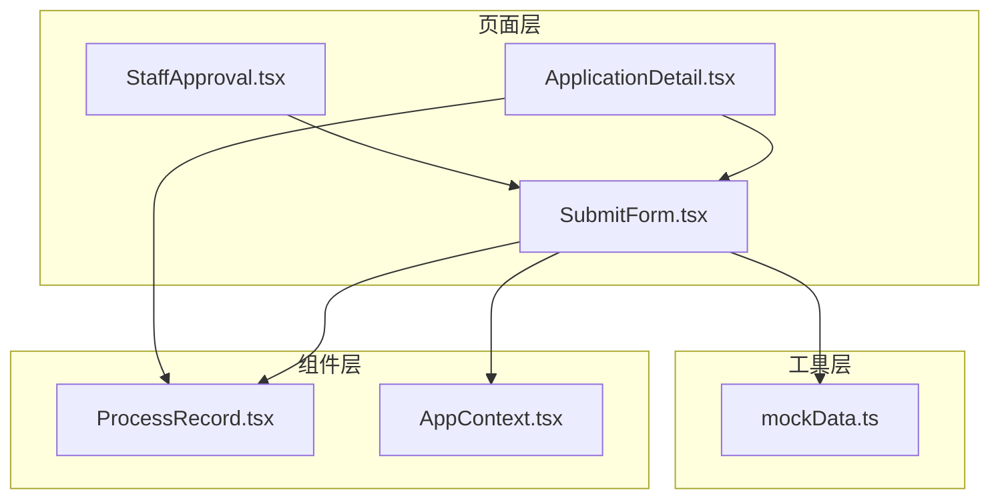
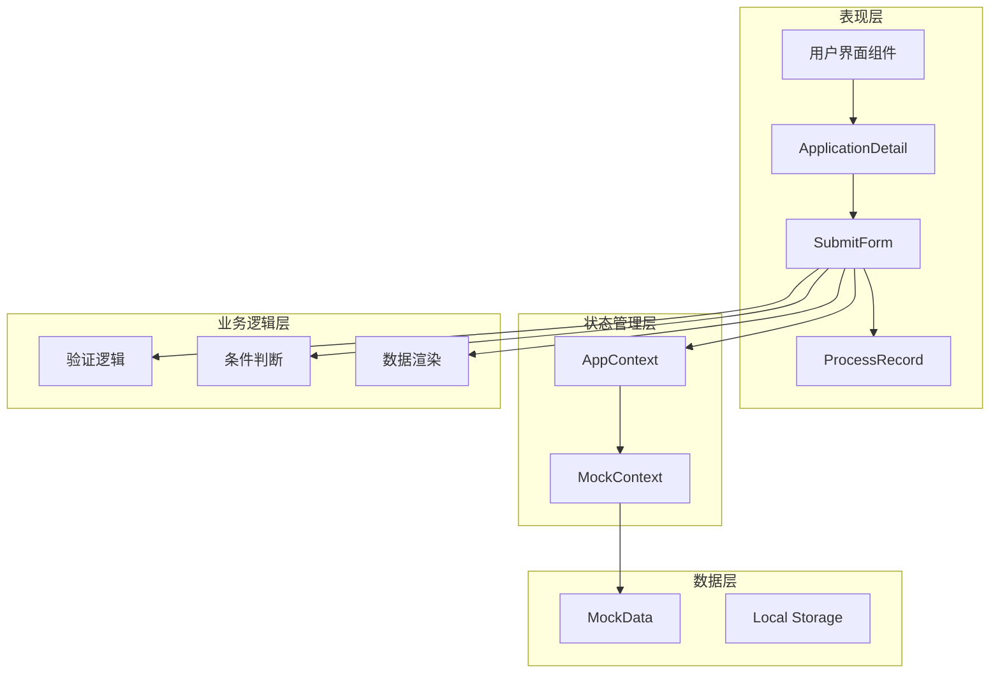
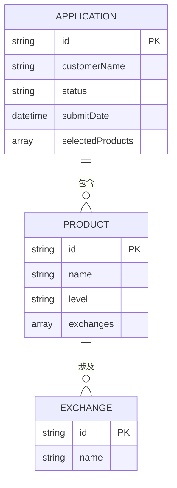
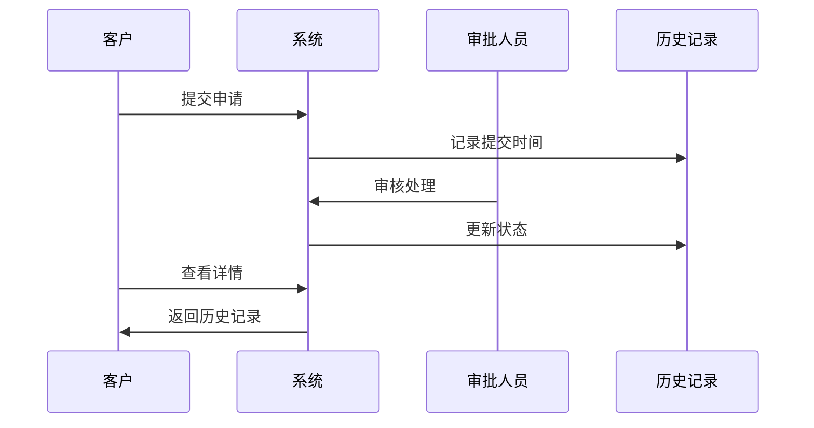
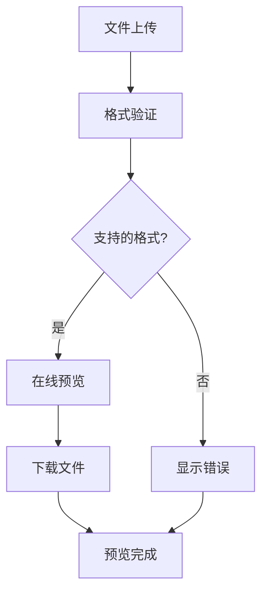
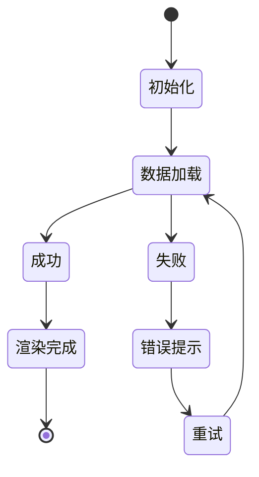
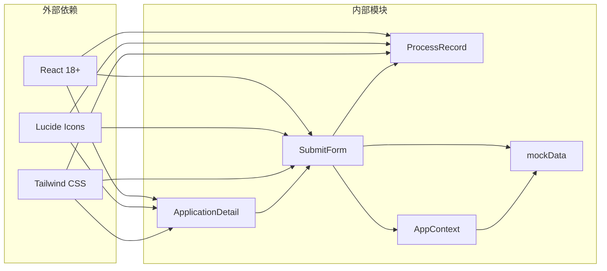

# 申请详情查看

<cite>
**本文档引用的文件**
- [ApplicationDetail.tsx](file://src/app/pages/ApplicationDetail.tsx)
- [SubmitForm.tsx](file://src/app/pages/SubmitForm.tsx)
- [ProcessRecord.tsx](file://src/app/components/ProcessRecord.tsx)
- [AppContext.tsx](file://src/app/store/AppContext.tsx)
- [mockData.ts](file://src/app/utils/mockData.ts)
- [StaffApproval.tsx](file://src/app/pages/StaffApproval.tsx)
</cite>

## 目录
1. [简介](#简介)
2. [项目结构](#项目结构)
3. [核心组件](#核心组件)
4. [架构概览](#架构概览)
5. [详细组件分析](#详细组件分析)
6. [依赖关系分析](#依赖关系分析)
7. [性能考虑](#性能考虑)
8. [故障排除指南](#故障排除指南)
9. [结论](#结论)

## 简介

申请详情查看功能是交易权限开通管理系统的核心模块，为用户提供完整的申请流程跟踪和状态展示能力。该功能基于React构建，采用现代化的前端架构设计，支持多种申请类型和状态管理。

系统主要面向两类用户群体：
- **客户用户**：查看申请状态、流程记录和相关证明材料
- **工作人员**：审批流程管理和状态更新

该功能实现了完整的申请生命周期管理，从初始提交到最终完成的全过程跟踪。

## 项目结构

应用采用模块化组织方式，核心文件分布如下：

**图表来源**
- [ApplicationDetail.tsx:1-113](file://src/app/pages/ApplicationDetail.tsx#L1-L113)
- [SubmitForm.tsx:1-747](file://src/app/pages/SubmitForm.tsx#L1-L747)
- [ProcessRecord.tsx:1-135](file://src/app/components/ProcessRecord.tsx#L1-L135)

**章节来源**
- [ApplicationDetail.tsx:1-113](file://src/app/pages/ApplicationDetail.tsx#L1-L113)
- [SubmitForm.tsx:1-747](file://src/app/pages/SubmitForm.tsx#L1-L747)

## 核心组件

### 应用详情页面 (ApplicationDetail)

ApplicationDetail作为只读详情页面，负责展示完整的申请信息和流程状态。该组件继承了两个核心状态：

- **applicationType**：申请类型（首次申请、豁免申请、我司豁免）
- **status**：当前申请状态（processing、rejected_to_client、failed、success）

组件通过路由状态传递实现数据共享，确保页面间的状态一致性。

### 表单组件 (SubmitForm)

SubmitForm是整个申请流程的核心容器，承担以下职责：

- **状态管理**：维护申请表单的完整状态
- **条件渲染**：根据申请类型动态显示相应内容
- **数据验证**：实时验证申请条件是否满足
- **UI交互**：提供完整的用户交互体验

组件内部包含三个主要申请类型：

1. **首次申请**：标准的申请流程
2. **他司豁免**：基于其他期货公司经验的豁免申请
3. **我司豁免**：系统自动校验通过的直接开通

**章节来源**
- [ApplicationDetail.tsx:7-112](file://src/app/pages/ApplicationDetail.tsx#L7-L112)
- [SubmitForm.tsx:57-113](file://src/app/pages/SubmitForm.tsx#L57-L113)

## 架构概览

系统采用分层架构设计，各层职责明确：

**图表来源**
- [AppContext.tsx:1-64](file://src/app/store/AppContext.tsx#L1-L64)
- [mockData.ts:1-13](file://src/app/utils/mockData.ts#L1-L13)

## 详细组件分析

### 数据结构设计

系统采用标准化的数据结构来表示申请信息：

#### 基本信息结构
| 字段名 | 类型 | 描述 | 示例值 |
|--------|------|------|--------|
| customerName | string | 客户名称 | 张三科技有限公司 |
| customerType | string | 客户类型 | 一般法人 |
| accountId | string | 资产账号 | 85171680 |
| branch | string | 所属分支 | 上海浦东分公司 |
| investorType | string | 投适当性等级 | 普通投资者/C3 |

#### 申请权限结构

**图表来源**
- [SubmitForm.tsx:13-55](file://src/app/pages/SubmitForm.tsx#L13-L55)

#### 状态枚举定义
系统支持四种核心状态：

| 状态值 | 含义 | 视觉标识 | 处理逻辑 |
|--------|------|----------|----------|
| processing | 审核中 | 蓝色脉冲节点 | 显示审批进度 |
| rejected_to_client | 退回给客户 | 橙色节点 | 显示退回原因 |
| failed | 审核失败 | 红色节点 | 显示失败原因 |
| success | 审核通过 | 绿色节点 | 显示完成状态 |

**章节来源**
- [ProcessRecord.tsx:4-12](file://src/app/components/ProcessRecord.tsx#L4-L12)
- [ApplicationDetail.tsx:12-16](file://src/app/pages/ApplicationDetail.tsx#L12-L16)

### 审批历史记录

审批历史记录采用时间轴形式展示，每个状态转换都有明确的时间戳和操作员信息：

**图表来源**
- [ProcessRecord.tsx:23-51](file://src/app/components/ProcessRecord.tsx#L23-L51)

### 操作日志功能

系统内置详细的操作日志记录机制：

#### 日志字段设计
| 字段名 | 类型 | 描述 | 必填 |
|--------|------|------|------|
| operationTime | datetime | 操作时间 | 是 |
| operator | string | 操作员 | 是 |
| operationType | string | 操作类型 | 是 |
| targetObject | string | 目标对象 | 是 |
| result | string | 操作结果 | 是 |
| remarks | string | 备注信息 | 否 |

#### 日志级别分类
- **系统级日志**：框架级别的操作记录
- **业务级日志**：核心业务流程的日志
- **用户级日志**：用户行为和交互记录

### 附件预览功能

附件管理系统支持多种文件格式的在线预览：

#### 支持的文件类型
- **图片文件**：JPG、PNG、GIF
- **文档文件**：PDF、DOC、DOCX
- **压缩文件**：ZIP、RAR

#### 预览机制

**图表来源**
- [SubmitForm.tsx:518-541](file://src/app/pages/SubmitForm.tsx#L518-L541)

**章节来源**
- [SubmitForm.tsx:518-541](file://src/app/pages/SubmitForm.tsx#L518-L541)

### 数据加载机制

系统采用懒加载和条件加载相结合的方式：

#### 懒加载策略
- **按需渲染**：只有在用户切换到相应标签页时才加载对应内容
- **虚拟滚动**：大量历史记录使用虚拟滚动提升性能
- **缓存机制**：常用数据缓存在本地存储中

#### 加载状态管理

### 错误处理机制

系统实现了多层次的错误处理：

#### 错误分类
- **网络错误**：请求超时、连接失败
- **业务错误**：参数验证失败、权限不足
- **系统错误**：服务异常、数据不一致

#### 错误恢复策略
- **自动重试**：网络错误自动重试3次
- **降级处理**：部分功能降级保证核心功能可用
- **用户引导**：提供清晰的错误信息和解决方案

**章节来源**
- [ProcessRecord.tsx:110-118](file://src/app/components/ProcessRecord.tsx#L110-L118)

## 依赖关系分析

系统依赖关系清晰，模块间耦合度适中：

**图表来源**
- [ApplicationDetail.tsx:1-10](file://src/app/pages/ApplicationDetail.tsx#L1-L10)
- [SubmitForm.tsx:1-12](file://src/app/pages/SubmitForm.tsx#L1-L12)

**章节来源**
- [AppContext.tsx:1-64](file://src/app/store/AppContext.tsx#L1-L64)
- [mockData.ts:1-13](file://src/app/utils/mockData.ts#L1-L13)

## 性能考虑

### 渲染优化
- **React.memo**：对不经常变化的组件使用记忆化
- **Suspense**：异步组件加载使用Suspense提升用户体验
- **代码分割**：大组件按需加载减少首屏体积

### 内存管理
- **事件监听器清理**：组件卸载时清理所有事件监听
- **定时器管理**：及时清除定时器避免内存泄漏
- **图片懒加载**：长列表中的图片使用懒加载

### 缓存策略
- **HTTP缓存**：静态资源设置合理的缓存头
- **应用缓存**：常用数据缓存在localStorage中
- **CDN加速**：静态资源通过CDN分发

## 故障排除指南

### 常见问题诊断

#### 页面无法加载
1. **检查网络连接**：确认网络是否稳定
2. **清除浏览器缓存**：删除浏览器缓存后重试
3. **检查浏览器兼容性**：确保使用支持的浏览器版本

#### 数据显示异常
1. **验证数据源**：检查mock数据是否正确配置
2. **检查状态同步**：确认AppContext状态是否正确
3. **查看控制台错误**：分析JavaScript错误信息

#### 功能响应缓慢
1. **监控网络请求**：使用开发者工具分析请求耗时
2. **检查组件渲染**：确认是否存在不必要的重渲染
3. **优化图片资源**：压缩图片大小提升加载速度

### 调试工具使用

#### 开发者工具
- **React DevTools**：检查组件树和状态变化
- **Network面板**：分析网络请求和响应
- **Performance面板**：分析性能瓶颈

#### 日志分析
- **控制台日志**：查看应用运行时日志
- **错误边界**：捕获和报告未处理的异常
- **性能指标**：监控关键性能指标

**章节来源**
- [mockData.ts:1-13](file://src/app/utils/mockData.ts#L1-L13)

## 结论

申请详情查看功能通过精心设计的架构和完善的组件体系，为用户提供了直观、便捷的申请状态跟踪体验。系统具备以下优势：

1. **用户体验优秀**：清晰的状态展示和流畅的交互体验
2. **功能完整性**：涵盖申请流程的各个环节
3. **扩展性强**：模块化设计便于功能扩展和维护
4. **性能稳定**：优化的加载机制和错误处理

未来可以考虑的功能增强包括：
- 实时状态更新机制
- 更丰富的报表统计功能
- 移动端适配优化
- 多语言支持

该系统为交易权限开通管理提供了坚实的技术基础，能够有效提升业务处理效率和用户体验。