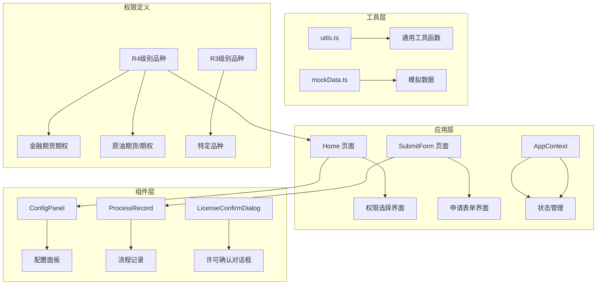
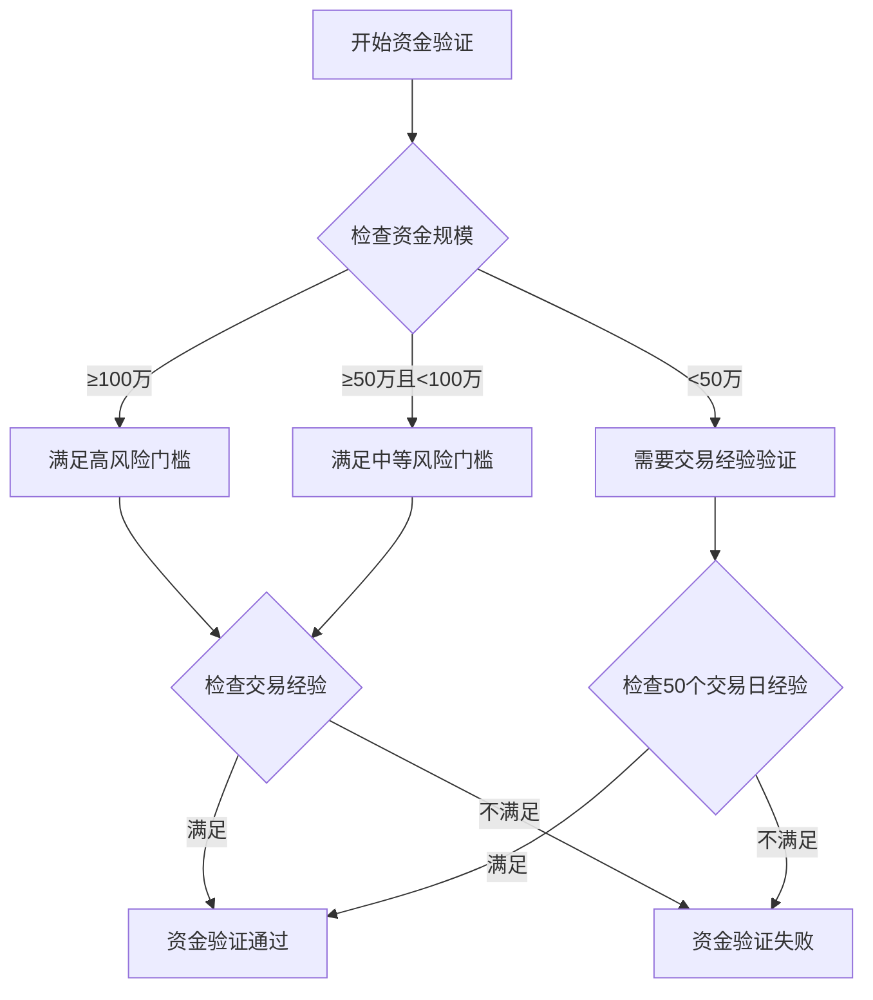
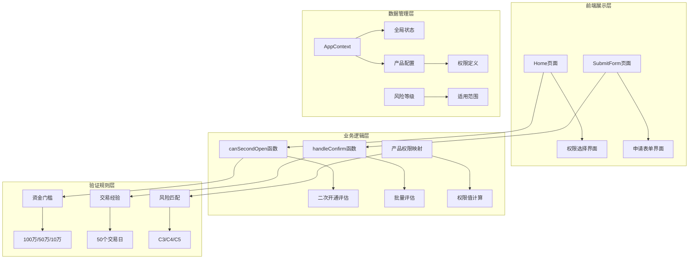
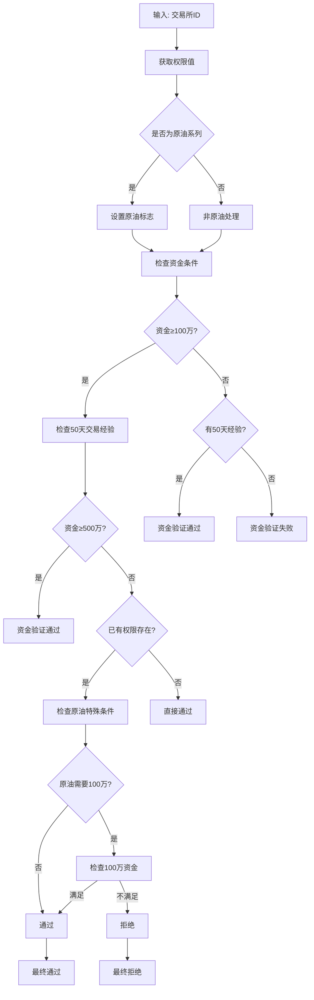
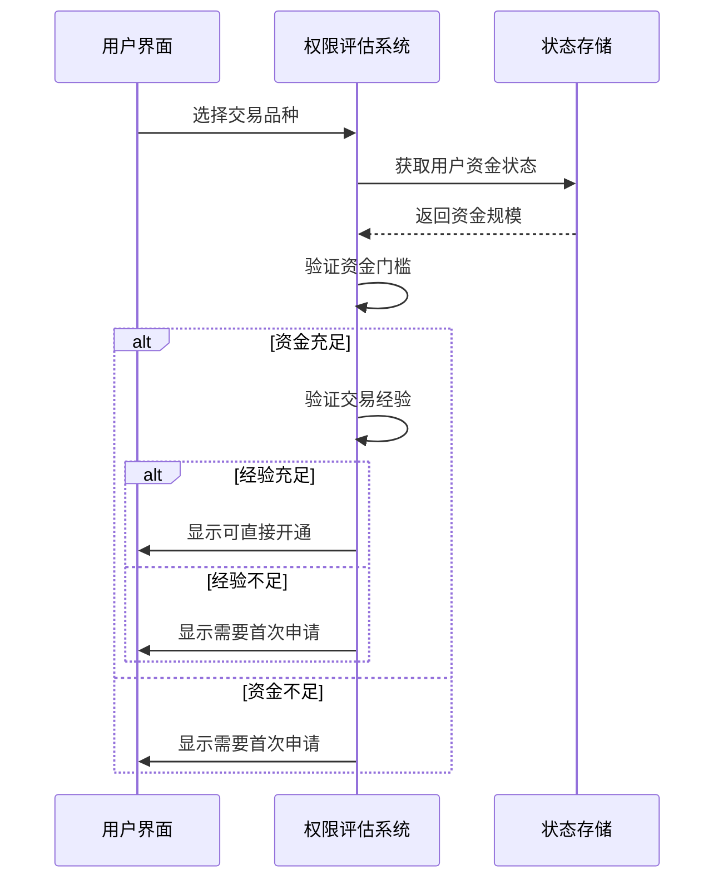
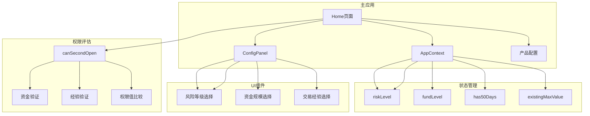
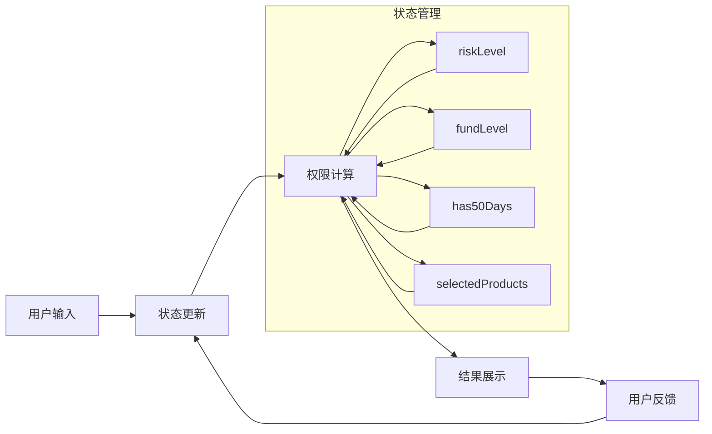

# 权限评估系统

<cite>
**本文档引用的文件**
- [Home.tsx](file://src/app/pages/Home.tsx)
- [SubmitForm.tsx](file://src/app/pages/SubmitForm.tsx)
- [AppContext.tsx](file://src/app/store/AppContext.tsx)
- [ConfigPanel.tsx](file://src/app/components/ConfigPanel.tsx)
- [Home.tsx](file://permission_apply/src/app/pages/Home.tsx)
- [SubmitForm.tsx](file://permission_apply/src/app/pages/SubmitForm.tsx)
- [ConfigPanel.tsx](file://permission_apply/src/app/components/ConfigPanel.tsx)
- [utils.ts](file://src/lib/utils.ts)
- [utils.ts](file://permission_apply/src/lib/utils.ts)
</cite>

## 目录
1. [简介](#简介)
2. [项目结构](#项目结构)
3. [核心组件](#核心组件)
4. [架构概览](#架构概览)
5. [详细组件分析](#详细组件分析)
6. [依赖关系分析](#依赖关系分析)
7. [性能考虑](#性能考虑)
8. [故障排除指南](#故障排除指南)
9. [结论](#结论)

## 简介

权限评估系统是一个基于React的交易权限管理平台，专门用于评估和管理期货交易权限的开通申请。该系统实现了复杂的风险评估算法，包括资金规模验证、持有时间验证、风险等级评估等多个维度的综合评估。

系统主要面向两类用户：
- **普通投资者**：风险等级从C3到C5，需要满足相应的资金门槛和交易经验要求
- **专业投资者**：可直接申请更高风险级别的交易权限

## 项目结构

该项目采用模块化架构设计，主要分为以下几个核心模块：



**图表来源**
- [Home.tsx:17-59](file://src/app/pages/Home.tsx#L17-L59)
- [AppContext.tsx:1-64](file://src/app/store/AppContext.tsx#L1-L64)

**章节来源**
- [Home.tsx:1-800](file://src/app/pages/Home.tsx#L1-L800)
- [AppContext.tsx:1-64](file://src/app/store/AppContext.tsx#L1-L64)

## 核心组件

### 风险等级管理系统

系统支持三种风险等级，每种等级对应不同的权限范围：

| 风险等级 | 描述 | 权限范围 |
|---------|------|----------|
| C3 | 保守型 | 仅能申请R3级别特定品种 |
| C4 | 稳健型 | 可申请R3和R4级别品种 |
| C5 | 积极型 | 可申请所有级别品种 |

### 资金门槛验证

系统实现了多层次的资金验证机制：



**图表来源**
- [Home.tsx:175-198](file://src/app/pages/Home.tsx#L175-L198)

### 权限值评估系统

系统使用数值化的权限值来表示不同交易品种的复杂程度：

| 交易所 | 权限值 | 品种示例 |
|--------|--------|----------|
| 上海国际能源交易中心 | 8 | 原油期货、原油期权 |
| 中国金融期货交易所 | 10 | 金融期货期权 |
| 郑州商品交易所 | 5 | 商品期权、特定品种 |
| 大连商品交易所 | 5 | 商品期权、特定品种 |
| 上海期货交易所 | 5 | 商品期权、特定品种 |
| 广州期货交易所 | 5 | 商品期权 |

**章节来源**
- [Home.tsx:96-105](file://src/app/pages/Home.tsx#L96-L105)

## 架构概览

系统采用分层架构设计，确保了良好的可维护性和扩展性：



**图表来源**
- [Home.tsx:175-232](file://src/app/pages/Home.tsx#L175-L232)
- [AppContext.tsx:6-27](file://src/app/store/AppContext.tsx#L6-L27)

## 详细组件分析

### canSecondOpen 函数深度解析

`canSecondOpen` 函数是权限评估系统的核心算法，负责评估二次开通权限的可行性：

#### 函数签名与参数
```typescript
canSecondOpen(exchangeId: string): boolean
```

#### 核心评估逻辑



**图表来源**
- [Home.tsx:175-198](file://src/app/pages/Home.tsx#L175-L198)

#### 详细评估步骤

1. **权限值获取**：通过 `getProductValue` 获取交易所对应的权限值
2. **原油特殊处理**：识别原油期货和期权的特殊要求
3. **资金门槛检查**：
   - 高风险品种（原油）需要 ≥100万资金
   - 中等风险品种需要 ≥50万资金
   - 低风险品种需要 ≥10万资金
4. **交易经验验证**：检查是否满足50个交易日的交易经验
5. **现有权限评估**：考虑客户已有的权限水平
6. **特殊条件处理**：原油品种的额外要求

#### 边界条件处理

| 条件 | 处理方式 | 结果 |
|------|----------|------|
| 资金不足且无经验 | 拒绝 | 无法开通 |
| 资金充足但无经验 | 需要首次申请 | 转向首次申请流程 |
| 经验充足但资金不足 | 需要首次申请 | 转向首次申请流程 |
| 资金和经验都充足 | 直接通过 | 可二次开通 |

**章节来源**
- [Home.tsx:175-198](file://src/app/pages/Home.tsx#L175-L198)

### 风险等级差异分析

#### C3 风险等级限制
- **权限范围**：仅限R3级别特定品种
- **特殊限制**：禁止申请R4级别品种（如金融期货、原油）
- **申请流程**：必须通过首次申请流程，不能二次开通

#### C4 风险等级特点
- **权限范围**：可申请R3和R4级别品种
- **资金要求**：相对较低的资金门槛
- **经验要求**：适度的交易经验要求

#### C5 风险等级优势
- **权限范围**：可申请所有级别品种
- **资金要求**：最低的资金门槛
- **经验要求**：最少的交易经验要求

### 资金规模验证机制

系统实现了灵活的资金验证机制，支持多种资金门槛：



**图表来源**
- [SubmitForm.tsx:94-113](file://src/app/pages/SubmitForm.tsx#L94-L113)

**章节来源**
- [SubmitForm.tsx:94-113](file://src/app/pages/SubmitForm.tsx#L94-L113)

### 特殊品种开通要求

#### 原油品种特殊要求
- **资金门槛**：原油期货和期权需要 ≥100万资金
- **权限值**：权限值为8，属于高风险品种
- **配套要求**：原油期权必须与原油期货同时开通

#### 金融期货特殊要求
- **资金门槛**：金融期货期权需要 ≥50万资金
- **权限值**：权限值为10，属于最高风险品种
- **经验要求**：需要50个交易日的交易经验

#### 商品期权通用要求
- **资金门槛**：商品期权需要 ≥10万资金
- **权限值**：权限值为5，属于中等风险品种
- **交易所覆盖**：涵盖四大商品交易所

**章节来源**
- [Home.tsx:96-105](file://src/app/pages/Home.tsx#L96-L105)
- [SubmitForm.tsx:13-55](file://src/app/pages/SubmitForm.tsx#L13-L55)

## 依赖关系分析

### 组件间依赖关系



**图表来源**
- [Home.tsx:61-68](file://src/app/pages/Home.tsx#L61-L68)
- [AppContext.tsx:6-27](file://src/app/store/AppContext.tsx#L6-L27)

### 数据流分析

系统采用单向数据流设计，确保了数据的一致性和可预测性：



**图表来源**
- [AppContext.tsx:31-63](file://src/app/store/AppContext.tsx#L31-L63)

**章节来源**
- [AppContext.tsx:1-64](file://src/app/store/AppContext.tsx#L1-L64)

## 性能考虑

### 算法复杂度分析

- **canSecondOpen函数**：时间复杂度O(1)，空间复杂度O(1)
- **批量评估函数**：时间复杂度O(n)，其中n为待评估的交易所数量
- **权限值查找**：时间复杂度O(1)，使用哈希表实现

### 优化策略

1. **缓存机制**：权限值映射表使用静态常量，避免重复计算
2. **早期退出**：在条件不满足时立即返回，减少不必要的计算
3. **批量处理**：对同一产品的多个交易所进行去重处理
4. **状态优化**：使用React.memo优化组件渲染

## 故障排除指南

### 常见问题及解决方案

#### 权限评估失败
**问题描述**：用户选择的权限无法通过评估
**可能原因**：
- 资金门槛未满足
- 交易经验不足
- 风险等级不匹配
- 已有权限限制

**解决方法**：
1. 检查用户的资金状况
2. 验证交易历史记录
3. 确认风险等级设置
4. 评估现有权限水平

#### 原油权限开通受限
**问题描述**：原油期货/期权无法开通
**可能原因**：
- 资金门槛不足（需要≥100万）
- 与原油期货/期权配套要求冲突

**解决方法**：
1. 确保账户资金达到100万以上
2. 同时申请原油期货和原油期权
3. 考虑通过首次申请流程

#### C3风险等级限制
**问题描述**：C3等级用户无法申请R4级别权限
**解决方法**：
1. 建议用户提升风险等级
2. 通过适当性评估重新评测
3. 申请R3级别特定品种

**章节来源**
- [Home.tsx:690-717](file://src/app/pages/Home.tsx#L690-L717)
- [SubmitForm.tsx:236-241](file://src/app/pages/SubmitForm.tsx#L236-L241)

## 结论

权限评估系统通过精心设计的算法和严格的验证机制，为期货交易权限管理提供了可靠的技术支撑。系统的主要优势包括：

1. **多维度评估**：综合考虑资金规模、交易经验、风险等级等多个因素
2. **灵活的权限管理**：支持不同风险等级的差异化权限设置
3. **清晰的用户体验**：直观的界面设计和详细的指导说明
4. **完善的异常处理**：全面的边界条件处理和错误提示机制

该系统为金融机构提供了标准化的权限管理解决方案，有助于提高业务效率和风险管理水平。通过持续的优化和扩展，系统能够适应不断变化的监管要求和业务需求。