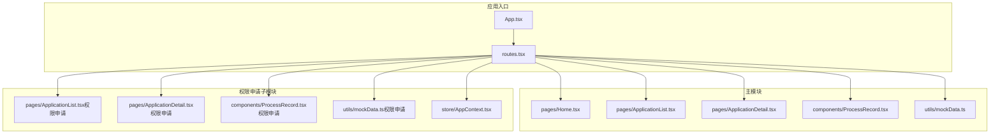
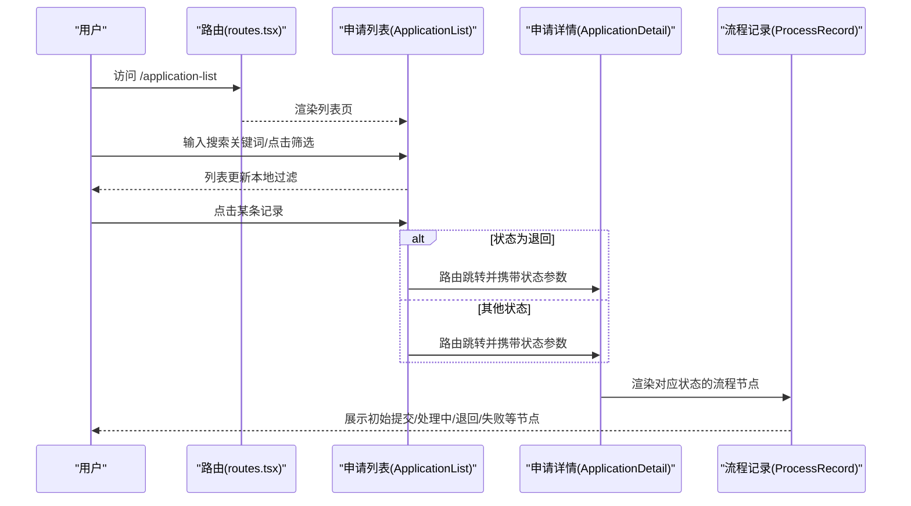
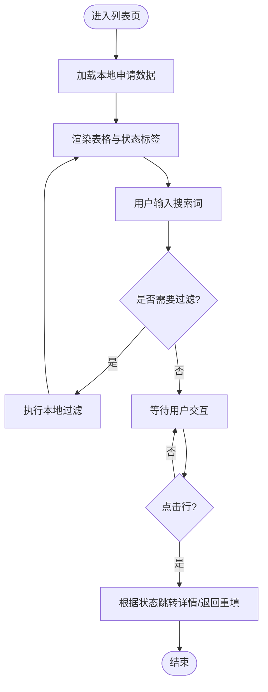
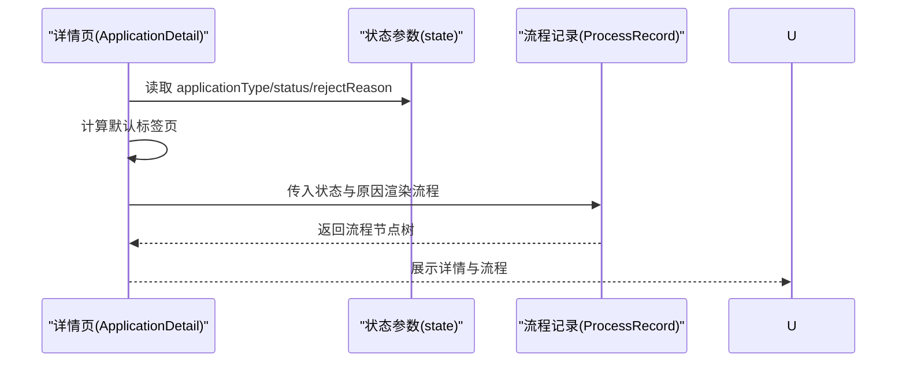
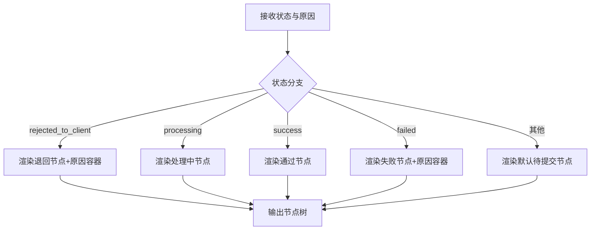
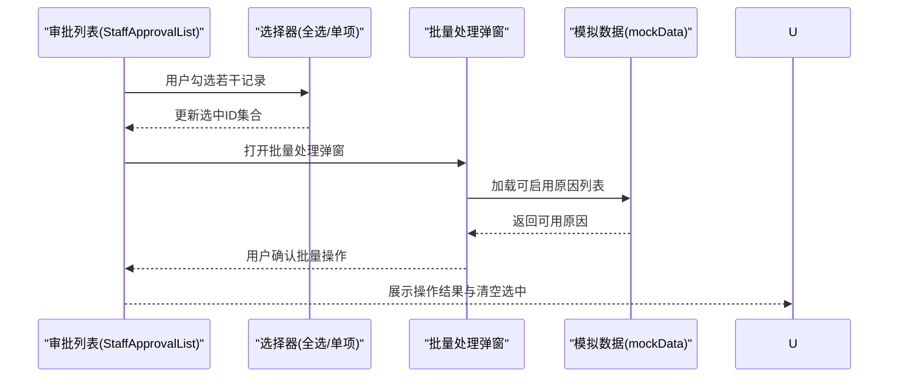
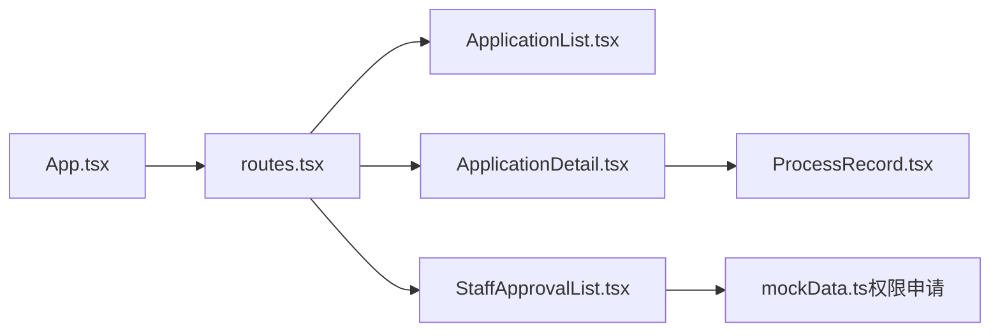

# 申请历史跟踪

<cite>
**本文引用的文件**
- [ApplicationList.tsx](file://src/app/pages/ApplicationList.tsx)
- [ApplicationDetail.tsx](file://src/app/pages/ApplicationDetail.tsx)
- [ProcessRecord.tsx](file://src/app/components/ProcessRecord.tsx)
- [mockData.ts](file://src/app/utils/mockData.ts)
- [routes.tsx](file://src/app/routes.tsx)
- [App.tsx](file://src/app/App.tsx)
- [StaffApprovalList.tsx](file://permission_apply/src/app/pages/StaffApprovalList.tsx)
- [ApplicationList.tsx（权限申请）](file://permission_apply/src/app/pages/ApplicationList.tsx)
- [ApplicationDetail.tsx（权限申请）](file://permission_apply/src/app/pages/ApplicationDetail.tsx)
- [ProcessRecord.tsx（权限申请）](file://permission_apply/src/app/components/ProcessRecord.tsx)
- [mockData.ts（权限申请）](file://permission_apply/src/app/utils/mockData.ts)
- [AppContext.tsx](file://permission_apply/src/app/store/AppContext.tsx)
- [package.json](file://permission_apply/package.json)
- [package.json（仓库模块）](file://package.json)
</cite>

## 目录
1. [简介](#简介)
2. [项目结构](#项目结构)
3. [核心组件](#核心组件)
4. [架构总览](#架构总览)
5. [详细组件分析](#详细组件分析)
6. [依赖关系分析](#依赖关系分析)
7. [性能考虑](#性能考虑)
8. [故障排查指南](#故障排查指南)
9. [结论](#结论)
10. [附录](#附录)

## 简介
本文件面向“申请历史跟踪系统”，围绕申请记录的存储结构、查询过滤机制、状态显示逻辑进行系统化说明；并覆盖申请列表的排序规则、搜索功能、分页加载、批量操作等核心能力。同时，提供申请详情的展示格式、进度跟踪、历史记录对比、状态变更日志等实现细节，并给出数据模型设计与查询性能优化策略。

## 项目结构
本项目采用多页面单页应用（SPA）架构，基于 React Router v7 进行路由管理，页面按功能域划分在 pages 目录，通用 UI 组件位于 components 目录，工具类与上下文状态位于 utils 与 store 目录。权限申请子模块与主模块共享部分组件与工具，但各自维护独立的页面与上下文。

图表来源
- [App.tsx:1-6](file://src/app/App.tsx#L1-L6)
- [routes.tsx:1-38](file://src/app/routes.tsx#L1-L38)
- [ApplicationList.tsx:1-178](file://src/app/pages/ApplicationList.tsx#L1-L178)
- [ApplicationDetail.tsx:1-113](file://src/app/pages/ApplicationDetail.tsx#L1-L113)
- [ProcessRecord.tsx:1-135](file://src/app/components/ProcessRecord.tsx#L1-L135)
- [mockData.ts:1-13](file://src/app/utils/mockData.ts#L1-L13)
- [ApplicationList.tsx（权限申请）:1-178](file://permission_apply/src/app/pages/ApplicationList.tsx#L1-L178)
- [ApplicationDetail.tsx（权限申请）:1-113](file://permission_apply/src/app/pages/ApplicationDetail.tsx#L1-L113)
- [ProcessRecord.tsx（权限申请）:1-56](file://permission_apply/src/app/components/ProcessRecord.tsx#L1-L56)
- [mockData.ts（权限申请）:1-13](file://permission_apply/src/app/utils/mockData.ts#L1-L13)
- [AppContext.tsx:1-64](file://permission_apply/src/app/store/AppContext.tsx#L1-L64)

章节来源
- [routes.tsx:1-38](file://src/app/routes.tsx#L1-L38)
- [App.tsx:1-6](file://src/app/App.tsx#L1-L6)

## 核心组件
- 申请列表页：负责展示申请流水号、类型、品种、提交时间、当前状态及操作入口；支持搜索与筛选；点击行跳转详情或退回重填流程。
- 申请详情页：根据状态渲染流程记录，支持只读/可编辑切换；展示初始提交、处理中、退回给客户、审批失败等节点。
- 流程记录组件：抽象化流程节点展示，支持不同状态下的节点序列与提示信息。
- 模拟数据工具：提供可启用的原因列表，用于批量处理时的快速选择。
- 审批列表页（子模块）：提供工作人员视角的申请列表，支持筛选、批量处理、批量导出与附件下载。
- 应用上下文（子模块）：提供风控等级、资金等级、产品选择等全局状态。

章节来源
- [ApplicationList.tsx:1-178](file://src/app/pages/ApplicationList.tsx#L1-L178)
- [ApplicationDetail.tsx:1-113](file://src/app/pages/ApplicationDetail.tsx#L1-L113)
- [ProcessRecord.tsx:1-135](file://src/app/components/ProcessRecord.tsx#L1-L135)
- [mockData.ts:1-13](file://src/app/utils/mockData.ts#L1-L13)
- [StaffApprovalList.tsx:1-449](file://permission_apply/src/app/pages/StaffApprovalList.tsx#L1-L449)
- [AppContext.tsx:1-64](file://permission_apply/src/app/store/AppContext.tsx#L1-L64)

## 架构总览
系统采用前端路由驱动的 SPA 架构，页面通过路由注册统一管理；申请历史跟踪涉及两类角色：
- 客户视角：查看自身申请历史，关注状态变化与流程节点。
- 工作人员视角：批量审批、导出与附件下载，支持快速选择拒绝/失败原因。

图表来源
- [routes.tsx:12-27](file://src/app/routes.tsx#L12-L27)
- [ApplicationList.tsx:65-71](file://src/app/pages/ApplicationList.tsx#L65-L71)
- [ApplicationDetail.tsx:11-22](file://src/app/pages/ApplicationDetail.tsx#L11-L22)
- [ProcessRecord.tsx:24-96](file://src/app/components/ProcessRecord.tsx#L24-L96)

## 详细组件分析

### 申请列表页（ApplicationList）
- 数据来源：本地静态数组，包含流水号、类型、品种、提交时间、状态文本与状态码等字段。
- 搜索与筛选：提供搜索框与筛选按钮，当前实现为占位符，实际过滤逻辑需结合后端接口扩展。
- 排序规则：当前未实现排序，建议按提交时间降序排列。
- 行点击行为：根据状态判断是否跳转到详情或退回重填流程。
- 状态标签：依据状态码渲染不同颜色与文案，如“办理中”“已退回”“审批失败”。

图表来源
- [ApplicationList.tsx:10-71](file://src/app/pages/ApplicationList.tsx#L10-L71)

章节来源
- [ApplicationList.tsx:1-178](file://src/app/pages/ApplicationList.tsx#L1-L178)

### 申请详情页（ApplicationDetail）
- 参数接收：从路由 state 中读取申请类型、交易所 ID、状态、退回原因与状态文本。
- Tab 切换：根据申请类型自动定位默认标签页。
- 只读/可编辑：当状态为“退回给客户”时允许编辑，否则只读。
- 流程记录：根据状态渲染不同的流程节点，包括初始提交、处理中、退回给客户、审批失败等。

图表来源
- [ApplicationDetail.tsx:8-22](file://src/app/pages/ApplicationDetail.tsx#L8-L22)
- [ProcessRecord.tsx:24-96](file://src/app/components/ProcessRecord.tsx#L24-L96)

章节来源
- [ApplicationDetail.tsx:1-113](file://src/app/pages/ApplicationDetail.tsx#L1-L113)
- [ProcessRecord.tsx:1-135](file://src/app/components/ProcessRecord.tsx#L1-L135)

### 流程记录组件（ProcessRecord）
- 多状态适配：支持“退回给客户”“审批中”“审批通过/失败”“默认待提交”等场景。
- 节点样式：使用时间轴样式展示各阶段，不同状态使用不同颜色与图标。
- 退回原因/失败原因：在相应状态下展示原因容器，提升可读性与可操作性。

图表来源
- [ProcessRecord.tsx:4-135](file://src/app/components/ProcessRecord.tsx#L4-L135)

章节来源
- [ProcessRecord.tsx:1-135](file://src/app/components/ProcessRecord.tsx#L1-L135)

### 批量操作与审批列表（StaffApprovalList）
- 批量选择：支持全选与逐项勾选，提供批量处理、批量导出与附件批量下载。
- 批量处理：弹窗选择“办理成功/驳回/办理失败”，驳回/失败时支持快捷选择原因或手动输入。
- 筛选器：提供流水号、资金账号、姓名、营业部、申请类型、申请日期、处理日期、办理状态、经办人、复核人等维度筛选。
- 分页：当前为占位分页控件，建议接入后端分页接口。

图表来源
- [StaffApprovalList.tsx:9-449](file://permission_apply/src/app/pages/StaffApprovalList.tsx#L9-L449)
- [mockData.ts（权限申请）:1-13](file://permission_apply/src/app/utils/mockData.ts#L1-L13)

章节来源
- [StaffApprovalList.tsx:1-449](file://permission_apply/src/app/pages/StaffApprovalList.tsx#L1-L449)
- [mockData.ts（权限申请）:1-13](file://permission_apply/src/app/utils/mockData.ts#L1-L13)

### 应用上下文（AppContext）
- 提供风控等级、资金等级、是否50天、最大值、特殊公司、客户类型、投资者类型与已选产品等全局状态。
- 便于在多个页面间共享与联动，减少 props 传递成本。

章节来源
- [AppContext.tsx:1-64](file://permission_apply/src/app/store/AppContext.tsx#L1-L64)

## 依赖关系分析
- 路由依赖：App.tsx 通过 RouterProvider 注入路由配置，routes.tsx 定义页面映射。
- 页面依赖：ApplicationList 与 ApplicationDetail 依赖 ProcessRecord 展示流程；StaffApprovalList 依赖 mockData 提供原因选项。
- 组件复用：主模块与权限申请子模块共享部分组件（如 ProcessRecord），但各自维护独立的页面与上下文。

图表来源
- [App.tsx:1-6](file://src/app/App.tsx#L1-L6)
- [routes.tsx:12-27](file://src/app/routes.tsx#L12-L27)
- [ApplicationList.tsx:1-178](file://src/app/pages/ApplicationList.tsx#L1-L178)
- [ApplicationDetail.tsx:1-113](file://src/app/pages/ApplicationDetail.tsx#L1-L113)
- [ProcessRecord.tsx:1-135](file://src/app/components/ProcessRecord.tsx#L1-L135)
- [StaffApprovalList.tsx:1-449](file://permission_apply/src/app/pages/StaffApprovalList.tsx#L1-L449)
- [mockData.ts（权限申请）:1-13](file://permission_apply/src/app/utils/mockData.ts#L1-L13)

章节来源
- [package.json:10-66](file://permission_apply/package.json#L10-L66)
- [package.json（仓库模块）:11-67](file://package.json#L11-L67)

## 性能考虑
- 列表渲染优化
  - 使用虚拟滚动（如 react-window 或 react-virtualized）处理大量记录。
  - 对表格列进行懒渲染，仅渲染可视区域内的行与列。
- 过滤与搜索
  - 将本地过滤改为防抖式远程查询，避免频繁重排。
  - 对常用筛选条件建立索引（如按状态、日期范围）。
- 图标与动画
  - 使用 SVG 图标与轻量动画，避免重型第三方库。
- 缓存策略
  - 对已渲染的流程节点与详情页内容进行内存缓存，减少重复计算。
- 并发请求
  - 批量操作时合并请求，减少网络往返次数。
- 分页加载
  - 后端分页接口返回 total、page、pageSize，前端按需加载下一页。

## 故障排查指南
- 列表空白或无数据
  - 检查本地数据是否正确注入；确认路由是否正确挂载页面。
  - 章节来源
    - [ApplicationList.tsx:10-63](file://src/app/pages/ApplicationList.tsx#L10-L63)
    - [routes.tsx:12-27](file://src/app/routes.tsx#L12-L27)
- 状态标签异常
  - 确认状态码与文案映射一致；检查 ProcessRecord 的状态分支。
  - 章节来源
    - [ApplicationList.tsx:144-163](file://src/app/pages/ApplicationList.tsx#L144-L163)
    - [ProcessRecord.tsx:24-96](file://src/app/components/ProcessRecord.tsx#L24-L96)
- 详情页参数缺失
  - 检查路由 state 是否正确传递；确认默认值设置。
  - 章节来源
    - [ApplicationDetail.tsx:11-22](file://src/app/pages/ApplicationDetail.tsx#L11-L22)
- 批量处理不可用
  - 检查选中项是否为空；确认弹窗触发与禁用条件。
  - 章节来源
    - [StaffApprovalList.tsx:200-215](file://permission_apply/src/app/pages/StaffApprovalList.tsx#L200-L215)
    - [StaffApprovalList.tsx:424-440](file://permission_apply/src/app/pages/StaffApprovalList.tsx#L424-L440)

## 结论
本系统以 React Router 驱动的 SPA 架构为基础，围绕申请历史跟踪提供了完整的列表、详情与流程记录展示能力。当前实现以本地数据为主，后续应重点补齐后端接口对接、远程过滤与分页、批量操作的真正落库逻辑，以及状态变更日志与历史对比功能，以满足生产环境对数据一致性与审计追溯的要求。

## 附录

### 数据模型设计（建议）
- 申请记录实体
  - 字段：id、account、name、branch、type、applyDate、processDate、status、operator、reviewer、mockType、mockExchangeIds[]
  - 索引：按 applyDate、status、account 建立复合索引
- 状态枚举
  - processing、rejected_to_client、failed、success 等
- 原因模板
  - id、content、businessType、isEnabled、createTime

### 查询与过滤规范
- 支持字段：流水号、资金账号、姓名、营业部、申请类型、申请日期、处理日期、办理状态、经办人、复核人
- 默认排序：按申请日期降序
- 分页：page、pageSize、total

### 状态变更日志
- 记录每次状态变更的时间、操作人、变更前/后状态、原因（退回/失败时必填）

### 性能优化清单
- 列表：虚拟滚动、列懒渲染、防抖搜索
- 批量：合并请求、并发限制、进度反馈
- 缓存：详情页与流程节点缓存、本地持久化
- 分页：服务端分页、预取下一页