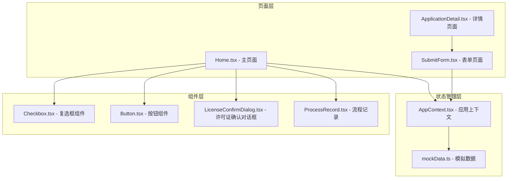
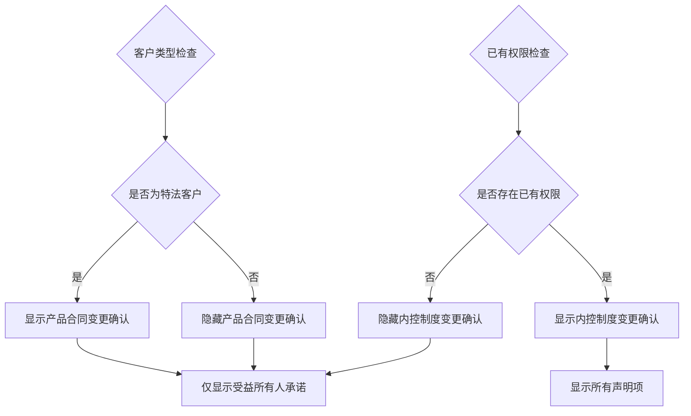
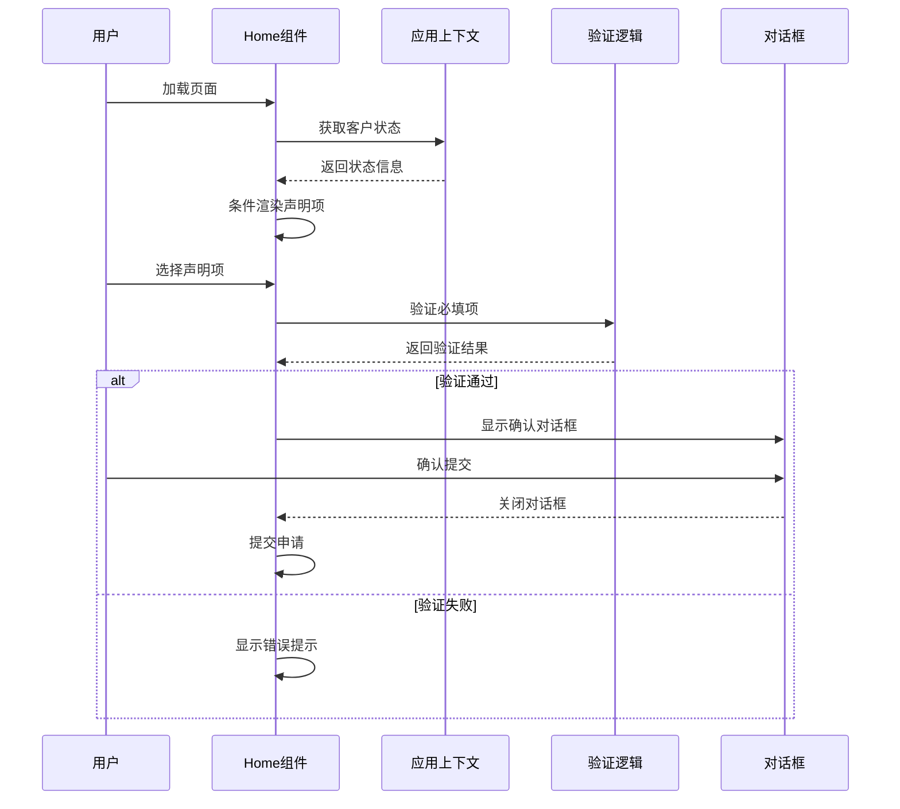
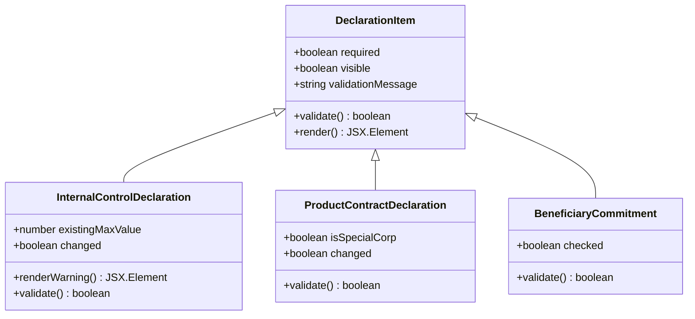
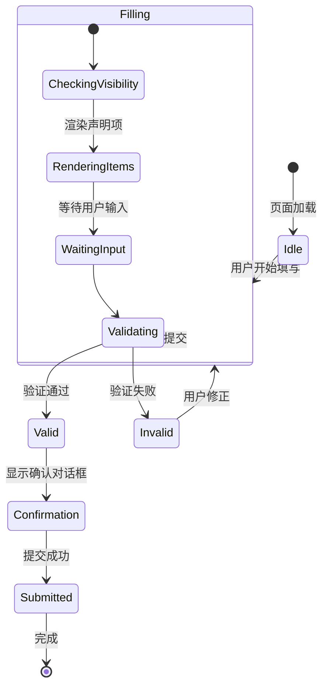
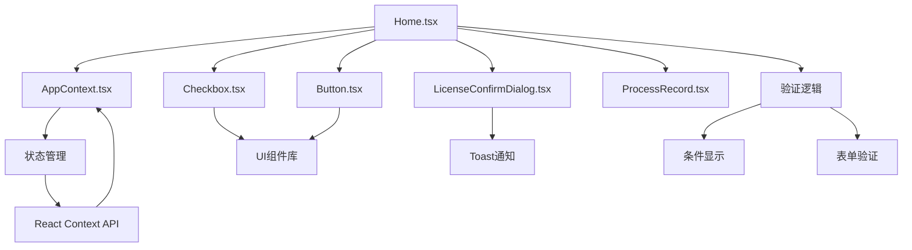

# 业务声明与确认

<cite>
**本文档引用的文件**
- [Home.tsx](file://src/app/pages/Home.tsx)
- [AppContext.tsx](file://src/app/store/AppContext.tsx)
- [Checkbox.tsx](file://src/app/components/ui/Checkbox.tsx)
- [Button.tsx](file://src/app/components/ui/Button.tsx)
- [LicenseConfirmDialog.tsx](file://src/app/components/LicenseConfirmDialog.tsx)
- [ProcessRecord.tsx](file://src/app/components/ProcessRecord.tsx)
- [SubmitForm.tsx](file://src/app/pages/SubmitForm.tsx)
- [ApplicationDetail.tsx](file://src/app/pages/ApplicationDetail.tsx)
- [mockData.ts](file://src/app/utils/mockData.ts)
</cite>

## 目录
1. [简介](#简介)
2. [项目结构](#项目结构)
3. [核心组件](#核心组件)
4. [架构概览](#架构概览)
5. [详细组件分析](#详细组件分析)
6. [依赖关系分析](#依赖关系分析)
7. [性能考虑](#性能考虑)
8. [故障排除指南](#故障排除指南)
9. [结论](#结论)

## 简介

业务声明与确认模块是交易权限申请流程中的关键环节，负责确保客户在申请特殊品种交易权限时完成必要的合规声明和确认。该模块主要包含三个核心声明项：内控制度变更确认、产品合同变更确认、受益所有人承诺声明。

该模块的设计充分考虑了合规要求和用户体验，通过条件显示逻辑确保只有在必要时才展示相关声明项，同时提供了完善的验证机制和用户反馈系统。

## 项目结构

业务声明与确认功能主要分布在以下文件中：

**图表来源**
- [Home.tsx:1-809](file://src/app/pages/Home.tsx#L1-L809)
- [AppContext.tsx:1-64](file://src/app/store/AppContext.tsx#L1-L64)

**章节来源**
- [Home.tsx:485-606](file://src/app/pages/Home.tsx#L485-L606)
- [AppContext.tsx:1-64](file://src/app/store/AppContext.tsx#L1-L64)

## 核心组件

### 声明项设计

业务声明与确认模块包含三个关键声明项：

1. **内控制度变更确认**
   - 仅对已有权限的客户显示
   - 必填项，必须明确选择"否，无变更"
   - 当选择"是，有变更"时，显示橙色警告提示

2. **产品合同变更确认**
   - 仅对特法客户显示
   - 必填项，必须明确选择"否，无变更"

3. **受益所有人承诺声明**
   - 必填项，必须勾选确认
   - 提供蓝色提示信息，提醒客户及时更新信息

### 特殊客户类型处理

系统针对特法客户（isSpecialCorp）实施差异化处理：

**图表来源**
- [Home.tsx:494-568](file://src/app/pages/Home.tsx#L494-L568)

**章节来源**
- [Home.tsx:494-568](file://src/app/pages/Home.tsx#L494-L568)
- [AppContext.tsx:16-19](file://src/app/store/AppContext.tsx#L16-L19)

## 架构概览

业务声明与确认模块采用React函数组件架构，结合状态管理和条件渲染实现：

**图表来源**
- [Home.tsx:674-698](file://src/app/pages/Home.tsx#L674-L698)
- [LicenseConfirmDialog.tsx:14-109](file://src/app/components/LicenseConfirmDialog.tsx#L14-L109)

## 详细组件分析

### 声明项验证机制

每个声明项都实现了严格的验证逻辑：

**图表来源**
- [Home.tsx:85-88](file://src/app/pages/Home.tsx#L85-L88)
- [Home.tsx:494-591](file://src/app/pages/Home.tsx#L494-L591)

### 条件显示逻辑实现

条件显示逻辑基于多个状态变量：

| 状态变量 | 条件 | 显示逻辑 |
|---------|------|----------|
| existingMaxValue | > 0 | 显示内控制度变更确认 |
| isSpecialCorp | true | 显示产品合同变更确认 |
| beneficiaryChecked | true | 视为已确认受益所有人信息 |

### 用户交互反馈机制

系统提供了多层次的用户反馈：

**图表来源**
- [Home.tsx:674-698](file://src/app/pages/Home.tsx#L674-L698)

**章节来源**
- [Home.tsx:85-88](file://src/app/pages/Home.tsx#L85-L88)
- [Home.tsx:494-591](file://src/app/pages/Home.tsx#L494-L591)

### 特殊客户类型差异化处理

特法客户（isSpecialCorp）的差异化处理体现在：

1. **显示逻辑差异**
   - 仅显示产品合同变更确认
   - 不显示内控制度变更确认（即使有已有权限）

2. **业务意义**
   - 特法客户通常具有特殊的监管要求
   - 产品合同变更对其业务影响更大
   - 内控制度变更相对次要

3. **合规要求**
   - 特法客户的产品合同变更需要更严格的审查
   - 确保客户了解并同意相关变更

**章节来源**
- [Home.tsx](file://src/app/pages/Home.tsx#L299)
- [Home.tsx](file://src/app/pages/Home.tsx#L311)
- [Home.tsx:538-568](file://src/app/pages/Home.tsx#L538-L568)

## 依赖关系分析

业务声明与确认模块的依赖关系如下：

**图表来源**
- [Home.tsx:1-16](file://src/app/pages/Home.tsx#L1-L16)
- [AppContext.tsx:1-64](file://src/app/store/AppContext.tsx#L1-L64)

**章节来源**
- [Home.tsx:1-16](file://src/app/pages/Home.tsx#L1-L16)
- [AppContext.tsx:1-64](file://src/app/store/AppContext.tsx#L1-L64)

## 性能考虑

1. **条件渲染优化**
   - 使用条件判断避免不必要的DOM渲染
   - 特法客户专用的渲染路径减少计算开销

2. **状态管理效率**
   - 合理的状态拆分避免不必要的重渲染
   - 使用useMemo/useCallback优化复杂计算

3. **用户体验优化**
   - 即时验证反馈减少用户困惑
   - 条件显示逻辑提升页面加载速度

## 故障排除指南

### 常见问题及解决方案

1. **声明项未正确显示**
   - 检查existingMaxValue和isSpecialCorp状态值
   - 确认AppContext中的状态设置

2. **验证逻辑异常**
   - 检查useState初始化值
   - 验证条件渲染逻辑的边界情况

3. **用户反馈不准确**
   - 检查toast通知配置
   - 验证对话框组件的props传递

**章节来源**
- [Home.tsx:674-698](file://src/app/pages/Home.tsx#L674-L698)
- [LicenseConfirmDialog.tsx:14-109](file://src/app/components/LicenseConfirmDialog.tsx#L14-L109)

## 结论

业务声明与确认模块通过精心设计的条件显示逻辑、严格的验证机制和完善的用户反馈系统，有效确保了交易权限申请流程的合规性和用户体验。模块的核心优势包括：

1. **智能条件显示**：根据客户状态动态调整显示内容
2. **严格验证机制**：确保所有必填项得到正确填写
3. **差异化处理**：针对不同客户类型提供定制化体验
4. **完善反馈系统**：提供即时的用户交互反馈

该模块为整个交易权限申请流程奠定了坚实的合规基础，同时保持了良好的用户体验。