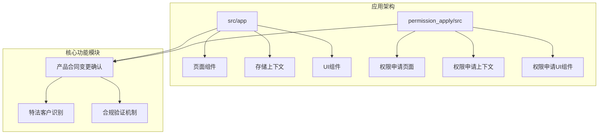
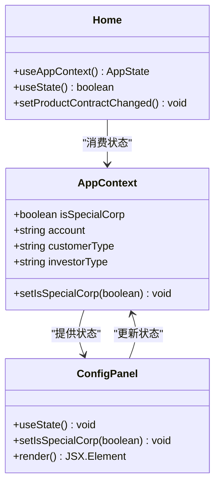
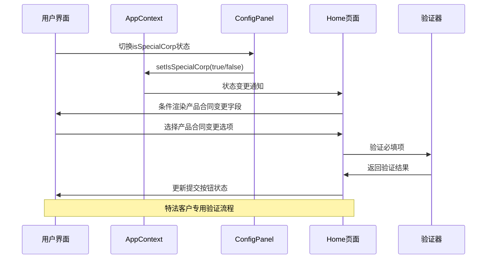
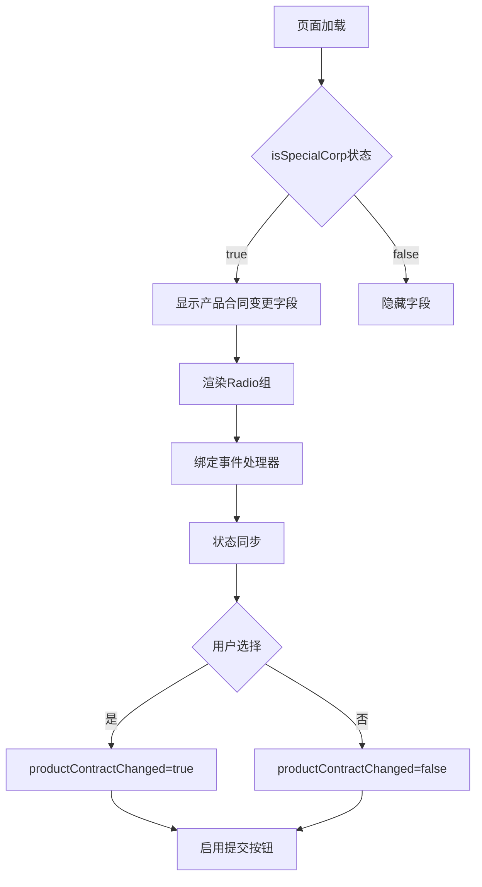
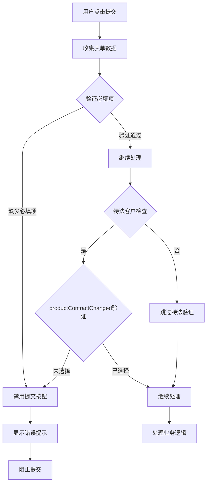
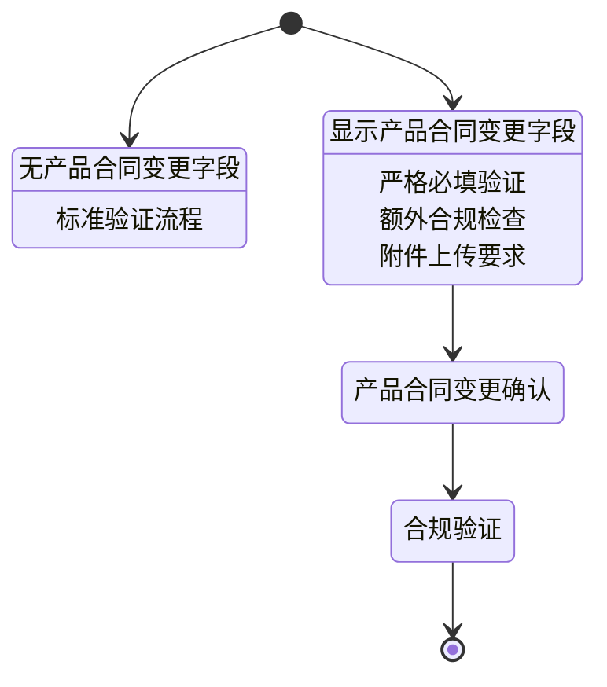
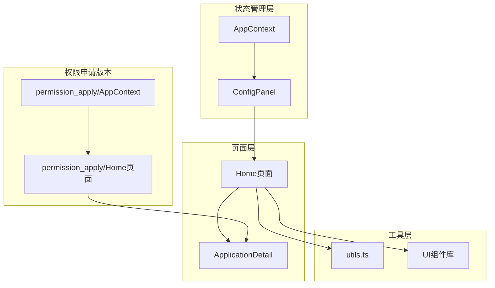

# 产品合同变更确认

<cite>
**本文档引用的文件**
- [Home.tsx](file://src/app/pages/Home.tsx)
- [Home.tsx](file://permission_apply/src/app/pages/Home.tsx)
- [AppContext.tsx](file://src/app/store/AppContext.tsx)
- [AppContext.tsx](file://permission_apply/src/app/store/AppContext.tsx)
- [ConfigPanel.tsx](file://src/app/components/ConfigPanel.tsx)
- [ConfigPanel.tsx](file://permission_apply/src/app/components/ConfigPanel.tsx)
- [ApplicationDetail.tsx](file://src/app/pages/ApplicationDetail.tsx)
- [ApplicationDetail.tsx](file://permission_apply/src/app/pages/ApplicationDetail.tsx)
- [utils.ts](file://src/lib/utils.ts)
- [utils.ts](file://permission_apply/src/lib/utils.ts)
</cite>

## 目录
1. [简介](#简介)
2. [项目结构](#项目结构)
3. [核心组件](#核心组件)
4. [架构概览](#架构概览)
5. [详细组件分析](#详细组件分析)
6. [依赖关系分析](#依赖关系分析)
7. [性能考虑](#性能考虑)
8. [故障排除指南](#故障排除指南)
9. [结论](#结论)

## 简介

产品合同变更确认功能是特法客户交易权限申请流程中的关键合规控制点。该功能针对特法客户（特殊法人客户）实施严格的产品合同变更管理机制，确保客户在申请交易权限时对产品合同变更情况进行准确声明和确认。

特法客户是指具有特殊法律地位和监管要求的法人实体，在交易权限申请过程中需要额外的合规审查和风险控制措施。该功能通过条件显示逻辑、必填项验证和用户交互反馈机制，构建了完整的变更确认体系。

## 项目结构

系统采用双环境架构设计，包含标准版本和权限申请版本两个独立的应用实例：

**图表来源**
- [Home.tsx:61-809](file://src/app/pages/Home.tsx#L61-L809)
- [Home.tsx:61-820](file://permission_apply/src/app/pages/Home.tsx#L61-L820)

**章节来源**
- [Home.tsx:1-809](file://src/app/pages/Home.tsx#L1-L809)
- [Home.tsx:1-820](file://permission_apply/src/app/pages/Home.tsx#L1-L820)

## 核心组件

### 特法客户识别机制

系统通过`isSpecialCorp`状态变量识别特法客户身份，该状态在应用上下文中统一管理：

**图表来源**
- [AppContext.tsx:18-19](file://src/app/store/AppContext.tsx#L18-L19)
- [ConfigPanel.tsx:13-16](file://src/app/components/ConfigPanel.tsx#L13-L16)
- [Home.tsx:64-86](file://src/app/pages/Home.tsx#L64-L86)

### 产品合同变更确认表单

特法客户的变更确认采用严格的必填验证机制：

| 字段名称 | 必填条件 | 验证规则 | 用户反馈 |
|---------|---------|---------|---------|
| 产品合同变更 | isSpecialCorp为true时 | 必须选择"是"或"否" | 红色星号标记，禁用提交按钮 |
| 受益人承诺 | 始终必填 | 复选框必须勾选 | 绿色确认图标 |
| 内控制度变更 | existingMaxValue>0时 | 可选，但变更时需上传文档 | 变更时显示橙色提示 |

**章节来源**
- [Home.tsx:538-568](file://src/app/pages/Home.tsx#L538-L568)
- [Home.tsx:539-568](file://permission_apply/src/app/pages/Home.tsx#L539-L568)

## 架构概览

系统采用React Hooks和Context API构建响应式状态管理架构：

**图表来源**
- [AppContext.tsx:36-36](file://src/app/store/AppContext.tsx#L36-L36)
- [ConfigPanel.tsx:63-67](file://src/app/components/ConfigPanel.tsx#L63-L67)
- [Home.tsx:677-682](file://src/app/pages/Home.tsx#L677-L682)

## 详细组件分析

### 条件显示逻辑实现

产品合同变更字段仅在特法客户场景下显示，通过条件渲染实现：

**图表来源**
- [Home.tsx:538-568](file://src/app/pages/Home.tsx#L538-L568)
- [Home.tsx:539-568](file://permission_apply/src/app/pages/Home.tsx#L539-L568)

### 必填项验证机制

系统实现了多层次的验证机制确保数据完整性：

**图表来源**
- [Home.tsx:677-682](file://src/app/pages/Home.tsx#L677-L682)
- [Home.tsx:687-694](file://permission_apply/src/app/pages/Home.tsx#L687-L694)

### 用户交互反馈机制

系统提供了丰富的用户反馈机制：

| 交互类型 | 视觉反馈 | 文字提示 | 声音/动画 |
|---------|---------|---------|---------|
| 字段激活 | 蓝色边框高亮 | 悬停效果 | 无 |
| 选择变更 | 绿色勾选图标 | 成功提示 | 无 |
| 错误状态 | 红色边框警告 | 错误信息 | 无 |
| 加载状态 | 旋转指示器 | 等待提示 | 无 |
| 完成状态 | 绿色完成图标 | 成功消息 | 无 |

**章节来源**
- [Home.tsx:525-533](file://src/app/pages/Home.tsx#L525-L533)
- [Home.tsx:526-534](file://permission_apply/src/app/pages/Home.tsx#L526-L534)

### 特法客户特殊处理逻辑

特法客户享有特殊的处理流程和更高的合规要求：

**图表来源**
- [Home.tsx:298-298](file://src/app/pages/Home.tsx#L298-L298)
- [Home.tsx:299-299](file://permission_apply/src/app/pages/Home.tsx#L299-L299)

## 依赖关系分析

系统各组件间存在清晰的依赖关系：

**图表来源**
- [AppContext.tsx:42-56](file://src/app/store/AppContext.tsx#L42-L56)
- [ConfigPanel.tsx:18-26](file://src/app/components/ConfigPanel.tsx#L18-L26)
- [Home.tsx:61-64](file://src/app/pages/Home.tsx#L61-L64)

**章节来源**
- [AppContext.tsx:1-64](file://src/app/store/AppContext.tsx#L1-L64)
- [ConfigPanel.tsx:1-134](file://src/app/components/ConfigPanel.tsx#L1-L134)

## 性能考虑

系统在性能优化方面采用了多项策略：

1. **状态最小化**: 仅在必要时重新渲染相关组件
2. **事件委托**: 使用受控组件减少事件监听器数量
3. **条件渲染**: 避免不必要的DOM元素创建
4. **内存管理**: 合理清理文件上传状态和临时数据

## 故障排除指南

### 常见问题及解决方案

| 问题描述 | 可能原因 | 解决方案 |
|---------|---------|---------|
| 产品合同变更字段不显示 | isSpecialCorp状态为false | 在配置面板中切换为特法客户 |
| 提交按钮始终禁用 | 缺少必填项验证 | 检查受益人承诺和产品合同变更选择 |
| 页面刷新后状态丢失 | 应用上下文未正确初始化 | 确认AppProvider包装组件树 |
| 文件上传失败 | 文件格式不支持 | 支持JPG、PNG、PDF格式，单个文件≤10MB |

**章节来源**
- [Home.tsx:617-667](file://src/app/pages/Home.tsx#L617-L667)
- [Home.tsx:618-668](file://permission_apply/src/app/pages/Home.tsx#L618-L668)

## 结论

产品合同变更确认功能通过精心设计的条件显示逻辑、严格的必填项验证和完善的用户交互反馈机制，为特法客户提供了合规、安全、高效的交易权限申请体验。该功能不仅满足了监管要求，还提升了用户体验和业务效率。

系统的双环境架构设计确保了功能的可维护性和扩展性，为未来的功能增强和业务发展奠定了坚实基础。通过持续优化和改进，该功能将继续为特法客户的交易权限管理提供强有力的支持。