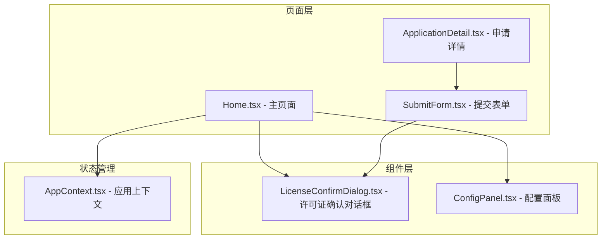
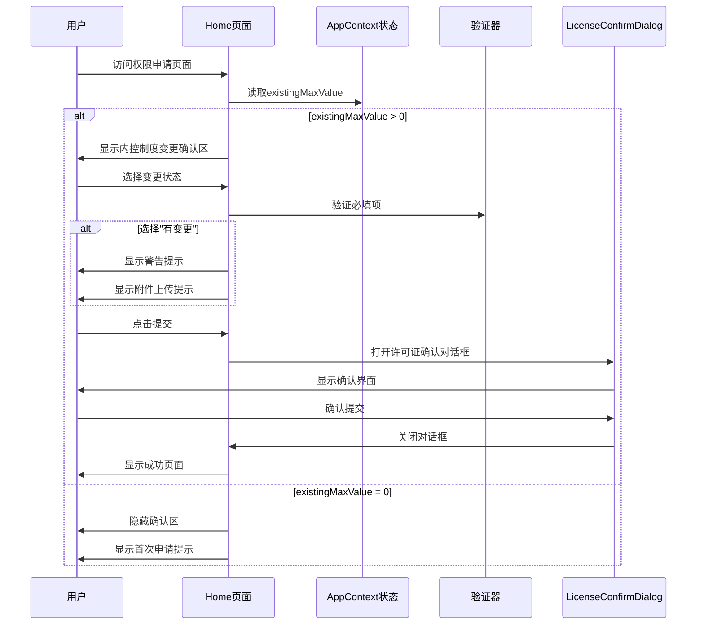
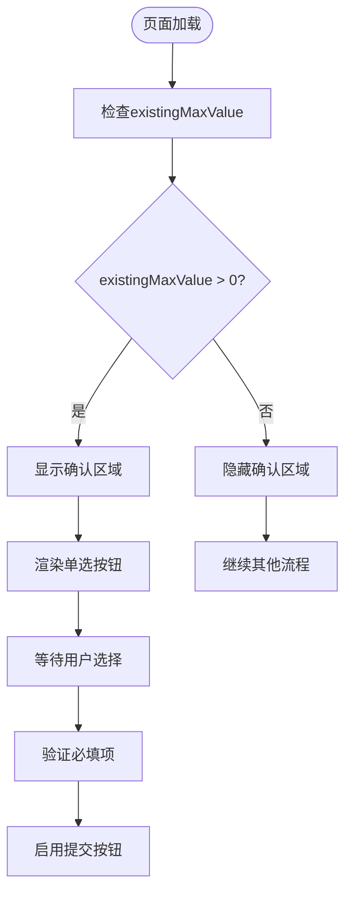
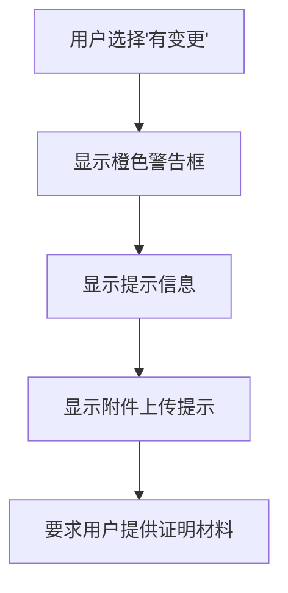
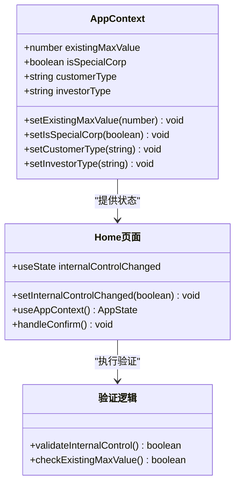
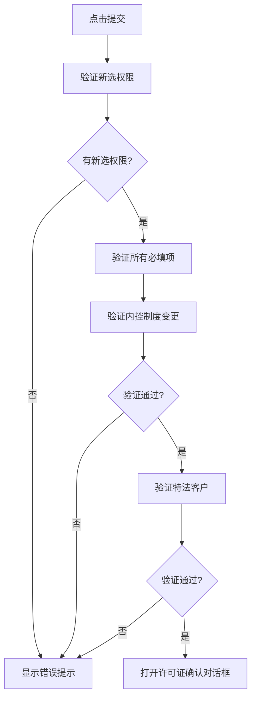
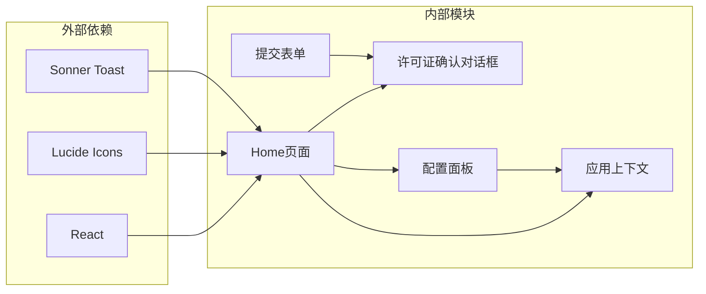

# 内控制度变更确认

<cite>
**本文档引用的文件**
- [Home.tsx](file://src/app/pages/Home.tsx)
- [AppContext.tsx](file://src/app/store/AppContext.tsx)
- [ConfigPanel.tsx](file://src/app/components/ConfigPanel.tsx)
- [ApplicationDetail.tsx](file://src/app/pages/ApplicationDetail.tsx)
- [SubmitForm.tsx](file://src/app/pages/SubmitForm.tsx)
- [LicenseConfirmDialog.tsx](file://src/app/components/LicenseConfirmDialog.tsx)
</cite>

## 目录
1. [简介](#简介)
2. [项目结构](#项目结构)
3. [核心组件](#核心组件)
4. [架构概览](#架构概览)
5. [详细组件分析](#详细组件分析)
6. [依赖关系分析](#依赖关系分析)
7. [性能考虑](#性能考虑)
8. [故障排除指南](#故障排除指南)
9. [结论](#结论)

## 简介

内控制度变更确认功能是交易权限申请流程中的重要合规控制点。该功能确保已有权限客户的内控制度变更得到适当关注和处理，通过条件显示逻辑、必填项验证和用户交互反馈机制，保障业务合规性和风险管理。

## 项目结构

该功能主要分布在以下文件中：

**图表来源**
- [Home.tsx:1-809](file://src/app/pages/Home.tsx#L1-L809)
- [AppContext.tsx:1-64](file://src/app/store/AppContext.tsx#L1-L64)
- [ConfigPanel.tsx:1-133](file://src/app/components/ConfigPanel.tsx#L1-L133)

## 核心组件

### 条件显示逻辑

内控制度变更确认区域采用条件渲染机制，仅在满足特定条件时显示：

- **显示条件**: `existingMaxValue > 0`
- **隐藏条件**: 当客户没有已开通权限时（existingMaxValue = 0）

### 必填项验证机制

系统对内控制度变更状态进行严格验证：

- **验证字段**: `internalControlChanged`
- **验证规则**: 必须明确选择"是"或"否"
- **默认状态**: `null`（未选择）
- **禁用条件**: 当未选择任何新权限时，提交按钮被禁用

### 用户交互反馈

系统提供多层次的用户反馈机制：

- **视觉反馈**: 红色星号标记必填项
- **状态提示**: 当选择"有变更"时显示橙色警告框
- **操作引导**: 提供清晰的操作说明和提示信息

**章节来源**
- [Home.tsx:494-535](file://src/app/pages/Home.tsx#L494-L535)
- [Home.tsx:677-682](file://src/app/pages/Home.tsx#L677-L682)

## 架构概览

**图表来源**
- [Home.tsx:494-535](file://src/app/pages/Home.tsx#L494-L535)
- [Home.tsx:677-682](file://src/app/pages/Home.tsx#L677-L682)
- [LicenseConfirmDialog.tsx:14-109](file://src/app/components/LicenseConfirmDialog.tsx#L14-L109)

## 详细组件分析

### 内控制度变更确认区域

#### 条件显示实现

**图表来源**
- [Home.tsx:494-524](file://src/app/pages/Home.tsx#L494-L524)

#### 单选按钮组件

系统使用标准HTML单选按钮实现状态选择：

- **选项1**: "否，无变更" - 对应 `internalControlChanged = false`
- **选项2**: "是，有变更" - 对应 `internalControlChanged = true`
- **样式**: 使用蓝色主题设计，提供良好的用户体验

#### 动态提示信息

当用户选择"有变更"时，系统显示相应的提示信息：

**图表来源**
- [Home.tsx:525-533](file://src/app/pages/Home.tsx#L525-L533)

**章节来源**
- [Home.tsx:494-535](file://src/app/pages/Home.tsx#L494-L535)

### 状态管理机制

#### AppContext集成

内控制度变更状态通过全局状态管理：

**图表来源**
- [AppContext.tsx:6-27](file://src/app/store/AppContext.tsx#L6-L27)
- [Home.tsx:84-86](file://src/app/pages/Home.tsx#L84-L86)

#### 配置面板集成

管理员可通过配置面板设置existingMaxValue：

| 选项 | 数值 | 说明 |
|------|------|------|
| 0 (无) | 0 | 首次申请客户 |
| 5 (商品类) | 5 | 商品期权权限 |
| 8 (原油) | 8 | 原油期货/期权权限 |
| 10 (中金所) | 10 | 金融期货期权权限 |

**章节来源**
- [ConfigPanel.tsx:116-128](file://src/app/components/ConfigPanel.tsx#L116-L128)

### 提交流程控制

#### 表单验证逻辑

**图表来源**
- [Home.tsx:677-682](file://src/app/pages/Home.tsx#L677-L682)

**章节来源**
- [Home.tsx:677-682](file://src/app/pages/Home.tsx#L677-L682)

## 依赖关系分析

**图表来源**
- [Home.tsx:1-16](file://src/app/pages/Home.tsx#L1-L16)
- [AppContext.tsx:1-64](file://src/app/store/AppContext.tsx#L1-L64)

### 组件耦合度

- **低耦合**: 各组件职责明确，通过AppContext进行状态共享
- **高内聚**: 相关功能集中在Home页面中实现
- **可扩展性**: 新增验证规则时只需修改验证逻辑

**章节来源**
- [AppContext.tsx:42-56](file://src/app/store/AppContext.tsx#L42-L56)

## 性能考虑

### 渲染优化

- **条件渲染**: 仅在需要时渲染确认区域，减少DOM节点数量
- **状态缓存**: 使用useState避免不必要的重渲染
- **事件处理**: 合理的事件绑定策略

### 内存管理

- **清理机制**: 组件卸载时自动清理事件监听器
- **状态重置**: 页面切换时重置相关状态

## 故障排除指南

### 常见问题及解决方案

| 问题类型 | 症状 | 解决方案 |
|----------|------|----------|
| 确认区域不显示 | existingMaxValue = 0 | 检查配置面板设置 |
| 提交按钮禁用 | 未选择内控制度变更 | 确保选择"是"或"否" |
| 警告信息不显示 | 选择"有变更"但无提示 | 检查existingMaxValue值 |
| 状态不同步 | 页面刷新后状态丢失 | 检查AppContext状态管理 |

### 调试建议

1. **开发者工具**: 使用React DevTools检查组件状态
2. **控制台日志**: 添加必要的console.log语句
3. **状态检查**: 验证AppContext中的existingMaxValue值

**章节来源**
- [Home.tsx:494-535](file://src/app/pages/Home.tsx#L494-L535)

## 结论

内控制度变更确认功能通过精心设计的条件显示逻辑、严格的必填项验证和友好的用户交互反馈，有效保障了交易权限申请流程的合规性。该功能不仅满足监管要求，还提升了用户体验，为后续的业务处理奠定了良好基础。

系统的设计体现了以下优势：
- **合规性**: 严格遵循监管要求
- **易用性**: 清晰的用户界面和操作指导
- **可维护性**: 模块化的设计便于后续扩展
- **可靠性**: 完善的错误处理和状态管理