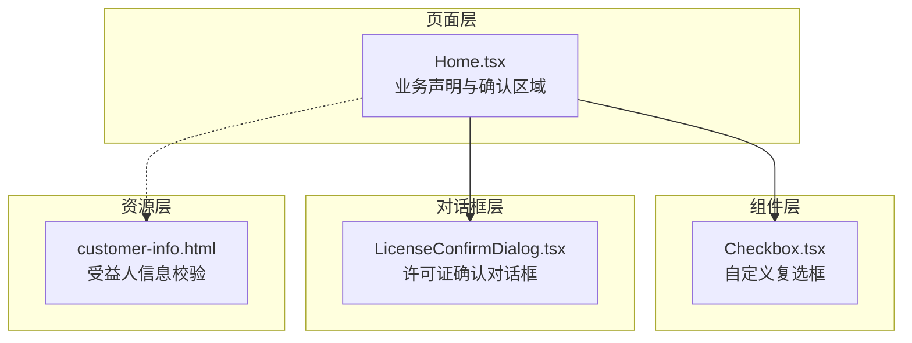
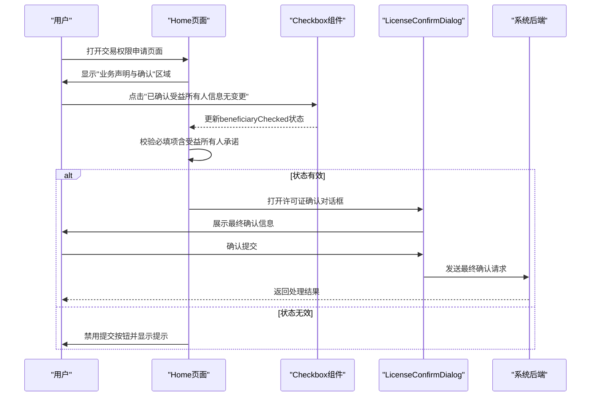
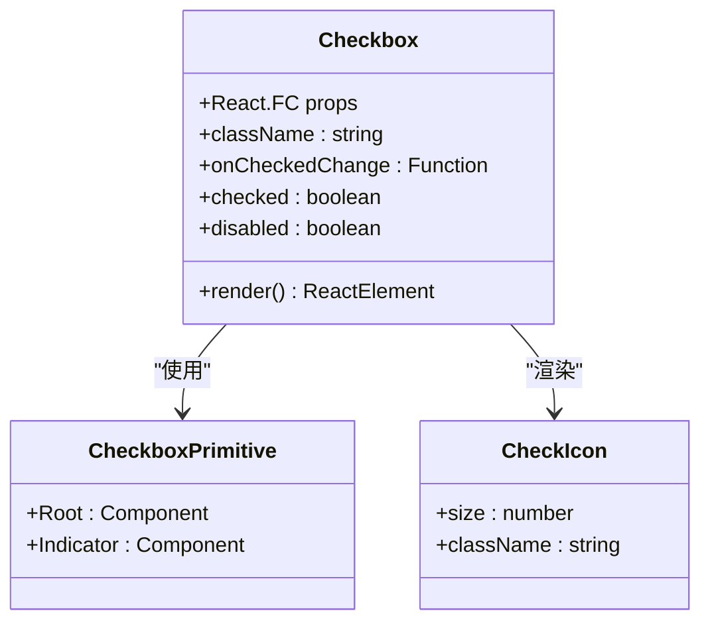
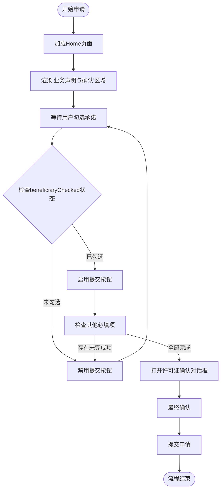
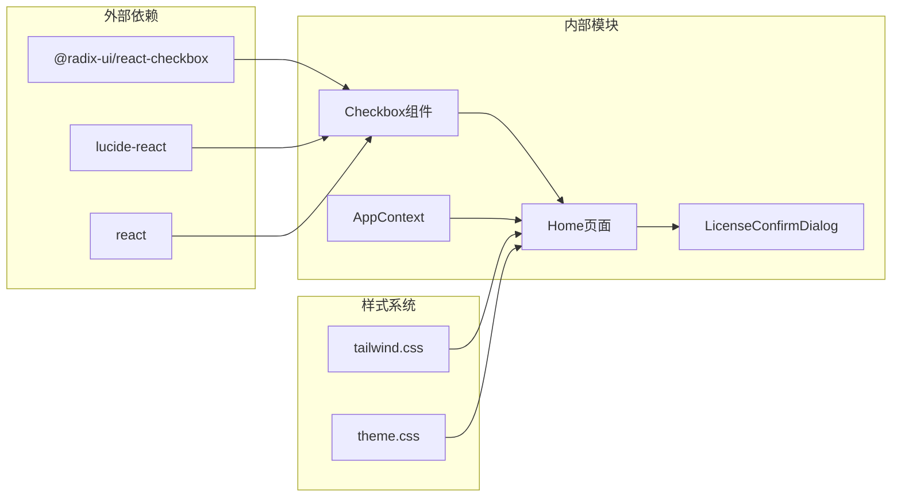

# 受益所有人承诺确认

<cite>
**本文引用的文件**
- [Home.tsx（主应用）](file://src/app/pages/Home.tsx)
- [Home.tsx（权限申请应用）](file://permission_apply/src/app/pages/Home.tsx)
- [checkbox.tsx（复选框组件）](file://src/app/components/ui/checkbox.tsx)
- [checkbox.tsx（权限申请应用复选框组件）](file://permission_apply/src/app/components/ui/checkbox.tsx)
- [customer-info.html（客户信息页面）](file://src/imports/customer-info.html)
- [customer-info.html（权限申请应用客户信息页面）](file://permission_apply/src/imports/customer-info.html)
- [LicenseConfirmDialog.tsx（许可证确认对话框）](file://src/app/components/LicenseConfirmDialog.tsx)
- [LicenseConfirmDialog.tsx（权限申请应用许可证确认对话框）](file://permission_apply/src/app/components/LicenseConfirmDialog.tsx)
</cite>

## 目录
1. [简介](#简介)
2. [项目结构](#项目结构)
3. [核心组件](#核心组件)
4. [架构总览](#架构总览)
5. [详细组件分析](#详细组件分析)
6. [依赖关系分析](#依赖关系分析)
7. [性能考虑](#性能考虑)
8. [故障排除指南](#故障排除指南)
9. [结论](#结论)

## 简介
受益所有人承诺确认是交易权限申请流程中的关键合规环节，用于确保客户声明其受益所有人信息未发生变更，并承担相应的法律责任。该功能在两个子系统中均有体现：
- 主应用（src）：面向常规交易权限申请场景
- 权限申请应用（permission_apply）：面向特定权限开通场景

该功能通过必填项验证（beneficiaryChecked状态）、用户交互反馈机制、以及与许可证确认流程的集成，构建了完整的合规闭环。

## 项目结构
受益所有人承诺确认功能主要分布在以下位置：
- 页面层：Home.tsx 中的“业务声明与确认”区域
- 组件层：自定义 Checkbox 组件封装 Radix UI
- 对话框层：许可证确认对话框作为提交前的最后一道关卡
- 资源层：客户信息页面展示受益人信息校验状态

**图表来源**
- [Home.tsx（主应用）:570-592](file://src/app/pages/Home.tsx#L570-L592)
- [Home.tsx（权限申请应用）:571-592](file://permission_apply/src/app/pages/Home.tsx#L571-L592)
- [checkbox.tsx（主应用）:9-32](file://src/app/components/ui/checkbox.tsx#L9-L32)
- [checkbox.tsx（权限申请应用）:9-32](file://permission_apply/src/app/components/ui/checkbox.tsx#L9-L32)
- [LicenseConfirmDialog.tsx（主应用）](file://src/app/components/LicenseConfirmDialog.tsx)
- [LicenseConfirmDialog.tsx（权限申请应用）](file://permission_apply/src/app/components/LicenseConfirmDialog.tsx)

**章节来源**
- [Home.tsx（主应用）:570-592](file://src/app/pages/Home.tsx#L570-L592)
- [Home.tsx（权限申请应用）:571-592](file://permission_apply/src/app/pages/Home.tsx#L571-L592)

## 核心组件
受益所有人承诺确认功能的核心由以下组件构成：

### 复选框组件（Checkbox）
- 基于 Radix UI 的可访问性设计
- 支持受控状态管理
- 提供视觉反馈和键盘导航
- 与表单验证逻辑深度集成

### 业务声明与确认区域
- 必填项标记（红色星号）
- 温馨提示信息（蓝色背景）
- 禁用态下的提交按钮
- 与上下文状态联动

### 许可证确认对话框
- 提交前的最终确认
- 展示业务合规要求
- 作为流程的关键节点

**章节来源**
- [checkbox.tsx（主应用）:9-32](file://src/app/components/ui/checkbox.tsx#L9-L32)
- [checkbox.tsx（权限申请应用）:9-32](file://permission_apply/src/app/components/ui/checkbox.tsx#L9-L32)
- [Home.tsx（主应用）:570-592](file://src/app/pages/Home.tsx#L570-L592)
- [Home.tsx（权限申请应用）:571-592](file://permission_apply/src/app/pages/Home.tsx#L571-L592)
- [LicenseConfirmDialog.tsx（主应用）](file://src/app/components/LicenseConfirmDialog.tsx)
- [LicenseConfirmDialog.tsx（权限申请应用）](file://permission_apply/src/app/components/LicenseConfirmDialog.tsx)

## 架构总览
受益所有人承诺确认在整个申请流程中的位置如下：

**图表来源**
- [Home.tsx（主应用）:673-687](file://src/app/pages/Home.tsx#L673-L687)
- [Home.tsx（权限申请应用）:684-694](file://permission_apply/src/app/pages/Home.tsx#L684-L694)
- [LicenseConfirmDialog.tsx（主应用）](file://src/app/components/LicenseConfirmDialog.tsx)
- [LicenseConfirmDialog.tsx（权限申请应用）](file://permission_apply/src/app/components/LicenseConfirmDialog.tsx)

## 详细组件分析

### 复选框组件实现
复选框组件采用现代化的设计模式：

**图表来源**
- [checkbox.tsx（主应用）:9-32](file://src/app/components/ui/checkbox.tsx#L9-L32)
- [checkbox.tsx（权限申请应用）:9-32](file://permission_apply/src/app/components/ui/checkbox.tsx#L9-L32)

### 业务声明与确认区域逻辑
该区域包含三个关键要素：

#### 必填项验证
- 使用 beneficiaryChecked 状态跟踪用户确认
- 在提交按钮禁用逻辑中强制要求此选项
- 与其它必填项（如协议确认、变更声明）共同构成完整性检查

#### 用户交互反馈
- 红色星号标识必填项
- 蓝色背景的温馨提示区域
- 实时的状态变化反馈

#### 法律合规要求
- 明确声明受益所有人信息无变更
- 承担相应的法律责任
- 作为后续审核的重要依据

### 提交流程控制
受益所有人承诺确认直接影响整个提交流程：

**图表来源**
- [Home.tsx（主应用）:673-687](file://src/app/pages/Home.tsx#L673-L687)
- [Home.tsx（权限申请应用）:684-694](file://permission_apply/src/app/pages/Home.tsx#L684-L694)

**章节来源**
- [Home.tsx（主应用）:570-592](file://src/app/pages/Home.tsx#L570-L592)
- [Home.tsx（权限申请应用）:571-592](file://permission_apply/src/app/pages/Home.tsx#L571-L592)
- [Home.tsx（主应用）:673-687](file://src/app/pages/Home.tsx#L673-L687)
- [Home.tsx（权限申请应用）:684-694](file://permission_apply/src/app/pages/Home.tsx#L684-L694)

## 依赖关系分析
受益所有人承诺确认功能的依赖关系如下：

**图表来源**
- [checkbox.tsx（主应用）:3-5](file://src/app/components/ui/checkbox.tsx#L3-L5)
- [Home.tsx（主应用）:1-16](file://src/app/pages/Home.tsx#L1-L16)
- [LicenseConfirmDialog.tsx（主应用）](file://src/app/components/LicenseConfirmDialog.tsx)

**章节来源**
- [checkbox.tsx（主应用）:3-5](file://src/app/components/ui/checkbox.tsx#L3-L5)
- [Home.tsx（主应用）:1-16](file://src/app/pages/Home.tsx#L1-L16)

## 性能考虑
- 状态管理优化：使用 React 的 useState Hook 进行本地状态管理，避免不必要的重渲染
- 组件复用：Checkbox 组件可在多个页面中复用，减少重复代码
- 事件处理：使用 onCheckedChange 回调函数，避免直接修改 DOM
- 样式优化：采用 Tailwind CSS 类名组合，减少自定义样式的复杂度

## 故障排除指南
常见问题及解决方案：

### 提交按钮无法启用
**症状**：即使勾选了受益所有人承诺，提交按钮仍为禁用状态
**可能原因**：
- 其他必填项未完成（如协议确认、变更声明）
- 状态同步问题

**解决步骤**：
1. 检查所有必填项是否已完成
2. 刷新页面重新初始化状态
3. 查看浏览器控制台是否有错误信息

### 复选框状态异常
**症状**：复选框状态与预期不符
**可能原因**：
- 状态提升问题
- 组件卸载/挂载导致的状态丢失

**解决步骤**：
1. 确认状态绑定正确
2. 检查父组件传递的 props
3. 验证组件的生命周期

### 用户体验问题
**症状**：用户反馈操作不直观
**建议改进**：
- 添加更明确的视觉反馈
- 提供帮助文本或工具提示
- 优化移动端适配

**章节来源**
- [Home.tsx（主应用）:673-687](file://src/app/pages/Home.tsx#L673-L687)
- [Home.tsx（权限申请应用）:684-694](file://permission_apply/src/app/pages/Home.tsx#L684-L694)

## 结论
受益所有人承诺确认功能通过简洁而有效的设计，为交易权限申请提供了重要的合规保障。该功能的关键价值体现在：

1. **法律合规性**：确保客户对受益所有人信息的真实性负责
2. **用户体验**：清晰的界面设计和即时的反馈机制
3. **流程完整性**：与整体申请流程无缝集成
4. **可扩展性**：基于组件化设计，便于维护和升级

通过必填项验证、用户交互反馈和许可证确认对话框的协同工作，该功能构建了一个可靠的合规框架，既满足监管要求，又提升了用户的操作体验。建议在实际部署中重点关注状态管理的一致性和用户体验的持续优化。