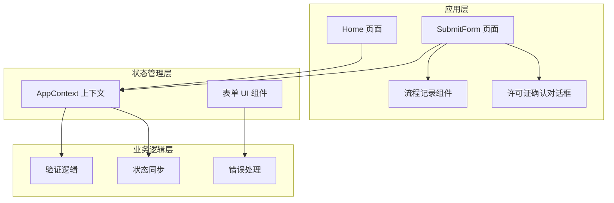
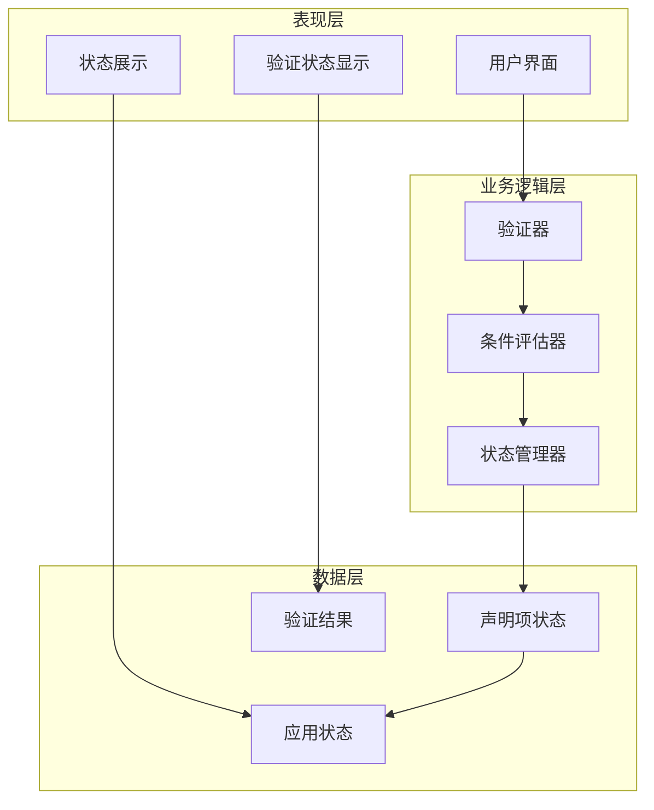
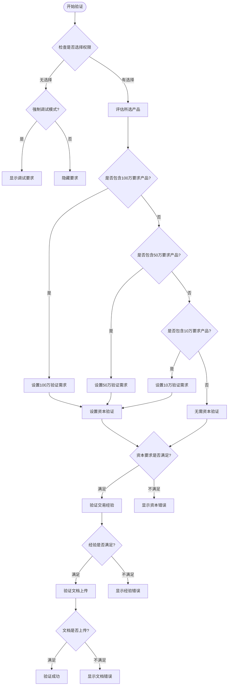
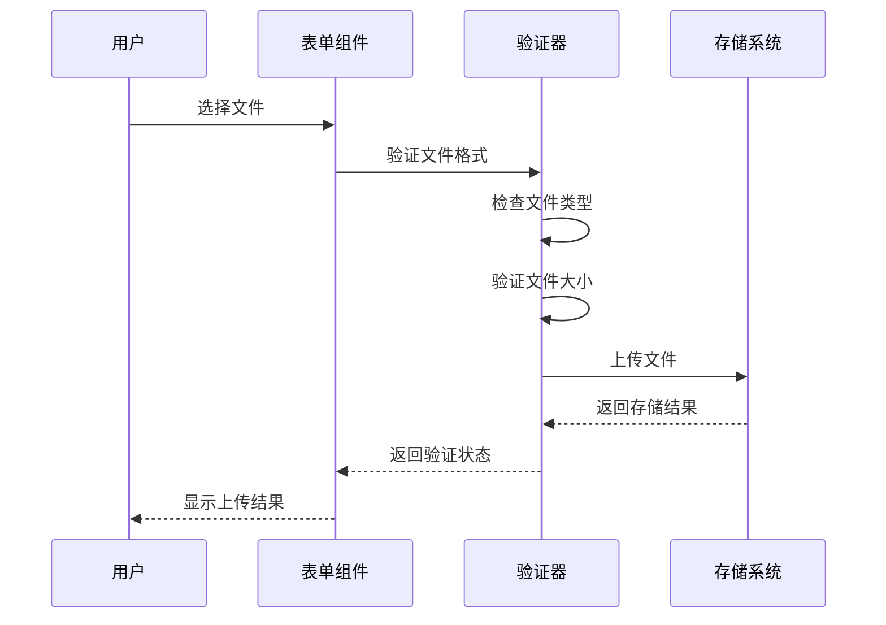
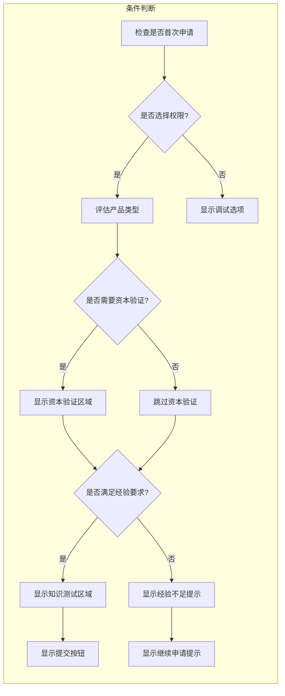
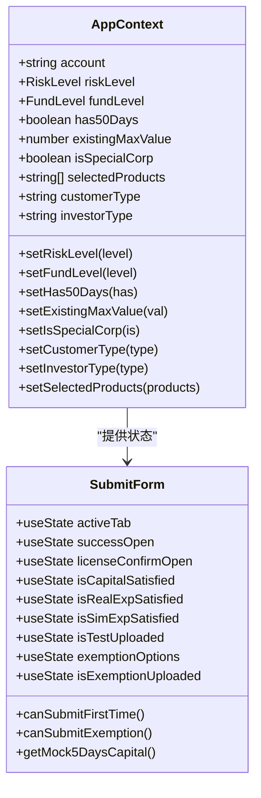
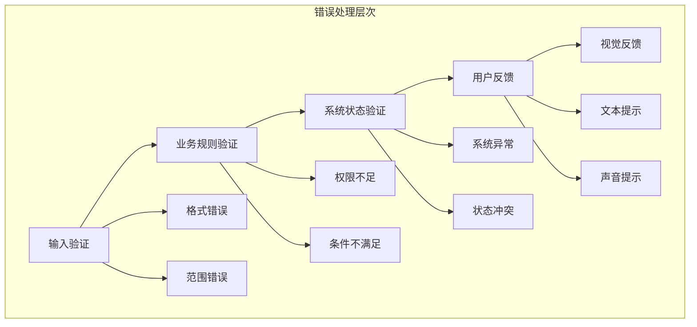
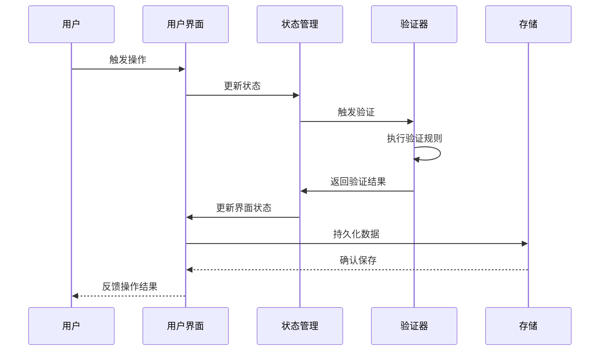

# 声明项验证与状态管理

<cite>
**本文档引用的文件**
- [SubmitForm.tsx](file://src/app/pages/SubmitForm.tsx)
- [AppContext.tsx](file://src/app/store/AppContext.tsx)
- [form.tsx](file://src/app/components/ui/form.tsx)
- [LicenseConfirmDialog.tsx](file://src/app/components/LicenseConfirmDialog.tsx)
- [ProcessRecord.tsx](file://src/app/components/ProcessRecord.tsx)
- [Home.tsx](file://src/app/pages/Home.tsx)
</cite>

## 目录
1. [引言](#引言)
2. [项目结构](#项目结构)
3. [核心组件](#核心组件)
4. [架构概览](#架构概览)
5. [详细组件分析](#详细组件分析)
6. [依赖关系分析](#依赖关系分析)
7. [性能考虑](#性能考虑)
8. [故障排除指南](#故障排除指南)
9. [结论](#结论)

## 引言

本文档深入解析了声明项验证与状态管理系统，涵盖多个声明项的验证逻辑、必填项检查、条件显示控制、状态同步机制。系统通过声明项之间的依赖关系、验证规则和错误处理机制，确保声明项的完整性和准确性。同时，文档提供了状态管理的最佳实践、性能优化考虑以及用户体验设计原则。

## 项目结构

该系统采用模块化架构，主要由以下部分组成：



**图表来源**
- [SubmitForm.tsx:1-747](file://src/app/pages/SubmitForm.tsx#L1-L747)
- [AppContext.tsx:1-64](file://src/app/store/AppContext.tsx#L1-L64)

**章节来源**
- [SubmitForm.tsx:57-131](file://src/app/pages/SubmitForm.tsx#L57-L131)
- [AppContext.tsx:31-63](file://src/app/store/AppContext.tsx#L31-L63)

## 核心组件

### 主要组件职责

1. **SubmitForm 页面组件**
   - 负责声明项的展示和交互
   - 实现复杂的验证逻辑
   - 管理多步骤申请流程

2. **AppContext 上下文**
   - 提供全局状态管理
   - 管理用户账户信息
   - 维护声明项状态

3. **表单 UI 组件**
   - 基于 react-hook-form 构建
   - 提供声明项验证功能
   - 支持条件显示控制

4. **流程记录组件**
   - 展示申请状态历史
   - 支持多种状态显示

**章节来源**
- [SubmitForm.tsx:132-747](file://src/app/pages/SubmitForm.tsx#L132-L747)
- [AppContext.tsx:6-27](file://src/app/store/AppContext.tsx#L6-L27)
- [form.tsx:19-169](file://src/app/components/ui/form.tsx#L19-L169)

## 架构概览

系统采用分层架构设计，实现了声明项验证与状态管理的解耦：



**图表来源**
- [SubmitForm.tsx:94-114](file://src/app/pages/SubmitForm.tsx#L94-L114)
- [AppContext.tsx:31-56](file://src/app/store/AppContext.tsx#L31-L56)

## 详细组件分析

### 声明项验证逻辑

#### 资产验证规则

系统根据所选交易权限自动确定资产验证要求：



**图表来源**
- [SubmitForm.tsx:94-114](file://src/app/pages/SubmitForm.tsx#L94-L114)
- [SubmitForm.tsx:383-452](file://src/app/pages/SubmitForm.tsx#L383-L452)

#### 交易经验验证

系统提供两种交易经验验证方式：

1. **实盘交易经验**
   - 近三年至少10笔成交
   - 自动统计实际成交笔数

2. **仿真交易经验**
   - 累计至少10个交易日
   - 累计至少20笔成交
   - 支持交易日历计算

**章节来源**
- [SubmitForm.tsx:454-505](file://src/app/pages/SubmitForm.tsx#L454-L505)
- [SubmitForm.tsx:463-474](file://src/app/pages/SubmitForm.tsx#L463-L474)

#### 文档上传验证

系统支持多种文档类型的上传验证：



**图表来源**
- [SubmitForm.tsx:518-541](file://src/app/pages/SubmitForm.tsx#L518-L541)

### 条件显示控制

系统通过智能条件判断实现声明项的动态显示：

#### 首次申请条件



**图表来源**
- [SubmitForm.tsx:375-546](file://src/app/pages/SubmitForm.tsx#L375-L546)

#### 豁免申请条件

系统支持四种豁免条件的多选验证：

1. **已开通股票期权账户**
2. **已在其他期货公司开通中金所编码**
3. **已在其他期货公司开通能源中心编码**
4. **已在其他期货公司开通其他品种**

**章节来源**
- [SubmitForm.tsx:549-617](file://src/app/pages/SubmitForm.tsx#L549-L617)

### 状态同步机制

#### 全局状态管理

AppContext 提供统一的状态管理接口：



**图表来源**
- [AppContext.tsx:6-27](file://src/app/store/AppContext.tsx#L6-L27)
- [SubmitForm.tsx:65-114](file://src/app/pages/SubmitForm.tsx#L65-L114)

#### 本地状态同步

系统采用本地状态同步机制确保声明项间的协调：

1. **实时状态更新**
   - 用户操作触发状态变化
   - 状态变化影响其他声明项显示
   - 提交按钮状态动态调整

2. **条件状态传播**
   - 资产验证状态影响经验验证显示
   - 经验验证状态影响知识测试显示
   - 所有验证通过后允许提交

**章节来源**
- [SubmitForm.tsx:115-117](file://src/app/pages/SubmitForm.tsx#L115-L117)
- [SubmitForm.tsx:649-663](file://src/app/pages/SubmitForm.tsx#L649-L663)

### 错误处理机制

#### 验证错误分类

系统提供多层次的错误处理：



**图表来源**
- [form.tsx:139-157](file://src/app/components/ui/form.tsx#L139-L157)

#### 用户体验错误处理

1. **即时反馈**
   - 输入时实时验证
   - 错误状态高亮显示
   - 清晰的错误信息提示

2. **预防性措施**
   - 禁用不可用的提交按钮
   - 条件显示相关的验证区域
   - 提供错误修复建议

**章节来源**
- [form.tsx:90-105](file://src/app/components/ui/form.tsx#L90-L105)
- [SubmitForm.tsx:702-744](file://src/app/pages/SubmitForm.tsx#L702-L744)

## 依赖关系分析

### 组件间依赖

```mermaid
graph TD
subgraph "外部依赖"
React[React]
HookForm[react-hook-form]
RadixUI[@radix-ui/react-*]
Sonner[sonner]
end
subgraph "内部组件"
SubmitForm[SubmitForm]
AppContext[AppContext]
FormUI[Form UI]
Dialog[Dialog]
ProcessRecord[ProcessRecord]
end
subgraph "工具函数"
Utils[utils]
Toast[toast]
end
React --> SubmitForm
HookForm --> FormUI
RadixUI --> Dialog
Sonner --> Toast
SubmitForm --> AppContext
SubmitForm --> FormUI
SubmitForm --> Dialog
SubmitForm --> ProcessRecord
AppContext --> Utils
FormUI --> Utils
Dialog --> Toast
```

**图表来源**
- [SubmitForm.tsx:1-11](file://src/app/pages/SubmitForm.tsx#L1-L11)
- [form.tsx:1-18](file://src/app/components/ui/form.tsx#L1-L18)

### 数据流依赖

系统采用单向数据流确保状态一致性：



**图表来源**
- [AppContext.tsx:31-56](file://src/app/store/AppContext.tsx#L31-L56)
- [SubmitForm.tsx:65-89](file://src/app/pages/SubmitForm.tsx#L65-L89)

**章节来源**
- [AppContext.tsx:1-64](file://src/app/store/AppContext.tsx#L1-L64)
- [SubmitForm.tsx:1-12](file://src/app/pages/SubmitForm.tsx#L1-L12)

## 性能考虑

### 状态更新优化

1. **状态分割**
   - 将大对象拆分为独立状态
   - 减少不必要的重渲染
   - 使用 useMemo 优化计算密集型操作

2. **事件处理优化**
   - 防抖处理高频事件
   - 合并状态更新
   - 避免在渲染过程中进行昂贵操作

### 渲染性能

1. **条件渲染**
   - 仅渲染必要的声明项
   - 动态加载非关键内容
   - 使用虚拟滚动处理大量数据

2. **缓存策略**
   - 缓存计算结果
   - 避免重复的网络请求
   - 使用本地存储减少服务器负载

### 内存管理

1. **清理机制**
   - 及时清理事件监听器
   - 释放定时器资源
   - 管理大型对象的生命周期

2. **垃圾回收**
   - 避免循环引用
   - 及时删除不需要的数据
   - 监控内存使用情况

## 故障排除指南

### 常见问题诊断

#### 验证失败问题

1. **症状**: 验证结果显示失败但无明确错误信息
   - 检查网络连接状态
   - 验证服务器响应格式
   - 查看浏览器开发者工具中的错误日志

2. **症状**: 验证状态不更新
   - 确认状态更新函数正确调用
   - 检查状态合并逻辑
   - 验证异步操作的完成状态

#### 用户界面问题

1. **症状**: 界面元素不显示或显示异常
   - 检查 CSS 样式冲突
   - 验证条件渲染逻辑
   - 确认组件依赖正确加载

2. **症状**: 交互响应延迟
   - 分析 JavaScript 执行时间
   - 检查第三方库性能
   - 优化重绘和回流操作

### 调试工具使用

1. **浏览器开发者工具**
   - 使用 React DevTools 检查组件树
   - 分析性能瓶颈
   - 跟踪状态变化历史

2. **日志记录**
   - 添加关键操作的日志点
   - 记录错误发生的时间和上下文
   - 监控系统指标和性能数据

**章节来源**
- [SubmitForm.tsx:702-744](file://src/app/pages/SubmitForm.tsx#L702-L744)
- [form.tsx:45-66](file://src/app/components/ui/form.tsx#L45-L66)

## 结论

声明项验证与状态管理系统通过精心设计的架构和实现，有效确保了声明项的完整性和准确性。系统的关键优势包括：

1. **智能验证逻辑**: 基于所选权限自动调整验证要求，提供个性化的用户体验
2. **状态同步机制**: 通过全局状态管理和局部状态同步，确保声明项间的协调一致
3. **条件显示控制**: 智能的条件判断使界面更加简洁和直观
4. **完善的错误处理**: 多层次的错误处理机制提升了系统的稳定性和用户体验

该系统的设计充分考虑了性能优化和用户体验，在保证功能完整性的同时，提供了流畅的操作体验。通过持续的监控和维护，系统能够适应不断变化的业务需求和技术环境。