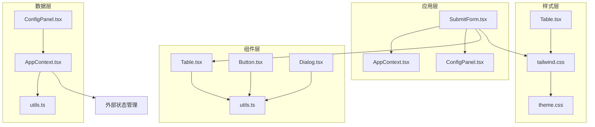
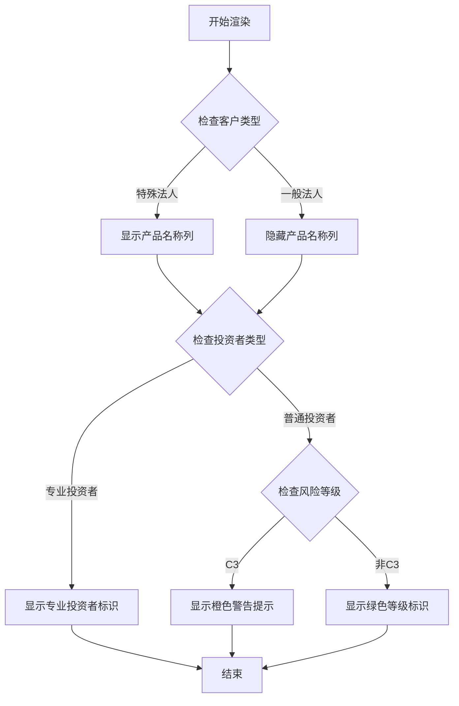
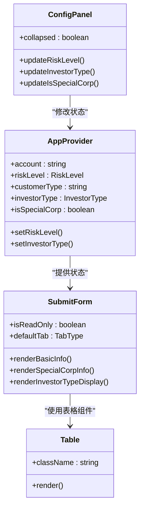
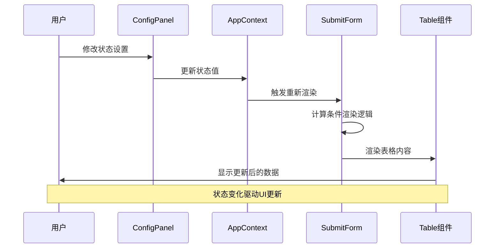
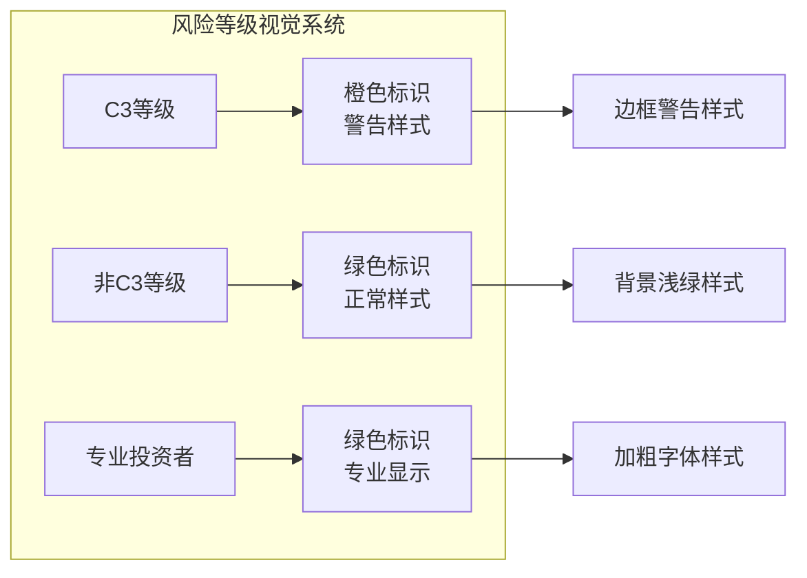
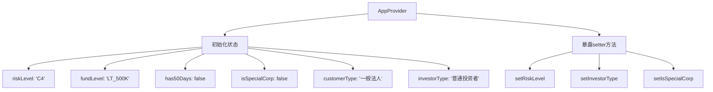
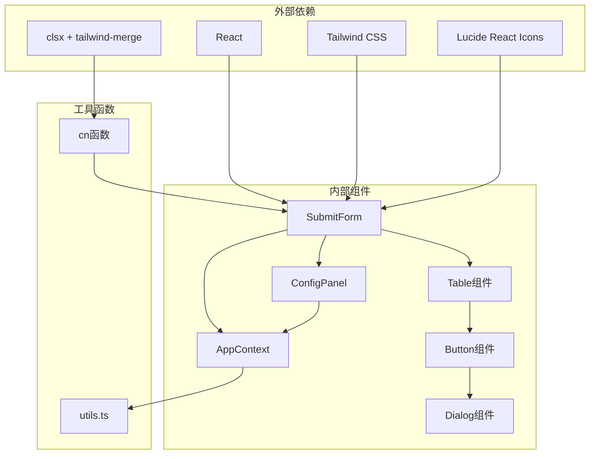

# 基本资料展示

<cite>
**本文档引用的文件**
- [SubmitForm.tsx](file://src/app/pages/SubmitForm.tsx)
- [AppContext.tsx](file://src/app/store/AppContext.tsx)
- [utils.ts](file://src/lib/utils.ts)
- [Table.tsx](file://src/app/components/ui/Table.tsx)
- [ConfigPanel.tsx](file://src/app/components/ConfigPanel.tsx)
- [customer-info.html](file://src/imports/customer-info.html)
- [tailwind.css](file://src/styles/tailwind.css)
- [theme.css](file://src/styles/theme.css)
</cite>

## 目录
1. [简介](#简介)
2. [项目结构](#项目结构)
3. [核心组件](#核心组件)
4. [架构概览](#架构概览)
5. [详细组件分析](#详细组件分析)
6. [依赖关系分析](#依赖关系分析)
7. [性能考虑](#性能考虑)
8. [故障排除指南](#故障排除指南)
9. [结论](#结论)

## 简介

基本资料展示模块是交易权限申请系统中的核心功能组件，负责向用户清晰地展示客户的基本信息和适当性评估结果。该模块实现了专业的投资者与普通投资者的差异化展示，提供了风险等级(C3)的视觉标识，并支持特殊客户类型的特殊处理。

## 项目结构

该项目采用现代化的React + TypeScript + Tailwind CSS技术栈构建，采用模块化组织方式：



**图表来源**
- [SubmitForm.tsx:1-747](file://src/app/pages/SubmitForm.tsx#L1-L747)
- [AppContext.tsx:1-64](file://src/app/store/AppContext.tsx#L1-L64)

**章节来源**
- [SubmitForm.tsx:158-243](file://src/app/pages/SubmitForm.tsx#L158-L243)
- [AppContext.tsx:31-57](file://src/app/store/AppContext.tsx#L31-L57)

## 核心组件

### 数据绑定机制

基本资料展示模块通过React Context实现全局状态管理，主要包含以下关键数据：

- **账户信息**: `account` - 资产账号显示
- **风险等级**: `riskLevel` - 适当性评估等级(C3/C4/C5)
- **客户类型**: `customerType` - 一般法人/特殊法人
- **投资者类型**: `investorType` - 普通投资者/专业投资者
- **特殊客户标记**: `isSpecialCorp` - 特殊客户标识

### 条件渲染逻辑

模块实现了复杂的条件渲染机制：



**图表来源**
- [SubmitForm.tsx:178-241](file://src/app/pages/SubmitForm.tsx#L178-L241)

**章节来源**
- [SubmitForm.tsx:60-61](file://src/app/pages/SubmitForm.tsx#L60-L61)
- [AppContext.tsx:6-27](file://src/app/store/AppContext.tsx#L6-L27)

## 架构概览

### 组件层次结构



**图表来源**
- [AppContext.tsx:31-57](file://src/app/store/AppContext.tsx#L31-L57)
- [SubmitForm.tsx:57-64](file://src/app/pages/SubmitForm.tsx#L57-L64)
- [ConfigPanel.tsx:6-16](file://src/app/components/ConfigPanel.tsx#L6-L16)

### 数据流图



**图表来源**
- [ConfigPanel.tsx:18-131](file://src/app/components/ConfigPanel.tsx#L18-L131)
- [AppContext.tsx:59-63](file://src/app/store/AppContext.tsx#L59-L63)

## 详细组件分析

### 基本信息表格实现

#### 表格结构设计

基本资料表格采用两列布局设计，每个信息项占据一行：

| 字段名称 | 显示逻辑 | 样式特点 |
|---------|---------|----------|
| 客户名称 | 固定显示 | 标准文本格式 |
| 客户类型 | 特殊法人显示"特法客户" | 动态内容替换 |
| 资产账号 | 显示账户号码 | 蓝色高亮字体 |
| 产品名称 | 特殊法人显示 | 条件渲染列 |
| 所属分支 | 固定显示 | 标准文本格式 |
| 适当性等级 | 投资者类型决定 | 颜色区分 |

#### 风险等级视觉标识

风险等级的视觉呈现采用了颜色编码系统：



**图表来源**
- [SubmitForm.tsx:205-214](file://src/app/pages/SubmitForm.tsx#L205-L214)

#### 特殊客户类型差异化展示

特殊客户(特法客户)与一般客户的显示差异：

```mermaid
flowchart TD
A[客户类型判断] --> B{isSpecialCorp?}
B --> |是| C[显示产品名称列]
B --> |否| D[隐藏产品名称列]
C --> E[显示产品名称值]
D --> F[显示空单元格]
G[客户类型显示] --> H{isSpecialCorp?}
H --> |是| I[显示"特法客户"]
H --> |否| J[显示customerType]
```

**图表来源**
- [SubmitForm.tsx:172-188](file://src/app/pages/SubmitForm.tsx#L172-L188)

**章节来源**
- [SubmitForm.tsx:167-234](file://src/app/pages/SubmitForm.tsx#L167-L234)

### 专业投资者与普通投资者界面呈现

#### 专业投资者界面

专业投资者的适当性等级显示具有特殊样式：

- **颜色**: 绿色(#16a34a)
- **字体**: 加粗显示
- **标识**: "专业投资者"文本
- **背景**: 浅绿色背景(#f0fdf4)

#### 普通投资者界面

普通投资者的风险等级显示采用分级标识：

- **C3等级**: 橙色(#f97316)警告样式
- **非C3等级**: 绿色(#16a34a)正常样式
- **附加信息**: 显示有效期至日期
- **警告提示**: 当为C3时显示提醒信息

**章节来源**
- [SubmitForm.tsx:193-241](file://src/app/pages/SubmitForm.tsx#L193-L241)

### 数据绑定与状态管理

#### Context Provider配置

应用上下文提供了完整的状态管理能力：



**图表来源**
- [AppContext.tsx:32-38](file://src/app/store/AppContext.tsx#L32-L38)

#### 状态更新机制

状态更新通过ConfigPanel组件实现交互式控制：

- **风险等级切换**: C3/C4/C5三档切换
- **客户类型切换**: 一般法人/特法客户切换  
- **投资者类型切换**: 普通投资者/专业投资者切换
- **实时预览**: 状态变化即时反映在表格中

**章节来源**
- [ConfigPanel.tsx:8-16](file://src/app/components/ConfigPanel.tsx#L8-L16)
- [AppContext.tsx:59-63](file://src/app/store/AppContext.tsx#L59-L63)

## 依赖关系分析

### 组件依赖图



**图表来源**
- [SubmitForm.tsx:1-12](file://src/app/pages/SubmitForm.tsx#L1-L12)
- [utils.ts:1-6](file://src/lib/utils.ts#L1-L6)

### 样式依赖关系

样式系统采用分层架构：

- **基础样式**: theme.css定义CSS变量和主题
- **框架样式**: tailwind.css引入Tailwind CSS
- **组件样式**: 各组件使用Tailwind实用类
- **自定义样式**: 通过cn函数合并多个样式类

**章节来源**
- [theme.css:1-182](file://src/styles/theme.css#L1-L182)
- [tailwind.css:1-5](file://src/styles/tailwind.css#L1-L5)

## 性能考虑

### 渲染优化策略

1. **条件渲染**: 使用三元运算符避免不必要的DOM元素创建
2. **状态分离**: 将不同维度的状态分离，减少重渲染范围
3. **样式合并**: 使用cn函数高效合并多个CSS类
4. **组件复用**: Table组件提供统一的表格渲染接口

### 内存管理

- **Context缓存**: React Context自动处理子组件的重渲染优化
- **事件处理**: 使用箭头函数避免重复绑定
- **清理机制**: 组件卸载时自动清理事件监听器

## 故障排除指南

### 常见问题诊断

#### 表格显示异常

**症状**: 表格列宽不正确或内容溢出
**解决方案**: 
1. 检查CSS类名是否正确应用
2. 验证Tailwind配置是否生效
3. 确认表格容器的宽度设置

#### 状态更新无效

**症状**: 修改ConfigPanel设置后表格无变化
**解决方案**:
1. 确认AppContext Provider正确包裹组件
2. 检查useAppContext钩子的使用
3. 验证setter方法的调用链

#### 风险等级显示错误

**症状**: 风险等级颜色或文本显示不符合预期
**解决方案**:
1. 检查riskLevel状态值
2. 验证条件渲染逻辑
3. 确认CSS类名拼写

**章节来源**
- [SubmitForm.tsx:236-241](file://src/app/pages/SubmitForm.tsx#L236-L241)
- [ConfigPanel.tsx:18-131](file://src/app/components/ConfigPanel.tsx#L18-L131)

## 结论

基本资料展示模块通过精心设计的数据绑定机制、条件渲染逻辑和视觉标识系统，成功实现了对客户信息的清晰展示。模块的主要优势包括：

1. **灵活的状态管理**: 通过Context提供全局状态访问
2. **直观的视觉反馈**: 风险等级的颜色编码系统
3. **差异化展示**: 专业投资者与普通投资者的界面区分
4. **响应式设计**: 支持不同屏幕尺寸的适配
5. **易于维护**: 模块化的组件结构和清晰的职责分离

该模块为整个交易权限申请系统奠定了坚实的基础，为后续的功能扩展提供了良好的架构支撑。