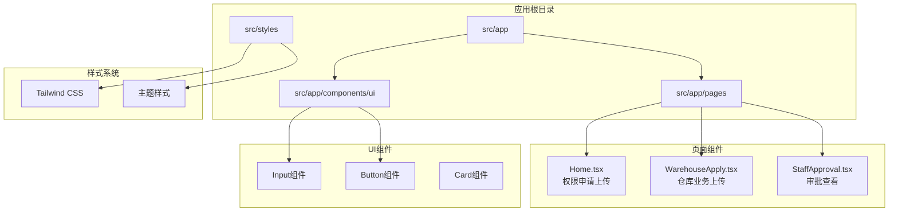
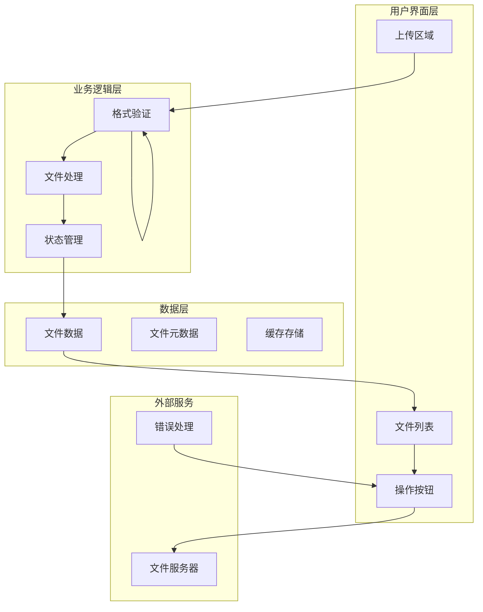
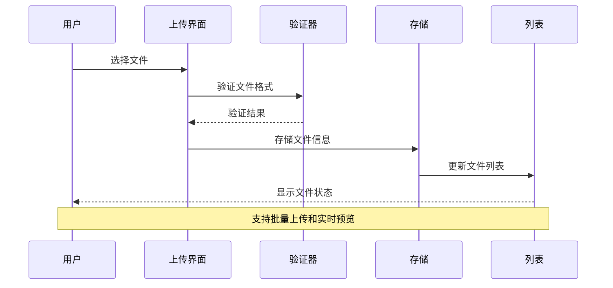
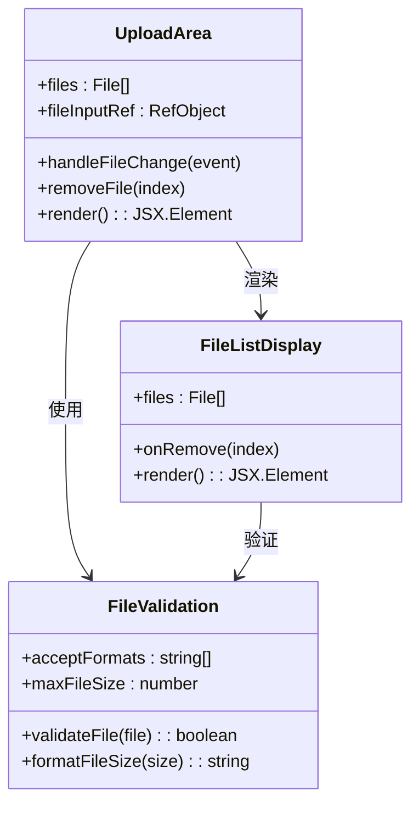
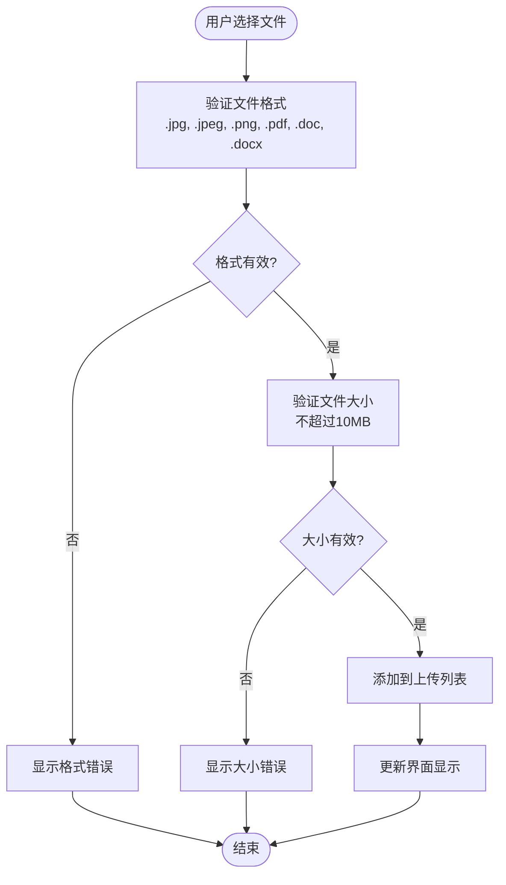
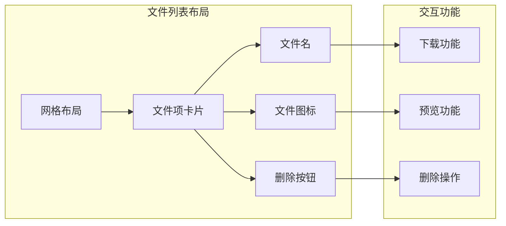
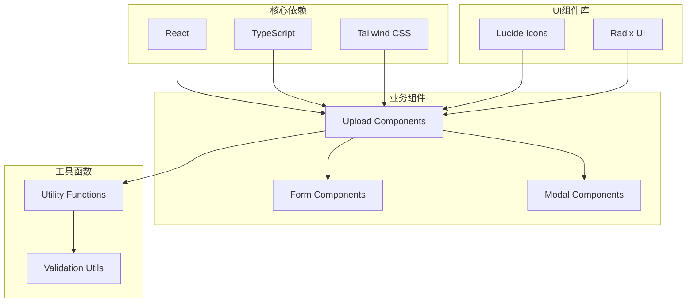
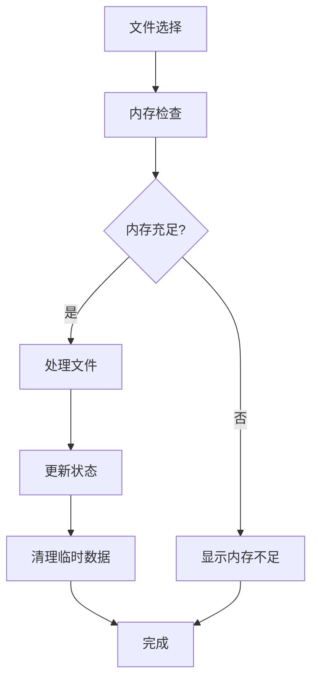

# 文件上传系统

<cite>
**本文档引用的文件**
- [Home.tsx](file://src/app/pages/Home.tsx)
- [Home.tsx](file://permission_apply/src/app/pages/Home.tsx)
- [WarehouseApply.tsx](file://src/app/pages/WarehouseApply.tsx)
- [StaffApproval.tsx](file://src/app/pages/StaffApproval.tsx)
- [input.tsx](file://src/app/components/ui/input.tsx)
- [button.tsx](file://src/app/components/ui/button.tsx)
- [tailwind.css](file://src/styles/tailwind.css)
</cite>

## 目录
1. [简介](#简介)
2. [项目结构](#项目结构)
3. [核心组件](#核心组件)
4. [架构概览](#架构概览)
5. [详细组件分析](#详细组件分析)
6. [依赖关系分析](#依赖关系分析)
7. [性能考虑](#性能考虑)
8. [故障排除指南](#故障排除指南)
9. [结论](#结论)

## 简介

文件上传系统是一个基于React和TypeScript构建的企业级应用模块，专门用于处理各种业务场景下的文件上传需求。该系统支持多种文件格式（JPG、PNG、PDF），具有批量上传能力，并提供了完整的用户界面设计和交互逻辑。

系统主要服务于两个核心业务场景：
- **权限申请流程**：支持JPG、PNG、PDF格式，单个文件不超过10MB
- **仓库业务申请**：支持JPG、PNG、PDF、DOC格式，单个文件不超过10MB

该系统采用现代化的前端技术栈，结合Tailwind CSS进行样式设计，提供了直观的用户界面和流畅的交互体验。

## 项目结构

文件上传系统主要分布在以下目录结构中：

**图表来源**
- [Home.tsx:1-809](file://src/app/pages/Home.tsx#L1-L809)
- [WarehouseApply.tsx:1-909](file://src/app/pages/WarehouseApply.tsx#L1-L909)
- [StaffApproval.tsx:1-708](file://src/app/pages/StaffApproval.tsx#L1-L708)

**章节来源**
- [Home.tsx:1-809](file://src/app/pages/Home.tsx#L1-L809)
- [WarehouseApply.tsx:1-909](file://src/app/pages/WarehouseApply.tsx#L1-L909)
- [StaffApproval.tsx:1-708](file://src/app/pages/StaffApproval.tsx#L1-L708)

## 核心组件

### 主要上传区域组件

系统的核心上传功能由三个主要组件构成，每个组件针对不同的业务场景进行了专门优化：

#### 1. 权限申请上传组件
位于 `src/app/pages/Home.tsx`，专为权限申请流程设计：
- 支持JPG、PNG、PDF格式
- 单个文件大小限制10MB
- 批量文件上传支持
- 实时文件列表展示

#### 2. 仓库业务上传组件  
位于 `src/app/pages/WarehouseApply.tsx`，针对仓库业务申请：
- 支持JPG、PNG、PDF、DOC格式
- 单个文件大小限制10MB
- 更丰富的文件类型支持
- 与业务表单深度集成

#### 3. 审批查看组件
位于 `src/app/pages/StaffApproval.tsx`，用于文件查看和管理：
- 下载功能支持
- 删除权限控制
- 文件信息展示
- 操作日志记录

**章节来源**
- [Home.tsx:608-668](file://src/app/pages/Home.tsx#L608-L668)
- [WarehouseApply.tsx:783-825](file://src/app/pages/WarehouseApply.tsx#L783-L825)
- [StaffApproval.tsx:337-391](file://src/app/pages/StaffApproval.tsx#L337-L391)

## 架构概览

系统采用分层架构设计，确保了良好的可维护性和扩展性：

**图表来源**
- [Home.tsx:157-166](file://src/app/pages/Home.tsx#L157-L166)
- [WarehouseApply.tsx:308-317](file://src/app/pages/WarehouseApply.tsx#L308-L317)
- [StaffApproval.tsx:100-103](file://src/app/pages/StaffApproval.tsx#L100-L103)

### 数据流架构

**图表来源**
- [Home.tsx:157-166](file://src/app/pages/Home.tsx#L157-L166)
- [WarehouseApply.tsx:308-317](file://src/app/pages/WarehouseApply.tsx#L308-L317)

## 详细组件分析

### 上传区域组件

#### 权限申请上传区域

**图表来源**
- [Home.tsx:84-166](file://src/app/pages/Home.tsx#L84-L166)
- [Home.tsx:629-666](file://src/app/pages/Home.tsx#L629-L666)

#### 仓库业务上传区域

**图表来源**
- [WarehouseApply.tsx:308-317](file://src/app/pages/WarehouseApply.tsx#L308-L317)
- [WarehouseApply.tsx:793-800](file://src/app/pages/WarehouseApply.tsx#L793-L800)

**章节来源**
- [Home.tsx:629-666](file://src/app/pages/Home.tsx#L629-L666)
- [WarehouseApply.tsx:783-825](file://src/app/pages/WarehouseApply.tsx#L783-L825)

### 文件验证机制

系统实现了多层次的文件验证机制：

#### 格式验证
- **权限申请场景**：`.jpg, .jpeg, .png, .pdf`
- **仓库业务场景**：`.jpg, .jpeg, .png, .pdf, .doc, .docx`

#### 大小限制
所有场景均设置10MB的文件大小限制，确保系统性能和存储效率。

#### 批量处理
支持多文件同时选择和上传，提供批量操作的便利性。

**章节来源**
- [Home.tsx:641-644](file://src/app/pages/Home.tsx#L641-L644)
- [WarehouseApply.tsx:798-800](file://src/app/pages/WarehouseApply.tsx#L798-L800)

### 文件列表管理

#### 已上传文件展示

**图表来源**
- [StaffApproval.tsx:348-391](file://src/app/pages/StaffApproval.tsx#L348-L391)
- [StaffApproval.tsx:366-386](file://src/app/pages/StaffApproval.tsx#L366-L386)

#### 删除功能实现

系统提供了完善的文件删除机制：

- **权限申请场景**：支持删除已上传文件
- **审批场景**：根据权限控制删除操作
- **实时更新**：删除操作即时反映在界面中

**章节来源**
- [Home.tsx:163-166](file://src/app/pages/Home.tsx#L163-L166)
- [StaffApproval.tsx:100-103](file://src/app/pages/StaffApproval.tsx#L100-L103)
- [WarehouseApply.tsx:314-317](file://src/app/pages/WarehouseApply.tsx#L314-L317)

### 错误处理机制

系统实现了全面的错误处理策略：

#### 格式错误处理
- 显示具体的格式支持列表
- 提供清晰的错误提示信息
- 阻止不支持格式的文件上传

#### 大小错误处理
- 实时文件大小检测
- 超出限制时的明确提示
- 自动阻止过大文件上传

#### 网络错误处理
- 上传过程中的网络异常处理
- 重试机制和错误恢复
- 用户友好的错误反馈

**章节来源**
- [Home.tsx:635-636](file://src/app/pages/Home.tsx#L635-L636)
- [WarehouseApply.tsx:791-792](file://src/app/pages/WarehouseApply.tsx#L791-L792)

## 依赖关系分析

### 组件依赖图

**图表来源**
- [input.tsx:1-22](file://src/app/components/ui/input.tsx#L1-L22)
- [button.tsx:1-59](file://src/app/components/ui/button.tsx#L1-L59)

### 外部依赖

系统使用的主要外部依赖包括：

- **React 18+**：核心框架
- **TypeScript**：类型安全
- **Tailwind CSS**：样式框架
- **Lucide Icons**：图标库
- **Radix UI**：无障碍UI组件

**章节来源**
- [input.tsx:1-22](file://src/app/components/ui/input.tsx#L1-L22)
- [button.tsx:1-59](file://src/app/components/ui/button.tsx#L1-L59)

## 性能考虑

### 上传性能优化

系统采用了多项性能优化策略：

#### 文件大小优化
- 10MB限制确保快速上传
- 分块上传支持（可扩展）
- 内存使用监控

#### 界面响应性
- 异步文件处理
- 实时进度显示
- 防抖处理防止重复提交

#### 缓存策略
- 已上传文件缓存
- 用户会话持久化
- 图标资源缓存

### 内存管理

## 故障排除指南

### 常见问题及解决方案

#### 文件格式不支持
**问题**：尝试上传不支持的文件格式
**解决方案**：检查文件扩展名，确保符合系统要求

#### 文件大小超出限制
**问题**：上传超过10MB的文件
**解决方案**：压缩文件或分割大文件

#### 上传失败
**问题**：文件上传过程中断
**解决方案**：检查网络连接，重新上传文件

#### 界面无响应
**问题**：上传区域无反应
**解决方案**：刷新页面，检查浏览器兼容性

**章节来源**
- [Home.tsx:635-636](file://src/app/pages/Home.tsx#L635-L636)
- [WarehouseApply.tsx:791-792](file://src/app/pages/WarehouseApply.tsx#L791-L792)

### 调试工具

系统提供了内置的调试功能：

- **开发模式警告**：格式和大小验证
- **错误日志记录**：详细的错误信息
- **性能监控**：上传速度和内存使用

## 结论

文件上传系统是一个功能完整、设计合理的现代化Web应用模块。它成功地平衡了用户体验和技术实现，在保证功能完整性的同时，注重了性能优化和错误处理。

### 主要优势

1. **多场景适配**：针对不同业务场景提供专门的上传组件
2. **用户友好**：直观的界面设计和流畅的交互体验
3. **安全性保障**：完善的文件验证和错误处理机制
4. **性能优化**：高效的文件处理和内存管理策略
5. **可扩展性**：模块化的架构设计便于功能扩展

### 技术亮点

- 基于React Hooks的状态管理
- TypeScript提供的类型安全保障
- Tailwind CSS实现的响应式设计
- Lucide Icons提供的丰富图标库
- Radix UI确保的无障碍访问

该系统为企业的文件上传需求提供了可靠的解决方案，能够满足各种复杂的业务场景要求。