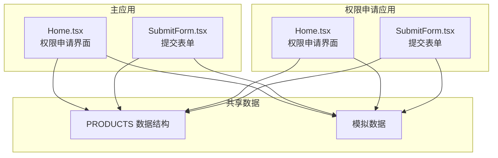
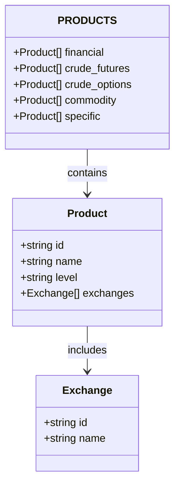
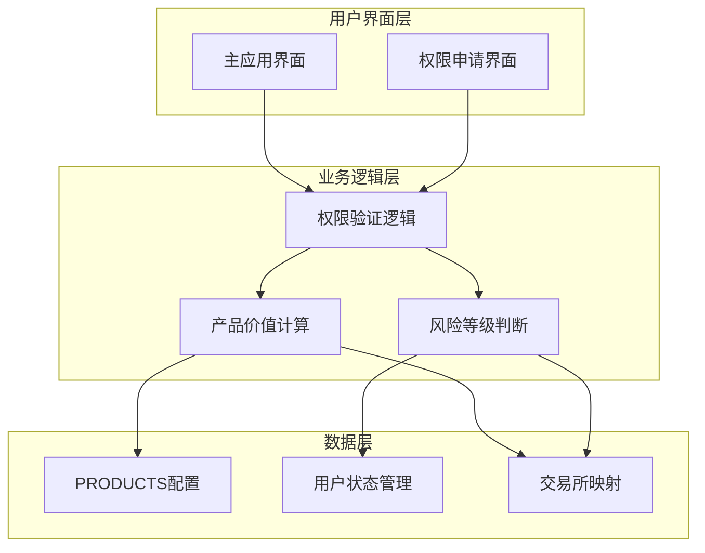
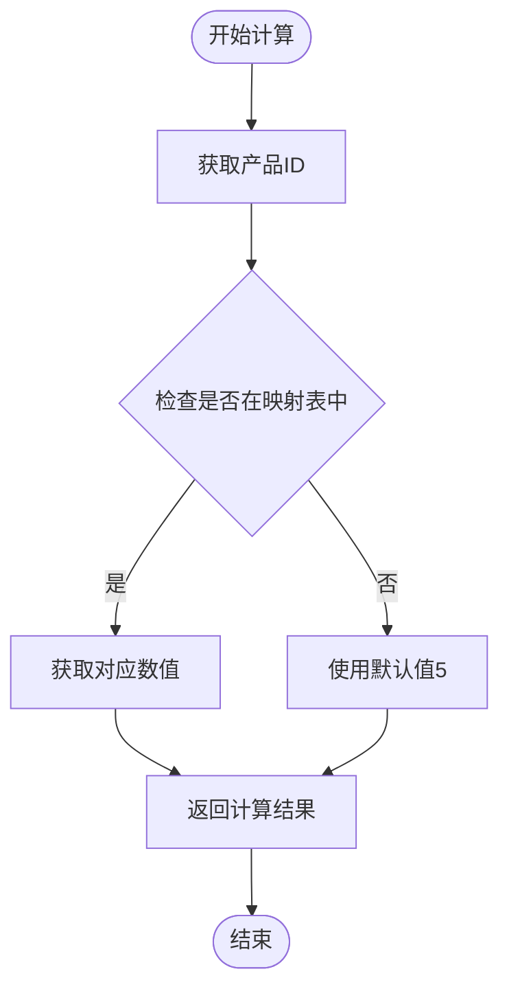
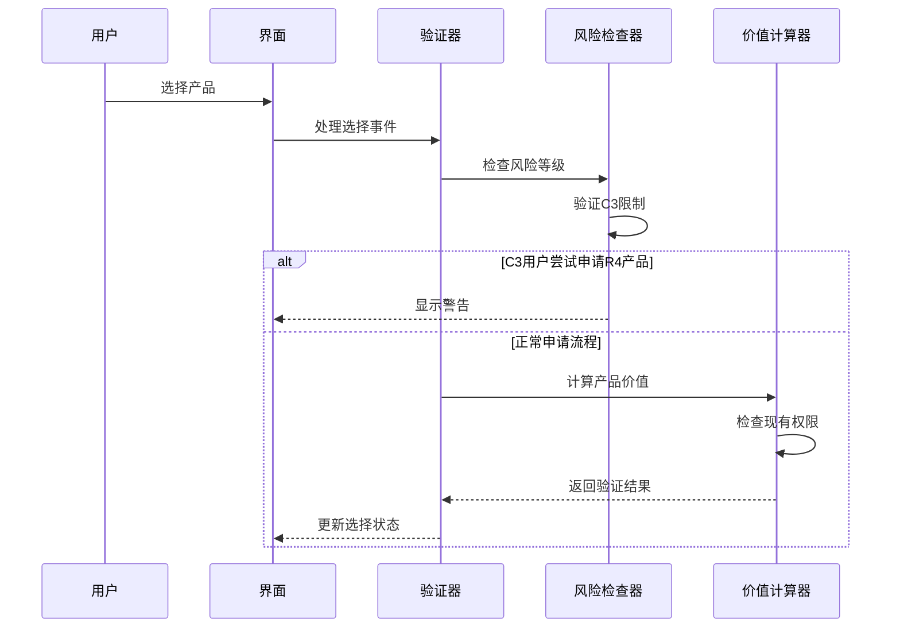
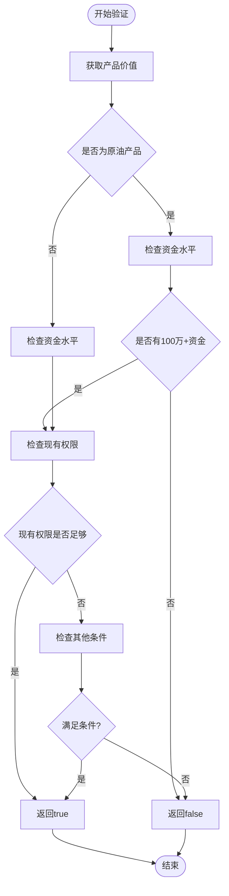
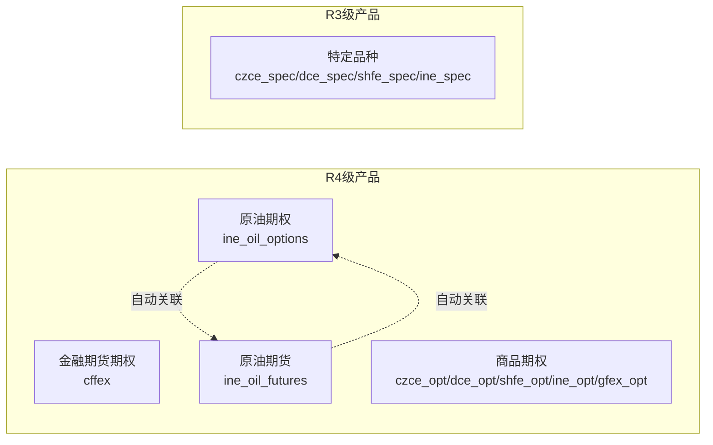
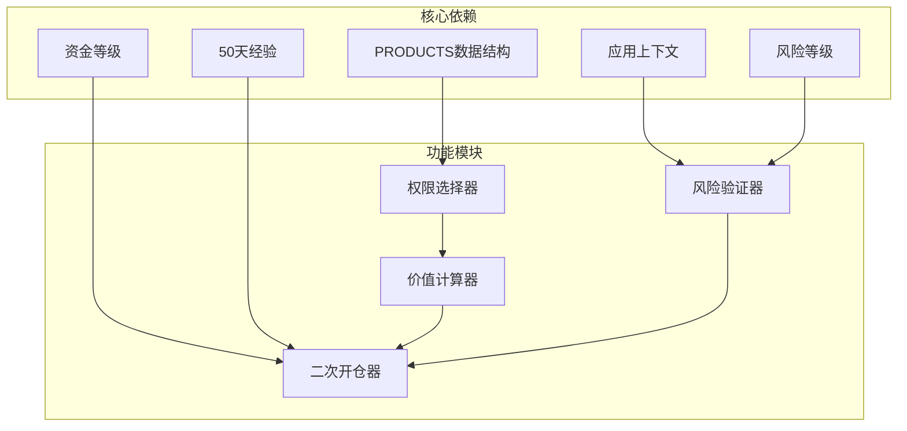

# 产品分类体系

<cite>
**本文档引用的文件**
- [Home.tsx](file://src/app/pages/Home.tsx)
- [SubmitForm.tsx](file://src/app/pages/SubmitForm.tsx)
- [Home.tsx](file://permission_apply/src/app/pages/Home.tsx)
- [SubmitForm.tsx](file://permission_apply/src/app/pages/SubmitForm.tsx)
- [customer-info.html](file://src/imports/customer-info.html)
- [customer-info.html](file://permission_apply/src/imports/customer-info.html)
</cite>

## 目录
1. [引言](#引言)
2. [项目结构](#项目结构)
3. [核心组件](#核心组件)
4. [架构概览](#架构概览)
5. [详细组件分析](#详细组件分析)
6. [依赖分析](#依赖分析)
7. [性能考虑](#性能考虑)
8. [故障排除指南](#故障排除指南)
9. [结论](#结论)

## 引言

本文件详细阐述了交易权限的层级分类体系，涵盖一级分类（金融期货期权、原油期货、商品期权、特定品种）的设计理念和业务逻辑。文档重点说明了每个分类的风险等级（R3/R4）划分标准、交易所覆盖范围，以及分类对用户权限申请的影响。同时，文档包含了产品价值计算机制、分类间的关联关系和业务规则约束。

## 项目结构

该权限管理系统由两个主要前端应用组成：主应用和权限申请应用。两者共享相同的产品分类数据结构，但各自实现了不同的交互流程和业务规则。

**图表来源**
- [Home.tsx:17-59](file://src/app/pages/Home.tsx#L17-L59)
- [SubmitForm.tsx:13-55](file://src/app/pages/SubmitForm.tsx#L13-L55)
- [Home.tsx:17-59](file://permission_apply/src/app/pages/Home.tsx#L17-L59)
- [SubmitForm.tsx:13-55](file://permission_apply/src/app/pages/SubmitForm.tsx#L13-L55)

**章节来源**
- [Home.tsx:1-50](file://src/app/pages/Home.tsx#L1-L50)
- [SubmitForm.tsx:1-50](file://src/app/pages/SubmitForm.tsx#L1-L50)
- [Home.tsx:1-50](file://permission_apply/src/app/pages/Home.tsx#L1-L50)
- [SubmitForm.tsx:1-50](file://permission_apply/src/app/pages/SubmitForm.tsx#L1-L50)

## 核心组件

### 产品分类数据结构

系统采用统一的PRODUCTS数据结构来定义所有可交易产品，该结构在两个应用中保持一致：

**图表来源**
- [Home.tsx:17-59](file://src/app/pages/Home.tsx#L17-L59)
- [SubmitForm.tsx:13-55](file://src/app/pages/SubmitForm.tsx#L13-L55)

### 风险等级分类

系统将产品分为两个风险等级：

- **R4级（高风险）**：金融期货期权、原油期货、原油期权、商品期权
- **R3级（中等风险）**：特定品种

**章节来源**
- [Home.tsx:17-59](file://src/app/pages/Home.tsx#L17-L59)
- [SubmitForm.tsx:13-55](file://src/app/pages/SubmitForm.tsx#L13-L55)

## 架构概览

系统采用分层架构设计，包含以下关键层次：

**图表来源**
- [Home.tsx:96-197](file://src/app/pages/Home.tsx#L96-L197)
- [SubmitForm.tsx:94-109](file://src/app/pages/SubmitForm.tsx#L94-L109)

## 详细组件分析

### 产品价值计算机制

系统通过PRODUCT_VALUES映射表实现产品价值计算，该机制直接影响用户的权限申请资格：

**图表来源**
- [Home.tsx:96-105](file://src/app/pages/Home.tsx#L96-L105)
- [Home.tsx:97-106](file://permission_apply/src/app/pages/Home.tsx#L97-L106)

#### 价值计算规则

| 产品类别 | 交易所ID | 价值数值 |
|---------|----------|----------|
| 金融期货期权 | cffex | 10 |
| 原油期货 | ine_oil_futures | 8 |
| 原油期权 | ine_oil_options | 8 |
| 商品期权 | czce_opt/dce_opt/shfe_opt/ine_opt/gfex_opt | 5 |
| 特定品种 | czce_spec/dce_spec/shfe_spec/ine_spec | 5 |

**章节来源**
- [Home.tsx:97-105](file://src/app/pages/Home.tsx#L97-L105)
- [Home.tsx:98-106](file://permission_apply/src/app/pages/Home.tsx#L98-L106)

### 权限申请业务逻辑

系统实现了复杂的权限申请验证逻辑，确保用户只能申请符合其风险承受能力的产品：

**图表来源**
- [Home.tsx:128-156](file://src/app/pages/Home.tsx#L128-L156)
- [Home.tsx:129-156](file://permission_apply/src/app/pages/Home.tsx#L129-L156)

### 二级开仓验证机制

系统提供了二级开仓验证功能，用于检查用户是否具备再次开仓的资格：

**图表来源**
- [Home.tsx:175-197](file://src/app/pages/Home.tsx#L175-L197)
- [Home.tsx:176-198](file://permission_apply/src/app/pages/Home.tsx#L176-L198)

**章节来源**
- [Home.tsx:175-197](file://src/app/pages/Home.tsx#L175-L197)
- [Home.tsx:176-198](file://permission_apply/src/app/pages/Home.tsx#L176-L198)

### 产品关联关系

系统中的产品之间存在特定的关联关系，特别是原油期货和原油期权之间的依赖关系：

**图表来源**
- [Home.tsx:140-152](file://src/app/pages/Home.tsx#L140-L152)
- [Home.tsx:141-153](file://permission_apply/src/app/pages/Home.tsx#L141-L153)

**章节来源**
- [Home.tsx:140-152](file://src/app/pages/Home.tsx#L140-L152)
- [Home.tsx:141-153](file://permission_apply/src/app/pages/Home.tsx#L141-L153)

### 交易所覆盖范围

系统支持以下交易所和产品组合：

| 交易所 | 支持产品 | 风险等级 |
|--------|----------|----------|
| 中国金融期货交易所 (cffex) | 金融期货期权 | R4 |
| 上海国际能源交易中心 (ine_oil_futures/ine_oil_options) | 原油期货/原油期权 | R4 |
| 郑州商品交易所 (czce_opt/czce_spec) | 商品期权/特定品种 | R4/R3 |
| 大连商品交易所 (dce_opt/dce_spec) | 商品期权/特定品种 | R4/R3 |
| 上海期货交易所 (shfe_opt/shfe_spec) | 商品期权/特定品种 | R4/R3 |
| 广州期货交易所 (gfex_opt) | 商品期权 | R4 |

**章节来源**
- [Home.tsx:17-59](file://src/app/pages/Home.tsx#L17-L59)
- [SubmitForm.tsx:13-55](file://src/app/pages/SubmitForm.tsx#L13-L55)

## 依赖分析

系统的关键依赖关系如下：

**图表来源**
- [Home.tsx:64-64](file://src/app/pages/Home.tsx#L64-L64)
- [Home.tsx:96-197](file://src/app/pages/Home.tsx#L96-L197)

**章节来源**
- [Home.tsx:64-64](file://src/app/pages/Home.tsx#L64-L64)
- [Home.tsx:96-197](file://src/app/pages/Home.tsx#L96-L197)

## 性能考虑

系统在性能方面采用了多项优化策略：

1. **数据结构优化**：使用扁平化的PRODUCTS数组而非嵌套对象，提高查找效率
2. **缓存机制**：通过existingMaxValue避免重复计算
3. **条件渲染**：根据风险等级动态显示可选产品
4. **批量操作**：支持全选/取消全选功能，减少DOM操作

## 故障排除指南

### 常见问题及解决方案

| 问题类型 | 症状 | 可能原因 | 解决方案 |
|----------|------|----------|----------|
| 权限申请失败 | 显示C3限制警告 | C3用户尝试申请R4产品 | 提升风险等级或选择R3产品 |
| 价值计算错误 | 产品价值显示异常 | 产品ID不在映射表中 | 检查产品ID是否正确 |
| 自动关联失效 | 原油期货/期权无法自动关联 | 事件处理逻辑错误 | 检查handleToggleProduct函数 |
| 资金验证失败 | 二级开仓被拒绝 | 资金水平不符合要求 | 满足最低资金要求 |

**章节来源**
- [Home.tsx:129-132](file://src/app/pages/Home.tsx#L129-L132)
- [Home.tsx:175-197](file://src/app/pages/Home.tsx#L175-L197)

## 结论

该产品分类体系通过明确的层级划分和严格的业务规则，有效保障了交易权限申请的安全性和合规性。系统的设计充分考虑了不同风险等级用户的需求，通过智能化的价值计算和权限验证机制，为用户提供了一致且可靠的权限申请体验。

系统的核心优势在于：
- 清晰的分类结构和风险等级划分
- 灵活的价值计算机制
- 完善的权限验证和业务规则
- 良好的用户体验设计