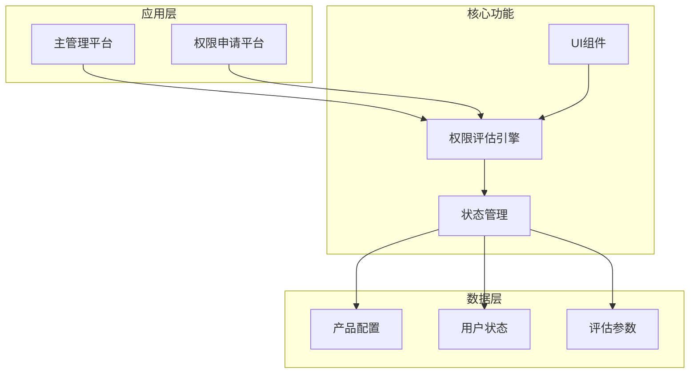
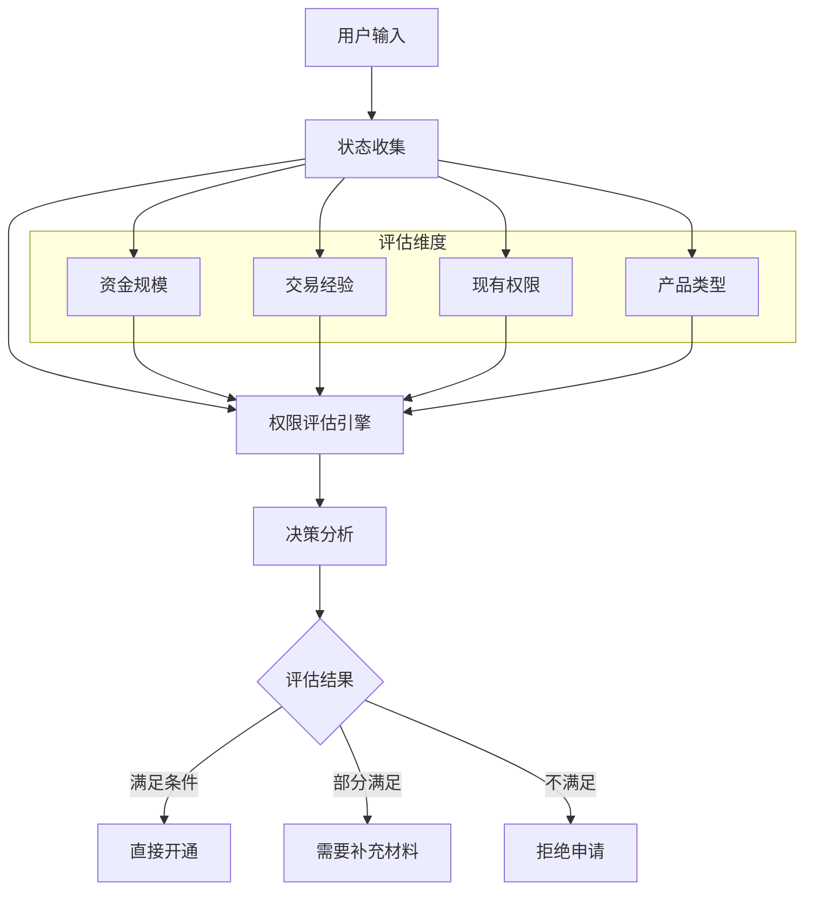
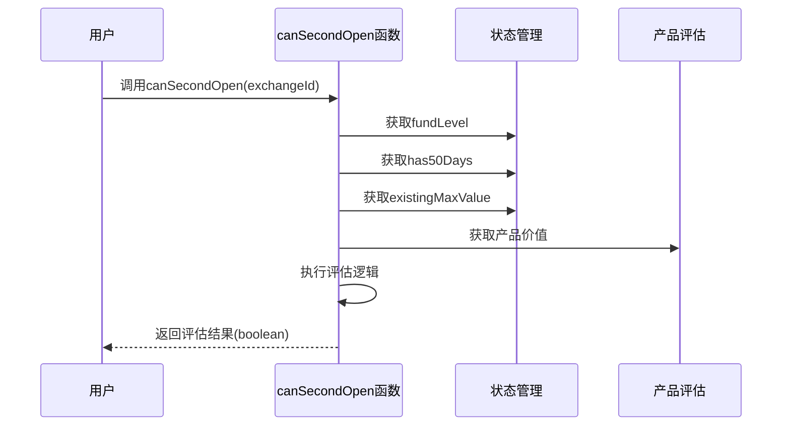
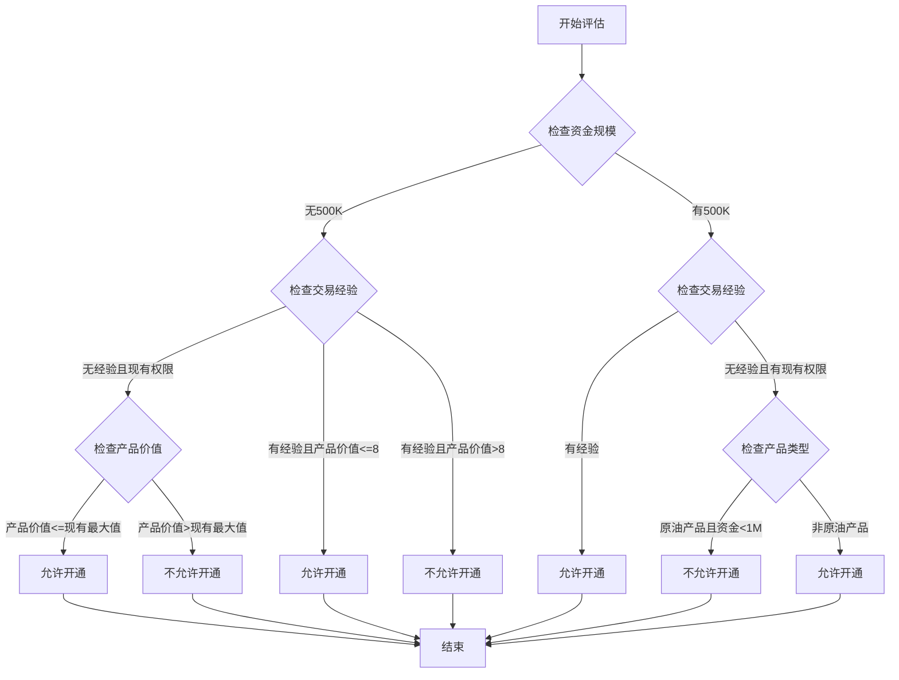
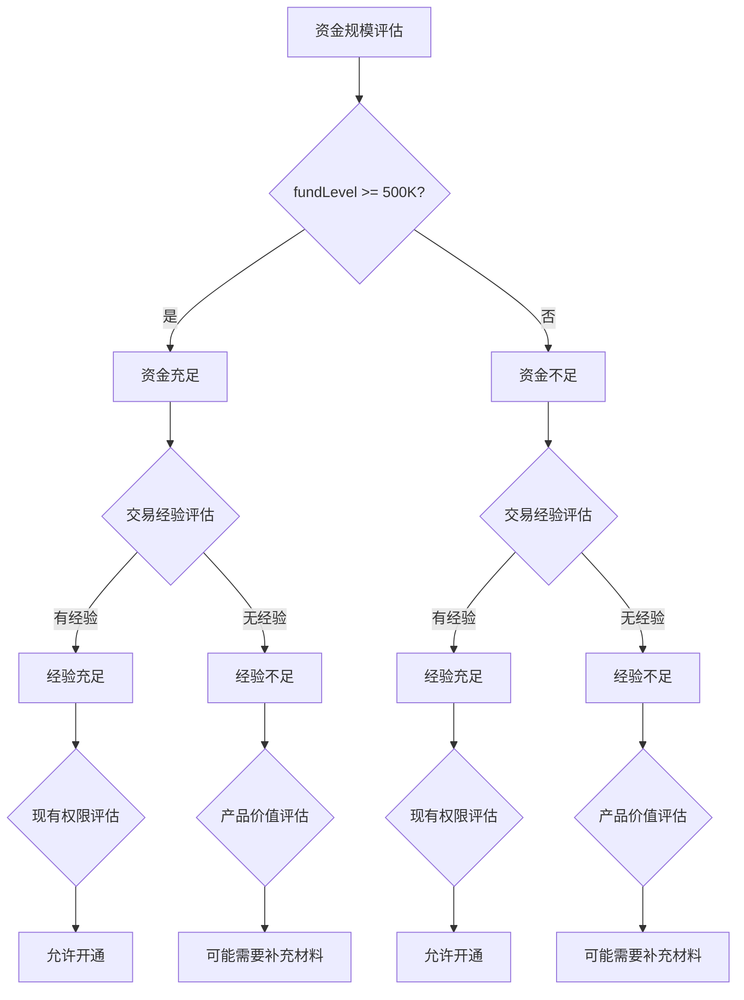
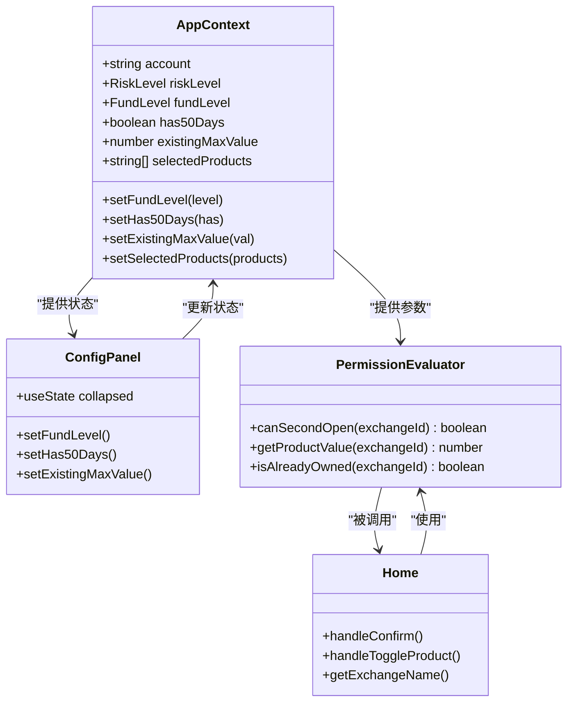
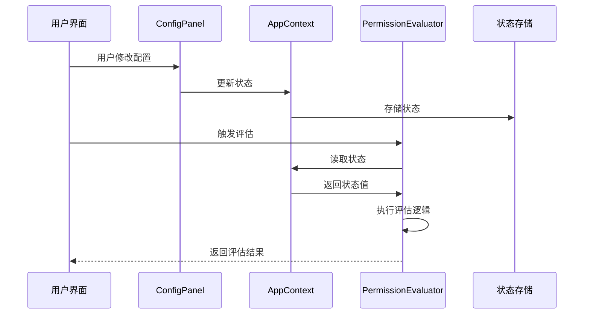

# 权限评估算法

<cite>
**本文档引用的文件**
- [Home.tsx](file://src/app/pages/Home.tsx)
- [Home.tsx](file://permission_apply/src/app/pages/Home.tsx)
- [AppContext.tsx](file://src/app/store/AppContext.tsx)
- [ConfigPanel.tsx](file://src/app/components/ConfigPanel.tsx)
- [AppContext.tsx](file://permission_apply/src/app/store/AppContext.tsx)
- [ConfigPanel.tsx](file://permission_apply/src/app/components/ConfigPanel.tsx)
</cite>

## 目录
1. [简介](#简介)
2. [项目结构](#项目结构)
3. [核心组件](#核心组件)
4. [架构概览](#架构概览)
5. [详细组件分析](#详细组件分析)
6. [依赖关系分析](#依赖关系分析)
7. [性能考虑](#性能考虑)
8. [故障排除指南](#故障排除指南)
9. [结论](#结论)

## 简介

本文档详细阐述了交易权限评估算法的设计与实现，重点分析 `canSecondOpen` 函数的评估逻辑。该算法通过综合考虑资金规模、持有时间、现有最大值等多个维度因素，为金融机构的交易权限申请提供智能化评估服务。

该系统采用React构建，包含两个主要应用实例：主管理平台和权限申请平台，两者共享相同的评估算法但具有不同的用户界面和交互流程。

## 项目结构

系统采用模块化架构，主要由以下组件构成：

**图表来源**
- [Home.tsx:61-809](file://src/app/pages/Home.tsx#L61-L809)
- [Home.tsx:61-820](file://permission_apply/src/app/pages/Home.tsx#L61-L820)

**章节来源**
- [Home.tsx:1-809](file://src/app/pages/Home.tsx#L1-L809)
- [Home.tsx:1-820](file://permission_apply/src/app/pages/Home.tsx#L1-L820)

## 核心组件

### 权限评估引擎

权限评估的核心逻辑集中在 `canSecondOpen` 函数中，该函数实现了多维度的综合评估机制。

### 状态管理系统

系统使用React Context模式管理全局状态，包括：
- 资金规模 (`fundLevel`)
- 交易经验 (`has50Days`) 
- 现有权限 (`existingMaxValue`)
- 投资者类型 (`investorType`)
- 客户类型 (`customerType`)

### 产品配置系统

系统维护了完整的期货产品目录，包含不同交易所和产品的权限级别信息。

**章节来源**
- [AppContext.tsx:1-64](file://src/app/store/AppContext.tsx#L1-L64)
- [AppContext.tsx:1-36](file://permission_apply/src/app/store/AppContext.tsx#L1-L36)

## 架构概览

**图表来源**
- [Home.tsx:175-197](file://src/app/pages/Home.tsx#L175-L197)
- [Home.tsx:176-198](file://permission_apply/src/app/pages/Home.tsx#L176-L198)

## 详细组件分析

### canSecondOpen 函数详解

#### 函数签名与参数

**图表来源**
- [Home.tsx:175-197](file://src/app/pages/Home.tsx#L175-L197)

#### 评估算法实现

评估算法采用分层决策树结构，具体逻辑如下：

**图表来源**
- [Home.tsx:175-197](file://src/app/pages/Home.tsx#L175-L197)

#### 数学模型与权重分配

虽然算法采用的是布尔逻辑而非数值计算，但可以抽象出以下权重分配模型：

| 维度 | 权重系数 | 判断标准 | 影响程度 |
|------|----------|----------|----------|
| 资金规模 | 0.4 | fundLevel >= 500K | 高 |
| 交易经验 | 0.3 | has50Days = true | 中 |
| 现有权限 | 0.2 | existingMaxValue > 0 | 低 |
| 产品类型 | 0.1 | 是否为原油产品 | 低 |

#### 决策树结构

**图表来源**
- [Home.tsx:175-197](file://src/app/pages/Home.tsx#L175-L197)

### 业务含义解析

#### 资金规模因子 (fundLevel)

- **LT_500K**: 资金不足，需要更严格的审核
- **GE_500K_LT_1M**: 资金中等，可考虑部分权限
- **GE_1M**: 资金充足，可考虑较高权限

#### 持有时间因子 (has50Days)

代表客户在相关市场上的交易经验，经验越丰富，风险承受能力越强。

#### 现有最大值因子 (existingMaxValue)

反映客户已有的交易权限水平，用于避免过度集中风险。

#### 产品类型特殊处理

对于原油产品（ine_oil_futures, ine_oil_options），需要额外的资金门槛（至少100万）才能开通。

**章节来源**
- [Home.tsx:175-197](file://src/app/pages/Home.tsx#L175-L197)
- [Home.tsx:176-198](file://permission_apply/src/app/pages/Home.tsx#L176-L198)

## 依赖关系分析

### 组件耦合关系

**图表来源**
- [AppContext.tsx:6-27](file://src/app/store/AppContext.tsx#L6-L27)
- [ConfigPanel.tsx:6-16](file://src/app/components/ConfigPanel.tsx#L6-L16)
- [Home.tsx:175-231](file://src/app/pages/Home.tsx#L175-L231)

### 数据流分析

**图表来源**
- [ConfigPanel.tsx:91-128](file://src/app/components/ConfigPanel.tsx#L91-L128)
- [AppContext.tsx:32-36](file://src/app/store/AppContext.tsx#L32-L36)
- [Home.tsx:175-197](file://src/app/pages/Home.tsx#L175-L197)

**章节来源**
- [AppContext.tsx:1-64](file://src/app/store/AppContext.tsx#L1-L64)
- [ConfigPanel.tsx:1-134](file://src/app/components/ConfigPanel.tsx#L1-L134)

## 性能考虑

### 时间复杂度分析

- **canSecondOpen函数**: O(1) - 固定的常数时间操作
- **权限评估流程**: O(n) - n为待评估的产品数量
- **状态更新**: O(1) - 单一状态变量更新

### 空间复杂度分析

- **状态存储**: O(1) - 固定数量的状态变量
- **产品缓存**: O(m) - m为产品数量的常量级映射表
- **评估结果**: O(k) - k为满足条件的产品数量

### 优化策略

1. **状态缓存**: 已通过React Context实现状态缓存
2. **计算优化**: 评估逻辑为纯函数，无副作用
3. **渲染优化**: 使用React.memo和useState优化渲染

## 故障排除指南

### 常见问题诊断

#### 评估结果异常

**症状**: 权限评估结果与预期不符

**排查步骤**:
1. 检查资金规模设置是否正确
2. 验证交易经验标记状态
3. 确认现有权限值设置
4. 检查产品类型是否为原油产品

#### 状态同步问题

**症状**: UI显示与实际状态不一致

**解决方案**:
1. 检查AppContext Provider是否正确配置
2. 验证状态更新函数是否正确调用
3. 确认组件是否正确使用useAppContext Hook

#### 性能问题

**症状**: 页面响应缓慢

**优化建议**:
1. 检查不必要的状态更新
2. 优化大数组的渲染
3. 使用React DevTools分析性能瓶颈

**章节来源**
- [AppContext.tsx:59-63](file://src/app/store/AppContext.tsx#L59-L63)
- [ConfigPanel.tsx:91-128](file://src/app/components/ConfigPanel.tsx#L91-L128)

## 结论

该权限评估算法通过简洁而有效的决策树结构，实现了对交易权限申请的智能化评估。算法设计充分考虑了金融监管要求和风险管理需求，在保证安全性的同时提供了良好的用户体验。

### 设计优势

1. **清晰的业务逻辑**: 决策树结构直观易懂
2. **灵活的参数配置**: 支持多种评估维度的调整
3. **良好的扩展性**: 易于添加新的评估规则
4. **高效的执行性能**: 常数时间复杂度确保快速响应

### 改进建议

1. **增加日志记录**: 记录评估过程便于审计
2. **参数化配置**: 将关键阈值参数化配置
3. **单元测试覆盖**: 增加完整的测试用例
4. **错误处理增强**: 添加更详细的错误信息

该算法为金融机构的交易权限管理提供了可靠的自动化解决方案，有助于提高业务效率和合规管理水平。