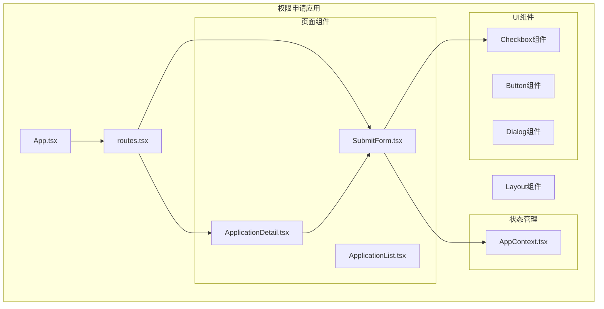
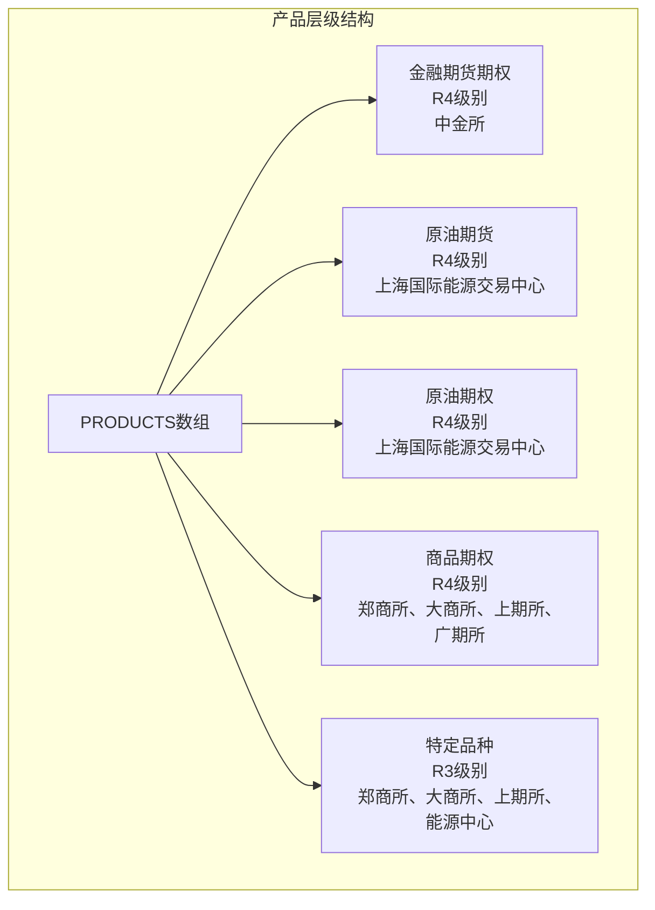
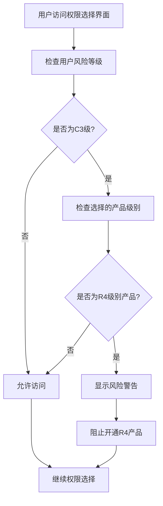
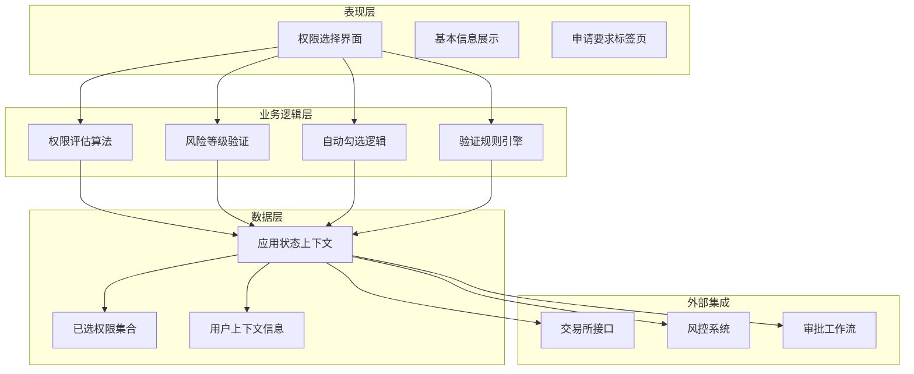
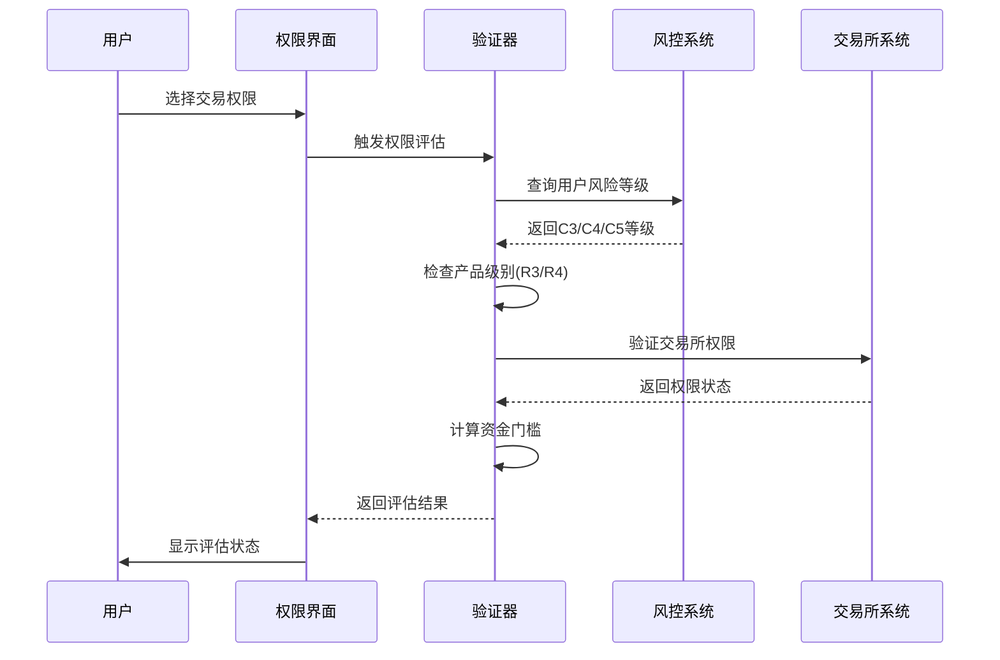
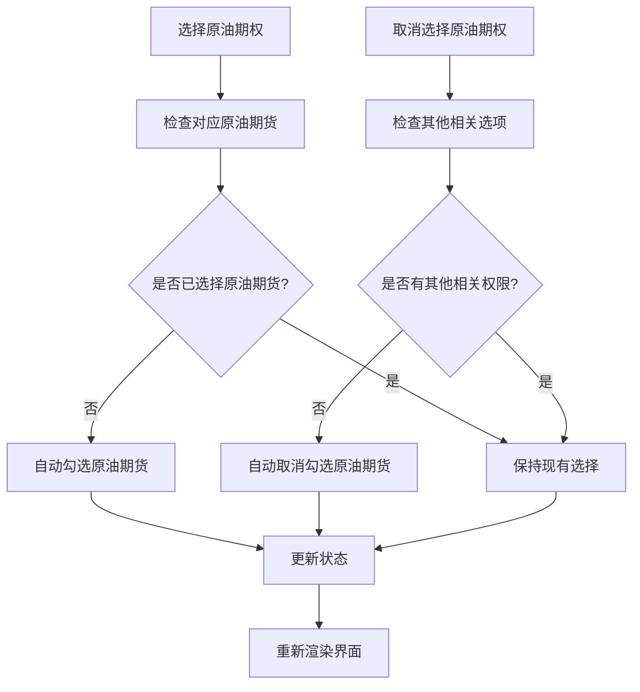
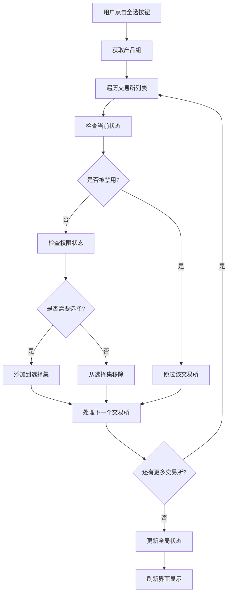
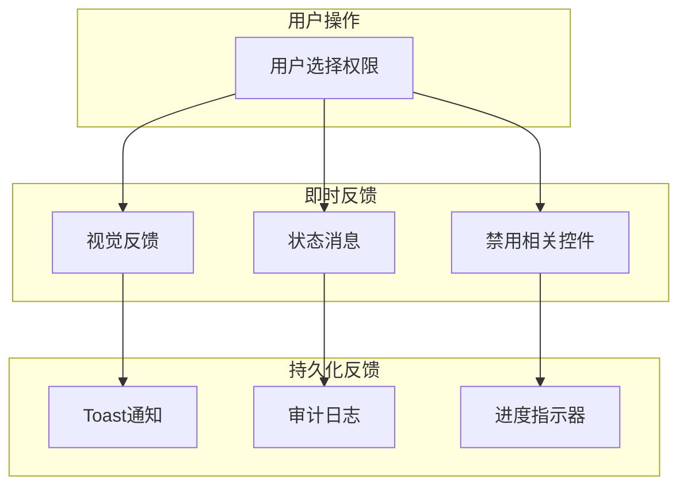
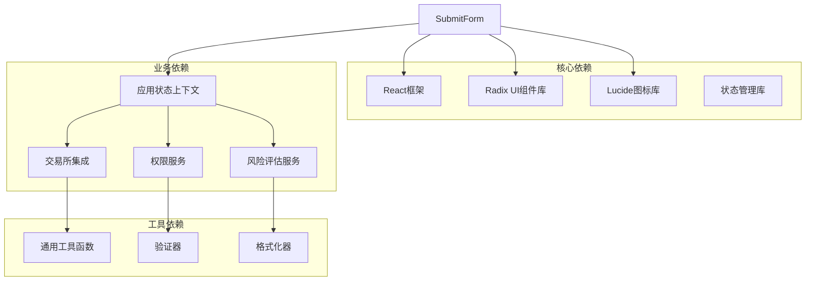

# 权限选择界面

<cite>
**本文档引用的文件**
- [SubmitForm.tsx](file://src/app/pages/SubmitForm.tsx)
- [ApplicationDetail.tsx](file://src/app/pages/ApplicationDetail.tsx)
- [AppContext.tsx](file://src/app/store/AppContext.tsx)
- [checkbox.tsx](file://src/app/components/ui/checkbox.tsx)
- [routes.tsx](file://src/app/routes.tsx)
- [App.tsx](file://src/app/App.tsx)
</cite>

## 目录
1. [简介](#简介)
2. [项目结构](#项目结构)
3. [核心组件](#核心组件)
4. [架构概览](#架构概览)
5. [详细组件分析](#详细组件分析)
6. [依赖关系分析](#依赖关系分析)
7. [性能考虑](#性能考虑)
8. [故障排除指南](#故障排除指南)
9. [结论](#结论)

## 简介

权限选择界面是交易权限管理系统的核心模块，负责为用户提供直观的权限申请流程。该界面实现了多层次的权限选择结构，包括产品分类级别（金融期货期权、原油期货、商品期权等）和交易所级别的精细控制。

该系统特别针对C3用户的风险等级限制进行了专门处理，确保R4级别品种（如金融期货、原油等）的开通条件得到正确验证。同时，系统内置了智能的自动勾选/取消勾选逻辑，例如原油期权会自动勾选对应的原油期货权限。

## 项目结构

权限选择界面采用React + TypeScript构建，遵循模块化设计原则：

**图表来源**
- [App.tsx:1-6](file://src/app/App.tsx#L1-L6)
- [routes.tsx:1-38](file://src/app/routes.tsx#L1-L38)

**章节来源**
- [App.tsx:1-6](file://src/app/App.tsx#L1-L6)
- [routes.tsx:1-38](file://src/app/routes.tsx#L1-L38)

## 核心组件

### 产品层级结构设计

系统定义了完整的交易产品层级结构，从宏观的产品分类到具体的交易所级别：

**图表来源**
- [SubmitForm.tsx:13-55](file://src/app/pages/SubmitForm.tsx#L13-L55)

### 风险等级限制机制

系统实现了严格的C3用户R4品种限制机制：

**图表来源**
- [SubmitForm.tsx:236-241](file://src/app/pages/SubmitForm.tsx#L236-L241)

**章节来源**
- [SubmitForm.tsx:13-55](file://src/app/pages/SubmitForm.tsx#L13-L55)
- [SubmitForm.tsx:236-241](file://src/app/pages/SubmitForm.tsx#L236-L241)

## 架构概览

权限选择界面采用分层架构设计，确保各组件职责明确：

**图表来源**
- [SubmitForm.tsx:57-747](file://src/app/pages/SubmitForm.tsx#L57-L747)
- [AppContext.tsx:6-27](file://src/app/store/AppContext.tsx#L6-L27)

## 详细组件分析

### 权限评估算法

系统实现了复杂的权限评估算法，用于确定用户的申请资格：

**图表来源**
- [SubmitForm.tsx:94-113](file://src/app/pages/SubmitForm.tsx#L94-L113)

### 自动勾选/取消勾选逻辑

系统实现了智能的权限关联逻辑：

**图表来源**
- [SubmitForm.tsx:268-314](file://src/app/pages/SubmitForm.tsx#L268-L314)

### 全选功能实现

全选功能提供了便捷的批量操作体验：

**图表来源**
- [SubmitForm.tsx:268-314](file://src/app/pages/SubmitForm.tsx#L268-L314)

**章节来源**
- [SubmitForm.tsx:57-747](file://src/app/pages/SubmitForm.tsx#L57-L747)

### 用户交互反馈机制

系统提供了多层次的用户交互反馈：

**图表来源**
- [SubmitForm.tsx:383-451](file://src/app/pages/SubmitForm.tsx#L383-L451)
- [SubmitForm.tsx:548-617](file://src/app/pages/SubmitForm.tsx#L548-L617)

**章节来源**
- [SubmitForm.tsx:383-451](file://src/app/pages/SubmitForm.tsx#L383-L451)
- [SubmitForm.tsx:548-617](file://src/app/pages/SubmitForm.tsx#L548-L617)

## 依赖关系分析

权限选择界面的依赖关系体现了清晰的关注点分离：

**图表来源**
- [SubmitForm.tsx:1-12](file://src/app/pages/SubmitForm.tsx#L1-L12)
- [AppContext.tsx:1-64](file://src/app/store/AppContext.tsx#L1-L64)

**章节来源**
- [SubmitForm.tsx:1-12](file://src/app/pages/SubmitForm.tsx#L1-L12)
- [AppContext.tsx:1-64](file://src/app/store/AppContext.tsx#L1-L64)

## 性能考虑

权限选择界面在设计时充分考虑了性能优化：

### 渲染优化策略
- **虚拟滚动**: 对于大量交易所选项，使用虚拟滚动技术减少DOM节点数量
- **懒加载**: 权限数据按需加载，避免一次性渲染所有内容
- **状态缓存**: 使用React.memo和useMemo优化重渲染

### 数据流优化
- **局部状态**: 将高频更新的状态隔离在组件内部
- **批量更新**: 使用React的批处理机制合并多次状态更新
- **防抖处理**: 对搜索和筛选操作实施防抖机制

### 内存管理
- **垃圾回收**: 及时清理不再使用的事件监听器
- **资源释放**: 组件卸载时释放定时器和订阅

## 故障排除指南

### 常见问题诊断

**权限选择异常**
1. 检查用户风险等级是否正确设置
2. 验证交易所权限映射关系
3. 确认资金门槛计算逻辑

**界面显示问题**
1. 检查CSS类名冲突
2. 验证响应式布局适配
3. 确认主题切换兼容性

**状态同步问题**
1. 检查全局状态更新机制
2. 验证本地存储同步
3. 确认服务器端状态一致性

**章节来源**
- [SubmitForm.tsx:701-744](file://src/app/pages/SubmitForm.tsx#L701-L744)

## 结论

权限选择界面通过精心设计的层级结构和智能逻辑，为用户提供了直观高效的权限申请体验。系统不仅满足了监管要求，还通过自动化功能提升了用户体验。

关键优势包括：
- **层次化的权限结构**: 从产品分类到交易所级别的精细化控制
- **智能风险控制**: 针对C3用户的R4品种限制机制
- **自动化功能**: 智能的权限关联和状态同步
- **用户友好界面**: 清晰的反馈机制和操作指导

该界面为后续的功能扩展和维护奠定了坚实的基础，能够适应不断变化的监管要求和业务需求。