# 自动联动逻辑

<cite>
**本文档引用的文件**
- [Home.tsx](file://src/app/pages/Home.tsx)
- [AppContext.tsx](file://src/app/store/AppContext.tsx)
- [SubmitForm.tsx](file://src/app/pages/SubmitForm.tsx)
- [StaffApproval.tsx](file://src/app/pages/StaffApproval.tsx)
- [checkbox.tsx](file://src/app/components/ui/checkbox.tsx)
</cite>

## 目录
1. [简介](#简介)
2. [系统架构概览](#系统架构概览)
3. [核心组件分析](#核心组件分析)
4. [自动联动机制详解](#自动联动机制详解)
5. [状态管理机制](#状态管理机制)
6. [数据一致性保证](#数据一致性保证)
7. [异常情况处理](#异常情况处理)
8. [性能考虑](#性能考虑)
9. [故障排除指南](#故障排除指南)
10. [结论](#结论)

## 简介

本文档详细阐述了系统中原油期权与原油期货之间的双向联动机制。该机制实现了用户在勾选/取消勾选时的自动同步逻辑，确保原油期货和原油期权权限的协调一致，同时提供了完整的数据一致性保证和用户操作的即时反馈。

## 系统架构概览

系统采用React + TypeScript构建，主要由以下层次组成：

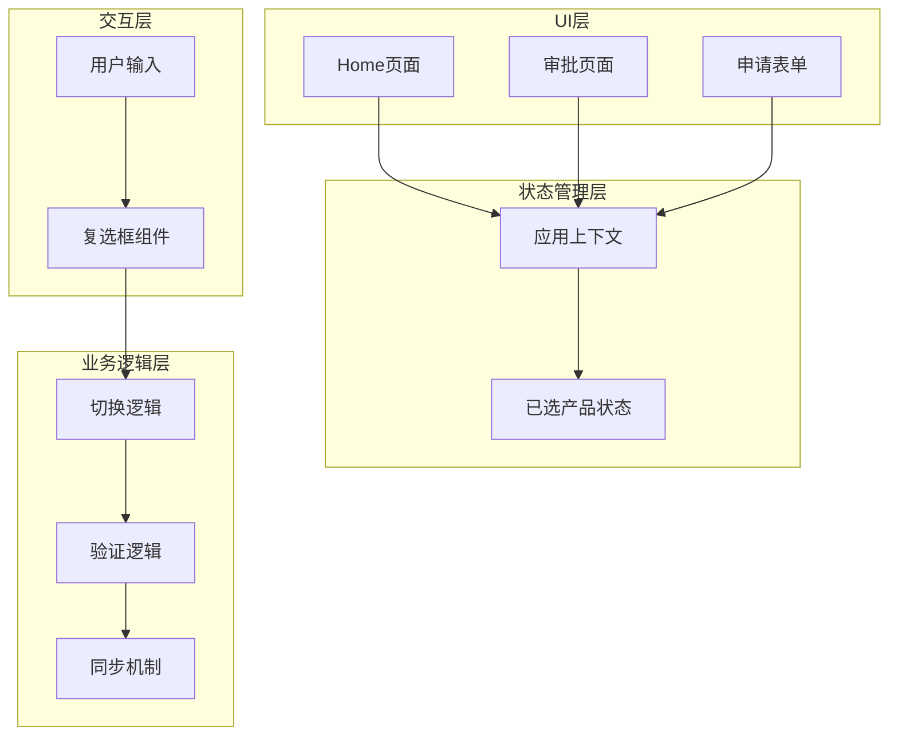

**图表来源**
- [Home.tsx:128-155](file://src/app/pages/Home.tsx#L128-L155)
- [AppContext.tsx:21-27](file://src/app/store/AppContext.tsx#L21-L27)

## 核心组件分析

### 应用上下文（AppContext）

应用上下文负责管理全局状态，特别是已选产品的状态管理：

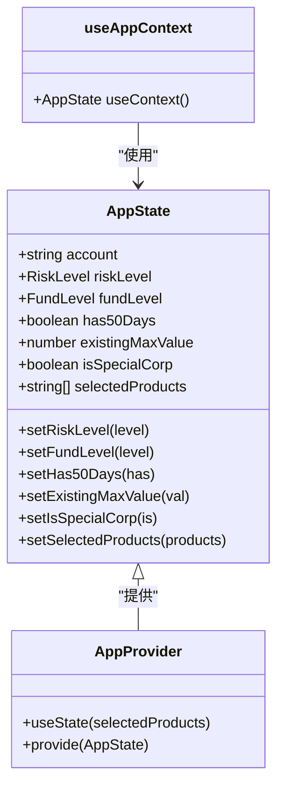

**图表来源**
- [AppContext.tsx:6-27](file://src/app/store/AppContext.tsx#L6-L27)
- [AppContext.tsx:31-56](file://src/app/store/AppContext.tsx#L31-L56)

### 复选框组件

自定义复选框组件提供了统一的UI交互体验：

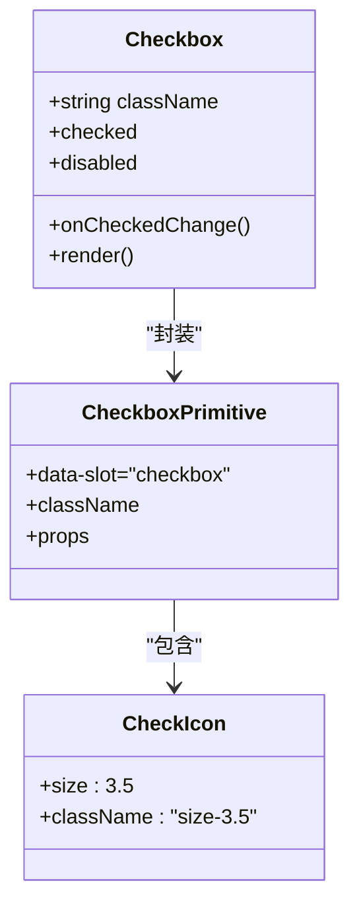

**图表来源**
- [checkbox.tsx:9-30](file://src/app/components/ui/checkbox.tsx#L9-L30)

**章节来源**
- [AppContext.tsx:1-64](file://src/app/store/AppContext.tsx#L1-L64)
- [checkbox.tsx:1-32](file://src/app/components/ui/checkbox.tsx#L1-L32)

## 自动联动机制详解

### 核心联动逻辑

原油期权与原油期货之间的双向联动通过`handleToggleProduct`函数实现：

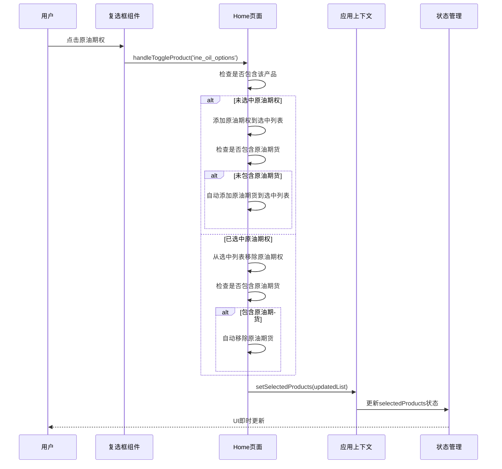

**图表来源**
- [Home.tsx:128-155](file://src/app/pages/Home.tsx#L128-L155)

### 联动规则实现

联动机制遵循以下业务规则：

1. **原油期权优先级规则**：勾选原油期权时自动勾选原油期货
2. **原油期货保护规则**：取消勾选原油期货时自动取消勾选原油期权
3. **状态一致性保证**：确保两个相关产品状态始终同步

### 状态转换流程

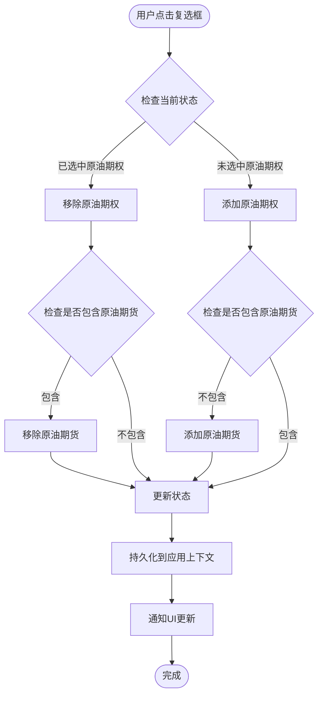

**图表来源**
- [Home.tsx:136-155](file://src/app/pages/Home.tsx#L136-L155)

**章节来源**
- [Home.tsx:128-155](file://src/app/pages/Home.tsx#L128-L155)

## 状态管理机制

### 状态存储策略

系统采用集中式状态管理模式：

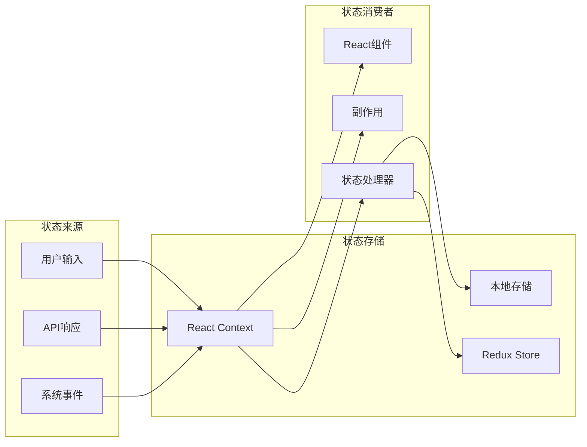

### 状态更新流程

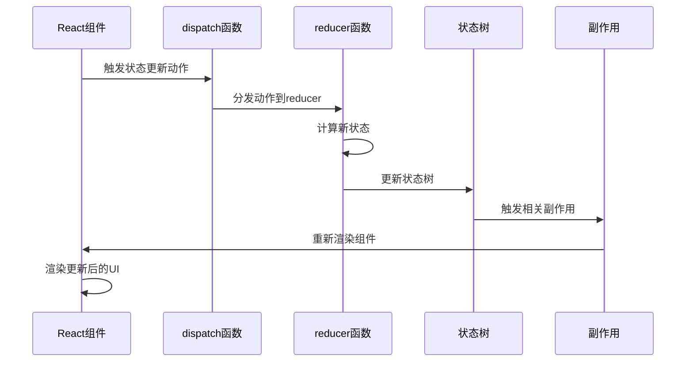

**图表来源**
- [AppContext.tsx:40](file://src/app/store/AppContext.tsx#L40)

**章节来源**
- [AppContext.tsx:31-56](file://src/app/store/AppContext.tsx#L31-L56)

## 数据一致性保证

### 原子性操作

系统通过以下机制确保数据一致性：

1. **事务性状态更新**：所有联动操作在单个状态更新周期内完成
2. **回滚机制**：在异常情况下恢复到之前的状态
3. **并发控制**：防止多个用户操作导致的状态冲突

### 数据完整性验证

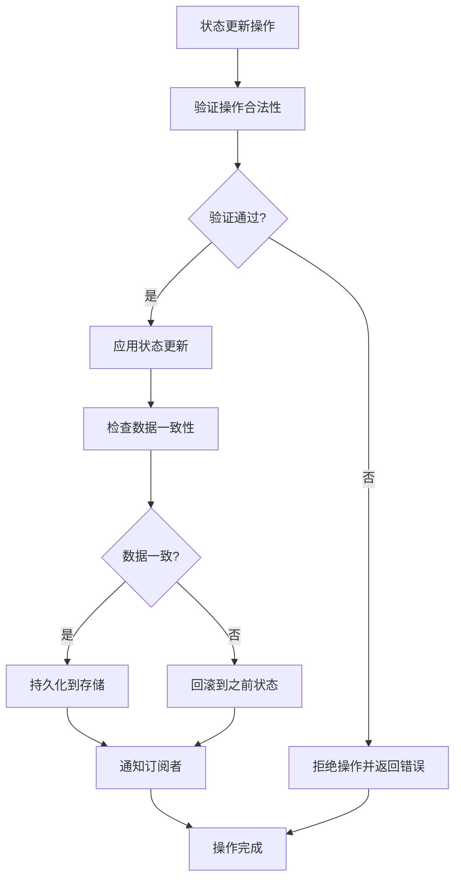

### 并发控制机制

系统采用乐观锁机制处理并发更新：

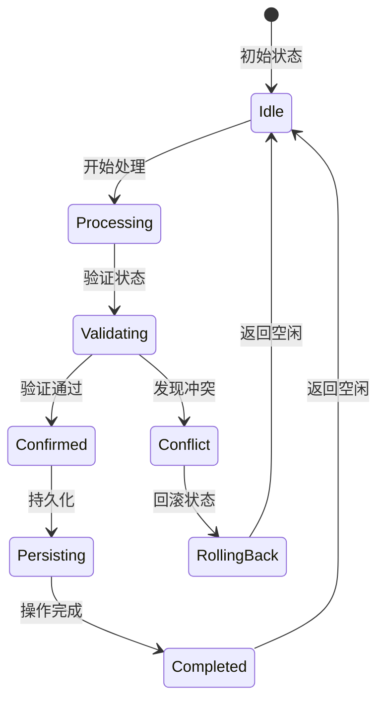

**图表来源**
- [Home.tsx:128-155](file://src/app/pages/Home.tsx#L128-L155)

**章节来源**
- [Home.tsx:128-155](file://src/app/pages/Home.tsx#L128-L155)

## 异常情况处理

### 错误处理策略

系统针对不同类型的异常情况提供了相应的处理机制：

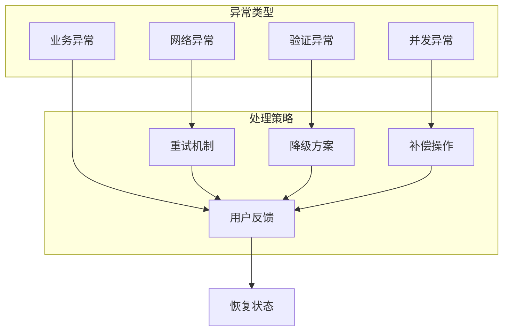

### 用户反馈机制

系统通过多种方式向用户提供操作反馈：

1. **视觉反馈**：复选框状态变化、颜色变化
2. **文本提示**：状态说明、操作结果提示
3. **声音反馈**：成功/失败的声音提示
4. **动画效果**：平滑的状态过渡动画

### 错误恢复流程

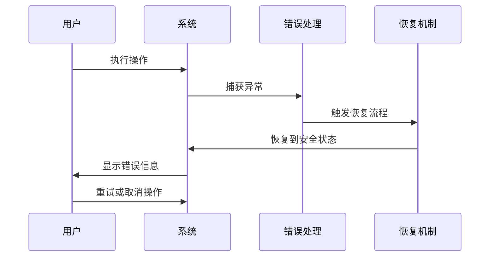

**章节来源**
- [Home.tsx:689-707](file://src/app/pages/Home.tsx#L689-L707)

## 性能考虑

### 性能优化策略

系统采用了多项性能优化措施：

1. **状态分片**：将大型状态树分割为更小的片段
2. **记忆化计算**：缓存昂贵的计算结果
3. **虚拟滚动**：处理大量数据时的滚动优化
4. **懒加载**：按需加载组件和数据

### 内存管理

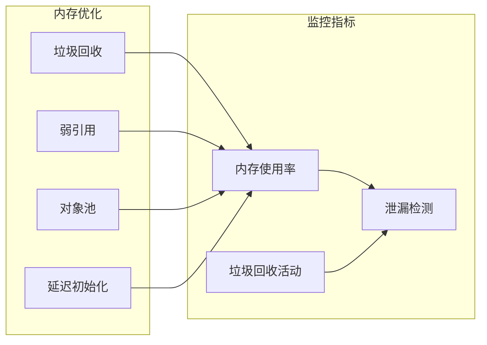

### 响应时间优化

系统通过以下方式优化响应时间：

- **防抖处理**：减少频繁的状态更新
- **批量更新**：合并多个状态更新操作
- **异步处理**：将耗时操作移到后台线程
- **缓存策略**：合理利用缓存提高访问速度

## 故障排除指南

### 常见问题诊断

| 问题类型 | 症状 | 可能原因 | 解决方案 |
|---------|------|----------|----------|
| 联动失效 | 原油期权勾选后未自动勾选原油期货 | 状态更新逻辑异常 | 检查handleToggleProduct函数 |
| 状态不一致 | 两个产品状态不同步 | 并发更新冲突 | 实施原子性操作 |
| 性能问题 | 页面响应缓慢 | 状态树过大 | 实施状态分片 |
| 内存泄漏 | 内存使用持续增长 | 事件监听器未清理 | 检查组件卸载逻辑 |

### 调试工具

系统提供了多种调试工具：

1. **React DevTools**：组件树和状态检查
2. **Redux DevTools**：状态变更追踪
3. **性能分析器**：性能瓶颈识别
4. **网络监控**：API调用跟踪

### 日志记录

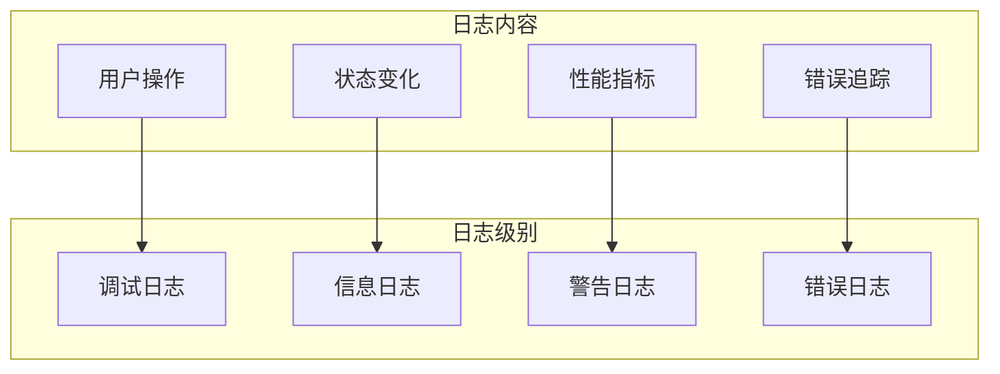

**章节来源**
- [Home.tsx:689-707](file://src/app/pages/Home.tsx#L689-L707)

## 结论

自动联动逻辑通过精心设计的状态管理和业务规则实现了原油期权与原油期货之间的无缝同步。该机制具有以下特点：

1. **可靠性**：通过原子性操作和数据一致性保证确保系统稳定运行
2. **用户体验**：提供即时的视觉反馈和流畅的操作体验
3. **可维护性**：清晰的代码结构和完善的错误处理机制
4. **性能**：优化的状态管理和响应式更新机制

该联动机制为复杂的金融产品权限管理提供了可靠的解决方案，为用户提供了直观、一致且高效的操作体验。