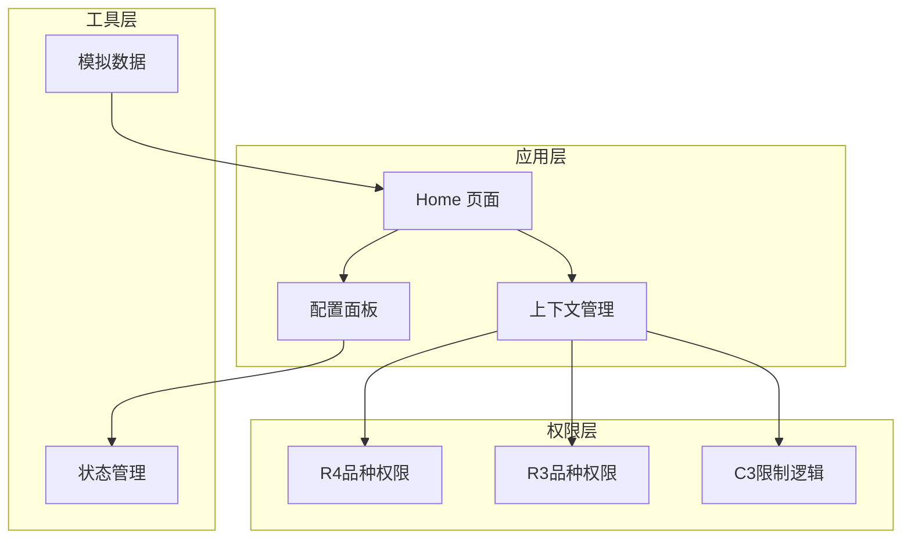
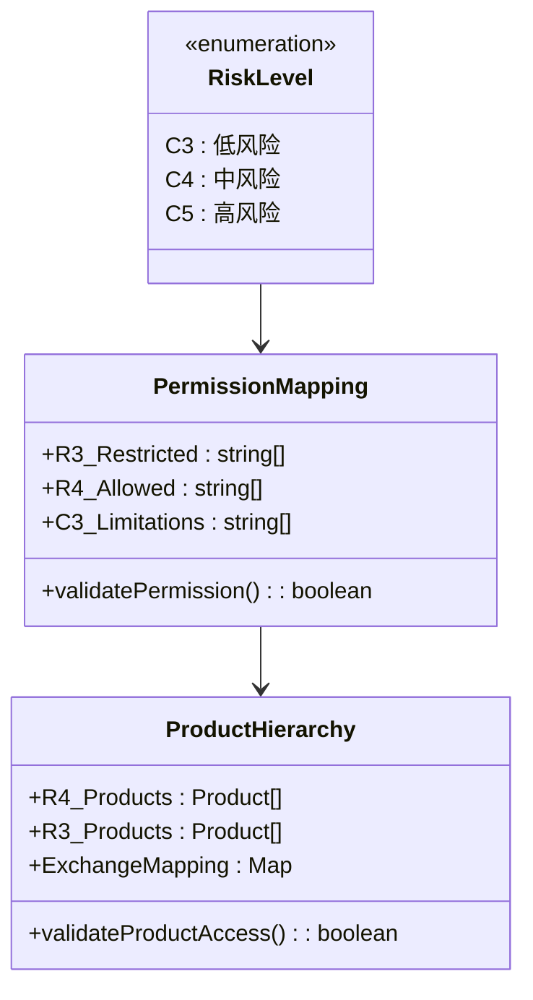
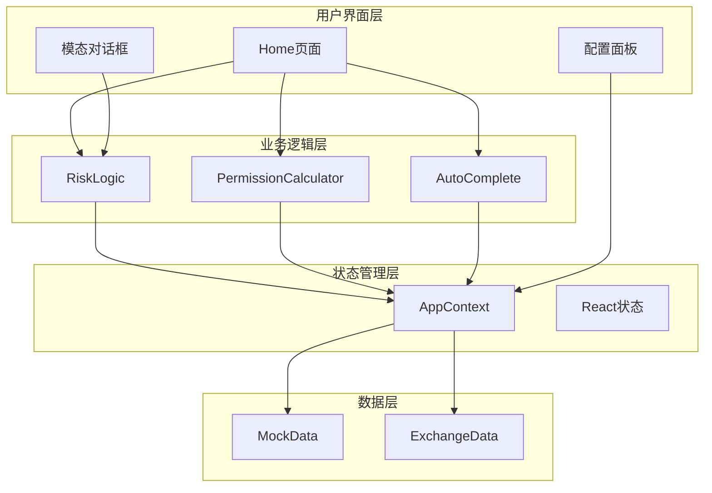
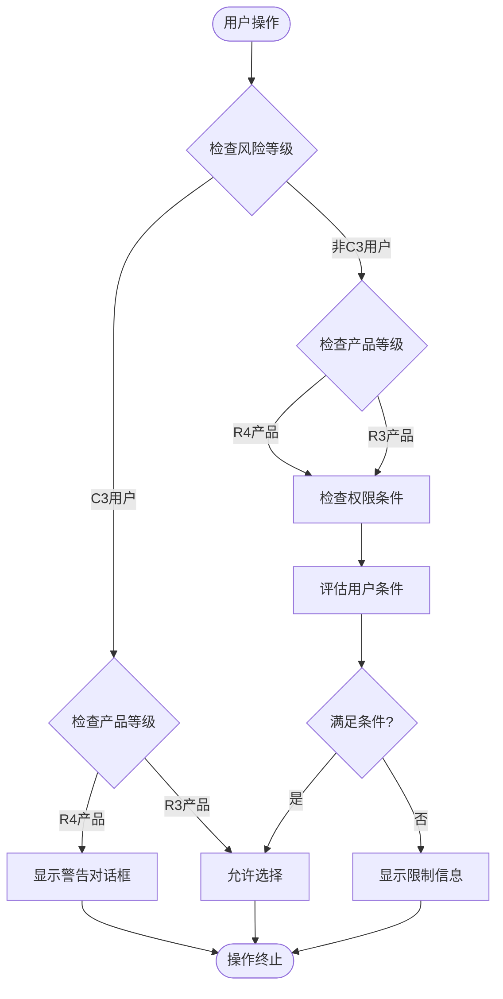
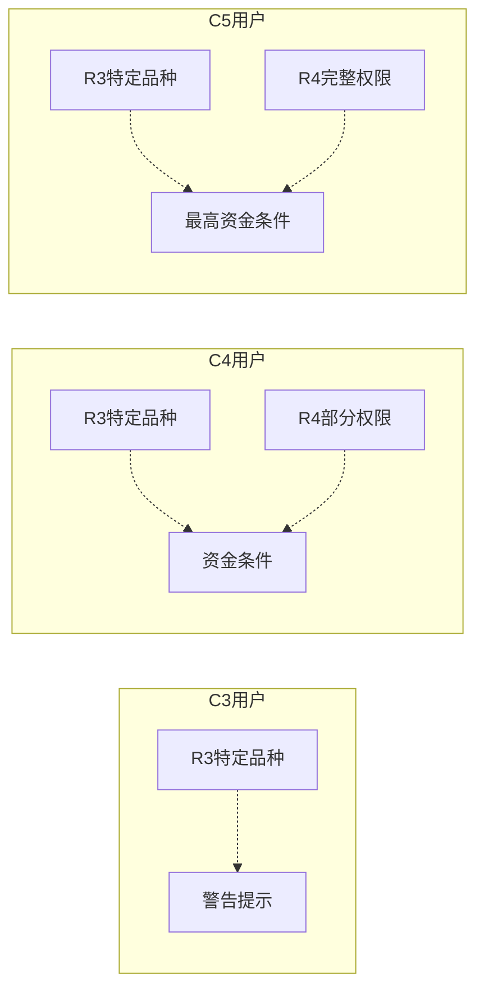
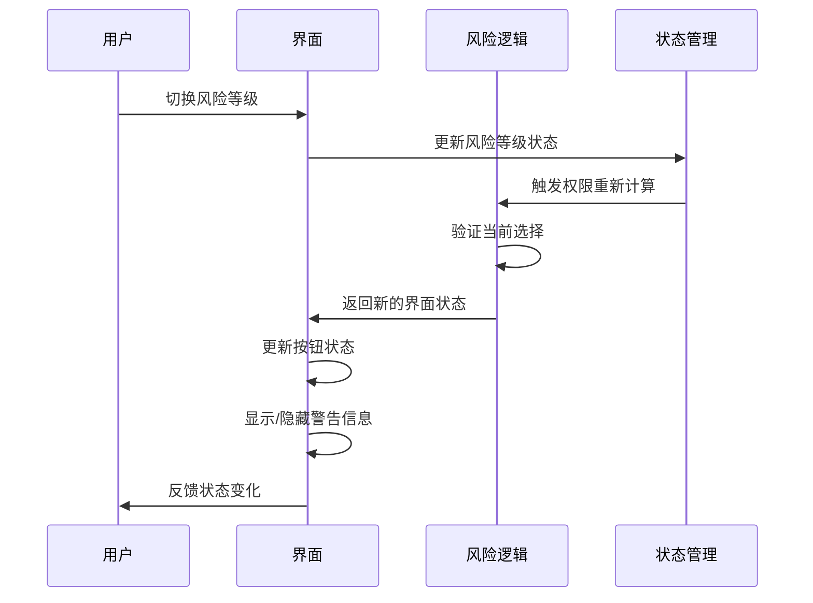
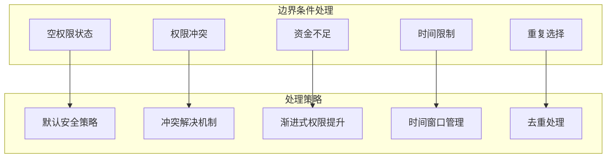
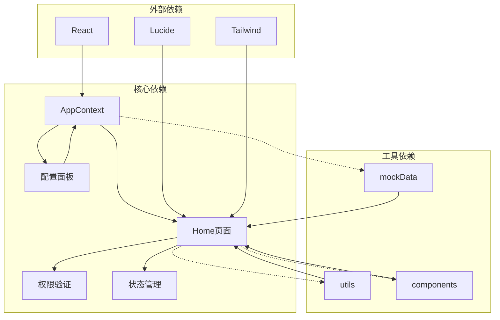

# 风险控制机制

<cite>
**本文档引用的文件**
- [Home.tsx](file://src/app/pages/Home.tsx)
- [Home.tsx](file://permission_apply/src/app/pages/Home.tsx)
- [AppContext.tsx](file://src/app/store/AppContext.tsx)
- [AppContext.tsx](file://permission_apply/src/app/store/AppContext.tsx)
- [ConfigPanel.tsx](file://src/app/components/ConfigPanel.tsx)
- [ConfigPanel.tsx](file://permission_apply/src/app/components/ConfigPanel.tsx)
- [mockData.ts](file://src/app/utils/mockData.ts)
- [mockData.ts](file://permission_apply/src/app/utils/mockData.ts)
</cite>

## 目录
1. [引言](#引言)
2. [项目结构](#项目结构)
3. [核心组件](#核心组件)
4. [架构概览](#架构概览)
5. [详细组件分析](#详细组件分析)
6. [依赖关系分析](#依赖关系分析)
7. [性能考虑](#性能考虑)
8. [故障排除指南](#故障排除指南)
9. [结论](#结论)

## 引言

本文档深入分析了管理平台中的风险控制机制，重点关注C3用户对R4品种的限制逻辑、风险等级与可选权限的映射关系，以及系统如何根据用户适当性等级动态调整界面状态。该机制通过多层次的风控策略确保合规性和用户体验的平衡。

## 项目结构

项目采用模块化架构设计，主要包含以下核心模块：

**图表来源**
- [Home.tsx:17-59](file://src/app/pages/Home.tsx#L17-L59)
- [AppContext.tsx:6-27](file://src/app/store/AppContext.tsx#L6-L27)

**章节来源**
- [Home.tsx:1-809](file://src/app/pages/Home.tsx#L1-L809)
- [AppContext.tsx:1-64](file://src/app/store/AppContext.tsx#L1-L64)

## 核心组件

### 风险等级定义与映射

系统定义了完整的风险等级体系，包括C3、C4、C5三个等级，每个等级对应不同的权限范围：

**图表来源**
- [AppContext.tsx:3-4](file://src/app/store/AppContext.tsx#L3-L4)
- [Home.tsx:17-59](file://src/app/pages/Home.tsx#L17-L59)

### 权限控制核心逻辑

系统实现了基于风险等级的权限控制机制，主要包含以下关键功能：

1. **C3用户限制逻辑**：C3等级用户仅能访问R3级别的特定品种
2. **R4品种访问控制**：R4级别品种需要更高的风险承受能力
3. **动态权限计算**：根据用户现有权限和风险等级动态计算可选权限

**章节来源**
- [Home.tsx:107-116](file://src/app/pages/Home.tsx#L107-L116)
- [Home.tsx:128-155](file://src/app/pages/Home.tsx#L128-L155)

## 架构概览

系统采用分层架构设计，确保风险控制逻辑的清晰分离和可维护性：

**图表来源**
- [Home.tsx:61-82](file://src/app/pages/Home.tsx#L61-L82)
- [AppContext.tsx:31-56](file://src/app/store/AppContext.tsx#L31-L56)

## 详细组件分析

### C3用户限制逻辑实现

C3用户的权限限制是整个风控机制的核心，系统通过多重验证确保合规性：

**图表来源**
- [Home.tsx:128-132](file://src/app/pages/Home.tsx#L128-L132)
- [Home.tsx:345-350](file://src/app/pages/Home.tsx#L345-L350)

#### 关键实现细节

1. **实时权限验证**：每次用户尝试选择R4产品时，系统立即验证C3限制
2. **智能警告机制**：通过模态对话框提供详细的解释和指导
3. **自动状态更新**：根据验证结果动态更新界面状态

**章节来源**
- [Home.tsx:128-132](file://src/app/pages/Home.tsx#L128-L132)
- [Home.tsx:689-707](file://src/app/pages/Home.tsx#L689-L707)

### 风险等级与可选权限映射

系统建立了完整的风险等级与权限映射关系：

| 风险等级 | 可访问产品 | 权限描述 | 限制条件 |
|---------|-----------|----------|----------|
| C3 | R3特定品种 | 基础权限 | 仅限R3产品 |
| C4 | R3 + 部分R4 | 中等权限 | 需要一定资金门槛 |
| C5 | R3 + R4完整 | 高级权限 | 需要最高资金门槛 |

**图表来源**
- [Home.tsx:111-116](file://src/app/pages/Home.tsx#L111-L116)
- [Home.tsx:381-384](file://src/app/pages/Home.tsx#L381-L384)

**章节来源**
- [Home.tsx:111-116](file://src/app/pages/Home.tsx#L111-L116)
- [Home.tsx:381-384](file://src/app/pages/Home.tsx#L381-L384)

### 动态界面状态调整

系统能够根据用户适当性等级动态调整界面状态，提供个性化的用户体验：

**图表来源**
- [Home.tsx:345-350](file://src/app/pages/Home.tsx#L345-L350)
- [ConfigPanel.tsx:77-88](file://src/app/components/ConfigPanel.tsx#L77-L88)

#### 界面状态变化机制

1. **按钮状态动态更新**：根据权限验证结果启用/禁用操作按钮
2. **警告信息智能显示**：当用户处于受限状态时显示相应的提示信息
3. **布局自适应调整**：根据用户权限动态调整界面布局和交互元素

**章节来源**
- [Home.tsx:345-350](file://src/app/pages/Home.tsx#L345-L350)
- [ConfigPanel.tsx:77-88](file://src/app/components/ConfigPanel.tsx#L77-L88)

### 风险控制实现方式

系统采用了多层防护机制确保风险控制的有效性：

#### 1. 前端验证层
- 实时权限检查
- 用户操作拦截
- 界面状态同步

#### 2. 业务逻辑层
- 权限计算算法
- 风险评估模型
- 条件验证逻辑

#### 3. 数据层
- 模拟数据源
- 状态持久化
- 错误处理机制

**章节来源**
- [Home.tsx:175-198](file://src/app/pages/Home.tsx#L175-L198)
- [mockData.ts:1-12](file://src/app/utils/mockData.ts#L1-L12)

### 边界条件处理

系统针对各种边界情况进行了专门处理：

**图表来源**
- [Home.tsx:118-126](file://src/app/pages/Home.tsx#L118-L126)
- [Home.tsx:134-154](file://src/app/pages/Home.tsx#L134-L154)

#### 关键边界条件

1. **空权限状态**：当用户没有任何权限时的默认行为
2. **权限冲突检测**：防止同时选择互斥的权限组合
3. **资金门槛验证**：确保用户满足最低资金要求
4. **时间限制管理**：处理权限申请的时间窗口
5. **重复选择处理**：避免重复添加相同的权限

**章节来源**
- [Home.tsx:118-126](file://src/app/pages/Home.tsx#L118-L126)
- [Home.tsx:134-154](file://src/app/pages/Home.tsx#L134-L154)

### 用户体验优化措施

系统在保证安全性的同时，注重用户体验的优化：

#### 1. 智能提示系统
- 实时状态反馈
- 清晰的操作指导
- 友好的错误信息

#### 2. 自动化处理
- 权限组合自动计算
- 状态同步更新
- 操作结果即时反馈

#### 3. 个性化界面
- 根据用户等级调整界面
- 动态内容展示
- 适应性布局设计

**章节来源**
- [Home.tsx:689-707](file://src/app/pages/Home.tsx#L689-L707)
- [Home.tsx:720-774](file://src/app/pages/Home.tsx#L720-L774)

## 依赖关系分析

系统各组件之间的依赖关系如下：

**图表来源**
- [AppContext.tsx:31-56](file://src/app/store/AppContext.tsx#L31-L56)
- [Home.tsx:1-16](file://src/app/pages/Home.tsx#L1-L16)

### 组件耦合度分析

系统采用了松耦合的设计原则：

- **低耦合高内聚**：各组件职责明确，相互依赖最小化
- **接口抽象**：通过上下文提供统一的数据访问接口
- **状态集中管理**：所有状态通过AppContext进行统一管理

**章节来源**
- [AppContext.tsx:29-56](file://src/app/store/AppContext.tsx#L29-L56)
- [Home.tsx:61-64](file://src/app/pages/Home.tsx#L61-L64)

## 性能考虑

系统在性能方面采取了多项优化措施：

### 1. 计算复杂度优化
- 权限计算采用O(n)时间复杂度
- 状态更新批量处理减少重渲染
- 缓存机制避免重复计算

### 2. 内存使用优化
- 状态精简存储
- 事件处理器复用
- 组件生命周期优化

### 3. 网络请求优化
- 模拟数据本地缓存
- 批量数据处理
- 按需加载机制

## 故障排除指南

### 常见问题及解决方案

#### 1. 权限验证失败
**症状**：用户无法选择某些权限
**原因**：风险等级不满足要求或资金门槛不足
**解决方案**：
- 检查用户风险等级设置
- 验证资金状况是否满足要求
- 确认现有权限状态

#### 2. 界面状态异常
**症状**：按钮状态与预期不符
**原因**：状态同步问题或计算错误
**解决方案**：
- 刷新页面重新加载状态
- 检查权限计算逻辑
- 验证状态管理器工作正常

#### 3. 警告信息显示错误
**症状**：错误的警告提示出现
**原因**：条件判断逻辑错误
**解决方案**：
- 检查风险等级判断条件
- 验证权限映射关系
- 确认边界条件处理正确

**章节来源**
- [Home.tsx:689-707](file://src/app/pages/Home.tsx#L689-L707)
- [Home.tsx:720-774](file://src/app/pages/Home.tsx#L720-L774)

## 结论

该风险控制机制通过多层次的设计实现了有效的风险管理和良好的用户体验。系统的核心优势包括：

1. **完整性**：覆盖了从C3到C5的完整风险等级体系
2. **实时性**：前端实时验证确保操作的安全性
3. **智能化**：自动化的权限计算和状态管理
4. **可扩展性**：模块化设计便于功能扩展和维护

通过精心设计的边界条件处理和用户体验优化，系统在确保合规性的同时提供了流畅的用户交互体验。该机制为金融期货权限申请提供了可靠的技术支撑，有效降低了操作风险和合规风险。