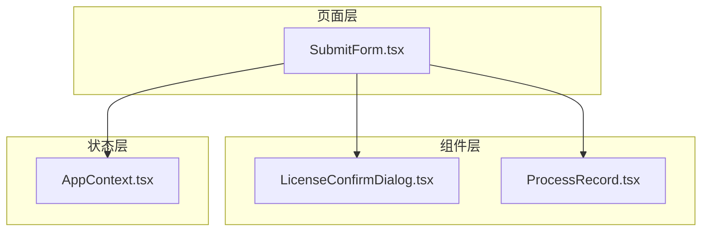
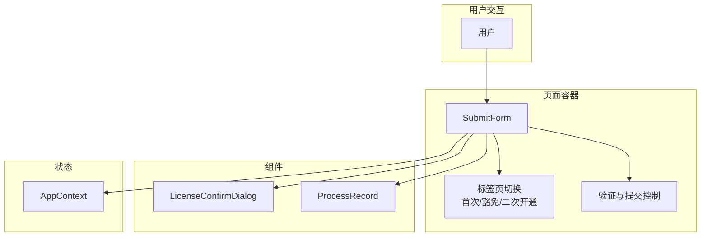
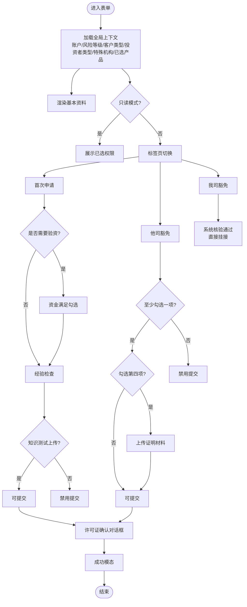
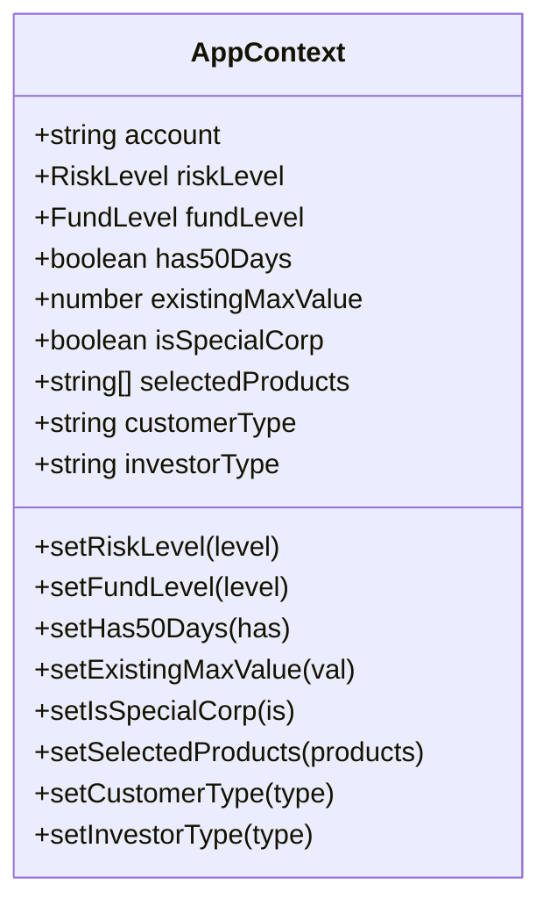
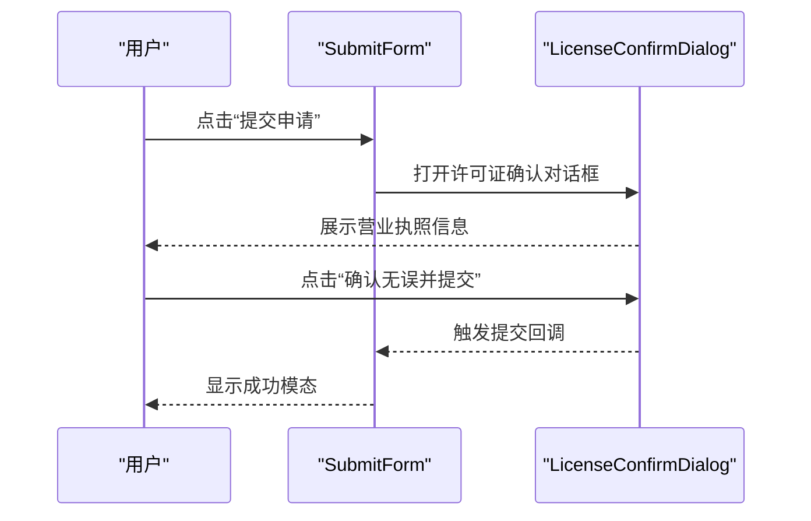
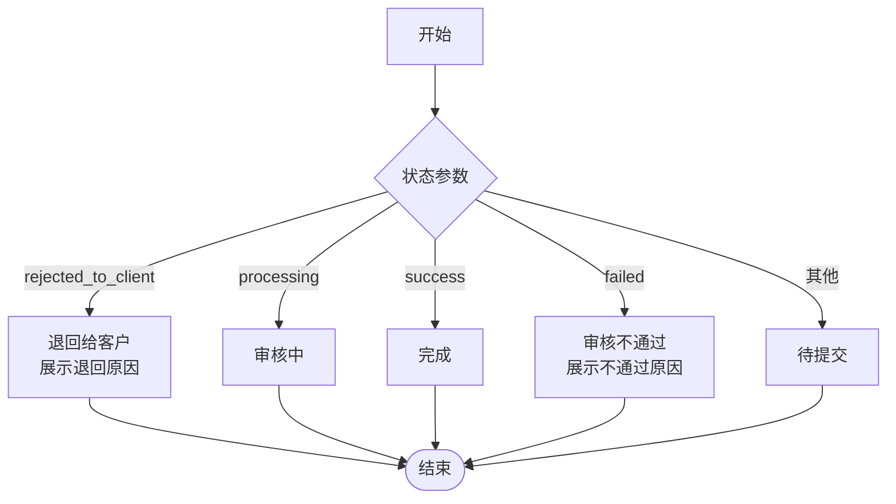
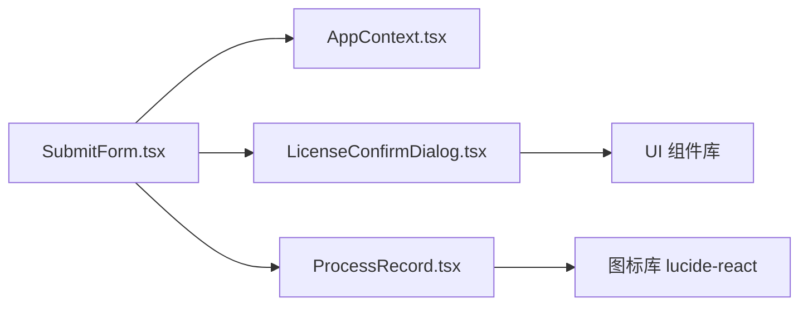

# 申请表单设计

<cite>
**本文档引用的文件**
- [SubmitForm.tsx](file://permission_apply/src/app/pages/SubmitForm.tsx)
- [AppContext.tsx](file://permission_apply/src/app/store/AppContext.tsx)
- [LicenseConfirmDialog.tsx](file://permission_apply/src/app/components/LicenseConfirmDialog.tsx)
- [ProcessRecord.tsx](file://permission_apply/src/app/components/ProcessRecord.tsx)
- [SubmitForm.tsx](file://src/app/pages/SubmitForm.tsx)
- [AppContext.tsx](file://src/app/store/AppContext.tsx)
- [LicenseConfirmDialog.tsx](file://src/app/components/LicenseConfirmDialog.tsx)
- [ProcessRecord.tsx](file://src/app/components/ProcessRecord.tsx)
</cite>

## 目录
1. [简介](#简介)
2. [项目结构](#项目结构)
3. [核心组件](#核心组件)
4. [架构总览](#架构总览)
5. [详细组件分析](#详细组件分析)
6. [依赖关系分析](#依赖关系分析)
7. [性能考量](#性能考量)
8. [故障排除指南](#故障排除指南)
9. [结论](#结论)
10. [附录](#附录)

## 简介
本文件面向“交易权限开通申请表单”的设计与实现，围绕以下目标展开：  
- 表单字段设计理念与验证规则  
- 用户交互体验优化策略  
- 基本资料展示、权限选择界面、业务声明确认、附件上传等模块的实现细节  
- 表单状态管理、自动填充逻辑、字段联动关系、错误处理机制  
- 设计原则、用户体验优化与可访问性建议  

该表单支持三种申请模式：首次申请、他司豁免、我司豁免（二次开通），并提供流程记录与许可证确认对话框，确保合规性与可追溯性。

## 项目结构
表单位于前端应用的页面层与组件层，配合全局上下文管理器实现跨页面的状态共享与联动。核心目录与文件如下：
- 页面层：SubmitForm.tsx（页面容器，承载所有业务逻辑）
- 组件层：LicenseConfirmDialog.tsx（许可证确认对话框）、ProcessRecord.tsx（流程记录）
- 全局状态：AppContext.tsx（React Context，提供账户、风险等级、客户类型、投资者类型、特殊机构标识、已选产品等）

图表来源
- [SubmitForm.tsx:57-747](file://permission_apply/src/app/pages/SubmitForm.tsx#L57-L747)
- [AppContext.tsx:1-64](file://permission_apply/src/app/store/AppContext.tsx#L1-L64)
- [LicenseConfirmDialog.tsx:1-65](file://permission_apply/src/app/components/LicenseConfirmDialog.tsx#L1-L65)
- [ProcessRecord.tsx:1-56](file://permission_apply/src/app/components/ProcessRecord.tsx#L1-L56)

章节来源
- [SubmitForm.tsx:57-747](file://permission_apply/src/app/pages/SubmitForm.tsx#L57-L747)
- [AppContext.tsx:1-64](file://permission_apply/src/app/store/AppContext.tsx#L1-L64)
- [LicenseConfirmDialog.tsx:1-65](file://permission_apply/src/app/components/LicenseConfirmDialog.tsx#L1-L65)
- [ProcessRecord.tsx:1-56](file://permission_apply/src/app/components/ProcessRecord.tsx#L1-L56)

## 核心组件
- SubmitForm 页面：负责三大板块的渲染与交互控制（基本资料、权限选择、补充证明材料/申请类型），以及提交流程的触发与状态切换。
- AppContext 上下文：提供账户、风险等级、客户类型、投资者类型、特殊机构标识、已选产品等全局状态，驱动表单内容与联动。
- LicenseConfirmDialog 对话框：在提交前弹出，展示并确认营业执照信息，保障合规性。
- ProcessRecord 流程记录：展示申请状态流转，支持退回原因、审核中、完成、失败等多种状态。

章节来源
- [SubmitForm.tsx:57-747](file://permission_apply/src/app/pages/SubmitForm.tsx#L57-L747)
- [AppContext.tsx:6-27](file://permission_apply/src/app/store/AppContext.tsx#L6-L27)
- [LicenseConfirmDialog.tsx:13-64](file://permission_apply/src/app/components/LicenseConfirmDialog.tsx#L13-L64)
- [ProcessRecord.tsx:4-55](file://permission_apply/src/app/components/ProcessRecord.tsx#L4-L55)

## 架构总览
表单采用“页面容器 + 组件化 + 全局状态”的分层架构：
- 页面容器负责业务编排、状态管理、条件渲染与提交控制
- 组件层提供可复用的对话框与记录展示
- 全局状态通过 Context 提供账户与产品维度的数据，驱动字段联动与只读展示

图表来源
- [SubmitForm.tsx:57-747](file://permission_apply/src/app/pages/SubmitForm.tsx#L57-L747)
- [AppContext.tsx:31-56](file://permission_apply/src/app/store/AppContext.tsx#L31-L56)
- [LicenseConfirmDialog.tsx:13-64](file://permission_apply/src/app/components/LicenseConfirmDialog.tsx#L13-L64)
- [ProcessRecord.tsx:4-55](file://permission_apply/src/app/components/ProcessRecord.tsx#L4-L55)

## 详细组件分析

### 页面容器：SubmitForm
- 功能职责
  - 基本资料展示：基于 AppContext 的账户、风险等级、客户类型、投资者类型、特殊机构标识等信息渲染
  - 权限选择展示：在只读模式下展示已选产品与交易所映射
  - 申请类型选择：标签页切换“首次申请/他司豁免/我司豁免”
  - 首次申请要求：资金门槛、交易经验、知识测试
  - 他司豁免：多选项勾选与证明材料上传
  - 我司豁免：系统自动核验后的直接挂接提示
  - 提交流程：许可证确认对话框 -> 成功模态 -> 进度跳转
  - 调试面板：用于强制显示不同验资需求与状态联动

- 关键状态与联动
  - 已选产品决定是否显示不同验资门槛（100万/50万/10万）
  - 首次申请：资金满足、交易经验满足、知识测试上传三者同时满足才可提交
  - 他司豁免：至少勾选一项，若勾选第四项则必须上传证明材料
  - 只读模式：禁用交互，展示已选权限与最终状态

- 字段联动关系
  - 产品选择 → 验资门槛联动 → 动态表格（5日资金明细）
  - 经验满足（实盘/仿真）→ 交易经历状态显示
  - 知识测试上传 → 附件状态显示与提交按钮启用

- 错误处理机制
  - 提交按钮按条件禁用，避免不合规提交
  - 退回状态展示退回原因，便于用户重新提交
  - 附件上传失败或格式不符时，保持当前状态并提示

图表来源
- [SubmitForm.tsx:57-747](file://permission_apply/src/app/pages/SubmitForm.tsx#L57-L747)

章节来源
- [SubmitForm.tsx:57-747](file://permission_apply/src/app/pages/SubmitForm.tsx#L57-L747)

### 全局状态：AppContext
- 提供字段
  - 账户、风险等级、客户类型、投资者类型、特殊机构标识
  - 已选产品数组，驱动权限展示与验资门槛判断
  - 资产规模、50日经验、历史最大值等扩展字段（当前示例中未使用）
- 使用方式
  - 页面通过 useAppContext 获取上下文数据
  - 作为只读展示与条件渲染的基础

图表来源
- [AppContext.tsx:6-27](file://permission_apply/src/app/store/AppContext.tsx#L6-L27)

章节来源
- [AppContext.tsx:6-27](file://permission_apply/src/app/store/AppContext.tsx#L6-L27)

### 组件：LicenseConfirmDialog
- 功能：在提交前弹窗确认营业执照信息，包含图片预览与关键信息卡片
- 交互：支持“联系客户经理”提示与“确认无误并提交”两个动作
- 合规性：确保最终提交前的资质信息准确

图表来源
- [SubmitForm.tsx:115-117](file://permission_apply/src/app/pages/SubmitForm.tsx#L115-L117)
- [LicenseConfirmDialog.tsx:13-64](file://permission_apply/src/app/components/LicenseConfirmDialog.tsx#L13-L64)

章节来源
- [LicenseConfirmDialog.tsx:13-64](file://permission_apply/src/app/components/LicenseConfirmDialog.tsx#L13-L64)

### 组件：ProcessRecord
- 功能：展示申请流程记录，支持多种状态（退回给客户、审核中、完成、失败）
- 交互：在只读模式下展示历史状态，在默认状态下展示“待提交”
- 信息：支持退回原因、提交时间等参数传入

图表来源
- [ProcessRecord.tsx:4-55](file://permission_apply/src/app/components/ProcessRecord.tsx#L4-L55)

章节来源
- [ProcessRecord.tsx:4-55](file://permission_apply/src/app/components/ProcessRecord.tsx#L4-L55)

## 依赖关系分析
- SubmitForm 依赖 AppContext 提供的数据与状态，用于条件渲染与只读展示
- SubmitForm 依赖 LicenseConfirmDialog 与 ProcessRecord 组件，分别承担提交前确认与流程记录展示
- LicenseConfirmDialog 依赖通用 UI 组件（Dialog、Button、ImageWithFallback）与通知库（sonner）
- ProcessRecord 依赖图标库（lucide-react）与通用 UI 组件（Dialog）

图表来源
- [SubmitForm.tsx:1-12](file://permission_apply/src/app/pages/SubmitForm.tsx#L1-L12)
- [LicenseConfirmDialog.tsx:1-6](file://permission_apply/src/app/components/LicenseConfirmDialog.tsx#L1-L6)
- [ProcessRecord.tsx:1-2](file://permission_apply/src/app/components/ProcessRecord.tsx#L1-L2)

章节来源
- [SubmitForm.tsx:1-12](file://permission_apply/src/app/pages/SubmitForm.tsx#L1-L12)
- [LicenseConfirmDialog.tsx:1-6](file://permission_apply/src/app/components/LicenseConfirmDialog.tsx#L1-L6)
- [ProcessRecord.tsx:1-2](file://permission_apply/src/app/components/ProcessRecord.tsx#L1-L2)

## 性能考量
- 渲染优化
  - 使用 React.memo 化（如适用）减少不必要的重渲染
  - 将大表格与复杂列表拆分为独立组件，按需渲染
- 状态管理
  - 将高频更新的状态（如附件上传状态）局部化，避免影响全局 Context
- 交互反馈
  - 使用骨架屏或占位符提升长列表加载体验
  - 对提交按钮增加防抖与加载态，避免重复提交

## 故障排除指南
- 提交按钮不可用
  - 首次申请：检查资金满足、交易经验满足、知识测试上传三项是否全部满足
  - 他司豁免：检查是否至少勾选一项；若勾选第四项，需上传证明材料
- 附件上传问题
  - 确认文件格式与大小符合要求；上传后检查状态是否变为“已上传”
- 流程记录异常
  - 检查传入的状态参数与退回原因；确保状态值与组件支持的枚举一致
- 许可证确认对话框
  - 确认对话框打开状态与回调正确绑定；检查“联系客户经理”提示是否触发通知

章节来源
- [SubmitForm.tsx:111-117](file://permission_apply/src/app/pages/SubmitForm.tsx#L111-L117)
- [ProcessRecord.tsx:4-55](file://permission_apply/src/app/components/ProcessRecord.tsx#L4-L55)
- [LicenseConfirmDialog.tsx:13-64](file://permission_apply/src/app/components/LicenseConfirmDialog.tsx#L13-L64)

## 结论
该申请表单通过清晰的页面容器、可复用组件与全局状态管理，实现了从基本资料到权限申请再到流程记录的完整闭环。其设计遵循“条件驱动渲染、状态驱动提交、合规前置确认”的原则，既提升了用户体验，也强化了业务合规性与可追溯性。建议后续在性能与可访问性方面持续优化，并完善自动化测试覆盖。

## 附录
- 设计原则
  - 以用户为中心：简化步骤、明确指引、及时反馈
  - 合规优先：提交前确认、流程可追溯、退回原因清晰
  - 可扩展性：组件化与状态解耦，便于新增场景
- 用户体验优化策略
  - 分步引导：通过标签页与步骤指示降低认知负担
  - 即时反馈：状态变化与按钮启用/禁用即时反映
  - 可访问性：语义化标签、键盘导航、高对比度与屏幕阅读器友好
- 可访问性考虑
  - 使用语义化 HTML 结构与 aria-label
  - 提供键盘可操作性与焦点管理
  - 图片提供替代文本，图标提供可读说明