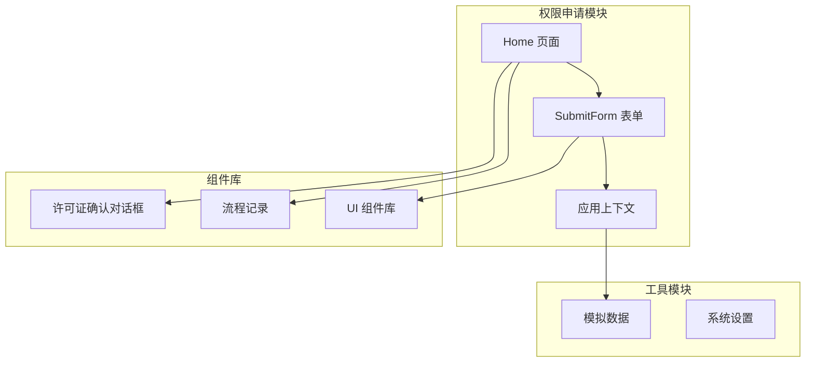
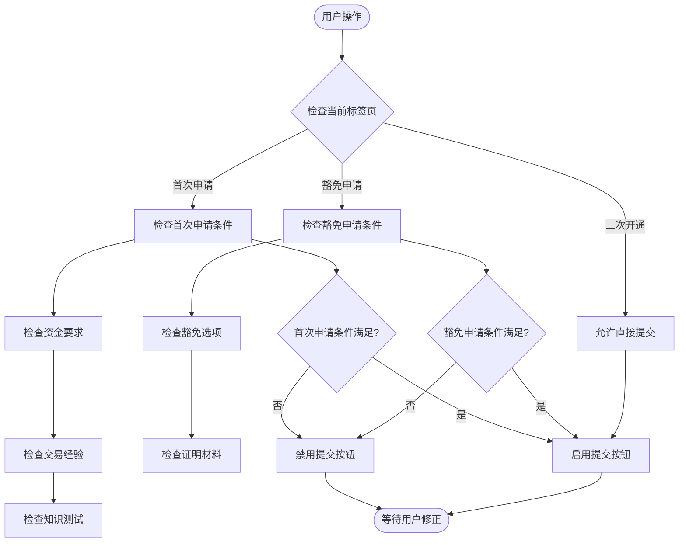
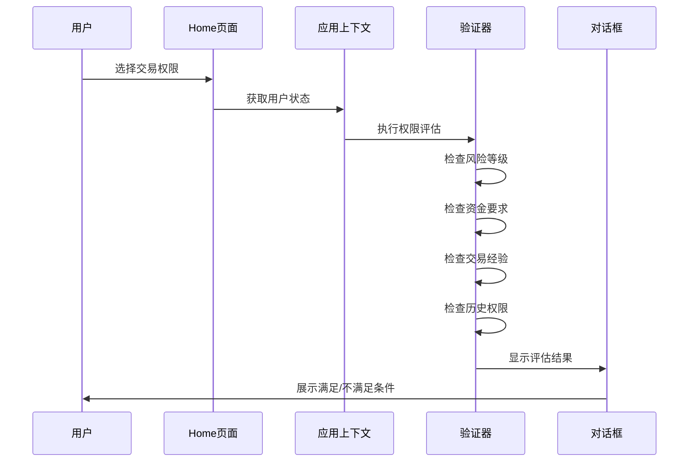
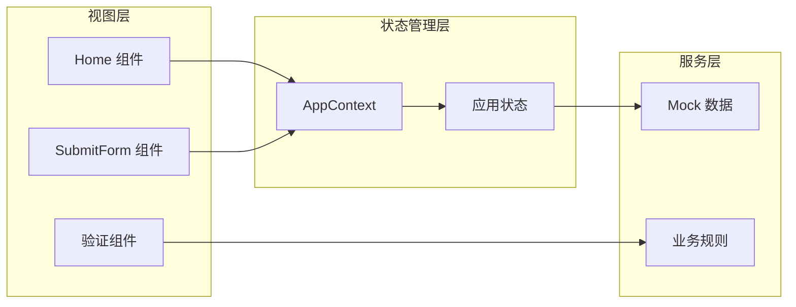
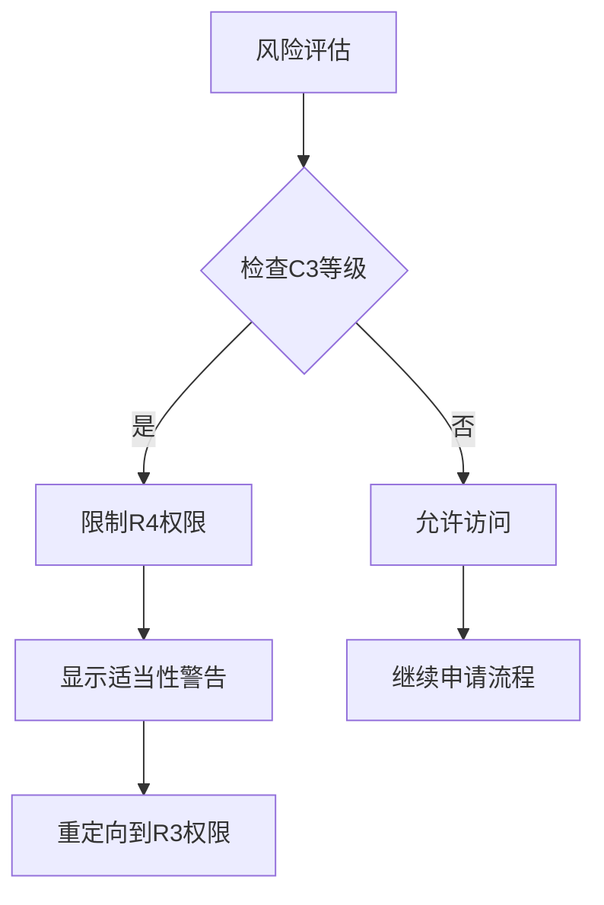
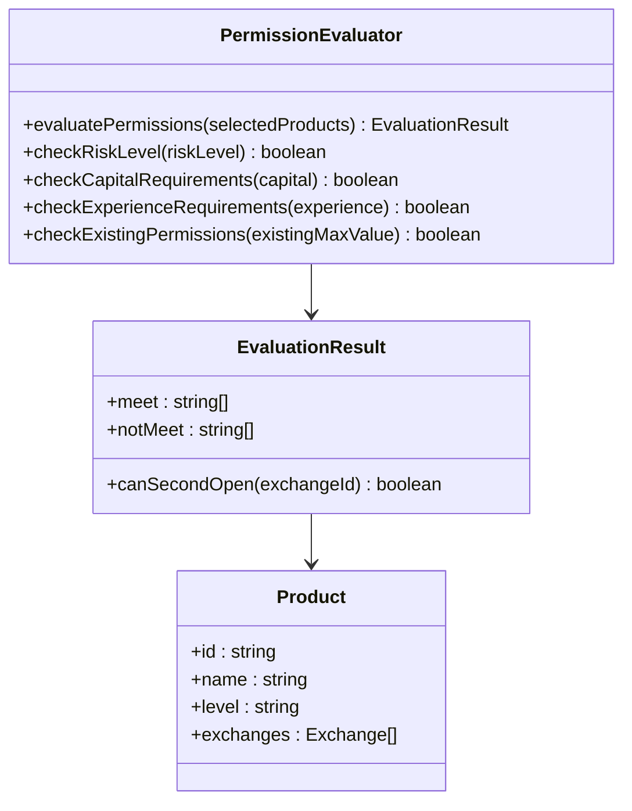
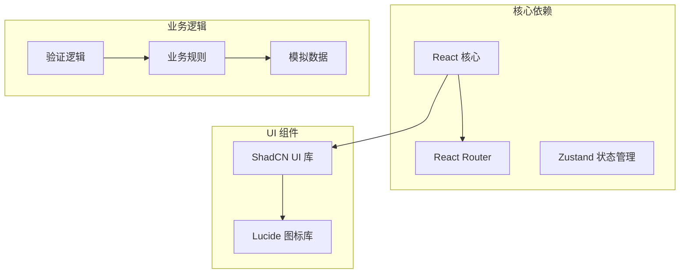

# 表单验证流程

<cite>
**本文档引用的文件**
- [SubmitForm.tsx](file://permission_apply/src/app/pages/SubmitForm.tsx)
- [Home.tsx](file://permission_apply/src/app/pages/Home.tsx)
- [AppContext.tsx](file://permission_apply/src/app/store/AppContext.tsx)
- [LicenseConfirmDialog.tsx](file://permission_apply/src/app/components/LicenseConfirmDialog.tsx)
- [mockData.ts](file://permission_apply/src/app/utils/mockData.ts)
- [SystemSettings.tsx](file://permission_apply/src/app/pages/SystemSettings.tsx)
- [ApplicationDetail.tsx](file://permission_apply/src/app/pages/ApplicationDetail.tsx)
- [SubmitForm.tsx](file://src/app/pages/SubmitForm.tsx)
- [Home.tsx](file://src/app/pages/Home.tsx)
- [AppContext.tsx](file://src/app/store/AppContext.tsx)
- [LicenseConfirmDialog.tsx](file://src/app/components/LicenseConfirmDialog.tsx)
- [mockData.ts](file://src/app/utils/mockData.ts)
</cite>

## 目录
1. [简介](#简介)
2. [项目结构](#项目结构)
3. [核心组件](#核心组件)
4. [架构概览](#架构概览)
5. [详细组件分析](#详细组件分析)
6. [依赖关系分析](#依赖关系分析)
7. [性能考虑](#性能考虑)
8. [故障排除指南](#故障排除指南)
9. [结论](#结论)

## 简介

本文档详细阐述了权限申请平台的表单验证流程，重点分析了提交按钮的启用/禁用逻辑、权限评估算法、风险等级匹配检查以及业务规则验证。该系统通过多层次的验证机制确保交易权限申请的合规性和准确性。

## 项目结构

权限申请平台采用模块化架构设计，主要包含以下核心模块：

**图表来源**
- [Home.tsx:61-820](file://permission_apply/src/app/pages/Home.tsx#L61-L820)
- [SubmitForm.tsx:57-747](file://permission_apply/src/app/pages/SubmitForm.tsx#L57-L747)
- [AppContext.tsx:1-36](file://permission_apply/src/app/store/AppContext.tsx#L1-L36)

## 核心组件

### 提交按钮启用/禁用逻辑

提交按钮的禁用状态基于多个验证条件的综合判断：

**图表来源**
- [SubmitForm.tsx:111-113](file://permission_apply/src/app/pages/SubmitForm.tsx#L111-L113)
- [SubmitForm.tsx:655-658](file://permission_apply/src/app/pages/SubmitForm.tsx#L655-L658)

### 权限评估算法

系统实现了复杂的权限评估算法，用于判断用户的交易权限申请是否满足条件：

**图表来源**
- [Home.tsx:199-231](file://permission_apply/src/app/pages/Home.tsx#L199-L231)
- [AppContext.tsx:6-27](file://permission_apply/src/app/store/AppContext.tsx#L6-L27)

**章节来源**
- [SubmitForm.tsx:111-113](file://permission_apply/src/app/pages/SubmitForm.tsx#L111-L113)
- [Home.tsx:199-231](file://permission_apply/src/app/pages/Home.tsx#L199-L231)

## 架构概览

系统采用React Hooks和Context API构建，实现了状态管理和组件通信的解耦：

**图表来源**
- [AppContext.tsx:31-36](file://permission_apply/src/app/store/AppContext.tsx#L31-L36)
- [Home.tsx:61-820](file://permission_apply/src/app/pages/Home.tsx#L61-L820)

## 详细组件分析

### 首次申请验证流程

首次申请流程包含了严格的资金、经验和知识测试验证：

#### 资金要求验证

系统根据用户选择的交易品种自动计算所需的资金门槛：

| 交易品种 | 资金门槛 | 验证条件 |
|---------|---------|---------|
| 原油期货/期权 | 100万元 | 连续5个交易日每日≥100万 |
| 金融期货期权 | 50万元 | 连续5个交易日每日≥50万 |
| 商品期权/特定品种 | 10万元 | 连续5个交易日每日≥10万 |

#### 交易经验验证

系统同时接受实盘和仿真交易经验的验证：

- **实盘交易**：近三年至少10笔成交
- **仿真交易**：累计至少10个交易日和20笔成交

#### 知识测试验证

用户必须通过期货基础知识测试，成绩≥80分，并上传成绩单。

**章节来源**
- [SubmitForm.tsx:94-113](file://permission_apply/src/app/pages/SubmitForm.tsx#L94-L113)
- [SubmitForm.tsx:383-544](file://permission_apply/src/app/pages/SubmitForm.tsx#L383-L544)

### 豁免申请验证流程

豁免申请适用于以下情况的客户：

1. 已开通股票期权账户
2. 在其他期货公司开通中金所编码
3. 在其他期货公司开通能源中心编码
4. 在其他期货公司开通其他品种

豁免申请需要用户提供相应的证明材料。

**章节来源**
- [SubmitForm.tsx:548-617](file://permission_apply/src/app/pages/SubmitForm.tsx#L548-L617)

### 风险等级匹配检查

系统实施严格的风险等级匹配机制：

**图表来源**
- [Home.tsx:128-133](file://permission_apply/src/app/pages/Home.tsx#L128-L133)
- [Home.tsx:345-351](file://permission_apply/src/app/pages/Home.tsx#L345-L351)

**章节来源**
- [Home.tsx:128-133](file://permission_apply/src/app/pages/Home.tsx#L128-L133)
- [Home.tsx:345-351](file://permission_apply/src/app/pages/Home.tsx#L345-L351)

### 特殊客户类型验证

针对特殊客户类型（特法客户）实施额外的验证要求：

- 产品合同变更确认
- 受益所有人信息确认
- 内控制度文件上传

**章节来源**
- [Home.tsx:538-569](file://permission_apply/src/app/pages/Home.tsx#L538-L569)
- [Home.tsx:571-591](file://permission_apply/src/app/pages/Home.tsx#L571-L591)

### 权限评估算法实现

系统实现了智能的权限评估算法，能够自动判断用户的申请条件：

**图表来源**
- [Home.tsx:199-231](file://permission_apply/src/app/pages/Home.tsx#L199-L231)
- [Home.tsx:175-198](file://permission_apply/src/app/pages/Home.tsx#L175-L198)

**章节来源**
- [Home.tsx:199-231](file://permission_apply/src/app/pages/Home.tsx#L199-L231)
- [Home.tsx:175-198](file://permission_apply/src/app/pages/Home.tsx#L175-L198)

## 依赖关系分析

系统各组件之间的依赖关系如下：

**图表来源**
- [AppContext.tsx:1-36](file://permission_apply/src/app/store/AppContext.tsx#L1-L36)
- [mockData.ts:1-13](file://permission_apply/src/app/utils/mockData.ts#L1-L13)

**章节来源**
- [AppContext.tsx:1-36](file://permission_apply/src/app/store/AppContext.tsx#L1-L36)
- [mockData.ts:1-13](file://permission_apply/src/app/utils/mockData.ts#L1-L13)

## 性能考虑

系统在设计时充分考虑了性能优化：

1. **状态管理优化**：使用React Context避免不必要的组件重渲染
2. **条件渲染**：根据用户选择动态显示相关验证项
3. **懒加载**：大组件按需加载，减少初始包体积
4. **缓存策略**：对常用数据进行内存缓存

## 故障排除指南

### 常见问题及解决方案

#### 提交按钮始终禁用

**可能原因**：
- 未选择任何交易权限
- 风险等级不匹配
- 必需的验证条件未满足

**解决方法**：
1. 检查交易权限选择
2. 确认风险等级评估
3. 完成所有必需的验证步骤

#### 风险等级警告弹窗

当用户尝试申请R4级别权限但风险等级为C3时，系统会显示适当的性警告：

**处理流程**：
1. 显示风险等级警告对话框
2. 提供重新评估选项
3. 或者申请R3级别权限

**章节来源**
- [Home.tsx:700-718](file://permission_apply/src/app/pages/Home.tsx#L700-L718)
- [Home.tsx:690-707](file://permission_apply/src/app/pages/Home.tsx#L690-L707)

### 错误处理机制

系统实现了完善的错误处理机制：

1. **输入验证**：实时验证用户输入的有效性
2. **状态同步**：确保组件状态与业务逻辑保持一致
3. **用户反馈**：提供清晰的错误提示和指导信息
4. **恢复机制**：支持表单重置和状态恢复

**章节来源**
- [SubmitForm.tsx:666-699](file://permission_apply/src/app/pages/SubmitForm.tsx#L666-L699)
- [LicenseConfirmDialog.tsx:13-65](file://permission_apply/src/app/components/LicenseConfirmDialog.tsx#L13-L65)

## 结论

权限申请平台的表单验证流程设计严谨，通过多层次的验证机制确保了交易权限申请的安全性和合规性。系统不仅实现了基础的表单验证功能，还集成了复杂的风险评估算法、权限匹配检查和业务规则验证，为用户提供了一个完整、可靠的权限申请体验。

通过模块化的架构设计和清晰的状态管理，系统具备良好的可维护性和扩展性，能够适应不断变化的业务需求和监管要求。