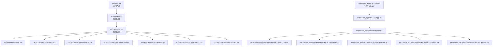
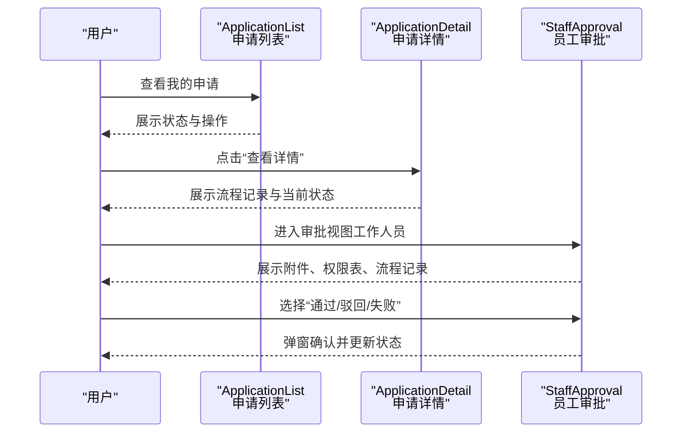
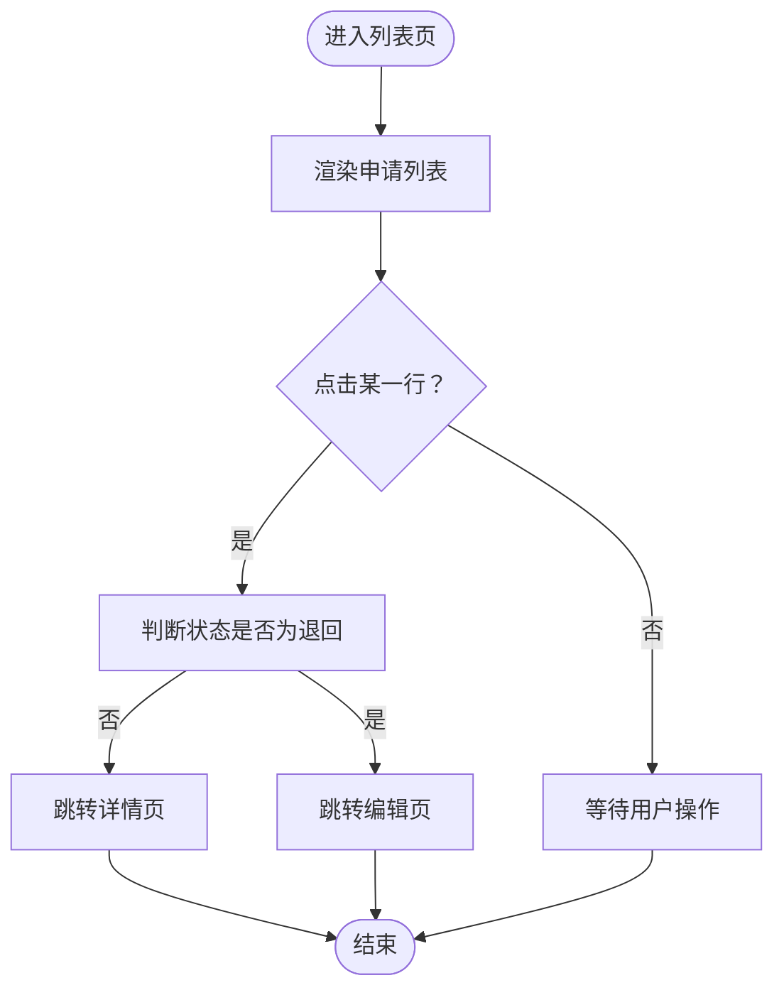
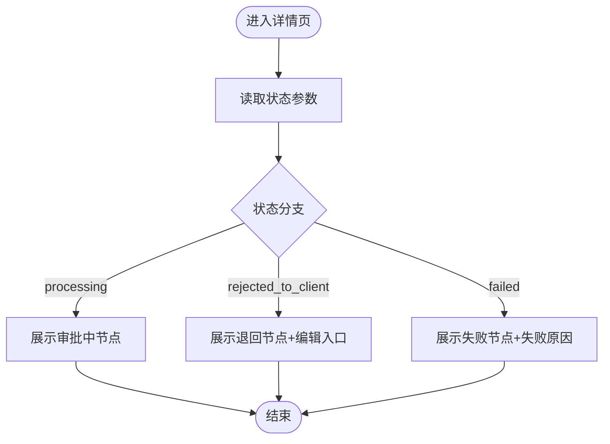
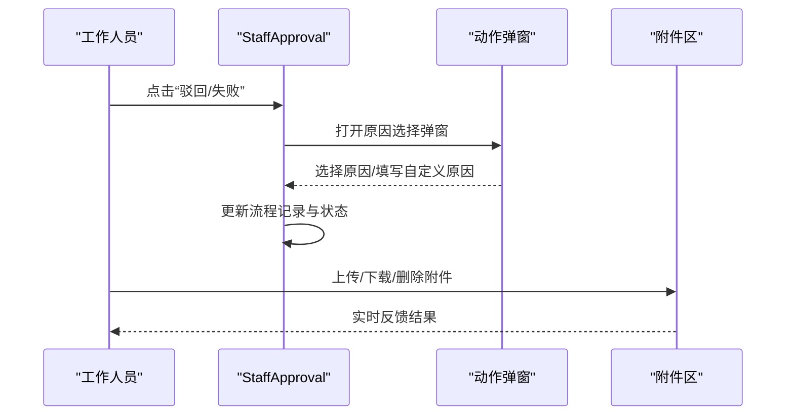
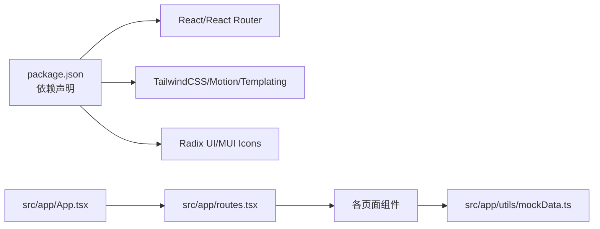

# 审批流程优化

<cite>
**本文引用的文件**
- [README.md](file://README.md)
- [permission_apply/README.md](file://permission_apply/README.md)
- [package.json](file://package.json)
- [src/main.tsx](file://src/main.tsx)
- [permission_apply/src/main.tsx](file://permission_apply/src/main.tsx)
- [src/app/App.tsx](file://src/app/App.tsx)
- [permission_apply/src/app/App.tsx](file://permission_apply/src/app/App.tsx)
- [src/app/routes.tsx](file://src/app/routes.tsx)
- [permission_apply/src/app/routes.tsx](file://permission_apply/src/app/routes.tsx)
- [src/app/pages/ApplicationList.tsx](file://src/app/pages/ApplicationList.tsx)
- [permission_apply/src/app/pages/ApplicationList.tsx](file://permission_apply/src/app/pages/ApplicationList.tsx)
- [src/app/pages/ApplicationDetail.tsx](file://src/app/pages/ApplicationDetail.tsx)
- [permission_apply/src/app/pages/ApplicationDetail.tsx](file://permission_apply/src/app/pages/ApplicationDetail.tsx)
- [src/app/pages/StaffApproval.tsx](file://src/app/pages/StaffApproval.tsx)
- [src/app/utils/mockData.ts](file://src/app/utils/mockData.ts)
</cite>

## 目录
1. [引言](#引言)
2. [项目结构](#项目结构)
3. [核心组件](#核心组件)
4. [架构总览](#架构总览)
5. [详细组件分析](#详细组件分析)
6. [依赖分析](#依赖分析)
7. [性能考量](#性能考量)
8. [故障排查指南](#故障排查指南)
9. [结论](#结论)
10. [附录](#附录)

## 引言
本指南面向“审批流程优化”的落地实施，结合现有前端原型与页面结构，系统阐述如何在不改变数据模型的前提下，通过界面与交互层面的优化，提升审批效率与用户体验。重点覆盖以下方面：
- 并行审批与智能路由：通过页面与路由设计支持“多任务并行处理”和“按角色智能跳转”
- 批量处理思路：以列表页聚合与状态可视化为入口，为后续后端批量接口预留前端交互基础
- 超时与异常处理：基于现有状态展示与弹窗交互，扩展“超时提醒”“异常重试”等提示
- 性能监控与瓶颈识别：以页面渲染与交互响应为切入点，建立可度量的优化基线
- 用户体验改进：聚焦移动端适配、响应式布局与可访问性

## 项目结构
该项目采用 React + Vite 的单页应用结构，主应用与“权限申请”子应用共享组件体系与样式资源。路由集中定义于各应用的 routes 文件中，页面组件按功能模块化组织。

图表来源
- [src/main.tsx:1-7](file://src/main.tsx#L1-L7)
- [src/app/App.tsx:1-6](file://src/app/App.tsx#L1-L6)
- [src/app/routes.tsx:1-38](file://src/app/routes.tsx#L1-L38)
- [permission_apply/src/main.tsx:1-7](file://permission_apply/src/main.tsx#L1-L7)
- [permission_apply/src/app/App.tsx:1-6](file://permission_apply/src/app/App.tsx#L1-L6)
- [permission_apply/src/app/routes.tsx:1-27](file://permission_apply/src/app/routes.tsx#L1-L27)

章节来源
- [README.md:1-11](file://README.md#L1-L11)
- [permission_apply/README.md:1-11](file://permission_apply/README.md#L1-L11)
- [package.json:1-91](file://package.json#L1-L91)
- [src/main.tsx:1-7](file://src/main.tsx#L1-L7)
- [permission_apply/src/main.tsx:1-7](file://permission_apply/src/main.tsx#L1-L7)
- [src/app/App.tsx:1-6](file://src/app/App.tsx#L1-L6)
- [permission_apply/src/app/App.tsx:1-6](file://permission_apply/src/app/App.tsx#L1-L6)
- [src/app/routes.tsx:1-38](file://src/app/routes.tsx#L1-L38)
- [permission_apply/src/app/routes.tsx:1-27](file://permission_apply/src/app/routes.tsx#L1-L27)

## 核心组件
- 应用入口与路由
  - 主应用入口与权限申请入口分别挂载根组件，统一由路由驱动页面切换
  - 路由集中定义，包含首页、提交表单、申请列表、详情、员工审批、审批列表、系统设置等
- 列表页与详情页
  - 申请列表页提供状态可视化、筛选与跳转能力；详情页根据状态渲染流程记录与操作按钮
- 员工审批页
  - 提供审批操作区、附件管理、CAP 同步、全量权限表与流程记录等模块
- 原因配置工具
  - 通过 mockData 提供“可用的审批原因”，为“驳回/失败”弹窗提供数据源

章节来源
- [src/app/routes.tsx:1-38](file://src/app/routes.tsx#L1-L38)
- [permission_apply/src/app/routes.tsx:1-27](file://permission_apply/src/app/routes.tsx#L1-L27)
- [src/app/pages/ApplicationList.tsx:1-178](file://src/app/pages/ApplicationList.tsx#L1-L178)
- [permission_apply/src/app/pages/ApplicationList.tsx:1-178](file://permission_apply/src/app/pages/ApplicationList.tsx#L1-L178)
- [src/app/pages/ApplicationDetail.tsx:1-113](file://src/app/pages/ApplicationDetail.tsx#L1-L113)
- [permission_apply/src/app/pages/ApplicationDetail.tsx:1-113](file://permission_apply/src/app/pages/ApplicationDetail.tsx#L1-L113)
- [src/app/pages/StaffApproval.tsx:1-708](file://src/app/pages/StaffApproval.tsx#L1-L708)
- [src/app/utils/mockData.ts:1-13](file://src/app/utils/mockData.ts#L1-L13)

## 架构总览
下图展示从用户进入系统到完成审批的关键交互路径，体现“列表—详情—审批”的闭环与“并行处理”的空间布局。

图表来源
- [src/app/pages/ApplicationList.tsx:1-178](file://src/app/pages/ApplicationList.tsx#L1-L178)
- [src/app/pages/ApplicationDetail.tsx:1-113](file://src/app/pages/ApplicationDetail.tsx#L1-L113)
- [src/app/pages/StaffApproval.tsx:1-708](file://src/app/pages/StaffApproval.tsx#L1-L708)

## 详细组件分析

### 组件一：申请列表（ApplicationList）
- 职责
  - 展示用户发起的各类申请，按状态高亮显示
  - 支持搜索与筛选，点击行跳转至详情或退回后的编辑入口
- 关键点
  - 行点击逻辑区分“退回”与“非退回”场景，确保用户回到正确的编辑或详情页
  - 状态标签使用脉冲动画提示“审批中”，增强实时感
- 优化建议
  - 在列表页增加“批量刷新/批量导出”入口，为后续后端批量接口做准备
  - 将“状态”字段改为可排序列，便于运营侧快速定位问题单据

图表来源
- [src/app/pages/ApplicationList.tsx:65-71](file://src/app/pages/ApplicationList.tsx#L65-L71)

章节来源
- [src/app/pages/ApplicationList.tsx:1-178](file://src/app/pages/ApplicationList.tsx#L1-L178)
- [permission_apply/src/app/pages/ApplicationList.tsx:1-178](file://permission_apply/src/app/pages/ApplicationList.tsx#L1-L178)

### 组件二：申请详情（ApplicationDetail）
- 职责
  - 根据传入的状态渲染流程记录，支持“审批中/退回/失败”三种分支
  - 当状态为“退回”时允许用户编辑并重新提交
- 关键点
  - 使用时间轴样式展示流程节点，突出“当前节点”的脉冲状态
  - 通过只读模式限制非“退回”状态下对表单的修改
- 优化建议
  - 在“审批中”阶段增加“倒计时/剩余时间”提示，提升透明度
  - 对“失败/退回”原因进行分类统计，辅助运营侧识别高频问题

图表来源
- [src/app/pages/ApplicationDetail.tsx:11-22](file://src/app/pages/ApplicationDetail.tsx#L11-L22)
- [src/app/pages/ApplicationDetail.tsx:44-96](file://src/app/pages/ApplicationDetail.tsx#L44-L96)

章节来源
- [src/app/pages/ApplicationDetail.tsx:1-113](file://src/app/pages/ApplicationDetail.tsx#L1-L113)
- [permission_apply/src/app/pages/ApplicationDetail.tsx:1-113](file://permission_apply/src/app/pages/ApplicationDetail.tsx#L1-L113)

### 组件三：员工审批（StaffApproval）
- 职责
  - 提供审批操作区（通过/驳回/失败），支持附件上传与下载、删除
  - 展示 CAP 同步状态、全量权限表与流程记录
- 关键点
  - 驳回/失败采用弹窗选择原因，支持“其他原因”文本输入
  - CAP 同步按钮具备“空闲/同步中/成功”三态反馈
- 优化建议
  - 在“当前节点”处增加“超时提醒”与“自动提醒”按钮
  - 为“附件”区域增加“拖拽上传”与“预览缩略图”能力，提升移动端体验

图表来源
- [src/app/pages/StaffApproval.tsx:119-140](file://src/app/pages/StaffApproval.tsx#L119-L140)
- [src/app/pages/StaffApproval.tsx:336-391](file://src/app/pages/StaffApproval.tsx#L336-L391)
- [src/app/pages/StaffApproval.tsx:400-416](file://src/app/pages/StaffApproval.tsx#L400-L416)

章节来源
- [src/app/pages/StaffApproval.tsx:1-708](file://src/app/pages/StaffApproval.tsx#L1-L708)

### 组件四：原因配置（mockData）
- 职责
  - 提供“可用的审批原因”集合，按业务类型过滤启用项
- 关键点
  - 通过工具函数返回当前启用的原因列表，供弹窗选择使用
- 优化建议
  - 原因项增加“分类/优先级/命中率统计”，便于运营侧动态调整

章节来源
- [src/app/utils/mockData.ts:1-13](file://src/app/utils/mockData.ts#L1-L13)

## 依赖分析
- 前端技术栈
  - React 18、React Router 7、Vite 6、TailwindCSS 4、Radix UI 组件库、Material Icons 等
- 依赖关系概览
  - 应用入口依赖路由与全局样式
  - 页面组件依赖 UI 组件库与工具函数
  - 审批弹窗依赖原因配置工具

图表来源
- [package.json:11-66](file://package.json#L11-L66)
- [src/app/App.tsx:1-6](file://src/app/App.tsx#L1-L6)
- [src/app/routes.tsx:1-38](file://src/app/routes.tsx#L1-L38)
- [src/app/utils/mockData.ts:1-13](file://src/app/utils/mockData.ts#L1-L13)

章节来源
- [package.json:1-91](file://package.json#L1-L91)

## 性能考量
- 渲染性能
  - 列表页使用虚拟滚动与分页（建议）可降低大数据量下的首屏压力
  - 详情页与审批页的表格与弹窗应避免不必要的重渲染，可使用 React.memo 或稳定化 props
- 交互响应
  - “审批中”状态使用脉冲动画提示，建议控制动画频率，避免过度消耗
  - 附件上传/下载建议采用节流与进度反馈，提升感知速度
- 监控指标建议
  - 首屏加载时间（FCP/LCP）、路由切换耗时、弹窗打开延迟、附件上传耗时
  - 通过浏览器性能面板与埋点上报收集上述指标，形成优化基线

## 故障排查指南
- 常见问题
  - 驳回/失败原因为空：检查原因配置工具是否正确过滤启用项
  - 状态不一致：检查列表页跳转逻辑与详情页状态读取是否一致
  - 附件无法下载/删除：检查事件绑定与文件名合法性
- 处理步骤
  - 打开开发者工具，定位对应组件与事件回调
  - 校验状态参数传递链路（location.state）
  - 对照弹窗与原因配置工具的数据流

章节来源
- [src/app/pages/StaffApproval.tsx:119-140](file://src/app/pages/StaffApproval.tsx#L119-L140)
- [src/app/pages/ApplicationList.tsx:65-71](file://src/app/pages/ApplicationList.tsx#L65-L71)
- [src/app/pages/ApplicationDetail.tsx:11-16](file://src/app/pages/ApplicationDetail.tsx#L11-L16)
- [src/app/utils/mockData.ts:10-12](file://src/app/utils/mockData.ts#L10-L12)

## 结论
本指南基于现有页面与路由结构，提出了可在前端层面快速落地的审批效率优化方案：以“列表—详情—审批”的闭环为基础，通过状态可视化、弹窗原因选择、附件管理与 CAP 同步等交互，构建“并行处理、智能路由、批量入口”的用户体验。建议在后续迭代中引入后端批量接口与实时通知能力，进一步完善“超时提醒、异常重试、性能监控”等机制。

## 附录
- 移动端适配与响应式设计要点
  - 使用 Tailwind 的断点类（sm/md/lg）保证表格与卡片在小屏上的可读性
  - 列表页的“查看详情”按钮在移动端应放大触控面积
  - 审批页的操作栏建议固定在底部，减少滚动与误触
- 可访问性建议
  - 为图标与按钮提供语义化标题与键盘导航支持
  - 控制动画频率，尊重用户的“减少动效”偏好