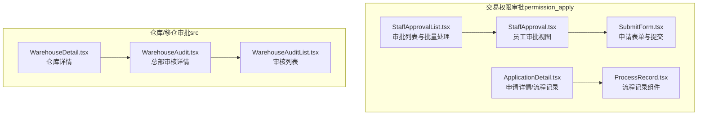
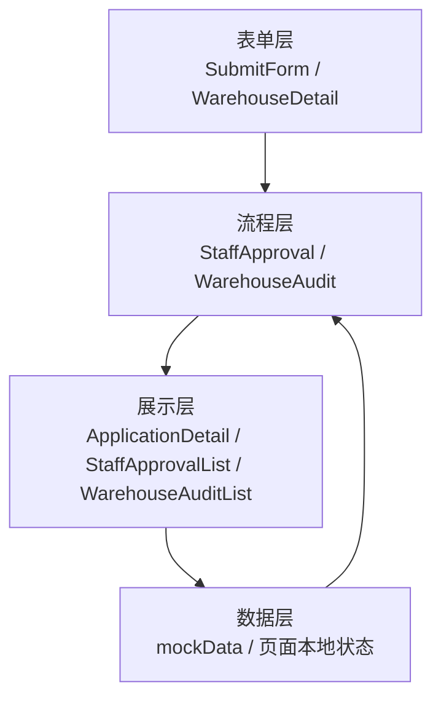
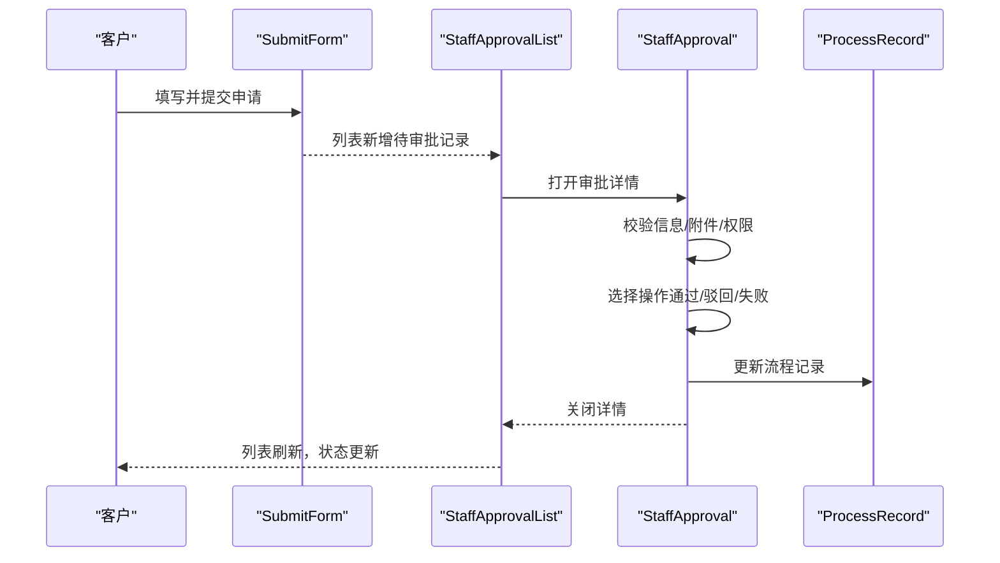
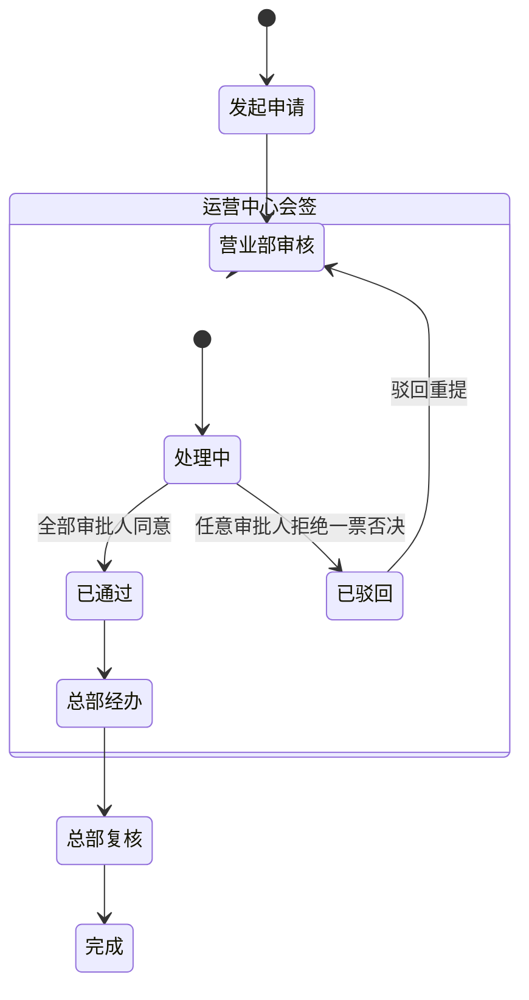
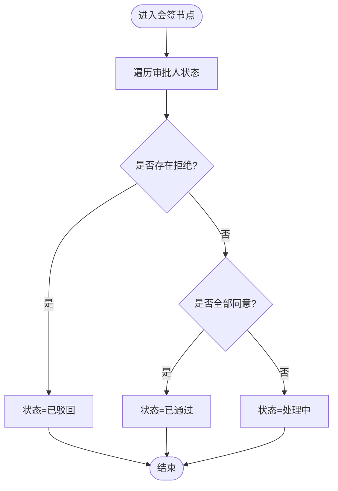
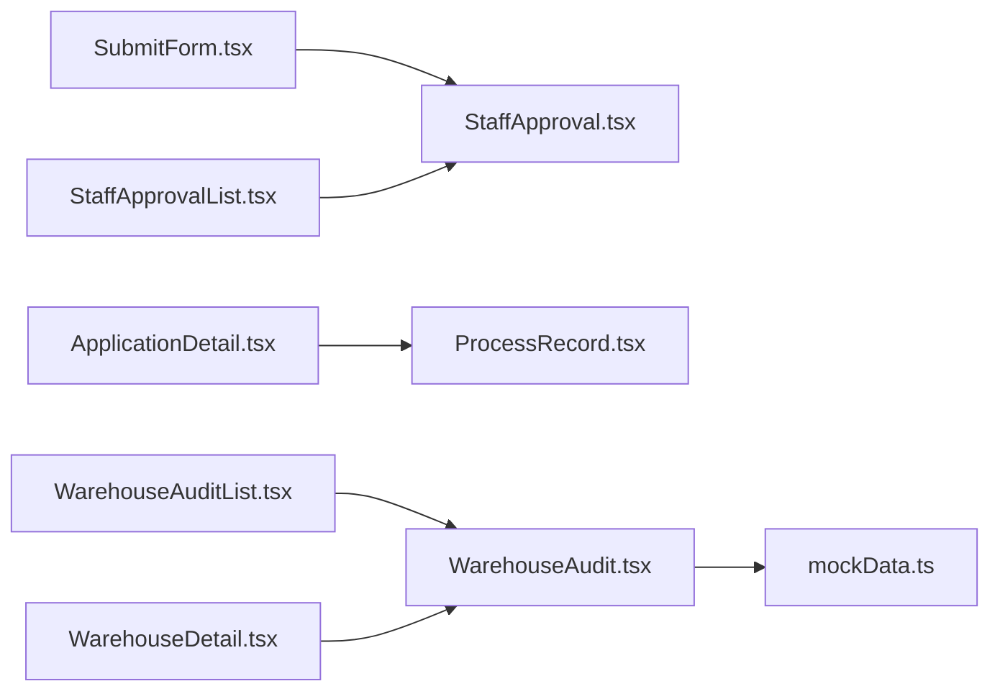

# 审批流程管理

<cite>
**本文档引用的文件**
- [permission_apply/src/app/pages/StaffApproval.tsx](file://permission_apply/src/app/pages/StaffApproval.tsx)
- [permission_apply/src/app/pages/ApplicationDetail.tsx](file://permission_apply/src/app/pages/ApplicationDetail.tsx)
- [permission_apply/src/app/pages/SubmitForm.tsx](file://permission_apply/src/app/pages/SubmitForm.tsx)
- [permission_apply/src/app/pages/StaffApprovalList.tsx](file://permission_apply/src/app/pages/StaffApprovalList.tsx)
- [permission_apply/src/app/components/ProcessRecord.tsx](file://permission_apply/src/app/components/ProcessRecord.tsx)
- [src/app/pages/WarehouseAudit.tsx](file://src/app/pages/WarehouseAudit.tsx)
- [src/app/pages/WarehouseAuditList.tsx](file://src/app/pages/WarehouseAuditList.tsx)
- [src/app/pages/WarehouseDetail.tsx](file://src/app/pages/WarehouseDetail.tsx)
- [src/app/utils/mockData.ts](file://src/app/utils/mockData.ts)
</cite>

## 目录
1. [简介](#简介)
2. [项目结构](#项目结构)
3. [核心组件](#核心组件)
4. [架构总览](#架构总览)
5. [详细组件分析](#详细组件分析)
6. [依赖关系分析](#依赖关系分析)
7. [性能考虑](#性能考虑)
8. [故障排除指南](#故障排除指南)
9. [结论](#结论)

## 简介
本文件面向“审批流程管理”的完整功能文档，覆盖两类业务场景：
- 交易权限开通审批（员工视角与客户视角）
- 仓库/移仓业务审批（总部审核）

重点阐述流程设计原理、状态机实现、进度跟踪机制、历史记录管理、不同类型的业务逻辑、权限控制与通知机制，并提供流程图与状态转换图，包含审批效率优化、异常处理与审计追踪建议。

## 项目结构
该项目采用前后端一体化的前端工程化组织方式，审批相关页面主要分布在两个子目录：
- permission_apply：交易权限开通审批（员工侧与客户侧）
- src：仓库/移仓业务审批（总部侧）

图表来源
- [permission_apply/src/app/pages/StaffApproval.tsx:1-708](file://permission_apply/src/app/pages/StaffApproval.tsx#L1-L708)
- [permission_apply/src/app/pages/ApplicationDetail.tsx:1-113](file://permission_apply/src/app/pages/ApplicationDetail.tsx#L1-L113)
- [permission_apply/src/app/pages/SubmitForm.tsx:1-747](file://permission_apply/src/app/pages/SubmitForm.tsx#L1-L747)
- [permission_apply/src/app/pages/StaffApprovalList.tsx:1-449](file://permission_apply/src/app/pages/StaffApprovalList.tsx#L1-L449)
- [permission_apply/src/app/components/ProcessRecord.tsx:1-56](file://permission_apply/src/app/components/ProcessRecord.tsx#L1-L56)
- [src/app/pages/WarehouseAudit.tsx:1-883](file://src/app/pages/WarehouseAudit.tsx#L1-L883)
- [src/app/pages/WarehouseAuditList.tsx:1-704](file://src/app/pages/WarehouseAuditList.tsx#L1-L704)
- [src/app/pages/WarehouseDetail.tsx:1-441](file://src/app/pages/WarehouseDetail.tsx#L1-L441)

章节来源
- [permission_apply/src/app/pages/StaffApproval.tsx:1-708](file://permission_apply/src/app/pages/StaffApproval.tsx#L1-L708)
- [permission_apply/src/app/pages/SubmitForm.tsx:1-747](file://permission_apply/src/app/pages/SubmitForm.tsx#L1-L747)
- [src/app/pages/WarehouseAudit.tsx:1-883](file://src/app/pages/WarehouseAudit.tsx#L1-L883)

## 核心组件
- 交易权限审批（员工侧）
  - StaffApproval：展示客户信息校验、附件、权限表、操作日志、审批流程与操作按钮（驳回/失败/通过）
  - SubmitForm：申请表单（首次申请/豁免/我司豁免），含资本/经验/知识测试等条件校验与提交
  - ApplicationDetail：客户视角的申请详情与流程记录
  - StaffApprovalList：审批列表，支持批量处理与导出
  - ProcessRecord：流程记录组件（通用）
- 仓库/移仓审批（总部侧）
  - WarehouseAudit：总部审核详情，支持会签节点（一票否决）、串行节点、流程可视化
  - WarehouseAuditList：总部审核列表，支持筛选、批量处理
  - WarehouseDetail：仓库详情页（只读）

章节来源
- [permission_apply/src/app/pages/StaffApproval.tsx:78-708](file://permission_apply/src/app/pages/StaffApproval.tsx#L78-L708)
- [permission_apply/src/app/pages/SubmitForm.tsx:57-747](file://permission_apply/src/app/pages/SubmitForm.tsx#L57-L747)
- [permission_apply/src/app/pages/ApplicationDetail.tsx:7-113](file://permission_apply/src/app/pages/ApplicationDetail.tsx#L7-L113)
- [permission_apply/src/app/pages/StaffApprovalList.tsx:9-449](file://permission_apply/src/app/pages/StaffApprovalList.tsx#L9-L449)
- [permission_apply/src/app/components/ProcessRecord.tsx:4-56](file://permission_apply/src/app/components/ProcessRecord.tsx#L4-L56)
- [src/app/pages/WarehouseAudit.tsx:129-883](file://src/app/pages/WarehouseAudit.tsx#L129-L883)
- [src/app/pages/WarehouseAuditList.tsx:413-704](file://src/app/pages/WarehouseAuditList.tsx#L413-L704)
- [src/app/pages/WarehouseDetail.tsx:190-441](file://src/app/pages/WarehouseDetail.tsx#L190-L441)

## 架构总览
审批系统由“表单层-流程层-展示层-数据层”构成：
- 表单层：SubmitForm（交易权限）与WarehouseDetail（仓库详情）负责收集与校验业务数据
- 流程层：StaffApproval/WarehouseAudit 维护流程节点与状态机，处理会签/串行节点
- 展示层：ApplicationDetail/StaffApprovalList/WarehouseAuditList 负责进度与列表展示
- 数据层：mockData 提供“原因模板”等配置数据；各页面内部维护本地状态

图表来源
- [permission_apply/src/app/pages/SubmitForm.tsx:57-747](file://permission_apply/src/app/pages/SubmitForm.tsx#L57-L747)
- [permission_apply/src/app/pages/StaffApproval.tsx:1-708](file://permission_apply/src/app/pages/StaffApproval.tsx#L1-L708)
- [src/app/pages/WarehouseAudit.tsx:129-883](file://src/app/pages/WarehouseAudit.tsx#L129-L883)
- [src/app/pages/WarehouseAuditList.tsx:413-704](file://src/app/pages/WarehouseAuditList.tsx#L413-L704)
- [src/app/utils/mockData.ts:1-13](file://src/app/utils/mockData.ts#L1-L13)

## 详细组件分析

### 交易权限审批（员工侧）
- 业务逻辑
  - 首次申请：校验资本门槛（R4/R3对应不同金额）、交易经验（实盘/仿真）、知识测试
  - 他司豁免：满足若干豁免条件后上传证明材料
  - 我司豁免：系统自动核验通过，直接进入权限挂接
- 状态机
  - 首次申请：提交 → 审核中 → 通过/驳回/失败
  - 他司豁免：提交 → 审核中 → 通过/驳回/失败
  - 我司豁免：系统核验 → 审核中 → 通过/失败
- 进度跟踪
  - 顶部状态条与流程记录组件展示当前节点与历史节点
- 历史记录
  - ApplicationDetail/ProcessRecord 展示“发起申请/退回给客户/重新提交/审批中/通过/失败”等节点
- 权限控制
  - 仅审批人员可见审批动作（驳回/失败/通过），客户仅可见只读详情
- 通知机制
  - 模态弹窗提示操作结果与原因；可扩展为消息推送或站内信

图表来源
- [permission_apply/src/app/pages/SubmitForm.tsx:115-117](file://permission_apply/src/app/pages/SubmitForm.tsx#L115-L117)
- [permission_apply/src/app/pages/StaffApprovalList.tsx:87-90](file://permission_apply/src/app/pages/StaffApprovalList.tsx#L87-L90)
- [permission_apply/src/app/pages/StaffApproval.tsx:195-212](file://permission_apply/src/app/pages/StaffApproval.tsx#L195-L212)
- [permission_apply/src/app/components/ProcessRecord.tsx:4-56](file://permission_apply/src/app/components/ProcessRecord.tsx#L4-L56)

章节来源
- [permission_apply/src/app/pages/SubmitForm.tsx:57-747](file://permission_apply/src/app/pages/SubmitForm.tsx#L57-L747)
- [permission_apply/src/app/pages/StaffApproval.tsx:1-708](file://permission_apply/src/app/pages/StaffApproval.tsx#L1-L708)
- [permission_apply/src/app/pages/ApplicationDetail.tsx:24-102](file://permission_apply/src/app/pages/ApplicationDetail.tsx#L24-L102)
- [permission_apply/src/app/pages/StaffApprovalList.tsx:9-449](file://permission_apply/src/app/pages/StaffApprovalList.tsx#L9-L449)
- [permission_apply/src/app/components/ProcessRecord.tsx:4-56](file://permission_apply/src/app/components/ProcessRecord.tsx#L4-L56)

### 仓库/移仓审批（总部侧）
- 业务逻辑
  - 支持多交易所、多方向（移入/移出/实控组）的移仓申请
  - 会签节点（运营中心风控/交割/结算评估）采用“一票否决”，全部通过才进入下一节点
  - 串行节点（营业部审核/总部经办/总部复核）按顺序推进
- 状态机
  - 发起申请 → 营业部审核 → 运营中心会签（处理中/已通过/已驳回） → 总部经办 → 总部复核 → 完成
- 进度跟踪
  - 流程树形图展示每个节点的执行人、时间与状态；会签节点显示各审批人的处理状态
- 历史记录
  - 支持“驳回重提”场景，流程记录包含重新提交节点
- 权限控制
  - 仅当前会签审批人可对会签节点进行“通过/驳回”操作
- 通知机制
  - 模态弹窗提示会签节点处理结果；可扩展为邮件/短信通知

图表来源
- [src/app/pages/WarehouseAudit.tsx:522-787](file://src/app/pages/WarehouseAudit.tsx#L522-L787)

章节来源
- [src/app/pages/WarehouseAudit.tsx:129-883](file://src/app/pages/WarehouseAudit.tsx#L129-L883)
- [src/app/pages/WarehouseAuditList.tsx:413-704](file://src/app/pages/WarehouseAuditList.tsx#L413-L704)
- [src/app/pages/WarehouseDetail.tsx:190-441](file://src/app/pages/WarehouseDetail.tsx#L190-L441)

### 会签节点算法与流程
- 会签状态聚合规则
  - 任一“拒绝”即整体“已驳回”
  - 全部“同意”即整体“已通过”
  - 否则为“处理中”
- 交互行为
  - 当前会签审批人可“通过/驳回”
  - 通过后更新当前审批人状态与时间
  - 驳回触发“一票否决”，流程终止于会签节点

图表来源
- [src/app/pages/WarehouseAudit.tsx:32-36](file://src/app/pages/WarehouseAudit.tsx#L32-L36)
- [src/app/pages/WarehouseAudit.tsx:195-235](file://src/app/pages/WarehouseAudit.tsx#L195-L235)

章节来源
- [src/app/pages/WarehouseAudit.tsx:32-36](file://src/app/pages/WarehouseAudit.tsx#L32-L36)
- [src/app/pages/WarehouseAudit.tsx:195-235](file://src/app/pages/WarehouseAudit.tsx#L195-L235)

## 依赖关系分析
- 组件耦合
  - StaffApproval 依赖 SubmitForm 的基础信息块与权限块
  - ApplicationDetail 依赖 ProcessRecord 渲染流程记录
  - WarehouseAudit 依赖 Approver/FlowStep 类型定义与 mockData 中的原因模板
- 外部依赖
  - mockData 提供“启用的原因模板”，用于审批驳回/失败的快捷选择
- 数据流
  - 页面内部状态驱动 UI 更新；列表页通过路由状态传递数据到详情页

图表来源
- [permission_apply/src/app/pages/SubmitForm.tsx:1-12](file://permission_apply/src/app/pages/SubmitForm.tsx#L1-L12)
- [permission_apply/src/app/pages/StaffApproval.tsx:1-12](file://permission_apply/src/app/pages/StaffApproval.tsx#L1-L12)
- [permission_apply/src/app/pages/ApplicationDetail.tsx:1-6](file://permission_apply/src/app/pages/ApplicationDetail.tsx#L1-L6)
- [permission_apply/src/app/components/ProcessRecord.tsx:1-5](file://permission_apply/src/app/components/ProcessRecord.tsx#L1-L5)
- [permission_apply/src/app/pages/StaffApprovalList.tsx:1-8](file://permission_apply/src/app/pages/StaffApprovalList.tsx#L1-L8)
- [src/app/pages/WarehouseAudit.tsx:1-8](file://src/app/pages/WarehouseAudit.tsx#L1-L8)
- [src/app/pages/WarehouseAuditList.tsx:1-8](file://src/app/pages/WarehouseAuditList.tsx#L1-L8)
- [src/app/pages/WarehouseDetail.tsx:1-11](file://src/app/pages/WarehouseDetail.tsx#L1-L11)
- [src/app/utils/mockData.ts:1-13](file://src/app/utils/mockData.ts#L1-L13)

章节来源
- [src/app/utils/mockData.ts:1-13](file://src/app/utils/mockData.ts#L1-L13)

## 性能考虑
- 渲染优化
  - 使用 React.memo/受控组件减少不必要的重渲染
  - 列表页采用虚拟滚动（如需）与懒加载详情弹窗
- 状态管理
  - 将高频切换的状态（如会签审批人状态）集中管理，避免深层 props 传递
- 数据获取
  - 当前为 mock 数据，生产环境应改为异步加载与缓存策略
- 交互体验
  - 批量处理与导出操作应异步执行并提供进度反馈

## 故障排除指南
- 常见问题
  - 驳回原因为空：检查 getEnabledReasons 返回值与表单校验逻辑
  - 会签节点无法通过：确认当前审批人索引与状态更新逻辑
  - 流程记录不更新：确认 ProcessRecord 的状态参数传递
- 排查步骤
  - 打开浏览器开发者工具，检查网络请求与控制台错误
  - 校验 mockData 中 businessType 与 isEnabled 字段
  - 确认会签状态聚合函数逻辑与 UI 更新时机

章节来源
- [src/app/utils/mockData.ts:10-12](file://src/app/utils/mockData.ts#L10-L12)
- [src/app/pages/WarehouseAudit.tsx:195-212](file://src/app/pages/WarehouseAudit.tsx#L195-L212)
- [permission_apply/src/app/components/ProcessRecord.tsx:4-56](file://permission_apply/src/app/components/ProcessRecord.tsx#L4-L56)

## 结论
本系统通过清晰的流程节点划分与状态机设计，实现了交易权限与仓库移仓两类审批业务的可视化与可追溯。会签节点的一票否决机制确保了风控一致性，而流程记录与历史节点的展示提升了透明度。建议后续引入真实后端接口、消息通知与审计日志，进一步完善审批效率与合规性。