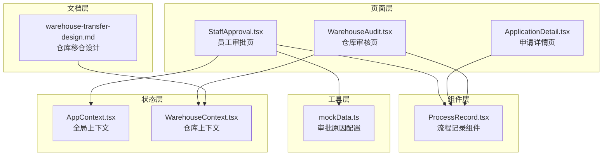
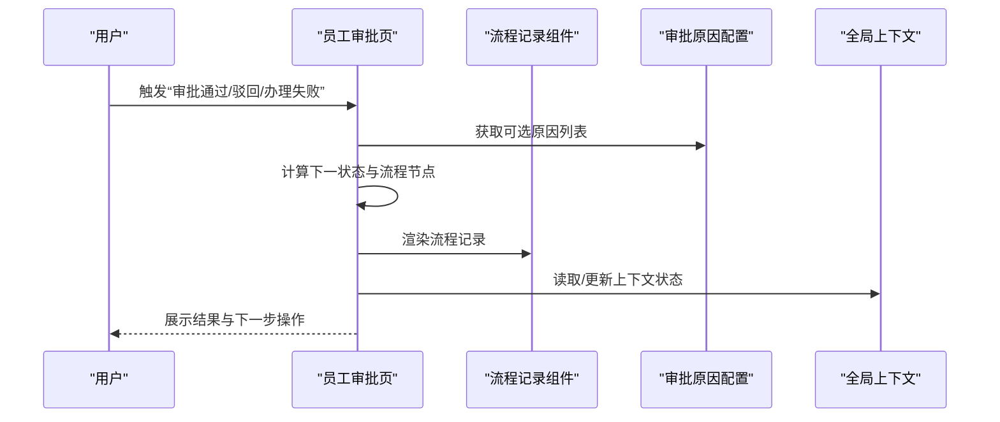
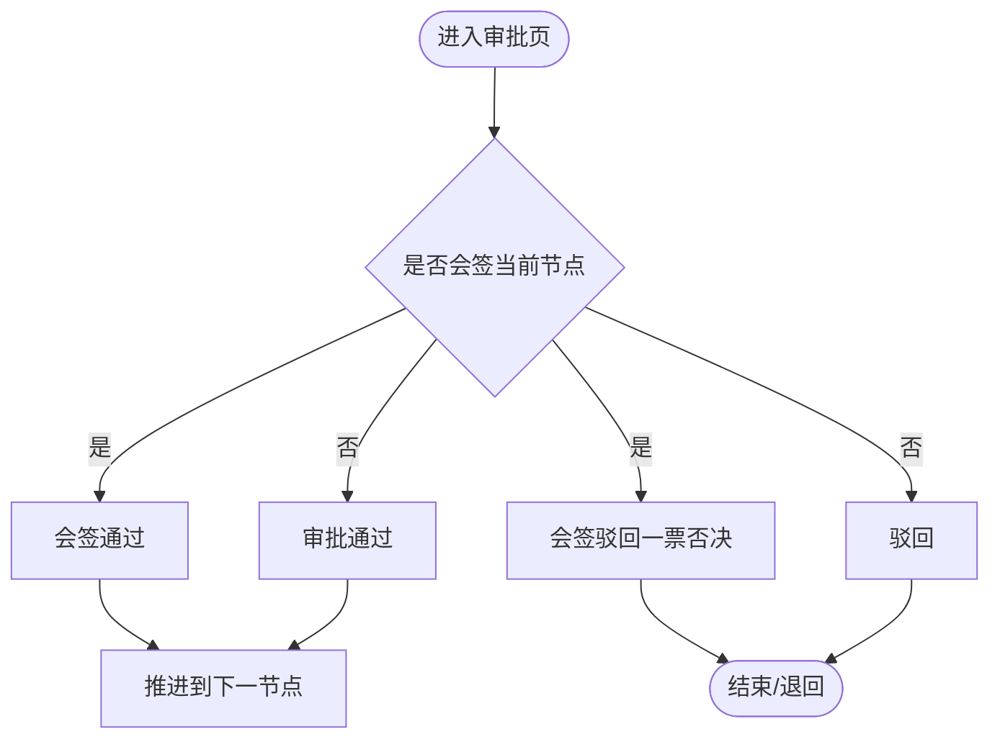
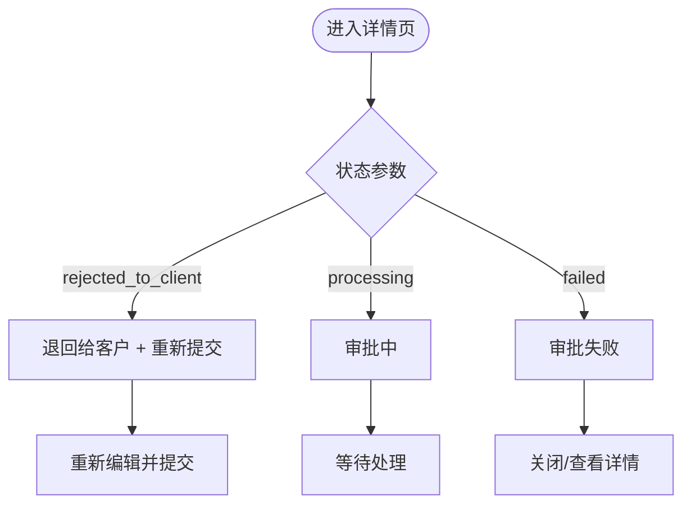
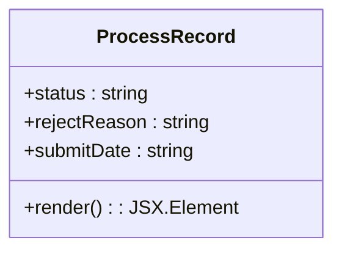
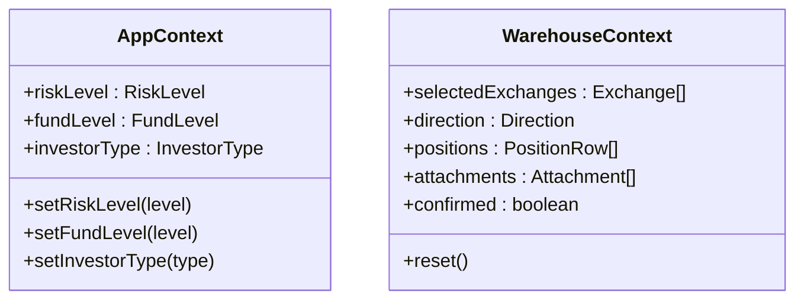
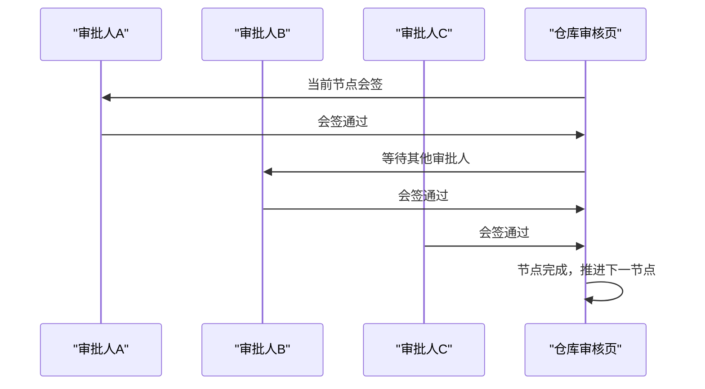
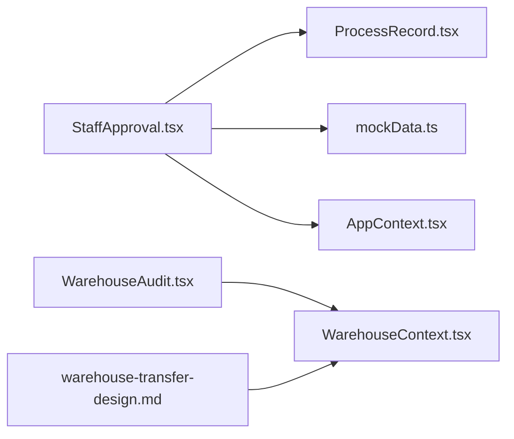

# 审批状态机设计

<cite>
**本文档引用的文件**
- [StaffApproval.tsx](file://src/app/pages/StaffApproval.tsx)
- [ApplicationDetail.tsx](file://src/app/pages/ApplicationDetail.tsx)
- [ProcessRecord.tsx](file://src/app/components/ProcessRecord.tsx)
- [mockData.ts](file://src/app/utils/mockData.ts)
- [WarehouseContext.tsx](file://src/app/store/WarehouseContext.tsx)
- [warehouse-transfer-design.md](file://docs/warehouse-transfer-design.md)
- [WarehouseAudit.tsx](file://src/app/pages/WarehouseAudit.tsx)
- [AppContext.tsx](file://src/app/store/AppContext.tsx)
</cite>

## 目录
1. [引言](#引言)
2. [项目结构](#项目结构)
3. [核心组件](#核心组件)
4. [架构总览](#架构总览)
5. [详细组件分析](#详细组件分析)
6. [依赖分析](#依赖分析)
7. [性能考虑](#性能考虑)
8. [故障排除指南](#故障排除指南)
9. [结论](#结论)
10. [附录](#附录)

## 引言
本技术文档围绕“审批状态机”的设计与实现进行系统化梳理，目标是：
- 明确审批流程的状态定义、状态转换规则与事件驱动机制
- 说明不同业务场景下的状态集合、转换条件与约束规则
- 提供状态机图表、转换矩阵与错误处理策略
- 规划状态持久化方案、并发控制机制与状态恢复功能

通过对现有代码库中的审批页面、流程记录组件、上下文状态管理与仓库移仓设计文档的深入分析，形成可落地的设计方案与实施建议。

## 项目结构
本项目采用前端单页应用架构，审批相关逻辑主要分布在以下模块：
- 页面层：审批详情页、员工审批页、流程记录组件
- 工具层：审批原因配置（Mock）
- 状态层：全局上下文（AppContext）、仓库上下文（WarehouseContext）
- 文档层：仓库移仓业务设计文档

**图表来源**
- [StaffApproval.tsx:1-708](file://src/app/pages/StaffApproval.tsx#L1-L708)
- [ApplicationDetail.tsx:1-113](file://src/app/pages/ApplicationDetail.tsx#L1-L113)
- [ProcessRecord.tsx:1-135](file://src/app/components/ProcessRecord.tsx#L1-L135)
- [mockData.ts:1-13](file://src/app/utils/mockData.ts#L1-L13)
- [AppContext.tsx:1-64](file://src/app/store/AppContext.tsx#L1-L64)
- [WarehouseContext.tsx:1-185](file://src/app/store/WarehouseContext.tsx#L1-L185)
- [warehouse-transfer-design.md:1-105](file://docs/warehouse-transfer-design.md#L1-L105)

**章节来源**
- [StaffApproval.tsx:1-708](file://src/app/pages/StaffApproval.tsx#L1-L708)
- [ApplicationDetail.tsx:1-113](file://src/app/pages/ApplicationDetail.tsx#L1-L113)
- [ProcessRecord.tsx:1-135](file://src/app/components/ProcessRecord.tsx#L1-L135)
- [mockData.ts:1-13](file://src/app/utils/mockData.ts#L1-L13)
- [AppContext.tsx:1-64](file://src/app/store/AppContext.tsx#L1-L64)
- [WarehouseContext.tsx:1-185](file://src/app/store/WarehouseContext.tsx#L1-L185)
- [warehouse-transfer-design.md:1-105](file://docs/warehouse-transfer-design.md#L1-L105)

## 核心组件
- 员工审批页（StaffApproval.tsx）：承载审批操作入口、流程节点展示与动作弹窗，支持“驳回”“办理失败”“审批通过”等事件驱动。
- 申请详情页（ApplicationDetail.tsx）：根据状态渲染流程记录，支持“处理中”“退回给客户”“失败”等状态分支。
- 流程记录组件（ProcessRecord.tsx）：以组件形式统一渲染不同状态下的流程节点与原因说明。
- 审批原因配置（mockData.ts）：提供可选的审批原因列表，用于“驳回/失败”时的选择与自定义输入。
- 全局上下文（AppContext.tsx）：管理客户风险与资金等全局状态，为审批决策提供依据。
- 仓库上下文（WarehouseContext.tsx）：管理移仓业务的草稿状态与字段，体现状态持久化与恢复能力。
- 仓库移仓设计文档（warehouse-transfer-design.md）：定义业务规则与状态边界，指导状态机设计。

**章节来源**
- [StaffApproval.tsx:631-707](file://src/app/pages/StaffApproval.tsx#L631-L707)
- [ApplicationDetail.tsx:24-102](file://src/app/pages/ApplicationDetail.tsx#L24-L102)
- [ProcessRecord.tsx:4-134](file://src/app/components/ProcessRecord.tsx#L4-L134)
- [mockData.ts:10-12](file://src/app/utils/mockData.ts#L10-L12)
- [AppContext.tsx:6-27](file://src/app/store/AppContext.tsx#L6-L27)
- [WarehouseContext.tsx:19-73](file://src/app/store/WarehouseContext.tsx#L19-L73)
- [warehouse-transfer-design.md:103-105](file://docs/warehouse-transfer-design.md#L103-L105)

## 架构总览
审批状态机由“页面-组件-上下文-工具-文档”协同构成，事件驱动与状态渲染解耦，便于扩展与维护。

**图表来源**
- [StaffApproval.tsx:119-140](file://src/app/pages/StaffApproval.tsx#L119-L140)
- [ProcessRecord.tsx:24-129](file://src/app/components/ProcessRecord.tsx#L24-L129)
- [mockData.ts:10-12](file://src/app/utils/mockData.ts#L10-L12)
- [AppContext.tsx:31-57](file://src/app/store/AppContext.tsx#L31-L57)

## 详细组件分析

### 员工审批页（状态机核心）
- 状态集合（基于UI呈现）：发起申请、营业部经办、营业部复核（已驳回）、重新提交申请、当前节点（处理中）、审批通过、驳回、办理失败。
- 转换条件：
  - “审批通过”：直接进入下一节点或结束流程
  - “驳回”：根据是否为会签节点决定一票否决或流程回退
  - “办理失败”：流程暂停或退回
- 事件驱动：
  - 打开原因选择弹窗，选择“快捷原因”或“其他原因”，确认后执行对应动作
  - 支持同步CAP状态，影响后续节点
- 并发与一致性：
  - 会签节点仅当前审批人可操作，避免并发冲突
  - 通过本地状态更新与弹窗确认，降低误操作风险

**图表来源**
- [StaffApproval.tsx:198-212](file://src/app/pages/StaffApproval.tsx#L198-L212)
- [StaffApproval.tsx:214-226](file://src/app/pages/StaffApproval.tsx#L214-L226)

**章节来源**
- [StaffApproval.tsx:608-623](file://src/app/pages/StaffApproval.tsx#L608-L623)
- [StaffApproval.tsx:631-707](file://src/app/pages/StaffApproval.tsx#L631-L707)

### 申请详情页（状态渲染）
- 根据状态参数渲染流程记录：
  - rejected_to_client：退回给客户 + 客户重新提交
  - processing：审批中
  - failed：审批失败
- 状态切换：
  - 通过路由状态传递控制渲染分支
  - 支持在“退回给客户”状态下重新编辑并提交

**图表来源**
- [ApplicationDetail.tsx:14-16](file://src/app/pages/ApplicationDetail.tsx#L14-L16)
- [ApplicationDetail.tsx:24-102](file://src/app/pages/ApplicationDetail.tsx#L24-L102)

**章节来源**
- [ApplicationDetail.tsx:1-113](file://src/app/pages/ApplicationDetail.tsx#L1-L113)

### 流程记录组件（状态可视化）
- 统一流程节点渲染：提交、处理中、通过、驳回、失败、完成等
- 支持不同状态下的原因说明与时间戳展示
- 作为通用组件被多个页面复用，保证一致性

**图表来源**
- [ProcessRecord.tsx:4-12](file://src/app/components/ProcessRecord.tsx#L4-L12)

**章节来源**
- [ProcessRecord.tsx:1-135](file://src/app/components/ProcessRecord.tsx#L1-L135)

### 审批原因配置（事件触发器）
- 提供可选原因列表，按业务类型过滤
- 支持“其他原因”手动输入，增强灵活性

**章节来源**
- [mockData.ts:1-13](file://src/app/utils/mockData.ts#L1-L13)

### 全局上下文与仓库上下文（状态持久化与恢复）
- AppContext：管理客户风险等级、资金水平、投资者类型等全局状态，为审批决策提供依据
- WarehouseContext：管理移仓业务草稿状态（字段集合、附件、确认标记等），支持重置与恢复

**图表来源**
- [AppContext.tsx:6-27](file://src/app/store/AppContext.tsx#L6-L27)
- [WarehouseContext.tsx:19-73](file://src/app/store/WarehouseContext.tsx#L19-L73)

**章节来源**
- [AppContext.tsx:1-64](file://src/app/store/AppContext.tsx#L1-L64)
- [WarehouseContext.tsx:1-185](file://src/app/store/WarehouseContext.tsx#L1-L185)

### 仓库审核页（会签与多节点流程）
- 会签节点：当前审批人仅能对自身节点进行“通过/驳回”，一票否决即终止该节点
- 流程推进：当所有审批人通过时，节点完成并推进到下一节点；否则提示等待其他审批人处理
- 审批动作：支持“驳回”“办理失败”“审核通过”

**图表来源**
- [WarehouseAudit.tsx:214-235](file://src/app/pages/WarehouseAudit.tsx#L214-L235)
- [WarehouseAudit.tsx:791-821](file://src/app/pages/WarehouseAudit.tsx#L791-L821)

**章节来源**
- [WarehouseAudit.tsx:198-235](file://src/app/pages/WarehouseAudit.tsx#L198-L235)
- [WarehouseAudit.tsx:214-226](file://src/app/pages/WarehouseAudit.tsx#L214-L226)
- [WarehouseAudit.tsx:791-821](file://src/app/pages/WarehouseAudit.tsx#L791-L821)

## 依赖分析
- 页面依赖组件：审批页依赖流程记录组件进行状态可视化
- 页面依赖工具：审批页依赖原因配置进行事件触发
- 页面依赖上下文：审批页读取全局上下文状态辅助决策
- 文档指导：仓库移仓设计文档为状态边界与流程节点提供业务约束

**图表来源**
- [StaffApproval.tsx:1-10](file://src/app/pages/StaffApproval.tsx#L1-L10)
- [ProcessRecord.tsx:1-2](file://src/app/components/ProcessRecord.tsx#L1-L2)
- [mockData.ts:1-2](file://src/app/utils/mockData.ts#L1-L2)
- [AppContext.tsx:1-1](file://src/app/store/AppContext.tsx#L1-L1)
- [WarehouseAudit.tsx:1-9](file://src/app/pages/WarehouseAudit.tsx#L1-L9)
- [WarehouseContext.tsx:1-1](file://src/app/store/WarehouseContext.tsx#L1-L1)
- [warehouse-transfer-design.md:1-1](file://docs/warehouse-transfer-design.md#L1-L1)

**章节来源**
- [StaffApproval.tsx:1-10](file://src/app/pages/StaffApproval.tsx#L1-L10)
- [WarehouseAudit.tsx:1-9](file://src/app/pages/WarehouseAudit.tsx#L1-L9)

## 性能考虑
- 渲染优化：流程记录组件按状态分支渲染，避免不必要的DOM更新
- 事件节流：审批原因选择弹窗在确认前进行必填校验，减少无效渲染
- 数据局部化：会签节点仅更新当前审批人状态，降低全局状态变更成本
- 缓存策略：CAP同步状态在成功后不再重复请求，提升交互流畅度

## 故障排除指南
- 驳回/失败原因为空：检查原因选择弹窗的必填校验逻辑，确保“其他原因”时必须填写
- 会签节点误操作：确认当前节点标识，避免非当前审批人修改他人状态
- 状态不一致：检查路由状态传递与页面默认状态初始化逻辑
- 并发冲突：会签节点应限制当前审批人操作范围，避免多人同时修改同一节点

**章节来源**
- [StaffApproval.tsx:694-697](file://src/app/pages/StaffApproval.tsx#L694-L697)
- [WarehouseAudit.tsx:216-218](file://src/app/pages/WarehouseAudit.tsx#L216-L218)

## 结论
本设计以“页面-组件-上下文-工具-文档”五维协同构建审批状态机，实现了：
- 明确的状态集合与转换规则
- 事件驱动的操作入口与原因选择
- 会签节点的一票否决与流程推进机制
- 可复用的流程记录组件与上下文状态持久化
- 业务规则文档指导下的状态边界与约束

建议在后续迭代中引入后端状态持久化与事务一致性保障，并完善审计日志与回滚机制。

## 附录

### 状态转换矩阵（示意）
- 发起申请 → 营业部经办 → 营业部复核（通过/驳回） → 重新提交（若驳回） → 营业部经办（处理中） → 审批通过/失败
- 会签节点：当前审批人通过/驳回，影响整体节点完成度

**章节来源**
- [StaffApproval.tsx:556-623](file://src/app/pages/StaffApproval.tsx#L556-L623)
- [WarehouseAudit.tsx:214-235](file://src/app/pages/WarehouseAudit.tsx#L214-L235)