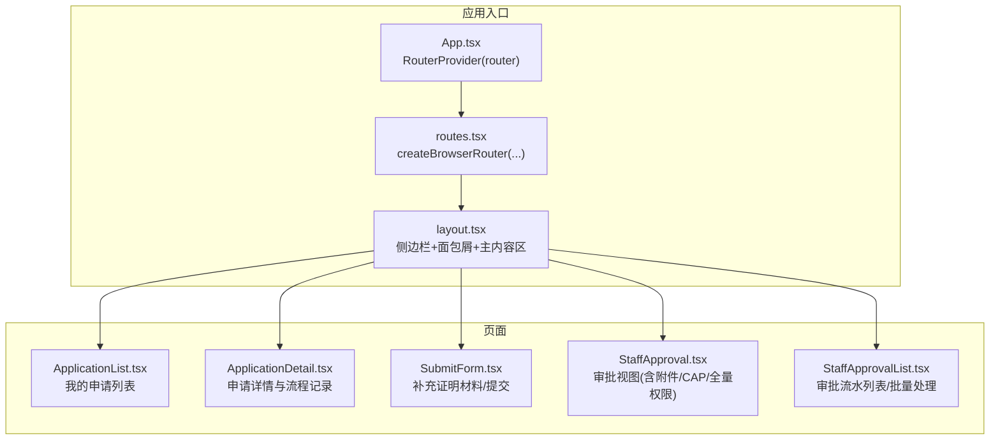
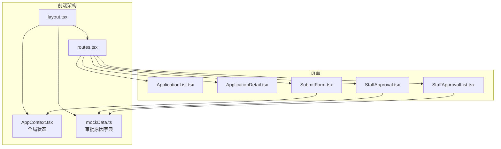
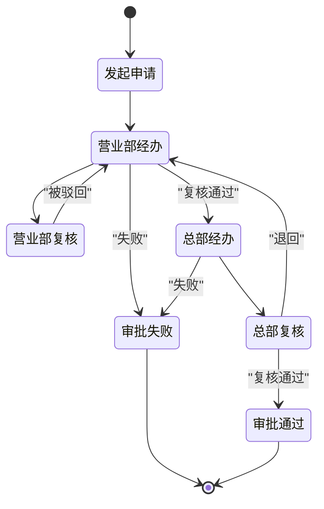
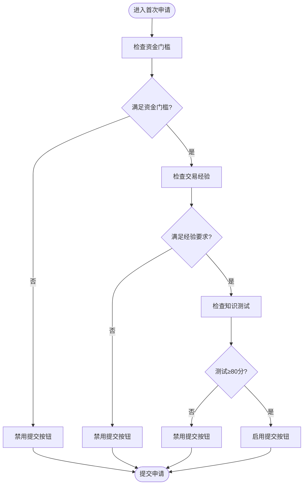
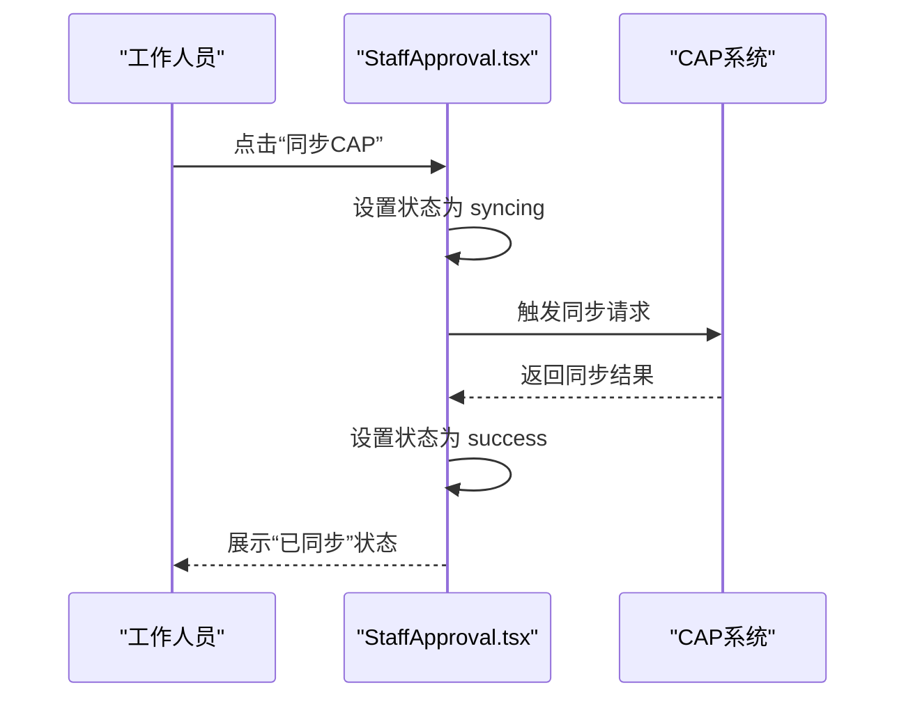
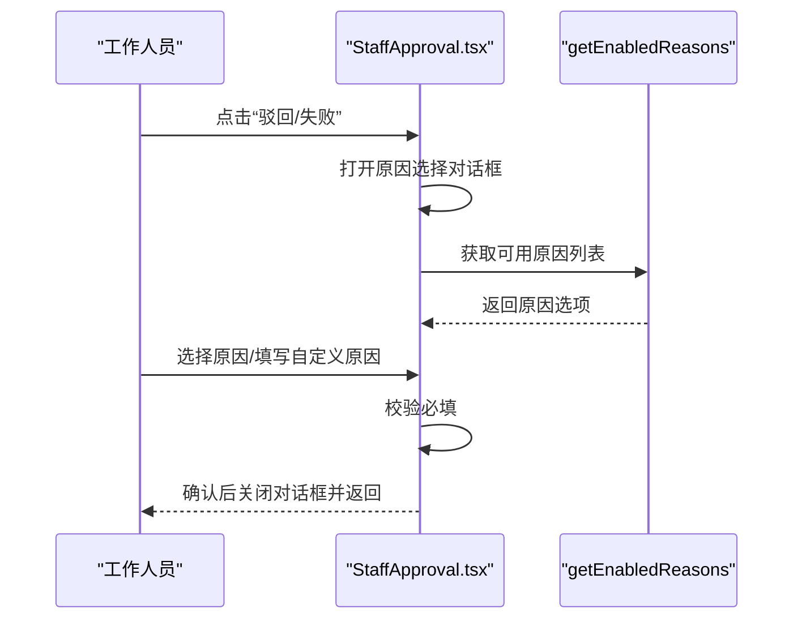
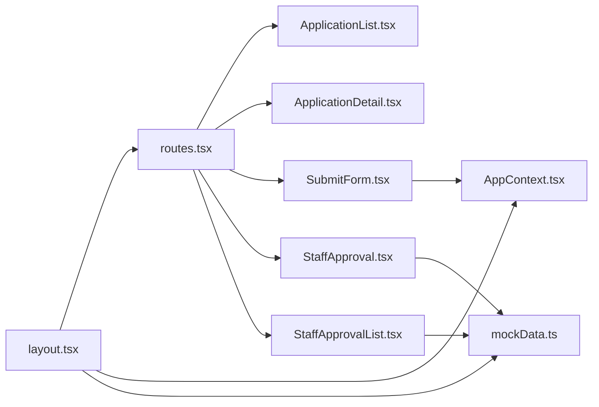

# 权限审批流程

<cite>
**本文引用的文件**
- [App.tsx](file://permission_apply/src/app/App.tsx)
- [routes.tsx](file://permission_apply/src/app/routes.tsx)
- [layout.tsx](file://permission_apply/src/app/layout.tsx)
- [ApplicationList.tsx](file://permission_apply/src/app/pages/ApplicationList.tsx)
- [ApplicationDetail.tsx](file://permission_apply/src/app/pages/ApplicationDetail.tsx)
- [SubmitForm.tsx](file://permission_apply/src/app/pages/SubmitForm.tsx)
- [StaffApproval.tsx](file://permission_apply/src/app/pages/StaffApproval.tsx)
- [StaffApprovalList.tsx](file://permission_apply/src/app/pages/StaffApprovalList.tsx)
- [mockData.ts](file://permission_apply/src/app/utils/mockData.ts)
- [AppContext.tsx](file://permission_apply/src/app/store/AppContext.tsx)
</cite>

## 目录
1. [简介](#简介)
2. [项目结构](#项目结构)
3. [核心组件](#核心组件)
4. [架构总览](#架构总览)
5. [详细组件分析](#详细组件分析)
6. [依赖关系分析](#依赖关系分析)
7. [性能考虑](#性能考虑)
8. [故障排查指南](#故障排查指南)
9. [结论](#结论)
10. [附录](#附录)

## 简介
本文件面向“权限审批流程”的完整实现，聚焦于交易权限开通申请的审批链路，覆盖从客户提交、营业部经办/复核、总部经办/复核到最终审批通过或失败的全流程。文档详细说明了：
- 审批节点与状态流转规则
- 权限验证机制（资金门槛、交易经验、知识测试）
- 风险评估与合规检查要点
- CAP系统权限同步集成
- 附件审核与审批历史追踪
- 审批操作按钮与交互逻辑

## 项目结构
权限审批模块位于 permission_apply 子目录，采用前端路由 + 页面组件 + 工具函数 + 全局上下文的状态管理模式。页面路由与布局如下：

图表来源
- [App.tsx:1-6](file://permission_apply/src/app/App.tsx#L1-L6)
- [routes.tsx:1-27](file://permission_apply/src/app/routes.tsx#L1-L27)
- [layout.tsx:1-87](file://permission_apply/src/app/layout.tsx#L1-L87)

章节来源
- [App.tsx:1-6](file://permission_apply/src/app/App.tsx#L1-L6)
- [routes.tsx:1-27](file://permission_apply/src/app/routes.tsx#L1-L27)
- [layout.tsx:1-87](file://permission_apply/src/app/layout.tsx#L1-L87)

## 核心组件
- 应用入口与路由
  - App.tsx：使用 RouterProvider 注入 router
  - routes.tsx：定义首页、提交表单、申请列表/详情、审批列表/详情、系统设置等路由
- 布局与导航
  - layout.tsx：左侧固定导航、顶部面包屑、右侧配置面板与全局通知
- 业务页面
  - ApplicationList：展示我发起的申请，支持筛选与跳转详情
  - ApplicationDetail：只读展示流程记录与当前状态
  - SubmitForm：根据客户类型切换“首次申请/他司豁免/我司豁免”，完成材料补录与提交
  - StaffApproval：审批视图，含附件、CAP同步、全量权限表、操作日志与审批流程
  - StaffApprovalList：审批流水列表，支持批量处理与附件下载
- 工具与状态
  - mockData.ts：审批原因字典（按业务类型过滤）
  - AppContext.tsx：全局上下文（账户、风险等级、投资者类型、已选权限等）

章节来源
- [routes.tsx:1-27](file://permission_apply/src/app/routes.tsx#L1-L27)
- [layout.tsx:1-87](file://permission_apply/src/app/layout.tsx#L1-L87)
- [ApplicationList.tsx:1-178](file://permission_apply/src/app/pages/ApplicationList.tsx#L1-L178)
- [ApplicationDetail.tsx:1-113](file://permission_apply/src/app/pages/ApplicationDetail.tsx#L1-L113)
- [SubmitForm.tsx:1-747](file://permission_apply/src/app/pages/SubmitForm.tsx#L1-L747)
- [StaffApproval.tsx:1-708](file://permission_apply/src/app/pages/StaffApproval.tsx#L1-L708)
- [StaffApprovalList.tsx:1-449](file://permission_apply/src/app/pages/StaffApprovalList.tsx#L1-L449)
- [mockData.ts:1-13](file://permission_apply/src/app/utils/mockData.ts#L1-L13)
- [AppContext.tsx:1-64](file://permission_apply/src/app/store/AppContext.tsx#L1-L64)

## 架构总览
整体采用“页面组件 + 路由 + 上下文”的前端架构，数据流自上而下传递，审批状态通过路由 state 与本地状态共同维护。

图表来源
- [layout.tsx:1-87](file://permission_apply/src/app/layout.tsx#L1-L87)
- [routes.tsx:1-27](file://permission_apply/src/app/routes.tsx#L1-L27)
- [AppContext.tsx:1-64](file://permission_apply/src/app/store/AppContext.tsx#L1-L64)
- [mockData.ts:1-13](file://permission_apply/src/app/utils/mockData.ts#L1-L13)
- [ApplicationList.tsx:1-178](file://permission_apply/src/app/pages/ApplicationList.tsx#L1-L178)
- [ApplicationDetail.tsx:1-113](file://permission_apply/src/app/pages/ApplicationDetail.tsx#L1-L113)
- [SubmitForm.tsx:1-747](file://permission_apply/src/app/pages/SubmitForm.tsx#L1-L747)
- [StaffApproval.tsx:1-708](file://permission_apply/src/app/pages/StaffApproval.tsx#L1-L708)
- [StaffApprovalList.tsx:1-449](file://permission_apply/src/app/pages/StaffApprovalList.tsx#L1-L449)

## 详细组件分析

### 审批节点与状态流转
- 节点定义（来源于审批视图流程记录）
  - 发起申请
  - 营业部经办
  - 营业部复核（可能包含“已驳回”）
  - 重新提交申请
  - 总部经办/复核（视流程阶段）
- 状态与流转规则
  - 处理中：当前节点带“当前节点”标识与脉搏动画
  - 已退回：针对客户资料不完整或不清晰时，允许重新提交
  - 审批失败：因合规/风控/材料不满足导致
  - 审批通过：完成CAP同步后进入待开通状态

图表来源
- [StaffApproval.tsx:554-627](file://permission_apply/src/app/pages/StaffApproval.tsx#L554-L627)

章节来源
- [StaffApproval.tsx:554-627](file://permission_apply/src/app/pages/StaffApproval.tsx#L554-L627)

### 权限验证机制
- 首次申请（SubmitForm）
  - 资金门槛：根据所选品种判断是否需要满足100万/50万/10万门槛，基于“前5个交易日每日可用资金”模拟表格
  - 交易经验：实盘≥10笔 或 仿真≥10日20笔
  - 知识测试：≥80分并通过官方平台下载成绩单
  - 合规提示：普通投资者C3等级不满足R4品种开通条件
- 他司豁免（SubmitForm）
  - 多选豁免情形，部分情形需上传证明材料
- 我司豁免（SubmitForm）
  - 系统已核验通过，无需额外材料

图表来源
- [SubmitForm.tsx:108-114](file://permission_apply/src/app/pages/SubmitForm.tsx#L108-L114)
- [SubmitForm.tsx:374-546](file://permission_apply/src/app/pages/SubmitForm.tsx#L374-L546)

章节来源
- [SubmitForm.tsx:108-114](file://permission_apply/src/app/pages/SubmitForm.tsx#L108-L114)
- [SubmitForm.tsx:374-546](file://permission_apply/src/app/pages/SubmitForm.tsx#L374-L546)

### 风险评估与合规检查
- 风险评估
  - 普通投资者C3不满足R4品种开通条件，系统给出提示
- 合规检查
  - 附件完整性（身份证、特殊品种申请表、面签核查记录截图等）
  - 人员证件有效期校验（法人、联系人、指定下单人、授权人、资金调拨人、结算确认人）
  - 受益人信息核验
- 审批原因字典
  - 通过 getEnabledReasons 过滤业务类型为 trade_permission 的可用原因项

章节来源
- [SubmitForm.tsx:236-241](file://permission_apply/src/app/pages/SubmitForm.tsx#L236-L241)
- [StaffApproval.tsx:221-228](file://permission_apply/src/app/pages/StaffApproval.tsx#L221-L228)
- [StaffApproval.tsx:240-328](file://permission_apply/src/app/pages/StaffApproval.tsx#L240-L328)
- [mockData.ts:1-13](file://permission_apply/src/app/utils/mockData.ts#L1-L13)

### CAP系统权限同步集成
- 同步触发
  - 工作人员在审批视图点击“同步CAP”
- 状态反馈
  - idle：待同步
  - syncing：同步中（带旋转动画）
  - success：已同步（绿色提示）
- 结果展示
  - 展示交易所维度的同步状态（如能源中心、中金所）

图表来源
- [StaffApproval.tsx:142-147](file://permission_apply/src/app/pages/StaffApproval.tsx#L142-L147)
- [StaffApproval.tsx:400-416](file://permission_apply/src/app/pages/StaffApproval.tsx#L400-L416)
- [StaffApproval.tsx:432-441](file://permission_apply/src/app/pages/StaffApproval.tsx#L432-L441)

章节来源
- [StaffApproval.tsx:142-147](file://permission_apply/src/app/pages/StaffApproval.tsx#L142-L147)
- [StaffApproval.tsx:400-416](file://permission_apply/src/app/pages/StaffApproval.tsx#L400-L416)
- [StaffApproval.tsx:432-441](file://permission_apply/src/app/pages/StaffApproval.tsx#L432-L441)

### 附件审核机制
- 附件列表
  - 支持图片/PDF类型，显示上传者与上传时间
  - 悬停显示下载/删除按钮（仅对可删除附件）
- 操作
  - 下载：通过临时链接触发浏览器下载
  - 删除：移除对应附件
- 审批视图附加
  - 上传附件按钮（用于补充材料）
  - 附件批量下载（列表页支持）

章节来源
- [StaffApproval.tsx:348-391](file://permission_apply/src/app/pages/StaffApproval.tsx#L348-L391)
- [StaffApprovalList.tsx:207-212](file://permission_apply/src/app/pages/StaffApprovalList.tsx#L207-L212)

### 审批历史追踪
- 流程记录
  - 列表页：展示“发起申请—营业部经办—营业部复核（可能已驳回）—重新提交—当前节点（处理中）”等节点
  - 详情页：根据状态渲染“审批中/退回/失败”节点与原因
- 操作日志
  - 展示“同步CAP-待开通编码”等操作记录与状态

章节来源
- [ApplicationDetail.tsx:24-102](file://permission_apply/src/app/pages/ApplicationDetail.tsx#L24-L102)
- [StaffApproval.tsx:554-627](file://permission_apply/src/app/pages/StaffApproval.tsx#L554-L627)
- [StaffApproval.tsx:520-544](file://permission_apply/src/app/pages/StaffApproval.tsx#L520-L544)

### 审批节点说明与操作按钮
- 营业部经办/复核
  - 驳回：打开原因选择对话框（快捷原因+自定义），确认后关闭对话框并返回
  - 办理失败：同上，但标记为失败
  - 审批通过：关闭当前审批视图
- 总部经办/复核
  - 与营业部类似，但流程更严格，失败/退回会回到前一级节点
- 批量处理（审批列表）
  - 支持批量“办理成功/驳回/办理失败”，并填写原因

图表来源
- [StaffApproval.tsx:117-140](file://permission_apply/src/app/pages/StaffApproval.tsx#L117-L140)
- [StaffApproval.tsx:644-704](file://permission_apply/src/app/pages/StaffApproval.tsx#L644-L704)
- [mockData.ts:10-12](file://permission_apply/src/app/utils/mockData.ts#L10-L12)

章节来源
- [StaffApproval.tsx:117-140](file://permission_apply/src/app/pages/StaffApproval.tsx#L117-L140)
- [StaffApproval.tsx:644-704](file://permission_apply/src/app/pages/StaffApproval.tsx#L644-L704)
- [mockData.ts:10-12](file://permission_apply/src/app/utils/mockData.ts#L10-L12)

### 审批流程与页面交互
- 我的申请列表
  - 支持搜索/筛选，点击“查看详情”跳转详情或退回后的重新提交页
- 申请详情
  - 根据状态渲染流程记录与退回/失败原因
- 提交表单
  - 根据客户类型切换不同材料要求，完成提交后弹出成功提示
- 审批列表
  - 支持批量处理、附件批量下载、分页与筛选

章节来源
- [ApplicationList.tsx:65-71](file://permission_apply/src/app/pages/ApplicationList.tsx#L65-L71)
- [ApplicationDetail.tsx:18-22](file://permission_apply/src/app/pages/ApplicationDetail.tsx#L18-L22)
- [SubmitForm.tsx:650-663](file://permission_apply/src/app/pages/SubmitForm.tsx#L650-L663)
- [StaffApprovalList.tsx:198-300](file://permission_apply/src/app/pages/StaffApprovalList.tsx#L198-L300)

## 依赖关系分析
- 组件耦合
  - layout.tsx 作为根布局，统一注入 AppProvider 与全局上下文
  - routes.tsx 将页面按功能域组织，避免跨页面直接耦合
  - SubmitForm 依赖 AppContext 获取账户与风险等级等上下文信息
  - StaffApproval/StaffApprovalList 依赖 mockData 提供审批原因
- 数据与状态
  - AppContext 提供全局状态（账户、风险等级、投资者类型、已选权限）
  - SubmitForm 内部维护首次申请/豁免/二次开通的本地状态
  - StaffApproval 维护附件列表、CAP同步状态、审批流程与操作日志

图表来源
- [layout.tsx:22-84](file://permission_apply/src/app/layout.tsx#L22-L84)
- [routes.tsx:12-27](file://permission_apply/src/app/routes.tsx#L12-L27)
- [AppContext.tsx:31-64](file://permission_apply/src/app/store/AppContext.tsx#L31-L64)
- [mockData.ts:10-12](file://permission_apply/src/app/utils/mockData.ts#L10-L12)
- [ApplicationList.tsx:1-178](file://permission_apply/src/app/pages/ApplicationList.tsx#L1-L178)
- [ApplicationDetail.tsx:1-113](file://permission_apply/src/app/pages/ApplicationDetail.tsx#L1-L113)
- [SubmitForm.tsx:1-747](file://permission_apply/src/app/pages/SubmitForm.tsx#L1-L747)
- [StaffApproval.tsx:1-708](file://permission_apply/src/app/pages/StaffApproval.tsx#L1-L708)
- [StaffApprovalList.tsx:1-449](file://permission_apply/src/app/pages/StaffApprovalList.tsx#L1-L449)

章节来源
- [layout.tsx:22-84](file://permission_apply/src/app/layout.tsx#L22-L84)
- [routes.tsx:12-27](file://permission_apply/src/app/routes.tsx#L12-L27)
- [AppContext.tsx:31-64](file://permission_apply/src/app/store/AppContext.tsx#L31-L64)
- [mockData.ts:10-12](file://permission_apply/src/app/utils/mockData.ts#L10-L12)

## 性能考虑
- 渲染优化
  - 使用固定定位的底部操作条，减少滚动时的重排
  - 表格与列表采用虚拟化/分页策略（列表页已内置分页）
- 交互体验
  - CAP同步状态机（idle/syncing/success）避免重复请求
  - 附件操作（下载/删除）仅在悬停时显示，降低无关交互成本
- 数据加载
  - 审批原因与权限表为静态/模拟数据，减少网络请求

## 故障排查指南
- 提交按钮不可用
  - 检查是否满足资金门槛、交易经验与知识测试要求
  - 若为首次申请且C3普通投资者，系统提示不满足R4开通条件
- 驳回/失败后无法继续
  - 查看退回原因与失败原因，按提示补充材料后重新提交
- CAP同步异常
  - 确认按钮状态为“待同步”，点击后观察“同步中/已同步”状态变化
- 附件问题
  - 确认文件类型与大小符合要求；下载失败时检查浏览器下载权限

章节来源
- [SubmitForm.tsx:108-114](file://permission_apply/src/app/pages/SubmitForm.tsx#L108-L114)
- [ApplicationDetail.tsx:54-96](file://permission_apply/src/app/pages/ApplicationDetail.tsx#L54-L96)
- [StaffApproval.tsx:142-147](file://permission_apply/src/app/pages/StaffApproval.tsx#L142-L147)
- [StaffApproval.tsx:367-385](file://permission_apply/src/app/pages/StaffApproval.tsx#L367-L385)

## 结论
该权限审批流程以页面组件为核心，结合路由与全局上下文，实现了从客户提交到审批通过/失败的闭环。通过资金门槛、交易经验与知识测试的组合验证，配合附件与CAP同步机制，确保了合规与风控要求的有效落地。审批原因字典与流程记录为审计与追溯提供了基础支撑。

## 附录
- 关键字段与默认值
  - 风险等级：C3/C4/C5
  - 投资者类型：普通投资者/专业投资者
  - 已选权限：字符串数组（交易所/品种ID）
- 常用操作
  - 提交申请：完成材料补录后提交
  - 批量处理：审批列表支持批量“办理成功/驳回/失败”
  - 附件管理：上传、下载、删除与批量下载