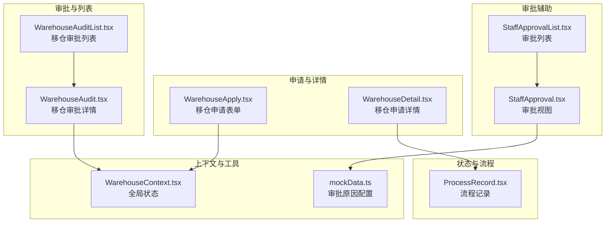
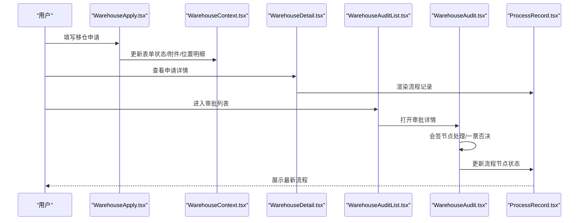
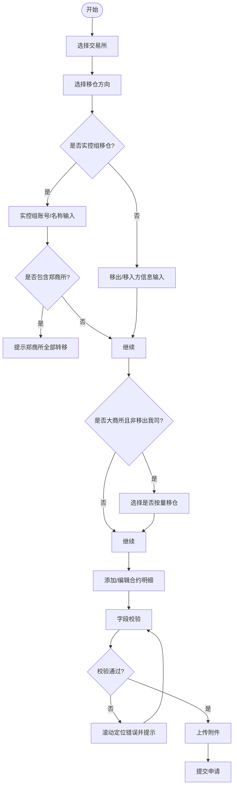
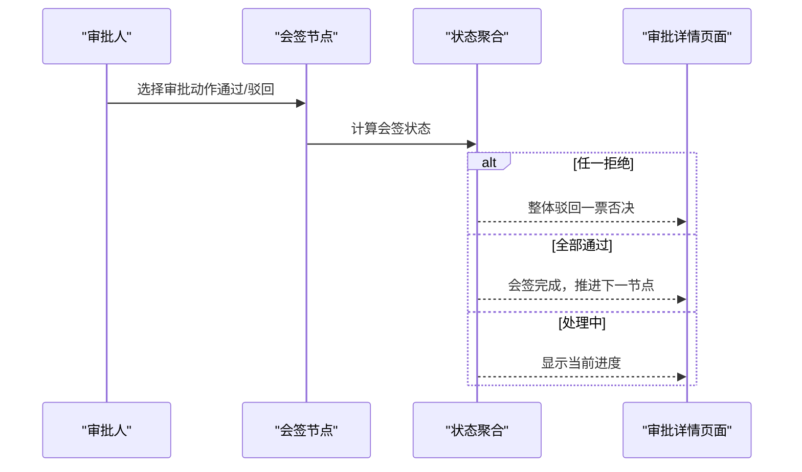
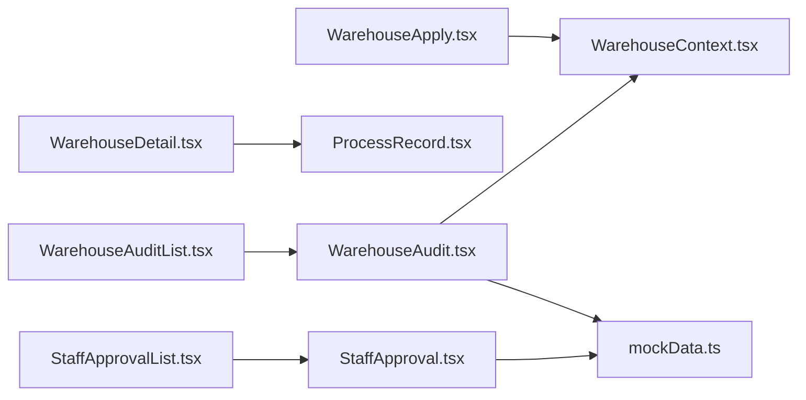

# 移仓审核流程

<cite>
**本文档引用的文件**
- [WarehouseAudit.tsx](file://src/app/pages/WarehouseAudit.tsx)
- [WarehouseAuditList.tsx](file://src/app/pages/WarehouseAuditList.tsx)
- [WarehouseApply.tsx](file://src/app/pages/WarehouseApply.tsx)
- [WarehouseDetail.tsx](file://src/app/pages/WarehouseDetail.tsx)
- [WarehouseContext.tsx](file://src/app/store/WarehouseContext.tsx)
- [ProcessRecord.tsx](file://src/app/components/ProcessRecord.tsx)
- [StaffApproval.tsx](file://src/app/pages/StaffApproval.tsx)
- [StaffApprovalList.tsx](file://src/app/pages/StaffApprovalList.tsx)
- [mockData.ts](file://src/app/utils/mockData.ts)
</cite>

## 目录
1. [简介](#简介)
2. [项目结构](#项目结构)
3. [核心组件](#核心组件)
4. [架构总览](#架构总览)
5. [详细组件分析](#详细组件分析)
6. [依赖关系分析](#依赖关系分析)
7. [性能考虑](#性能考虑)
8. [故障排除指南](#故障排除指南)
9. [结论](#结论)
10. [附录](#附录)

## 简介
本文件面向移仓业务的审批与管理，系统化梳理“移仓审核流程”的完整功能设计与实现，覆盖实控关系验证、风险评估、合约合规性检查、审核标准、风控指标计算与决策逻辑、移仓类型分类、审核要点清单、异常处理流程以及历史记录管理、状态变更追踪与审计日志能力。文档以仓库管理平台现有代码为基础，结合UI交互与状态机模型，形成可落地的业务说明与技术参考。

## 项目结构
围绕移仓审核的关键页面与上下文如下：
- 申请与详情：WarehouseApply.tsx（申请）、WarehouseDetail.tsx（详情）
- 审批与列表：WarehouseAudit.tsx（审批详情）、WarehouseAuditList.tsx（审批列表）
- 状态与流程：ProcessRecord.tsx（流程记录）
- 全局上下文：WarehouseContext.tsx（表单状态与数据）
- 审批辅助：StaffApproval.tsx、StaffApprovalList.tsx（审批视图与列表）
- 原因配置：mockData.ts（审批原因）

**图表来源**
- [WarehouseApply.tsx:1-909](file://src/app/pages/WarehouseApply.tsx#L1-L909)
- [WarehouseDetail.tsx:1-441](file://src/app/pages/WarehouseDetail.tsx#L1-L441)
- [WarehouseAudit.tsx:1-883](file://src/app/pages/WarehouseAudit.tsx#L1-L883)
- [WarehouseAuditList.tsx:1-704](file://src/app/pages/WarehouseAuditList.tsx#L1-L704)
- [ProcessRecord.tsx:1-135](file://src/app/components/ProcessRecord.tsx#L1-L135)
- [WarehouseContext.tsx:1-185](file://src/app/store/WarehouseContext.tsx#L1-L185)
- [StaffApproval.tsx:1-708](file://src/app/pages/StaffApproval.tsx#L1-L708)
- [StaffApprovalList.tsx:1-449](file://src/app/pages/StaffApprovalList.tsx#L1-L449)
- [mockData.ts:1-13](file://src/app/utils/mockData.ts#L1-L13)

**章节来源**
- [WarehouseApply.tsx:1-909](file://src/app/pages/WarehouseApply.tsx#L1-L909)
- [WarehouseDetail.tsx:1-441](file://src/app/pages/WarehouseDetail.tsx#L1-L441)
- [WarehouseAudit.tsx:1-883](file://src/app/pages/WarehouseAudit.tsx#L1-L883)
- [WarehouseAuditList.tsx:1-704](file://src/app/pages/WarehouseAuditList.tsx#L1-L704)
- [ProcessRecord.tsx:1-135](file://src/app/components/ProcessRecord.tsx#L1-L135)
- [WarehouseContext.tsx:1-185](file://src/app/store/WarehouseContext.tsx#L1-L185)
- [StaffApproval.tsx:1-708](file://src/app/pages/StaffApproval.tsx#L1-L708)
- [StaffApprovalList.tsx:1-449](file://src/app/pages/StaffApprovalList.tsx#L1-L449)
- [mockData.ts:1-13](file://src/app/utils/mockData.ts#L1-L13)

## 核心组件
- 移仓申请表单（WarehouseApply.tsx）
  - 支持多交易所选择、移仓方向（移入/移出/实控组）、合约明细、附件上传、实控组账号查询与权限控制。
  - 校验规则覆盖必填项、交易所与方向组合约束、大商所按量移仓、郑商所全部转移限制等。
- 移仓详情（WarehouseDetail.tsx）
  - 展示申请信息、移出/移入方、实控组信息、合约明细、附件与流程记录。
- 移仓审批详情（WarehouseAudit.tsx）
  - 审批流程可视化（串行/会签）、会签节点状态聚合（一票否决）、审批意见与原因选择。
- 移仓审批列表（WarehouseAuditList.tsx）
  - 列表筛选、批量处理、详情弹窗、状态颜色标识、会签节点状态展示。
- 全局上下文（WarehouseContext.tsx）
  - 统一管理申请表单状态、权限、附件、位置明细等，提供重置与权限切换能力。
- 流程记录（ProcessRecord.tsx）
  - 展示“客户提交→审批中→完成/失败/退回给客户”等状态链路与节点信息。
- 审批视图与列表（StaffApproval.tsx、StaffApprovalList.tsx）
  - 作为审批流程的通用模板，提供附件、CAP同步、权限表、操作日志与审批流程节点展示。

**章节来源**
- [WarehouseApply.tsx:1-909](file://src/app/pages/WarehouseApply.tsx#L1-L909)
- [WarehouseDetail.tsx:1-441](file://src/app/pages/WarehouseDetail.tsx#L1-L441)
- [WarehouseAudit.tsx:1-883](file://src/app/pages/WarehouseAudit.tsx#L1-L883)
- [WarehouseAuditList.tsx:1-704](file://src/app/pages/WarehouseAuditList.tsx#L1-L704)
- [WarehouseContext.tsx:1-185](file://src/app/store/WarehouseContext.tsx#L1-L185)
- [ProcessRecord.tsx:1-135](file://src/app/components/ProcessRecord.tsx#L1-L135)
- [StaffApproval.tsx:1-708](file://src/app/pages/StaffApproval.tsx#L1-L708)
- [StaffApprovalList.tsx:1-449](file://src/app/pages/StaffApprovalList.tsx#L1-L449)

## 架构总览
移仓审核采用“表单-详情-审批-列表-流程记录”的分层架构，配合全局上下文统一状态管理，审批详情页面集成会签节点与状态机，支持一票否决与进度提示。

**图表来源**
- [WarehouseApply.tsx:1-909](file://src/app/pages/WarehouseApply.tsx#L1-L909)
- [WarehouseContext.tsx:1-185](file://src/app/store/WarehouseContext.tsx#L1-L185)
- [WarehouseDetail.tsx:1-441](file://src/app/pages/WarehouseDetail.tsx#L1-L441)
- [ProcessRecord.tsx:1-135](file://src/app/components/ProcessRecord.tsx#L1-L135)
- [WarehouseAuditList.tsx:1-704](file://src/app/pages/WarehouseAuditList.tsx#L1-L704)
- [WarehouseAudit.tsx:1-883](file://src/app/pages/WarehouseAudit.tsx#L1-L883)

## 详细组件分析

### 移仓申请表单（WarehouseApply.tsx）
- 功能要点
  - 多交易所选择与动态行生成：根据交易所集合自动生成/删除合约明细行，避免无效组合。
  - 移仓方向与实控组限制：仅在满足“仅选择大商所或上期所”条件下允许实控组移仓。
  - 实控组账号查询：基于本地数据库按账号查询并受权限控制，防止越权查看。
  - 字段校验：方向、交易所、移出/移入方信息、大商所按量移仓、合约明细手数、确认声明等。
  - 附件上传：支持多文件上传与删除。
- 关键接口与状态
  - 使用 WarehouseContext 管理 selectedExchanges、direction、positions、attachments、confirmed 等。
  - 校验函数返回错误映射，滚动定位到首个错误字段。
- 会签与手数标签
  - 根据交易所与方向动态设置“移仓手数/预估移仓手数”列头，确保不同交易所规则一致。

**图表来源**
- [WarehouseApply.tsx:1-909](file://src/app/pages/WarehouseApply.tsx#L1-L909)
- [WarehouseContext.tsx:1-185](file://src/app/store/WarehouseContext.tsx#L1-L185)

**章节来源**
- [WarehouseApply.tsx:1-909](file://src/app/pages/WarehouseApply.tsx#L1-L909)
- [WarehouseContext.tsx:1-185](file://src/app/store/WarehouseContext.tsx#L1-L185)

### 移仓详情（WarehouseDetail.tsx）
- 功能要点
  - 只读展示：移仓交易所、方向、移出/移入方、实控组信息、合约明细、附件与补充说明。
  - 手数列头动态：根据交易所与方向自动选择“移仓手数/预估移仓手数”，并支持混合场景下的通用标签。
  - 流程记录：通过 ProcessRecord 组件展示状态链路与节点信息。
- 适用场景
  - 客户/内部人员查看申请详情；与审批详情页面共享数据结构。

**章节来源**
- [WarehouseDetail.tsx:1-441](file://src/app/pages/WarehouseDetail.tsx#L1-L441)
- [ProcessRecord.tsx:1-135](file://src/app/components/ProcessRecord.tsx#L1-L135)

### 移仓审批详情（WarehouseAudit.tsx）
- 功能要点
  - 审批流程可视化：串行节点与会签节点并存，支持当前节点高亮与进度提示。
  - 会签节点状态聚合：getCounterSignStatus 实现“一票否决”，任一拒绝即整体驳回。
  - 审批动作：通过/驳回/办理失败，支持快捷原因选择与自定义原因。
  - 数据结构：Approver、FlowStep、AuditData 等，支撑流程节点渲染与交互。
- 关键交互
  - 当前会签节点：自动定位第一个 pending 的审批人，处理通过/驳回后更新 approvers 状态。
  - 非会签节点：支持统一的“驳回/失败”动作与原因选择。

**图表来源**
- [WarehouseAudit.tsx:1-883](file://src/app/pages/WarehouseAudit.tsx#L1-L883)

**章节来源**
- [WarehouseAudit.tsx:1-883](file://src/app/pages/WarehouseAudit.tsx#L1-L883)
- [mockData.ts:1-13](file://src/app/utils/mockData.ts#L1-L13)

### 移仓审批列表（WarehouseAuditList.tsx）
- 功能要点
  - 列表筛选：支持流水号、资金账号、客户名称、营业部、交易所、移仓方向、申请日期、状态、经办/复核人等维度。
  - 批量处理：批量审批、批量导出、批量附件下载。
  - 详情弹窗：打开 WarehouseAudit 审批详情，支持“已驳回/会签进行中/全部通过/已完成”等状态展示。
  - 会签状态：根据 Approver 数组状态聚合显示“已驳回/已通过/处理中”。

**章节来源**
- [WarehouseAuditList.tsx:1-704](file://src/app/pages/WarehouseAuditList.tsx#L1-L704)

### 全局上下文（WarehouseContext.tsx）
- 功能要点
  - 统一管理申请表单状态：selectedExchanges、direction、positions、attachments、confirmed 等。
  - 权限控制：accountPermissions 与 hasPermissionForAccount，用于实控组账号查询权限判断。
  - 重置能力：reset 将所有状态恢复默认。
- 作用域
  - 申请、详情、审批等页面共享状态，保证数据一致性与跨页面协作。

**章节来源**
- [WarehouseContext.tsx:1-185](file://src/app/store/WarehouseContext.tsx#L1-L185)

### 流程记录（ProcessRecord.tsx）
- 功能要点
  - 展示“客户提交→审批中→完成/失败/退回给客户”等状态链路。
  - 支持不同状态下的图标、颜色与文案，便于快速识别流程阶段与结果。

**章节来源**
- [ProcessRecord.tsx:1-135](file://src/app/components/ProcessRecord.tsx#L1-L135)

### 审批视图与列表（StaffApproval.tsx、StaffApprovalList.tsx）
- 功能要点
  - 作为审批流程的通用模板，提供附件管理、CAP同步、权限表、操作日志与审批流程节点展示。
  - 与移仓审批详情页面共享“原因选择”与“批量处理”交互模式。

**章节来源**
- [StaffApproval.tsx:1-708](file://src/app/pages/StaffApproval.tsx#L1-L708)
- [StaffApprovalList.tsx:1-449](file://src/app/pages/StaffApprovalList.tsx#L1-L449)

## 依赖关系分析
- 组件耦合
  - WarehouseApply.tsx 依赖 WarehouseContext.tsx 进行状态管理；依赖 WarehouseDetail.tsx 的只读展示。
  - WarehouseAudit.tsx 依赖 WarehouseContext.tsx 的会签状态与 Approver 结构；依赖 mockData.ts 的审批原因。
  - WarehouseAuditList.tsx 依赖 WarehouseAudit.tsx 的详情弹窗。
  - ProcessRecord.tsx 作为通用流程记录组件，被详情与审批详情页面复用。
- 外部依赖
  - mockData.ts 提供审批原因配置，支持启用/禁用与业务类型过滤。
  - WarehouseContext.tsx 提供权限控制与状态重置，降低页面间耦合。

**图表来源**
- [WarehouseApply.tsx:1-909](file://src/app/pages/WarehouseApply.tsx#L1-L909)
- [WarehouseDetail.tsx:1-441](file://src/app/pages/WarehouseDetail.tsx#L1-L441)
- [WarehouseAudit.tsx:1-883](file://src/app/pages/WarehouseAudit.tsx#L1-L883)
- [WarehouseAuditList.tsx:1-704](file://src/app/pages/WarehouseAuditList.tsx#L1-L704)
- [ProcessRecord.tsx:1-135](file://src/app/components/ProcessRecord.tsx#L1-L135)
- [WarehouseContext.tsx:1-185](file://src/app/store/WarehouseContext.tsx#L1-L185)
- [StaffApproval.tsx:1-708](file://src/app/pages/StaffApproval.tsx#L1-L708)
- [StaffApprovalList.tsx:1-449](file://src/app/pages/StaffApprovalList.tsx#L1-L449)
- [mockData.ts:1-13](file://src/app/utils/mockData.ts#L1-L13)

**章节来源**
- [WarehouseApply.tsx:1-909](file://src/app/pages/WarehouseApply.tsx#L1-L909)
- [WarehouseAudit.tsx:1-883](file://src/app/pages/WarehouseAudit.tsx#L1-L883)
- [WarehouseAuditList.tsx:1-704](file://src/app/pages/WarehouseAuditList.tsx#L1-L704)
- [WarehouseContext.tsx:1-185](file://src/app/store/WarehouseContext.tsx#L1-L185)
- [mockData.ts:1-13](file://src/app/utils/mockData.ts#L1-L13)

## 性能考虑
- 渲染优化
  - 列表页面采用虚拟滚动与分页，减少 DOM 节点数量。
  - 详情与审批详情使用弹窗/模态，避免重复渲染主页面。
- 状态管理
  - 通过 WarehouseContext.tsx 集中管理状态，避免跨页面重复请求与数据同步问题。
- 会签状态计算
  - getCounterSignStatus 采用一次性遍历聚合，复杂度 O(n)，适合小规模会签节点。

[本节为通用指导，无需特定文件引用]

## 故障排除指南
- 常见问题与处理
  - 实控组账号查询无权限：检查 accountPermissions 中对应账号权限位，必要时调用 toggleAccountPermission 切换。
  - 会签节点被一票否决：检查 Approver 数组中是否存在 rejected 状态，一旦存在则整体会签驳回。
  - 校验失败滚动定位：validation 返回错误映射，使用 document.querySelector 定位首个错误字段并滚动至可视区域。
  - 附件上传失败：检查文件类型与大小限制，确保 accept 与大小校验通过。
- 审批原因选择
  - 使用 getEnabledReasons 获取启用的原因列表，支持“其他原因（自定义）”输入。

**章节来源**
- [WarehouseContext.tsx:1-185](file://src/app/store/WarehouseContext.tsx#L1-L185)
- [WarehouseAudit.tsx:1-883](file://src/app/pages/WarehouseAudit.tsx#L1-L883)
- [mockData.ts:1-13](file://src/app/utils/mockData.ts#L1-L13)

## 结论
本方案以“表单-详情-审批-列表-流程记录”为核心路径，结合全局上下文与会签状态机，实现了移仓业务的闭环管理。通过严格的字段校验、交易所与方向组合约束、实控组权限控制与会签一票否决机制，有效保障了业务合规与风控要求。同时，流程记录与审批原因配置提升了透明度与可追溯性，便于后续审计与优化。

[本节为总结性内容，无需特定文件引用]

## 附录

### 移仓类型分类与审核要点
- 类型分类
  - 移入我司（IN）：需填写移出方信息与客户交易编码/名称。
  - 移出我司（OUT）：需填写移入方信息与统一申请理由。
  - 实控组移仓（ACTUAL_CONTROL）：仅限大商所或上期所，且仅选择单一交易所；需输入实控组账号与名称。
- 审核要点清单
  - 实控关系验证：账号存在性与权限校验；实控组账户间转移需符合监管与公司制度。
  - 风险评估：账户状态、适当性等级、反洗钱风险等级、资产与负债情况。
  - 合约合规性检查：交易所规则（郑商所全部转移、大商所按量移仓）、合约类型与方向、手数有效性。
  - 附件完整性：申请表、身份证明、持仓证明等。
  - 会签节点：运营中心风控/交割/结算评估，一票否决机制确保风险可控。

**章节来源**
- [WarehouseApply.tsx:1-909](file://src/app/pages/WarehouseApply.tsx#L1-L909)
- [WarehouseAudit.tsx:1-883](file://src/app/pages/WarehouseAudit.tsx#L1-L883)

### 审核标准与风控指标
- 审核标准
  - 交易所与方向组合合法性；实控组账号权限与存在性；移出/移入方信息一致性；大商所按量移仓与郑商所全部转移规则。
- 风控指标
  - 账户可用资金、保证金比例、持仓集中度、交易编码状态、反洗钱等级、适当性匹配度。
- 决策逻辑
  - 通过：满足所有标准且无会签拒绝。
  - 驳回：任一标准不满足或会签拒绝。
  - 办理失败：系统异常或外部数据不可用。

**章节来源**
- [WarehouseApply.tsx:1-909](file://src/app/pages/WarehouseApply.tsx#L1-L909)
- [WarehouseAudit.tsx:1-883](file://src/app/pages/WarehouseAudit.tsx#L1-L883)

### 历史记录管理、状态变更追踪与审计日志
- 历史记录管理
  - 通过 ProcessRecord.tsx 展示“客户提交→审批中→完成/失败/退回给客户”等状态链路，支持查看操作人与时间戳。
- 状态变更追踪
  - 审批列表与详情页面实时反映状态变化；会签节点状态聚合与进度提示。
- 审计日志
  - 审批视图提供操作日志表格，记录“同步CAP-待开通编码”等关键动作的状态与时间，便于审计与追溯。

**章节来源**
- [ProcessRecord.tsx:1-135](file://src/app/components/ProcessRecord.tsx#L1-L135)
- [StaffApproval.tsx:1-708](file://src/app/pages/StaffApproval.tsx#L1-L708)
- [StaffApprovalList.tsx:1-449](file://src/app/pages/StaffApprovalList.tsx#L1-L449)