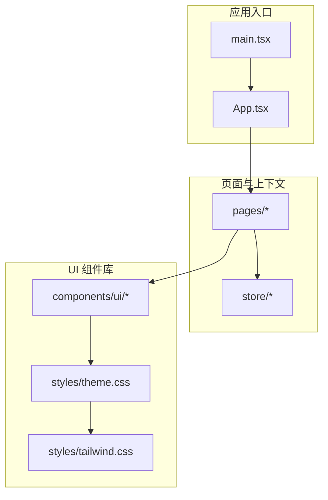
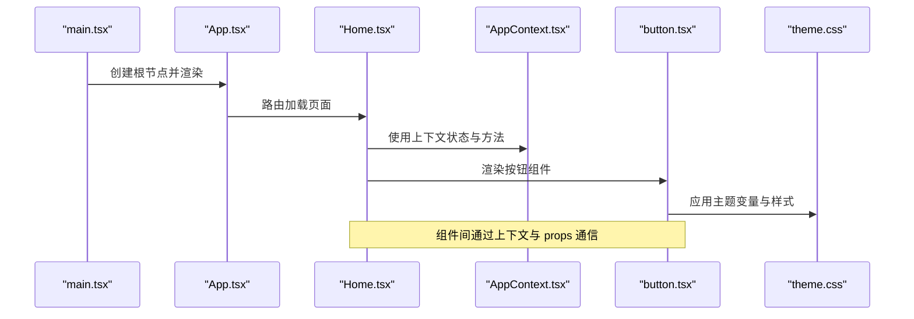
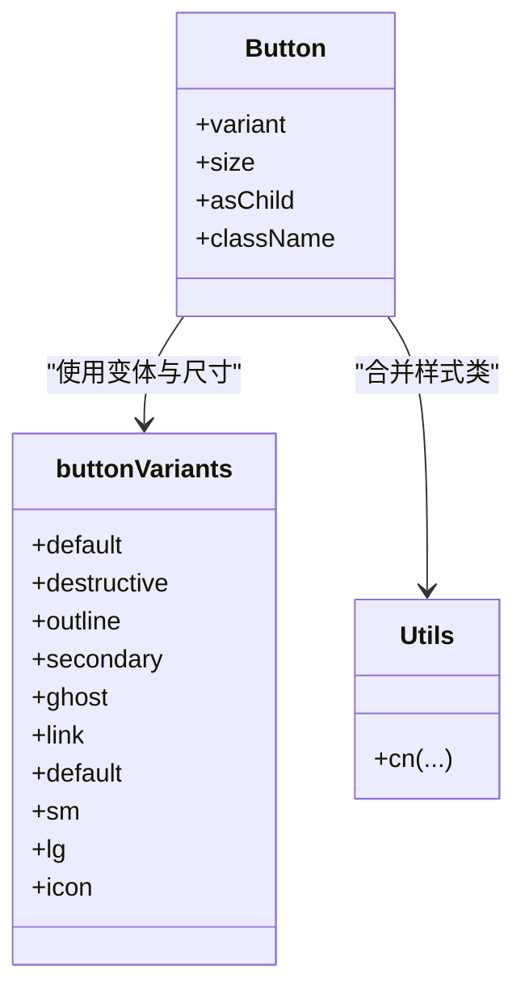
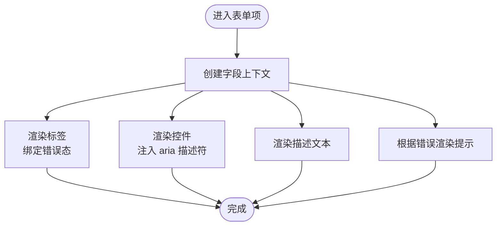
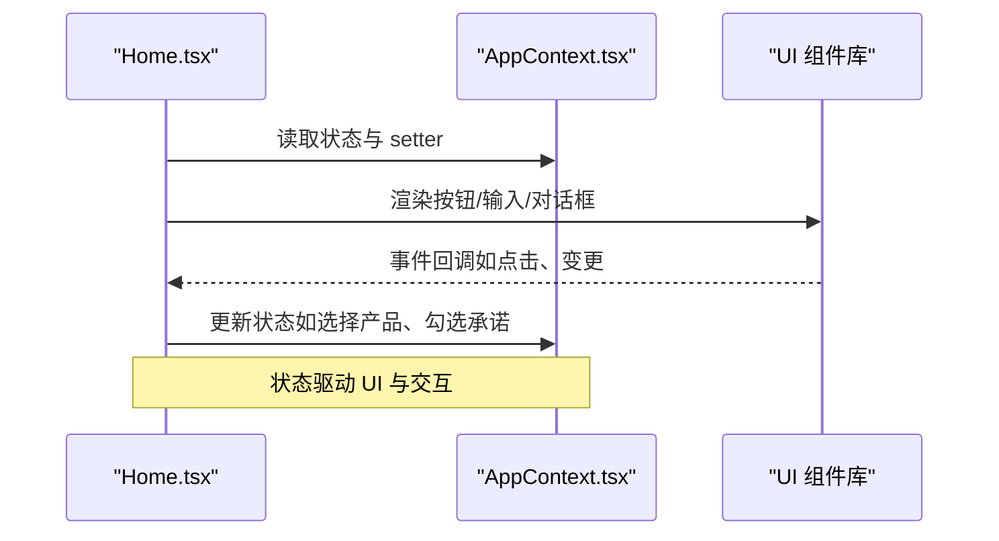
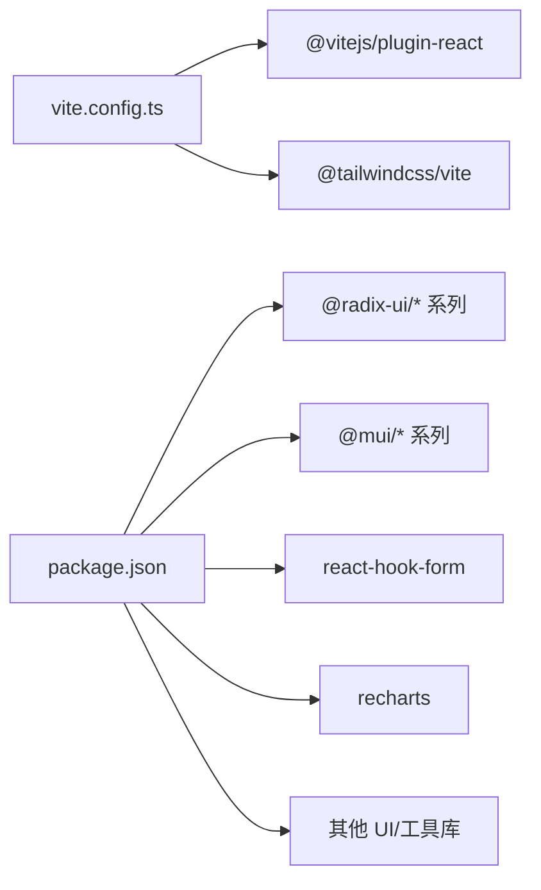

# 代码规范

<cite>
**本文引用的文件**
- [Guidelines.md](file://guidelines/Guidelines.md)
- [Guidelines.md（权限申请模块）](file://permission_apply/guidelines/Guidelines.md)
- [package.json](file://package.json)
- [vite.config.ts](file://vite.config.ts)
- [button.tsx](file://src/app/components/ui/button.tsx)
- [utils.ts（UI 组件）](file://src/app/components/ui/utils.ts)
- [input.tsx](file://src/app/components/ui/input.tsx)
- [form.tsx](file://src/app/components/ui/form.tsx)
- [tailwind.css](file://src/styles/tailwind.css)
- [theme.css](file://src/styles/theme.css)
- [Home.tsx](file://src/app/pages/Home.tsx)
- [AppContext.tsx](file://src/app/store/AppContext.tsx)
- [utils.ts（通用工具）](file://src/lib/utils.ts)
- [App.tsx](file://src/app/App.tsx)
- [main.tsx](file://src/main.tsx)
</cite>

## 目录
1. [引言](#引言)
2. [项目结构](#项目结构)
3. [核心组件](#核心组件)
4. [架构总览](#架构总览)
5. [详细组件分析](#详细组件分析)
6. [依赖分析](#依赖分析)
7. [性能考虑](#性能考虑)
8. [故障排查指南](#故障排查指南)
9. [结论](#结论)
10. [附录](#附录)

## 引言
本文件面向参与“管理平台”项目的开发者，系统化阐述项目的代码规范、命名约定、文件组织结构与代码风格要求。内容以仓库中的 Guideline 模板为基础，结合实际 UI 组件、主题与构建配置，给出可执行的设计系统与前端工程实践建议。同时提供正反例的路径指引，帮助团队统一风格、提升可维护性与协作效率。

## 项目结构
项目采用按功能域分层的组织方式：
- 应用入口与路由：src/main.tsx、src/app/App.tsx、src/app/routes.tsx
- 页面与上下文：src/app/pages、src/app/store
- UI 组件库：src/app/components/ui 及其子目录
- 样式与主题：src/styles
- 构建与脚本：vite.config.ts、package.json
- 规范模板：guidelines/Guidelines.md、permission_apply/guidelines/Guidelines.md

图表来源
- [main.tsx:1-7](file://src/main.tsx#L1-L7)
- [App.tsx:1-6](file://src/app/App.tsx#L1-L6)
- [Home.tsx:1-809](file://src/app/pages/Home.tsx#L1-L809)
- [AppContext.tsx:1-64](file://src/app/store/AppContext.tsx#L1-L64)
- [button.tsx:1-59](file://src/app/components/ui/button.tsx#L1-L59)
- [theme.css:1-182](file://src/styles/theme.css#L1-L182)
- [tailwind.css:1-5](file://src/styles/tailwind.css#L1-L5)

章节来源
- [main.tsx:1-7](file://src/main.tsx#L1-L7)
- [App.tsx:1-6](file://src/app/App.tsx#L1-L6)
- [Home.tsx:1-809](file://src/app/pages/Home.tsx#L1-L809)
- [AppContext.tsx:1-64](file://src/app/store/AppContext.tsx#L1-L64)
- [button.tsx:1-59](file://src/app/components/ui/button.tsx#L1-L59)
- [theme.css:1-182](file://src/styles/theme.css#L1-L182)
- [tailwind.css:1-5](file://src/styles/tailwind.css#L1-L5)

## 核心组件
- 设计系统与按钮规范：参考 Guideline 模板中的“Button”小节，明确主次三级按钮的用途、视觉风格与使用边界。
- UI 组件实现：button.tsx 使用 cva 定义变体与尺寸，配合 utils.ts 的 cn 合并工具类，确保样式一致性与可组合性。
- 表单体系：form.tsx 提供表单上下文、字段上下文与错误状态传播，结合 input.tsx 的输入样式，形成一致的表单体验。
- 主题与样式：theme.css 定义 CSS 变量与暗色适配；tailwind.css 配置源文件扫描与动画扩展。

章节来源
- [Guidelines.md:40-61](file://guidelines/Guidelines.md#L40-L61)
- [Guidelines.md（权限申请模块）:40-61](file://permission_apply/guidelines/Guidelines.md#L40-L61)
- [button.tsx:1-59](file://src/app/components/ui/button.tsx#L1-L59)
- [utils.ts（UI 组件）:1-7](file://src/app/components/ui/utils.ts#L1-L7)
- [input.tsx:1-22](file://src/app/components/ui/input.tsx#L1-L22)
- [form.tsx:1-169](file://src/app/components/ui/form.tsx#L1-L169)
- [theme.css:1-182](file://src/styles/theme.css#L1-L182)
- [tailwind.css:1-5](file://src/styles/tailwind.css#L1-L5)

## 架构总览
下图展示从入口到页面、再到 UI 组件与样式的调用链路，体现“组件即服务”的设计思想与样式管线。

图表来源
- [main.tsx:1-7](file://src/main.tsx#L1-L7)
- [App.tsx:1-6](file://src/app/App.tsx#L1-L6)
- [Home.tsx:1-809](file://src/app/pages/Home.tsx#L1-L809)
- [AppContext.tsx:1-64](file://src/app/store/AppContext.tsx#L1-L64)
- [button.tsx:1-59](file://src/app/components/ui/button.tsx#L1-L59)
- [theme.css:1-182](file://src/styles/theme.css#L1-L182)

## 详细组件分析

### 按钮组件（Button）规范与实现
- 设计系统约束：依据 Guideline 模板，按钮分为主按钮、次按钮、文本按钮三类，分别用于主要动作、辅助动作与低优先级动作。
- 实现要点：
  - 使用 cva 定义变体与尺寸，集中管理视觉状态。
  - 通过 asChild 支持语义标签与自定义容器的透传。
  - 使用 cn 合并工具类，保证 Tailwind 与主题变量的正确合并。
- 最佳实践：
  - 在页面中优先使用主按钮承载关键动作，避免同页出现多个主按钮。
  - 图标按钮应保持尺寸一致，避免破坏栅格对齐。
  - 禁用态必须具备明确的视觉反馈，确保可访问性。

图表来源
- [button.tsx:1-59](file://src/app/components/ui/button.tsx#L1-L59)
- [utils.ts（UI 组件）:1-7](file://src/app/components/ui/utils.ts#L1-L7)

章节来源
- [Guidelines.md:40-61](file://guidelines/Guidelines.md#L40-L61)
- [Guidelines.md（权限申请模块）:40-61](file://permission_apply/guidelines/Guidelines.md#L40-L61)
- [button.tsx:1-59](file://src/app/components/ui/button.tsx#L1-L59)
- [utils.ts（UI 组件）:1-7](file://src/app/components/ui/utils.ts#L1-L7)

### 表单组件体系（Form）
- 上下文与字段：FormField、Form、FormLabel、FormControl、FormMessage 等协同，提供错误状态、描述与可访问性属性。
- 无障碍与可访问性：通过 data-slot、aria-* 属性与 useId 生成唯一标识，确保屏幕阅读器友好。
- 错误提示：FormMessage 自动读取错误对象并渲染，支持静态文本与动态错误消息。

图表来源
- [form.tsx:1-169](file://src/app/components/ui/form.tsx#L1-L169)

章节来源
- [form.tsx:1-169](file://src/app/components/ui/form.tsx#L1-L169)

### 输入组件（Input）与表单集成
- 输入样式：统一的边框、聚焦环、禁用态与错误态处理，确保与主题变量一致。
- 与表单联动：通过 FormLabel、FormControl、FormMessage 形成闭环，提升一致性与可维护性。

章节来源
- [input.tsx:1-22](file://src/app/components/ui/input.tsx#L1-L22)
- [form.tsx:1-169](file://src/app/components/ui/form.tsx#L1-L169)

### 主题与样式（Tailwind 与 CSS 变量）
- CSS 变量：theme.css 定义品牌色、背景、前景、边框、输入、开关等变量，并提供暗色适配。
- Tailwind 层：tailwind.css 通过 @source 指定扫描范围，启用 tw-animate-css 动画扩展。
- 工具函数：utils.ts（通用工具）与 utils.ts（UI 组件）均提供 cn 合并能力，确保样式覆盖顺序合理。

章节来源
- [theme.css:1-182](file://src/styles/theme.css#L1-L182)
- [tailwind.css:1-5](file://src/styles/tailwind.css#L1-L5)
- [utils.ts（通用工具）:1-6](file://src/lib/utils.ts#L1-L6)
- [utils.ts（UI 组件）:1-7](file://src/app/components/ui/utils.ts#L1-L7)

### 页面与上下文（Home 与 AppContext）
- 页面职责：Home 负责业务流程编排、状态管理与交互逻辑，通过 AppContext 获取全局状态。
- 上下文设计：AppContext 抽象风险等级、资金等级、是否已有权限等关键状态，提供 setter 方法，便于跨组件共享。

图表来源
- [Home.tsx:1-809](file://src/app/pages/Home.tsx#L1-L809)
- [AppContext.tsx:1-64](file://src/app/store/AppContext.tsx#L1-L64)
- [button.tsx:1-59](file://src/app/components/ui/button.tsx#L1-L59)
- [input.tsx:1-22](file://src/app/components/ui/input.tsx#L1-L22)

章节来源
- [Home.tsx:1-809](file://src/app/pages/Home.tsx#L1-L809)
- [AppContext.tsx:1-64](file://src/app/store/AppContext.tsx#L1-L64)

## 依赖分析
- 构建与插件：vite.config.ts 配置了 React 与 Tailwind 插件、路径别名与资源导入策略。
- 依赖清单：package.json 列举了 UI 原子组件、表单库、日期与可视化等依赖，确保生态一致性。

图表来源
- [vite.config.ts:1-37](file://vite.config.ts#L1-L37)
- [package.json:1-91](file://package.json#L1-L91)

章节来源
- [vite.config.ts:1-37](file://vite.config.ts#L1-L37)
- [package.json:1-91](file://package.json#L1-L91)

## 性能考虑
- 组件体积与拆分：遵循“小文件、高内聚”的原则，将通用逻辑抽离至独立文件，减少重复打包。
- 样式合并：统一使用 cn 合并工具类，避免重复样式导致的体积膨胀。
- 按需引入：仅在必要时使用绝对定位与复杂布局，优先采用 Flex/Grid，降低重绘成本。
- 表单与交互：在 Home 页面中，通过上下文集中管理状态，避免深层传递与不必要的重渲染。

## 故障排查指南
- 样式异常
  - 确认 tailwind.css 的 @source 范围是否包含目标文件。
  - 检查 theme.css 中变量值与暗色模式适配是否正确。
  - 参考路径：[tailwind.css:1-5](file://src/styles/tailwind.css#L1-L5)、[theme.css:1-182](file://src/styles/theme.css#L1-L182)
- 组件样式冲突
  - 使用 cn 合并工具类，确保后加载的样式覆盖前者的冲突。
  - 参考路径：[utils.ts（UI 组件）:1-7](file://src/app/components/ui/utils.ts#L1-L7)、[utils.ts（通用工具）:1-6](file://src/lib/utils.ts#L1-L6)
- 表单错误显示
  - 检查 FormMessage 是否正确读取错误对象，确认 FormField 上下文是否被包裹。
  - 参考路径：[form.tsx:1-169](file://src/app/components/ui/form.tsx#L1-L169)
- 构建问题
  - 确认 vite.config.ts 中的插件与别名配置是否正确。
  - 参考路径：[vite.config.ts:1-37](file://vite.config.ts#L1-L37)

章节来源
- [tailwind.css:1-5](file://src/styles/tailwind.css#L1-L5)
- [theme.css:1-182](file://src/styles/theme.css#L1-L182)
- [utils.ts（UI 组件）:1-7](file://src/app/components/ui/utils.ts#L1-L7)
- [utils.ts（通用工具）:1-6](file://src/lib/utils.ts#L1-L6)
- [form.tsx:1-169](file://src/app/components/ui/form.tsx#L1-L169)
- [vite.config.ts:1-37](file://vite.config.ts#L1-L37)

## 结论
本规范以 Guideline 模板为纲，结合 UI 组件实现与主题样式，给出了可落地的设计系统与工程实践建议。建议团队在日常开发中：
- 严格遵循按钮与表单的使用规范，保持界面一致性；
- 使用统一的样式合并工具与主题变量，避免样式碎片化；
- 通过上下文集中管理状态，提升可维护性；
- 在构建与样式层面遵循现有配置，减少环境差异带来的问题。

## 附录

### TypeScript 编码规范（建议）
- 类型优先：优先使用接口与联合类型表达状态与属性，避免 any。
- 上下文约束：在 hooks 与 context 中显式声明返回值类型，确保类型安全。
- 示例路径
  - [AppContext.tsx:1-64](file://src/app/store/AppContext.tsx#L1-L64)

### React 组件命名与文件组织
- 组件命名：采用帕斯卡命名（Button、Input），文件名与导出名一致。
- 文件组织：将相关组件与工具函数置于同一目录，避免跨层级引用。
- 示例路径
  - [button.tsx:1-59](file://src/app/components/ui/button.tsx#L1-L59)
  - [input.tsx:1-22](file://src/app/components/ui/input.tsx#L1-L22)
  - [form.tsx:1-169](file://src/app/components/ui/form.tsx#L1-L169)

### 设计系统指南（按钮）
- 主按钮：用于页面/区域的主要动作，强调品牌色填充。
- 次按钮：用于辅助动作，轮廓线与透明背景。
- 文本按钮：用于低优先级动作，纯文本无边框。
- 使用边界：每页仅保留一个主按钮，避免用户决策负担。
- 示例路径
  - [Guidelines.md:40-61](file://guidelines/Guidelines.md#L40-L61)
  - [Guidelines.md（权限申请模块）:40-61](file://permission_apply/guidelines/Guidelines.md#L40-L61)
  - [button.tsx:1-59](file://src/app/components/ui/button.tsx#L1-L59)

### 样式与主题标准
- 字号与字重：通过 CSS 变量统一管理字号与字重，确保一致性。
- 暗色模式：在 .dark 选择器中提供变量映射，保证夜间模式可用。
- 动画扩展：启用 tw-animate-css，按需添加过渡效果。
- 示例路径
  - [theme.css:1-182](file://src/styles/theme.css#L1-L182)
  - [tailwind.css:1-5](file://src/styles/tailwind.css#L1-L5)