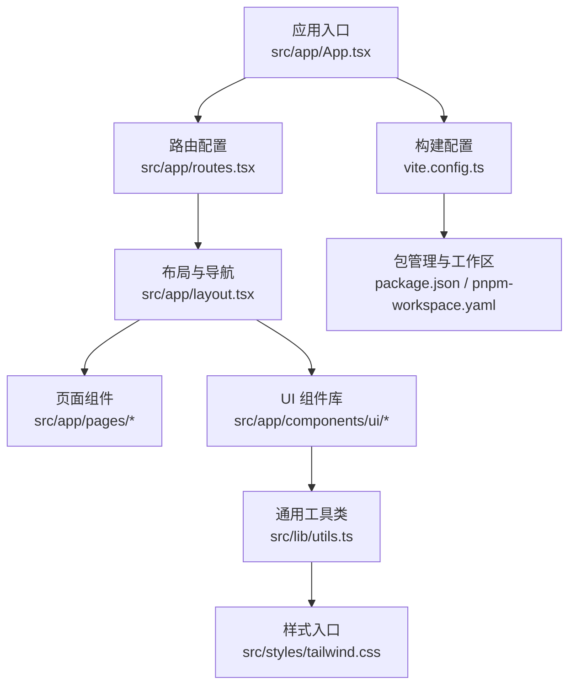
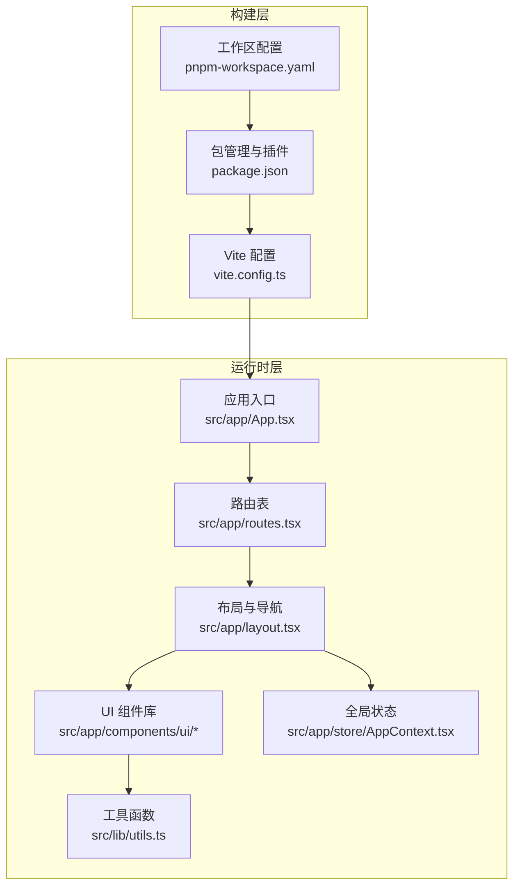
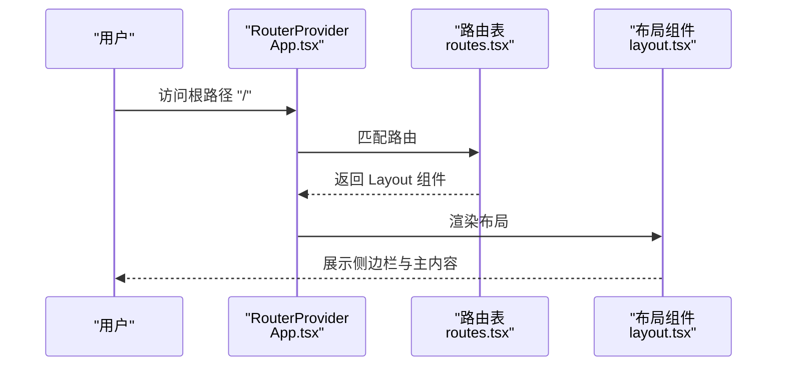
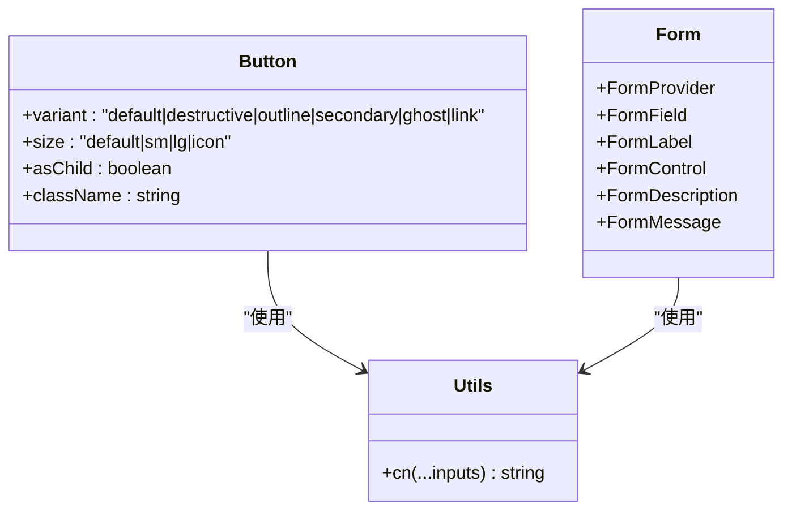
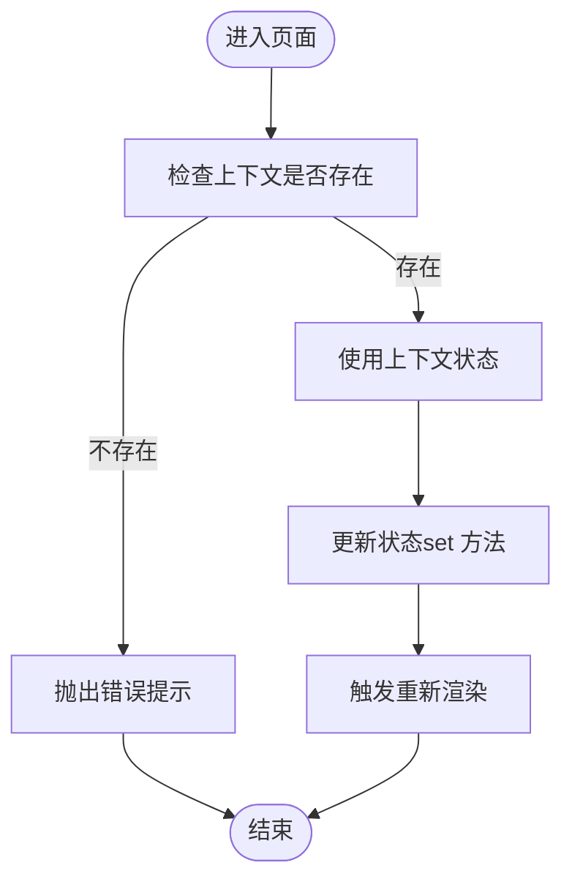
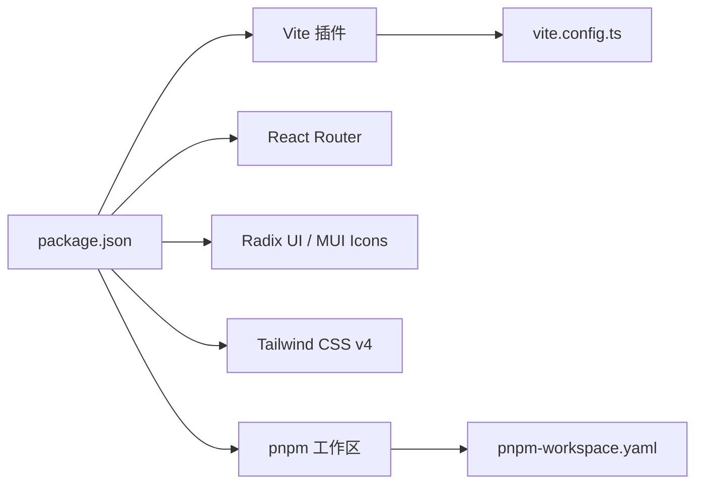

# 开发指南

<cite>
**本文引用的文件**
- [README.md](file://README.md)
- [package.json](file://package.json)
- [vite.config.ts](file://vite.config.ts)
- [pnpm-workspace.yaml](file://pnpm-workspace.yaml)
- [src/app/App.tsx](file://src/app/App.tsx)
- [src/app/layout.tsx](file://src/app/layout.tsx)
- [src/app/routes.tsx](file://src/app/routes.tsx)
- [src/lib/utils.ts](file://src/lib/utils.ts)
- [src/styles/tailwind.css](file://src/styles/tailwind.css)
- [src/app/components/ui/button.tsx](file://src/app/components/ui/button.tsx)
- [src/app/components/ui/form.tsx](file://src/app/components/ui/form.tsx)
- [src/app/store/AppContext.tsx](file://src/app/store/AppContext.tsx)
- [deploy/deploy.sh](file://deploy/deploy.sh)
- [guidelines/Guidelines.md](file://guidelines/Guidelines.md)
- [permission_apply/guidelines/Guidelines.md](file://permission_apply/guidelines/Guidelines.md)
</cite>

## 目录
1. 引言
2. 项目结构
3. 核心组件
4. 架构总览
5. 详细组件分析
6. 依赖关系分析
7. 性能考虑
8. 故障排查指南
9. 结论
10. 附录

## 引言
本开发指南面向参与“管理平台”项目的开发者与运维人员，目标是统一开发规范、组件设计与实现方式、测试与调试策略，并明确版本控制与部署流程。文档以仓库现有代码与配置为基础，结合可复用的设计系统与上下文状态管理，帮助团队高效协作、降低维护成本。

## 项目结构
项目采用基于功能模块的前端工程化组织方式，核心入口位于 src 目录，路由与页面按业务域划分，UI 组件遵循设计系统与原子化变体模式，样式通过 Tailwind CSS 与自定义工具函数组合，构建工具使用 Vite 并集成 React 插件与 Tailwind 插件。

图表来源
- [src/app/App.tsx:1-6](file://src/app/App.tsx#L1-L6)
- [src/app/routes.tsx:1-38](file://src/app/routes.tsx#L1-L38)
- [src/app/layout.tsx:1-175](file://src/app/layout.tsx#L1-L175)
- [src/lib/utils.ts:1-6](file://src/lib/utils.ts#L1-L6)
- [src/styles/tailwind.css:1-5](file://src/styles/tailwind.css#L1-L5)
- [vite.config.ts:1-37](file://vite.config.ts#L1-L37)
- [package.json:1-91](file://package.json#L1-L91)
- [pnpm-workspace.yaml:1-10](file://pnpm-workspace.yaml#L1-L10)

章节来源
- [README.md:1-11](file://README.md#L1-L11)
- [package.json:1-91](file://package.json#L1-L91)
- [vite.config.ts:1-37](file://vite.config.ts#L1-L37)
- [pnpm-workspace.yaml:1-10](file://pnpm-workspace.yaml#L1-L10)

## 核心组件
- 应用入口与路由：应用通过 RouterProvider 提供路由能力，路由表集中定义各页面路径与组件映射，支持首页、表单提交、审批流、系统设置及仓储相关页面。
- 布局与导航：左侧固定侧边栏与顶部导航结合面包屑，提供清晰的模块分组与页面定位；支持系统设置跨模块共享。
- 设计系统与 UI 组件：Button 与 Form 等组件采用变体模式与原子化类名合并工具，保证一致的交互与视觉风格。
- 上下文状态：AppContext 提供全局状态（如风险等级、资金规模等），便于跨页面共享与联动。

章节来源
- [src/app/App.tsx:1-6](file://src/app/App.tsx#L1-L6)
- [src/app/routes.tsx:1-38](file://src/app/routes.tsx#L1-L38)
- [src/app/layout.tsx:1-175](file://src/app/layout.tsx#L1-L175)
- [src/app/components/ui/button.tsx:1-59](file://src/app/components/ui/button.tsx#L1-L59)
- [src/app/components/ui/form.tsx:1-169](file://src/app/components/ui/form.tsx#L1-L169)
- [src/app/store/AppContext.tsx:1-64](file://src/app/store/AppContext.tsx#L1-L64)

## 架构总览
整体采用“路由驱动 + 组件化 + 设计系统 + 状态管理”的前端架构。构建阶段通过 Vite 集成 React 与 Tailwind 插件，支持别名与资源解析扩展；运行时通过 React Router v7 提供页面级导航与嵌套路由。

图表来源
- [vite.config.ts:1-37](file://vite.config.ts#L1-L37)
- [package.json:1-91](file://package.json#L1-L91)
- [pnpm-workspace.yaml:1-10](file://pnpm-workspace.yaml#L1-L10)
- [src/app/App.tsx:1-6](file://src/app/App.tsx#L1-L6)
- [src/app/routes.tsx:1-38](file://src/app/routes.tsx#L1-L38)
- [src/app/layout.tsx:1-175](file://src/app/layout.tsx#L1-L175)
- [src/app/components/ui/button.tsx:1-59](file://src/app/components/ui/button.tsx#L1-L59)
- [src/app/components/ui/form.tsx:1-169](file://src/app/components/ui/form.tsx#L1-L169)
- [src/lib/utils.ts:1-6](file://src/lib/utils.ts#L1-L6)
- [src/app/store/AppContext.tsx:1-64](file://src/app/store/AppContext.tsx#L1-L64)

## 详细组件分析

### 路由与页面导航
- 路由表集中声明所有页面路径与组件映射，支持首页、表单、详情、列表、审批、系统设置以及仓储相关页面。
- 布局组件包裹所有子路由，负责侧边栏导航、面包屑与顶部用户信息展示。

图表来源
- [src/app/App.tsx:1-6](file://src/app/App.tsx#L1-L6)
- [src/app/routes.tsx:1-38](file://src/app/routes.tsx#L1-L38)
- [src/app/layout.tsx:1-175](file://src/app/layout.tsx#L1-L175)

章节来源
- [src/app/routes.tsx:1-38](file://src/app/routes.tsx#L1-L38)
- [src/app/layout.tsx:1-175](file://src/app/layout.tsx#L1-L175)

### 设计系统与 UI 组件
- Button 组件通过变体与尺寸组合提供多种视觉与交互形态，统一使用工具函数进行类名合并，确保样式一致性。
- Form 组件体系基于 react-hook-form 与 Radix UI，提供字段容器、标签、控件、描述与错误消息的完整生态。

图表来源
- [src/app/components/ui/button.tsx:1-59](file://src/app/components/ui/button.tsx#L1-L59)
- [src/app/components/ui/form.tsx:1-169](file://src/app/components/ui/form.tsx#L1-L169)
- [src/lib/utils.ts:1-6](file://src/lib/utils.ts#L1-L6)

章节来源
- [src/app/components/ui/button.tsx:1-59](file://src/app/components/ui/button.tsx#L1-L59)
- [src/app/components/ui/form.tsx:1-169](file://src/app/components/ui/form.tsx#L1-L169)
- [src/lib/utils.ts:1-6](file://src/lib/utils.ts#L1-L6)

### 全局状态管理
- AppContext 提供账户、风险等级、资金规模、投资类型等状态的读写接口，配合 Provider 在应用顶层注入，便于跨页面共享与联动。

图表来源
- [src/app/store/AppContext.tsx:1-64](file://src/app/store/AppContext.tsx#L1-L64)

章节来源
- [src/app/store/AppContext.tsx:1-64](file://src/app/store/AppContext.tsx#L1-L64)

### 样式与工具
- Tailwind 样式入口通过源扫描与动画插件集成，确保按需生成样式。
- 工具函数 cn 聚合 clsx 与 tailwind-merge，避免重复类名冲突，提升样式合并效率。

章节来源
- [src/styles/tailwind.css:1-5](file://src/styles/tailwind.css#L1-L5)
- [src/lib/utils.ts:1-6](file://src/lib/utils.ts#L1-L6)

## 依赖关系分析
- 构建与运行时依赖：React 18、React Router v7、Radix UI、Material Icons、Tailwind CSS v4、Emotion 等。
- Vite 插件：React 与 Tailwind 插件为必需项；自定义插件用于 Figma 资源解析；支持别名 @ 指向 src 目录。
- 工作区与包管理：pnpm 工作区声明当前包与其他包的关系，约束操作系统与 CPU 架构。

图表来源
- [package.json:1-91](file://package.json#L1-L91)
- [vite.config.ts:1-37](file://vite.config.ts#L1-L37)
- [pnpm-workspace.yaml:1-10](file://pnpm-workspace.yaml#L1-L10)

章节来源
- [package.json:1-91](file://package.json#L1-L91)
- [vite.config.ts:1-37](file://vite.config.ts#L1-L37)
- [pnpm-workspace.yaml:1-10](file://pnpm-workspace.yaml#L1-L10)

## 性能考虑
- 组件层面：优先使用变体组件与原子化样式，减少重复样式定义；合理拆分组件，避免不必要的重渲染。
- 路由与导航：利用 React Router 的懒加载与嵌套路由，减少首屏负载。
- 构建优化：保持 Tailwind 源扫描范围合理，避免过度扫描导致体积膨胀；按需引入图标与组件。
- 状态管理：仅在必要范围内提升状态层级，避免全局状态频繁变更引发大面积重渲染。

## 故障排查指南
- 开发环境启动
  - 安装依赖后执行开发命令，若端口占用或热更新异常，检查构建配置与插件是否正确加载。
  - 参考：[README.md:5-11](file://README.md#L5-L11)，[package.json:6-10](file://package.json#L6-L10)，[vite.config.ts:19-36](file://vite.config.ts#L19-L36)
- 样式问题
  - 若 Tailwind 类名无效，确认样式入口与源扫描配置；检查工具函数 cn 的调用是否正确。
  - 参考：[src/styles/tailwind.css:1-5](file://src/styles/tailwind.css#L1-L5)，[src/lib/utils.ts:4-6](file://src/lib/utils.ts#L4-L6)
- 路由与导航
  - 页面无法显示或跳转异常，检查路由表与布局包裹关系；确认路径与组件映射是否匹配。
  - 参考：[src/app/routes.tsx:18-38](file://src/app/routes.tsx#L18-L38)，[src/app/layout.tsx:74-175](file://src/app/layout.tsx#L74-L175)
- 部署问题
  - 部署脚本需要 root 权限与正确的 Nginx 配置目录；若 Nginx 测试失败，脚本会回滚备份。
  - 参考：[deploy/deploy.sh:25-93](file://deploy/deploy.sh#L25-L93)

章节来源
- [README.md:5-11](file://README.md#L5-L11)
- [package.json:6-10](file://package.json#L6-L10)
- [vite.config.ts:19-36](file://vite.config.ts#L19-L36)
- [src/styles/tailwind.css:1-5](file://src/styles/tailwind.css#L1-L5)
- [src/lib/utils.ts:4-6](file://src/lib/utils.ts#L4-L6)
- [src/app/routes.tsx:18-38](file://src/app/routes.tsx#L18-L38)
- [src/app/layout.tsx:74-175](file://src/app/layout.tsx#L74-L175)
- [deploy/deploy.sh:25-93](file://deploy/deploy.sh#L25-L93)

## 结论
本指南基于现有代码与配置，总结了项目的架构要点、组件设计原则、构建与部署流程以及常见问题排查方法。建议在后续迭代中持续完善设计系统规范与测试策略，以进一步提升可维护性与交付质量。

## 附录

### 开发环境配置与工具链
- 运行与构建
  - 安装依赖与启动开发服务，参考：[README.md:5-11](file://README.md#L5-L11)，[package.json:6-10](file://package.json#L6-L10)
  - 构建配置与插件：[vite.config.ts:19-36](file://vite.config.ts#L19-L36)
- 包管理与工作区
  - pnpm 工作区与版本约束：[pnpm-workspace.yaml:1-10](file://pnpm-workspace.yaml#L1-L10)
- IDE 与编辑器
  - 推荐启用 TypeScript 与 ESLint 支持，确保类型安全与代码风格一致；Tailwind CSS IntelliSense 可提升样式开发体验。

章节来源
- [README.md:5-11](file://README.md#L5-L11)
- [package.json:6-10](file://package.json#L6-L10)
- [vite.config.ts:19-36](file://vite.config.ts#L19-L36)
- [pnpm-workspace.yaml:1-10](file://pnpm-workspace.yaml#L1-L10)

### 代码规范与命名约定
- 文件与目录
  - 页面组件按业务域放置于 pages 目录，UI 组件统一置于 components/ui，通用工具函数置于 lib，样式入口位于 styles。
- 组件命名
  - 组件文件采用 PascalCase，导出默认组件；工具函数采用 camelCase。
- 样式与类名
  - 使用原子化类名与变体模式，避免内联样式；通过工具函数合并类名，减少冲突。
- 路由与导航
  - 路由路径使用短横线分隔的小写形式；布局组件统一包裹子路由。

章节来源
- [src/app/routes.tsx:1-38](file://src/app/routes.tsx#L1-L38)
- [src/app/layout.tsx:1-175](file://src/app/layout.tsx#L1-L175)
- [src/app/components/ui/button.tsx:1-59](file://src/app/components/ui/button.tsx#L1-L59)
- [src/lib/utils.ts:1-6](file://src/lib/utils.ts#L1-L6)

### 测试策略与调试技巧
- 单元测试
  - 对纯函数与工具函数进行断言测试；对组件行为可通过模拟上下文与路由环境进行验证。
- 集成测试
  - 使用路由包装器渲染组件树，覆盖关键交互流程（如表单提交、导航切换）。
- 调试技巧
  - 利用浏览器开发者工具检查 DOM 结构与样式类名；在组件中添加日志输出定位状态变化。
  - 对复杂逻辑使用流程图梳理分支与边界条件，确保健壮性。

### 版本控制与协作规范
- 分支策略
  - 主分支保护，特性分支从 develop 拉取并合并；提交信息采用约定式格式。
- 提交与审查
  - 提交前运行格式化与类型检查；开启代码审查，至少一名同事批准后方可合并。
- 文档与规范
  - 设计系统与组件规范可参考 guidelines 目录下的指南文件，作为团队共识的基础。

章节来源
- [guidelines/Guidelines.md:1-62](file://guidelines/Guidelines.md#L1-L62)
- [permission_apply/guidelines/Guidelines.md:1-62](file://permission_apply/guidelines/Guidelines.md#L1-L62)