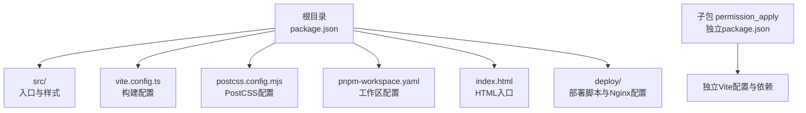
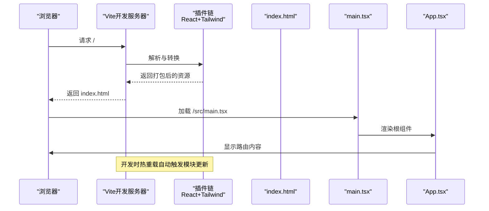
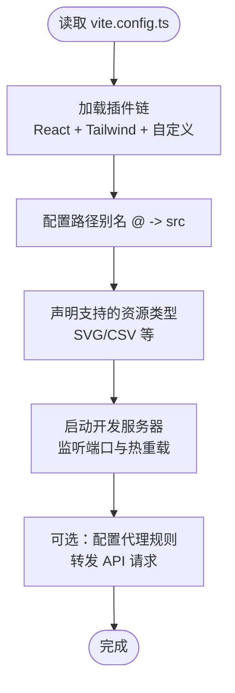
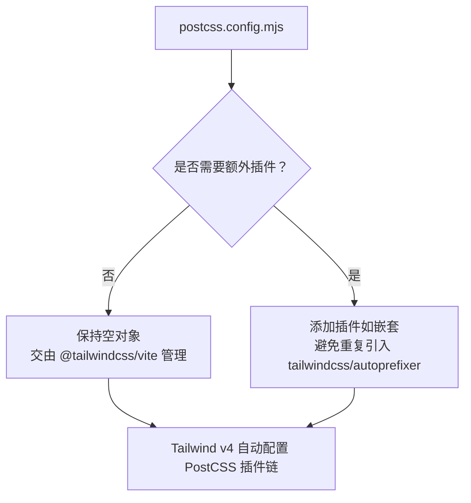
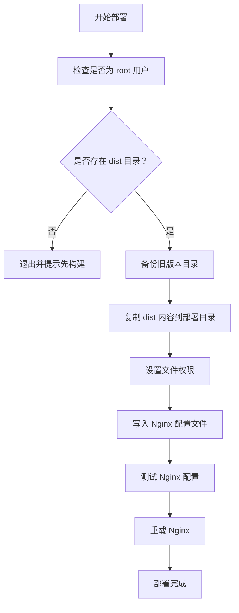
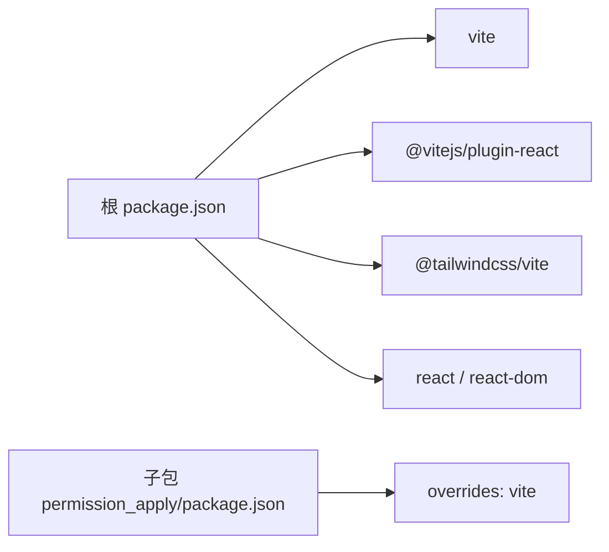

# 开发环境配置

<cite>
**本文档引用的文件**
- [package.json](file://package.json)
- [vite.config.ts](file://vite.config.ts)
- [postcss.config.mjs](file://postcss.config.mjs)
- [pnpm-workspace.yaml](file://pnpm-workspace.yaml)
- [index.html](file://index.html)
- [src/main.tsx](file://src/main.tsx)
- [src/styles/tailwind.css](file://src/styles/tailwind.css)
- [src/styles/index.css](file://src/styles/index.css)
- [deploy/deploy.sh](file://deploy/deploy.sh)
- [deploy/nginx.conf](file://deploy/nginx.conf)
- [README.md](file://README.md)
- [permission_apply/package.json](file://permission_apply/package.json)
</cite>

## 目录
1. [简介](#简介)
2. [项目结构](#项目结构)
3. [核心组件](#核心组件)
4. [架构总览](#架构总览)
5. [详细组件分析](#详细组件分析)
6. [依赖关系分析](#依赖关系分析)
7. [性能考虑](#性能考虑)
8. [故障排除指南](#故障排除指南)
9. [结论](#结论)
10. [附录](#附录)

## 简介
本指南面向首次参与本项目的开发者，提供从零开始搭建本地开发环境的完整流程，涵盖 Node.js 版本与包管理器选择、依赖安装、Vite 构建配置、PostCSS/Tailwind 设置、IDE 推荐与开发工作流优化，并说明环境变量、代理与热重载等开发体验相关配置。同时给出生产部署参考（Nginx），帮助你理解从开发到上线的端到端流程。

## 项目结构
该项目采用单仓库多包布局，顶层通过 pnpm workspace 管理，主应用位于根目录，另一个子包位于 permission_apply 目录。核心前端技术栈包括 Vite 6、React 18、Tailwind CSS v4（通过 @tailwindcss/vite 插件集成）。样式体系由 Tailwind CSS v4 与自定义 CSS 组成，入口 HTML 与 React 根节点位于根目录。

图表来源
- [package.json:1-91](file://package.json#L1-L91)
- [pnpm-workspace.yaml:1-10](file://pnpm-workspace.yaml#L1-L10)
- [vite.config.ts:1-37](file://vite.config.ts#L1-L37)
- [postcss.config.mjs:1-16](file://postcss.config.mjs#L1-L16)
- [index.html:1-22](file://index.html#L1-L22)
- [deploy/deploy.sh:1-107](file://deploy/deploy.sh#L1-L107)
- [deploy/nginx.conf:1-55](file://deploy/nginx.conf#L1-L55)

章节来源
- [package.json:1-91](file://package.json#L1-L91)
- [pnpm-workspace.yaml:1-10](file://pnpm-workspace.yaml#L1-L10)
- [README.md:1-11](file://README.md#L1-L11)

## 核心组件
- 包管理与版本控制：使用 pnpm workspace 管理根包与子包；通过 overrides 约束 Vite 版本以保证一致性。
- 构建工具：Vite 6 作为开发服务器与打包工具，内置热重载与快速冷启动。
- 样式系统：Tailwind CSS v4 通过 @tailwindcss/vite 插件自动配置 PostCSS 插件链，无需手动引入 tailwindcss/autoprefixer。
- React 应用入口：index.html 引入 /src/main.tsx，main.tsx 渲染根组件 App。
- 子包隔离：permission_apply 目录包含独立的 package.json，便于按需启用或替换功能模块。

章节来源
- [package.json:68-90](file://package.json#L68-L90)
- [permission_apply/package.json:85-89](file://permission_apply/package.json#L85-L89)
- [vite.config.ts:19-36](file://vite.config.ts#L19-L36)
- [postcss.config.mjs:1-16](file://postcss.config.mjs#L1-L16)
- [index.html:15-18](file://index.html#L15-L18)
- [src/main.tsx:1-7](file://src/main.tsx#L1-L7)

## 架构总览
下图展示从浏览器请求到 React 应用渲染的关键路径，以及 Vite 在开发模式下的热重载机制如何介入。

图表来源
- [index.html:15-18](file://index.html#L15-L18)
- [src/main.tsx:1-7](file://src/main.tsx#L1-L7)
- [src/app/App.tsx:1-6](file://src/app/App.tsx#L1-L6)
- [vite.config.ts:19-36](file://vite.config.ts#L19-L36)

## 详细组件分析

### 本地开发环境搭建
- Node.js 与包管理器
  - 推荐使用 Node.js LTS（如 20.x 或 22.x）以获得最佳兼容性与性能。
  - 使用 pnpm 作为包管理器，启用 pnpm workspace 以统一管理根包与子包依赖。
- 依赖安装
  - 在根目录执行安装命令后，再进入子包目录安装其依赖，确保 overrides 对 Vite 的版本约束生效。
  - 若遇到网络问题，可配置 pnpm registry 或使用代理，但需保持与团队一致的镜像源。
- 启动开发服务器
  - 在根目录运行开发命令即可启动 Vite 开发服务器，自动打开浏览器并启用热重载。

章节来源
- [README.md:5-11](file://README.md#L5-L11)
- [package.json:68-90](file://package.json#L68-L90)
- [permission_apply/package.json:85-89](file://permission_apply/package.json#L85-L89)

### Vite 配置详解
- 插件链
  - React 插件：启用 JSX 转换与 React Refresh。
  - Tailwind 插件：自动注入 PostCSS 插件链，无需手动维护 tailwindcss/autoprefixer。
  - 自定义插件：示例中包含一个用于解析特定前缀资源的插件，便于扩展静态资源处理。
- 别名与路径
  - 将 @ 指向 src 目录，简化导入路径书写。
- 资源类型
  - 支持对 SVG、CSV 等文件进行原始导入，避免不必要的编译开销。
- 热重载与代理
  - Vite 默认启用 HMR；若需要代理后端服务，可在配置中添加 proxy 规则（例如将 /api 前缀转发至后端）。

图表来源
- [vite.config.ts:19-36](file://vite.config.ts#L19-L36)

章节来源
- [vite.config.ts:1-37](file://vite.config.ts#L1-L37)

### PostCSS 与 Tailwind CSS 设置
- PostCSS 配置
  - 当使用 @tailwindcss/vite 时，Tailwind v4 已自动配置所需 PostCSS 插件链，因此该文件通常为空。
  - 如需额外插件（如嵌套），可在此处追加，但不建议在此文件中重复引入 tailwindcss/autoprefixer。
- Tailwind CSS v4
  - 在样式入口中通过 @import 'tailwindcss' 与 @source 指令启用扫描源码生成样式。
  - 可按需引入动画库等扩展。

图表来源
- [postcss.config.mjs:1-16](file://postcss.config.mjs#L1-L16)
- [src/styles/tailwind.css:1-5](file://src/styles/tailwind.css#L1-L5)

章节来源
- [postcss.config.mjs:1-16](file://postcss.config.mjs#L1-L16)
- [src/styles/tailwind.css:1-5](file://src/styles/tailwind.css#L1-L5)
- [src/styles/index.css:1-4](file://src/styles/index.css#L1-L4)

### 样式与主题
- 入口样式组织
  - index.css 作为全局入口，依次引入字体、Tailwind 与主题样式，确保加载顺序正确。
- 主题与动画
  - 可在主题样式中定义变量与覆盖默认主题，配合 Tailwind v4 的原子类实现一致的视觉语言。
  - 动画库通过 Tailwind v4 的 @import 引入，便于在组件中直接使用。

章节来源
- [src/styles/index.css:1-4](file://src/styles/index.css#L1-L4)
- [src/styles/tailwind.css:1-5](file://src/styles/tailwind.css#L1-L5)

### 构建与产物
- 构建命令
  - 使用 Vite 的 build 脚本生成生产环境静态资源，输出至 dist 目录。
- 入口与渲染
  - index.html 作为应用入口，main.tsx 负责挂载 React 根组件，App.tsx 提供路由容器。

章节来源
- [package.json:7-9](file://package.json#L7-L9)
- [index.html:15-18](file://index.html#L15-L18)
- [src/main.tsx:1-7](file://src/main.tsx#L1-L7)
- [src/app/App.tsx:1-6](file://src/app/App.tsx#L1-L6)

### 部署与 Nginx 配置
- 部署脚本
  - 提供 Bash 脚本一键部署，包含权限设置、备份与回滚、Nginx 配置写入与重载等步骤。
  - 需要以 root 权限执行，并确保 dist 目录存在。
- Nginx 配置要点
  - 监听 80 端口，根目录指向部署目录，开启 gzip 压缩。
  - 静态资源设置长缓存，index.html 不缓存以保证更新即时生效。
  - SPA 路由回退到 index.html，错误页指向首页。
  - 可选 HTTPS，需取消注释并配置证书路径。

图表来源
- [deploy/deploy.sh:25-93](file://deploy/deploy.sh#L25-L93)
- [deploy/nginx.conf:5-54](file://deploy/nginx.conf#L5-L54)

章节来源
- [deploy/deploy.sh:1-107](file://deploy/deploy.sh#L1-L107)
- [deploy/nginx.conf:1-55](file://deploy/nginx.conf#L1-L55)

### IDE 配置与开发工作流优化
- 编辑器推荐
  - VS Code：安装 React/TypeScript 相关扩展，启用 Prettier、ESLint、Tailwind CSS IntelliSense。
  - WebStorm/IntelliJ IDEA：启用 TypeScript、React、Tailwind CSS 支持。
- 插件建议
  - ESLint：统一代码风格与静态检查。
  - Prettier：自动格式化。
  - Tailwind CSS IntelliSense：智能补全与冲突检测。
  - EditorConfig：跨编辑器统一缩进与换行。
- 开发工作流
  - 使用 Vite 的热重载提升迭代速度；在 vite.config.ts 中按需添加代理以联调后端接口。
  - 通过 @ 别名简化导入路径，减少层级过深的相对路径。
  - 在 PostCSS 中仅添加必要插件，避免与 Tailwind v4 的自动配置冲突。

[本节为通用实践建议，不直接分析具体文件，故无“章节来源”]

## 依赖关系分析
- 依赖分层
  - 运行时依赖：React 生态、UI 组件库、图表与日期处理等。
  - 开发依赖：Vite、@vitejs/plugin-react、@tailwindcss/vite、tailwindcss。
  - peerDependencies：react 与 react-dom，通过 overrides 约束版本。
- 工作区与子包
  - pnpm workspace 管理根包与 permission_apply 子包，两者各自维护独立的依赖集与 Vite 配置。

图表来源
- [package.json:68-90](file://package.json#L68-L90)
- [permission_apply/package.json:85-89](file://permission_apply/package.json#L85-L89)

章节来源
- [package.json:11-85](file://package.json#L11-L85)
- [permission_apply/package.json:10-84](file://permission_apply/package.json#L10-L84)
- [pnpm-workspace.yaml:1-10](file://pnpm-workspace.yaml#L1-10)

## 性能考虑
- 构建性能
  - 使用 Vite 的原生 ESM 与按需编译，减少冷启动时间；仅在必要时启用严格模式的类型检查。
- 样式体积
  - Tailwind v4 通过源码扫描生成样式，避免引入未使用的类；合理拆分样式入口，避免全局污染。
- 资源加载
  - Nginx 配置中对静态资源设置长缓存，index.html 不缓存以保证更新即时生效。
- 热重载
  - 仅在开发阶段启用 HMR；生产构建关闭 HMR，避免额外开销。

[本节提供通用指导，不直接分析具体文件，故无“章节来源”]

## 故障排除指南
- 依赖安装失败
  - 确认 Node.js 版本满足要求；使用 pnpm 并启用 workspace；若网络受限，配置合适的 registry。
- Vite 启动异常
  - 检查 vite.config.ts 中插件与别名配置；确认端口未被占用；如需代理，补充代理规则。
- 样式未生效
  - 确保 index.css 正确引入 tailwind.css；检查 postcss.config.mjs 是否意外引入了重复插件。
- 部署失败
  - 以 root 权限执行部署脚本；确保 dist 目录存在；检查 Nginx 配置语法并通过测试；必要时回滚备份。

章节来源
- [deploy/deploy.sh:25-93](file://deploy/deploy.sh#L25-L93)
- [deploy/nginx.conf:5-54](file://deploy/nginx.conf#L5-L54)

## 结论
通过以上配置与流程，你可以快速搭建并稳定运行本项目的开发环境。遵循本文档的版本与配置建议，结合 IDE 插件与工作流优化，将显著提升开发效率与质量。生产部署方面，Nginx 配置与自动化脚本提供了可靠的上线保障。

[本节为总结性内容，不直接分析具体文件，故无“章节来源”]

## 附录
- 快速检查清单
  - Node.js 版本符合要求，pnpm 安装完成。
  - 根目录与子包分别安装依赖，overrides 生效。
  - 运行开发服务器，确认热重载正常。
  - 构建产物 dist 准备就绪，Nginx 配置正确。
- 常见问题速查
  - “找不到模块”：检查 @ 别名与 tsconfig 路径映射。
  - “样式不生效”：确认 index.css 引入顺序与 postcss.config.mjs 状态。
  - “代理无效”：在 vite.config.ts 中添加代理规则并重启开发服务器。

[本节为辅助信息，不直接分析具体文件，故无“章节来源”]