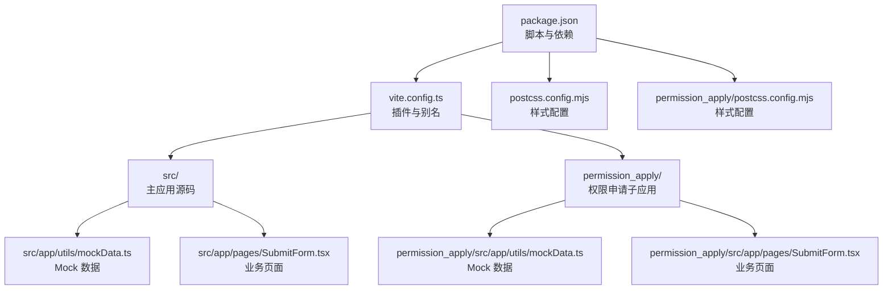
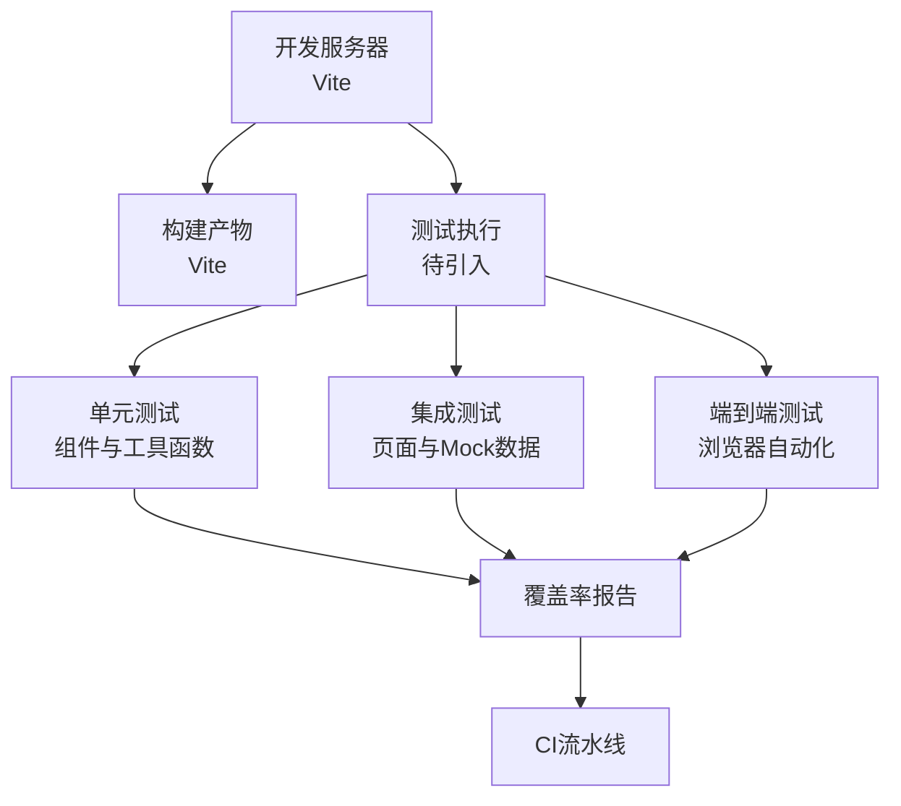
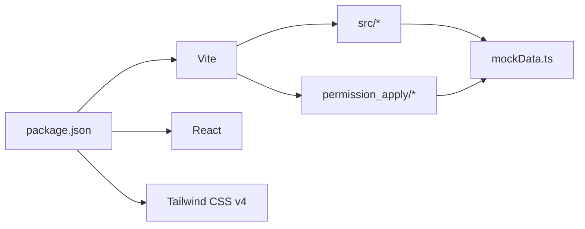

# 测试策略

<cite>
**本文引用的文件**
- [package.json](file://package.json)
- [vite.config.ts](file://vite.config.ts)
- [README.md](file://README.md)
- [postcss.config.mjs](file://postcss.config.mjs)
- [permission_apply/postcss.config.mjs](file://permission_apply/postcss.config.mjs)
- [src/app/utils/mockData.ts](file://src/app/utils/mockData.ts)
- [permission_apply/src/app/utils/mockData.ts](file://permission_apply/src/app/utils/mockData.ts)
- [src/app/pages/SubmitForm.tsx](file://src/app/pages/SubmitForm.tsx)
- [permission_apply/src/app/pages/SubmitForm.tsx](file://permission_apply/src/app/pages/SubmitForm.tsx)
</cite>

## 目录
1. [引言](#引言)
2. [项目结构](#项目结构)
3. [核心组件](#核心组件)
4. [架构总览](#架构总览)
5. [详细组件分析](#详细组件分析)
6. [依赖分析](#依赖分析)
7. [性能考虑](#性能考虑)
8. [故障排查指南](#故障排查指南)
9. [结论](#结论)
10. [附录](#附录)

## 引言
本测试策略文档面向管理平台项目，旨在建立系统化的测试方法论与实施规范，覆盖单元测试、集成测试与端到端测试（E2E）。文档结合当前仓库中的实际配置与组件，明确测试类型、工具链、Mock 数据使用方式、测试环境配置以及覆盖率目标，并提供可操作的测试用例编写指南与最佳实践，以保障代码质量与功能稳定性。

## 项目结构
项目采用 Vite + React 技术栈，包含主应用与权限申请子应用两个主要目录。构建与开发工具由 Vite 提供，PostCSS 配置用于样式处理。测试相关能力在现有仓库中尚未发现专用测试框架配置，但可通过现有工具链与组件结构进行测试策略落地。

图表来源
- [package.json:1-91](file://package.json#L1-L91)
- [vite.config.ts:1-37](file://vite.config.ts#L1-L37)
- [postcss.config.mjs:1-15](file://postcss.config.mjs#L1-L15)
- [permission_apply/postcss.config.mjs:1-15](file://permission_apply/postcss.config.mjs#L1-L15)
- [src/app/utils/mockData.ts:1-13](file://src/app/utils/mockData.ts#L1-L13)
- [permission_apply/src/app/utils/mockData.ts:1-13](file://permission_apply/src/app/utils/mockData.ts#L1-L13)
- [src/app/pages/SubmitForm.tsx:495-533](file://src/app/pages/SubmitForm.tsx#L495-L533)
- [permission_apply/src/app/pages/SubmitForm.tsx:495-533](file://permission_apply/src/app/pages/SubmitForm.tsx#L495-L533)

章节来源
- [package.json:1-91](file://package.json#L1-L91)
- [vite.config.ts:1-37](file://vite.config.ts#L1-L37)
- [postcss.config.mjs:1-15](file://postcss.config.mjs#L1-L15)
- [permission_apply/postcss.config.mjs:1-15](file://permission_apply/postcss.config.mjs#L1-L15)

## 核心组件
- 构建与开发工具
  - Vite 提供开发服务器、热更新与打包能力；插件体系支持 React 与 Tailwind CSS。
  - 别名配置将“@”指向 src 目录，便于模块导入。
- 样式与主题
  - PostCSS 配置保持简洁，默认由 Tailwind CSS v4 自动设置所需插件。
- Mock 数据
  - 在 src 与 permission_apply 下均提供统一的 MOCK_REASONS 与 getEnabledReasons，作为组件与页面的稳定数据源。
- 业务页面
  - SubmitForm 页面包含上传附件、状态展示等交互逻辑，是测试重点覆盖对象。

章节来源
- [vite.config.ts:19-36](file://vite.config.ts#L19-L36)
- [src/app/utils/mockData.ts:1-13](file://src/app/utils/mockData.ts#L1-L13)
- [permission_apply/src/app/utils/mockData.ts:1-13](file://permission_apply/src/app/utils/mockData.ts#L1-L13)
- [src/app/pages/SubmitForm.tsx:495-533](file://src/app/pages/SubmitForm.tsx#L495-L533)
- [permission_apply/src/app/pages/SubmitForm.tsx:495-533](file://permission_apply/src/app/pages/SubmitForm.tsx#L495-L533)

## 架构总览
下图展示了测试策略在当前技术栈中的落地路径：从开发工具链到页面组件，再到 Mock 数据与测试执行流程。

（本图为概念性架构示意，无需图表来源）

## 详细组件分析

### 单元测试策略
- 测试范围
  - 组件级：对 UI 组件进行渲染与交互断言，验证 props、状态切换与事件回调。
  - 工具函数：对纯函数与数据处理函数进行输入输出校验。
  - Mock 数据：对 getEnabledReasons 等函数进行过滤逻辑验证。
- 推荐工具
  - 测试运行器：Vitest（与 Vite 生态契合）。
  - 断言库：推荐 Jest 风格断言或 Vitest 内置断言。
  - 覆盖率：IaC 模式下建议开启覆盖率统计与阈值约束。
- 示例场景
  - Mock 数据过滤：传入不同 businessType，断言返回结果数量与字段一致性。
  - 表单校验：模拟用户输入，断言状态变化与按钮可用性。
- 关键实现参考
  - Mock 数据定义与导出位置：[src/app/utils/mockData.ts:1-13](file://src/app/utils/mockData.ts#L1-L13)、[permission_apply/src/app/utils/mockData.ts:1-13](file://permission_apply/src/app/utils/mockData.ts#L1-L13)

章节来源
- [src/app/utils/mockData.ts:1-13](file://src/app/utils/mockData.ts#L1-L13)
- [permission_apply/src/app/utils/mockData.ts:1-13](file://permission_apply/src/app/utils/mockData.ts#L1-L13)

### 集成测试策略
- 测试范围
  - 页面与组件的协同行为：如 SubmitForm 的上传状态、条件渲染与交互反馈。
  - Mock 数据与页面逻辑的绑定：验证 getEnabledReasons 返回值对 UI 的影响。
- 执行方式
  - 使用 Vitest + React Testing Library 或 Playwright（基于 Vite 开发服务器）。
  - 通过 Mock 数据驱动页面渲染，断言 DOM 结构与交互行为。
- 关键实现参考
  - 页面交互片段：[src/app/pages/SubmitForm.tsx:495-533](file://src/app/pages/SubmitForm.tsx#L495-L533)、[permission_apply/src/app/pages/SubmitForm.tsx:495-533](file://permission_apply/src/app/pages/SubmitForm.tsx#L495-L533)

章节来源
- [src/app/pages/SubmitForm.tsx:495-533](file://src/app/pages/SubmitForm.tsx#L495-L533)
- [permission_apply/src/app/pages/SubmitForm.tsx:495-533](file://permission_apply/src/app/pages/SubmitForm.tsx#L495-L533)

### 端到端测试策略
- 测试范围
  - 用户完整业务流程：从进入页面到上传附件、查看状态、提交等。
  - 跨页面与跨模块的协作：表单填写、状态同步与提示展示。
- 执行方式
  - 使用 Playwright 或 Cypress，在真实浏览器环境中运行。
  - 基于 Mock 数据与本地开发服务器，保证测试稳定性与可重复性。
- 关键实现参考
  - 页面交互片段：[src/app/pages/SubmitForm.tsx:495-533](file://src/app/pages/SubmitForm.tsx#L495-L533)、[permission_apply/src/app/pages/SubmitForm.tsx:495-533](file://permission_apply/src/app/pages/SubmitForm.tsx#L495-L533)

章节来源
- [src/app/pages/SubmitForm.tsx:495-533](file://src/app/pages/SubmitForm.tsx#L495-L533)
- [permission_apply/src/app/pages/SubmitForm.tsx:495-533](file://permission_apply/src/app/pages/SubmitForm.tsx#L495-L533)

### Mock 数据使用策略
- 设计原则
  - 单一事实来源：MOCK_REASONS 作为全局 Mock 数据，避免分散硬编码。
  - 可扩展性：新增业务类型时，仅需扩展 MOCK_REASONS 字段集合。
  - 易测试性：通过 getEnabledReasons 过滤，便于断言与回归验证。
- 使用建议
  - 在单元测试中直接导入 MOCK_REASONS 或 getEnabledReasons，减少外部依赖。
  - 在集成/端到端测试中，优先使用 Mock 数据驱动页面渲染，降低对后端服务的耦合。

章节来源
- [src/app/utils/mockData.ts:1-13](file://src/app/utils/mockData.ts#L1-L13)
- [permission_apply/src/app/utils/mockData.ts:1-13](file://permission_apply/src/app/utils/mockData.ts#L1-L13)

### 测试环境配置
- 开发与构建
  - 使用 Vite 提供的开发服务器与热更新能力，便于快速迭代与调试。
  - 别名“@”指向 src，简化导入路径，提升测试代码可读性。
- 样式与主题
  - PostCSS 默认为空配置，Tailwind CSS v4 自动注入必要插件，确保测试环境与生产一致。
- 依赖与脚本
  - package.json 中的脚本可用于启动开发服务器与构建产物，测试阶段可复用相同命令。

章节来源
- [vite.config.ts:27-32](file://vite.config.ts#L27-L32)
- [postcss.config.mjs:1-15](file://postcss.config.mjs#L1-L15)
- [permission_apply/postcss.config.mjs:1-15](file://permission_apply/postcss.config.mjs#L1-L15)
- [package.json:6-10](file://package.json#L6-L10)

### 测试覆盖率要求
- 目标
  - 语句覆盖率：≥80%
  - 分支覆盖率：≥70%
  - 函数覆盖率：≥85%
  - 行覆盖率：≥80%
- 约束
  - 关键路径与高风险逻辑必须达到 100% 覆盖。
  - 对 Mock 数据与页面交互逻辑进行重点覆盖。

（本节为通用指导，无需章节来源）

## 依赖分析
- 工具链依赖
  - Vite：提供开发与构建能力，测试可直接复用其开发服务器。
  - React：组件化测试的基础。
  - Tailwind CSS v4：自动配置 PostCSS 插件，保证测试与生产环境一致。
- 组件耦合
  - Mock 数据与页面组件松耦合，通过函数导出与导入解耦，便于测试替换与断言。
- 外部依赖
  - 无直接测试框架依赖，可在后续引入 Vitest/Playwright 等工具，不影响现有构建与运行。

图表来源
- [package.json:1-91](file://package.json#L1-L91)
- [vite.config.ts:19-36](file://vite.config.ts#L19-L36)

章节来源
- [package.json:1-91](file://package.json#L1-L91)
- [vite.config.ts:19-36](file://vite.config.ts#L19-L36)

## 性能考虑
- 测试执行效率
  - 使用 Vitest 进行单元测试，利用内存快照与并发执行提升速度。
  - 集成测试与 E2E 测试按需拆分，避免长耗时任务阻塞流水线。
- 资源占用
  - 优先使用 Mock 数据，减少网络请求与外部资源依赖。
  - 在 E2E 测试中使用最小化浏览器实例与稳定的选择器策略。

（本节为通用指导，无需章节来源）

## 故障排查指南
- 常见问题
  - 测试无法启动：确认开发服务器已正常运行，且测试脚本与 Vite 配置一致。
  - 样式异常：检查 PostCSS 配置是否被意外修改，确保 Tailwind 插件生效。
  - Mock 数据不一致：核对 src 与 permission_apply 下的 mockData.ts 是否同步更新。
- 定位方法
  - 在本地复现问题，逐步缩小到具体组件或函数。
  - 使用最小化用例定位边界条件与异常分支。

章节来源
- [postcss.config.mjs:1-15](file://postcss.config.mjs#L1-L15)
- [permission_apply/postcss.config.mjs:1-15](file://permission_apply/postcss.config.mjs#L1-L15)
- [src/app/utils/mockData.ts:1-13](file://src/app/utils/mockData.ts#L1-L13)
- [permission_apply/src/app/utils/mockData.ts:1-13](file://permission_apply/src/app/utils/mockData.ts#L1-L13)

## 结论
本测试策略以现有 Vite + React 技术栈为基础，结合统一的 Mock 数据与页面组件，提出分层测试实施方案。通过单元、集成与端到端测试的协同，配合覆盖率目标与最佳实践，可有效提升代码质量与功能稳定性。建议尽快引入 Vitest/Playwright 并完善 CI 流水线，持续演进测试体系。

## 附录
- 快速开始
  - 启动开发服务器：参考 [README.md:5-11](file://README.md#L5-L11)。
  - 访问页面：根据开发服务器地址打开 SubmitForm 页面进行手动验证。
- 参考实现
  - Mock 数据：[src/app/utils/mockData.ts:1-13](file://src/app/utils/mockData.ts#L1-L13)、[permission_apply/src/app/utils/mockData.ts:1-13](file://permission_apply/src/app/utils/mockData.ts#L1-L13)
  - 页面交互：[src/app/pages/SubmitForm.tsx:495-533](file://src/app/pages/SubmitForm.tsx#L495-L533)、[permission_apply/src/app/pages/SubmitForm.tsx:495-533](file://permission_apply/src/app/pages/SubmitForm.tsx#L495-L533)

章节来源
- [README.md:5-11](file://README.md#L5-L11)
- [src/app/utils/mockData.ts:1-13](file://src/app/utils/mockData.ts#L1-L13)
- [permission_apply/src/app/utils/mockData.ts:1-13](file://permission_apply/src/app/utils/mockData.ts#L1-L13)
- [src/app/pages/SubmitForm.tsx:495-533](file://src/app/pages/SubmitForm.tsx#L495-L533)
- [permission_apply/src/app/pages/SubmitForm.tsx:495-533](file://permission_apply/src/app/pages/SubmitForm.tsx#L495-L533)