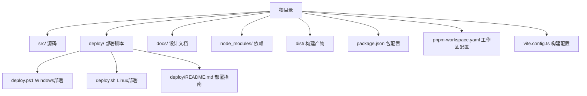
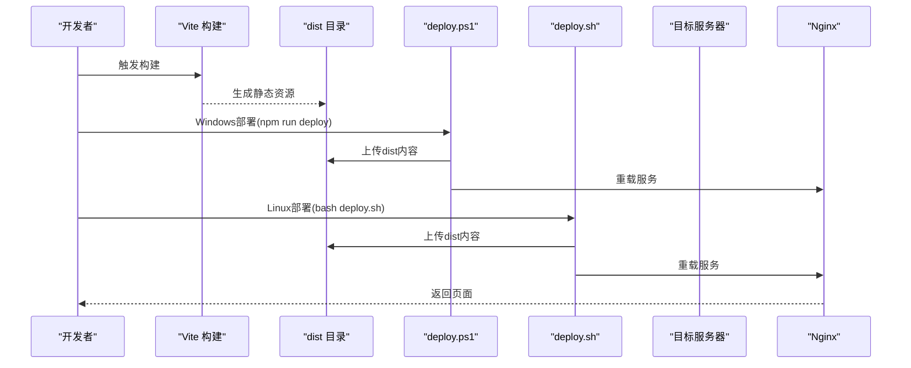
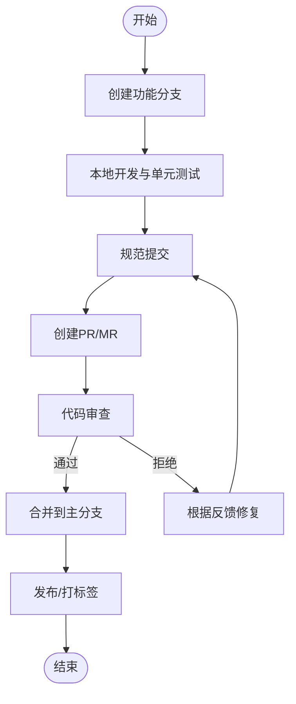
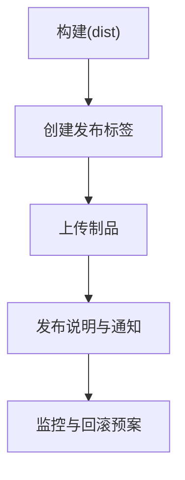
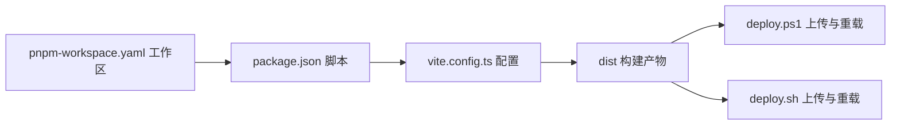

# 版本控制规范

<cite>
**本文档引用的文件**
- [README.md](file://README.md)
- [package.json](file://package.json)
- [pnpm-workspace.yaml](file://pnpm-workspace.yaml)
- [deploy.ps1](file://deploy.ps1)
- [deploy.sh](file://deploy.sh)
- [deploy/README.md](file://deploy/README.md)
- [vite.config.ts](file://vite.config.ts)
- [docs/warehouse-transfer-design.md](file://docs/warehouse-transfer-design.md)
</cite>

## 目录
1. [引言](#引言)
2. [项目结构](#项目结构)
3. [核心组件](#核心组件)
4. [架构总览](#架构总览)
5. [详细组件分析](#详细组件分析)
6. [依赖分析](#依赖分析)
7. [性能考虑](#性能考虑)
8. [故障排除指南](#故障排除指南)
9. [结论](#结论)
10. [附录](#附录)

## 引言
本文件旨在建立一套完整的版本控制规范，覆盖Git工作流程、分支管理、提交规范、代码审查流程、合并策略与发布管理。通过对仓库现有部署脚本、包管理配置与项目结构的分析，结合通用最佳实践，形成可落地、可追溯、可审计的版本控制标准，确保团队协作效率与代码质量。

## 项目结构
该项目为React前端工程，采用Vite作为构建工具，使用pnpm进行包管理与工作区管理。部署流程提供了Windows PowerShell与Linux Bash两种自动化脚本，支持一键构建、上传与Nginx重载。

图表来源
- [pnpm-workspace.yaml:1-10](file://pnpm-workspace.yaml#L1-L10)
- [package.json:1-91](file://package.json#L1-L91)
- [vite.config.ts:1-37](file://vite.config.ts#L1-L37)
- [deploy.ps1:1-65](file://deploy.ps1#L1-L65)
- [deploy.sh:1-107](file://deploy.sh#L1-L107)
- [deploy/README.md:1-142](file://deploy/README.md#L1-L142)

章节来源
- [pnpm-workspace.yaml:1-10](file://pnpm-workspace.yaml#L1-L10)
- [package.json:1-91](file://package.json#L1-L91)
- [vite.config.ts:1-37](file://vite.config.ts#L1-L37)
- [README.md:1-11](file://README.md#L1-L11)

## 核心组件
- 构建与打包：Vite配置定义了插件、别名与静态资源处理，用于生成dist目录。
- 包管理：package.json定义了脚本与依赖；pnpm-workspace.yaml定义了工作区范围。
- 部署自动化：Windows与Linux两套部署脚本，统一通过dist目录进行部署。
- 文档与设计：设计文档描述业务流程，便于版本演进与需求变更追踪。

章节来源
- [vite.config.ts:1-37](file://vite.config.ts#L1-L37)
- [package.json:6-10](file://package.json#L6-L10)
- [pnpm-workspace.yaml:1-10](file://pnpm-workspace.yaml#L1-L10)
- [deploy.ps1:22-29](file://deploy.ps1#L22-L29)
- [deploy.sh:32-36](file://deploy.sh#L32-L36)
- [docs/warehouse-transfer-design.md:1-105](file://docs/warehouse-transfer-design.md#L1-L105)

## 架构总览
下图展示了从开发到部署的端到端流程，包括构建、产物管理与Nginx服务集成。

图表来源
- [package.json:6-10](file://package.json#L6-L10)
- [deploy.ps1:22-29](file://deploy.ps1#L22-L29)
- [deploy.ps1:38-45](file://deploy.ps1#L38-L45)
- [deploy.ps1:48-55](file://deploy.ps1#L48-L55)
- [deploy.sh:32-36](file://deploy.sh#L32-L36)
- [deploy.sh:55-57](file://deploy.sh#L55-L57)
- [deploy.sh:91-93](file://deploy.sh#L91-L93)

## 详细组件分析

### Git工作流程与分支管理
- 分支模型建议采用Git Flow或GitHub Flow，结合本项目特性，推荐以功能分支为主、主干稳定发布。
- 开发阶段：每个功能/修复在独立分支上进行，避免直接在主分支提交。
- 合并与保护：通过Pull Request/Merge Request进行代码审查，禁止直接推送主分支。

[本图为概念性流程图，不对应具体源码文件]

### 提交规范
- 提交信息应清晰表达“动机+影响”，遵循以下格式：
  - 类型: 功能/修复/文档/样式/重构/性能/测试/构建/样式/消息/其他
  - 范围: 影响模块或文件路径
  - 描述: 简洁明确的变更说明
  - 关联: 可选，关联Issue或任务编号
- 示例格式（不含具体内容）：
  - feat(模块): 简述变更
  - fix(模块): 简述变更
  - docs(模块): 更新文档
  - style(模块): 代码风格调整
  - refactor(模块): 重构
  - perf(模块): 性能优化
  - test(模块): 新增/修改测试
  - build(模块): 构建相关
  - chore(模块): 日常维护
  - ci(模块): 持续集成
  - revert(模块): 回滚
- 说明：提交信息应使用中文，便于团队理解；避免一次性提交过多无关变更。

[本节为规范说明，不直接分析具体文件]

### 代码审查流程
- 触发条件：任何涉及功能、修复、样式、重构、性能、测试、构建、CI、回滚等变更均需走PR流程。
- 审查要点：功能正确性、边界条件、性能影响、兼容性、可读性、测试覆盖率、安全与合规。
- 结果处理：通过后合并；拒绝则要求修改并重新审查；紧急修复可快速通道但需事后补审。

[本节为规范说明，不直接分析具体文件]

### 合并策略
- 禁止直接推送主分支；必须通过PR/MR并获得批准。
- 合并方式建议使用squash合并，保持主干线性历史整洁。
- 合并前确保CI通过、无冲突、评审通过。

[本节为规范说明，不直接分析具体文件]

### 发布管理
- 版本号：采用语义化版本（MAJOR.MINOR.PATCH），结合项目package.json中的version字段进行管理。
- 标签管理：每次发布在主分支打上对应标签，如v0.1.0；标签与发布说明一一对应。
- 发布流程：构建产物→上传制品→打标签→发布说明→通知团队。

图表来源
- [package.json:4](file://package.json#L4)
- [deploy.ps1:22-29](file://deploy.ps1#L22-L29)
- [deploy.sh:32-36](file://deploy.sh#L32-L36)

### 分支命名约定
- 功能分支：feature/功能简述
- 修复分支：fix/问题简述
- 文档分支：docs/文档主题
- 样式分支：style/样式主题
- 重构分支：refactor/重构主题
- 性能分支：perf/性能主题
- 测试分支：test/测试主题
- 构建分支：build/构建主题
- CI分支：ci/持续集成主题
- 回滚分支：revert/回滚主题

[本节为规范说明，不直接分析具体文件]

### 标签管理规则
- 正式发布：vMAJOR.MINOR.PATCH
- 预发布：vMAJOR.MINOR.PATCH-rc.N 或 vMAJOR.MINOR.PATCH-beta.N
- 紧急热修复：vMAJOR.MINOR.PATCH-hotfix.N
- 说明：标签与发布说明同步，便于追溯与回滚。

[本节为规范说明，不直接分析具体文件]

### 团队协作最佳实践
- 统一使用中文沟通与提交信息，减少理解成本。
- 严格遵守PR模板与审查清单，确保质量门禁。
- 避免在主分支直接提交；优先使用功能分支与PR。
- 保持提交粒度适中，便于审查与回滚。
- 使用分支保护规则，强制CI与审查通过。

[本节为规范说明，不直接分析具体文件]

### 冲突解决策略
- 预防：频繁同步主分支、小步提交、及时审查。
- 发生冲突：基于PR讨论定位冲突点，必要时进行交互式变基或合并，保留最小变更集。
- 回滚：通过标签与提交记录快速定位，必要时使用revert提交。

[本节为规范说明，不直接分析具体文件]

## 依赖分析
- 构建链路：package.json中的脚本驱动Vite构建，生成dist目录供部署脚本使用。
- 工作区：pnpm-workspace.yaml定义了工作区范围，确保多包或多模块场景下的依赖一致性。
- 部署链路：Windows与Linux部署脚本均依赖dist目录，确保产物一致。

图表来源
- [package.json:6-10](file://package.json#L6-L10)
- [vite.config.ts:19-36](file://vite.config.ts#L19-L36)
- [pnpm-workspace.yaml:1-10](file://pnpm-workspace.yaml#L1-L10)
- [deploy.ps1:22-29](file://deploy.ps1#L22-L29)
- [deploy.sh:32-36](file://deploy.sh#L32-L36)

章节来源
- [package.json:6-10](file://package.json#L6-L10)
- [vite.config.ts:19-36](file://vite.config.ts#L19-L36)
- [pnpm-workspace.yaml:1-10](file://pnpm-workspace.yaml#L1-L10)
- [deploy.ps1:22-29](file://deploy.ps1#L22-L29)
- [deploy.sh:32-36](file://deploy.sh#L32-L36)

## 性能考虑
- 构建性能：合理拆分依赖与按需加载，避免一次性引入大型库；利用Vite的原生ESM与插件机制提升冷启动速度。
- 产物体积：启用压缩与Tree Shaking；对静态资源进行缓存与CDN分发。
- 部署性能：使用rsync或scp增量上传；Nginx开启gzip与缓存头，缩短首屏时间。

[本节为通用指导，不直接分析具体文件]

## 故障排除指南
- 构建失败：检查Vite配置与依赖版本；确认node_modules完整；查看package.json脚本是否正确。
- 上传失败：检查SSH密钥与服务器权限；确认dist目录存在且非空。
- Nginx重载失败：检查配置语法与站点路径；必要时手动重载并查看错误日志。
- 回滚策略：通过标签与提交记录定位问题版本，使用revert提交或回退到上一个稳定标签。

章节来源
- [deploy.ps1:22-29](file://deploy.ps1#L22-L29)
- [deploy.ps1:38-45](file://deploy.ps1#L38-L45)
- [deploy.ps1:48-55](file://deploy.ps1#L48-L55)
- [deploy.sh:76-88](file://deploy.sh#L76-L88)
- [deploy/README.md:127-139](file://deploy/README.md#L127-L139)

## 结论
通过建立完善的Git工作流程、分支管理、提交规范与发布管理机制，结合现有的部署脚本与构建配置，可以有效提升团队协作效率与代码质量。建议在团队内推广并严格执行上述规范，确保版本控制的规范化与可追溯性。

## 附录
- 术语
  - PR/MR：Pull Request/Merge Request
  - CI：持续集成
  - Nginx：Web服务器与反向代理
  - dist：构建产物目录
- 参考文档
  - 设计文档：用于理解业务背景与演进，便于版本变更与需求追踪

章节来源
- [docs/warehouse-transfer-design.md:1-105](file://docs/warehouse-transfer-design.md#L1-L105)