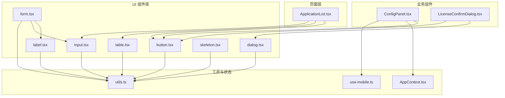
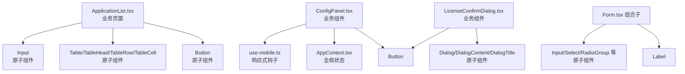
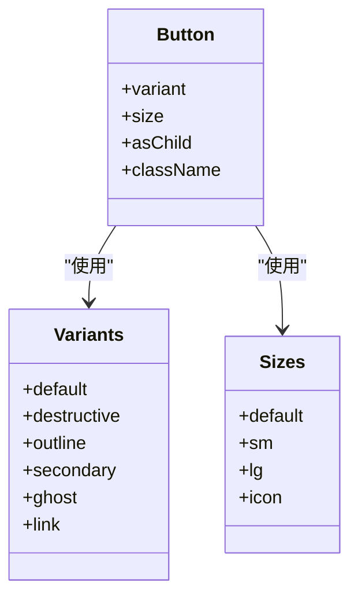
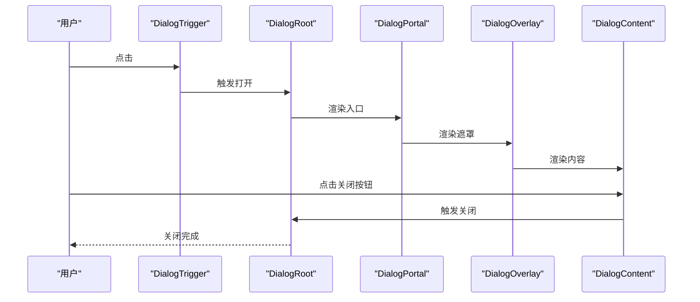
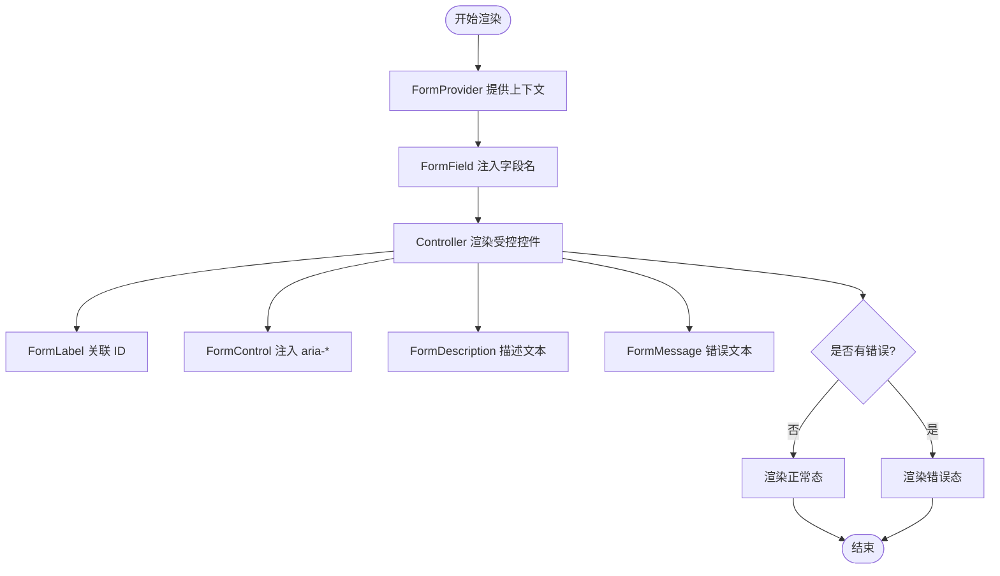
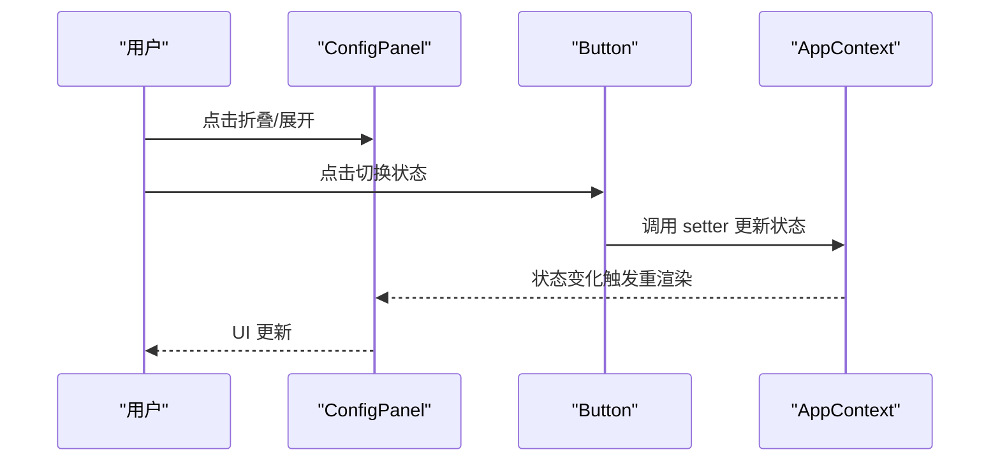
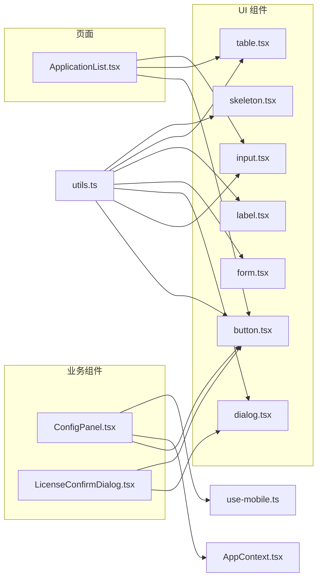

# 组件开发

<cite>
**本文引用的文件**
- [button.tsx](file://src/app/components/ui/button.tsx)
- [input.tsx](file://src/app/components/ui/input.tsx)
- [dialog.tsx](file://src/app/components/ui/dialog.tsx)
- [form.tsx](file://src/app/components/ui/form.tsx)
- [label.tsx](file://src/app/components/ui/label.tsx)
- [table.tsx](file://src/app/components/ui/table.tsx)
- [skeleton.tsx](file://src/app/components/ui/skeleton.tsx)
- [utils.ts](file://src/app/components/ui/utils.ts)
- [use-mobile.ts](file://src/app/components/ui/use-mobile.ts)
- [AppContext.tsx](file://src/app/store/AppContext.tsx)
- [ConfigPanel.tsx](file://src/app/components/ConfigPanel.tsx)
- [LicenseConfirmDialog.tsx](file://src/app/components/LicenseConfirmDialog.tsx)
- [ApplicationList.tsx](file://src/app/pages/ApplicationList.tsx)
- [package.json](file://package.json)
- [vite.config.ts](file://vite.config.ts)
</cite>

## 目录
1. [引言](#引言)
2. [项目结构](#项目结构)
3. [核心组件](#核心组件)
4. [架构总览](#架构总览)
5. [组件详解](#组件详解)
6. [依赖关系分析](#依赖关系分析)
7. [性能考量](#性能考量)
8. [故障排查指南](#故障排查指南)
9. [结论](#结论)
10. [附录](#附录)

## 引言
本指南面向希望基于本仓库构建一致化设计系统的前端开发者，系统讲解如何开发“原子组件”与“业务组件”，涵盖设计原则、Props 接口设计、事件与状态管理、可复用性、性能优化与可访问性。文档以仓库内真实组件为范例，提供从简单 UI 到复杂业务流程的开发路径。

## 项目结构
本项目采用按功能域分层的组织方式：页面级组件位于 pages，通用 UI 组件位于 components/ui，上下文与全局状态位于 store，工具函数位于 components/ui/utils 与自定义 hooks 位于 components/ui/use-mobile。页面 ApplicationList 展示了业务组件如何组合原子组件与上下文状态。

图表来源
- [ApplicationList.tsx:1-178](file://src/app/pages/ApplicationList.tsx#L1-L178)
- [ConfigPanel.tsx:1-134](file://src/app/components/ConfigPanel.tsx#L1-L134)
- [LicenseConfirmDialog.tsx:1-109](file://src/app/components/LicenseConfirmDialog.tsx#L1-L109)
- [button.tsx:1-59](file://src/app/components/ui/button.tsx#L1-L59)
- [input.tsx:1-22](file://src/app/components/ui/input.tsx#L1-L22)
- [dialog.tsx:1-136](file://src/app/components/ui/dialog.tsx#L1-L136)
- [form.tsx:1-169](file://src/app/components/ui/form.tsx#L1-L169)
- [label.tsx:1-25](file://src/app/components/ui/label.tsx#L1-L25)
- [table.tsx:1-117](file://src/app/components/ui/table.tsx#L1-L117)
- [skeleton.tsx:1-14](file://src/app/components/ui/skeleton.tsx#L1-L14)
- [utils.ts:1-7](file://src/app/components/ui/utils.ts#L1-L7)
- [use-mobile.ts:1-22](file://src/app/components/ui/use-mobile.ts#L1-L22)
- [AppContext.tsx:1-64](file://src/app/store/AppContext.tsx#L1-L64)

章节来源
- [ApplicationList.tsx:1-178](file://src/app/pages/ApplicationList.tsx#L1-L178)
- [vite.config.ts:1-37](file://vite.config.ts#L1-L37)

## 核心组件
本节聚焦于“原子组件”的设计与实现要点，它们是构建更复杂组件的基础。

- 按钮 Button
  - 设计原则：通过变体与尺寸的变体系统控制外观；支持 asChild 透传语义标签；使用数据槽 data-slot 便于主题与样式覆盖。
  - Props 接口：继承原生 button 的所有属性，并扩展 variant、size、asChild；通过变体类型推导确保类型安全。
  - 可访问性：内置焦点可见性与错误态样式；支持 aria-invalid。
  - 复用性：通过 cn 合并类名，允许外部传入 className 扩展样式。
  - 性能：最小渲染开销，仅在变更时重渲染。

- 输入框 Input
  - 设计原则：统一边框、颜色、选中态与焦点环；错误态通过 aria-invalid 与 ring 类联动。
  - Props 接口：继承原生 input，保留 type 与 className。
  - 可访问性：自动聚焦、禁用态、错误态视觉反馈。

- 表单 Form（组合子模式）
  - 设计原则：FormProvider + 组合子（FormField、FormItem、FormLabel、FormControl、FormDescription、FormMessage）形成声明式表单。
  - 状态管理：useFormContext/useFormState 提供字段状态读取；useFormField 将字段名、aria-* ID 与错误态绑定。
  - 可访问性：自动设置 aria-describedby、aria-invalid，Label 与输入控件关联。

- 对话框 Dialog
  - 设计原则：基于 Radix UI 的可组合结构；Overlay/Portal Content 分离，保证动画与层级可控。
  - 交互：Trigger/Close/Overlay/Portal 组合，支持键盘无障碍关闭。
  - 可访问性：自动焦点管理、隐藏滚动条、屏幕阅读器提示。

- 表格 Table
  - 设计原则：容器 + 结构化子组件，统一 hover、选中与边框样式。
  - 可访问性：语义化表格结构，配合表单场景可嵌套复选框。

- 标签 Label
  - 设计原则：与表单控件配对，禁用态与不可点态统一处理。

- 骨架屏 Skeleton
  - 设计原则：轻量占位，统一动画与背景色。

章节来源
- [button.tsx:1-59](file://src/app/components/ui/button.tsx#L1-L59)
- [input.tsx:1-22](file://src/app/components/ui/input.tsx#L1-L22)
- [form.tsx:1-169](file://src/app/components/ui/form.tsx#L1-L169)
- [dialog.tsx:1-136](file://src/app/components/ui/dialog.tsx#L1-L136)
- [table.tsx:1-117](file://src/app/components/ui/table.tsx#L1-L117)
- [label.tsx:1-25](file://src/app/components/ui/label.tsx#L1-L25)
- [skeleton.tsx:1-14](file://src/app/components/ui/skeleton.tsx#L1-L14)

## 架构总览
下图展示页面、业务组件与 UI 组件之间的协作关系，以及状态流与可访问性/样式注入点。

图表来源
- [ApplicationList.tsx:1-178](file://src/app/pages/ApplicationList.tsx#L1-L178)
- [ConfigPanel.tsx:1-134](file://src/app/components/ConfigPanel.tsx#L1-L134)
- [LicenseConfirmDialog.tsx:1-109](file://src/app/components/LicenseConfirmDialog.tsx#L1-L109)
- [button.tsx:1-59](file://src/app/components/ui/button.tsx#L1-L59)
- [input.tsx:1-22](file://src/app/components/ui/input.tsx#L1-L22)
- [dialog.tsx:1-136](file://src/app/components/ui/dialog.tsx#L1-L136)
- [form.tsx:1-169](file://src/app/components/ui/form.tsx#L1-L169)
- [label.tsx:1-25](file://src/app/components/ui/label.tsx#L1-L25)
- [table.tsx:1-117](file://src/app/components/ui/table.tsx#L1-L117)
- [AppContext.tsx:1-64](file://src/app/store/AppContext.tsx#L1-L64)
- [use-mobile.ts:1-22](file://src/app/components/ui/use-mobile.ts#L1-L22)

## 组件详解

### 原子组件：Button（变体系统 + 语义透传）
- 设计模式：变体系统 + Slot 透传
- 关键点
  - 使用变体系统定义外观与尺寸，支持默认值与类型推断。
  - asChild 允许渲染为 a、Link 等非 button 标签，保持语义正确。
  - 数据槽 data-slot 用于主题覆盖与自动化测试定位。
  - 错误态与焦点态通过类名与 aria-* 属性联动。
- 最佳实践
  - 优先使用变体与尺寸，避免直接写死样式。
  - 与图标组合时，利用尺寸与间距规则，保持对齐。
  - 在链接场景使用 asChild，避免不必要的 button 包裹。

图表来源
- [button.tsx:7-35](file://src/app/components/ui/button.tsx#L7-L35)

章节来源
- [button.tsx:1-59](file://src/app/components/ui/button.tsx#L1-L59)

### 原子组件：Input（统一风格与可访问性）
- 设计模式：继承原生 input，注入统一样式与可访问性类
- 关键点
  - 统一的边框、颜色、选中态与焦点环。
  - 错误态通过 aria-invalid 与 ring 类联动。
  - 支持禁用态与占位符样式。
- 最佳实践
  - 与 Form 组合子配合，自动注入 aria-* ID。
  - 自定义样式通过 className 扩展，避免破坏统一风格。

章节来源
- [input.tsx:1-22](file://src/app/components/ui/input.tsx#L1-L22)

### 原子组件：Dialog（可组合 + 动画 + 可访问性）
- 设计模式：Root/Trigger/Portal/Overlay/Content/Close 组合
- 关键点
  - Portal 确保内容挂载在正确层级，Overlay 控制背景遮罩。
  - 内容区域固定居中，带缩放与淡入淡出动画。
  - Close 按钮包含 sr-only 文本，提升可访问性。
- 最佳实践
  - 通过 open/onOpenChange 管理状态，避免直接操作 DOM。
  - 在复杂对话框中拆分 Header/Footer，提升可维护性。

图表来源
- [dialog.tsx:9-73](file://src/app/components/ui/dialog.tsx#L9-L73)

章节来源
- [dialog.tsx:1-136](file://src/app/components/ui/dialog.tsx#L1-L136)

### 原子组件：Form（组合子模式 + 可访问性）
- 设计模式：FormProvider + 组合子 + 上下文共享字段名与 ID
- 关键点
  - useFormField 读取字段状态、生成 aria-* ID，自动注入 aria-describedby。
  - FormLabel 与 FormControl 关联，错误态高亮。
  - FormMessage 显示错误文本，空则不渲染。
- 最佳实践
  - 字段名通过泛型约束，避免字符串硬编码。
  - 错误态与描述文本分离，提升可读性。

图表来源
- [form.tsx:19-168](file://src/app/components/ui/form.tsx#L19-L168)

章节来源
- [form.tsx:1-169](file://src/app/components/ui/form.tsx#L1-L169)

### 原子组件：Table（容器 + 子组件）
- 设计模式：Table 容器 + TableHeader/TableBody/TableFooter + TableRow/TableCell/Head/Caption
- 关键点
  - 容器负责横向滚动与 slot 标记。
  - 子组件统一 hover、选中与边框样式。
- 最佳实践
  - 与 ApplicationList 场景结合，使用 cn 动态类名控制状态样式。

章节来源
- [table.tsx:1-117](file://src/app/components/ui/table.tsx#L1-L117)

### 原子组件：Label 与 Skeleton
- Label：与表单控件配对，禁用态统一处理。
- Skeleton：统一占位动画与背景色，适合加载态。

章节来源
- [label.tsx:1-25](file://src/app/components/ui/label.tsx#L1-L25)
- [skeleton.tsx:1-14](file://src/app/components/ui/skeleton.tsx#L1-L14)

### 业务组件：ConfigPanel（状态面板）
- 设计目标：在页面右下角提供快速切换全局状态的入口。
- 关键点
  - 使用 AppContext 获取与设置全局状态。
  - 使用 Button 与 select 实现交互。
  - 使用 useIsMobile 判断移动端布局。
- 最佳实践
  - 将交互逻辑与 UI 解耦，便于复用。
  - 通过 data-slot 与 className 统一样式。

图表来源
- [ConfigPanel.tsx:6-134](file://src/app/components/ConfigPanel.tsx#L6-L134)
- [AppContext.tsx:31-63](file://src/app/store/AppContext.tsx#L31-L63)
- [use-mobile.ts:5-21](file://src/app/components/ui/use-mobile.ts#L5-L21)

章节来源
- [ConfigPanel.tsx:1-134](file://src/app/components/ConfigPanel.tsx#L1-L134)
- [AppContext.tsx:1-64](file://src/app/store/AppContext.tsx#L1-L64)
- [use-mobile.ts:1-22](file://src/app/components/ui/use-mobile.ts#L1-L22)

### 业务组件：LicenseConfirmDialog（业务流程对话框）
- 设计目标：在提交前确认营业执照信息，提供“联系客户经理”与“确认提交”两种动作。
- 关键点
  - 组合 Dialog 与 Button，使用 ImageWithFallback 展示图片。
  - 通过 onOpenChange 与 onConfirm 回调与父组件通信。
  - 使用 toast 提示用户操作结果。
- 最佳实践
  - 将业务动作封装为回调，降低耦合。
  - 保持对话框结构清晰，便于主题覆盖。

章节来源
- [LicenseConfirmDialog.tsx:1-109](file://src/app/components/LicenseConfirmDialog.tsx#L1-L109)
- [dialog.tsx:1-136](file://src/app/components/ui/dialog.tsx#L1-L136)
- [button.tsx:1-59](file://src/app/components/ui/button.tsx#L1-L59)

### 页面组件：ApplicationList（业务页面）
- 设计目标：展示申请列表，支持搜索、筛选与跳转详情。
- 关键点
  - 使用 Table 组件渲染表格，Button 作为操作按钮。
  - 使用 cn 动态类名根据状态渲染不同样式。
  - 通过 useNavigate 导航至详情页或退回详情页。
- 最佳实践
  - 将静态数据与交互逻辑分离，便于测试与维护。
  - 使用 data-slot 与 className 统一样式，便于主题替换。

章节来源
- [ApplicationList.tsx:1-178](file://src/app/pages/ApplicationList.tsx#L1-L178)
- [table.tsx:1-117](file://src/app/components/ui/table.tsx#L1-L117)
- [button.tsx:1-59](file://src/app/components/ui/button.tsx#L1-L59)

## 依赖关系分析
- 组件间依赖
  - UI 组件依赖 utils.ts 的 cn 工具进行类名合并。
  - 表单组件依赖 react-hook-form 与 @radix-ui/react-label。
  - 对话框组件依赖 @radix-ui/react-dialog 与 lucide-react 图标。
  - 业务组件依赖 UI 组件与 AppContext。
- 外部依赖
  - React 生态：@radix-ui/*、lucide-react、react-hook-form、class-variance-authority、tailwind-merge 等。
  - 构建与样式：Vite、TailwindCSS、@tailwindcss/vite。

图表来源
- [button.tsx:1-59](file://src/app/components/ui/button.tsx#L1-L59)
- [input.tsx:1-22](file://src/app/components/ui/input.tsx#L1-L22)
- [dialog.tsx:1-136](file://src/app/components/ui/dialog.tsx#L1-L136)
- [form.tsx:1-169](file://src/app/components/ui/form.tsx#L1-L169)
- [label.tsx:1-25](file://src/app/components/ui/label.tsx#L1-L25)
- [table.tsx:1-117](file://src/app/components/ui/table.tsx#L1-L117)
- [skeleton.tsx:1-14](file://src/app/components/ui/skeleton.tsx#L1-L14)
- [utils.ts:1-7](file://src/app/components/ui/utils.ts#L1-L7)
- [use-mobile.ts:1-22](file://src/app/components/ui/use-mobile.ts#L1-L22)
- [AppContext.tsx:1-64](file://src/app/store/AppContext.tsx#L1-L64)
- [ConfigPanel.tsx:1-134](file://src/app/components/ConfigPanel.tsx#L1-L134)
- [LicenseConfirmDialog.tsx:1-109](file://src/app/components/LicenseConfirmDialog.tsx#L1-L109)
- [ApplicationList.tsx:1-178](file://src/app/pages/ApplicationList.tsx#L1-L178)

章节来源
- [package.json:11-66](file://package.json#L11-L66)
- [vite.config.ts:1-37](file://vite.config.ts#L1-L37)

## 性能考量
- 组件渲染
  - 原子组件尽量无状态或少量状态，减少重渲染。
  - 使用变体系统与类名合并，避免内联样式导致的抖动。
- 表单与列表
  - 表单使用组合子模式，仅在字段变化时更新相关节点。
  - 列表项使用稳定 key，避免整块重排。
- 动画与交互
  - 对话框与过渡使用 CSS 动画，避免 JavaScript 动画阻塞。
- 主题与样式
  - 通过 data-slot 与 className 组合，减少深层样式覆盖成本。
- 构建与打包
  - Vite 与 TailwindCSS 按需引入，减少包体积。
  - 使用别名 @ 指向 src，提升导入效率。

## 故障排查指南
- 表单错误未显示
  - 检查 FormField 是否包裹 Controller，useFormField 是否在 FormItem/FormField 上下文中使用。
  - 确认 FormMessage 是否接收到错误对象。
- 对话框无法关闭
  - 确认 Dialog 的 open/onOpenChange 是否正确传递，Close 按钮是否绑定事件。
- 状态不更新
  - 确认业务组件是否通过 AppContext 的 setter 更新状态，且处于 AppProvider 下。
- 移动端样式异常
  - 检查 useIsMobile 返回值与断点逻辑，确保样式适配。

章节来源
- [form.tsx:45-66](file://src/app/components/ui/form.tsx#L45-L66)
- [dialog.tsx:9-73](file://src/app/components/ui/dialog.tsx#L9-L73)
- [AppContext.tsx:31-63](file://src/app/store/AppContext.tsx#L31-L63)
- [use-mobile.ts:5-21](file://src/app/components/ui/use-mobile.ts#L5-L21)

## 结论
本指南总结了基于本仓库的组件开发方法论：以原子组件为核心，通过变体系统与组合子模式实现高可复用性；以业务组件承接流程与状态，以页面组件承载业务视图。遵循 Props 设计、事件与状态管理、可访问性与性能优化的原则，可在保证一致性的同时提升开发效率与可维护性。

## 附录
- 开发清单
  - 明确组件职责与边界，优先复用原子组件。
  - 使用变体系统与数据槽，确保主题可替换。
  - 表单场景使用组合子模式，自动注入可访问性属性。
  - 业务组件通过上下文与回调与父组件解耦。
  - 注意移动端与可访问性细节，使用响应式钩子与语义化标签。