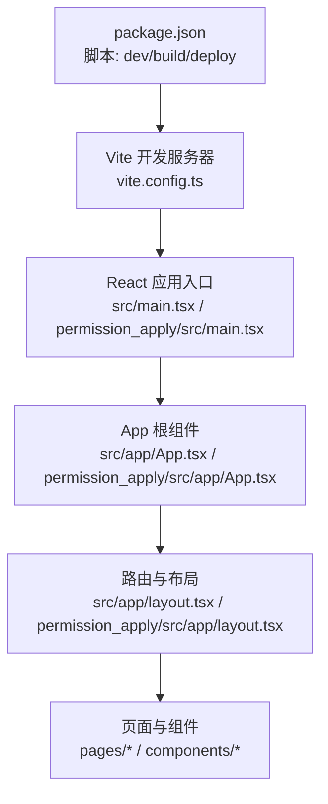
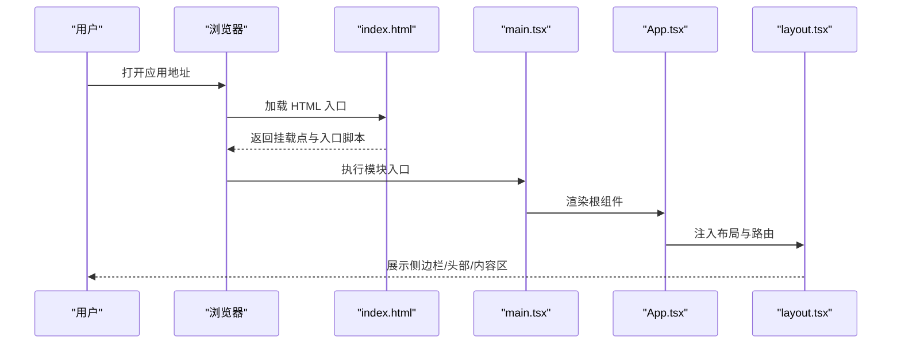
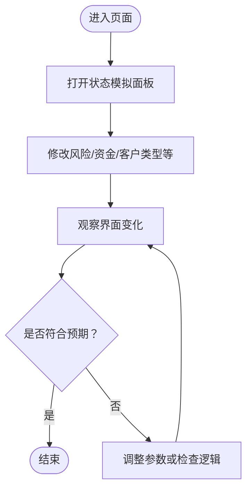
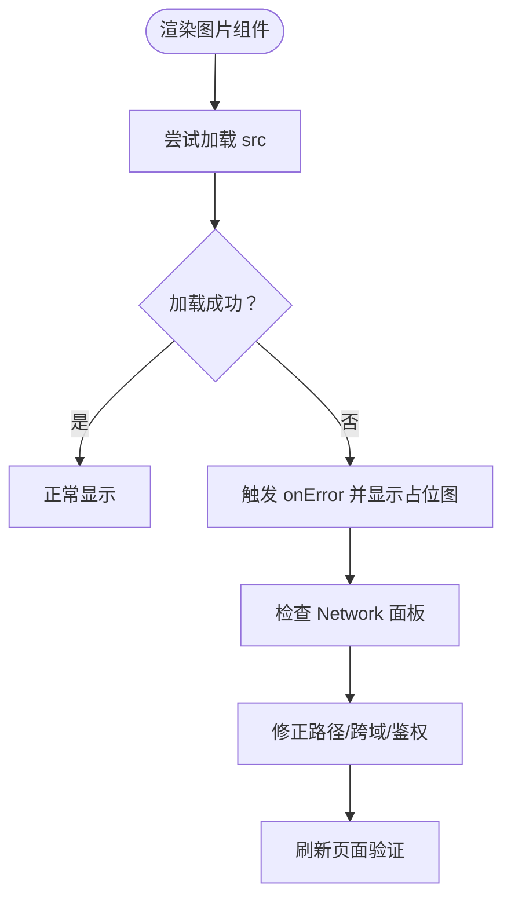
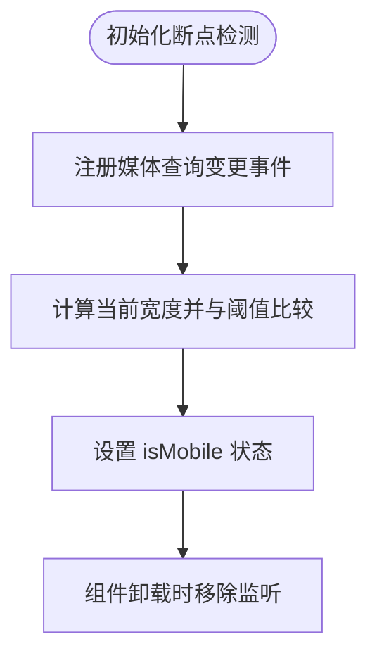
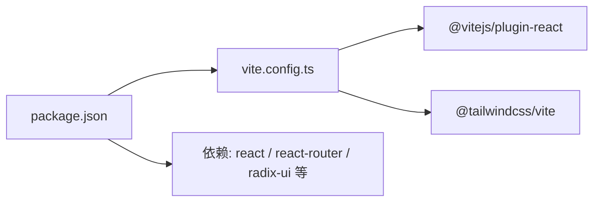

# 调试技巧

<cite>
**本文引用的文件**
- [package.json](file://package.json)
- [vite.config.ts](file://vite.config.ts)
- [index.html](file://index.html)
- [src/main.tsx](file://src/main.tsx)
- [permission_apply/src/main.tsx](file://permission_apply/src/main.tsx)
- [src/app/App.tsx](file://src/app/App.tsx)
- [permission_apply/src/app/App.tsx](file://permission_apply/src/app/App.tsx)
- [src/app/layout.tsx](file://src/app/layout.tsx)
- [permission_apply/src/app/layout.tsx](file://permission_apply/src/app/layout.tsx)
- [src/app/components/ConfigPanel.tsx](file://src/app/components/ConfigPanel.tsx)
- [permission_apply/src/app/components/ConfigPanel.tsx](file://permission_apply/src/app/components/ConfigPanel.tsx)
- [src/app/pages/SubmitForm.tsx](file://src/app/pages/SubmitForm.tsx)
- [permission_apply/src/app/pages/SubmitForm.tsx](file://permission_apply/src/app/pages/SubmitForm.tsx)
- [src/app/components/figma/ImageWithFallback.tsx](file://src/app/components/figma/ImageWithFallback.tsx)
- [permission_apply/src/app/components/figma/ImageWithFallback.tsx](file://permission_apply/src/app/components/figma/ImageWithFallback.tsx)
- [src/app/components/ui/use-mobile.ts](file://src/app/components/ui/use-mobile.ts)
- [permission_apply/src/app/components/ui/use-mobile.ts](file://permission_apply/src/app/components/ui/use-mobile.ts)
</cite>

## 目录
1. [简介](#简介)
2. [项目结构](#项目结构)
3. [核心组件](#核心组件)
4. [架构总览](#架构总览)
5. [详细组件分析](#详细组件分析)
6. [依赖分析](#依赖分析)
7. [性能考虑](#性能考虑)
8. [故障排除指南](#故障排除指南)
9. [结论](#结论)
10. [附录](#附录)

## 简介
本指南聚焦于在开发与调试阶段高效定位问题、提升效率的方法与工具实践，覆盖浏览器开发者工具、React DevTools、Vite 开发服务器的调试能力，以及常见问题的诊断流程与性能分析技巧。文档结合仓库实际代码结构与组件，提供可操作的调试场景与解决方案，帮助开发者快速定位并解决问题。

## 项目结构
该仓库包含两个主要前端应用入口：主应用与“权限申请”子应用。两者均通过 Vite 启动，使用 React Router 进行路由管理，并共享一套 UI 组件与上下文状态。

- 入口脚本与构建命令由包管理脚本定义，分别启动开发服务器与构建产物。
- Vite 配置启用 React 插件与 Tailwind 插件，并提供别名与自定义插件解析资源。
- HTML 入口仅包含挂载点与模块入口脚本，实际渲染由 React 应用完成。

图表来源
- [package.json:1-91](file://package.json#L1-L91)
- [vite.config.ts:1-37](file://vite.config.ts#L1-L37)
- [index.html:1-22](file://index.html#L1-L22)
- [src/main.tsx:1-7](file://src/main.tsx#L1-L7)
- [permission_apply/src/main.tsx:1-7](file://permission_apply/src/main.tsx#L1-L7)
- [src/app/App.tsx:1-6](file://src/app/App.tsx#L1-L6)
- [permission_apply/src/app/App.tsx:1-6](file://permission_apply/src/app/App.tsx#L1-L6)
- [src/app/layout.tsx:1-175](file://src/app/layout.tsx#L1-L175)
- [permission_apply/src/app/layout.tsx:1-87](file://permission_apply/src/app/layout.tsx#L1-L87)

章节来源
- [package.json:1-91](file://package.json#L1-L91)
- [vite.config.ts:1-37](file://vite.config.ts#L1-L37)
- [index.html:1-22](file://index.html#L1-L22)
- [src/main.tsx:1-7](file://src/main.tsx#L1-L7)
- [permission_apply/src/main.tsx:1-7](file://permission_apply/src/main.tsx#L1-L7)
- [src/app/App.tsx:1-6](file://src/app/App.tsx#L1-L6)
- [permission_apply/src/app/App.tsx:1-6](file://permission_apply/src/app/App.tsx#L1-L6)
- [src/app/layout.tsx:1-175](file://src/app/layout.tsx#L1-L175)
- [permission_apply/src/app/layout.tsx:1-87](file://permission_apply/src/app/layout.tsx#L1-L87)

## 核心组件
- 应用根组件负责注入路由提供器，使页面具备导航与参数传递能力。
- 布局组件统一承载侧边栏、面包屑、顶部栏与内容区域，并在特定路径下挂载状态模拟面板与全局通知组件。
- 状态模拟面板用于在本地快速切换风险等级、客户类型、资金规模等关键状态，便于验证不同业务分支。
- 图片降级组件在图片加载失败时回退到占位图，有助于识别资源路径或网络问题。
- 移动端断点 Hook 提供响应式判断，辅助排查移动端显示异常。

章节来源
- [src/app/App.tsx:1-6](file://src/app/App.tsx#L1-L6)
- [permission_apply/src/app/App.tsx:1-6](file://permission_apply/src/app/App.tsx#L1-L6)
- [src/app/layout.tsx:1-175](file://src/app/layout.tsx#L1-L175)
- [permission_apply/src/app/layout.tsx:1-87](file://permission_apply/src/app/layout.tsx#L1-L87)
- [src/app/components/ConfigPanel.tsx:1-134](file://src/app/components/ConfigPanel.tsx#L1-L134)
- [permission_apply/src/app/components/ConfigPanel.tsx:1-122](file://permission_apply/src/app/components/ConfigPanel.tsx#L1-L122)
- [src/app/components/figma/ImageWithFallback.tsx:1-27](file://src/app/components/figma/ImageWithFallback.tsx#L1-L27)
- [permission_apply/src/app/components/figma/ImageWithFallback.tsx:1-27](file://permission_apply/src/app/components/figma/ImageWithFallback.tsx#L1-L27)
- [src/app/components/ui/use-mobile.ts:1-21](file://src/app/components/ui/use-mobile.ts#L1-L21)
- [permission_apply/src/app/components/ui/use-mobile.ts:1-21](file://permission_apply/src/app/components/ui/use-mobile.ts#L1-L21)

## 架构总览
以下序列图展示从浏览器访问到 React 渲染的关键调用链，便于理解调试切入点与数据流。

图表来源
- [index.html:1-22](file://index.html#L1-L22)
- [src/main.tsx:1-7](file://src/main.tsx#L1-L7)
- [permission_apply/src/main.tsx:1-7](file://permission_apply/src/main.tsx#L1-L7)
- [src/app/App.tsx:1-6](file://src/app/App.tsx#L1-L6)
- [permission_apply/src/app/App.tsx:1-6](file://permission_apply/src/app/App.tsx#L1-L6)
- [src/app/layout.tsx:1-175](file://src/app/layout.tsx#L1-L175)
- [permission_apply/src/app/layout.tsx:1-87](file://permission_apply/src/app/layout.tsx#L1-L87)

## 详细组件分析

### 状态模拟面板（调试场景一）
- 作用：在不连接后端的情况下，快速切换关键业务状态以验证界面与逻辑分支。
- 调试要点：
  - 使用按钮/选择器直接修改状态，观察 UI 变化与条件渲染。
  - 结合“只读模式”与“调试开关”，验证边界条件与默认值。
- 典型问题：
  - 状态未更新导致界面不变。
  - 切换后未触发重新计算，需确认是否使用了正确的上下文与依赖。

图表来源
- [src/app/components/ConfigPanel.tsx:1-134](file://src/app/components/ConfigPanel.tsx#L1-L134)
- [permission_apply/src/app/components/ConfigPanel.tsx:1-122](file://permission_apply/src/app/components/ConfigPanel.tsx#L1-L122)
- [src/app/pages/SubmitForm.tsx:60-104](file://src/app/pages/SubmitForm.tsx#L60-L104)
- [permission_apply/src/app/pages/SubmitForm.tsx:60-104](file://permission_apply/src/app/pages/SubmitForm.tsx#L60-L104)

章节来源
- [src/app/components/ConfigPanel.tsx:1-134](file://src/app/components/ConfigPanel.tsx#L1-L134)
- [permission_apply/src/app/components/ConfigPanel.tsx:1-122](file://permission_apply/src/app/components/ConfigPanel.tsx#L1-L122)
- [src/app/pages/SubmitForm.tsx:60-104](file://src/app/pages/SubmitForm.tsx#L60-L104)
- [permission_apply/src/app/pages/SubmitForm.tsx:60-104](file://permission_apply/src/app/pages/SubmitForm.tsx#L60-L104)

### 图片加载失败降级（调试场景二）
- 作用：当远端图片无法加载时，自动回退到内置占位图，便于快速定位资源路径或网络问题。
- 调试要点：
  - 在 Network 面板查看图片请求状态码与耗时。
  - 在 Elements 面板检查 img 的错误事件是否被触发。
  - 对比占位图的 data URI 与原始 src，确认是否为路径拼接错误。
- 典型问题：
  - 跨域或鉴权失败导致 4xx/5xx。
  - 资源路径大小写或编码问题。

图表来源
- [src/app/components/figma/ImageWithFallback.tsx:1-27](file://src/app/components/figma/ImageWithFallback.tsx#L1-L27)
- [permission_apply/src/app/components/figma/ImageWithFallback.tsx:1-27](file://permission_apply/src/app/components/figma/ImageWithFallback.tsx#L1-L27)

章节来源
- [src/app/components/figma/ImageWithFallback.tsx:1-27](file://src/app/components/figma/ImageWithFallback.tsx#L1-L27)
- [permission_apply/src/app/components/figma/ImageWithFallback.tsx:1-27](file://permission_apply/src/app/components/figma/ImageWithFallback.tsx#L1-L27)

### 移动端断点检测（调试场景三）
- 作用：根据断点动态判断是否为移动端，辅助排查样式与交互在小屏设备上的表现。
- 调试要点：
  - 在设备模式下切换窗口宽度，观察断点变化。
  - 在 Console 中打印断点阈值与当前宽度，核对逻辑。
- 典型问题：
  - 断点阈值不一致导致误判。
  - 事件监听未正确解绑造成内存泄漏。

图表来源
- [src/app/components/ui/use-mobile.ts:1-21](file://src/app/components/ui/use-mobile.ts#L1-L21)
- [permission_apply/src/app/components/ui/use-mobile.ts:1-21](file://permission_apply/src/app/components/ui/use-mobile.ts#L1-L21)

章节来源
- [src/app/components/ui/use-mobile.ts:1-21](file://src/app/components/ui/use-mobile.ts#L1-L21)
- [permission_apply/src/app/components/ui/use-mobile.ts:1-21](file://permission_apply/src/app/components/ui/use-mobile.ts#L1-L21)

### 路由与布局（调试场景四）
- 作用：统一导航、面包屑与内容区域，便于定位页面跳转与参数传递问题。
- 调试要点：
  - 在 React DevTools 中检查 RouterProvider 与 Outlet 的渲染。
  - 在 Network 面板观察页面切换时是否存在不必要的资源请求。
- 典型问题：
  - 路由参数缺失导致页面空白。
  - 布局重复渲染引发性能抖动。

章节来源
- [src/app/App.tsx:1-6](file://src/app/App.tsx#L1-L6)
- [permission_apply/src/app/App.tsx:1-6](file://permission_apply/src/app/App.tsx#L1-L6)
- [src/app/layout.tsx:1-175](file://src/app/layout.tsx#L1-L175)
- [permission_apply/src/app/layout.tsx:1-87](file://permission_apply/src/app/layout.tsx#L1-L87)

## 依赖分析
- 构建与开发：Vite 提供热更新与按需编译；React 插件支持 JSX/TSX；Tailwind 插件用于样式生成。
- 运行时：React 18 与 React Router 提供组件模型与路由能力；大量 Radix UI 组件提供无障碍与可组合的 UI 基元。
- 工具链：包脚本定义了 dev/build/deploy 流程，便于本地调试与部署。

图表来源
- [package.json:1-91](file://package.json#L1-L91)
- [vite.config.ts:1-37](file://vite.config.ts#L1-L37)

章节来源
- [package.json:1-91](file://package.json#L1-L91)
- [vite.config.ts:1-37](file://vite.config.ts#L1-L37)

## 性能考虑
- 资源加载优化
  - 使用 Vite 的按需打包与 Tree Shaking，避免引入未使用的组件与样式。
  - 将大图资源拆分为懒加载模块，减少首屏阻塞。
- 渲染性能
  - 使用 React.memo 或 useMemo 缓存昂贵计算结果。
  - 控制重渲染范围，避免在布局层频繁触发顶层状态更新。
- 网络与缓存
  - 在开发阶段开启浏览器缓存策略，减少重复下载。
  - 使用占位图与骨架屏提升感知性能。

## 故障排除指南
- 启动与构建
  - 若开发服务器无法启动，优先检查端口占用与插件配置。
  - 构建报错时，先清理依赖并重新安装，再执行构建脚本。
- 路由与导航
  - 页面空白：检查路由配置与 Outlet 是否正确渲染。
  - 参数丢失：确认传参方式与接收方是否一致。
- 样式与主题
  - Tailwind 类无效：确认 Tailwind 插件已启用且扫描路径正确。
  - 主题不生效：检查主题变量与覆盖规则。
- 图片与资源
  - 图片不显示：使用降级组件定位资源路径或跨域问题。
  - SVG 资源无法导入：检查 Vite 的 assetsInclude 配置。
- 移动端适配
  - 断点不生效：核对断点阈值与媒体查询监听逻辑。
- 通知与提示
  - 全局提示未出现：检查通知组件的挂载位置与触发条件。

章节来源
- [vite.config.ts:1-37](file://vite.config.ts#L1-L37)
- [src/app/components/figma/ImageWithFallback.tsx:1-27](file://src/app/components/figma/ImageWithFallback.tsx#L1-L27)
- [permission_apply/src/app/components/figma/ImageWithFallback.tsx:1-27](file://permission_apply/src/app/components/figma/ImageWithFallback.tsx#L1-L27)
- [src/app/components/ui/use-mobile.ts:1-21](file://src/app/components/ui/use-mobile.ts#L1-L21)
- [permission_apply/src/app/components/ui/use-mobile.ts:1-21](file://permission_apply/src/app/components/ui/use-mobile.ts#L1-L21)

## 结论
通过合理利用 Vite 的开发体验、React DevTools 的组件层级与状态洞察，以及浏览器开发者工具的网络与性能分析能力，可以显著提升调试效率。结合本仓库提供的状态模拟面板、图片降级组件与移动端断点检测等实践，能够快速定位并解决常见问题，保障交付质量与开发节奏。

## 附录
- 快速清单
  - 启动：使用开发脚本启动 Vite，确认热更新正常。
  - 路由：在 React DevTools 中确认 RouterProvider 与 Outlet。
  - 状态：通过状态模拟面板快速切换关键状态。
  - 资源：Network 面板检查图片与静态资源请求。
  - 移动端：Console 输出断点阈值，验证媒体查询逻辑。
  - 性能：使用 Performance 面板观察长任务与重排重绘。