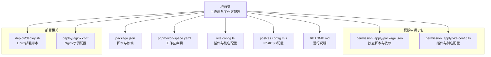
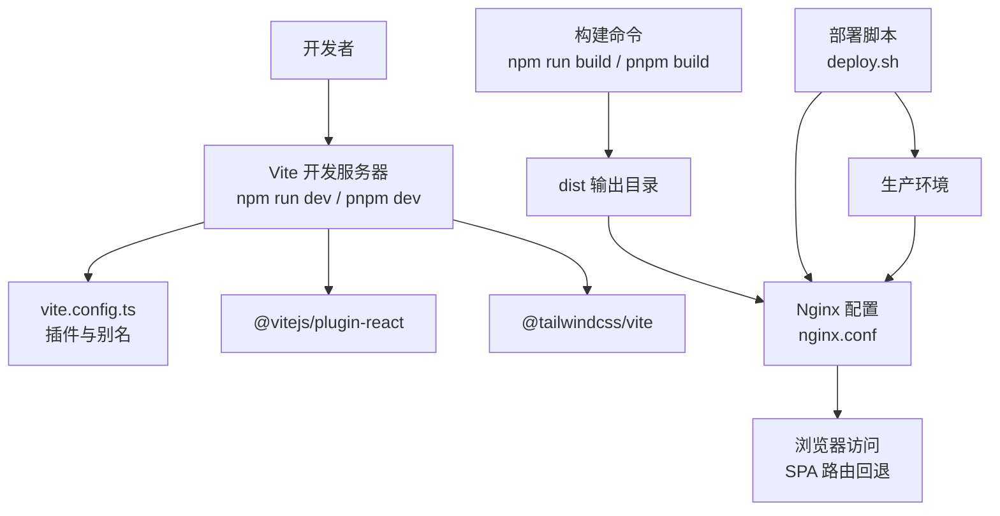
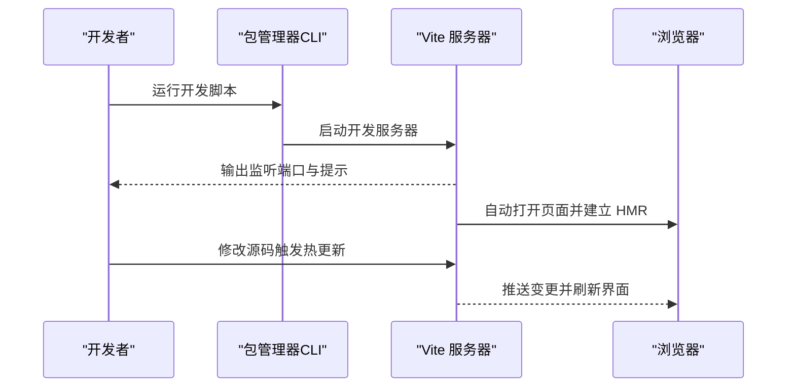
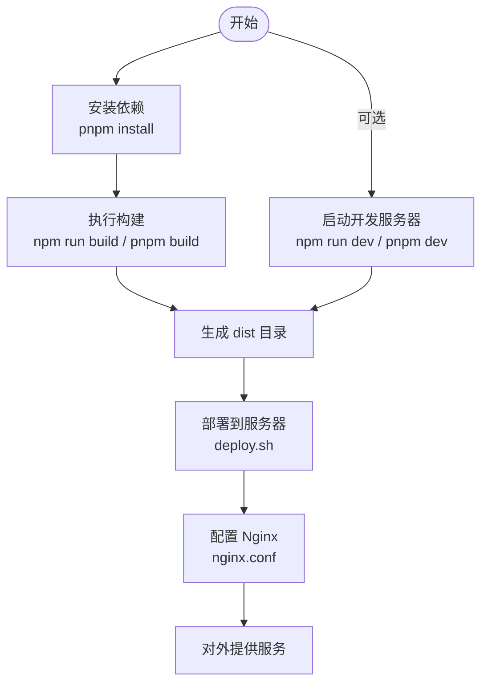
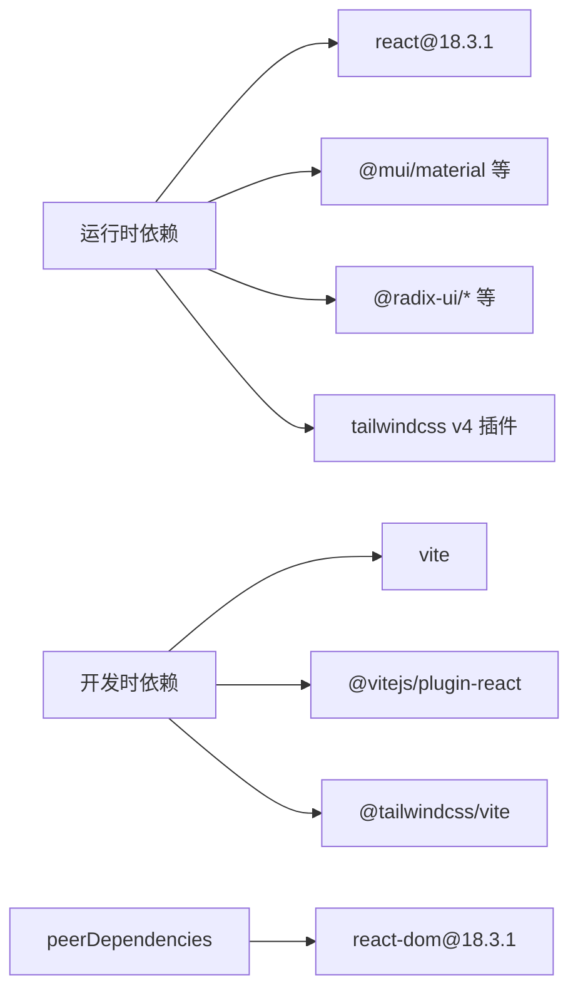

# 快速开始

<cite>
**本文引用的文件**
- [package.json](file://package.json)
- [pnpm-workspace.yaml](file://pnpm-workspace.yaml)
- [vite.config.ts](file://vite.config.ts)
- [README.md](file://README.md)
- [postcss.config.mjs](file://postcss.config.mjs)
- [permission_apply/package.json](file://permission_apply/package.json)
- [permission_apply/vite.config.ts](file://permission_apply/vite.config.ts)
- [deploy/deploy.sh](file://deploy/deploy.sh)
- [deploy/nginx.conf](file://deploy/nginx.conf)
</cite>

## 目录
1. [简介](#简介)
2. [项目结构](#项目结构)
3. [核心组件](#核心组件)
4. [架构总览](#架构总览)
5. [详细组件分析](#详细组件分析)
6. [依赖关系分析](#依赖关系分析)
7. [性能注意事项](#性能注意事项)
8. [故障排除指南](#故障排除指南)
9. [结论](#结论)
10. [附录](#附录)

## 简介
本指南面向新加入的开发者，帮助你在最短时间内完成开发环境搭建与项目运行。内容涵盖环境要求、安装步骤、基础配置、开发服务器启动与构建流程，并提供常见问题排查与初始配置验证方法。

## 项目结构
该仓库采用多包工作区组织方式，顶层包含主应用与“权限申请”子应用，均基于 Vite + React + Tailwind CSS 技术栈。顶层与子包共享相同的构建与开发配置，便于统一管理。

图表来源
- [package.json:1-91](file://package.json#L1-L91)
- [pnpm-workspace.yaml:1-10](file://pnpm-workspace.yaml#L1-L10)
- [vite.config.ts:1-37](file://vite.config.ts#L1-L37)
- [postcss.config.mjs:1-16](file://postcss.config.mjs#L1-L16)
- [README.md:1-11](file://README.md#L1-L11)
- [permission_apply/package.json:1-90](file://permission_apply/package.json#L1-L90)
- [permission_apply/vite.config.ts:1-37](file://permission_apply/vite.config.ts#L1-L37)
- [deploy/deploy.sh:1-107](file://deploy/deploy.sh#L1-L107)
- [deploy/nginx.conf:1-55](file://deploy/nginx.conf#L1-L55)

章节来源
- [package.json:1-91](file://package.json#L1-L91)
- [pnpm-workspace.yaml:1-10](file://pnpm-workspace.yaml#L1-L10)
- [README.md:1-11](file://README.md#L1-L11)

## 核心组件
- 包管理器与工作区
  - 推荐使用 pnpm 作为包管理器，以获得更快的安装速度与更严格的依赖隔离。
  - 工作区通过 pnpm-workspace.yaml 声明，支持 Linux/x64/arm64/glibc 平台。
- 构建工具
  - Vite 提供开发服务器与生产构建能力，脚本位于顶层 package.json。
- UI 与样式
  - React 18.3.1 + MUI 组件库 + Radix UI 组件集合 + Tailwind CSS v4（通过 @tailwindcss/vite 插件集成）。
- 开发体验
  - Vite 插件链：React 插件 + Tailwind 插件 + 自定义 Figma 资源解析插件；路径别名 @ 指向 src 目录。

章节来源
- [package.json:6-10](file://package.json#L6-L10)
- [package.json:68-77](file://package.json#L68-L77)
- [vite.config.ts:19-36](file://vite.config.ts#L19-L36)
- [pnpm-workspace.yaml:1-10](file://pnpm-workspace.yaml#L1-L10)

## 架构总览
下图展示了从本地开发到生产部署的关键流程：开发时通过 Vite 启动热更新服务，构建产物输出至 dist；生产环境通过 Nginx 提供静态托管，并支持 SPA 路由回退。

图表来源
- [package.json:6-10](file://package.json#L6-L10)
- [vite.config.ts:19-36](file://vite.config.ts#L19-L36)
- [deploy/deploy.sh:1-107](file://deploy/deploy.sh#L1-L107)
- [deploy/nginx.conf:1-55](file://deploy/nginx.conf#L1-L55)

## 详细组件分析

### 环境要求与安装步骤
- Node.js 版本
  - 项目对 Node.js 的最低版本要求可在依赖包的 engines 字段中查看。建议使用 LTS 版本以获得最佳稳定性与兼容性。
- 包管理器选择
  - 推荐使用 pnpm，以充分利用工作区与锁定文件特性，提升安装效率与一致性。
- 依赖安装
  - 在项目根目录执行安装命令，等待依赖下载与链接完成。
- 开发服务器
  - 使用开发脚本启动本地服务，自动打开浏览器并启用热更新。
- 构建脚本
  - 生产构建生成 dist 目录，用于部署或静态托管。

章节来源
- [README.md:5-11](file://README.md#L5-L11)
- [package.json:6-10](file://package.json#L6-L10)
- [pnpm-workspace.yaml:1-10](file://pnpm-workspace.yaml#L1-L10)

### 开发服务器启动流程

图表来源
- [package.json:6-10](file://package.json#L6-L10)
- [vite.config.ts:19-36](file://vite.config.ts#L19-L36)

### 构建与部署流程

图表来源
- [package.json:6-10](file://package.json#L6-L10)
- [deploy/deploy.sh:1-107](file://deploy/deploy.sh#L1-L107)
- [deploy/nginx.conf:1-55](file://deploy/nginx.conf#L1-L55)

### 子包（权限申请）配置
- 子包拥有独立的 package.json 与 vite.config.ts，保持与根包一致的插件与别名策略，便于并行开发与联调。
- 若需单独运行子包，可在其目录内执行对应的开发与构建脚本。

章节来源
- [permission_apply/package.json:6-9](file://permission_apply/package.json#L6-L9)
- [permission_apply/vite.config.ts:19-36](file://permission_apply/vite.config.ts#L19-L36)

## 依赖关系分析
- 依赖分层
  - 运行时依赖：React 18.3.1、MUI、Radix UI、Tailwind CSS v4 插件等。
  - 开发时依赖：Vite、React 插件、Tailwind 插件等。
  - peerDependencies：声明 React 与 React DOM 的版本范围，避免重复安装与版本冲突。
- 工作区与覆盖
  - pnpm-workspace.yaml 声明工作区，支持指定 CPU/OS 与 libc 要求。
  - pnpm overrides 可强制统一特定包版本，保证跨包一致性。

图表来源
- [package.json:11-67](file://package.json#L11-L67)
- [package.json:68-85](file://package.json#L68-L85)
- [pnpm-workspace.yaml:1-10](file://pnpm-workspace.yaml#L1-L10)

章节来源
- [package.json:11-85](file://package.json#L11-L85)
- [pnpm-workspace.yaml:1-10](file://pnpm-workspace.yaml#L1-L10)

## 性能注意事项
- 使用 pnpm 安装可减少磁盘占用与安装时间，同时避免重复依赖。
- Vite 默认启用按需编译与热更新，建议仅在必要时引入大型第三方库。
- Tailwind CSS v4 通过插件自动配置 PostCSS，尽量避免在 postcss.config.mjs 中添加额外插件，以减少构建开销。
- 构建后 dist 目录可通过 Nginx 启用 gzip 与缓存策略，提升首屏加载速度。

章节来源
- [postcss.config.mjs:1-16](file://postcss.config.mjs#L1-L16)
- [deploy/nginx.conf:18-24](file://deploy/nginx.conf#L18-L24)

## 故障排除指南
- 安装阶段
  - 若安装缓慢或失败，优先尝试更换镜像源或升级 pnpm 至最新稳定版。
  - 确认 Node.js 版本满足依赖要求，必要时使用版本管理器切换。
- 开发阶段
  - 若端口被占用，调整 Vite 监听端口或释放占用进程。
  - 若热更新不生效，检查插件顺序与别名配置，确保 @ 指向正确目录。
- 构建阶段
  - 若构建报错，优先清理 node_modules 与 pnpm-lock.yaml 后重新安装。
  - 确保所有 TypeScript/JSX 文件符合语法规范，避免类型错误导致构建中断。
- 部署阶段
  - 使用提供的部署脚本前，先在本地验证 Nginx 配置并通过语法检查。
  - 若访问空白页或路由异常，确认 SPA 路由回退至 index.html 的配置已生效。

章节来源
- [deploy/deploy.sh:25-36](file://deploy/deploy.sh#L25-L36)
- [deploy/deploy.sh:76-88](file://deploy/deploy.sh#L76-L88)
- [deploy/nginx.conf:33-36](file://deploy/nginx.conf#L33-L36)

## 结论
按照本指南完成环境准备与安装后，你将能够快速启动开发服务器、进行本地调试，并顺利产出构建产物。若需上线部署，可参考提供的部署脚本与 Nginx 配置，实现一键部署与稳定运行。

## 附录
- 快速命令清单
  - 安装依赖：在根目录执行安装命令
  - 启动开发服务器：执行开发脚本
  - 生成构建产物：执行构建脚本
  - 部署到服务器：执行部署脚本
- 初始配置验证
  - 访问本地开发地址，确认页面正常渲染与交互。
  - 构建后检查 dist 目录是否存在静态资源与入口文件。
  - 使用 Nginx 配置示例进行本地代理测试，验证路由回退与缓存策略。

章节来源
- [README.md:5-11](file://README.md#L5-L11)
- [package.json:6-10](file://package.json#L6-L10)
- [deploy/deploy.sh:1-107](file://deploy/deploy.sh#L1-L107)
- [deploy/nginx.conf:1-55](file://deploy/nginx.conf#L1-L55)