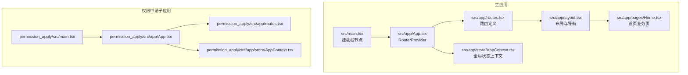
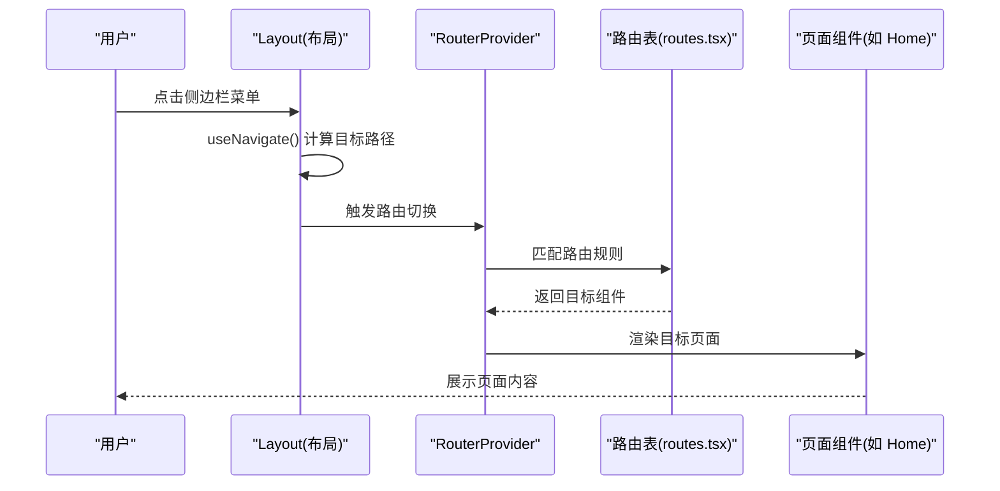
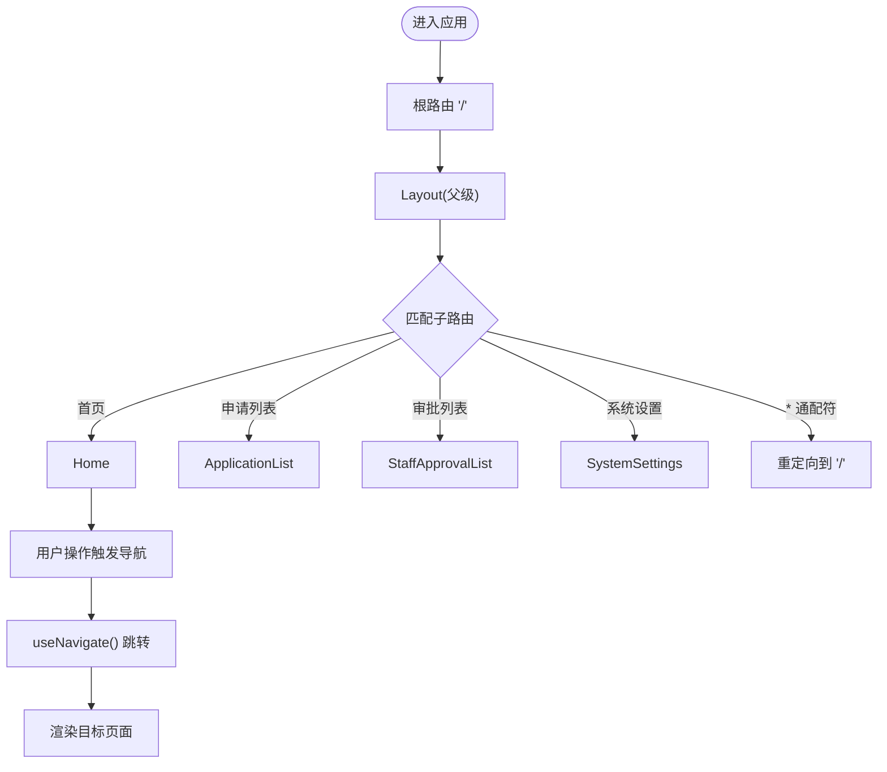
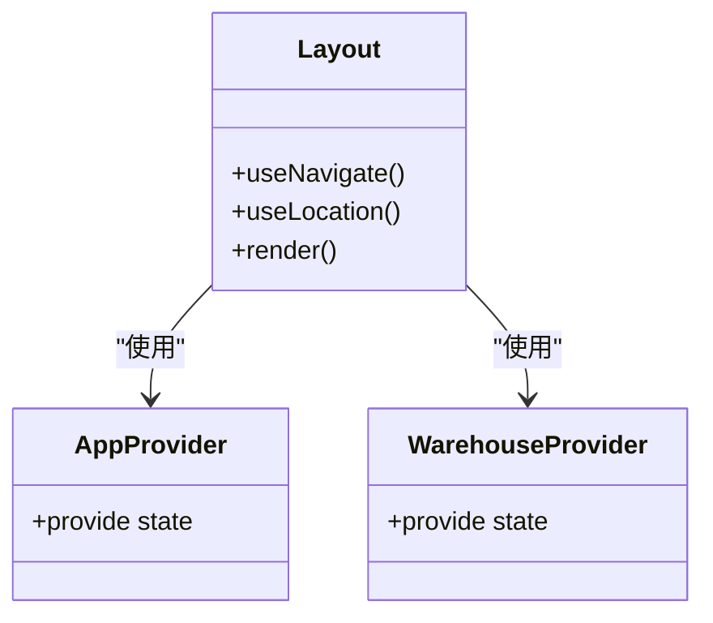
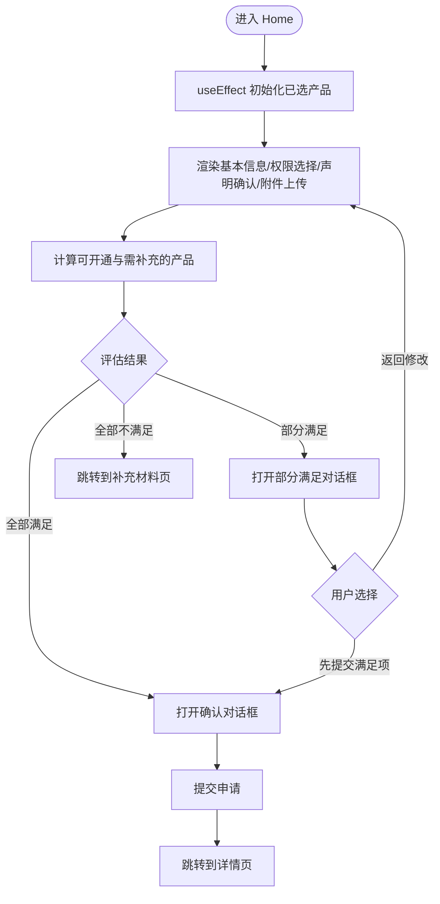
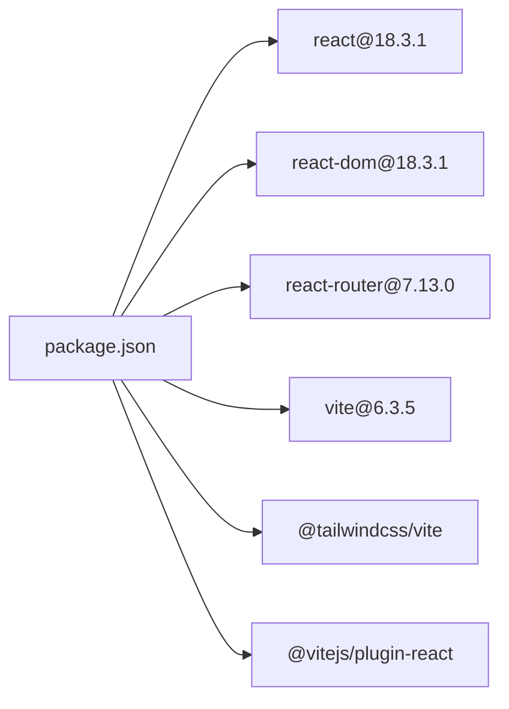

# React框架

<cite>
**本文引用的文件**
- [package.json](file://package.json)
- [vite.config.ts](file://vite.config.ts)
- [src/main.tsx](file://src/main.tsx)
- [src/app/App.tsx](file://src/app/App.tsx)
- [src/app/routes.tsx](file://src/app/routes.tsx)
- [src/app/layout.tsx](file://src/app/layout.tsx)
- [src/app/pages/Home.tsx](file://src/app/pages/Home.tsx)
- [src/app/store/AppContext.tsx](file://src/app/store/AppContext.tsx)
- [permission_apply/src/main.tsx](file://permission_apply/src/main.tsx)
- [permission_apply/src/app/App.tsx](file://permission_apply/src/app/App.tsx)
- [permission_apply/src/app/routes.tsx](file://permission_apply/src/app/routes.tsx)
- [permission_apply/src/app/store/AppContext.tsx](file://permission_apply/src/app/store/AppContext.tsx)
</cite>

## 目录
1. [简介](#简介)
2. [项目结构](#项目结构)
3. [核心组件](#核心组件)
4. [架构总览](#架构总览)
5. [详细组件分析](#详细组件分析)
6. [依赖关系分析](#依赖关系分析)
7. [性能考虑](#性能考虑)
8. [故障排查指南](#故障排查指南)
9. [结论](#结论)
10. [附录](#附录)

## 简介
本项目基于 React 18.3.1 与 Vite 构建，采用 React Router 7.13.0 实现前端路由，结合自研上下文与UI组件体系，提供交易权限申请与仓库转移两大业务模块。本文聚焦以下主题：
- React 18.3.1 的并发特性与自动批处理在本项目中的体现
- Suspense 在数据加载场景下的使用建议与最佳实践
- React Router 7.13.0 的路由配置与页面导航机制
- 组件生命周期管理、Hooks 使用最佳实践与性能优化策略
- TypeScript 集成与类型安全保障

## 项目结构
项目采用多包/多模块布局，主应用位于 src，权限申请子应用位于 permission_apply。两者共享相似的构建与路由结构。

图表来源
- [src/main.tsx:1-7](file://src/main.tsx#L1-L7)
- [src/app/App.tsx:1-6](file://src/app/App.tsx#L1-L6)
- [src/app/routes.tsx:1-38](file://src/app/routes.tsx#L1-L38)
- [src/app/layout.tsx:1-175](file://src/app/layout.tsx#L1-L175)
- [src/app/pages/Home.tsx:1-809](file://src/app/pages/Home.tsx#L1-L809)
- [src/app/store/AppContext.tsx:1-64](file://src/app/store/AppContext.tsx#L1-L64)
- [permission_apply/src/main.tsx:1-7](file://permission_apply/src/main.tsx#L1-L7)
- [permission_apply/src/app/App.tsx:1-6](file://permission_apply/src/app/App.tsx#L1-L6)
- [permission_apply/src/app/routes.tsx:1-27](file://permission_apply/src/app/routes.tsx#L1-L27)
- [permission_apply/src/app/store/AppContext.tsx:1-64](file://permission_apply/src/app/store/AppContext.tsx#L1-L64)

章节来源
- [package.json:1-91](file://package.json#L1-L91)
- [vite.config.ts:1-37](file://vite.config.ts#L1-L37)
- [src/main.tsx:1-7](file://src/main.tsx#L1-L7)
- [src/app/App.tsx:1-6](file://src/app/App.tsx#L1-L6)
- [src/app/routes.tsx:1-38](file://src/app/routes.tsx#L1-L38)
- [src/app/layout.tsx:1-175](file://src/app/layout.tsx#L1-L175)
- [src/app/pages/Home.tsx:1-809](file://src/app/pages/Home.tsx#L1-L809)
- [src/app/store/AppContext.tsx:1-64](file://src/app/store/AppContext.tsx#L1-L64)
- [permission_apply/src/main.tsx:1-7](file://permission_apply/src/main.tsx#L1-L7)
- [permission_apply/src/app/App.tsx:1-6](file://permission_apply/src/app/App.tsx#L1-L6)
- [permission_apply/src/app/routes.tsx:1-27](file://permission_apply/src/app/routes.tsx#L1-L27)
- [permission_apply/src/app/store/AppContext.tsx:1-64](file://permission_apply/src/app/store/AppContext.tsx#L1-L64)

## 核心组件
- 应用入口与根节点挂载：通过 createRoot 在 DOM 中挂载根组件，确保并发渲染能力与自动批处理生效。
- 路由容器：使用 RouterProvider 包裹路由实例，统一管理导航与嵌套路由。
- 布局与导航：侧边栏、面包屑、顶部头部分离职责，通过 Outlet 渲染子路由内容。
- 页面组件：以 Home 为例，集中展示状态管理、表单交互、条件判断与对话框流程。
- 全局状态：AppContext 提供账户、风险等级、资金等级、是否已有权限等状态与 setter。

章节来源
- [src/main.tsx:1-7](file://src/main.tsx#L1-L7)
- [src/app/App.tsx:1-6](file://src/app/App.tsx#L1-L6)
- [src/app/layout.tsx:1-175](file://src/app/layout.tsx#L1-L175)
- [src/app/pages/Home.tsx:1-809](file://src/app/pages/Home.tsx#L1-L809)
- [src/app/store/AppContext.tsx:1-64](file://src/app/store/AppContext.tsx#L1-L64)

## 架构总览
React 18.3.1 并发特性在本项目中的体现：
- 自动批处理：事件处理器中对多个状态的连续更新会自动合并，减少重渲染次数。
- 优先级调度：在交互密集场景下，用户输入等高优任务优先得到响应。
- 可中断渲染：长任务可被更高优先级任务打断，提升界面流畅度。

React Router 7.13.0 的路由机制：
- 使用 createBrowserRouter 定义路由树，支持嵌套路由与索引路由。
- 通过 Layout 组件包裹子路由，实现公共头部、侧边栏与内容区域的组合。
- 导航通过 useNavigate 进行编程式跳转，结合 useLocation 获取路径状态。

图表来源
- [src/app/layout.tsx:74-174](file://src/app/layout.tsx#L74-L174)
- [src/app/App.tsx:1-6](file://src/app/App.tsx#L1-L6)
- [src/app/routes.tsx:1-38](file://src/app/routes.tsx#L1-L38)
- [src/app/pages/Home.tsx:1-809](file://src/app/pages/Home.tsx#L1-L809)

章节来源
- [src/app/App.tsx:1-6](file://src/app/App.tsx#L1-L6)
- [src/app/routes.tsx:1-38](file://src/app/routes.tsx#L1-L38)
- [src/app/layout.tsx:1-175](file://src/app/layout.tsx#L1-L175)

## 详细组件分析

### 路由与导航机制（React Router 7.13.0）
- 路由定义：createBrowserRouter 创建路由树，根路径 "/" 对应 Layout，子路由包括首页、申请列表、审批相关页面等。
- 嵌套路由：Layout 作为父级组件，内部通过 Outlet 渲染子路由组件。
- 缺省与兜底：通配符 "*" 重定向到首页，保证未知路径的安全回退。
- 编程式导航：Layout 中使用 useNavigate 实现菜单点击跳转；页面组件使用 useNavigate 进行状态流转与跳转。

图表来源
- [src/app/routes.tsx:18-38](file://src/app/routes.tsx#L18-L38)
- [src/app/layout.tsx:74-174](file://src/app/layout.tsx#L74-L174)
- [src/app/pages/Home.tsx:61-809](file://src/app/pages/Home.tsx#L61-L809)

章节来源
- [src/app/routes.tsx:1-38](file://src/app/routes.tsx#L1-L38)
- [src/app/layout.tsx:1-175](file://src/app/layout.tsx#L1-L175)
- [src/app/pages/Home.tsx:1-809](file://src/app/pages/Home.tsx#L1-L809)

### 布局与导航（Sidebar、Breadcrumb、Provider）
- 侧边栏导航：根据当前路径高亮对应项，并支持“首页”“我发起的申请”“审批流水”等分组。
- 面包屑：根据路径映射显示当前模块与页面名称，增强用户定位感。
- Provider：AppProvider 与 WarehouseProvider 同时提供，用于跨组件共享状态。
- 条件渲染：根据路径决定是否渲染配置面板与通知组件。

图表来源
- [src/app/layout.tsx:74-174](file://src/app/layout.tsx#L74-L174)
- [src/app/store/AppContext.tsx:31-57](file://src/app/store/AppContext.tsx#L31-L57)

章节来源
- [src/app/layout.tsx:1-175](file://src/app/layout.tsx#L1-L175)
- [src/app/store/AppContext.tsx:1-64](file://src/app/store/AppContext.tsx#L1-L64)

### 页面组件（Home）与状态管理
- 状态聚合：通过 useAppContext 获取账户、风险等级、资金等级、是否已有权限等状态。
- 表单与交互：多处受控表单与复选框联动，配合条件判断与提示对话框。
- 文件上传：拖拽与点击两种方式，支持多文件选择与删除。
- 导航与流程：根据评估结果弹出不同对话框，最终跳转到详情或列表页。

图表来源
- [src/app/pages/Home.tsx:61-809](file://src/app/pages/Home.tsx#L61-L809)
- [src/app/store/AppContext.tsx:1-64](file://src/app/store/AppContext.tsx#L1-L64)

章节来源
- [src/app/pages/Home.tsx:1-809](file://src/app/pages/Home.tsx#L1-L809)
- [src/app/store/AppContext.tsx:1-64](file://src/app/store/AppContext.tsx#L1-L64)

### 子应用（权限申请）对比
- 结构一致：入口、App、路由、上下文均与主应用保持一致，便于维护与扩展。
- 路由差异：子应用路由较少，覆盖权限申请主流程，便于独立部署与测试。

章节来源
- [permission_apply/src/main.tsx:1-7](file://permission_apply/src/main.tsx#L1-L7)
- [permission_apply/src/app/App.tsx:1-6](file://permission_apply/src/app/App.tsx#L1-L6)
- [permission_apply/src/app/routes.tsx:1-27](file://permission_apply/src/app/routes.tsx#L1-L27)
- [permission_apply/src/app/store/AppContext.tsx:1-64](file://permission_apply/src/app/store/AppContext.tsx#L1-L64)

## 依赖关系分析
- React 与 ReactDOM：版本锁定为 18.3.1，确保并发特性与批处理行为稳定。
- React Router：版本 7.13.0，提供现代路由能力与更好的嵌套与懒加载支持。
- Vite：开发与构建工具链，配合 React 插件与 Tailwind 支持。
- UI 组件库：Radix UI、Material UI、Lucide React 等，提供基础组件与图标。

图表来源
- [package.json:11-85](file://package.json#L11-L85)

章节来源
- [package.json:1-91](file://package.json#L1-L91)
- [vite.config.ts:1-37](file://vite.config.ts#L1-L37)

## 性能考虑
- 自动批处理：在高频状态更新场景下，避免不必要的多次重渲染，建议将相关状态合并更新。
- 事件处理：使用受控组件与最小化状态树，减少无关组件重渲染。
- 路由切换：利用 React Router 的嵌套路由与 Outlet，避免重复渲染父级布局。
- 图标与样式：按需引入图标与样式，避免打包体积膨胀。
- 开发体验：Vite 提供快速热更新与按需编译，提升迭代效率。

## 故障排查指南
- 路由跳转无效：检查 useNavigate 的调用时机与目标路径是否存在；确认路由表中是否存在对应子路由。
- 状态未更新：确认是否在 AppProvider 下使用 useAppContext；避免在 Provider 外部调用。
- 构建异常：检查 Vite 插件顺序与别名配置；确保 @ 符号指向正确目录。
- 移动端适配：使用 useIsMobile 判断断点，必要时调整布局与交互元素。

章节来源
- [src/app/layout.tsx:74-174](file://src/app/layout.tsx#L74-L174)
- [src/app/store/AppContext.tsx:59-63](file://src/app/store/AppContext.tsx#L59-L63)
- [vite.config.ts:19-36](file://vite.config.ts#L19-L36)

## 结论
本项目在 React 18.3.1 与 React Router 7.13.0 的基础上，实现了清晰的路由结构、可维护的状态上下文与良好的用户体验。通过并发特性与自动批处理，提升了交互流畅度；通过规范的 Hooks 使用与组件拆分，增强了可扩展性与可测试性。建议后续在数据加载场景引入 Suspense 与资源边界，进一步完善错误边界与加载态处理。

## 附录
- TypeScript 集成：项目使用 Vite 与 React 插件，具备良好的 TS 支持；建议在新增文件时启用严格模式与合理类型约束。
- 类型安全：AppContext 明确导出状态类型与 setter 类型，有助于在组件间传递强类型数据。
- 版本一致性：React 与 ReactDOM 版本保持一致，避免潜在兼容问题。