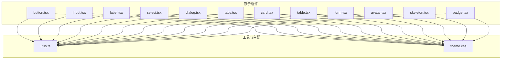
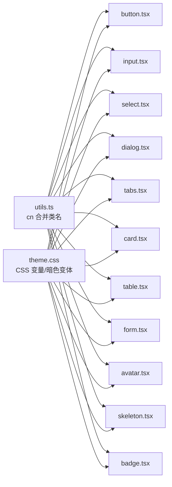
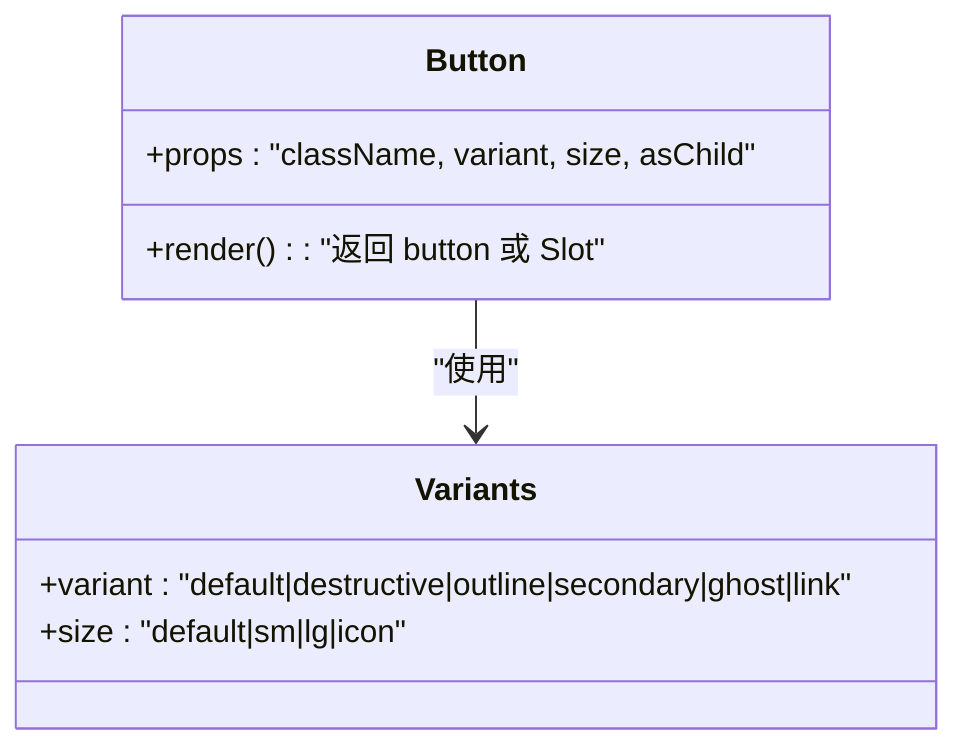
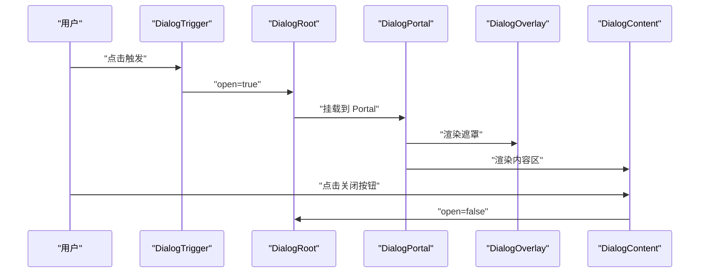
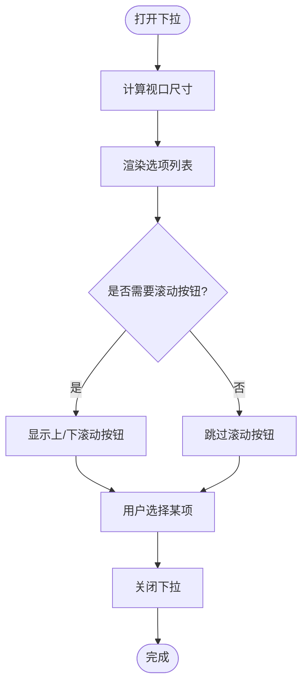
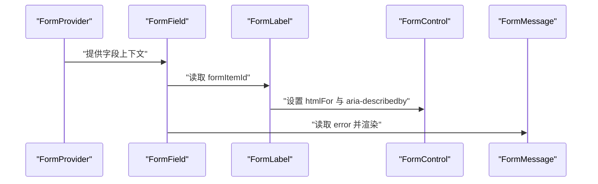
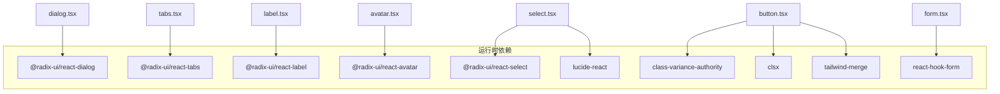

# UI组件库

<cite>
**本文引用的文件**
- [button.tsx](file://src/app/components/ui/button.tsx)
- [dialog.tsx](file://src/app/components/ui/dialog.tsx)
- [input.tsx](file://src/app/components/ui/input.tsx)
- [select.tsx](file://src/app/components/ui/select.tsx)
- [tabs.tsx](file://src/app/components/ui/tabs.tsx)
- [utils.ts](file://src/app/components/ui/utils.ts)
- [form.tsx](file://src/app/components/ui/form.tsx)
- [card.tsx](file://src/app/components/ui/card.tsx)
- [table.tsx](file://src/app/components/ui/table.tsx)
- [badge.tsx](file://src/app/components/ui/badge.tsx)
- [label.tsx](file://src/app/components/ui/label.tsx)
- [avatar.tsx](file://src/app/components/ui/avatar.tsx)
- [skeleton.tsx](file://src/app/components/ui/skeleton.tsx)
- [package.json](file://package.json)
- [theme.css](file://src/styles/theme.css)
</cite>

## 目录
1. [引言](#引言)
2. [项目结构](#项目结构)
3. [核心组件](#核心组件)
4. [架构总览](#架构总览)
5. [组件详解](#组件详解)
6. [依赖关系分析](#依赖关系分析)
7. [性能与可访问性](#性能与可访问性)
8. [故障排查指南](#故障排查指南)
9. [结论](#结论)
10. [附录](#附录)

## 引言
本项目以 Radix UI 为核心，构建了一套高可访问性（a11y）、可组合、可定制的原子级 UI 组件库。组件广泛采用语义化标签、键盘导航、焦点管理与屏幕阅读器友好结构；通过 Variants 与 Tailwind 工具类实现一致的外观与交互状态；借助主题变量与暗色变体，提供统一的设计系统与跨浏览器一致性。

## 项目结构
组件库位于 src/app/components/ui 下，按功能划分为原子组件与复合组件两类：
- 原子组件：button、input、label、badge、avatar、skeleton 等，提供最小可用功能与稳定接口。
- 复合组件：dialog、select、tabs、card、table、form 等，由多个原子组件组合而成，提供复杂交互与状态管理。

图表来源
- [button.tsx:1-59](file://src/app/components/ui/button.tsx#L1-L59)
- [input.tsx:1-22](file://src/app/components/ui/input.tsx#L1-L22)
- [label.tsx:1-25](file://src/app/components/ui/label.tsx#L1-L25)
- [select.tsx:1-190](file://src/app/components/ui/select.tsx#L1-L190)
- [dialog.tsx:1-136](file://src/app/components/ui/dialog.tsx#L1-L136)
- [tabs.tsx:1-67](file://src/app/components/ui/tabs.tsx#L1-L67)
- [card.tsx:1-93](file://src/app/components/ui/card.tsx#L1-L93)
- [table.tsx:1-117](file://src/app/components/ui/table.tsx#L1-L117)
- [form.tsx:1-169](file://src/app/components/ui/form.tsx#L1-L169)
- [avatar.tsx:1-54](file://src/app/components/ui/avatar.tsx#L1-L54)
- [skeleton.tsx:1-14](file://src/app/components/ui/skeleton.tsx#L1-L14)
- [badge.tsx:1-47](file://src/app/components/ui/badge.tsx#L1-L47)
- [utils.ts:1-7](file://src/app/components/ui/utils.ts#L1-L7)
- [theme.css:1-182](file://src/styles/theme.css#L1-L182)

章节来源
- [package.json:11-66](file://package.json#L11-L66)

## 核心组件
本节概述各组件的职责、属性与典型用法，便于快速查阅与集成。

- 按钮 Button
  - 功能：承载点击行为，支持多种视觉变体与尺寸；支持将自身渲染为任意元素（asChild）。
  - 关键属性：className、variant（default/destructive/outline/secondary/ghost/link）、size（default/sm/lg/icon）、asChild。
  - 使用场景：主操作、次要操作、危险操作、链接按钮等。
  - 可访问性：继承原生 button 行为，自动聚焦环与禁用态处理。
  
  章节来源
  - [button.tsx:37-56](file://src/app/components/ui/button.tsx#L37-L56)

- 输入框 Input
  - 功能：基础文本输入，内置聚焦环、无效态与占位符样式。
  - 关键属性：type、className。
  - 使用场景：表单字段、搜索框、数字输入等。
  - 可访问性：原生 input，配合 Form 组件可自动注入 aria 属性。
  
  章节来源
  - [input.tsx:5-19](file://src/app/components/ui/input.tsx#L5-L19)

- 标签 Label
  - 功能：与表单控件配对显示，支持禁用态与选中态样式。
  - 关键属性：className。
  - 使用场景：表单标题、提示信息。
  - 可访问性：与受控组件绑定时，可自动设置 htmlFor。
  
  章节来源
  - [label.tsx:8-22](file://src/app/components/ui/label.tsx#L8-L22)

- 选择器 Select
  - 功能：下拉选择，支持分组、滚动按钮、图标与多态内容定位。
  - 关键属性：Root/Trigger/Content/Item/Label/ScrollUp/ScrollDown 等。
  - 使用场景：单选、多选项筛选。
  - 可访问性：遵循 Select 规范，支持键盘导航与屏幕阅读器读取。
  
  章节来源
  - [select.tsx:13-189](file://src/app/components/ui/select.tsx#L13-L189)

- 对话框 Dialog
  - 功能：模态对话，包含触发器、遮罩、内容区、关闭按钮与标题描述。
  - 关键属性：Root/Trigger/Portal/Overlay/Content/Close/Title/Description/Header/Footer。
  - 使用场景：确认弹窗、设置面板、引导说明。
  - 可访问性：自动管理焦点、隐藏背景滚动、提供关闭按钮的可读文案。
  
  章节来源
  - [dialog.tsx:9-135](file://src/app/components/ui/dialog.tsx#L9-L135)

- 标签页 Tabs
  - 功能：选项卡切换，支持列表与触发器组合。
  - 关键属性：Root/List/Trigger/Content。
  - 使用场景：分组内容切换、设置分栏。
  - 可访问性：遵循 Tabs 规范，支持键盘切换与状态指示。
  
  章节来源
  - [tabs.tsx:8-66](file://src/app/components/ui/tabs.tsx#L8-L66)

- 卡片 Card
  - 功能：容器布局，支持头部、标题、描述、动作、内容与底部区域。
  - 关键属性：Card/CardHeader/CardTitle/CardDescription/CardAction/CardContent/CardFooter。
  - 使用场景：数据卡片、统计块、用户信息展示。
  
  章节来源
  - [card.tsx:5-92](file://src/app/components/ui/card.tsx#L5-L92)

- 表格 Table
  - 功能：表格容器与子元素，支持容器滚动与行选中态。
  - 关键属性：Table/TableHeader/TableBody/TableFooter/TableRow/TableHead/TableCell/TableCaption。
  - 使用场景：数据列表、报表展示。
  
  章节来源
  - [table.tsx:7-116](file://src/app/components/ui/table.tsx#L7-L116)

- 表单 Form
  - 功能：基于 react-hook-form 的表单上下文与辅助 Hook，自动注入 aria 描述与错误态。
  - 关键属性：Form/FormField/FormItem/FormLabel/FormControl/FormDescription/FormMessage/useFormField。
  - 使用场景：复杂表单、校验反馈、动态字段。
  
  章节来源
  - [form.tsx:19-168](file://src/app/components/ui/form.tsx#L19-L168)

- 头像 Avatar
  - 功能：头像容器、图片与回退占位。
  - 关键属性：Avatar/AvatarImage/AvatarFallback。
  - 使用场景：用户头像、占位图。
  
  章节来源
  - [avatar.tsx:8-53](file://src/app/components/ui/avatar.tsx#L8-L53)

- 骨架屏 Skeleton
  - 功能：加载占位动画。
  - 关键属性：className。
  - 使用场景：异步数据加载前的视觉反馈。
  
  章节来源
  - [skeleton.tsx:3-13](file://src/app/components/ui/skeleton.tsx#L3-L13)

- 徽章 Badge
  - 功能：标签式徽标，支持变体与 asChild 渲染。
  - 关键属性：variant（default/secondary/destructive/outline），asChild。
  - 使用场景：状态标记、新特性提示。
  
  章节来源
  - [badge.tsx:28-46](file://src/app/components/ui/badge.tsx#L28-L46)

## 架构总览
组件库围绕以下设计原则组织：
- 可组合性：通过 Slot 与 asChild 支持自定义渲染目标，提升复用性。
- 变体系统：使用 class-variance-authority 定义变体与默认值，保证样式一致性。
- 主题系统：CSS 自定义属性与暗色变体，统一颜色、字体与圆角。
- 可访问性：基于 Radix UI 的语义与键盘交互，结合 aria-* 属性与 sr-only 文案。
- 样式合并：统一使用 cn 工具函数，避免冲突并支持 Tailwind 覆盖。

图表来源
- [utils.ts:4-6](file://src/app/components/ui/utils.ts#L4-L6)
- [theme.css:1-182](file://src/styles/theme.css#L1-L182)
- [button.tsx:1-59](file://src/app/components/ui/button.tsx#L1-L59)
- [input.tsx:1-22](file://src/app/components/ui/input.tsx#L1-L22)
- [select.tsx:1-190](file://src/app/components/ui/select.tsx#L1-L190)
- [dialog.tsx:1-136](file://src/app/components/ui/dialog.tsx#L1-L136)
- [tabs.tsx:1-67](file://src/app/components/ui/tabs.tsx#L1-L67)
- [card.tsx:1-93](file://src/app/components/ui/card.tsx#L1-L93)
- [table.tsx:1-117](file://src/app/components/ui/table.tsx#L1-L117)
- [form.tsx:1-169](file://src/app/components/ui/form.tsx#L1-L169)
- [avatar.tsx:1-54](file://src/app/components/ui/avatar.tsx#L1-L54)
- [skeleton.tsx:1-14](file://src/app/components/ui/skeleton.tsx#L1-L14)
- [badge.tsx:1-47](file://src/app/components/ui/badge.tsx#L1-L47)

## 组件详解

### Button 组件
- 设计要点
  - 使用 Variants 定义 variant 与 size，结合 cn 合并传入 className。
  - 支持 asChild 将渲染目标改为 Slot，便于包裹链接或自定义元素。
  - 内置聚焦环、禁用态与 invalid 态样式，适配表单反馈。
- 典型用法
  - 主要操作：variant="default"，size="default"。
  - 危险操作：variant="destructive"。
  - 图标按钮：size="icon" 或在 children 中放置图标。
- 最佳实践
  - 优先使用原生 button，避免误用 div。
  - 通过 asChild 包裹 Link 时，确保具备可访问性标签。

图表来源
- [button.tsx:7-35](file://src/app/components/ui/button.tsx#L7-L35)
- [button.tsx:37-56](file://src/app/components/ui/button.tsx#L37-L56)

章节来源
- [button.tsx:1-59](file://src/app/components/ui/button.tsx#L1-L59)

### Dialog 组件
- 设计要点
  - Root/Trigger/Portal/Overlay/Content/Close/Title/Description/Header/Footer 组合，形成完整模态体系。
  - 内置动画与定位，支持键盘关闭与焦点陷阱。
  - 关闭按钮包含 sr-only 文本，提升可访问性。
- 典型用法
  - 打开：在 Trigger 上绑定 open 事件。
  - 关闭：Close 按钮或 Escape 键。
  - 结构：Header/Title/Description + Content + Footer/Close。
- 最佳实践
  - 在 Overlay 上阻止背景滚动，确保内容聚焦。
  - 为标题与描述提供明确语义，避免仅依赖视觉。

图表来源
- [dialog.tsx:9-73](file://src/app/components/ui/dialog.tsx#L9-L73)

章节来源
- [dialog.tsx:1-136](file://src/app/components/ui/dialog.tsx#L1-L136)

### Select 组件
- 设计要点
  - Trigger 支持 size 控制高度，内置 Chevron 图标。
  - Content 支持 popper 位置与滚动按钮，Viewport 自适应触发器尺寸。
  - Item 支持选中指示器与文本裁剪。
- 典型用法
  - 简单选择：Select/Trigger/Content/Item。
  - 分组：Select/Group/Label/Item。
  - 自定义图标：Trigger 中插入自定义 SVG。
- 最佳实践
  - 为长列表提供 ScrollUp/ScrollDown 按钮。
  - 使用 ItemIndicator 明确当前选中项。

图表来源
- [select.tsx:57-90](file://src/app/components/ui/select.tsx#L57-L90)
- [select.tsx:105-127](file://src/app/components/ui/select.tsx#L105-L127)

章节来源
- [select.tsx:1-190](file://src/app/components/ui/select.tsx#L1-L190)

### Tabs 组件
- 设计要点
  - TabsList 提供容器与激活态背景，TabsTrigger 支持激活态边框与聚焦环。
  - TabsContent 作为受控内容容器，保持可访问性状态同步。
- 典型用法
  - 水平选项卡：List + 多个 Trigger + Content。
  - 垂直布局：通过父容器 Flex 方向控制。
- 最佳实践
  - 为每个 Tab 提供唯一 id 与 aria-controls。
  - 使用键盘方向键在触发器间移动。

章节来源
- [tabs.tsx:1-67](file://src/app/components/ui/tabs.tsx#L1-L67)

### Form 组件
- 设计要点
  - FormProvider 提供上下文；FormField 注入字段名；useFormField 获取 id 与 aria-*。
  - FormControl 自动注入 aria-describedby 与 aria-invalid。
  - FormMessage 在无错误时静默，有错误时渲染错误消息。
- 典型用法
  - 包裹于 FormProvider 下，使用 FormField 包装控制器。
  - 通过 FormLabel 与 htmlFor 关联，FormDescription 提供辅助说明。
- 最佳实践
  - 错误态通过控制器返回的 error 对象驱动。
  - 为每个字段提供 formDescriptionId 与 formMessageId。

图表来源
- [form.tsx:32-66](file://src/app/components/ui/form.tsx#L32-L66)
- [form.tsx:90-124](file://src/app/components/ui/form.tsx#L90-L124)
- [form.tsx:139-157](file://src/app/components/ui/form.tsx#L139-L157)

章节来源
- [form.tsx:1-169](file://src/app/components/ui/form.tsx#L1-L169)

### Card 与 Table 组件
- 设计要点
  - Card 通过语义化结构划分头部、标题、描述、动作、内容与底部，支持网格布局与边框。
  - Table 以容器包裹表格，提供滚动与 hover/selected 状态。
- 典型用法
  - Card 用于信息区块展示；Table 用于数据列表与报表。
- 最佳实践
  - 表头使用 TableHead，单元格使用 TableCell，保持语义清晰。
  - 为表格提供 Caption 与可读标题。

章节来源
- [card.tsx:1-93](file://src/app/components/ui/card.tsx#L1-L93)
- [table.tsx:1-117](file://src/app/components/ui/table.tsx#L1-L117)

### Label、Avatar、Skeleton、Badge
- 设计要点
  - Label：与表单控件配对，支持禁用态与选中态。
  - Avatar：头像容器、图片与回退占位，支持尺寸与溢出处理。
  - Skeleton：脉冲动画占位，适合异步加载场景。
  - Badge：标签式徽标，支持变体与 asChild。
- 典型用法
  - 在表单中为 Input/Select 等提供可点击标签。
  - 在用户信息卡片中展示头像与状态徽章。
- 最佳实践
  - Badge 与状态联动，避免过度装饰。
  - Skeleton 仅在必要时出现，避免影响首屏感知。

章节来源
- [label.tsx:1-25](file://src/app/components/ui/label.tsx#L1-L25)
- [avatar.tsx:1-54](file://src/app/components/ui/avatar.tsx#L1-L54)
- [skeleton.tsx:1-14](file://src/app/components/ui/skeleton.tsx#L1-L14)
- [badge.tsx:1-47](file://src/app/components/ui/badge.tsx#L1-L47)

## 依赖关系分析
- 组件依赖
  - Radix UI：@radix-ui/react-* 提供可访问性基础能力（Dialog、Select、Tabs、Label、Avatar 等）。
  - 样式工具：class-variance-authority、clsx、tailwind-merge 提供变体与类名合并。
  - 图标：lucide-react 提供通用图标。
  - 表单：react-hook-form 与自定义 Form 组件协作。
- 主题与样式
  - theme.css 定义 CSS 变量与暗色变体，@layer base 设置全局排版与基础样式。
  - cn 工具统一合并类名，避免冲突并支持 Tailwind 覆盖。

图表来源
- [package.json:17-66](file://package.json#L17-L66)
- [dialog.tsx:3-4](file://src/app/components/ui/dialog.tsx#L3-L4)
- [select.tsx:3-4](file://src/app/components/ui/select.tsx#L3-L4)
- [tabs.tsx:3-4](file://src/app/components/ui/tabs.tsx#L3-L4)
- [label.tsx:3-4](file://src/app/components/ui/label.tsx#L3-L4)
- [avatar.tsx:3-4](file://src/app/components/ui/avatar.tsx#L3-L4)
- [button.tsx:2-3](file://src/app/components/ui/button.tsx#L2-L3)
- [form.tsx:4-14](file://src/app/components/ui/form.tsx#L4-L14)
- [select.tsx:5-9](file://src/app/components/ui/select.tsx#L5-L9)

章节来源
- [package.json:11-66](file://package.json#L11-L66)

## 性能与可访问性
- 性能
  - 组件尽量轻量，避免不必要的重渲染；使用 asChild 降低 DOM 层级。
  - 通过 Variants 与 cn 合并减少重复样式计算。
- 可访问性
  - 所有交互组件均基于 Radix UI，遵循 ARIA 规范与键盘导航。
  - 表单组件自动注入 aria-invalid、aria-describedby，错误信息通过 FormMessage 渲染。
  - 对话框与下拉菜单提供焦点陷阱与背景遮罩，避免焦点逃逸。
- 响应式与跨浏览器
  - 使用 CSS 自定义属性与 @layer base，确保在不同浏览器中一致呈现。
  - 通过 Tailwind 工具类与变体系统，适配移动端与小屏设备。

## 故障排查指南
- 焦点与键盘问题
  - 症状：Tab 无法聚焦或焦点丢失。
  - 排查：检查是否正确使用 Trigger/Root/Portal 组合；确认 Dialog/Select 内容被 Portal 渲染。
- 表单错误不显示
  - 症状：输入错误后无提示。
  - 排查：确认 FormControl 是否包裹了受控组件；检查 useFormField 返回的 error 是否存在。
- 样式冲突
  - 症状：组件样式被覆盖或错乱。
  - 排查：使用 cn 合并类名，避免重复覆盖；检查 theme.css 中变量是否被外部样式覆盖。
- 暗色模式异常
  - 症状：夜间模式颜色不一致。
  - 排查：确认根元素是否应用了暗色类；检查 CSS 变量是否正确更新。

章节来源
- [form.tsx:107-124](file://src/app/components/ui/form.tsx#L107-L124)
- [dialog.tsx:54-72](file://src/app/components/ui/dialog.tsx#L54-L72)
- [select.tsx:63-89](file://src/app/components/ui/select.tsx#L63-L89)
- [theme.css:44-79](file://src/styles/theme.css#L44-L79)

## 结论
该组件库以 Radix UI 为基础，结合 Variants、Tailwind 与主题变量，实现了高可访问性、强组合性与一致性的 UI 基础设施。通过 Form、Dialog、Select、Tabs 等复合组件，开发者可以快速搭建复杂界面；通过 Button、Input、Label、Badge 等原子组件，满足细节层面的样式与交互需求。建议在团队内推广使用统一的变体与主题规范，持续完善可访问性与跨浏览器测试。

## 附录
- API 速查
  - Button：variant、size、asChild、className。
  - Input：type、className。
  - Label：className。
  - Select：Root/Trigger/Content/Item/Label/ScrollUp/ScrollDown。
  - Dialog：Root/Trigger/Portal/Overlay/Content/Close/Title/Description/Header/Footer。
  - Tabs：Root/List/Trigger/Content。
  - Card：Card/CardHeader/CardTitle/CardDescription/CardAction/CardContent/CardFooter。
  - Table：Table/TableHeader/TableBody/TableFooter/TableRow/TableHead/TableCell/TableCaption。
  - Form：Form/FormField/FormItem/FormLabel/FormControl/FormDescription/FormMessage/useFormField。
  - Avatar：Avatar/AvatarImage/AvatarFallback。
  - Skeleton：className。
  - Badge：variant、asChild、className。
- 最佳实践清单
  - 优先使用原生语义元素与 Radix 组件。
  - 为所有交互元素提供键盘可达性。
  - 表单错误信息清晰、可读且可聚焦。
  - 使用主题变量统一颜色与间距。
  - 通过 asChild 与 Slot 提升可组合性。