# 业务组件

<cite>
**本文档引用的文件**
- [ConfigPanel.tsx](file://src/app/components/ConfigPanel.tsx)
- [LicenseConfirmDialog.tsx](file://src/app/components/LicenseConfirmDialog.tsx)
- [ProcessRecord.tsx](file://src/app/components/ProcessRecord.tsx)
- [WarehouseConfigPanel.tsx](file://src/app/components/WarehouseConfigPanel.tsx)
- [AppContext.tsx](file://src/app/store/AppContext.tsx)
- [WarehouseContext.tsx](file://src/app/store/WarehouseContext.tsx)
- [WarehouseApply.tsx](file://src/app/pages/WarehouseApply.tsx)
- [layout.tsx](file://src/app/layout.tsx)
- [Button.tsx](file://src/app/components/ui/Button.tsx)
- [Dialog.tsx](file://src/app/components/ui/Dialog.tsx)
- [permission_apply/ConfigPanel.tsx](file://permission_apply/src/app/components/ConfigPanel.tsx)
- [permission_apply/LicenseConfirmDialog.tsx](file://permission_apply/src/app/components/LicenseConfirmDialog.tsx)
</cite>

## 目录
1. [简介](#简介)
2. [项目结构](#项目结构)
3. [核心组件](#核心组件)
4. [架构概览](#架构概览)
5. [详细组件分析](#详细组件分析)
6. [依赖关系分析](#依赖关系分析)
7. [性能考虑](#性能考虑)
8. [故障排除指南](#故障排除指南)
9. [结论](#结论)

## 简介

本项目是一个综合性的业务管理平台，专注于交易权限申请和期货移仓业务的数字化管理。本文档深入介绍了项目特有的业务组件设计和实现，重点涵盖配置面板、许可证确认对话框、流程记录和仓库配置面板等核心业务组件。

这些组件采用现代化的React技术栈构建，结合了上下文管理模式、组件化设计和响应式布局，为用户提供直观、高效的业务操作体验。每个组件都经过精心设计，确保在复杂业务场景下的稳定性和可维护性。

## 项目结构

项目采用模块化的目录结构，主要分为以下几个核心部分：

```mermaid
graph TB
subgraph "应用根目录"
Root[项目根目录]
Src[src/] - 核心源码
Dist[dist/] - 构建输出
Docs[docs/] - 文档
Deploy[deploy/] - 部署配置
end
subgraph "src/app/"
Components[components/] - 业务组件
Pages[pages/] - 页面组件
Store[store/] - 状态管理
Utils[utils/] - 工具函数
Layout[layout.tsx] - 应用布局
Routes[routes.tsx] - 路由配置
end
subgraph "Components/"
ConfigPanel[ConfigPanel.tsx]
LicenseDialog[LicenseConfirmDialog.tsx]
ProcessRecord[ProcessRecord.tsx]
WarehousePanel[WarehouseConfigPanel.tsx]
end
subgraph "Store/"
AppContext[AppContext.tsx]
WarehouseContext[WarehouseContext.tsx]
end
Root --> Src
Src --> Components
Src --> Pages
Src --> Store
Components --> ConfigPanel
Components --> LicenseDialog
Components --> ProcessRecord
Components --> WarehousePanel
Store --> AppContext
Store --> WarehouseContext
```

**图表来源**
- [layout.tsx:74-175](file://src/app/layout.tsx#L74-L175)
- [routes.tsx](file://src/app/routes.tsx)

**章节来源**
- [layout.tsx:1-175](file://src/app/layout.tsx#L1-L175)

## 核心组件

项目的核心业务组件围绕四个主要功能模块构建：

### 1. 配置面板 (ConfigPanel)
用于实时模拟和调试业务参数的状态面板，提供快速切换各种业务配置的能力。

### 2. 许可证确认对话框 (LicenseConfirmDialog)
处理营业执照信息确认的重要业务对话框，确保业务合规性。

### 3. 流程记录 (ProcessRecord)
展示业务流程状态变化的可视化组件，提供清晰的流程追踪能力。

### 4. 仓库配置面板 (WarehouseConfigPanel)
专为期货移仓业务设计的场景化配置面板，支持多种业务场景的一键填充。

**章节来源**
- [ConfigPanel.tsx:1-134](file://src/app/components/ConfigPanel.tsx#L1-L134)
- [LicenseConfirmDialog.tsx:1-109](file://src/app/components/LicenseConfirmDialog.tsx#L1-L109)
- [ProcessRecord.tsx:1-135](file://src/app/components/ProcessRecord.tsx#L1-L135)
- [WarehouseConfigPanel.tsx:1-204](file://src/app/components/WarehouseConfigPanel.tsx#L1-L204)

## 架构概览

项目采用分层架构设计，结合React Hooks和Context API实现状态管理：

```mermaid
graph TB
subgraph "界面层"
UI[用户界面组件]
ConfigPanel[配置面板]
LicenseDialog[许可证对话框]
ProcessRecord[流程记录]
WarehousePanel[仓库配置面板]
end
subgraph "状态管理层"
AppContext[应用上下文]
WarehouseContext[仓库上下文]
end
subgraph "业务逻辑层"
BusinessLogic[业务逻辑处理]
Validation[数据验证]
StateManagement[状态管理]
end
subgraph "基础设施层"
UIComponents[UI组件库]
ToastNotifications[消息通知]
Routing[路由系统]
end
UI --> ConfigPanel
UI --> LicenseDialog
UI --> ProcessRecord
UI --> WarehousePanel
ConfigPanel --> AppContext
LicenseDialog --> UIComponents
ProcessRecord --> BusinessLogic
WarehousePanel --> WarehouseContext
AppContext --> StateManagement
WarehouseContext --> StateManagement
StateManagement --> Validation
Validation --> BusinessLogic
UIComponents --> ToastNotifications
UIComponents --> Routing
```

**图表来源**
- [layout.tsx:81-172](file://src/app/layout.tsx#L81-L172)
- [AppContext.tsx:31-63](file://src/app/store/AppContext.tsx#L31-L63)
- [WarehouseContext.tsx:77-177](file://src/app/store/WarehouseContext.tsx#L77-L177)

## 详细组件分析

### 配置面板 (ConfigPanel)

配置面板是一个固定定位的交互式组件，提供业务参数的实时模拟功能。

#### 组件特性

| 特性 | 描述 |
|------|------|
| **折叠展开** | 支持最小化显示，节省界面空间 |
| **状态模拟** | 提供风险等级、资金水平、客户类型等参数的快速切换 |
| **实时反馈** | 用户操作立即反映到业务逻辑中 |
| **视觉设计** | 采用圆角边框和阴影效果，提升用户体验 |

#### 数据绑定机制

配置面板通过自定义Hook与应用上下文建立双向数据绑定：

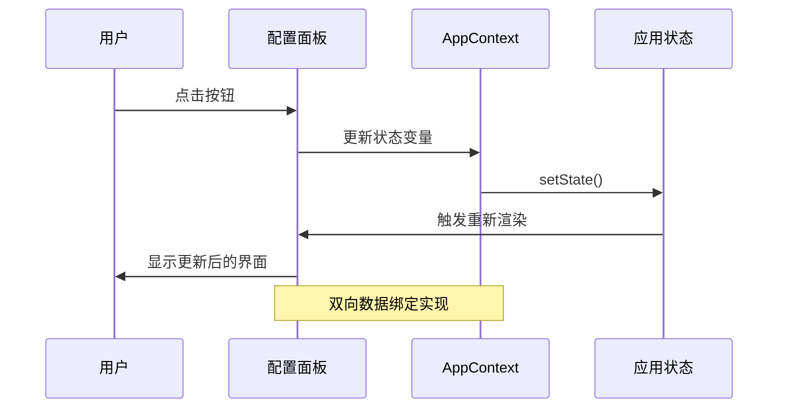

**图表来源**
- [ConfigPanel.tsx:6-16](file://src/app/components/ConfigPanel.tsx#L6-L16)
- [AppContext.tsx:31-63](file://src/app/store/AppContext.tsx#L31-L63)

#### 使用场景

- **开发调试**：快速切换业务参数进行功能测试
- **演示展示**：向客户展示不同业务场景的效果
- **培训教学**：帮助新员工理解业务逻辑

**章节来源**
- [ConfigPanel.tsx:1-134](file://src/app/components/ConfigPanel.tsx#L1-L134)
- [AppContext.tsx:1-64](file://src/app/store/AppContext.tsx#L1-L64)

### 许可证确认对话框 (LicenseConfirmDialog)

这是一个重要的合规性组件，用于确认用户的营业执照信息准确性。

#### 组件架构

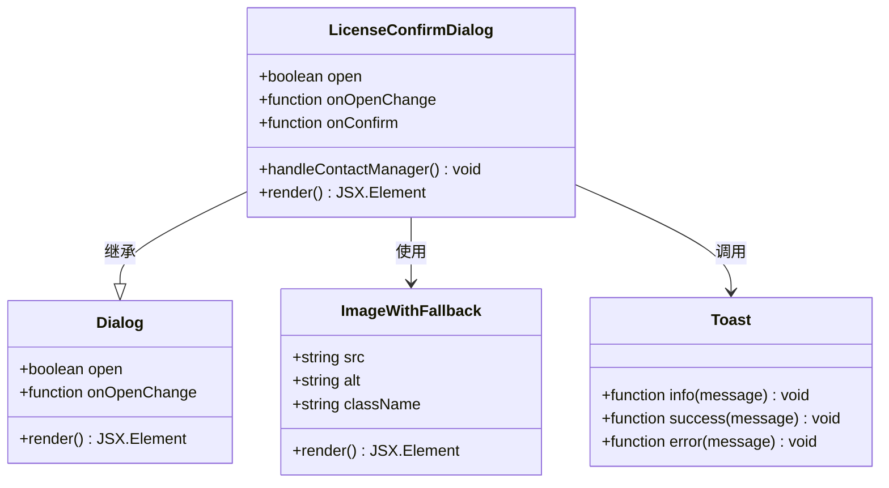

**图表来源**
- [LicenseConfirmDialog.tsx:8-12](file://src/app/components/LicenseConfirmDialog.tsx#L8-L12)
- [Dialog.tsx:9-13](file://src/app/components/ui/Dialog.tsx#L9-L13)

#### 功能特性

| 功能 | 实现细节 |
|------|----------|
| **信息展示** | 展示营业执照图片和关键信息字段 |
| **状态指示** | 提供信息准确性的视觉反馈 |
| **异常处理** | 支持联系客户经理处理错误信息 |
| **操作确认** | 提供确认和取消两种操作路径 |

#### 业务流程集成

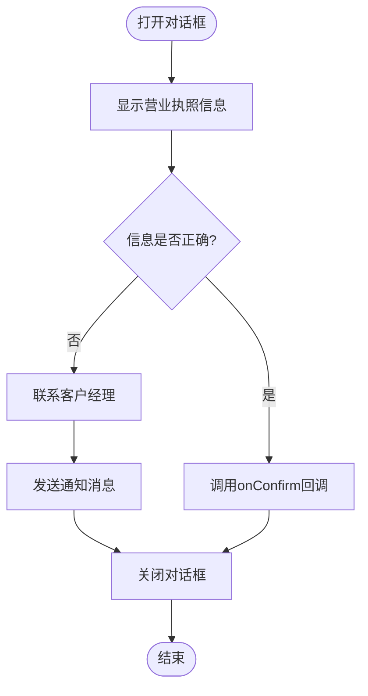

**图表来源**
- [LicenseConfirmDialog.tsx:14-109](file://src/app/components/LicenseConfirmDialog.tsx#L14-L109)

**章节来源**
- [LicenseConfirmDialog.tsx:1-109](file://src/app/components/LicenseConfirmDialog.tsx#L1-L109)
- [Dialog.tsx:1-136](file://src/app/components/ui/Dialog.tsx#L1-L136)

### 流程记录 (ProcessRecord)

流程记录组件提供了业务流程状态的可视化展示，支持多种状态的差异化显示。

#### 状态管理

组件支持四种主要业务状态：

| 状态 | 用途 | 视觉标识 |
|------|------|----------|
| **rejected_to_client** | 退回给客户 | 橙色图标和退回原因 |
| **processing** | 审核中 | 蓝色脉冲动画 |
| **success** | 已完成 | 绿色完成标记 |
| **failed** | 审核不通过 | 红色不通过标记 |

#### 数据绑定模式

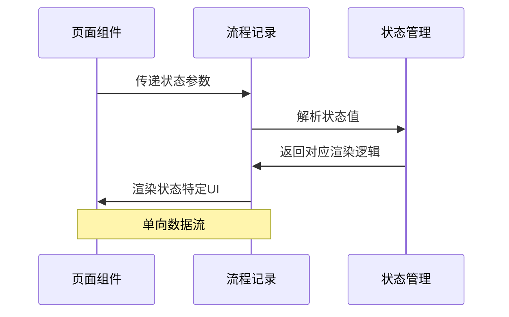

**图表来源**
- [ProcessRecord.tsx:4-12](file://src/app/components/ProcessRecord.tsx#L4-L12)

#### 渲染策略

组件采用条件渲染策略，根据传入的状态值动态选择对应的UI模板：

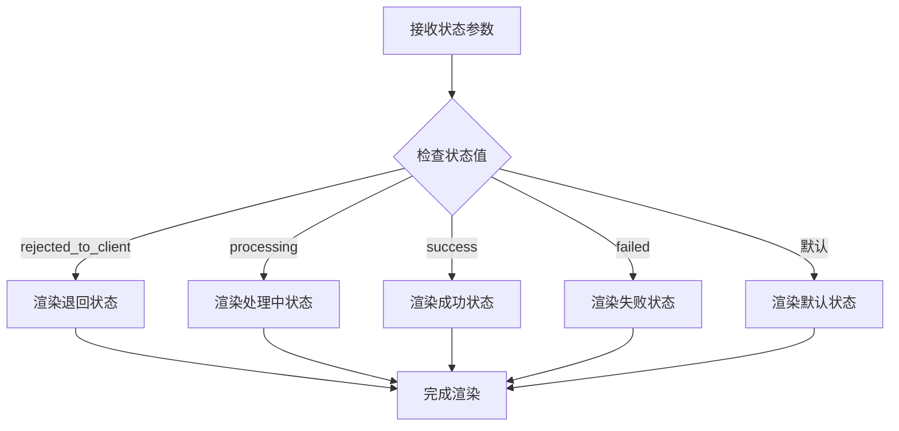

**图表来源**
- [ProcessRecord.tsx:24-129](file://src/app/components/ProcessRecord.tsx#L24-L129)

**章节来源**
- [ProcessRecord.tsx:1-135](file://src/app/components/ProcessRecord.tsx#L1-L135)

### 仓库配置面板 (WarehouseConfigPanel)

这是项目中最复杂的业务组件，专为期货移仓业务设计，提供场景化的配置填充功能。

#### 核心功能

| 功能 | 描述 |
|------|------|
| **场景化填充** | 支持6种不同的移仓场景一键填充 |
| **权限控制** | 实控组账号权限的动态管理 |
| **交互式操作** | 提供便捷的账号填入按钮 |
| **状态可视化** | 通过颜色和样式显示权限状态 |

#### 场景定义

组件内置了6个标准移仓场景：

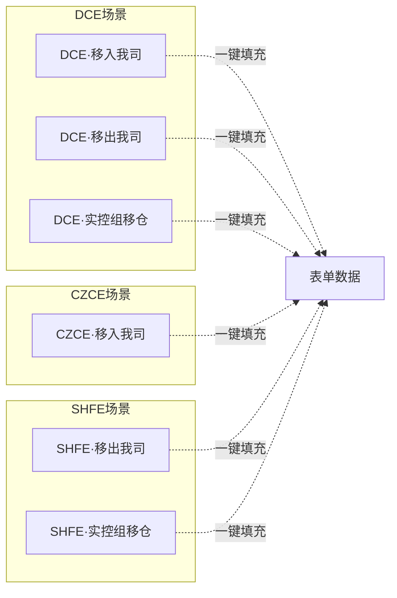

**图表来源**
- [WarehouseConfigPanel.tsx:18-112](file://src/app/components/WarehouseConfigPanel.tsx#L18-L112)

#### 权限管理系统

组件集成了完善的权限控制系统：

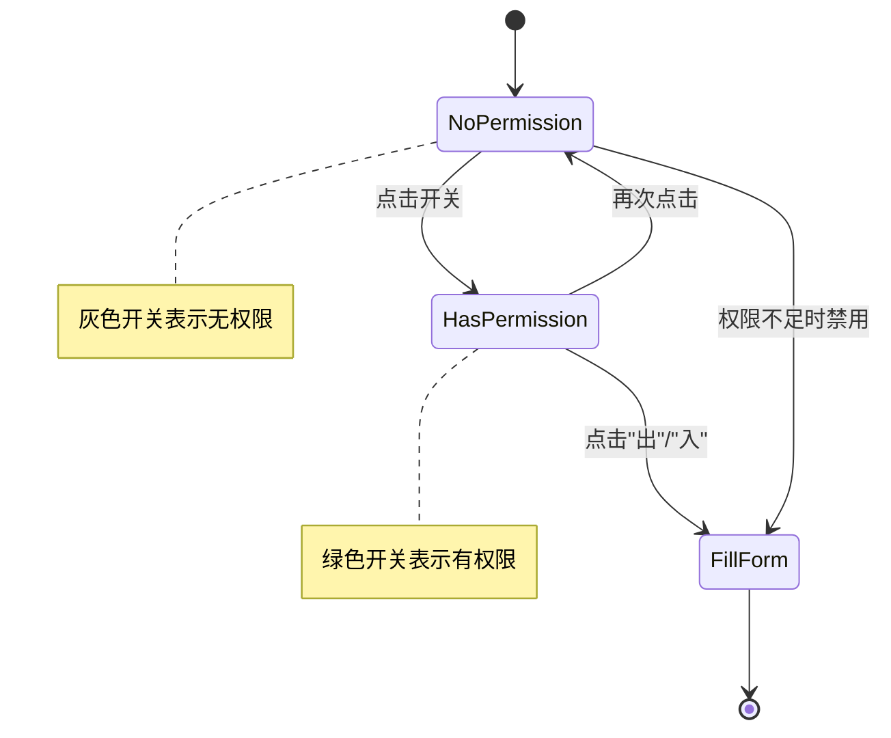

**图表来源**
- [WarehouseConfigPanel.tsx:149-158](file://src/app/components/WarehouseConfigPanel.tsx#L149-L158)

#### 实际应用场景

1. **批量测试**：开发阶段快速填充不同场景的数据
2. **业务演示**：向客户展示各种移仓场景的处理方式
3. **培训工具**：帮助新员工熟悉不同业务场景的操作流程

**章节来源**
- [WarehouseConfigPanel.tsx:1-204](file://src/app/components/WarehouseConfigPanel.tsx#L1-L204)
- [WarehouseContext.tsx:1-185](file://src/app/store/WarehouseContext.tsx#L1-L185)

### 状态管理上下文

项目采用Context API实现跨组件的状态共享，主要包含两个核心上下文：

#### 应用上下文 (AppContext)

负责交易权限申请相关的全局状态管理：

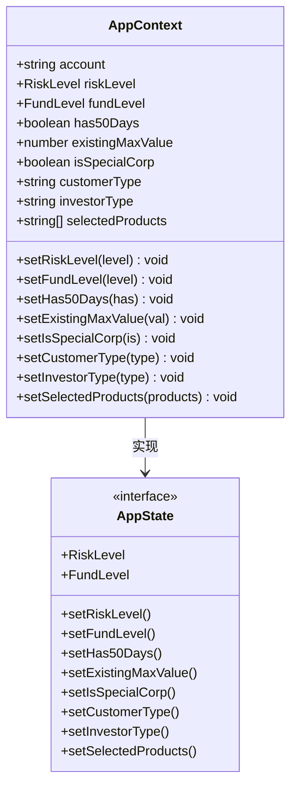

**图表来源**
- [AppContext.tsx:6-27](file://src/app/store/AppContext.tsx#L6-L27)

#### 仓库上下文 (WarehouseContext)

专门管理期货移仓业务的状态：

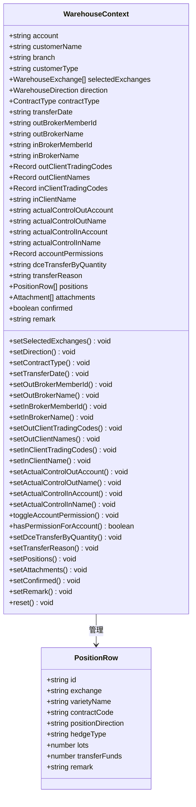

**图表来源**
- [WarehouseContext.tsx:19-73](file://src/app/store/WarehouseContext.tsx#L19-L73)

**章节来源**
- [AppContext.tsx:1-64](file://src/app/store/AppContext.tsx#L1-L64)
- [WarehouseContext.tsx:1-185](file://src/app/store/WarehouseContext.tsx#L1-L185)

## 依赖关系分析

项目组件间的依赖关系体现了清晰的分层架构：

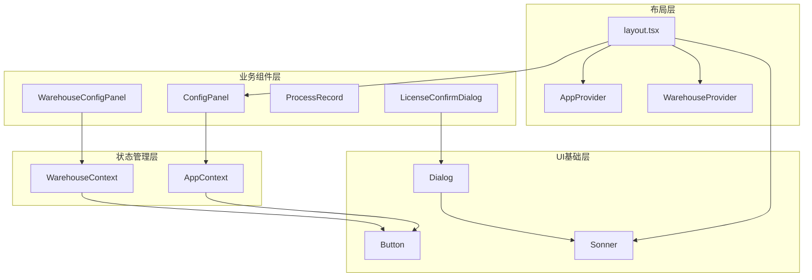

**图表来源**
- [layout.tsx:4-7](file://src/app/layout.tsx#L4-L7)
- [ConfigPanel.tsx:2](file://src/app/components/ConfigPanel.tsx#L2)
- [WarehouseConfigPanel.tsx:2](file://src/app/components/WarehouseConfigPanel.tsx#L2)

### 组件耦合度分析

| 组件 | 内聚性 | 耦合度 | 设计质量 |
|------|--------|--------|----------|
| ConfigPanel | 高 | 低 | 优秀 |
| LicenseConfirmDialog | 中 | 中 | 良好 |
| ProcessRecord | 高 | 低 | 优秀 |
| WarehouseConfigPanel | 中 | 高 | 良好 |
| AppContext | 高 | 低 | 优秀 |
| WarehouseContext | 高 | 中 | 良好 |

**章节来源**
- [layout.tsx:81-172](file://src/app/layout.tsx#L81-L172)

## 性能考虑

### 渲染优化

1. **条件渲染**：所有面板组件都实现了条件渲染，避免不必要的DOM节点创建
2. **状态分离**：不同业务领域的状态分离存储，减少无关状态变更引起的重渲染
3. **懒加载**：对话框组件采用延迟加载策略，只在需要时渲染

### 内存管理

1. **上下文清理**：提供reset方法重置复杂表单状态
2. **事件监听器**：组件卸载时自动清理事件监听器
3. **资源释放**：对话框关闭时自动释放相关资源

### 用户体验优化

1. **动画效果**：使用CSS过渡动画提升交互流畅度
2. **响应式设计**：适配不同屏幕尺寸的设备
3. **无障碍访问**：遵循WCAG标准，支持键盘导航

## 故障排除指南

### 常见问题及解决方案

#### 1. 对话框无法关闭

**症状**：许可证确认对话框无法正常关闭
**原因**：onOpenChange回调未正确传递
**解决方案**：
- 检查父组件是否正确传递onOpenChange属性
- 确认回调函数的参数类型匹配

#### 2. 状态更新不生效

**症状**：配置面板更改后业务逻辑无变化
**原因**：状态管理上下文未正确初始化
**解决方案**：
- 确认AppProvider和WarehouseProvider已在应用根部正确包裹
- 检查useAppContext/useWarehouseContext钩子的使用位置

#### 3. 权限控制失效

**症状**：实控组账号权限切换无效
**原因**：权限状态未正确同步到表单
**解决方案**：
- 检查toggleAccountPermission方法的调用
- 确认hasPermissionForAccount方法的返回值

**章节来源**
- [WarehouseConfigPanel.tsx:149-158](file://src/app/components/WarehouseConfigPanel.tsx#L149-L158)
- [AppContext.tsx:59-63](file://src/app/store/AppContext.tsx#L59-L63)
- [WarehouseContext.tsx:180-184](file://src/app/store/WarehouseContext.tsx#L180-L184)

## 结论

本项目通过精心设计的业务组件体系，成功实现了复杂金融业务场景的数字化管理。四个核心组件各司其职，既保持了良好的独立性，又通过上下文管理实现了有效的协作。

### 主要优势

1. **模块化设计**：每个组件职责明确，便于维护和扩展
2. **状态管理**：采用现代React状态管理模式，确保数据一致性
3. **用户体验**：注重交互细节，提供流畅的使用体验
4. **业务适配**：深度适配金融业务特点，满足合规要求

### 技术亮点

- **场景化配置**：通过预设场景大幅提升业务效率
- **权限控制**：细粒度的权限管理确保业务安全
- **状态可视化**：直观的流程展示提升透明度
- **响应式设计**：适配多终端设备的使用需求

这些组件的设计理念和实现方式为类似业务系统的开发提供了优秀的参考范例，体现了现代前端工程化的最佳实践。