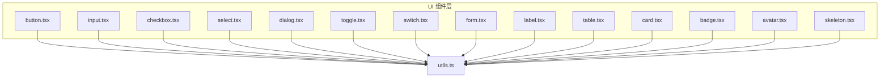
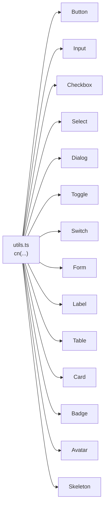
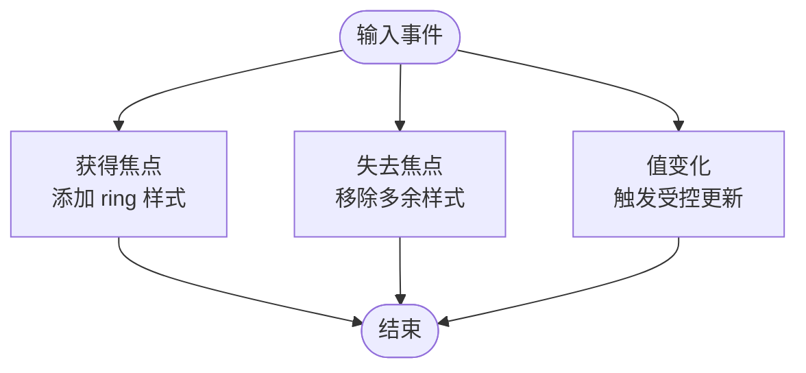
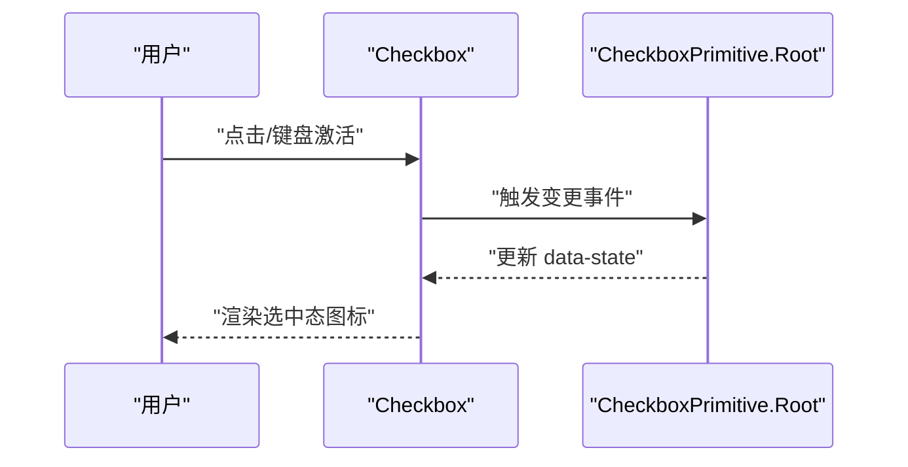
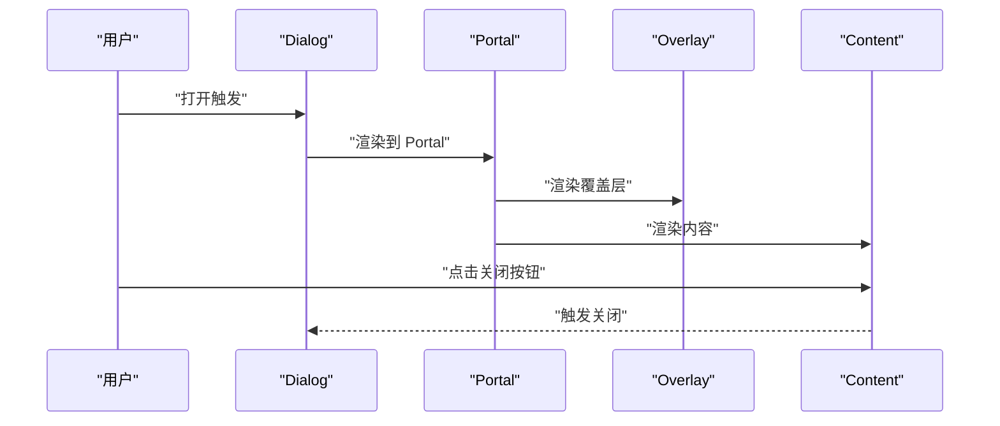
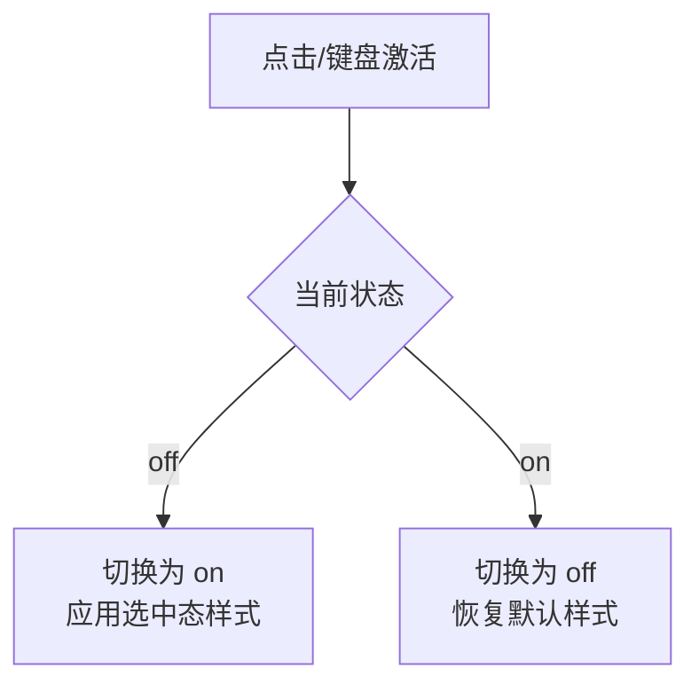
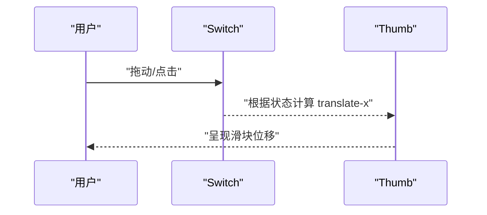
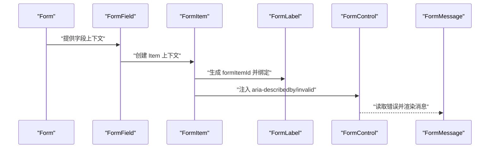
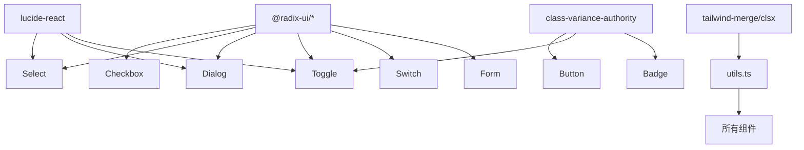

# 原子组件

<cite>
**本文引用的文件**
- [button.tsx](file://src/app/components/ui/button.tsx)
- [input.tsx](file://src/app/components/ui/input.tsx)
- [checkbox.tsx](file://src/app/components/ui/checkbox.tsx)
- [select.tsx](file://src/app/components/ui/select.tsx)
- [dialog.tsx](file://src/app/components/ui/dialog.tsx)
- [toggle.tsx](file://src/app/components/ui/toggle.tsx)
- [switch.tsx](file://src/app/components/ui/switch.tsx)
- [form.tsx](file://src/app/components/ui/form.tsx)
- [label.tsx](file://src/app/components/ui/label.tsx)
- [table.tsx](file://src/app/components/ui/table.tsx)
- [card.tsx](file://src/app/components/ui/card.tsx)
- [badge.tsx](file://src/app/components/ui/badge.tsx)
- [avatar.tsx](file://src/app/components/ui/avatar.tsx)
- [skeleton.tsx](file://src/app/components/ui/skeleton.tsx)
- [utils.ts](file://src/app/components/ui/utils.ts)
</cite>

## 目录
1. [简介](#简介)
2. [项目结构](#项目结构)
3. [核心组件](#核心组件)
4. [架构总览](#架构总览)
5. [详细组件分析](#详细组件分析)
6. [依赖关系分析](#依赖关系分析)
7. [性能考量](#性能考量)
8. [故障排查指南](#故障排查指南)
9. [结论](#结论)
10. [附录](#附录)

## 简介
本文件系统性介绍基于 Radix UI 的原子组件设计与实现，覆盖按钮、输入框、复选框、选择器、对话框、切换开关、表单体系、标签、表格、卡片、徽章、头像、骨架屏等核心 UI 组件。内容包括：功能特性、属性配置、事件处理、样式定制、无障碍支持、响应式与跨浏览器兼容性、组件组合模式与主题定制建议，并通过图示展示代码级架构与数据流。

## 项目结构
- 组件统一位于 src/app/components/ui 下，采用“按功能分文件”的组织方式，便于按需引入与主题化扩展。
- 所有组件共享一个轻量工具函数模块，负责类名合并与变体样式生成。
- 大多数交互型组件均以 Radix UI 原子能力为基础进行封装，确保可访问性与行为一致性。



图表来源
- [button.tsx:1-59](file://src/app/components/ui/button.tsx#L1-L59)
- [input.tsx:1-22](file://src/app/components/ui/input.tsx#L1-L22)
- [checkbox.tsx:1-33](file://src/app/components/ui/checkbox.tsx#L1-L33)
- [select.tsx:1-190](file://src/app/components/ui/select.tsx#L1-L190)
- [dialog.tsx:1-136](file://src/app/components/ui/dialog.tsx#L1-L136)
- [toggle.tsx:1-48](file://src/app/components/ui/toggle.tsx#L1-L48)
- [switch.tsx:1-32](file://src/app/components/ui/switch.tsx#L1-L32)
- [form.tsx:1-169](file://src/app/components/ui/form.tsx#L1-L169)
- [label.tsx:1-25](file://src/app/components/ui/label.tsx#L1-L25)
- [table.tsx:1-117](file://src/app/components/ui/table.tsx#L1-L117)
- [card.tsx:1-93](file://src/app/components/ui/card.tsx#L1-L93)
- [badge.tsx:1-47](file://src/app/components/ui/badge.tsx#L1-L47)
- [avatar.tsx:1-54](file://src/app/components/ui/avatar.tsx#L1-L54)
- [skeleton.tsx:1-14](file://src/app/components/ui/skeleton.tsx#L1-L14)
- [utils.ts:1-7](file://src/app/components/ui/utils.ts#L1-L7)

章节来源
- [button.tsx:1-59](file://src/app/components/ui/button.tsx#L1-L59)
- [utils.ts:1-7](file://src/app/components/ui/utils.ts#L1-L7)

## 核心组件
- 按钮 Button：支持多种变体与尺寸，具备 asChild 插槽能力，聚焦态与禁用态视觉反馈完善。
- 输入框 Input：统一边框、占位符、选中态与聚焦环样式，支持 aria-invalid 状态联动。
- 复选框 Checkbox：基于 Radix UI，内置指示图标，状态切换时具备视觉反馈。
- 选择器 Select：多子组件组合（触发器、内容、项、滚动按钮等），支持 popper 定位与尺寸控制。
- 对话框 Dialog：包含根容器、触发器、覆盖层、内容、标题与描述等，支持 Portal 渲染。
- 切换 Toggle：支持变体与尺寸，配合 Radix Toggle 行为，适配工具栏场景。
- 开关 Switch：自定义拇指动画与状态色值，满足现代开关交互。
- 表单 Form：集成 react-hook-form，提供字段上下文、标签、控件、描述与错误信息。
- 标签 Label：与表单控件绑定，支持禁用态与错误态样式。
- 表格 Table：容器 + 表头/体/脚 + 行/单元格/标题/说明，支持复选框列对齐。
- 卡片 Card：卡片容器与头部/内容/底部布局，支持操作区与栅格化头部。
- 徽章 Badge：语义化状态徽标，支持 asChild 与变体。
- 头像 Avatar：头像容器、图片与回退占位。
- 骨架屏 Skeleton：统一的占位动画样式。

章节来源
- [button.tsx:1-59](file://src/app/components/ui/button.tsx#L1-L59)
- [input.tsx:1-22](file://src/app/components/ui/input.tsx#L1-L22)
- [checkbox.tsx:1-33](file://src/app/components/ui/checkbox.tsx#L1-L33)
- [select.tsx:1-190](file://src/app/components/ui/select.tsx#L1-L190)
- [dialog.tsx:1-136](file://src/app/components/ui/dialog.tsx#L1-L136)
- [toggle.tsx:1-48](file://src/app/components/ui/toggle.tsx#L1-L48)
- [switch.tsx:1-32](file://src/app/components/ui/switch.tsx#L1-L32)
- [form.tsx:1-169](file://src/app/components/ui/form.tsx#L1-L169)
- [label.tsx:1-25](file://src/app/components/ui/label.tsx#L1-L25)
- [table.tsx:1-117](file://src/app/components/ui/table.tsx#L1-L117)
- [card.tsx:1-93](file://src/app/components/ui/card.tsx#L1-L93)
- [badge.tsx:1-47](file://src/app/components/ui/badge.tsx#L1-L47)
- [avatar.tsx:1-54](file://src/app/components/ui/avatar.tsx#L1-L54)
- [skeleton.tsx:1-14](file://src/app/components/ui/skeleton.tsx#L1-L14)

## 架构总览
- 设计原则
  - 变体与尺寸通过 class-variance-authority 统一管理，保证样式一致性与可维护性。
  - 使用 Radix UI 原子组件作为行为基座，确保键盘导航、焦点管理与无障碍属性。
  - 通过 Slot 容器实现 asChild 能力，提升组合灵活性。
  - 共享 cn 工具函数负责类名合并与冲突修复，避免 Tailwind 冲突。
- 通用样式策略
  - 统一聚焦环与无效态样式，结合 aria-invalid 与 data-state 属性驱动视觉反馈。
  - 支持深色模式与浅色模式下的对比度与透明度调整。
  - 尺寸与间距遵循语义化命名，如 size-4、h-9、px-3 等。



图表来源
- [utils.ts:1-7](file://src/app/components/ui/utils.ts#L1-L7)
- [button.tsx:1-59](file://src/app/components/ui/button.tsx#L1-L59)
- [input.tsx:1-22](file://src/app/components/ui/input.tsx#L1-L22)
- [checkbox.tsx:1-33](file://src/app/components/ui/checkbox.tsx#L1-L33)
- [select.tsx:1-190](file://src/app/components/ui/select.tsx#L1-L190)
- [dialog.tsx:1-136](file://src/app/components/ui/dialog.tsx#L1-L136)
- [toggle.tsx:1-48](file://src/app/components/ui/toggle.tsx#L1-L48)
- [switch.tsx:1-32](file://src/app/components/ui/switch.tsx#L1-L32)
- [form.tsx:1-169](file://src/app/components/ui/form.tsx#L1-L169)
- [label.tsx:1-25](file://src/app/components/ui/label.tsx#L1-L25)
- [table.tsx:1-117](file://src/app/components/ui/table.tsx#L1-L117)
- [card.tsx:1-93](file://src/app/components/ui/card.tsx#L1-L93)
- [badge.tsx:1-47](file://src/app/components/ui/badge.tsx#L1-L47)
- [avatar.tsx:1-54](file://src/app/components/ui/avatar.tsx#L1-L54)
- [skeleton.tsx:1-14](file://src/app/components/ui/skeleton.tsx#L1-L14)

## 详细组件分析

### 按钮 Button
- 功能特性
  - 支持默认、破坏性、描边、次级、幽灵、链接六种变体；默认、小、大、图标四种尺寸。
  - 支持 asChild，可将渲染节点替换为任意元素或组件。
  - 统一聚焦环与无效态样式，自动继承父级 outline 与 ring 配置。
- 关键属性
  - className：追加自定义样式
  - variant：变体枚举
  - size：尺寸枚举
  - asChild：是否透传为子节点容器
- 事件处理
  - 透传原生 button 属性与事件（onClick、onKeyDown 等）
- 样式定制
  - 通过变体与尺寸映射，结合 cn 合并外部类名
  - 支持在父级容器上设置 ring 与颜色变量以影响聚焦态
- 无障碍与响应式
  - 自动启用焦点可见轮廓与键盘交互
  - 响应式断点下保持一致的尺寸与内边距

```mermaid
classDiagram
class Button {
+props : "React.ComponentProps<'button'> & VariantProps & { asChild? : boolean }"
+render() : "JSX.Element"
}
class Variants {
+variant : "default|destructive|outline|secondary|ghost|link"
+size : "default|sm|lg|icon"
}
Button --> Variants : "使用"
```

图表来源
- [button.tsx:37-56](file://src/app/components/ui/button.tsx#L37-L56)

章节来源
- [button.tsx:1-59](file://src/app/components/ui/button.tsx#L1-L59)

### 输入框 Input
- 功能特性
  - 统一边框、背景、占位符与选中态样式
  - 聚焦时显示 ring 环，无效态联动 destructive 颜色
- 关键属性
  - className：追加自定义样式
  - type：原生 input 类型
- 事件处理
  - 透传原生 input 事件（onChange、onFocus、onBlur 等）
- 样式定制
  - 通过 cn 合并外部类名，支持在父级设置颜色与 ring 变量
- 无障碍与响应式
  - 支持 aria-invalid，自动与表单体系联动
  - 在 md 断点下调整字体大小



图表来源
- [input.tsx:5-19](file://src/app/components/ui/input.tsx#L5-L19)

章节来源
- [input.tsx:1-22](file://src/app/components/ui/input.tsx#L1-L22)

### 复选框 Checkbox
- 功能特性
  - 基于 Radix UI Checkbox，内置勾选图标
  - 状态切换时自动应用变体颜色与轮廓
- 关键属性
  - className：追加自定义样式
- 事件处理
  - 透传原生 change 与键盘事件
- 样式定制
  - 通过 data-state 控制选中态外观
- 无障碍与响应式
  - 自动与屏幕阅读器同步状态
  - 响应式尺寸与阴影



图表来源
- [checkbox.tsx:9-30](file://src/app/components/ui/checkbox.tsx#L9-L30)

章节来源
- [checkbox.tsx:1-33](file://src/app/components/ui/checkbox.tsx#L1-L33)

### 选择器 Select
- 功能特性
  - 提供 Root、Trigger、Content、Item、Label、Separator、ScrollUp/DownButton 等子组件
  - 支持 popper 定位与尺寸控制，滚动条按钮增强可访问性
- 关键属性
  - Trigger.size：sm/default
  - Content.position：popper 或 直接定位
- 事件处理
  - 通过 Radix UI 事件模型管理打开/关闭与选中项
- 样式定制
  - 视觉反馈与动画由 Radix 数据属性驱动
- 无障碍与响应式
  - 支持键盘导航、滚动与无障碍标签

```mermaid
classDiagram
class Select {
+Root(props)
+Trigger(props & { size })
+Content(props & { position })
+Item(props)
+Label(props)
+Separator(props)
+ScrollUpButton(props)
+ScrollDownButton(props)
}
```

图表来源
- [select.tsx:13-189](file://src/app/components/ui/select.tsx#L13-L189)

章节来源
- [select.tsx:1-190](file://src/app/components/ui/select.tsx#L1-L190)

### 对话框 Dialog
- 功能特性
  - Root、Trigger、Portal、Overlay、Content、Header/Footer、Title/Description 等
  - 支持关闭按钮与 sr-only 文本，确保可访问性
- 关键属性
  - Content：接收 children 与 className
- 事件处理
  - 通过 Close 触发关闭，Overlay/Portal 管理层级与挂载
- 样式定制
  - 基于 data-state 的开合动画与居中定位
- 无障碍与响应式
  - 自动管理焦点陷阱与键盘关闭（Escape）



图表来源
- [dialog.tsx:9-73](file://src/app/components/ui/dialog.tsx#L9-L73)

章节来源
- [dialog.tsx:1-136](file://src/app/components/ui/dialog.tsx#L1-L136)

### 切换 Toggle
- 功能特性
  - 支持默认与描边两种变体，三种尺寸
  - 与 Radix Toggle 行为一致，支持键盘激活
- 关键属性
  - variant、size：变体与尺寸
- 事件处理
  - 透传原生事件，支持受控/非受控
- 样式定制
  - 通过 data-state=on 控制选中态样式



图表来源
- [toggle.tsx:31-45](file://src/app/components/ui/toggle.tsx#L31-L45)

章节来源
- [toggle.tsx:1-48](file://src/app/components/ui/toggle.tsx#L1-L48)

### 开关 Switch
- 功能特性
  - 自定义拇指动画与状态色值，支持深色模式
- 关键属性
  - className：追加自定义样式
- 事件处理
  - 透传原生 change 事件
- 样式定制
  - 通过 data-state 控制滑块位置与颜色



图表来源
- [switch.tsx:8-29](file://src/app/components/ui/switch.tsx#L8-L29)

章节来源
- [switch.tsx:1-32](file://src/app/components/ui/switch.tsx#L1-L32)

### 表单 Form 体系
- 功能特性
  - Form、FormField、FormItem、FormLabel、FormControl、FormDescription、FormMessage
  - 与 react-hook-form 集成，自动管理 aria-* 属性与错误提示
- 关键属性
  - FormField：ControllerProps，提供 name 上下文
  - FormLabel：绑定 htmlFor 与 data-error
  - FormControl：注入 aria-describedby 与 aria-invalid
- 事件处理
  - 通过 useFormContext 获取字段状态与错误
- 样式定制
  - 错误态通过 data-error 与文本颜色变量控制



图表来源
- [form.tsx:19-168](file://src/app/components/ui/form.tsx#L19-L168)

章节来源
- [form.tsx:1-169](file://src/app/components/ui/form.tsx#L1-L169)

### 标签 Label
- 功能特性
  - 与表单控件绑定，支持禁用态与错误态
- 关键属性
  - className：追加自定义样式
- 无障碍与响应式
  - 自动与控件 ID 绑定，支持禁用态样式

章节来源
- [label.tsx:1-25](file://src/app/components/ui/label.tsx#L1-L25)

### 表格 Table
- 功能特性
  - 容器 + 表头/体/脚 + 行/单元格/标题/说明，支持复选框列对齐
- 关键属性
  - className：追加自定义样式
- 无障碍与响应式
  - 容器提供横向滚动，适配窄屏

章节来源
- [table.tsx:1-117](file://src/app/components/ui/table.tsx#L1-L117)

### 卡片 Card
- 功能特性
  - 卡片容器与头部/内容/底部布局，支持操作区与栅格化头部
- 关键属性
  - className：追加自定义样式
- 无障碍与响应式
  - 内容区提供 hover 与选中态过渡

章节来源
- [card.tsx:1-93](file://src/app/components/ui/card.tsx#L1-L93)

### 徽章 Badge
- 功能特性
  - 语义化状态徽标，支持 asChild 与变体
- 关键属性
  - variant：default/secondary/destructive/outline
  - asChild：是否渲染为子节点容器
- 无障碍与响应式
  - 支持聚焦态与无效态样式

章节来源
- [badge.tsx:1-47](file://src/app/components/ui/badge.tsx#L1-L47)

### 头像 Avatar
- 功能特性
  - 容器、图片与回退占位，支持占位图标
- 关键属性
  - className：追加自定义样式
- 无障碍与响应式
  - 回退占位提供可识别的默认外观

章节来源
- [avatar.tsx:1-54](file://src/app/components/ui/avatar.tsx#L1-L54)

### 骨架屏 Skeleton
- 功能特性
  - 统一的占位动画样式
- 关键属性
  - className：追加自定义样式

章节来源
- [skeleton.tsx:1-14](file://src/app/components/ui/skeleton.tsx#L1-L14)

## 依赖关系分析
- 组件间耦合
  - 所有组件仅依赖 utils.ts 的 cn 函数，耦合度低，便于独立演进
  - 表单体系与 react-hook-form 强耦合，但对外暴露清晰的上下文 API
- 外部依赖
  - @radix-ui/react-*：提供可访问性与状态管理
  - lucide-react：提供图标
  - class-variance-authority：提供变体与尺寸映射
  - tailwind-merge/clsx：类名合并与冲突修复



图表来源
- [checkbox.tsx:1-33](file://src/app/components/ui/checkbox.tsx#L1-L33)
- [select.tsx:1-190](file://src/app/components/ui/select.tsx#L1-L190)
- [dialog.tsx:1-136](file://src/app/components/ui/dialog.tsx#L1-L136)
- [toggle.tsx:1-48](file://src/app/components/ui/toggle.tsx#L1-L48)
- [switch.tsx:1-32](file://src/app/components/ui/switch.tsx#L1-L32)
- [form.tsx:1-169](file://src/app/components/ui/form.tsx#L1-L169)
- [button.tsx:1-59](file://src/app/components/ui/button.tsx#L1-L59)
- [badge.tsx:1-47](file://src/app/components/ui/badge.tsx#L1-L47)
- [utils.ts:1-7](file://src/app/components/ui/utils.ts#L1-L7)

章节来源
- [utils.ts:1-7](file://src/app/components/ui/utils.ts#L1-L7)

## 性能考量
- 渲染优化
  - 使用 asChild 与 Slot 减少额外 DOM 包装，降低渲染成本
  - 变体样式集中管理，避免重复计算
- 交互优化
  - 通过 data-state 与 CSS 动画实现流畅过渡，减少 JS 计算
- 可访问性与体验
  - 优先使用原生语义标签与 Radix 行为，减少自定义复杂度
  - 统一聚焦环与无效态，降低用户认知负担

## 故障排查指南
- 焦点与键盘问题
  - 若发现无法通过键盘激活，检查是否正确包裹 Radix 原子组件并传递必要的事件属性
- 样式冲突
  - 若出现样式错乱，确认未直接覆盖 cn 合并后的类名；必要时使用更具体的选择器或在父级容器上设置主题变量
- 无效态不生效
  - 确认父级容器已设置 aria-invalid 或相关状态变量
- 表单联动异常
  - 检查 FormField 是否在 FormProvider 内部使用，且 name 与控件一致

章节来源
- [form.tsx:45-66](file://src/app/components/ui/form.tsx#L45-L66)
- [input.tsx:5-19](file://src/app/components/ui/input.tsx#L5-L19)
- [button.tsx:7-35](file://src/app/components/ui/button.tsx#L7-L35)

## 结论
该组件库以 Radix UI 为核心，结合 class-variance-authority 与 Tailwind 实现高内聚、低耦合的原子组件体系。通过统一的样式策略与无障碍设计，组件在功能、可访问性与可维护性之间取得良好平衡。建议在实际项目中遵循 asChild 与变体约定，配合主题变量与断点策略，快速构建一致性的界面。

## 附录
- 主题定制建议
  - 通过修改 Tailwind 主题中的颜色变量（如 primary、destructive、muted 等）影响组件默认配色
  - 使用 data-slot 属性与父级容器样式覆盖实现局部定制
- 组合模式
  - 表单场景：Form + FormField + FormLabel + FormControl + FormMessage
  - 列表场景：Table + TableRow + TableCell + Checkbox
  - 弹窗场景：Dialog + DialogTrigger + DialogContent + DialogHeader + DialogFooter