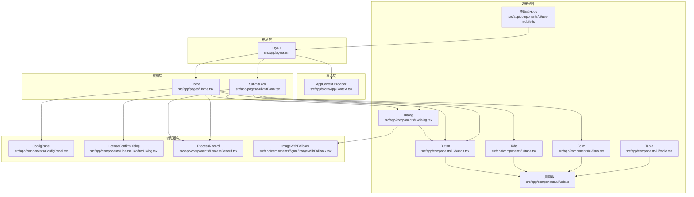
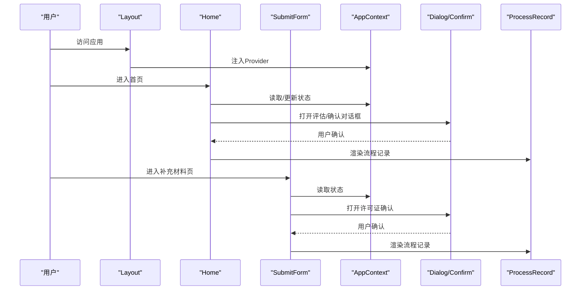
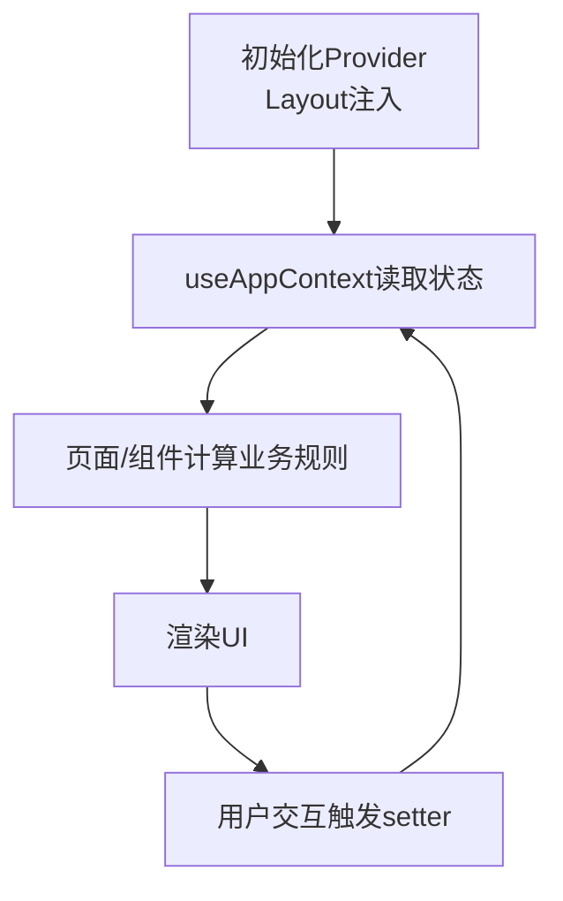
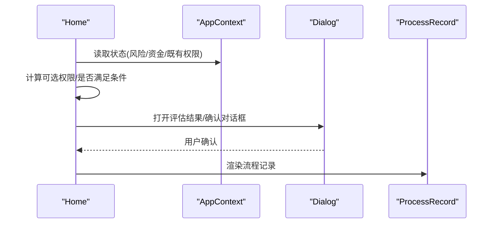
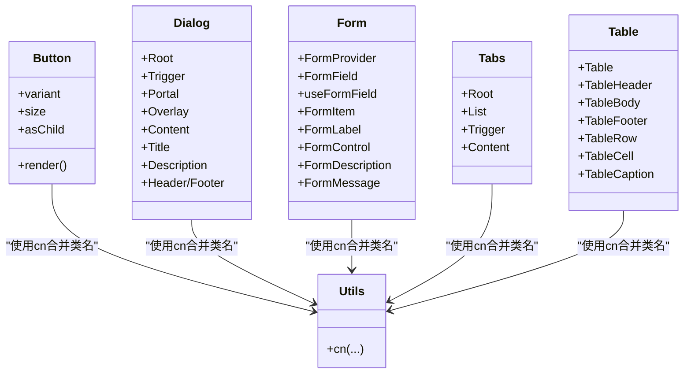
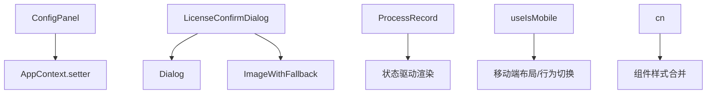
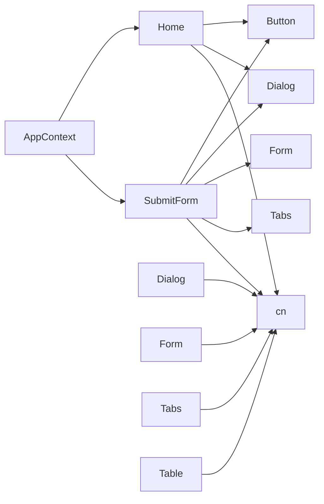

# 组件组合模式

<cite>
**本文引用的文件**
- [layout.tsx](file://src/app/layout.tsx)
- [AppContext.tsx](file://src/app/store/AppContext.tsx)
- [Home.tsx](file://src/app/pages/Home.tsx)
- [SubmitForm.tsx](file://src/app/pages/SubmitForm.tsx)
- [ConfigPanel.tsx](file://src/app/components/ConfigPanel.tsx)
- [LicenseConfirmDialog.tsx](file://src/app/components/LicenseConfirmDialog.tsx)
- [ProcessRecord.tsx](file://src/app/components/ProcessRecord.tsx)
- [button.tsx](file://src/app/components/ui/button.tsx)
- [dialog.tsx](file://src/app/components/ui/dialog.tsx)
- [form.tsx](file://src/app/components/ui/form.tsx)
- [tabs.tsx](file://src/app/components/ui/tabs.tsx)
- [table.tsx](file://src/app/components/ui/table.tsx)
- [use-mobile.ts](file://src/app/components/ui/use-mobile.ts)
- [utils.ts](file://src/app/components/ui/utils.ts)
- [ImageWithFallback.tsx](file://src/app/components/figma/ImageWithFallback.tsx)
</cite>

## 目录
1. [引言](#引言)
2. [项目结构](#项目结构)
3. [核心组件](#核心组件)
4. [架构总览](#架构总览)
5. [详细组件分析](#详细组件分析)
6. [依赖关系分析](#依赖关系分析)
7. [性能考量](#性能考量)
8. [故障排查指南](#故障排查指南)
9. [结论](#结论)
10. [附录](#附录)

## 引言
本文件系统化阐述本项目中UI组件的组合模式与设计原则，重点解析组件间的协作机制、状态共享与数据流向；同时说明工具函数、移动端适配Hook与图片回退组件等辅助组件的作用与使用方法，并总结组件组合的最佳实践、性能优化技巧与可复用性设计，最后给出继承、扩展与定制化的实现方案。

## 项目结构
项目采用按功能域划分的目录组织方式，核心UI组件集中在 src/app/components/ui 下，页面组件位于 src/app/pages，全局状态通过上下文提供器集中管理，布局层负责导航、面包屑与全局弹层容器。

图表来源
- [layout.tsx:74-174](file://src/app/layout.tsx#L74-L174)
- [AppContext.tsx:31-57](file://src/app/store/AppContext.tsx#L31-L57)
- [Home.tsx:1-800](file://src/app/pages/Home.tsx#L1-L800)
- [SubmitForm.tsx:1-747](file://src/app/pages/SubmitForm.tsx#L1-L747)
- [ConfigPanel.tsx:6-133](file://src/app/components/ConfigPanel.tsx#L6-L133)
- [LicenseConfirmDialog.tsx:14-108](file://src/app/components/LicenseConfirmDialog.tsx#L14-L108)
- [ProcessRecord.tsx:4-134](file://src/app/components/ProcessRecord.tsx#L4-L134)
- [button.tsx:1-59](file://src/app/components/ui/button.tsx#L1-L59)
- [dialog.tsx:1-136](file://src/app/components/ui/dialog.tsx#L1-L136)
- [form.tsx:1-169](file://src/app/components/ui/form.tsx#L1-L169)
- [tabs.tsx:1-67](file://src/app/components/ui/tabs.tsx#L1-L67)
- [table.tsx:1-117](file://src/app/components/ui/table.tsx#L1-L117)
- [use-mobile.ts:1-22](file://src/app/components/ui/use-mobile.ts#L1-L22)
- [utils.ts:1-7](file://src/app/components/ui/utils.ts#L1-L7)
- [ImageWithFallback.tsx:1-28](file://src/app/components/figma/ImageWithFallback.tsx#L1-L28)

章节来源
- [layout.tsx:74-174](file://src/app/layout.tsx#L74-L174)

## 核心组件
- 状态上下文：AppContext 提供全局业务状态与setter，贯穿页面与组件树，用于权限选择、客户类型、适当性等级等跨页面共享数据。
- 布局与导航：Layout 负责侧边栏、面包屑、顶部头像区与Outlet内容区，同时注入全局Provider与全局Toast容器。
- 页面组件：Home 负责权限选择与提交流程；SubmitForm 支持三种申请类型（首次、豁免、二次），并内置Tab切换与表单校验。
- 通用UI组件：Button、Dialog、Form、Tabs、Table等，均通过cn合并样式，遵循变体与尺寸约定，便于组合与复用。
- 辅助组件：ConfigPanel 提供状态模拟面板；LicenseConfirmDialog 作为确认对话框；ProcessRecord 展示流程记录；ImageWithFallback 提供图片加载失败兜底。
- 工具与Hook：cn 合并Tailwind类；useIsMobile 响应式断点判断；use-mobile.ts 与 utils.ts 为通用能力。

章节来源
- [AppContext.tsx:6-63](file://src/app/store/AppContext.tsx#L6-L63)
- [layout.tsx:74-174](file://src/app/layout.tsx#L74-L174)
- [Home.tsx:61-800](file://src/app/pages/Home.tsx#L61-L800)
- [SubmitForm.tsx:57-747](file://src/app/pages/SubmitForm.tsx#L57-L747)
- [button.tsx:7-59](file://src/app/components/ui/button.tsx#L7-L59)
- [dialog.tsx:9-135](file://src/app/components/ui/dialog.tsx#L9-L135)
- [form.tsx:19-168](file://src/app/components/ui/form.tsx#L19-L168)
- [tabs.tsx:8-66](file://src/app/components/ui/tabs.tsx#L8-L66)
- [table.tsx:7-116](file://src/app/components/ui/table.tsx#L7-L116)
- [ConfigPanel.tsx:6-133](file://src/app/components/ConfigPanel.tsx#L6-L133)
- [LicenseConfirmDialog.tsx:14-108](file://src/app/components/LicenseConfirmDialog.tsx#L14-L108)
- [ProcessRecord.tsx:4-134](file://src/app/components/ProcessRecord.tsx#L4-L134)
- [ImageWithFallback.tsx:6-27](file://src/app/components/figma/ImageWithFallback.tsx#L6-L27)
- [use-mobile.ts:5-21](file://src/app/components/ui/use-mobile.ts#L5-L21)
- [utils.ts:4-6](file://src/app/components/ui/utils.ts#L4-L6)

## 架构总览
整体采用“布局层注入Provider → 页面层消费状态 → 通用组件组合渲染 → 辅助组件增强体验”的分层架构。数据自上而下流动，事件自下而上冒泡，通过上下文与本地状态协同实现复杂业务流程。

图表来源
- [layout.tsx:81-172](file://src/app/layout.tsx#L81-L172)
- [Home.tsx:199-800](file://src/app/pages/Home.tsx#L199-L800)
- [SubmitForm.tsx:115-747](file://src/app/pages/SubmitForm.tsx#L115-L747)
- [AppContext.tsx:31-63](file://src/app/store/AppContext.tsx#L31-L63)
- [LicenseConfirmDialog.tsx:14-108](file://src/app/components/LicenseConfirmDialog.tsx#L14-L108)
- [ProcessRecord.tsx:4-134](file://src/app/components/ProcessRecord.tsx#L4-L134)

## 详细组件分析

### 状态共享与数据流（AppContext）
- 设计要点
  - 使用React createContext/useState集中管理业务状态，暴露getter/setter。
  - 将状态与页面路由结合，通过Layout注入，确保子树可访问。
  - 通过useAppContext在任意组件中读取/更新状态，避免深层传递。
- 数据流向
  - 初始化：Layout中注入AppProvider，提供初始状态。
  - 读取：页面与组件通过useAppContext读取状态。
  - 更新：通过对应setter更新状态，触发重渲染。
- 协作机制
  - ConfigPanel直接调用setter改变状态，Home/SubmitForm即时响应。
  - 业务逻辑（如权限可选集合、是否满足条件）基于状态计算并驱动UI。

图表来源
- [AppContext.tsx:31-63](file://src/app/store/AppContext.tsx#L31-L63)
- [layout.tsx:81-82](file://src/app/layout.tsx#L81-L82)
- [ConfigPanel.tsx:8-16](file://src/app/components/ConfigPanel.tsx#L8-L16)

章节来源
- [AppContext.tsx:6-63](file://src/app/store/AppContext.tsx#L6-L63)
- [layout.tsx:81-82](file://src/app/layout.tsx#L81-L82)
- [ConfigPanel.tsx:6-133](file://src/app/components/ConfigPanel.tsx#L6-L133)

### 组件组合与协作（Home 与 SubmitForm）
- 组合策略
  - 以通用组件为基元：Button、Dialog、Tabs、Form、Table等。
  - 通过状态驱动UI：根据AppContext状态决定禁用/高亮/提示。
  - 对话框作为流程节点：评估结果、许可证确认、成功提示等。
- 数据流向
  - Home：读取风险等级、资金水平、既有权限，计算可选集合与是否满足条件，提交时生成评估结果并打开确认对话框。
  - SubmitForm：根据tab切换展示不同申请类型，依据选中权限动态计算验资需求，校验后进入确认与成功流程。
- 协作机制
  - 通过useAppContext共享状态，避免props层层传递。
  - 通过对话框组件承载确认与提示，提升用户体验。

图表来源
- [Home.tsx:64-231](file://src/app/pages/Home.tsx#L64-L231)
- [AppContext.tsx:6-63](file://src/app/store/AppContext.tsx#L6-L63)
- [dialog.tsx:9-135](file://src/app/components/ui/dialog.tsx#L9-L135)
- [ProcessRecord.tsx:4-134](file://src/app/components/ProcessRecord.tsx#L4-L134)

章节来源
- [Home.tsx:61-800](file://src/app/pages/Home.tsx#L61-L800)
- [SubmitForm.tsx:57-747](file://src/app/pages/SubmitForm.tsx#L57-L747)

### 通用UI组件设计（Button、Dialog、Form、Tabs、Table）
- Button
  - 通过cva定义变体与尺寸，支持asChild与Slot，便于语义化标签组合。
  - 使用cn合并类名，保持样式一致性。
- Dialog
  - 以Radix UI为基础，封装Root、Trigger、Portal、Overlay、Content、Title、Description、Header/Footer等，形成完整的模态体系。
  - 通过data-slot标注结构，利于主题与无障碍扩展。
- Form
  - 基于react-hook-form，提供FormField、useFormField、FormItem、FormLabel、FormControl、FormDescription、FormMessage等，形成表单组合范式。
  - 通过上下文传递字段状态，简化错误提示与可访问性属性。
- Tabs
  - 封装Root/List/Trigger/Content，统一样式与交互。
- Table
  - 封装Table/TableHeader/TableBody/TableFooter/TableRow/TableCell/TableCaption，容器化表格滚动与样式。

图表来源
- [button.tsx:7-59](file://src/app/components/ui/button.tsx#L7-L59)
- [dialog.tsx:9-135](file://src/app/components/ui/dialog.tsx#L9-L135)
- [form.tsx:19-168](file://src/app/components/ui/form.tsx#L19-L168)
- [tabs.tsx:8-66](file://src/app/components/ui/tabs.tsx#L8-L66)
- [table.tsx:7-116](file://src/app/components/ui/table.tsx#L7-L116)
- [utils.ts:4-6](file://src/app/components/ui/utils.ts#L4-L6)

章节来源
- [button.tsx:1-59](file://src/app/components/ui/button.tsx#L1-L59)
- [dialog.tsx:1-136](file://src/app/components/ui/dialog.tsx#L1-L136)
- [form.tsx:1-169](file://src/app/components/ui/form.tsx#L1-L169)
- [tabs.tsx:1-67](file://src/app/components/ui/tabs.tsx#L1-L67)
- [table.tsx:1-117](file://src/app/components/ui/table.tsx#L1-L117)

### 辅助组件与工具函数
- ConfigPanel
  - 通过按钮组与下拉框直接调用setter，快速模拟不同业务场景。
- LicenseConfirmDialog
  - 以Dialog为容器，内部组合ImageWithFallback展示图片，Toast提示联系客户经理。
- ProcessRecord
  - 根据状态渲染不同流程节点，支持退回、审核中、通过、失败等场景。
- ImageWithFallback
  - 图片加载失败时回退到占位图与容器，保证界面一致性。
- 工具函数与Hook
  - cn：合并clsx与twMerge，避免冲突类名。
  - useIsMobile：媒体查询监听窗口宽度，返回布尔值，便于移动端适配。

图表来源
- [ConfigPanel.tsx:6-133](file://src/app/components/ConfigPanel.tsx#L6-L133)
- [LicenseConfirmDialog.tsx:14-108](file://src/app/components/LicenseConfirmDialog.tsx#L14-L108)
- [ProcessRecord.tsx:4-134](file://src/app/components/ProcessRecord.tsx#L4-L134)
- [ImageWithFallback.tsx:6-27](file://src/app/components/figma/ImageWithFallback.tsx#L6-L27)
- [use-mobile.ts:5-21](file://src/app/components/ui/use-mobile.ts#L5-L21)
- [utils.ts:4-6](file://src/app/components/ui/utils.ts#L4-L6)

章节来源
- [ConfigPanel.tsx:6-133](file://src/app/components/ConfigPanel.tsx#L6-L133)
- [LicenseConfirmDialog.tsx:14-108](file://src/app/components/LicenseConfirmDialog.tsx#L14-L108)
- [ProcessRecord.tsx:4-134](file://src/app/components/ProcessRecord.tsx#L4-L134)
- [ImageWithFallback.tsx:1-28](file://src/app/components/figma/ImageWithFallback.tsx#L1-L28)
- [use-mobile.ts:1-22](file://src/app/components/ui/use-mobile.ts#L1-L22)
- [utils.ts:1-7](file://src/app/components/ui/utils.ts#L1-L7)

## 依赖关系分析
- 组件耦合
  - 页面组件对通用UI组件存在直接依赖，但通过Hook与上下文解耦业务逻辑。
  - 辅助组件与通用组件松耦合，仅在需要时被引入。
- 外部依赖
  - Radix UI用于无障碍与可组合的原生语义组件。
  - react-hook-form用于表单组合与状态管理。
  - Tailwind与clsx/tailwind-merge用于样式组合与冲突解决。
- 循环依赖
  - 通过Provider注入避免循环依赖；组件间通过上下文与回调通信。

图表来源
- [Home.tsx:1-800](file://src/app/pages/Home.tsx#L1-L800)
- [SubmitForm.tsx:1-747](file://src/app/pages/SubmitForm.tsx#L1-L747)
- [button.tsx:1-59](file://src/app/components/ui/button.tsx#L1-L59)
- [dialog.tsx:1-136](file://src/app/components/ui/dialog.tsx#L1-L136)
- [form.tsx:1-169](file://src/app/components/ui/form.tsx#L1-L169)
- [tabs.tsx:1-67](file://src/app/components/ui/tabs.tsx#L1-L67)
- [utils.ts:1-7](file://src/app/components/ui/utils.ts#L1-L7)
- [AppContext.tsx:31-63](file://src/app/store/AppContext.tsx#L31-L63)

章节来源
- [Home.tsx:1-800](file://src/app/pages/Home.tsx#L1-L800)
- [SubmitForm.tsx:1-747](file://src/app/pages/SubmitForm.tsx#L1-L747)
- [AppContext.tsx:31-63](file://src/app/store/AppContext.tsx#L31-L63)

## 性能考量
- 渲染优化
  - 使用useMemo/useCallback缓存计算结果（如权限可选集合、评估结果），减少不必要的重渲染。
  - 将大表格与长列表拆分为受控组件，按需渲染可见区域。
- 事件与状态
  - 将高频setter调用合并，避免频繁触发顶层Provider重渲染。
  - 使用局部状态隔离临时UI状态，减少全局抖动。
- 样式与资源
  - 通过cn合并类名，避免重复样式导致的重绘。
  - 图片懒加载与回退策略（ImageWithFallback）降低失败重试成本。
- 移动端体验
  - useIsMobile用于条件渲染与布局切换，避免在小屏设备上执行昂贵动画。

## 故障排查指南
- 对话框无法关闭或遮罩穿透
  - 检查DialogPortal与Overlay是否正确包裹，确认Portal目标元素存在。
  - 确保Close按钮具备正确的data-slot与可访问性属性。
- 表单校验不生效
  - 确认Form、FormField、useFormField上下文链路完整，字段name与上下文一致。
  - 检查FormControl是否正确绑定aria-describedby与aria-invalid。
- 图片加载失败导致空白
  - 确认ImageWithFallback的错误处理回调已注册，占位图资源有效。
- 移动端断点不生效
  - 检查useIsMobile初始化与window.matchMedia事件监听，确保断点常量一致。

章节来源
- [dialog.tsx:21-72](file://src/app/components/ui/dialog.tsx#L21-L72)
- [form.tsx:45-66](file://src/app/components/ui/form.tsx#L45-L66)
- [ImageWithFallback.tsx:9-26](file://src/app/components/figma/ImageWithFallback.tsx#L9-L26)
- [use-mobile.ts:10-18](file://src/app/components/ui/use-mobile.ts#L10-L18)

## 结论
本项目通过“Provider注入 + Hook消费 + 通用组件组合 + 辅助组件增强”的架构，实现了清晰的状态共享与数据流，既保证了复杂业务流程的可维护性，也提升了开发效率与用户体验。建议在后续迭代中进一步沉淀组件抽象、完善性能监控与错误边界，持续提升可复用性与可扩展性。

## 附录

### 最佳实践清单
- 组合模式
  - 优先使用通用组件（Button、Dialog、Form、Tabs、Table）作为基础构件，通过变体与尺寸参数化外观。
  - 使用asChild/Slot增强语义化与可组合性。
- 状态共享
  - 将跨页面共享的状态放入AppContext，避免props钻取。
  - 将临时UI状态保留在组件内部，减少全局抖动。
- 数据流向
  - 明确“只读状态从Provider读取，写操作通过setter触发”，保持单向数据流。
- 可复用性
  - 将通用逻辑抽取为Hook（如useIsMobile），将样式逻辑抽取为工具函数（如cn）。
  - 为复杂对话框与流程卡片封装独立组件，便于复用与测试。
- 定制化
  - 通过变体与尺寸扩展Button；通过data-slot与className覆盖样式。
  - 通过Portal与Overlay扩展Dialog；通过上下文扩展Form。

### 继承、扩展与定制化方案
- 组件扩展
  - 基于现有组件封装业务组件（如LicenseConfirmDialog），在内部组合通用组件与Hook。
  - 通过className与data-slot扩展样式，避免破坏原有主题。
- 主题与样式
  - 使用cn合并类名，确保主题覆盖顺序正确。
  - 为常用组合创建“复合组件”（如带图标的Button、带描述的Dialog），提升一致性。
- 无障碍与可访问性
  - 保持正确的aria-*属性与语义标签，确保屏幕阅读器友好。
  - 为键盘导航与焦点管理提供明确的焦点回退与提示。